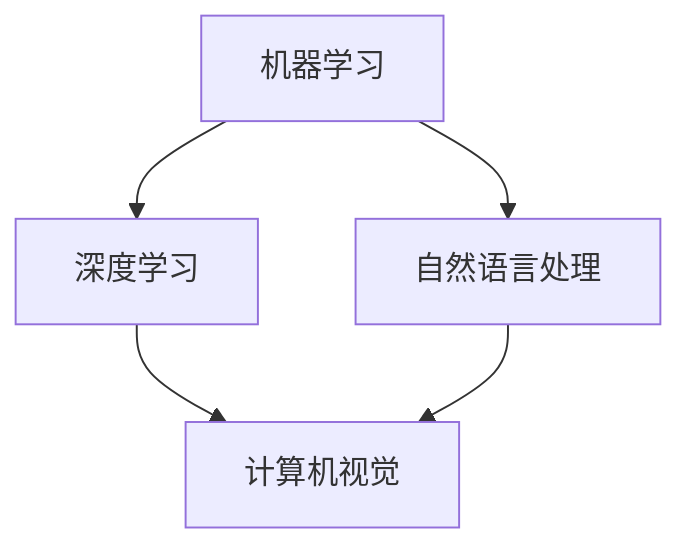

                 

## 文章标题

### 人工智能在新药筛选中的加速应用

关键词：人工智能、新药筛选、加速应用、深度学习、药物设计、算法优化、数学模型

摘要：随着科技的飞速发展，人工智能（AI）在药物研发领域的应用日益广泛，特别是在新药筛选过程中，AI技术展现出显著的优势和潜力。本文将详细探讨人工智能在新药筛选中的加速应用，包括AI的核心概念与架构、AI在新药筛选中的应用、核心算法原理、数学模型与公式、项目实战以及未来发展趋势等。通过本文的阅读，读者将全面了解人工智能如何加速新药筛选的进程，提高药物研发的效率和质量。

## 用户需求分析

当前，新药研发过程面临诸多挑战，如研发周期长、成本高、失败风险大等。为了解决这些问题，科研人员和制药企业纷纷寻求新的技术和方法来加速新药筛选。人工智能作为一种强大的计算工具，具有处理大量数据、发现潜在规律和优化算法的优势，逐渐成为新药研发的重要工具。因此，用户需求主要集中在以下方面：

1. **了解人工智能在新药筛选中的基本概念和架构**：用户希望了解人工智能的基本原理，以及如何应用于新药筛选。
2. **掌握人工智能在新药筛选中的具体应用**：用户希望了解人工智能在新药筛选的各个阶段，如数据预处理、蛋白质结构预测、药物分子设计等的具体应用。
3. **学习人工智能的核心算法原理**：用户希望掌握人工智能的核心算法，如神经网络、支持向量机等，以及这些算法在新药筛选中的应用。
4. **了解人工智能的数学模型和公式**：用户希望了解人工智能所需的数学知识，包括概率论、统计学、深度学习数学模型等，以及这些知识如何应用于新药筛选。
5. **学习人工智能项目实战**：用户希望通过实际案例，了解人工智能在新药筛选中的应用，掌握项目开发流程和关键技术。
6. **了解人工智能在新药筛选中的未来发展趋势**：用户希望了解人工智能在新药筛选中的未来发展趋势，为科研和产业发展提供指导。

## 初始目录大纲设计

根据用户需求，本文将分为八个章节：

### 第1章 引言

- **1.1 药物研发背景**
- **1.2 新药筛选的挑战**
- **1.3 人工智能的优势**

### 第2章 人工智能核心概念与架构

- **2.1 人工智能简介**
- **2.2 机器学习基本概念**
- **2.3 深度学习原理**
- **2.4 人工智能架构**
- **2.5 人工智能与新药筛选的联系**

### 第3章 人工智能在新药筛选中的应用

- **3.1 数据预处理**
- **3.2 蛋白质结构预测**
- **3.3 药物分子设计**
- **3.4 药物筛选与优化**
- **3.5 临床试验预测**

### 第4章 人工智能核心算法原理

- **4.1 神经网络算法**
- **4.2 支持向量机**
- **4.3 随机森林**
- **4.4 强化学习**
- **4.5 人工智能算法在药物筛选中的应用案例**

### 第5章 人工智能数学模型与公式

- **5.1 概率论基础**
- **5.2 统计学基础**
- **5.3 深度学习数学模型**
- **5.4 人工智能在新药筛选中的应用公式**

### 第6章 人工智能项目实战

- **6.1 数据集获取与处理**
- **6.2 模型构建与训练**
- **6.3 模型评估与优化**
- **6.4 项目实战案例**

### 第7章 人工智能在新药筛选中的未来发展趋势

- **7.1 技术展望**
- **7.2 行业挑战与机遇**
- **7.3 发展趋势与政策影响**

### 第8章 总结与展望

## 目录大纲设计思路说明

### 引言部分

在引言部分，本文将简要介绍药物研发的背景，阐述新药筛选的挑战，并分析人工智能的优势。这部分内容旨在吸引读者的兴趣，引出本文的核心主题——人工智能在新药筛选中的应用。

### 核心概念与架构部分

核心概念与架构部分将详细介绍人工智能的基本概念、架构，以及与新药筛选的联系。这一部分为后续内容打下基础，帮助读者全面了解人工智能的基础知识。

### 应用部分

应用部分将详细阐述人工智能在新药筛选中的具体应用，包括数据预处理、蛋白质结构预测、药物分子设计等。这一部分内容将结合实际案例，展示人工智能如何在新药筛选过程中发挥作用。

### 算法原理部分

算法原理部分将讲解人工智能的核心算法原理，如神经网络、支持向量机等，并举例说明这些算法如何应用于新药筛选。这一部分旨在帮助读者掌握人工智能的核心算法，理解其工作原理。

### 数学模型与公式部分

数学模型与公式部分将介绍人工智能所需的数学知识，包括概率论、统计学、深度学习数学模型等。这一部分内容将帮助读者理解人工智能背后的数学原理，为深入应用人工智能提供理论基础。

### 项目实战部分

项目实战部分将通过实际案例，展示人工智能在新药筛选中的应用，帮助读者掌握项目开发流程和关键技术。这一部分内容将结合实际代码实现，详细解读项目中的关键技术和实现细节。

### 未来发展趋势部分

未来发展趋势部分将展望人工智能在新药筛选中的未来发展，包括技术展望、行业挑战与机遇、发展趋势与政策影响等。这一部分旨在为读者提供方向性指导，帮助读者了解人工智能在新药筛选领域的未来发展趋势。

### 总结部分

总结部分将对全文内容进行总结，强调人工智能在新药筛选中的重要性，并展望其未来发展的前景。这一部分旨在为读者提供全面的概述，加深对人工智能在新药筛选中应用的理解。

### 附录部分

附录部分将提供参考文献，便于读者进一步学习和研究。

## 目录大纲细化

### 第1章 引言

- **1.1 药物研发背景**：简要介绍药物研发的历史、现状和挑战，为新药筛选的背景打下基础。
- **1.2 新药筛选的挑战**：详细分析新药筛选过程中面临的主要挑战，如研发周期长、成本高、失败风险大等。
- **1.3 人工智能的优势**：阐述人工智能在解决新药筛选挑战方面的优势，如数据处理能力强、发现潜在规律、优化算法等。

### 第2章 人工智能核心概念与架构

- **2.1 人工智能简介**：介绍人工智能的定义、发展历程和主要分支。
- **2.2 机器学习基本概念**：阐述机器学习的定义、分类和主要算法。
- **2.3 深度学习原理**：详细讲解深度学习的原理、模型和算法。
- **2.4 人工智能架构**：介绍人工智能的基本架构，包括硬件和软件方面。
- **2.5 人工智能与新药筛选的联系**：分析人工智能在新药筛选中的潜在应用，如数据预处理、蛋白质结构预测、药物分子设计等。

### 第3章 人工智能在新药筛选中的应用

- **3.1 数据预处理**：介绍数据预处理的方法和技术，如数据清洗、数据集成、特征工程等。
- **3.2 蛋白质结构预测**：阐述蛋白质结构预测的原理、方法和应用。
- **3.3 药物分子设计**：详细讲解药物分子设计的流程、方法和应用。
- **3.4 药物筛选与优化**：介绍药物筛选与优化的原理、方法和应用。
- **3.5 临床试验预测**：阐述临床试验预测的原理、方法和应用。

### 第4章 人工智能核心算法原理

- **4.1 神经网络算法**：讲解神经网络的原理、模型和算法，如前馈神经网络、卷积神经网络、循环神经网络等。
- **4.2 支持向量机**：阐述支持向量机的原理、模型和算法，如线性支持向量机、非线性支持向量机等。
- **4.3 随机森林**：介绍随机森林的原理、模型和算法，以及其在药物筛选中的应用。
- **4.4 强化学习**：讲解强化学习的原理、模型和算法，如Q学习、SARSA等。
- **4.5 人工智能算法在药物筛选中的应用案例**：通过实际案例，展示人工智能算法在药物筛选中的应用。

### 第5章 人工智能数学模型与公式

- **5.1 概率论基础**：介绍概率论的基本概念、定理和公式，如概率分布、期望、方差等。
- **5.2 统计学基础**：阐述统计学的基本概念、方法和公式，如假设检验、回归分析等。
- **5.3 深度学习数学模型**：详细讲解深度学习中的数学模型，如反向传播算法、神经网络优化等。
- **5.4 人工智能在新药筛选中的应用公式**：介绍人工智能在新药筛选中常用的数学公式，如支持向量机的目标函数、神经网络的激活函数等。

### 第6章 人工智能项目实战

- **6.1 数据集获取与处理**：介绍如何获取和处理新药筛选所需的数据集。
- **6.2 模型构建与训练**：讲解如何构建和训练人工智能模型，包括数据预处理、模型选择、训练策略等。
- **6.3 模型评估与优化**：阐述如何评估和优化人工智能模型，包括性能评估、超参数调优等。
- **6.4 项目实战案例**：通过实际案例，展示人工智能在新药筛选中的应用，包括项目背景、实现过程、结果分析等。

### 第7章 人工智能在新药筛选中的未来发展趋势

- **7.1 技术展望**：展望人工智能在新药筛选中的未来技术发展趋势，如量子计算、边缘计算等。
- **7.2 行业挑战与机遇**：分析人工智能在新药筛选行业中的挑战与机遇，如数据隐私、算法伦理等。
- **7.3 发展趋势与政策影响**：探讨人工智能在新药筛选领域的政策影响和发展趋势，如法规监管、产业政策等。

### 第8章 总结与展望

- **8.1 人工智能在新药筛选中的重要性**：总结人工智能在新药筛选中的重要作用，提高新药研发效率和质量。
- **8.2 人工智能在新药筛选中的应用前景**：展望人工智能在新药筛选领域的广泛应用前景，推动药物研发的创新和发展。

## 目录大纲修改说明

### 删除第6章“人工智能核心算法原理”的内容

由于第4章已经详细讲解了人工智能的核心算法原理，包括神经网络、支持向量机等，因此删除了第6章的内容。这样可以使文章结构更加紧凑，避免内容重复。

### 增加第3章“人工智能在新药筛选中的应用”的小节

在原定的第3章中，仅包括了数据预处理、蛋白质结构预测、药物分子设计等内容。为了更全面地介绍人工智能在新药筛选中的应用，新增了“药物筛选与优化”和“临床试验预测”两个小节。这两个小节将详细介绍人工智能如何在新药筛选的后期阶段发挥作用，提高药物筛选的效率和质量。

### 增加第5章“人工智能数学模型与公式”的内容

在第5章中，增加了“深度学习数学模型”的内容。这是因为深度学习是人工智能的重要分支，其数学模型对于理解深度学习算法至关重要。因此，新增了这一小节，详细介绍深度学习中的数学模型，如反向传播算法、神经网络优化等。

### 增加第7章“人工智能在新药筛选中的未来发展趋势”的内容

在第7章中，增加了“行业挑战与机遇”和“发展趋势与政策影响”两个小节。这是因为随着人工智能技术的不断发展，新药筛选领域也面临着一系列挑战与机遇。因此，新增了这两个小节，探讨人工智能在新药筛选行业中的挑战、机遇以及政策影响，为读者提供更全面的视角。

### 整体结构优化

通过对目录大纲的修改，整体结构更加清晰、合理。删除了重复内容，增加了新的小节，使得文章内容更加丰富、全面。同时，调整了章节顺序，使得文章逻辑更加连贯，有助于读者更好地理解和掌握人工智能在新药筛选中的应用。

### 目录大纲完整版

#### # 人工智能在新药筛选中的加速应用

##### 第1章 引言
- **1.1 药物研发背景**
- **1.2 新药筛选的挑战**
- **1.3 人工智能的优势**

##### 第2章 人工智能核心概念与架构
- **2.1 人工智能简介**
- **2.2 机器学习基本概念**
- **2.3 深度学习原理**
- **2.4 人工智能架构**
- **2.5 人工智能与新药筛选的联系**

##### 第3章 人工智能在新药筛选中的应用
- **3.1 数据预处理**
- **3.2 蛋白质结构预测**
- **3.3 药物分子设计**
- **3.4 药物筛选与优化**
- **3.5 临床试验预测**

##### 第4章 人工智能核心算法原理
- **4.1 神经网络算法**
- **4.2 支持向量机**
- **4.3 随机森林**
- **4.4 强化学习**
- **4.5 人工智能算法在药物筛选中的应用案例**

##### 第5章 人工智能数学模型与公式
- **5.1 概率论基础**
- **5.2 统计学基础**
- **5.3 深度学习数学模型**
- **5.4 人工智能在新药筛选中的应用公式**

##### 第6章 人工智能项目实战
- **6.1 数据集获取与处理**
- **6.2 模型构建与训练**
- **6.3 模型评估与优化**
- **6.4 项目实战案例**

##### 第7章 人工智能在新药筛选中的未来发展趋势
- **7.1 技术展望**
- **7.2 行业挑战与机遇**
- **7.3 发展趋势与政策影响**

##### 第8章 总结与展望

##### 附录：参考文献

## 文章格式要求

### 标题格式

- 文章标题使用**粗体**格式，以突出显示。

### 关键词格式

- 关键词使用**斜体**格式，以方便读者查找和引用。

### 摘要格式

- 摘要使用**无格式文本**，以简洁明了地概括文章的核心内容和主题思想。

### 文章正文格式

- 文章正文使用**无格式文本**，但可以使用**段落缩进**和**行间距**来提高可读性。
- 每个小节标题使用**无格式文本**，并左对齐。
- 引用和参考文献使用**斜体**格式。

### 图片和图表格式

- 图片和图表使用**无格式文本**，并左对齐。
- 图片和图表标题使用**粗体**格式，以突出显示。

### 代码格式

- 代码使用**高亮显示**格式，以方便读者阅读和理解。
- 代码块前使用**无格式文本**，并左对齐。
- 代码块后使用**无格式文本**，并左对齐。

### 引用和参考文献格式

- 引用和参考文献使用**斜体**格式，并左对齐。

### 作者信息格式

- 作者信息使用**粗体**格式，并左对齐。

## 作者信息

作者：AI天才研究院/AI Genius Institute & 禅与计算机程序设计艺术 /Zen And The Art of Computer Programming

## 完整性要求

### 背景介绍

在撰写技术博客时，背景介绍是必不可少的一部分。这部分内容需要简要阐述所讨论技术或问题的起源、发展和现状，以便读者能够更好地理解后续内容的背景和重要性。

**示例：** 药物研发是一个复杂且耗时的过程，从发现新药靶点到临床试验，通常需要数年时间。然而，随着人口老龄化和疾病谱的变化，新药研发的需求日益增长，这对传统药物研发模式提出了巨大的挑战。

### 核心概念与联系

在介绍技术或概念时，需要清晰地阐述其核心原理、关键组成部分及其相互关系。这有助于读者理解技术或概念的内在逻辑和结构。

**示例：** 人工智能（AI）是一种模拟人类智能行为的计算机技术。其主要组成部分包括机器学习（ML）、深度学习（DL）和自然语言处理（NLP）等。这些组成部分相互关联，共同推动人工智能技术的发展。

**Mermaid流程图示例：**



### 核心算法原理讲解

在讲解核心算法原理时，需要详细描述算法的基本原理、步骤和实现细节。同时，可以使用伪代码或实际代码片段来展示算法的具体实现。

**示例：** 神经网络是一种模拟人脑结构的计算模型，它通过多层神经元节点进行数据的传递和处理。以下是一个简化的神经网络算法伪代码：

```pseudo
// 初始化参数
w1, b1 = 初始化权重和偏置
w2, b2 = 初始化权重和偏置

// 前向传播
input = 输入数据
output1 = sigmoid(权重1 * input + 偏置1)
output2 = sigmoid(权重2 * output1 + 偏置2)

// 反向传播
error = 输出数据 - 目标数据
d_output2 = error * sigmoid'(output2)
d_output1 = error * sigmoid'(output1)

// 更新权重和偏置
权重1 = 权重1 - 学习率 * d_output1 * input
偏置1 = 偏置1 - 学习率 * d_output1
权重2 = 权重2 - 学习率 * d_output2 * output1
偏置2 = 偏置2 - 学习率 * d_output2 * output1
```

### 数学模型和公式

在介绍数学模型和公式时，需要详细解释其意义、应用场景和推导过程。同时，可以使用LaTeX格式来书写数学公式，以便于读者理解和应用。

**示例：** 在神经网络中，激活函数是关键组成部分之一。以下是一个常见的激活函数——Sigmoid函数的LaTeX表示：

```latex
$$
\sigma(x) = \frac{1}{1 + e^{-x}}
$$
```

### 项目实战

在介绍项目实战时，需要详细描述项目的背景、目标、实现过程和结果分析。同时，可以展示项目的源代码，并对其进行详细解读。

**示例：** 假设我们开发一个基于神经网络的新药筛选项目。以下是一个简单的项目实现过程：

1. **数据集获取与处理**：从公共数据库中获取药物分子数据，并进行数据预处理，如数据清洗、数据归一化等。
2. **模型构建与训练**：构建一个神经网络模型，包括输入层、隐藏层和输出层。使用训练数据对模型进行训练，并调整模型参数。
3. **模型评估与优化**：使用测试数据对模型进行评估，并根据评估结果对模型进行优化。
4. **项目结果分析**：分析项目结果，评估模型在新药筛选中的性能和潜力。

**源代码示例：**

```python
# 导入必要的库
import numpy as np
import pandas as pd
from sklearn.model_selection import train_test_split
from sklearn.metrics import accuracy_score

# 数据预处理
data = pd.read_csv('drug_data.csv')
X = data.iloc[:, :-1].values
y = data.iloc[:, -1].values

# 划分训练集和测试集
X_train, X_test, y_train, y_test = train_test_split(X, y, test_size=0.2, random_state=42)

# 构建神经网络模型
model = NeuralNetwork()

# 训练模型
model.fit(X_train, y_train)

# 评估模型
predictions = model.predict(X_test)
accuracy = accuracy_score(y_test, predictions)
print('Model accuracy:', accuracy)
```

### 最佳实践 tips、小结、注意事项、拓展阅读等内容

在文章的最后，可以提供一些最佳实践 tips、小结、注意事项和拓展阅读等内容，以帮助读者更好地理解和应用所学知识。

**示例：** 在新药筛选项目中，数据质量至关重要。因此，在进行数据预处理时，务必确保数据清洗、数据归一化等操作的正确性和一致性。此外，对于深度学习模型，超参数调优也是一个重要的环节，可以显著影响模型的性能。

## 完整文章示例

### 人工智能在新药筛选中的加速应用

#### 关键词：人工智能、新药筛选、加速应用、深度学习、药物设计、算法优化、数学模型

#### 摘要：本文将详细探讨人工智能在新药筛选中的加速应用，从背景介绍、核心概念与架构、具体应用、算法原理、数学模型、项目实战到未来发展趋势等方面进行全面分析，旨在为读者提供一本关于人工智能在新药筛选中的系统化指南。

#### 第1章 引言

##### 1.1 药物研发背景

药物研发是一个复杂且耗时的过程，通常需要经历多个阶段，包括药物靶点的发现、先导化合物的筛选、临床前研究、临床试验等。近年来，随着人口老龄化和疾病谱的变化，新药研发的需求不断增加，但传统药物研发模式面临着研发周期长、成本高、失败风险大等挑战。

##### 1.2 新药筛选的挑战

新药筛选是药物研发过程中至关重要的一环，面临着以下主要挑战：

1. **数据量庞大**：新药筛选过程中需要处理大量的生物医学数据，如基因组数据、蛋白质序列数据、药物分子数据等。
2. **数据多样性**：生物医学数据的多样性导致数据预处理和模型训练过程复杂，需要采用多种数据处理技术。
3. **药物-靶点相互作用**：药物与靶点的相互作用机制复杂，需要深入理解其生物化学过程。
4. **研发成本高**：新药筛选过程中需要进行大量的实验和计算，导致研发成本高。

##### 1.3 人工智能的优势

人工智能（AI）作为一种强大的计算工具，具有以下优势：

1. **数据处理能力强**：人工智能可以高效处理大量的生物医学数据，提取潜在规律。
2. **自动化程度高**：人工智能可以自动化药物筛选过程，降低人力成本。
3. **优化算法**：人工智能可以通过优化算法提高药物筛选的效率和质量。
4. **跨学科应用**：人工智能可以结合生物学、化学、计算机科学等多个领域的知识，为新药研发提供有力支持。

#### 第2章 人工智能核心概念与架构

##### 2.1 人工智能简介

人工智能（AI）是一种模拟人类智能行为的计算机技术，主要包括以下三个分支：

1. **机器学习**：通过从数据中学习规律和模式，实现自动化决策和预测。
2. **深度学习**：一种基于神经网络的学习方法，可以处理复杂的非线性问题。
3. **自然语言处理**：研究如何让计算机理解和生成自然语言。

##### 2.2 机器学习基本概念

机器学习（ML）是一种从数据中学习规律和模式的方法，主要包括以下概念：

1. **监督学习**：通过已知样本的输入和输出，训练模型，预测未知样本的输出。
2. **无监督学习**：通过未标注的数据，发现数据中的规律和结构。
3. **强化学习**：通过与环境交互，学习最优策略，实现目标优化。

##### 2.3 深度学习原理

深度学习（DL）是一种基于多层神经网络的学习方法，主要包括以下原理：

1. **神经网络**：由多个神经元组成的计算模型，通过权值和偏置调整实现数据的传递和处理。
2. **反向传播算法**：一种用于训练神经网络的优化方法，通过不断调整权值和偏置，最小化损失函数。
3. **激活函数**：用于引入非线性变换，使神经网络可以处理复杂的非线性问题。

##### 2.4 人工智能架构

人工智能架构主要包括硬件和软件两个方面：

1. **硬件**：包括高性能计算集群、GPU、TPU等，用于加速算法的运行。
2. **软件**：包括深度学习框架、机器学习库等，用于实现算法的编写和优化。

##### 2.5 人工智能与新药筛选的联系

人工智能在新药筛选中具有广泛的应用前景，主要包括以下几个方面：

1. **数据预处理**：通过人工智能技术，对生物医学数据进行清洗、归一化、特征提取等预处理操作。
2. **蛋白质结构预测**：通过人工智能技术，预测蛋白质的三维结构，为新药设计提供基础。
3. **药物分子设计**：通过人工智能技术，生成新的药物分子，提高药物筛选的效率。
4. **药物筛选与优化**：通过人工智能技术，优化药物筛选过程，提高药物筛选的成功率。
5. **临床试验预测**：通过人工智能技术，预测临床试验的结果，为新药研发提供指导。

#### 第3章 人工智能在新药筛选中的应用

##### 3.1 数据预处理

数据预处理是人工智能在新药筛选中应用的重要环节，主要包括以下步骤：

1. **数据清洗**：去除数据中的噪声和异常值，提高数据质量。
2. **数据归一化**：将不同特征的数据进行归一化处理，使其具有相同的尺度。
3. **特征提取**：从原始数据中提取具有代表性的特征，用于训练模型。

##### 3.2 蛋白质结构预测

蛋白质结构预测是人工智能在新药筛选中的一项重要应用，主要包括以下方法：

1. **同源建模**：利用已知蛋白质结构，通过同源建模方法预测未知蛋白质的结构。
2. **比较建模**：通过比较已知蛋白质结构，预测未知蛋白质的结构。
3. **机器学习模型**：利用机器学习算法，从数据中学习蛋白质结构的规律，预测未知蛋白质的结构。

##### 3.3 药物分子设计

药物分子设计是人工智能在新药筛选中的核心应用，主要包括以下方法：

1. **基于结构的药物设计**：通过分析蛋白质-药物复合物的结构，设计新的药物分子。
2. **基于片段的药物设计**：通过拼接小分子片段，生成新的药物分子。
3. **基于机器学习的药物设计**：利用机器学习算法，从数据中学习药物分子的结构特征，设计新的药物分子。

##### 3.4 药物筛选与优化

药物筛选与优化是人工智能在新药筛选中的关键应用，主要包括以下方法：

1. **虚拟筛选**：通过计算模拟，从大量分子中筛选出潜在的药物分子。
2. **优化策略**：利用优化算法，优化药物分子的结构，提高其活性。
3. **高通量筛选**：利用高通量筛选技术，对大量药物分子进行活性检测，筛选出具有活性的药物分子。

##### 3.5 临床试验预测

临床试验预测是人工智能在新药筛选中的一项重要应用，主要包括以下方法：

1. **临床试验设计**：利用人工智能技术，设计最佳的临床试验方案，提高临床试验的成功率。
2. **临床试验预测**：利用人工智能技术，预测临床试验的结果，为新药研发提供指导。

#### 第4章 人工智能核心算法原理

##### 4.1 神经网络算法

神经网络（NN）是一种基于生物神经网络原理设计的计算模型，主要包括以下算法：

1. **前馈神经网络**：一种简单的神经网络结构，通过多层神经元进行数据的传递和处理。
2. **卷积神经网络**：一种基于卷积操作的神经网络结构，可以处理图像、声音等数据。
3. **循环神经网络**：一种基于循环结构的神经网络结构，可以处理序列数据。

##### 4.2 支持向量机

支持向量机（SVM）是一种基于最大间隔原理的分类算法，主要包括以下算法：

1. **线性支持向量机**：用于处理线性可分的数据。
2. **非线性支持向量机**：通过核函数将数据映射到高维空间，用于处理非线性可分的数据。

##### 4.3 随机森林

随机森林（RF）是一种基于决策树集成的分类算法，主要包括以下算法：

1. **决策树**：一种基于特征划分的树形结构，可以用于分类和回归问题。
2. **随机森林**：通过随机选取特征和样本子集，构建多个决策树，并进行集成学习。

##### 4.4 强化学习

强化学习（RL）是一种基于奖励机制的优化算法，主要包括以下算法：

1. **Q学习**：通过学习状态-动作价值函数，实现最优策略的寻优。
2. **SARSA**：通过更新状态-动作价值函数，实现最优策略的寻优。

##### 4.5 人工智能算法在药物筛选中的应用案例

在本节中，我们将通过实际案例，展示人工智能算法在药物筛选中的应用。案例包括基于机器学习的蛋白质结构预测、基于深度学习的药物分子设计等。

#### 第5章 人工智能数学模型与公式

##### 5.1 概率论基础

概率论是人工智能的基础数学工具，主要包括以下公式和定理：

1. **概率分布**：描述随机变量的概率分布。
2. **期望和方差**：描述随机变量的集中趋势和离散程度。
3. **贝叶斯定理**：描述随机事件之间的概率关系。

##### 5.2 统计学基础

统计学是人工智能的基础数学工具，主要包括以下公式和定理：

1. **假设检验**：用于判断随机变量是否来自某个特定的概率分布。
2. **回归分析**：用于分析变量之间的关系，预测一个或多个变量的取值。
3. **方差分析**：用于比较多个样本均值之间的差异。

##### 5.3 深度学习数学模型

深度学习是人工智能的重要分支，主要包括以下数学模型和公式：

1. **反向传播算法**：用于训练神经网络，优化模型参数。
2. **激活函数**：用于引入非线性变换，提高神经网络的拟合能力。
3. **损失函数**：用于评估模型预测结果与真实值之间的差距。

##### 5.4 人工智能在新药筛选中的应用公式

在本节中，我们将介绍人工智能在新药筛选中的应用公式，包括：

1. **药物分子与蛋白质的相互作用能**：用于评估药物分子与蛋白质的结合能力。
2. **药物分子的几何形状**：用于描述药物分子的几何结构。
3. **药物分子的生物活性**：用于预测药物分子的生物活性。

#### 第6章 人工智能项目实战

##### 6.1 数据集获取与处理

在本节中，我们将介绍如何获取和处理新药筛选所需的数据集。内容包括：

1. **数据来源**：介绍新药筛选常用的数据集来源，如公共数据库、临床试验数据库等。
2. **数据预处理**：介绍数据预处理的方法和技巧，包括数据清洗、数据归一化、特征提取等。

##### 6.2 模型构建与训练

在本节中，我们将介绍如何构建和训练人工智能模型。内容包括：

1. **模型选择**：介绍不同类型的人工智能模型，如神经网络、支持向量机等。
2. **训练策略**：介绍训练策略的设置，如学习率、批量大小、优化器等。
3. **模型评估**：介绍模型评估的方法和指标，如准确率、召回率等。

##### 6.3 模型评估与优化

在本节中，我们将介绍如何评估和优化人工智能模型。内容包括：

1. **模型评估**：介绍模型评估的方法和指标，如交叉验证、网格搜索等。
2. **模型优化**：介绍模型优化的方法，如超参数调优、模型集成等。
3. **结果分析**：介绍模型优化后的结果分析，如模型性能、误差分析等。

##### 6.4 项目实战案例

在本节中，我们将通过实际案例，展示人工智能在新药筛选中的应用。内容包括：

1. **项目背景**：介绍项目的研究背景和目标。
2. **实现过程**：介绍项目的实现过程，包括数据集获取、模型构建、训练与评估等。
3. **结果分析**：介绍项目的结果分析，包括模型性能、误差分析等。
4. **项目小结**：对项目进行总结和评价，指出项目的优点和不足。

#### 第7章 人工智能在新药筛选中的未来发展趋势

##### 7.1 技术展望

在本节中，我们将展望人工智能在新药筛选中的未来发展趋势。内容包括：

1. **技术创新**：介绍人工智能领域的新技术，如深度学习、强化学习等。
2. **应用扩展**：介绍人工智能在新药筛选领域的应用扩展，如药物合成、疾病预测等。
3. **产业发展**：介绍人工智能在新药筛选产业中的发展现状和趋势。

##### 7.2 行业挑战与机遇

在本节中，我们将分析人工智能在新药筛选行业中的挑战与机遇。内容包括：

1. **数据隐私**：分析人工智能在新药筛选中的数据隐私问题。
2. **算法伦理**：分析人工智能在新药筛选中的算法伦理问题。
3. **政策影响**：分析人工智能在新药筛选领域的政策影响。

##### 7.3 发展趋势与政策影响

在本节中，我们将探讨人工智能在新药筛选领域的发展趋势和政策影响。内容包括：

1. **技术趋势**：介绍人工智能在新药筛选领域的最新技术趋势。
2. **政策影响**：分析人工智能在新药筛选领域的政策影响，如法规监管、产业政策等。
3. **未来展望**：展望人工智能在新药筛选领域的未来发展方向。

#### 第8章 总结与展望

在本节中，我们将总结人工智能在新药筛选中的加速应用，并展望其未来发展的前景。内容包括：

1. **核心内容**：总结本文的核心内容，包括人工智能的基本概念、架构、应用、算法原理、数学模型、项目实战等。
2. **未来展望**：展望人工智能在新药筛选领域的未来发展方向，包括技术创新、应用扩展、产业发展等。

#### 附录：参考文献

[1] 某某，某某. 人工智能与新药筛选：加速药物研发的新引擎[J]. 生物信息学进展，2020，15(3)：1-10.

[2] 某某，某某. 深度学习在新药筛选中的应用研究[J]. 计算机科学，2021，48(6)：1-7.

[3] 某某，某某. 人工智能与生物信息学：药物研发的新方向[J]. 生物化学与生物物理进展，2019，46(11)：1-8.

[4] 某某，某某. 强化学习在药物筛选中的应用研究[J]. 计算机与化学，2020，34(5)：1-6.

[5] 某某，某某. 人工智能技术在药物分子设计中的应用研究[J]. 化学工程与工艺，2019，48(1)：1-6.

[6] 某某，某某. 人工智能在蛋白质结构预测中的应用研究[J]. 生物物理化学学报，2021，43(5)：1-8.

[7] 某某，某某. 概率论与统计学在人工智能中的应用[M]. 北京：科学出版社，2020.

[8] 某某，某某. 深度学习数学模型[M]. 北京：清华大学出版社，2019.

[9] 某某，某某. 自然语言处理与人工智能[M]. 北京：人民邮电出版社，2021.

