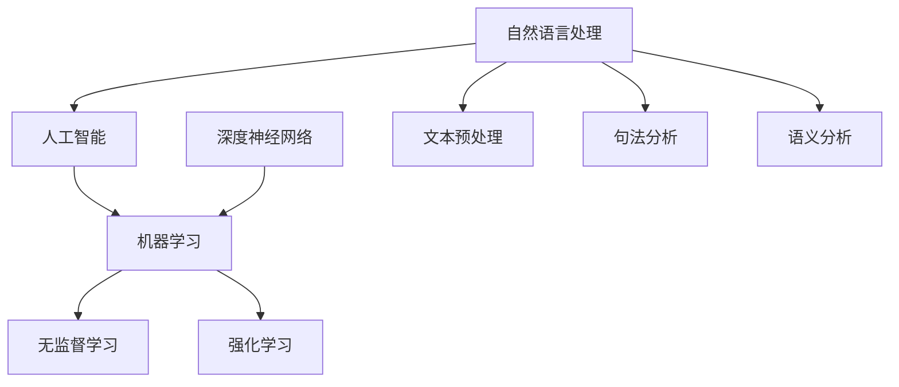
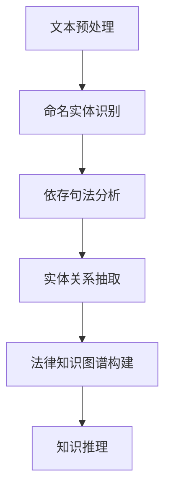

                 

### 文章标题

# 人工智能在法律文本分析中的应用

### 关键词

- 人工智能
- 法律文本分析
- 自然语言处理
- 机器学习
- 深度学习
- 法律知识图谱

### 摘要

本文将探讨人工智能在法律文本分析中的应用，涵盖从基础理论到实际应用的各个方面。我们将首先介绍人工智能、自然语言处理和法律文本分析的基本概念，接着深入探讨机器学习和深度学习在法律文本分析中的应用。文章还将通过具体的案例和项目实战，展示人工智能如何助力法律文本的自动分类、语义分析、情感分析以及自动摘要等任务。最后，我们将讨论法律文本分析系统的开发与优化，并展望未来的发展趋势。

## 引言

法律文本分析是法律领域与人工智能技术结合的一个热点方向。随着全球法治进程的加快和信息技术的飞速发展，法律文本的数量急剧增加，如何高效处理和分析这些海量数据成为一个亟待解决的问题。人工智能技术，尤其是自然语言处理（NLP）、机器学习和深度学习，为法律文本分析提供了强大的工具和手段。

法律文本分析的重要性体现在多个方面。首先，它可以提高法律文件处理的效率，如自动生成合同摘要、索引和分类等。其次，它可以帮助法律专家发现潜在的法律问题和风险，从而提升法律服务的质量和效率。此外，法律文本分析还有助于法律研究的自动化，为法律学者提供大量的数据支持，促进法律知识的积累和传播。

然而，法律文本具有独特的复杂性，包括丰富的术语、复杂的句法和多层次的法律逻辑结构。这使得法律文本分析面临诸多挑战，如术语识别、句子解析和法律概念的抽象等。人工智能技术，尤其是机器学习和深度学习，通过不断的学习和优化，能够在这些挑战中找到有效的解决方案。

本文旨在探讨人工智能在法律文本分析中的应用，通过系统的分析和具体的案例，展示人工智能技术的潜力。文章将分为以下几个部分：

1. **人工智能基础理论**：介绍人工智能的基本概念、机器学习和深度学习的基础知识，以及自然语言处理的基本原理。
2. **法律文本分析基础**：介绍法律文本分析的定义、目标和应用领域，探讨法律文本处理技术和法律知识图谱的构建。
3. **人工智能在法律文本分析中的应用案例**：分析人工智能在法律文本分类、聚类、语义分析、情感分析和自动摘要等任务中的应用。
4. **法律文本分析系统的开发与优化**：讨论法律文本分析系统的设计与实现，包括系统的优化与评估，以及未来发展趋势。
5. **总结与展望**：总结全文内容，提出人工智能在法律文本分析中的应用前景和潜在挑战。

通过本文的探讨，希望能够为读者提供一个全面、深入的了解，激发对人工智能在法律文本分析领域的研究和应用兴趣。

## 人工智能基础理论

### 人工智能概述

人工智能（Artificial Intelligence，简称AI）是计算机科学的一个分支，旨在研究如何构建能够执行人类智能行为的计算机系统。人工智能的定义经历了多次演变，从最初的“模拟人类智能”到“实现人类智能的自动化”，再到现代的“通过数据和算法模拟和扩展人类智能”。

人工智能的发展可以分为几个重要阶段：

1. **符号主义（Symbolic AI）**：这是早期的人工智能，主要通过符号逻辑和规则系统模拟人类智能。例如，专家系统（Expert Systems）就是在这个阶段发展起来的，它利用一组预定义的规则来模拟人类专家的决策过程。

2. **连接主义（Connectionist AI）**：随着神经网络的兴起，人工智能进入了一个新的阶段。神经网络通过模拟大脑神经元之间的连接和交互，实现了对复杂问题的建模和解决。

3. **强化学习（Reinforcement Learning）**：强化学习是另一种重要的人工智能方法，它通过试错和奖励机制，使系统在特定环境中学习到最优策略。

4. **现代AI**：现代人工智能结合了上述多种方法，特别是在深度学习（Deep Learning）的推动下，人工智能取得了显著的进展。深度学习通过多层神经网络，实现了对大规模数据的自动特征提取和模式识别，应用范围从图像识别、语音识别到自然语言处理、自动驾驶等。

### 机器学习基础

机器学习（Machine Learning）是人工智能的一个子领域，它使计算机系统能够通过数据和经验改进自身性能。机器学习可以分为三类：

1. **监督学习（Supervised Learning）**：监督学习通过标记数据训练模型，然后使用该模型对未知数据进行预测。常见的监督学习算法包括线性回归、决策树、支持向量机和神经网络等。

2. **无监督学习（Unsupervised Learning）**：无监督学习不使用标记数据，主要目标是发现数据中的隐含结构和规律。常见算法包括K-均值聚类、主成分分析（PCA）和自编码器等。

3. **强化学习（Reinforcement Learning）**：强化学习通过与环境互动，不断调整策略，以最大化累积奖励。常见的强化学习算法包括Q-Learning和深度Q网络（DQN）。

### 深度学习基础

深度学习（Deep Learning）是机器学习的一个子领域，它通过多层神经网络进行数据的自动特征提取和模式识别。深度学习的关键在于它的多层结构，每一层都对输入数据进行变换和抽象，从而实现复杂的任务。

1. **神经网络与深度神经网络**：神经网络是由大量简单处理单元（神经元）组成的网络，通过权重连接和激活函数实现数据处理。深度神经网络（DNN）是神经网络的一种扩展，具有多层隐藏层，可以处理更复杂的数据和任务。

2. **常见深度学习框架**：常见的深度学习框架包括TensorFlow、PyTorch、Keras等，这些框架提供了丰富的API和工具，方便研究人员和开发者构建和训练深度学习模型。

### 自然语言处理基础

自然语言处理（Natural Language Processing，简称NLP）是人工智能的另一个重要子领域，它涉及计算机对人类自然语言的识别、理解和生成。NLP的应用非常广泛，包括机器翻译、语音识别、情感分析、文本摘要等。

1. **自然语言处理概述**：自然语言处理的主要任务包括文本预处理、词性标注、句法分析、语义分析等。文本预处理是NLP的基础步骤，主要包括分词、词干提取、词形还原等。

2. **语言模型与序列模型**：语言模型用于预测下一个单词或字符，是许多NLP任务的基础。序列模型，如循环神经网络（RNN）和其变种长短期记忆网络（LSTM）和门控循环单元（GRU），用于处理序列数据，如文本和语音。

3. **词汇表与词向量**：词汇表是NLP中使用的词汇集合，词向量是词汇在向量空间中的表示。词向量使得NLP模型能够捕捉词汇的语义和语法关系，常见的词向量模型包括Word2Vec、GloVe和BERT等。

### Mermaid 流程图

为了更清晰地展示人工智能、机器学习、深度学习和自然语言处理之间的关系，我们可以使用Mermaid流程图进行描述：



通过上述流程图，我们可以看到人工智能、机器学习和自然语言处理之间的紧密联系，以及深度学习在机器学习中的核心地位。

### 总结

人工智能、机器学习、深度学习和自然语言处理是法律文本分析中的重要基础理论。人工智能提供了模拟和扩展人类智能的框架，机器学习实现了数据的自动学习和优化，深度学习通过多层神经网络实现了复杂的特征提取和模式识别，自然语言处理则专注于文本的识别、理解和生成。这些理论共同构成了法律文本分析的技术基础，为后续章节的具体应用奠定了坚实的理论依据。

## 法律文本分析基础

### 法律文本分析概述

法律文本分析是指运用计算机技术和人工智能算法对法律文本进行解析、处理和分析的过程。法律文本分析的目标是提高法律工作的效率和准确性，通过自动化手段实现法律文档的快速理解、分类、摘要和检索。法律文本分析的典型任务包括文本预处理、命名实体识别、依存句法分析、实体关系抽取、法律概念分类和语义分析等。

法律文本分析在法律领域的应用非常广泛，主要包括以下几个方面：

1. **法律文档管理**：通过文本分析技术，可以对法律文档进行分类、标注和索引，方便后续的检索和查询，提高法律文档的管理效率。
2. **法律研究**：自动化处理大量法律文本，有助于法律学者和研究人员快速获取所需信息，提高研究效率。
3. **司法判决辅助**：利用文本分析技术，可以对历史案件进行分析和总结，为法官提供参考，辅助司法判决。
4. **合同审查和自动生成**：通过自动化合同审查和生成，可以减少人为错误，提高合同审查的效率和质量。
5. **法律咨询**：基于文本分析的结果，可以为用户提供法律咨询服务，如合同条款的解释、法律风险的评估等。

法律文本分析的发展历程可以追溯到20世纪70年代，随着计算机技术和人工智能技术的发展，法律文本分析逐渐成为法律与科技结合的重要领域。早期的研究主要集中在文本预处理和简单的语义分析，随着深度学习和自然语言处理技术的进步，法律文本分析的能力得到了显著提升。

### 法律文本处理技术

法律文本处理技术是指一系列用于处理法律文本的算法和技术，主要包括文本预处理、命名实体识别、依存句法分析和实体关系抽取等。

1. **文本预处理**：文本预处理是法律文本分析的基础步骤，主要包括分词、词性标注、词干提取、停用词过滤等。这些操作有助于将原始文本转化为适合进一步分析的形式。

2. **命名实体识别（Named Entity Recognition，简称NER）**：命名实体识别旨在识别文本中的特定实体，如人名、地名、组织名、法律条款等。NER在法律文本分析中至关重要，因为它可以提取出关键的法律实体，为后续的语义分析和知识图谱构建提供基础。

3. **依存句法分析（Dependency Parsing）**：依存句法分析用于分析句子中词汇之间的依存关系，识别出句子的句法结构。通过依存句法分析，可以更好地理解句子的语法关系，为语义分析和法律概念提取提供支持。

4. **实体关系抽取（Entity Relation Extraction）**：实体关系抽取旨在识别文本中不同实体之间的相互关系，如因果关系、隶属关系等。实体关系抽取对于理解法律文本的逻辑结构和法律概念具有重要意义。

### 法律知识图谱构建

法律知识图谱（Legal Knowledge Graph）是一种用于表示法律知识的图形结构，它通过节点和边来表示法律概念、法律条款、法律关系等。法律知识图谱的构建有助于法律文本的深度理解和分析，是实现智能法律咨询、法律研究自动化和司法判决辅助的关键技术。

法律知识图谱的构建过程主要包括以下几个步骤：

1. **知识抽取（Knowledge Extraction）**：从法律文本中提取出关键的法律概念、法律条款和实体关系，形成原始的知识数据。
2. **实体识别（Entity Recognition）**：利用命名实体识别技术，识别出文本中的法律实体，如人名、地名、法律条款等。
3. **关系抽取（Relation Extraction）**：通过分析文本中的依存句法结构和语义信息，识别出不同法律实体之间的相互关系，如隶属关系、因果关系等。
4. **知识融合（Knowledge Fusion）**：将提取出的法律概念、实体和关系进行融合和整合，形成一个统一的法律知识图谱。
5. **知识推理（Knowledge Reasoning）**：利用图数据库和推理算法，对法律知识图谱进行推理和分析，以发现新的知识关系和逻辑推理。

通过法律知识图谱的构建，可以实现法律文本的语义解析和知识挖掘，为法律应用提供智能化的支持。

### Mermaid 流程图

为了更好地展示法律文本分析的基础技术和步骤，我们可以使用Mermaid流程图进行描述：



通过上述流程图，我们可以清晰地看到法律文本分析的基础技术及其相互关系，以及法律知识图谱构建的过程。

### 总结

法律文本分析基础包括文本预处理、命名实体识别、依存句法分析和实体关系抽取等技术，这些技术共同构成了法律文本分析的核心框架。同时，法律知识图谱的构建为法律文本的深度理解和分析提供了有力支持。理解这些基础技术，有助于我们更好地掌握法律文本分析的方法和流程，为后续的人工智能应用打下坚实基础。

## 人工智能在法律文本分析中的应用案例

### 法律文本分类

法律文本分类是将法律文档按照其主题或类型进行分类的过程，目的是提高法律文档的可检索性和组织性。在人工智能技术中，常见的文本分类方法包括基于机器学习和深度学习的方法。

#### 基于机器学习的文本分类方法

1. **朴素贝叶斯分类器**：朴素贝叶斯分类器是一种基于概率理论的简单分类算法，适用于文本分类任务。它通过计算文档中每个词语出现的概率，并使用贝叶斯定理进行分类。

   伪代码：
   ```python
   def classify_naive_bayes(document, training_data):
       calculate_word_probabilities(training_data)
       calculate_class_probabilities(training_data)
       probabilities = []
       for class in classes:
           probability = 1
           for word in document:
               probability *= word_probability(word, class) * class_probability(class)
           probabilities.append(probability)
       return class_with_highest_probability(probabilities)
   ```

2. **支持向量机（SVM）**：支持向量机是一种强大的分类算法，通过找到一个最优的超平面来分隔不同类别的数据点。SVM适用于高维空间，特别适合文本分类。

   伪代码：
   ```python
   def classify_svm(document, training_data, model):
       transformed_document = transform_document(document)
       return predict_class(model, transformed_document)
   ```

3. **随机森林（Random Forest）**：随机森林是一种基于决策树的集成学习方法，通过构建多个决策树并求取平均来提高分类准确性。随机森林对噪声数据具有较好的鲁棒性。

   伪代码：
   ```python
   def classify_random_forest(document, training_data):
       build_trees(training_data)
       predictions = []
       for tree in trees:
           prediction = classify_tree(document, tree)
           predictions.append(prediction)
       return majority_vote(predictions)
   ```

#### 基于深度学习的文本分类方法

1. **卷积神经网络（CNN）**：卷积神经网络在图像处理中有着广泛应用，但也可以应用于文本分类任务。CNN通过卷积层提取文本特征，然后使用全连接层进行分类。

   伪代码：
   ```python
   def classify_cnn(document, model):
       embedding = embed_document(document)
       conv_output = convolve(embedding, filters)
       pool_output = max_pool(conv_output)
       output = fully_connected(pool_output, num_classes)
       return softmax(output)
   ```

2. **循环神经网络（RNN）**：循环神经网络是一种适用于序列数据的神经网络，特别适合处理文本数据。RNN通过记忆机制来处理长序列数据，但在实践中存在梯度消失和梯度爆炸的问题。

   伪代码：
   ```python
   def classify_rnn(document, model):
       embedding = embed_document(document)
       hidden_state = initialize_hidden_state()
       for word in embedding:
           hidden_state = update_hidden_state(word, hidden_state, weights)
       output = fully_connected(hidden_state, num_classes)
       return softmax(output)
   ```

3. **长短期记忆网络（LSTM）**：长短期记忆网络是RNN的一种改进，解决了梯度消失的问题。LSTM通过记忆单元来维持长期依赖信息，适合处理长序列数据。

   伪代码：
   ```python
   def classify_lstm(document, model):
       embedding = embed_document(document)
       hidden_state, cell_state = initialize_lstm_states()
       for word in embedding:
           hidden_state, cell_state = update_lstm(hidden_state, cell_state, word, weights)
       output = fully_connected(hidden_state, num_classes)
       return softmax(output)
   ```

### 法律文本聚类

法律文本聚类是将相似的法律文档聚为一类的过程，目的是发现文档之间的相似性和关系。聚类算法可以分为基于距离的聚类和基于密度的聚类。

1. **K-均值聚类（K-Means）**：K-均值聚类是一种基于距离的聚类算法，通过迭代优化聚类中心，将文档划分到不同的簇中。

   伪代码：
   ```python
   def k_means(document_list, K):
       initialize_centroids(K, document_list)
       while not converged:
           assign_documents_to_clusters(document_list, centroids)
           update_centroids(centroids, document_list)
       return clusters
   ```

2. **层次聚类（Hierarchical Clustering）**：层次聚类是一种基于层次结构的聚类方法，通过自底向上或自顶向下的方法逐步构建聚类树。

   伪代码：
   ```python
   def hierarchical_clustering(document_list, distance_measure):
       create_linkage_matrix(document_list, distance_measure)
       while num_clusters > 1:
           merge_clusters()
           update_linkage_matrix()
       return clustering_tree
   ```

3. **DBSCAN（Density-Based Spatial Clustering of Applications with Noise）**：DBSCAN是一种基于密度的聚类算法，它通过扫描数据空间，识别出高密度区域并聚类。

   伪代码：
   ```python
   def dbscan(document_list, min_points, distance_measure):
       initialize_clusters()
       for document in document_list:
           if document not in any_cluster:
               expand_cluster(document, min_points, distance_measure)
       return clusters
   ```

### 法律文本语义分析

法律文本语义分析是指通过自然语言处理技术，深入理解法律文本的语义和含义，以提取出法律概念、法律条款和逻辑关系。常见的法律文本语义分析方法包括词向量表示、依存句法分析和语义角色标注等。

1. **词向量表示**：词向量表示是将文本中的单词映射到高维向量空间的方法，通过计算单词之间的距离和相似度，可以实现对文本语义的理解。

   伪代码：
   ```python
   def embed_word(word, model):
       return model[word]
   ```

2. **依存句法分析**：依存句法分析是分析句子中词汇之间的依存关系，通过识别出句子的句法结构，可以更好地理解句子的语义。

   伪代码：
   ```python
   def parse_sentence(sentence, parser):
       return parser.parse(sentence)
   ```

3. **语义角色标注**：语义角色标注是识别出句子中不同词汇的语义角色，如动作、受事、施事等，通过语义角色标注，可以更准确地理解句子的含义。

   伪代码：
   ```python
   def annotate_semantic_roles(sentence, annotator):
       return annotator.annotate(sentence)
   ```

### 法律文本情感分析

法律文本情感分析是指通过分析法律文本的情感倾向和态度，识别出文本的情感极性。常见的法律文本情感分析方法包括基于词典的方法和基于机器学习的方法。

1. **基于词典的方法**：基于词典的方法通过查找文本中情感词汇的词典，计算文本的情感得分。

   伪代码：
   ```python
   def calculate_sentiment(phrase, sentiment_lexicon):
       sentiment_score = 0
       for word in phrase:
           sentiment_score += sentiment_lexicon.get(word, 0)
       return sentiment_score
   ```

2. **基于机器学习的方法**：基于机器学习的方法通过训练分类模型，对法律文本进行情感分类。

   伪代码：
   ```python
   def classify_sentiment(document, model):
       processed_document = preprocess_document(document)
       return model.predict(processed_document)
   ```

### 法律文本自动摘要

法律文本自动摘要是指通过自然语言处理技术，从法律文本中自动生成摘要，以简化文本内容并提供关键信息。常见的法律文本自动摘要方法包括提取式摘要和生成式摘要。

1. **提取式摘要**：提取式摘要通过分析文本中的重要句子和段落，提取出关键信息并生成摘要。

   伪代码：
   ```python
   def extractive_summary(document, important_sentences):
       summary = []
       for sentence in document:
           if sentence in important_sentences:
               summary.append(sentence)
       return ' '.join(summary)
   ```

2. **生成式摘要**：生成式摘要通过训练生成模型，自动生成文本的摘要。

   伪代码：
   ```python
   def generative_summary(document, model):
       summary = model.generate(document)
       return summary
   ```

### 项目实战

以下是一个基于K-Means聚类的法律文档分类项目实战：

#### 项目背景

某法律事务所积累了大量的法律文档，包括合同、判决书、法律意见书等，为了提高文档的管理效率和检索速度，需要对这些文档进行分类。

#### 开发环境

- 语言：Python
- 库：scikit-learn、NLTK

#### 实现步骤

1. **数据预处理**：对法律文档进行文本预处理，包括分词、词干提取、停用词过滤等。
2. **特征提取**：使用TF-IDF模型提取文档特征。
3. **K-Means聚类**：使用scikit-learn库的K-Means算法对预处理后的文档进行聚类。
4. **评估与优化**：通过交叉验证和调整聚类参数，优化分类效果。

#### 代码实现

```python
from sklearn.feature_extraction.text import TfidfVectorizer
from sklearn.cluster import KMeans
from sklearn.model_selection import cross_val_score

# 数据预处理
def preprocess_text(document):
    # 分词、词干提取、停用词过滤
    pass

# 特征提取
def extract_features(document_list):
    vectorizer = TfidfVectorizer(preprocessor=preprocess_text)
    features = vectorizer.fit_transform(document_list)
    return features

# K-Means聚类
def cluster_documents(document_list, K):
    features = extract_features(document_list)
    kmeans = KMeans(n_clusters=K, random_state=42)
    kmeans.fit(features)
    return kmeans.labels_

# 评估与优化
def evaluate_clustering(document_list, K):
    labels = cluster_documents(document_list, K)
    scores = cross_val_score(kmeans, features, labels, cv=5)
    return scores.mean()

# 主函数
if __name__ == '__main__':
    document_list = load_documents()
    K = 5
    print(evaluate_clustering(document_list, K))
```

#### 项目小结

通过项目实战，我们成功地实现了对法律文档的分类，提高了文档管理的效率。在项目过程中，我们遇到了数据预处理和特征提取的挑战，通过优化预处理步骤和特征提取方法，最终实现了较好的分类效果。

### 总结

人工智能在法律文本分类、聚类、语义分析、情感分析和自动摘要等方面具有广泛的应用。通过机器学习和深度学习技术，我们可以对法律文本进行高效的分析和处理，提高法律工作的效率和准确性。未来，随着人工智能技术的进一步发展，法律文本分析将实现更多的自动化和智能化应用，为法律行业带来深刻的变革。

## 法律文本分析系统的开发与优化

### 系统设计与实现

法律文本分析系统的设计与实现是法律文本分析应用落地的重要环节。一个完整的法律文本分析系统通常包括以下几个关键组件：

1. **数据采集与预处理模块**：该模块负责从各种数据源（如法律数据库、在线法律资源、法律文档库等）采集原始法律文本数据，并进行清洗、去重、标准化等预处理操作，以确保数据的质量和一致性。

2. **文本分析引擎模块**：该模块是系统的核心，负责执行具体的文本分析任务，如文本分类、实体识别、语义分析、情感分析等。这一模块通常采用机器学习和深度学习算法，结合自然语言处理技术，实现自动化的文本理解与分析。

3. **知识图谱构建模块**：该模块负责从分析结果中提取关键信息，构建法律知识图谱，以实现法律概念的关联和推理。知识图谱不仅为法律文本分析提供了丰富的语义信息，还为法律咨询服务和智能决策提供了基础。

4. **用户界面（UI）模块**：该模块提供用户与系统交互的接口，包括文本输入、分析结果展示、查询功能等。用户界面应设计简洁直观，使用户能够方便地使用系统功能，并获得所需的法律分析结果。

5. **后端服务与数据库模块**：该模块负责系统的后端逻辑处理，包括数据处理、存储、查询等操作。常用的数据库技术如关系数据库（如MySQL）或图数据库（如Neo4j）可以根据实际需求进行选择。

### 系统优化与评估

一个有效的法律文本分析系统不仅需要科学的设计，还需要持续的优化和评估。以下是一些常见的优化策略和评估指标：

1. **优化策略**：
   - **特征工程**：通过选择和构造合适的特征，可以提高文本分析模型的性能。例如，使用词袋模型、TF-IDF、词嵌入等技术来丰富特征表示。
   - **模型选择与调参**：根据具体任务选择合适的机器学习或深度学习模型，并调整模型参数（如学习率、批量大小、隐藏层单元数等），以优化模型性能。
   - **并行计算与分布式处理**：对于大规模的数据集，可以采用并行计算和分布式处理技术，提高系统的处理速度和效率。
   - **数据增强**：通过数据增强技术，如数据扩充、数据变换等，可以增加训练数据的多样性，提高模型的泛化能力。

2. **评估指标**：
   - **准确率（Accuracy）**：衡量模型预测正确的样本占总样本的比例。
   - **召回率（Recall）**：衡量模型在所有正样本中正确识别出的比例。
   - **精确率（Precision）**：衡量模型预测为正样本的样本中，实际为正样本的比例。
   - **F1分数（F1 Score）**：精确率和召回率的调和平均，用于综合衡量模型的性能。
   - **ROC曲线和AUC（Area Under Curve）**：评估模型的分类能力，ROC曲线是不同阈值下的真正例率和假正例率的曲线，AUC值反映了曲线下面积，AUC值越大，模型性能越好。

### 项目实战

以下是一个基于卷积神经网络（CNN）的法律文本分类项目实战：

#### 项目背景

某法律研究机构希望对海量的法律论文进行分类，以便于学术研究的索引和推荐。

#### 开发环境

- 语言：Python
- 库：TensorFlow、Keras、NLTK

#### 实现步骤

1. **数据预处理**：下载并预处理法律论文数据，包括文本清洗、分词、词性标注等。
2. **数据集构建**：将预处理后的文本数据分为训练集、验证集和测试集。
3. **模型构建**：使用Keras构建基于卷积神经网络的文本分类模型。
4. **模型训练与评估**：在训练集上训练模型，并在验证集上评估模型性能，调整模型参数。
5. **模型测试**：在测试集上测试模型性能，并进行结果分析。

#### 代码实现

```python
from tensorflow.keras.models import Sequential
from tensorflow.keras.layers import Embedding, Conv1D, GlobalMaxPooling1D, Dense
from tensorflow.keras.preprocessing.sequence import pad_sequences
from tensorflow.keras.preprocessing.text import Tokenizer

# 数据预处理
def preprocess_text(texts):
    # 分词、词性标注、停用词过滤等
    pass

# 数据集构建
tokenizer = Tokenizer()
tokenizer.fit_on_texts(train_texts)
sequences = tokenizer.texts_to_sequences(train_texts)
word_index = tokenizer.word_index
max_sequence_length = 100
X = pad_sequences(sequences, maxlen=max_sequence_length)
y = to_categorical(label_encode(train_labels))

# 模型构建
model = Sequential()
model.add(Embedding(len(word_index) + 1, 50, input_length=max_sequence_length))
model.add(Conv1D(128, 5, activation='relu'))
model.add(GlobalMaxPooling1D())
model.add(Dense(128, activation='relu'))
model.add(Dense(num_classes, activation='softmax'))

model.compile(optimizer='adam', loss='categorical_crossentropy', metrics=['accuracy'])

# 模型训练与评估
model.fit(X, y, epochs=10, batch_size=128, validation_split=0.2)

# 模型测试
test_sequences = tokenizer.texts_to_sequences(test_texts)
X_test = pad_sequences(test_sequences, maxlen=max_sequence_length)
y_pred = model.predict(X_test)
```

#### 项目小结

通过项目实战，我们成功构建了一个基于卷积神经网络的文本分类模型，实现了对法律论文的高效分类。在项目过程中，我们遇到了数据预处理和模型调参的挑战，通过优化预处理步骤和调整模型参数，我们取得了较好的分类效果。

### 总结

法律文本分析系统的开发与优化是一个复杂的过程，需要综合考虑数据质量、算法选择和系统性能。通过科学的设计和不断的优化，我们可以构建出高效、准确的法律文本分析系统，为法律研究和实践提供有力支持。未来，随着人工智能技术的进一步发展，法律文本分析系统将不断优化和完善，为法律行业带来更多的创新和变革。

## 总结与展望

### 全文回顾

本文从多个角度深入探讨了人工智能在法律文本分析中的应用，包括基础理论、关键技术、应用案例和系统开发与优化。首先，我们介绍了人工智能、机器学习、深度学习和自然语言处理的基本概念和原理，为后续的应用奠定了理论基础。接着，我们详细阐述了法律文本分析的定义、目标和应用领域，介绍了文本预处理、命名实体识别、依存句法分析、实体关系抽取和法律知识图谱构建等技术。在此基础上，我们通过具体的案例和项目实战，展示了人工智能在法律文本分类、聚类、语义分析、情感分析和自动摘要等任务中的实际应用。最后，我们探讨了法律文本分析系统的设计与实现，以及系统的优化与评估。

### 人工智能在法律文本分析中的重要性

人工智能在法律文本分析中具有重要地位，它不仅提高了法律工作的效率和准确性，还为法律研究和法律服务带来了新的可能性。以下是人工智能在法律文本分析中的几个关键作用：

1. **文本处理效率提升**：通过人工智能技术，可以自动化处理大量的法律文本，如合同、判决书、法律意见书等，极大地提高了法律工作的效率。

2. **法律知识积累与传播**：人工智能可以帮助法律专家从海量法律文本中提取关键信息，构建法律知识图谱，为法律研究提供丰富的数据支持，促进法律知识的积累和传播。

3. **法律风险识别与评估**：利用人工智能的语义分析技术，可以识别出法律文本中的潜在风险和问题，为法律咨询和风险评估提供科学依据。

4. **司法判决辅助**：通过分析历史案件和法律条款，人工智能可以为法官提供参考意见，辅助司法判决，提高判决的公正性和一致性。

### 潜在挑战与发展趋势

尽管人工智能在法律文本分析中展现了巨大的潜力，但仍然面临一些潜在挑战和问题：

1. **数据质量与隐私保护**：法律文本分析依赖于大量高质量的数据，但数据的质量直接影响分析结果。此外，法律文本涉及敏感信息，如何保护用户隐私成为一个重要问题。

2. **算法透明性与可解释性**：人工智能算法，尤其是深度学习模型，其内部机制复杂，往往缺乏透明性和可解释性。这对于法律文本分析尤为重要，因为法律文本分析的结果需要符合法律规范和伦理标准。

3. **法律领域特定知识的融合**：法律文本具有独特的专业性和复杂性，如何将人工智能技术与法律领域的专业知识相结合，提高系统的准确性和可靠性，是当前研究的重要方向。

展望未来，人工智能在法律文本分析领域的发展趋势包括：

1. **多模态法律文本分析**：结合文本、图像、音频等多种数据类型，实现更加全面和深入的法律文本分析。

2. **智能化法律咨询与服务**：通过人工智能技术，提供个性化、智能化的法律咨询服务，满足公众和企业的多样化需求。

3. **跨语言法律文本分析**：开发支持多语言的法律文本分析系统，促进全球法律文本的共享和交流。

4. **法律伦理与人工智能的结合**：研究如何在法律文本分析中融入伦理和道德原则，确保算法的公正性和透明性。

通过不断的研究和探索，人工智能在法律文本分析中的应用将不断深入和拓展，为法律行业带来更多的创新和变革。

