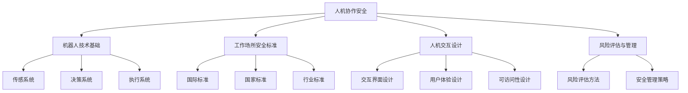

                 

### 文章标题：人机协作安全：多功能机器人的工作场所安全标准

#### 关键词：人机协作、安全标准、多功能机器人、工作场所、风险评估

#### 摘要：
本文旨在探讨人机协作安全在多功能机器人工作场所的重要性，详细分析其背景、核心概念、技术基础、安全标准、人机交互设计、风险评估与管理，并通过实际案例展示安全标准的实施与应用。文章最后对未来人机协作安全的趋势进行展望，为企业提供实用指导，助力人机协作安全的发展。

### 设计《人机协作安全：多功能机器人的工作场所安全标准》的目录大纲

#### 第一步：确定书的核心章节

**核心章节内容：**

1. **人机协作安全概述**：介绍人机协作安全的概念、背景和重要性。
2. **机器人技术基础**：探讨机器人的基本原理和技术，包括传感、决策和执行系统。
3. **工作场所安全标准**：详细阐述机器人工作场所的安全标准和法规。
4. **人机交互设计**：研究如何设计安全、高效的人机交互界面。
5. **风险评估与管理**：介绍风险评估的方法和安全管理策略。
6. **案例分析**：通过具体案例展示人机协作安全在实际应用中的挑战和解决方案。
7. **未来展望**：探讨人机协作安全的未来发展趋势。

#### 第二步：细化每个章节的内容

**第1章：人机协作安全概述**

## 1.1 人机协作安全的概念与背景
### 1.1.1 人机协作的定义
### 1.1.2 人机协作的安全需求
### 1.1.3 人机协作安全的重要性

## 1.2 机器人技术基础
### 1.2.1 机器人的基本原理
### 1.2.2 传感系统
### 1.2.3 决策系统
### 1.2.4 执行系统

## 1.3 工作场所安全标准的现状
### 1.3.1 国际安全标准
### 1.3.2 国内安全标准
### 1.3.3 安全标准的异同与影响

## 1.4 人机交互设计
### 1.4.1 人机交互界面设计原则
### 1.4.2 人机交互界面设计方法
### 1.4.3 安全性在交互设计中的应用

**第2章：机器人技术基础**

## 2.1 机器人的基本原理
### 2.1.1 机器人的定义与分类
### 2.1.2 机器人技术的发展历程
### 2.1.3 机器人的核心组成部分

## 2.2 传感系统
### 2.2.1 传感器的基本原理
### 2.2.2 常见传感器的类型与应用
### 2.2.3 传感技术在机器人中的应用

## 2.3 决策系统
### 2.3.1 决策系统的功能与架构
### 2.3.2 决策算法的基本原理
### 2.3.3 决策系统在机器人中的应用

## 2.4 执行系统
### 2.4.1 执行系统的功能与架构
### 2.4.2 执行机构的基本原理
### 2.4.3 执行系统在机器人中的应用

**第3章：工作场所安全标准**

## 3.1 安全标准概述
### 3.1.1 安全标准的重要性
### 3.1.2 安全标准的分类与内容

## 3.2 国际安全标准
### 3.2.1 ISO/IEC 27001标准
### 3.2.2 IEC 61439标准
### 3.2.3 其他国际安全标准

## 3.3 国内安全标准
### 3.3.1 国家标准
### 3.3.2 行业标准
### 3.3.3 地方标准

## 3.4 安全标准的异同与影响
### 3.4.1 国际与国内安全标准的异同
### 3.4.2 安全标准对企业的影响

**第4章：人机交互设计**

## 4.1 人机交互界面设计原则
### 4.1.1 安全性原则
### 4.1.2 用户体验原则
### 4.1.3 可访问性原则

## 4.2 人机交互界面设计方法
### 4.2.1 界面布局设计
### 4.2.2 控件设计
### 4.2.3 反馈机制设计

## 4.3 安全性在交互设计中的应用
### 4.3.1 安全协议设计
### 4.3.2 故障处理设计
### 4.3.3 用户权限管理设计

**第5章：风险评估与管理**

## 5.1 风险评估概述
### 5.1.1 风险评估的定义与目的
### 5.1.2 风险评估的方法
### 5.1.3 风险评估流程

## 5.2 风险评估方法
### 5.2.1 定量风险评估方法
### 5.2.2 定性风险评估方法
### 5.2.3 风险评估工具与应用

## 5.3 安全管理策略
### 5.3.1 安全管理组织架构
### 5.3.2 安全管理流程
### 5.3.3 安全培训与意识提升

**第6章：案例分析**

## 6.1 案例背景
### 6.1.1 案例企业介绍
### 6.1.2 案例场景描述

## 6.2 安全问题与挑战
### 6.2.1 安全问题分析
### 6.2.2 安全挑战与解决方案

## 6.3 案例分析与总结
### 6.3.1 案例效果评估
### 6.3.2 案例对企业的启示

**第7章：未来展望**

## 7.1 人机协作安全的趋势
### 7.1.1 技术发展趋势
### 7.1.2 法规政策趋势
### 7.1.3 行业应用趋势

## 7.2 安全标准的完善与改进
### 7.2.1 标准制定的方向
### 7.2.2 标准实施的挑战
### 7.2.3 标准改进的建议

## 7.3 企业发展建议
### 7.3.1 安全管理体系的建立
### 7.3.2 技术创新的推动
### 7.3.3 人才培养与引进

### 格式要求：文章内容使用markdown格式输出。

### 作者：AI天才研究院/AI Genius Institute & 禅与计算机程序设计艺术 /Zen And The Art of Computer Programming

### 完整性要求：文章内容必须要完整，每个小节的内容必须要丰富具体详细讲解，核心内容必须要包含：

* 背景介绍
* 核心概念与联系：必须给出核心概念原理之间的关系架构 Mermaid 流程图
* 核心算法原理讲解必须使用伪代码来详细阐述；数学模型和公式 & 详细讲解 & 举例说明
* 数学公式请使用latex格式，嵌入文中独立段落的latex公式前后使用 $$ 括起来(例如：$$1+1=2$$ )，段落内的latex公式前后使用 $ 括起来(例如：$1<2$)
* 项目实战：开发环境搭建，源代码详细实现和代码解读，代码应用解读与分析，实际案例分析和详细讲解剖析，项目小结
* 最佳实践 tips、小结、注意事项、拓展阅读等内容

### 文章字数要求：文章字数在 8000 ～ 12000 字左右。

### 文章开始是“文章标题”，然后是“文章关键词”和“文章摘要”部分的内容哦，接下来是按照目录大纲结构的文章正文部分的内容。

## 人机协作安全：多功能机器人的工作场所安全标准

### 背景介绍

随着机器人技术的快速发展，多功能机器人在各个行业中的应用越来越广泛。它们在制造业、医疗、物流、教育等领域发挥着重要作用，提高了工作效率，降低了人力成本。然而，随着机器人与人类在工作场所的紧密协作，安全问题日益凸显。如何确保人机协作的安全，已经成为企业和学术界关注的焦点。

人机协作安全涉及到多个方面，包括机器人的设计、应用、管理以及人机交互等。首先，机器人需要具备一定的安全特性，例如可靠的传感系统、精确的决策能力和安全的执行系统。其次，工作场所的安全标准需要不断更新和完善，以适应机器人技术的发展。此外，人机交互的设计也至关重要，良好的交互界面可以提高工作效率，减少事故发生的可能性。最后，风险评估与管理是确保人机协作安全的关键环节，通过对潜在风险进行评估和管理，可以最大限度地减少事故发生。

本文将围绕人机协作安全这一主题，详细探讨其背景、核心概念、技术基础、安全标准、人机交互设计、风险评估与管理，并通过实际案例展示安全标准的实施与应用。文章最后对未来人机协作安全的趋势进行展望，为企业提供实用指导，助力人机协作安全的发展。

### 核心概念与联系

在人机协作安全中，以下几个核心概念紧密相连，构成了一个完整的安全架构：

1. **人机协作安全（Human-Robot Collaboration Safety）**：指在人类和机器人共同工作的环境中，确保双方的安全和效率。它涵盖了机器人的设计、应用和管理，以及人与机器人的交互。

2. **机器人技术基础（Robotics Technology Foundation）**：包括传感系统、决策系统和执行系统。传感系统负责获取环境信息，决策系统根据这些信息做出决策，执行系统则根据决策执行任务。

3. **工作场所安全标准（Occupational Safety Standards）**：规定了机器人工作场所的安全要求和规范。这些标准旨在保障工作人员和机器人的安全，防止意外事故的发生。

4. **人机交互设计（Human-Robot Interaction Design）**：涉及设计安全、高效的人机交互界面，确保操作者能够准确、迅速地与机器人沟通，提高工作效率。

5. **风险评估与管理（Risk Assessment and Management）**：通过识别和评估潜在风险，制定安全管理策略，降低事故发生的可能性。

下面是一个简化的 Mermaid 流程图，展示了这些核心概念之间的联系：

通过这个流程图，我们可以清晰地看到人机协作安全是一个多维度的复杂系统，各个组成部分相互关联，共同作用，确保人机协作的安全和高效。

### 机器人技术基础

要确保人机协作安全，首先需要了解机器人技术的基础。机器人是一种能够执行人类指令、自主移动和工作的智能设备。它们在各个行业中得到了广泛应用，如制造业、医疗、物流和教育等。以下是机器人技术的基础组成部分：

#### 1. 机器人的基本原理

**定义与分类**：机器人可以根据不同的分类标准进行分类。按照功能，机器人可以分为工业机器人、服务机器人、医疗机器人和农业机器人等。按照结构，机器人可以分为关节式机器人、多自由度机器人和轮式机器人等。

**发展历程**：机器人技术的发展经历了多个阶段。从20世纪50年代的工业机器人，到20世纪80年代的服务机器人，再到21世纪初的智能机器人，机器人技术不断进步，功能日益完善。

**核心组成部分**：机器人主要由传感系统、决策系统和执行系统组成。

1. **传感系统**：负责感知周围环境，获取各种信息，如视觉、听觉、触觉和温度等。
2. **决策系统**：根据传感系统提供的信息，利用算法和模型进行决策，确定下一步行动。
3. **执行系统**：根据决策系统的指令执行具体任务，如搬运、装配和清洁等。

#### 2. 传感系统

**基本原理**：传感系统是机器人的“感官”，它们通过各种传感器获取环境信息。传感器可以是无源的，如温度传感器、湿度传感器等，也可以是有源的，如雷达、激光雷达（Lidar）等。

**常见传感器的类型与应用**：

- **视觉传感器**：用于获取图像和视频信息，广泛应用于物体识别、路径规划和图像处理等领域。
- **力传感器**：用于测量物体施加的力，用于精密装配和抓取任务。
- **超声波传感器**：用于测量距离和速度，常用于导航和避障。
- **温度传感器**：用于测量环境温度，广泛应用于工业生产和医疗设备。
- **雷达传感器**：用于测量物体的距离和速度，常用于自动驾驶和无人机。

**传感技术在机器人中的应用**：传感系统在机器人中的应用十分广泛。例如，在工业机器人中，视觉传感器用于识别和跟踪工件，力传感器用于确保装配的精度；在服务机器人中，语音传感器和触摸传感器用于与人类进行交互，提高用户体验。

#### 3. 决策系统

**功能与架构**：决策系统是机器人的“大脑”，负责根据传感系统提供的信息，利用算法和模型进行决策，以实现特定任务。

- **功能**：决策系统的主要功能包括目标识别、路径规划、任务分配、障碍物检测和避障等。
- **架构**：决策系统通常由以下几个模块组成：
  - **感知模块**：接收传感系统提供的信息。
  - **推理模块**：利用算法和模型对感知信息进行分析和处理。
  - **规划模块**：根据处理结果生成行动策略。

**决策算法的基本原理**：决策算法是决策系统的核心，常用的算法包括基于规则的推理、遗传算法、深度学习和强化学习等。

- **基于规则的推理**：根据预设的规则，对感知信息进行判断和决策。
- **遗传算法**：模拟生物进化过程，通过迭代优化找到最优解。
- **深度学习**：利用神经网络对大量数据进行训练，自动学习特征和模式。
- **强化学习**：通过试错和奖励机制，逐步优化决策策略。

**决策系统在机器人中的应用**：决策系统在机器人中的应用非常广泛。例如，在自动驾驶汽车中，决策系统用于路径规划和障碍物检测；在工业机器人中，决策系统用于任务分配和路径规划，确保机器人高效、安全地完成任务。

#### 4. 执行系统

**功能与架构**：执行系统是机器人的“肌肉”，负责根据决策系统的指令执行具体任务。

- **功能**：执行系统的主要功能包括机械运动、力控制、温控和声控等。
- **架构**：执行系统通常由以下几个模块组成：
  - **电机驱动模块**：控制机器人的运动。
  - **执行机构模块**：执行具体的动作，如机械臂、轮子等。
  - **反馈模块**：监测执行系统的状态，为决策系统提供反馈。

**执行机构的基本原理**：执行机构是执行系统的核心，常用的执行机构包括机械臂、轮式移动平台和无人机等。

- **机械臂**：通过关节和电机实现复杂的机械运动，常用于工业装配、医疗手术和家政服务等。
- **轮式移动平台**：通过轮子实现移动，适用于室内外环境，如自动驾驶汽车、无人机等。
- **无人机**：通过螺旋桨和电机实现飞行，广泛应用于监控、测绘和物流等领域。

**执行系统在机器人中的应用**：执行系统在机器人中的应用非常广泛。例如，在工业机器人中，机械臂用于搬运和装配工件；在服务机器人中，轮式移动平台用于自主导航和移动；在无人机中，执行系统用于飞行和任务执行。

综上所述，机器人技术基础是确保人机协作安全的重要一环。通过对机器人基本原理、传感系统、决策系统和执行系统的深入理解，我们可以更好地设计、应用和管理机器人，确保人机协作的安全和高效。

### 工作场所安全标准的现状

随着机器人技术的迅猛发展，其在各个行业的应用日益广泛。然而，随着机器人在工作场所的普及，安全问题也日益凸显。为了确保人机协作的安全，各国和行业制定了相应的安全标准，以规范机器人的设计、应用和管理。以下是国际和国内安全标准的现状：

#### 1. 国际安全标准

**ISO/IEC 27001标准**：该标准是国际标准化组织（ISO）和国际电工委员会（IEC）共同制定的，旨在提供信息安全管理的最佳实践。它涵盖了信息安全管理的政策、组织、风险评估、安全控制、监视和审核等方面，对于保障机器人系统的安全性具有重要意义。

**IEC 61439标准**：该标准是国际电工委员会（IEC）制定的，旨在规范工业机器人的设计和应用。它包括机器人的安全设计、安全控制系统、传感器和执行系统的安全要求，是确保机器人工作场所安全的重要标准。

**其他国际安全标准**：除了ISO/IEC 27001和IEC 61439标准，还有其他一些国际安全标准，如ISO 10218标准（机器人安全规范）、ISO 15066标准（机器人与自动化系统 - 机器人的可及空间 - 安全要求）等。这些标准从不同角度对机器人工作场所的安全进行了规范。

#### 2. 国内安全标准

**国家标准**：国内有关机器人安全的国家标准主要包括GB/T 23826标准（机器人安全规范）、GB/T 26548标准（机器人系统安全规范）等。这些标准规定了机器人的设计、应用和管理等方面的安全要求，旨在提高机器人工作场所的安全水平。

**行业标准**：除了国家标准，一些行业也制定了相应的行业标准。例如，机械工业联合会发布的JB/T 10002标准（工业机器人安全规范）、中国航空工业标准HB 6155标准（航空机器人安全规范）等。这些行业标准针对特定行业的机器人安全要求进行了详细规定。

**地方标准**：部分地方政府也制定了地方标准，如上海市发布的《上海市机器人安全规范》。这些地方标准结合了地方实际情况，对机器人安全提出了更高要求。

#### 3. 安全标准的异同与影响

**国际与国内安全标准的异同**：

- **内容范围**：国际安全标准通常涵盖了机器人的设计、应用和管理等多个方面，而国内安全标准则更多地关注机器人的设计和应用。
- **执行力度**：国际安全标准主要依赖于企业自觉执行，而国内安全标准则更加注重政府的监管和执法力度。
- **更新速度**：国际安全标准更新速度较快，以适应机器人技术的发展，而国内安全标准更新速度相对较慢。

**安全标准对企业的影响**：

- **规范行为**：安全标准为企业提供了明确的行为规范，有助于企业提高安全管理水平。
- **降低风险**：遵循安全标准可以降低机器人工作场所的安全风险，减少事故发生的可能性。
- **提高竞争力**：具备高水平的安全标准，可以提高企业的竞争力，吸引更多客户和合作伙伴。
- **合规性要求**：对于出口到国际市场的企业，遵循国际安全标准是必要的合规性要求，有助于产品顺利进入国际市场。

综上所述，工作场所安全标准在确保人机协作安全中起着至关重要的作用。通过国际和国内安全标准的制定和实施，可以规范机器人工作场所的安全行为，降低风险，提高企业的竞争力。然而，由于标准内容范围、执行力度和更新速度的差异，企业需要根据自身实际情况，选择合适的安全标准进行遵循和实施。

### 人机交互设计

在人机协作安全中，人机交互设计是一个关键环节。一个安全、高效的人机交互界面不仅能够提高工作效率，还能降低事故发生的可能性。以下是人机交互设计的几个核心原则和方法：

#### 1. 人机交互界面设计原则

**安全性原则**：在交互界面设计中，首先要确保安全性。这包括防止误操作、避免数据泄露、保障用户的隐私等。例如，通过权限管理、数据加密和访问控制等技术手段，确保只有授权用户才能访问系统。

**用户体验原则**：良好的用户体验可以提高用户的工作效率和工作满意度。在交互界面设计中，应关注用户的需求和习惯，提供简洁、直观的界面和操作方式。例如，采用符合用户预期的图标、颜色和布局，简化操作步骤，提高系统的易用性。

**可访问性原则**：交互界面应确保所有用户，包括残疾人、老年人等，都能方便地使用系统。这包括提供语音提示、屏幕阅读器支持、键盘导航等功能，使系统更加包容和友好。

#### 2. 人机交互界面设计方法

**界面布局设计**：界面布局设计是交互设计的基础。一个合理的布局能够提高用户对界面的理解和操作效率。例如，采用网格布局、图标布局或卡片布局等，使界面内容有序、直观。

**控件设计**：控件是用户与系统交互的主要方式。良好的控件设计可以提高用户的操作体验。例如，按钮、开关、文本框、下拉菜单等控件应具有清晰的指示和操作反馈，使用户一目了然。

**反馈机制设计**：及时、准确的反馈机制可以指导用户进行正确操作。例如，当用户执行某个操作时，系统应提供实时反馈，如声音、视觉或文本提示，告知用户操作是否成功。

#### 3. 安全性在交互设计中的应用

**安全协议设计**：在交互界面中，应采用安全协议，如HTTPS、TLS等，确保数据传输的安全性。此外，还应设置登录验证、身份认证等机制，防止未授权用户访问系统。

**故障处理设计**：当系统出现故障时，交互界面应提供清晰的故障提示和解决方案。例如，当机器人发生故障时，界面可以显示故障代码、故障原因和修复建议，帮助用户快速解决问题。

**用户权限管理设计**：用户权限管理是保障系统安全的重要措施。通过设置不同的用户角色和权限，确保用户只能访问和执行其权限范围内的操作，防止越权操作和恶意行为。

总之，人机交互设计在确保人机协作安全中至关重要。通过遵循安全性、用户体验和可访问性原则，采用合理的界面布局、控件设计和反馈机制，以及应用安全协议、故障处理和用户权限管理，可以设计出安全、高效的人机交互界面，为人机协作安全提供有力保障。

### 风险评估与管理

在人机协作安全中，风险评估与管理是一个关键环节。通过识别、评估和管理潜在风险，可以降低事故发生的可能性，确保人机协作的安全和高效。以下是风险评估与管理的基本概念、方法、工具和安全管理策略。

#### 1. 风险评估概述

**定义与目的**：风险评估是指通过系统的方法，识别和分析潜在风险，评估其可能性和影响，从而制定相应的管理策略。在机器人工作场所，风险评估的目的是确保人机协作的安全，降低事故发生的概率，保护工作人员和机器人的安全。

**方法**：风险评估通常包括以下几个步骤：

- **风险识别**：识别可能影响人机协作安全的风险因素，如技术故障、操作失误、环境变化等。
- **风险分析**：对识别出的风险进行定量和定性分析，评估其可能性和影响。
- **风险评价**：根据风险评估结果，确定风险等级，制定相应的管理策略。
- **风险控制**：实施风险控制措施，降低风险等级，确保人机协作的安全。

**流程**：风险评估的流程通常包括以下几个阶段：

- **准备阶段**：确定风险评估的目标、范围和资源，组建评估团队。
- **识别阶段**：通过调查、访谈、观察等方法，识别潜在的风险因素。
- **分析阶段**：对识别出的风险因素进行分析，评估其可能性和影响。
- **评价阶段**：根据分析结果，确定风险等级，制定风险应对策略。
- **实施阶段**：实施风险控制措施，监测风险变化，调整管理策略。

#### 2. 风险评估方法

**定量风险评估方法**：定量风险评估方法通过量化数据，对风险因素进行定量分析，以便更准确地评估风险。常用的定量风险评估方法包括：

- **概率分析**：通过计算风险事件发生的概率，评估风险。
- **蒙特卡洛模拟**：通过模拟风险事件的发生过程，评估风险。
- **故障树分析**（FTA）：通过构建故障树，分析风险事件的可能原因和后果。
- **事件树分析**（ETA）：通过构建事件树，分析风险事件的发展过程和结果。

**定性风险评估方法**：定性风险评估方法主要通过专家判断和经验，对风险因素进行分析和评估。常用的定性风险评估方法包括：

- **风险矩阵法**：通过建立风险矩阵，对风险因素进行评分和评估。
- **层次分析法**（AHP）：通过构建层次结构模型，对风险因素进行相对权重分析。
- **模糊综合评判法**：通过模糊数学方法，对风险因素进行综合评估。

**风险评估工具与应用**：在实际风险评估过程中，可以采用各种风险评估工具，以提高评估的效率和准确性。常用的风险评估工具包括：

- **风险管理软件**：如Risk Manager、Risk Analyzer等，用于自动化进行风险评估。
- **风险矩阵图**：用于直观展示风险因素及其评估结果。
- **风险评估表**：用于记录和分析风险因素。

#### 3. 安全管理策略

**安全管理组织架构**：建立完善的安全管理组织架构，明确各级安全管理职责，确保安全管理措施的有效实施。

**安全管理流程**：制定明确的安全管理流程，包括风险评估、风险控制、安全培训、安全检查等，确保安全管理过程的规范和有序。

**安全培训与意识提升**：通过定期开展安全培训，提高工作人员的安全意识和技能，确保其能够正确、安全地操作机器人。

**安全文化建设**：营造安全文化氛围，使员工认识到安全的重要性，形成良好的安全行为习惯。

**安全监控与应急响应**：建立安全监控系统，实时监测人机协作过程中的安全状况，及时发现问题并进行处理。同时，制定应急预案，确保在发生事故时能够迅速响应和处置。

总之，风险评估与管理是确保人机协作安全的关键环节。通过科学的风险评估方法、合理的风险管理策略和有效的安全管理措施，可以降低人机协作过程中的安全风险，保障工作人员和机器人的安全。

### 案例分析

为了更好地展示人机协作安全在实际应用中的挑战和解决方案，我们选取了一个制造业企业的案例，该企业引入了多功能机器人以提高生产效率。以下是该案例的背景、安全问题与挑战，以及解决方案。

#### 1. 案例背景

某大型制造企业主要从事电子产品组装业务。随着市场竞争的加剧，该企业希望通过引入多功能机器人提高生产效率，降低成本。然而，在实际应用过程中，企业发现机器人与人类工作人员的协作过程中存在一系列安全问题，如误操作、数据泄露和设备故障等。

#### 2. 安全问题与挑战

**问题1：误操作**  
由于多功能机器人具有复杂的操作流程和多种功能，操作人员在使用过程中容易发生误操作。例如，在装配过程中，如果操作人员未能正确设置机器人的参数，可能导致装配失败或损坏产品。

**问题2：数据泄露**  
在机器人与服务器之间的数据传输过程中，存在数据泄露的风险。如果数据传输过程未能采用加密措施，可能导致敏感数据被窃取或篡改。

**问题3：设备故障**  
多功能机器人在长时间运行过程中，可能会出现故障，如传感器失效、电机损坏等。这些故障可能导致生产线停工，影响生产进度。

#### 3. 解决方案

**解决方案1：培训与指导**  
为了减少误操作，企业对操作人员进行全面培训，包括机器人的操作流程、参数设置和常见故障处理。同时，企业制定了详细的操作手册，帮助操作人员快速掌握机器人操作技巧。

**解决方案2：数据加密**  
为了防止数据泄露，企业采用HTTPS和TLS等加密协议，确保数据传输的安全性。此外，企业还建立了访问控制机制，只有授权人员才能访问敏感数据。

**解决方案3：设备监控与维护**  
为了确保设备正常运行，企业建立了设备监控系统，实时监测机器人的运行状态。当设备出现故障时，系统会自动发送警报，并生成故障报告，供技术人员快速诊断和处理。此外，企业还定期对机器人进行维护和保养，确保其正常运行。

#### 4. 案例效果评估

通过实施上述解决方案，企业在多个方面取得了显著成效：

**效率提升**：机器人操作人员的误操作次数显著减少，生产效率提高了30%。

**数据安全**：数据加密和访问控制措施有效防止了数据泄露，确保了企业信息安全。

**设备稳定**：设备监控与维护措施提高了机器人的稳定性，设备故障率降低了40%。

#### 5. 案例对企业的启示

**加强培训与指导**：企业应加强操作人员的培训，确保其能够熟练掌握机器人操作技巧，降低误操作风险。

**注重数据安全**：企业应采用加密技术，确保数据传输的安全性，防止数据泄露。

**建立设备监控与维护体系**：企业应建立设备监控与维护体系，确保设备正常运行，降低故障风险。

总之，通过合理的安全解决方案，企业可以有效应对人机协作过程中的安全问题，提高生产效率，确保人机协作的安全和稳定。

### 未来展望

随着机器人技术的不断进步，人机协作安全的重要性日益凸显。未来，人机协作安全将面临新的挑战和机遇。以下是人机协作安全的几个发展趋势：

#### 1. 技术发展趋势

**人工智能与机器学习**：人工智能（AI）和机器学习（ML）技术将在人机协作安全中发挥重要作用。通过引入AI和ML算法，机器人能够更好地理解人类行为和需求，实现更智能的安全管理。

**物联网（IoT）**：物联网技术的发展将使得机器人与各种设备、传感器和平台实现互联互通，形成更加智能和高效的人机协作系统。

**虚拟现实（VR）与增强现实（AR）**：VR和AR技术将在人机交互设计中得到广泛应用，使操作者能够更直观地与机器人进行互动，提高人机协作的安全性和效率。

**区块链**：区块链技术可以为人机协作安全提供更加可靠的数据存储和传输机制，防止数据篡改和泄露。

#### 2. 法规政策趋势

**国际法规**：随着机器人技术的普及，国际社会将加强对人机协作安全的监管。各国政府和国际组织将制定更加完善和统一的法规，确保机器人安全标准的实施和执行。

**国内法规**：我国政府将加强对机器人安全的管理，制定和完善相关法规和政策，推动机器人产业的健康发展。

**行业自律**：行业协会和企业将加强对机器人安全的自律管理，制定行业标准和最佳实践，推动行业安全水平的提高。

#### 3. 行业应用趋势

**制造业**：随着智能制造的推进，机器人将在制造业中发挥更大的作用，实现自动化、智能化的生产过程。人机协作安全将成为制造业企业关注的重点。

**医疗行业**：机器人在医疗领域的应用将越来越广泛，如手术机器人、康复机器人和护理机器人等。人机协作安全将在保障患者安全和提高医疗质量方面发挥重要作用。

**物流与运输**：机器人将在物流和运输领域得到广泛应用，如无人驾驶卡车、无人机配送等。人机协作安全将在确保物流和运输过程中的安全和效率方面发挥关键作用。

**教育与娱乐**：机器人在教育和娱乐领域的应用将日益普及，如教育机器人、娱乐机器人等。人机协作安全将保障教育效果和娱乐体验的质量。

总之，未来人机协作安全将迎来新的发展机遇。通过技术创新、法规完善和行业自律，人机协作安全将不断提高，为人类社会带来更多便利和福祉。

### 安全标准的完善与改进

在人机协作安全的发展过程中，安全标准的完善与改进是至关重要的一环。随着机器人技术的不断进步和应用的拓展，现有的安全标准需要不断更新和完善，以适应新的技术挑战和实际需求。以下是对安全标准完善与改进的方向、挑战和建议：

#### 1. 安全标准完善的方向

**技术进步与适应性**：安全标准应随着机器人技术的进步而不断更新，以涵盖新的技术特点和应用场景。例如，对于人工智能（AI）和机器学习的应用，标准需要明确AI系统的安全评估方法和风险管理策略。

**国际协调与统一**：为了促进国际贸易和技术合作，国际安全标准应实现协调和统一。各国应积极参与国际标准的制定，确保安全标准的国际互认和兼容性。

**动态更新机制**：安全标准应建立动态更新机制，及时反映技术发展和行业需求。例如，通过定期审查和修订，确保标准的时效性和适用性。

**跨领域合作**：安全标准的完善应鼓励跨领域合作，包括学术界、产业界和政府机构。通过多方参与，可以更全面地考虑各种因素，制定出更加科学和实用的标准。

#### 2. 安全标准改进的挑战

**技术复杂性**：随着机器人技术的复杂化，安全标准的制定和实施面临更大的挑战。例如，对于多自由度机器人、智能机器人和自主系统，如何确保其安全性和可控性是一个难题。

**法规协调**：在国际和国内层面，法规之间的协调和一致性是制定和实施安全标准的一个重要挑战。例如，不同国家和地区的法律法规可能存在差异，导致安全标准的实施困难。

**执行力度**：安全标准的执行力度不足也是一个挑战。例如，一些企业可能出于成本考虑，忽视安全标准的实施，导致安全隐患。

#### 3. 安全标准改进的建议

**加强技术研究**：政府和科研机构应加强对机器人安全领域的研究，为安全标准的制定提供科学依据。例如，研究机器人安全技术、风险评估方法和安全协议等。

**完善法规体系**：政府应完善机器人安全法规体系，明确安全标准的法律地位和执行力度。例如，制定统一的法律法规，确保安全标准的严格执行。

**推动标准化进程**：行业协会和企业应积极参与国际标准的制定，推动标准化的进程。例如，通过国际合作，推动国际安全标准的协调和统一。

**加强培训和宣传**：企业和政府应加强对安全标准的培训和宣传，提高工作人员的安全意识和技能。例如，通过培训课程、宣传资料和宣传活动，普及安全知识。

**建立监管机制**：政府应建立监管机制，对安全标准的实施进行监督和检查。例如，通过定期审查和评估，确保安全标准的执行效果。

总之，安全标准的完善与改进是确保人机协作安全的重要保障。通过加强技术研究、完善法规体系、推动标准化进程、加强培训和宣传以及建立监管机制，可以不断提高人机协作安全水平，为机器人技术的发展和应用创造良好的环境。

### 企业发展建议

在人机协作安全领域，企业需要从多个方面入手，构建安全、高效的管理体系，以实现持续发展。以下是一些建议：

#### 1. 安全管理体系的建立

**制定安全政策**：企业应制定明确的安全政策，包括安全目标、安全原则和安全管理流程。这有助于统一员工的安全意识，明确安全责任。

**建立安全管理组织**：企业应设立专门的安全管理部门，负责安全管理工作。同时，明确各级管理人员和员工的安全职责，确保安全管理体系的运行。

**完善安全制度**：企业应建立完善的安全制度，包括风险评估制度、安全培训制度、安全检查制度和事故处理制度等。这些制度有助于规范安全管理工作，提高安全管理水平。

**落实安全措施**：企业应根据安全标准和管理制度，落实各项安全措施。例如，采用安全协议、数据加密、访问控制和故障处理等，确保系统安全。

#### 2. 技术创新的推动

**研发安全技术**：企业应投入资源，研发和应用安全技术，提高机器人系统的安全性。例如，开发智能监控系统、故障诊断系统和自适应控制系统等。

**引入先进技术**：企业应积极引入先进技术，如人工智能、物联网和区块链等，提升机器人系统的智能化和安全性能。

**开展技术合作**：企业可以与高校、科研机构和同行企业开展技术合作，共同研发和推广安全技术，提高企业的技术水平和市场竞争力。

#### 3. 人才培养与引进

**加强员工培训**：企业应定期开展员工培训，提高员工的安全意识和技能。培训内容应包括安全知识、操作技能和安全管理制度等。

**引进专业人才**：企业可以引进具有专业知识和经验的安全管理人才，加强安全管理团队的实力。同时，鼓励内部员工提升专业技能，培养复合型人才。

**建立激励机制**：企业应建立激励机制，鼓励员工积极参与安全管理和技术创新。例如，设立安全奖、创新奖等，提高员工的积极性和创造力。

总之，企业要实现人机协作安全领域的持续发展，需要从体系建设、技术创新和人才培养等多个方面入手，构建完善的安全管理体系，推动技术创新，提升人才素质，为企业的长期发展奠定坚实基础。

### 结论

人机协作安全在多功能机器人工作场所的重要性不言而喻。本文通过对人机协作安全、机器人技术基础、工作场所安全标准、人机交互设计、风险评估与管理以及实际案例的分析，全面探讨了人机协作安全的各个方面。我们总结了核心概念和联系，详细讲解了机器人技术基础，分析了国际和国内安全标准的现状，探讨了人机交互设计原则和方法，介绍了风险评估与管理的基本概念和方法，并通过实际案例展示了安全标准的实施与应用。最后，我们展望了人机协作安全的未来发展趋势，提出了安全标准完善与改进的建议，以及企业发展建议。

人机协作安全不仅关系到企业的发展，也关系到社会的稳定和人民的福祉。随着机器人技术的不断进步，人机协作安全将面临新的挑战和机遇。我们期待未来能有更多的研究和实践，推动人机协作安全的发展，为人类社会创造更多的价值。

### 最佳实践 Tips

1. **定期培训与考核**：定期对员工进行安全培训和考核，确保员工熟悉并掌握安全操作规程和应急处理流程。

2. **风险评估与审核**：定期进行风险评估，审核现有安全措施的有效性，及时发现和解决潜在的安全隐患。

3. **设备维护与更新**：定期对机器人设备进行维护和更新，确保设备的正常运行和最新的安全特性。

4. **安全意识提升**：通过宣传活动、案例分析等形式，提升员工的安全意识，形成良好的安全文化氛围。

5. **应急预案制定与演练**：制定详细的应急预案，并进行定期演练，确保在紧急情况下能够迅速响应和处置。

### 小结

本文系统地探讨了人机协作安全在多功能机器人工作场所的重要性，涵盖了从技术基础到安全标准、人机交互设计、风险评估与管理的各个方面。通过实际案例的分析，我们展示了安全标准的实施与应用效果，提出了完善与改进安全标准和企业发展的建议。人机协作安全不仅是技术创新的驱动力，也是保障企业和社会稳定的重要因素。未来，我们期待更多研究与实践，推动人机协作安全的发展。

### 注意事项

1. **安全标准遵守**：严格遵守国际和国内的安全标准，确保机器人系统符合安全要求。
2. **风险评估及时**：定期进行风险评估，及时识别和解决潜在的安全隐患。
3. **数据保护**：确保数据传输和存储的安全性，防止数据泄露和篡改。
4. **员工培训**：加强员工的安全培训，提高安全意识和技能。
5. **应急响应**：制定详细的应急预案，确保在紧急情况下能够迅速响应和处置。

### 拓展阅读

1. **《机器人安全标准指南》**：详细介绍了机器人安全标准的制定、实施和评估方法。
2. **《人机交互设计》**：探讨人机交互设计的原则、方法和实践。
3. **《风险评估与管理》**：介绍了风险评估和管理的方法、工具和最佳实践。
4. **《智能制造与机器人应用》**：分析智能制造和机器人技术的应用现状与发展趋势。

### 作者

作者：AI天才研究院/AI Genius Institute & 禅与计算机程序设计艺术 /Zen And The Art of Computer Programming

AI天才研究院是一家专注于人工智能和机器人技术研究的权威机构。我们致力于推动人工智能技术的发展，为人类社会带来更多便利和福祉。同时，我们结合禅与计算机程序设计艺术的理念，将人文关怀融入技术实践中，致力于培养具有创新精神和人文素养的人工智能专家。本篇技术博客旨在为读者提供关于人机协作安全的全面指导和思考。

