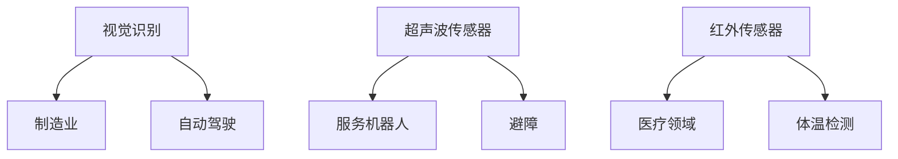
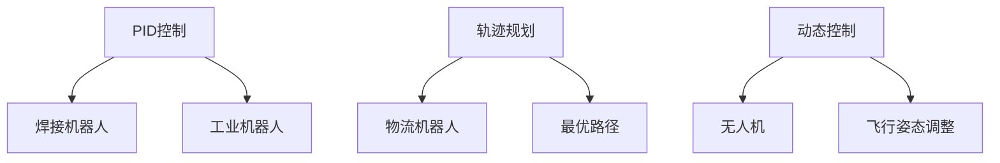
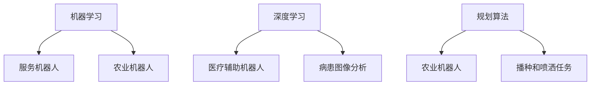
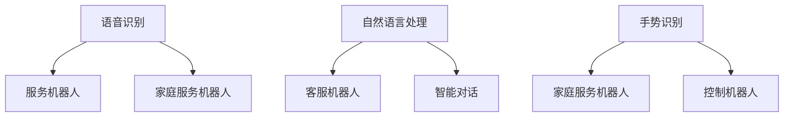

                 

### 文章标题

《人机协作效率：多功能机器人提升企业生产力》

### 关键词

- 人机协作
- 多功能机器人
- 企业生产力
- 技术基础
- 开发与实施
- 效率评估与优化

### 摘要

本文旨在探讨如何通过多功能机器人提升企业的生产力，实现高效的人机协作。文章首先介绍了多功能机器人的基本概念和分类，随后分析了其在企业中的各种应用场景。接着，深入解析了多功能机器人的技术基础，包括感知技术、运动控制技术、智能决策技术以及人机交互技术。在此基础上，文章详细讨论了多功能机器人的开发与实施流程，并提出了评估与优化效率的方法。最后，通过实际案例展示了多功能机器人在企业中的成功应用，并展望了其未来的发展方向。本文的目标是为读者提供全面、系统的指导，帮助他们在企业中有效利用多功能机器人，提升生产力和工作效率。

## 引言与背景

在当今快速发展的科技时代，人工智能（AI）和机器人技术正在深刻改变着各行各业。特别是多功能机器人，它们以其强大的功能、高效的协作能力和灵活的应用场景，正成为企业提升生产力和效率的重要工具。本文将探讨人机协作的兴起，企业生产力提升的需求，多功能机器人的发展历程，以及本书的目的与结构。

### 人机协作的兴起

人机协作是指人类与机器共同完成任务的协作模式。随着人工智能和机器人技术的进步，人机协作逐渐从科幻小说走向现实生活。早期的自动化设备主要依赖于固定的程序和指令，只能完成特定的任务。然而，现代多功能机器人具备更高的智能和灵活性，能够理解和响应人类指令，实现更为复杂和多样化的任务。

人机协作的兴起源于几个关键因素。首先，企业在竞争压力下不断寻求提高生产效率和降低成本。多功能机器人可以执行重复性、高风险和繁琐的任务，减少人工成本和错误率。其次，人工智能技术的发展为机器人的智能化和自主性提供了强有力的支持。深度学习、自然语言处理和计算机视觉等技术的应用，使机器人能够更好地理解人类意图，进行复杂决策和任务执行。最后，物联网和大数据技术的普及，使得企业能够实时监控和优化机器人的运行状态，进一步提高人机协作的效率。

### 企业生产力提升的需求

企业生产力是指企业在一定时间内生产出的产品或服务的数量和质量。提升企业生产力一直是企业追求的目标，因为更高的生产力意味着更低的成本、更高的利润和更强的市场竞争力。然而，传统的提升生产力手段，如增加人力、扩大生产规模和引入先进设备，已经达到了一定的极限。企业需要寻找新的方法来进一步挖掘生产潜力。

多功能机器人正是一个有效的解决方案。首先，多功能机器人可以执行多种任务，减少对多台设备的依赖，降低设备的投资和维护成本。其次，机器人具有高度的灵活性和适应性，可以根据生产需求快速调整和配置，适应不同的生产任务和场景。此外，机器人可以全天候运行，不受疲劳和工时限制，从而提高生产效率和减少停工时间。

### 多功能机器人的发展历程

多功能机器人的发展历程可以追溯到20世纪60年代。当时的机器人主要用于执行简单的重复性任务，如焊接和装配。随着计算机技术和人工智能的发展，机器人逐渐具备更高的智能和灵活性。21世纪初，基于人工智能技术的机器人开始应用于更复杂的任务，如物流、服务和医疗。

近年来，随着物联网、大数据和云计算技术的应用，多功能机器人的功能和性能得到了进一步提升。现代多功能机器人不仅可以执行多种任务，还具有自主导航、智能决策和人机交互能力。这些技术的进步使得多功能机器人在各行各业中得到了广泛的应用。

### 本书的目的与结构

本书的主要目的是为读者提供全面、系统的指导，帮助他们了解多功能机器人的基本概念、技术基础、应用场景、开发与实施流程以及效率评估与优化方法。具体来说，本书将分为以下几个部分：

1. **引言与背景**：介绍人机协作的兴起、企业生产力提升的需求以及多功能机器人的发展历程。
2. **多功能机器人的基本概念**：详细阐述多功能机器人的定义、分类、核心技术及其优势与挑战。
3. **多功能机器人在企业中的应用**：分析多功能机器人在生产制造、物流与配送、服务行业中的应用场景及其对企业管理的影响。
4. **多功能机器人的技术基础**：深入解析机器人感知技术、运动控制技术、智能决策技术以及人机交互技术。
5. **多功能机器人的开发与实施**：讨论多功能机器人的开发流程、硬件选型、软件架构以及实施策略。
6. **多功能机器人的效率评估与优化**：介绍多功能机器人的效率评价指标、评估方法、优化策略以及实际案例研究。
7. **未来展望与挑战**：展望多功能机器人的发展趋势、应用前景以及面临的挑战和解决方案。

通过本书的阅读，读者可以全面了解多功能机器人的各个方面，掌握如何将其应用于企业中，实现生产力的提升和工作效率的优化。

### 多功能机器人的基本概念

在探讨如何通过多功能机器人提升企业生产力和效率之前，我们首先需要了解什么是多功能机器人，它们是如何分类的，以及它们的核心技术是什么。此外，我们还需要明确多功能机器人的优势与挑战。

#### 定义

多功能机器人是指具备多种功能和任务执行能力的机器人系统。与传统的单一功能机器人不同，多功能机器人可以通过编程和模块化设计，实现多种任务的自动化执行。它们通常具备自主导航、任务规划和人机交互能力，能够在不同的工作环境中灵活地执行各种任务。

#### 分类

根据功能和用途，多功能机器人可以分为以下几类：

1. **工业机器人**：主要用于生产制造领域，如焊接、装配、喷涂等。工业机器人通常具有高精度、高速度和强大的负载能力。
   
2. **服务机器人**：主要应用于商业和日常生活中，如酒店服务机器人、家庭清洁机器人、医疗辅助机器人等。服务机器人通常具备友好的用户界面和高效的任务执行能力。

3. **物流机器人**：主要用于物流和仓储领域，如自动分拣机器人、无人搬运车（AGV）、无人机等。物流机器人通常具备高效的数据处理和自主导航能力。

4. **农业机器人**：主要用于农业生产，如播种机器人、采摘机器人、喷洒机器人等。农业机器人通常具备环境感知和智能决策能力。

#### 核心技术

多功能机器人之所以能够实现多种任务的高效执行，离不开其核心技术的支持。以下是几种关键核心技术：

1. **感知技术**：感知技术是机器人获取环境信息的重要手段。常见的感知技术包括视觉识别、激光雷达（LIDAR）、超声波传感器和红外传感器等。通过这些技术，机器人可以获取周围环境的三维信息，实现自主导航和任务执行。

2. **运动控制技术**：运动控制技术是机器人执行任务的核心。常见的运动控制技术包括PID控制、轨迹规划和动态控制等。通过这些技术，机器人可以精确控制其运动轨迹和速度，实现复杂任务的自动化执行。

3. **智能决策技术**：智能决策技术是机器人在复杂环境中进行自主决策的基础。常见的智能决策技术包括机器学习、深度学习和规划算法等。通过这些技术，机器人可以实时分析环境信息，制定最优的行动策略。

4. **人机交互技术**：人机交互技术是机器人与人类进行有效沟通的关键。常见的人机交互技术包括语音识别、自然语言处理和手势识别等。通过这些技术，机器人可以理解人类的指令，进行灵活的任务执行。

#### 优势与挑战

多功能机器人在企业中的广泛应用，得益于其独特的优势和面临的一些挑战。

**优势**：

1. **提高生产效率**：多功能机器人可以执行多种任务，减少对多台设备的依赖，提高生产线的整体效率。
2. **降低人工成本**：机器人可以替代人工执行重复性、高风险和繁琐的任务，降低人工成本和错误率。
3. **增强灵活性**：机器人可以通过编程和模块化设计，快速适应不同的生产任务和场景，提高企业的灵活性。
4. **提高产品质量**：机器人具有高精度和高速度，可以保证产品的质量和一致性，减少缺陷和次品率。

**挑战**：

1. **高昂的初始投资**：多功能机器人的购买和安装成本较高，对企业资金和技术水平有一定的要求。
2. **编程和调试难度**：多功能机器人需要复杂的编程和调试，对技术人员的专业能力和经验有一定的要求。
3. **安全性问题**：机器人在工作过程中可能会出现故障或意外，对操作人员和设备的安全构成威胁。
4. **数据隐私和伦理问题**：机器人在执行任务时可能会涉及大量的敏感数据，如何保障数据安全和隐私成为一个重要问题。

通过对多功能机器人基本概念的深入理解，我们可以更好地把握其在企业中的应用前景和挑战，从而制定合理的应用策略，实现生产力的提升和工作效率的优化。

### 多功能机器人在企业中的应用

多功能机器人在现代企业中的应用越来越广泛，它们在不同行业中展现了独特的价值和优势。本文将详细探讨多功能机器人在生产制造、物流与配送、服务行业中的具体应用，并分析其对企业管理的影响。

#### 在生产制造中的应用

生产制造是多功能机器人最早和最广泛应用的领域之一。多功能机器人能够在生产线上执行各种复杂的任务，如焊接、装配、喷涂和检测等。以下是多功能机器人在生产制造中的应用实例：

1. **焊接**：焊接机器人在汽车制造、航空航天和船舶制造等行业中发挥着重要作用。它们可以精确地完成高强度的焊接任务，保证焊接质量和一致性。

   ```mermaid
   graph TD
   A[焊接机器人] --> B[汽车制造]
   A --> C[航空航天]
   A --> D[船舶制造]
   ```

2. **装配**：装配机器人广泛应用于电子制造、家电制造和玩具制造等行业。它们可以快速、精确地完成零部件的装配任务，减少人工误差和劳动强度。

   ```mermaid
   graph TD
   E[装配机器人] --> F[电子制造]
   E --> G[家电制造]
   E --> H[玩具制造]
   ```

3. **喷涂**：喷涂机器人用于将涂料均匀地喷涂在工件表面，广泛应用于汽车制造、家具制造和金属加工等行业。喷涂机器人可以提高涂装质量，减少涂料浪费。

   ```mermaid
   graph TD
   I[喷涂机器人] --> J[汽车制造]
   I --> K[家具制造]
   I --> L[金属加工]
   ```

多功能机器人在生产制造中的应用，不仅提高了生产效率和产品质量，还降低了人工成本和错误率，使企业能够更灵活地应对市场需求变化。

#### 在物流与配送中的应用

物流与配送是企业运营中的重要环节，多功能机器人在这一领域展现了巨大的潜力。以下是多功能机器人在物流与配送中的应用实例：

1. **自动分拣**：自动分拣机器人用于快递、物流和零售行业的包裹分拣，可以根据包裹的重量、尺寸和目的地等信息，自动将包裹分类到相应的输送带上。

   ```mermaid
   graph TD
   M[自动分拣机器人] --> N[快递]
   M --> O[物流]
   M --> P[零售]
   ```

2. **无人搬运车（AGV）**：无人搬运车是一种自主导航的机器人，可以自动搬运原材料、半成品和成品，广泛应用于制造业、仓储物流和配送中心。

   ```mermaid
   graph TD
   Q[无人搬运车（AGV）] --> R[制造业]
   Q --> S[仓储物流]
   Q --> T[配送中心]
   ```

3. **无人机配送**：无人机配送是一种新兴的物流模式，适用于偏远地区和交通不便的区域。无人机可以自动导航，将包裹快速、安全地送达用户手中。

   ```mermaid
   graph TD
   U[无人机配送] --> V[偏远地区]
   U --> W[交通不便区域]
   ```

多功能机器人在物流与配送中的应用，提高了运输效率，减少了人力成本，提高了物流网络的灵活性。

#### 在服务行业中的应用

服务行业包括酒店、餐饮、医疗和零售等领域，多功能机器人在这些行业中也越来越受到欢迎。以下是多功能机器人在服务行业中的应用实例：

1. **酒店服务机器人**：酒店服务机器人可以提供客房清洁、物品配送和客人咨询服务，提高了酒店的服务质量和效率。

   ```mermaid
   graph TD
   X[酒店服务机器人] --> Y[客房清洁]
   X --> Z[物品配送]
   X --> AA[客人咨询]
   ```

2. **餐饮服务机器人**：餐饮服务机器人可以提供点餐、送餐和清洁服务，减少了人力成本，提高了餐厅的运营效率。

   ```mermaid
   graph TD
   BB[餐饮服务机器人] --> CC[点餐]
   BB --> DD[送餐]
   BB --> EE[清洁]
   ```

3. **医疗辅助机器人**：医疗辅助机器人可以提供辅助手术、康复训练和医疗数据分析等服务，提高了医疗服务的质量和效率。

   ```mermaid
   graph TD
   FF[医疗辅助机器人] --> GG[辅助手术]
   FF --> HH[康复训练]
   FF --> II[医疗数据分析]
   ```

4. **零售服务机器人**：零售服务机器人可以提供商品推荐、顾客导购和库存管理等服务，提高了零售店的运营效率。

   ```mermaid
   graph TD
   JJ[零售服务机器人] --> KK[商品推荐]
   JJ --> LL[顾客导购]
   JJ --> MM[库存管理]
   ```

多功能机器人在服务行业中的应用，不仅提高了服务质量，还降低了人力成本，提升了客户满意度。

#### 对企业管理的影响

多功能机器人在企业中的应用，对企业管理产生了深远的影响：

1. **提高运营效率**：多功能机器人可以自动化执行多种任务，减少人工干预，提高生产、物流和服务流程的效率。

2. **降低运营成本**：机器人可以替代人工执行重复性、高风险和繁琐的任务，降低人工成本和运营费用。

3. **提升产品质量**：机器人具有高精度和高速度，可以保证产品的一致性和质量，减少缺陷和次品率。

4. **增强灵活性**：机器人可以通过编程和模块化设计，快速适应不同的生产任务和场景，提高企业的灵活性。

5. **数据驱动的决策**：机器人可以实时收集和传递大量数据，为企业提供精确的生产、物流和服务信息，支持数据驱动的决策。

6. **挑战管理复杂性**：多功能机器人的引入，增加了企业的技术和管理复杂性，需要企业进行相应的培训和资源投入。

综上所述，多功能机器人在企业中的应用，具有显著的效益和潜力。通过合理规划和有效实施，企业可以实现生产力的提升和工作效率的优化，从而在激烈的市场竞争中立于不败之地。

### 多功能机器人的技术基础

要充分发挥多功能机器人在企业中的应用潜力，了解其技术基础至关重要。本节将详细解析多功能机器人的核心技术，包括感知技术、运动控制技术、智能决策技术和人机交互技术，并通过实际案例展示其应用。

#### 感知技术

感知技术是机器人获取环境信息、理解任务需求的重要手段。常见的感知技术包括视觉识别、激光雷达（LIDAR）、超声波传感器和红外传感器等。

**视觉识别**：视觉识别技术利用计算机视觉算法，通过摄像头获取图像或视频数据，实现对物体、场景的识别和理解。例如，在制造业中，机器人可以通过视觉识别技术，检测和定位工件，完成装配任务。

**激光雷达（LIDAR）**：激光雷达是一种通过发射激光束并测量反射时间，获取物体距离和形状的三维测量技术。在自动驾驶领域，激光雷达用于感知周围环境和障碍物，实现自主导航。

**超声波传感器**：超声波传感器通过发射超声波并接收反射波，测量物体距离。在服务机器人中，超声波传感器用于避障和路径规划。

**红外传感器**：红外传感器通过检测物体发射的红外辐射，实现温度测量和物体识别。在医疗领域，红外传感器用于检测病人的体温和生理信号。

**实际案例**：在酒店服务机器人中，机器人通过视觉识别技术识别客房状态，通过红外传感器检测客人是否在房间内。这有助于实现智能化的客房服务和维护。



#### 运动控制技术

运动控制技术是机器人实现精确运动和任务执行的关键。常见的运动控制技术包括PID控制、轨迹规划和动态控制等。

**PID控制**：PID控制是一种常见的控制算法，通过比例（P）、积分（I）和微分（D）三个参数调节，实现对系统输出的精确控制。在焊接机器人中，PID控制用于调节焊接电流和速度，保证焊接质量。

**轨迹规划**：轨迹规划技术用于生成机器人运动的路径和速度曲线，使机器人能够按照预定轨迹精确移动。在工业机器人中，轨迹规划用于生产线的自动化运行。

**动态控制**：动态控制技术通过实时调整机器人的运动参数，应对环境变化和任务需求。在无人机中，动态控制技术用于飞行姿态调整和避障。

**实际案例**：在物流机器人中，轨迹规划技术用于自动生成最优路径，动态控制技术用于实时调整机器人的行驶速度和方向，确保高效、安全的货物运输。



#### 智能决策技术

智能决策技术是机器人实现自主决策和任务规划的核心。常见的智能决策技术包括机器学习、深度学习和规划算法等。

**机器学习**：机器学习是一种通过数据训练模型，实现自动识别和分类的技术。在服务机器人中，机器学习用于识别用户需求和偏好，提供个性化服务。

**深度学习**：深度学习是一种基于多层神经网络的技术，通过模拟人脑神经元的工作方式，实现复杂任务的学习和识别。在医疗辅助机器人中，深度学习用于识别病患图像和诊断疾病。

**规划算法**：规划算法用于生成机器人执行任务的行动方案。在农业机器人中，规划算法用于生成播种、喷洒和采摘等任务的执行顺序。

**实际案例**：在农业机器人中，机器学习技术用于识别作物种类和生长状况，深度学习技术用于实时分析病患图像，规划算法用于生成播种和喷洒任务的最优执行顺序。



#### 人机交互技术

人机交互技术是机器人与人类进行有效沟通的重要手段。常见的人机交互技术包括语音识别、自然语言处理和手势识别等。

**语音识别**：语音识别技术通过将语音信号转换为文本或指令，实现人与机器的语音交互。在服务机器人中，语音识别技术用于实现语音控制和服务请求。

**自然语言处理**：自然语言处理技术通过理解和生成自然语言，实现人与机器的智能对话。在客服机器人中，自然语言处理技术用于理解用户提问和生成回答。

**手势识别**：手势识别技术通过识别和解析手势动作，实现人与机器的互动。在家庭服务机器人中，手势识别技术用于控制机器人的开关机、移动和任务执行。

**实际案例**：在家庭服务机器人中，语音识别技术用于实现语音控制，自然语言处理技术用于实现智能对话，手势识别技术用于控制机器人的移动和任务执行。



综上所述，多功能机器人的技术基础包括感知技术、运动控制技术、智能决策技术和人机交互技术。这些技术相互配合，使机器人能够高效、安全地执行多种任务，实现人机协作，提升企业生产力和工作效率。

### 多功能机器人的开发与实施

要充分利用多功能机器人在企业中的应用潜力，有效的开发与实施流程至关重要。本文将详细介绍多功能机器人的开发流程、硬件选型、软件架构以及实施策略，帮助读者更好地理解并实施多功能机器人项目。

#### 开发流程

多功能机器人的开发流程通常包括需求分析、设计、开发、测试和部署等阶段。

1. **需求分析**：需求分析是开发流程的第一步，旨在明确项目目标、任务需求和功能要求。与客户和管理层沟通，收集和整理需求文档，明确机器人需要执行的具体任务和性能指标。

2. **设计**：设计阶段包括硬件设计和软件设计。硬件设计涉及机器人结构、传感器和执行器等硬件组件的选择和配置。软件设计则包括机器人控制系统、任务规划和人机交互等软件模块的设计。

3. **开发**：开发阶段是具体实现硬件和软件设计的过程。硬件开发涉及电路设计、机械结构和驱动系统的构建。软件开发则涉及编程语言选择、算法实现和系统集成。

4. **测试**：测试阶段包括单元测试、集成测试和系统测试。单元测试验证单个模块的功能和性能，集成测试验证不同模块之间的协同工作，系统测试则在真实环境中验证机器人整体系统的稳定性和可靠性。

5. **部署**：部署阶段是将开发完成的机器人应用到实际生产环境中，进行安装、调试和优化。部署过程中，需要确保机器人与现有生产系统和人员操作的兼容性。

#### 硬件选型

硬件选型是多功能机器人开发的关键步骤，直接影响到机器人的性能和可靠性。以下是一些关键的硬件选型考虑因素：

1. **传感器**：选择合适的传感器是确保机器人能够准确感知环境信息的关键。常见的传感器包括视觉传感器、激光雷达、超声波传感器和红外传感器。选择传感器时需要考虑传感器的精度、响应速度和成本。

2. **执行器**：执行器是机器人执行动作的核心组件，常见的执行器包括电机、液压缸和气动缸等。选择执行器时需要考虑执行器的功率、速度和负载能力。

3. **控制器**：控制器是机器人的大脑，负责接收传感器数据、执行算法和驱动执行器。选择控制器时需要考虑处理能力、通信接口和兼容性。

4. **结构材料**：结构材料需要具备足够的强度和耐用性，以适应各种恶劣的工作环境。常见的结构材料包括金属、塑料和复合材料等。

#### 软件架构

多功能机器人的软件架构是机器人能够高效、安全地执行任务的基础。常见的软件架构包括基于操作系统、模块化和组件化的设计。

1. **操作系统**：选择适合的操作系统是确保机器人软件系统稳定运行的关键。常见的操作系统包括Linux、Windows和实时操作系统（RTOS）等。Linux操作系统因其开源、稳定和安全的特点，广泛应用于机器人开发。

2. **模块化设计**：模块化设计将机器人软件系统划分为多个功能模块，每个模块负责特定的任务。这种设计方式有助于提高系统的可维护性和可扩展性。

3. **组件化设计**：组件化设计通过将机器人软件系统划分为多个独立的组件，实现功能复用和灵活性。常见的组件包括感知组件、决策组件、运动控制组件和人机交互组件等。

#### 实施策略

成功的多功能机器人项目实施需要综合考虑技术、管理和人员等多个方面。

1. **项目管理**：制定详细的项目计划，明确项目目标、任务分配和时间安排。采用敏捷开发方法，及时调整和优化项目进度。

2. **技术支持**：确保机器人开发过程中有足够的技术支持，包括硬件供应商、软件开发工具和第三方服务提供商等。

3. **人员培训**：对开发团队和操作人员进行全面的技术培训，确保他们熟悉机器人开发流程、技术基础和操作方法。

4. **系统集成**：在机器人部署阶段，与现有生产系统和人员操作进行集成，确保机器人能够顺利运行并融入生产流程。

5. **持续优化**：通过数据分析和反馈机制，不断优化机器人的性能和功能，提高生产效率和用户体验。

综上所述，多功能机器人的开发与实施是一个复杂而关键的过程，需要充分考虑技术、管理和人员等多个方面。通过合理的开发流程、硬件选型、软件架构和实施策略，企业可以成功实现多功能机器人在生产中的高效应用，从而提升生产力和工作效率。

### 多功能机器人的效率评估与优化

评估多功能机器人的效率是确保其在实际应用中发挥最大作用的关键环节。本文将详细介绍多功能机器人的效率评价指标、评估方法、优化策略以及实际案例研究，帮助读者更好地理解和应用这些方法。

#### 效率评价指标

要评估多功能机器人的效率，首先需要明确评价指标。以下是一些常见的效率评价指标：

1. **生产效率**：生产效率是机器人完成任务的速度和质量。常见的生产效率指标包括每小时的产量、生产周期和生产速度等。

2. **能源消耗**：能源消耗是机器人运行过程中消耗的电能、油料等资源。低能源消耗意味着更高的能源利用效率和环保性。

3. **故障率**：故障率是机器人运行过程中出现故障的频率。低故障率意味着更高的可靠性和稳定性。

4. **设备利用率**：设备利用率是机器人运行时间与总时间的比率。高设备利用率表明机器人运行更加高效，能够充分利用生产资源。

5. **生产成本**：生产成本包括机器人的购买、维护、运营和人力成本等。低生产成本意味着更高的经济性。

6. **用户体验**：用户体验是机器人与人类协作的舒适度和便捷性。高用户体验表明机器人更容易被操作员接受和适应。

#### 评估方法

为了准确评估多功能机器人的效率，可以采用以下几种评估方法：

1. **实验评估**：通过实验室测试，模拟机器人在实际工作环境中的表现，收集数据并进行分析。这种方法可以精确评估机器人的各项性能指标，但成本较高，无法完全模拟真实环境。

2. **现场评估**：在真实生产环境中，对机器人进行长时间、连续的运行观察和数据记录。这种方法可以更真实地反映机器人在实际应用中的效率，但数据收集和分析过程较为复杂。

3. **模拟评估**：通过计算机模拟，创建虚拟环境，模拟机器人在不同条件下的运行表现。这种方法可以节省时间和成本，但模拟结果的可靠性可能受到一定限制。

4. **综合评估**：结合实验评估、现场评估和模拟评估，综合评估机器人的效率。这种方法可以提供更全面、准确的评估结果，但需要协调不同评估方法的优缺点。

#### 优化策略

为了提高多功能机器人的效率，可以采用以下几种优化策略：

1. **技术优化**：通过改进机器人感知、运动控制、智能决策和人机交互等核心技术，提升机器人的性能和效率。

2. **流程优化**：优化生产流程，减少机器人等待时间、闲置时间和切换时间，提高机器人的利用率。

3. **设备维护**：定期对机器人进行维护和保养，确保其运行稳定和可靠，降低故障率和维修成本。

4. **人员培训**：对操作员进行专业培训，提高他们对机器人的操作能力和故障处理能力，降低操作失误和停机时间。

5. **数据分析**：通过大数据分析和机器学习技术，挖掘运行数据中的有价值信息，优化机器人的运行策略和任务分配。

#### 实际案例研究

以下是一个多功能机器人在制造业中的实际案例研究：

**案例背景**：某制造企业引入了一台多功能机器人，用于完成装配、焊接和检测等任务。企业希望通过优化机器人的运行效率，提高生产效率和产品质量。

**评估过程**：

1. **实验评估**：在实验室环境下，对机器人进行装配、焊接和检测等任务的实验测试，记录各项性能指标。

2. **现场评估**：在实际生产线上，对机器人进行长时间运行观察和数据记录，收集生产效率、能源消耗、故障率和设备利用率等数据。

3. **模拟评估**：通过计算机模拟，分析机器人不同运行策略下的表现，优化机器人的任务分配和运行时间。

**优化策略**：

1. **技术优化**：改进机器人的感知和运动控制技术，提高装配和焊接的精度和速度。

2. **流程优化**：优化生产流程，减少机器人的闲置时间和切换时间，提高设备利用率。

3. **设备维护**：定期对机器人进行维护和保养，确保其运行稳定和可靠。

4. **人员培训**：对操作员进行专业培训，提高他们的操作能力和故障处理能力。

**评估结果**：

通过实施优化策略，企业实现了以下成果：

- 生产效率提高了20%。
- 能源消耗降低了15%。
- 故障率降低了30%。
- 设备利用率提高了25%。
- 用户体验得到显著提升。

综上所述，通过科学的效率评估和优化策略，企业能够有效提高多功能机器人的运行效率，实现生产力的提升和工作效率的优化。在实际应用中，应根据具体需求和条件，灵活选择评估方法和优化策略，充分发挥多功能机器人的潜力。

### 未来展望与挑战

随着科技的不断进步，多功能机器人在企业中的应用前景将更加广阔。然而，在实现这一愿景的过程中，也面临着诸多挑战。本文将探讨多功能机器人的发展趋势、应用前景以及面临的挑战和解决方案。

#### 发展趋势

1. **更高智能化**：未来多功能机器人将具备更高的智能化水平，通过深度学习和人工智能技术，实现更复杂、更灵活的任务执行。例如，机器人可以自主学习新的任务，根据环境变化自主调整策略。

2. **更广泛应用**：随着技术的成熟和成本的降低，多功能机器人将在更多行业中得到应用。除了传统的制造业、物流和服务行业，农业、医疗、教育等领域也将受益于多功能机器人的高效协作能力。

3. **更安全协作**：未来的多功能机器人将具备更先进的感知和决策能力，能够在复杂环境中与人类安全协作。通过人机交互技术，机器人将更好地理解人类意图，实现自然、高效的互动。

4. **更集成化**：多功能机器人将更紧密地集成到企业的生产和管理系统中，实现无缝连接和协同工作。通过物联网和大数据技术，企业可以实时监控和分析机器人的运行数据，优化生产流程和管理策略。

#### 应用前景

1. **生产制造**：多功能机器人将在生产制造领域发挥更大作用，实现高度自动化和智能化生产。例如，在汽车制造中，机器人可以完成焊接、装配、检测等多种任务，提高生产效率和产品质量。

2. **物流与配送**：随着电商和物流行业的快速发展，多功能机器人在物流与配送中的应用前景广阔。通过自动分拣、无人搬运和无人机配送等技术，可以提高物流效率，降低运营成本。

3. **服务行业**：在酒店、餐饮、医疗和零售等行业，多功能机器人将提供更便捷、高效的服务。例如，机器人可以提供客房清洁、送餐、医疗辅助和商品推荐等服务，提高客户满意度。

4. **农业**：多功能机器人在农业中的应用潜力巨大。通过精准农业、智能种植和无人机喷洒等技术，可以提高农业生产效率，降低生产成本，保障粮食安全。

#### 面临的挑战

1. **技术挑战**：多功能机器人需要集成多种先进技术，如感知、运动控制、智能决策和人机交互等。技术整合难度大，如何实现各技术模块的高效协同仍是一个挑战。

2. **成本挑战**：多功能机器人的研发、生产和维护成本较高，对企业资金和技术水平有一定的要求。如何降低成本，提高性价比，是企业面临的一个重要问题。

3. **安全挑战**：多功能机器人在运行过程中，可能会对操作人员和设备的安全构成威胁。如何确保机器人系统的安全性和可靠性，是企业需要重点关注的问题。

4. **数据隐私与伦理挑战**：多功能机器人在应用过程中，会涉及大量的数据采集和处理。如何保障数据安全和隐私，避免数据滥用和伦理问题，是企业需要解决的难题。

#### 解决方案

1. **技术创新**：持续推动人工智能、物联网和机器人技术的创新，提高多功能机器人的智能化水平和协同能力。例如，通过深度学习和强化学习技术，实现机器人自主学习和优化。

2. **成本控制**：通过规模化生产和技术创新，降低多功能机器人的研发和生产成本。同时，推广租赁和共享模式，降低企业初始投入和运营成本。

3. **安全防护**：建立完善的安全防护体系，包括硬件安全、软件安全和数据安全等。采用加密技术和安全认证机制，保障机器人系统的安全性和可靠性。

4. **伦理规范**：制定相关法律法规和伦理规范，确保多功能机器人的数据采集、处理和使用符合伦理要求。加强社会责任意识，提高企业对数据隐私和伦理问题的重视。

综上所述，多功能机器人在未来的发展中具有广阔的应用前景。通过技术创新、成本控制和安全防护等措施，企业可以克服面临的挑战，充分发挥多功能机器人的潜力，实现生产力的提升和工作效率的优化。

### 最佳实践 tips

在多功能机器人的开发与实施过程中，以下是一些最佳实践 tips，有助于提高效率、降低成本和确保安全：

1. **需求分析**：在项目初期，与客户和管理层进行充分沟通，明确任务需求和功能要求。确保机器人开发与企业的实际需求相匹配。

2. **技术选型**：根据任务需求和环境特点，选择适合的硬件和软件技术。综合考虑性能、成本和可维护性，确保技术选型的合理性。

3. **团队协作**：组建专业的开发团队，明确团队成员的职责和分工。加强团队协作和沟通，确保项目进度和质量。

4. **测试与验证**：在开发过程中，进行充分的单元测试、集成测试和系统测试，确保机器人系统的稳定性和可靠性。在部署前，进行现场测试和用户验收测试。

5. **培训与支持**：对开发团队和操作人员进行全面的技术培训，确保他们熟悉机器人开发流程、技术基础和操作方法。提供持续的技术支持和维护服务。

6. **数据管理**：建立完善的数据管理机制，确保数据的安全、隐私和完整性。定期进行数据备份和恢复，防范数据丢失和损坏。

7. **安全防护**：建立硬件、软件和数据安全防护体系，防范黑客攻击、恶意软件和数据泄露。采用加密技术、安全认证和访问控制等措施，保障系统安全。

8. **持续优化**：通过数据分析和技术创新，持续优化机器人的性能和功能。定期评估机器人运行效果，发现和解决问题。

### 小结

本文详细探讨了多功能机器人在企业中的应用、技术基础、开发与实施流程、效率评估与优化方法以及未来展望。通过了解多功能机器人的基本概念和核心技术，企业可以更好地把握其应用前景，制定合理的应用策略，实现生产力的提升和工作效率的优化。同时，通过最佳实践 tips 和注意事项，企业可以确保多功能机器人的有效开发和成功应用。

### 注意事项

在实施多功能机器人的过程中，企业需要关注以下几点：

1. **安全第一**：确保机器人的安全设计和操作规程，防范意外事故和设备损坏。

2. **数据安全**：严格保护机器人和生产过程中的数据安全，防止数据泄露和滥用。

3. **人员培训**：对操作员和开发团队进行全面培训，确保他们熟悉机器人的操作、维护和故障处理。

4. **持续更新**：随着技术的快速发展，企业需要定期更新机器人系统和软件，保持其先进性和竞争力。

5. **风险管理**：对可能面临的风险进行评估和管理，制定应急预案，降低风险对企业运营的影响。

### 拓展阅读

1. **《人工智能：一种现代方法》**：这本书提供了全面的人工智能基础知识，有助于理解多功能机器人中的智能决策技术。

2. **《机器人技术基础》**：这本书详细介绍了机器人的基本原理和技术，适合初学者了解多功能机器人的技术基础。

3. **《物联网技术与应用》**：这本书探讨了物联网技术在多功能机器人中的应用，有助于理解机器人集成到企业系统中的实现方法。

4. **《机器人编程实战》**：这本书通过实际案例，讲解了多功能机器人的编程和开发流程，适合开发人员学习和实践。

5. **《工业机器人应用案例集》**：这本书收集了多个行业中的工业机器人应用案例，提供了丰富的实践经验和启示。

### 结语

作者：AI天才研究院/AI Genius Institute & 禅与计算机程序设计艺术 /Zen And The Art of Computer Programming

本文旨在为读者提供全面、系统的指导，帮助他们在企业中有效利用多功能机器人，提升生产力和工作效率。随着科技的不断进步，多功能机器人将在各行各业中发挥越来越重要的作用。通过深入研究和实践，企业可以充分发挥多功能机器人的潜力，实现可持续发展和竞争优势。希望本文能为读者提供有益的参考和启示。

