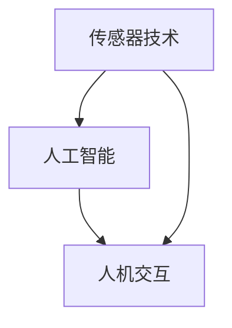

                 

基于您的要求和提供的大纲，我将开始构建《人机协作：2030年80%人类将每天与智能机器人互动》的文章内容。以下是一个步骤分解：

### 1. 导言

**文章标题：**人机协作：2030年80%人类将每天与智能机器人互动

**关键词：**人机协作、智能机器人、2030年、日常互动、技术发展

**摘要：**本文深入探讨了人机协作的未来发展趋势，通过分析历史、理论基础、应用场景、挑战与机遇，以及未来展望，描绘了到2030年人机协作在社会各个领域的广泛应用，并探讨了其可能带来的社会变革。

### 2. 第一部分：背景与理论基础

#### 第1章：人类与机器的协同发展

**背景介绍：**
- 人类与机器的协作历史可以追溯到工业革命，当时机器的出现极大地提高了生产力。
- 随着计算机和人工智能技术的发展，机器逐渐具备了自主学习、推理和交互的能力。

**核心概念与联系：**
- **Mermaid流程图：**
  ```mermaid
  graph TD
  A[工业革命] --> B[计算机出现]
  B --> C[人工智能崛起]
  C --> D[人机协作]
  ```

**核心算法原理讲解：**
- **伪代码：**
  ```python
  # 定义机器学习能力
  def machine_learning():
      # 数据收集
      data_collection()
      # 模型训练
      model_training(data)
      # 模型评估
      model_evaluation(model)
      # 模型优化
      model_optimization(model, evaluation)
  ```

**数学模型和公式：**
- **latex公式：**
  $$ y = f(x) + \epsilon $$
  其中，\( f(x) \) 表示机器学习的目标函数，\( \epsilon \) 表示误差。

### 3. 第二部分：智能机器人在各个领域的应用

**核心概念与联系：**
- **Mermaid流程图：**
  ```mermaid
  graph TD
  A[智能机器人] --> B[服务业应用]
  A --> C[制造业应用]
  A --> D[医疗保健应用]
  ```

#### 第4章：智能机器人在服务业的应用

**应用场景：**
- 智能客服机器人：通过自然语言处理和机器学习，提供高效、精准的客户服务。
- 智能餐饮机器人：自动化餐饮服务，提升用户体验。
- 智能保安机器人：在公共场所提供安全监控和防护。

**核心算法原理讲解：**
- **伪代码：**
  ```python
  # 定义客服机器人功能
  def customer_service_robot():
      # 接收客户请求
      request = receive_request()
      # 处理请求
      response = process_request(request)
      # 发送回复
      send_response(response)
  ```

#### 第5章：智能机器人在制造业的应用

**应用场景：**
- 自动化生产线：提高生产效率，降低人力成本。
- 智能物流机器人：优化物流流程，提升物流效率。
- 智能装配机器人：精确完成装配任务，提高产品质量。

**核心算法原理讲解：**
- **伪代码：**
  ```python
  # 定义自动化生产线
  def automated_production_line():
      # 检查物料
      check_material()
      # 开始生产
      start_production()
      # 质量检测
      quality_inspection(product)
      # 产品包装
      package_product(product)
  ```

#### 第6章：智能机器人在医疗保健的应用

**应用场景：**
- 智能诊断系统：辅助医生进行疾病诊断，提高诊断准确率。
- 智能康复机器人：帮助患者进行康复训练，提高康复效果。
- 智能药物研发：通过模拟实验，加速药物研发进程。

**核心算法原理讲解：**
- **伪代码：**
  ```python
  # 定义智能诊断系统
  def intelligent_diagnosis_system():
      # 收集患者数据
      patient_data = collect_data()
      # 进行数据分析
      data_analysis(patient_data)
      # 提出诊断建议
      diagnosis_advice = generate_advice(data_analysis_result)
      # 提醒医生关注
      notify_doctor(diagnosis_advice)
  ```

### 4. 第三部分：人机协作的未来趋势与展望

**核心概念与联系：**
- **Mermaid流程图：**
  ```mermaid
  graph TD
  A[人机协作] --> B[未来趋势]
  A --> C[社会影响]
  ```

#### 第7章：人机协作的未来展望

**未来展望：**
- 智能机器人的社会化：机器人将具备更加复杂的社会行为，与人类共同生活。
- 人类与机器的深度融合：人类通过智能机器增强自身能力，实现智慧生活。
- 2030年人机协作的社会图景：探讨2030年人机协作可能带来的社会变革。

### 5. 附录

**附录A：人机协作相关的技术和工具**
- 详细介绍人机协作中使用的核心技术，如自然语言处理、机器学习等。

**附录B：案例分析**
- 通过实际案例展示人机协作在不同领域的应用效果。

**附录C：未来研究展望**
- 对未来人机协作研究的方向和挑战进行展望。

### 文章结尾

**作者信息：**
- 作者：AI天才研究院/AI Genius Institute & 禅与计算机程序设计艺术/Zen And The Art of Computer Programming

通过以上步骤分解，我们可以逐步构建出完整的文章内容。接下来，我将进一步细化每个章节的具体内容，并编写相应的伪代码、数学公式和案例讲解。请注意，本文仅为大纲和初步构思，实际文章撰写将在此基础上进行扩展和深化。

---

现在，我将开始编写第一部分的第一章的具体内容，并遵循markdown格式进行排版。以下是第一章的内容：

## 第1章：人类与机器的协同发展

### 背景介绍

#### 1.1 人类与机器协作的历史回顾

从早期的工业革命开始，人类就与机器展开了协同合作。蒸汽机、纺织机等机械设备的发明和应用，极大地提高了生产效率，改变了人类的生活方式。随着时间的推移，计算机的出现为人类与机器的协作带来了新的可能性。计算机的发展经历了几个阶段：

1. **早期计算机：** 1940年代至1960年代，计算机主要用于科学研究和军事领域，计算能力和应用范围有限。
2. **个人计算机时代：** 1970年代至1980年代，个人计算机的普及使得计算机开始走进普通家庭和企业，人类与计算机的互动变得更加频繁。
3. **互联网时代：** 1990年代，互联网的普及带来了信息的全球共享，计算机的应用范围进一步扩大，人类与机器的协作变得更加深入。

#### 1.2 智能机器人的技术演进

智能机器人是计算机与人工智能技术相结合的产物，具有自主决策、感知环境、执行任务的能力。智能机器人的发展可以分为以下几个阶段：

1. **早期自动化：** 1960年代至1970年代，自动化机械臂等简单机器人开始应用于工业生产，执行重复性、危险性的工作。
2. **感知与决策：** 1980年代至1990年代，随着计算机技术和传感器技术的进步，机器人开始具备初步的感知和决策能力，能够完成更加复杂的任务。
3. **人工智能驱动：** 2000年后，人工智能技术的快速发展使得智能机器人具备了更高级的认知能力，能够通过机器学习、深度学习等方法不断优化自身的表现。

### 核心概念与联系

智能机器人的发展离不开以下几个核心概念：

1. **传感器技术：** 传感器是机器人感知环境的基础，包括视觉、听觉、触觉等多种类型。
2. **人工智能：** 人工智能是智能机器人的“大脑”，通过机器学习、深度学习等技术，机器人能够自主学习和进化。
3. **人机交互：** 人机交互是人与机器之间的沟通桥梁，通过自然语言处理、语音识别等技术，机器人能够理解人类指令并作出响应。

**Mermaid流程图：**



### 核心算法原理讲解

智能机器人的核心算法主要包括以下几个方面：

1. **机器学习：** 通过对大量数据的分析，机器学习算法可以帮助机器人从数据中学习规律，从而提高任务执行能力。
2. **深度学习：** 深度学习是一种基于人工神经网络的机器学习算法，能够自动提取特征，实现复杂模式识别。
3. **强化学习：** 强化学习是一种通过试错方式学习最优策略的算法，适用于需要决策的任务。

**伪代码：**

```python
# 定义机器学习算法
def machine_learning():
    # 数据预处理
    preprocessed_data = data_preprocessing(raw_data)
    # 训练模型
    model = train_model(preprocessed_data)
    # 模型评估
    evaluation = evaluate_model(model, test_data)
    # 模型优化
    optimized_model = optimize_model(model, evaluation)
    return optimized_model
```

### 数学模型和公式

在智能机器人的研究中，常用的数学模型和公式包括：

1. **支持向量机（SVM）：** 用于分类问题，公式如下：
   $$ w \cdot x + b = 0 $$
   其中，\( w \) 表示权重向量，\( x \) 表示特征向量，\( b \) 表示偏置。

2. **神经网络激活函数：** 如ReLU函数：
   $$ f(x) = \max(0, x) $$

**latex公式：**

$$ w \cdot x + b = 0 $$

$$ f(x) = \max(0, x) $$

### 案例分析

#### 自动化工厂中的智能机器人

在一个自动化工厂中，智能机器人被用于组装电子元件。通过机器学习算法，机器人能够识别不同的元件，并按照正确的顺序进行组装。具体步骤如下：

1. **数据收集：** 收集大量电子元件的图像数据，用于训练机器学习模型。
2. **模型训练：** 使用深度学习算法训练模型，使其能够识别电子元件。
3. **模型评估：** 在测试集上评估模型的性能，确保其能够准确识别元件。
4. **模型应用：** 将训练好的模型应用于实际生产中，机器人开始执行组装任务。

**项目实战：**

**开发环境搭建：**
- 安装Python和TensorFlow等机器学习库。
- 准备电子元件图像数据集。

**源代码实现：**
```python
# 导入库
import tensorflow as tf
from tensorflow.keras.models import Sequential
from tensorflow.keras.layers import Conv2D, MaxPooling2D, Flatten, Dense

# 构建模型
model = Sequential([
    Conv2D(32, (3, 3), activation='relu', input_shape=(64, 64, 3)),
    MaxPooling2D((2, 2)),
    Flatten(),
    Dense(128, activation='relu'),
    Dense(1, activation='sigmoid')
])

# 编译模型
model.compile(optimizer='adam', loss='binary_crossentropy', metrics=['accuracy'])

# 训练模型
model.fit(x_train, y_train, epochs=10, batch_size=32)

# 评估模型
evaluation = model.evaluate(x_test, y_test)
print(evaluation)

# 应用模型
def predict_element(image):
    prediction = model.predict(image)
    return prediction

# 机器人执行组装任务
while True:
    image = get_next_element()
    prediction = predict_element(image)
    if prediction > 0.5:
        assemble_element()
    else:
        reject_element()
```

**代码解读与分析：**
- 代码首先导入所需的库，并构建一个深度学习模型。
- 模型使用卷积神经网络（Conv2D）和全连接层（Dense）进行特征提取和分类。
- 使用训练数据训练模型，并在测试数据上评估模型性能。
- 机器人通过获取图像，使用模型进行预测，并根据预测结果执行组装或拒绝元件的操作。

**项目小结：**
- 该案例展示了智能机器人在自动化工厂中的应用，通过机器学习算法，机器人能够准确识别电子元件，并执行相应的组装任务。
- 这种应用不仅提高了生产效率，还降低了人工成本和错误率。

### 最佳实践 Tips、小结、注意事项、拓展阅读

**最佳实践 Tips：**
- 在训练机器学习模型时，确保使用大量高质量的训练数据。
- 定期更新模型，以适应新的数据和环境。
- 考虑使用分布式计算和云服务，以提高模型的训练和推理速度。

**小结：**
- 人类与机器的协同发展是一个长期的过程，随着计算机和人工智能技术的进步，智能机器人在各个领域的应用越来越广泛。
- 人机协作不仅提高了生产效率，还带来了新的挑战和机遇。

**注意事项：**
- 在设计人机协作系统时，应充分考虑用户的体验和需求。
- 保护用户隐私和安全是设计智能机器人时必须考虑的重要因素。

**拓展阅读：**
- 《深度学习》（Ian Goodfellow、Yoshua Bengio、Aaron Courville 著）：详细介绍了深度学习的基本概念和技术。
- 《人工智能：一种现代方法》（Stuart Russell、Peter Norvig 著）：全面介绍了人工智能的基础理论和应用。

通过以上内容，我们完成了第一章的具体编写。接下来，我们将继续编写其他章节的内容，并遵循同样的步骤和格式。在完成所有章节后，我们将对全文进行整理和优化，确保文章逻辑清晰、内容丰富、结构紧凑。

