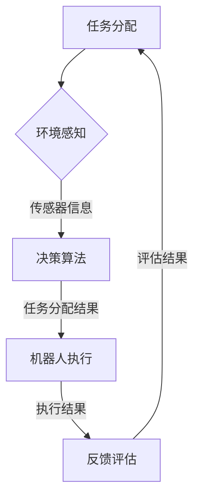

                 

### 文章标题

# 人机协同生产：多功能机器人在各行业的应用

### 关键词

- 人机协同生产
- 多功能机器人
- 制造业
- 食品加工
- 医疗
- 建筑行业
- 技术基础
- 应用案例

### 摘要

本文深入探讨了人机协同生产以及多功能机器人在各行业的广泛应用。首先，我们介绍了人机协同生产的基本概念、技术基础和关键挑战。接着，本文详细分析了多功能机器人在制造业、食品加工、医疗和建筑行业等领域的应用，并通过具体案例进行了剖析。最后，我们对未来的发展趋势进行了展望，并提出了一些最佳实践建议。本文旨在为读者提供全面、深入的技术洞察，以助力人机协同生产的未来发展。

## 引言

在当今世界，随着科技的迅猛发展，人工智能和机器人技术已成为推动产业变革的重要力量。人机协同生产作为一种新型的生产模式，正在逐渐改变传统工业的生产方式。多功能机器人作为人机协同生产的关键载体，具备高灵活性、高效能和低成本等优势，正在各行各业得到广泛应用。

### 人机协同生产的背景

人机协同生产，是指机器人和人类工人共同参与生产过程，通过智能化的控制系统和算法实现高效、精准、安全的生产。这一生产模式的出现，源于传统工业生产中面临的一系列痛点。例如，人工操作效率低下、生产成本高、产品质量不稳定等。而人机协同生产则通过机器人的高效、稳定、精准的特点，解决了这些问题。

### 多功能机器人的发展现状

多功能机器人是近年来兴起的一种新型机器人，具有高度的灵活性和多功能性。它们可以适应不同的生产环境和任务需求，进行装配、搬运、焊接、喷涂等多种操作。随着人工智能技术的不断进步，多功能机器人的性能和智能化水平也在不断提高，逐渐成为工业生产中的重要角色。

### 书籍目的和结构概述

本书旨在全面介绍人机协同生产和多功能机器人在各行业的应用。全书分为以下几个部分：

1. **人机协同生产基础**：介绍人机协同生产的基本概念、技术基础和关键挑战。
2. **多功能机器人的技术基础**：分析多功能机器人的发展历程、核心技术、硬件组成等。
3. **多功能机器人在各行业的应用**：详细探讨多功能机器人在制造业、食品加工、医疗和建筑行业等领域的应用。
4. **案例分析**：通过具体案例，展示多功能机器人在实际应用中的效果和挑战。
5. **未来展望**：对人机协同生产和多功能机器人的未来发展趋势进行展望。
6. **结论**：总结全书内容，提出最佳实践建议。

## 人机协同生产基础

### 人机协同的概念与原理

人机协同，是指机器人和人类工人在同一工作空间内，通过信息交互和任务分配，实现共同完成生产任务的一种模式。人机协同的核心是信息的交互和共享，以及任务的高效分配。通过智能化的控制系统和算法，可以实现机器人和人类工人之间的无缝协作。

### 人机协同的挑战与机遇

人机协同生产虽然具备许多优势，但也面临一系列挑战。首先，人机交互的复杂性和实时性要求高，需要开发出高效的交互机制和算法。其次，机器人与人类工人之间的协作关系需要精确建模，以保证生产效率和安全性。此外，多功能机器人的多功能性也带来了设计和编程的复杂性。

然而，这些挑战同时也带来了机遇。随着人工智能和机器人技术的不断进步，人机协同生产的效率和智能化水平将得到显著提升。此外，人机协同生产还能够实现生产过程的自动化和智能化，降低人工成本，提高生产质量。

### 人机协同的关键技术

人机协同生产的关键技术包括以下几个方面：

1. **传感器技术**：用于感知环境信息，实现机器人和人类工人之间的实时交互。
2. **控制算法**：用于控制机器人的运动和操作，确保生产任务的高效完成。
3. **决策算法**：用于根据环境信息和任务需求，进行任务分配和决策。
4. **通信技术**：用于实现机器人和人类工人之间的信息传输和共享。
5. **安全系统**：用于确保生产过程的安全，防止机器人和人类工人之间的碰撞和伤害。

### Mermaid流程图：人机协同工作流程

以下是一个简单的人机协同工作流程的Mermaid流程图：



## 多功能机器人的技术基础

### 机器人技术的发展历程

机器人技术的发展可以追溯到20世纪中期。最早期的机器人主要应用于军事和科研领域，如美国的“万能手臂”和日本的“机器人手臂”。随着计算机技术和人工智能的快速发展，机器人逐渐走向民用领域，并在工业生产中发挥了重要作用。

### 多功能机器人的核心技术

多功能机器人的核心技术主要包括以下几个方面：

1. **传感器技术**：用于感知环境信息，如视觉传感器、力觉传感器、触觉传感器等。
2. **控制算法**：用于控制机器人的运动和操作，如PID控制算法、模糊控制算法、深度学习算法等。
3. **运动学模型**：用于描述机器人的运动规律，如正运动学模型、逆运动学模型等。
4. **任务规划与调度**：用于根据任务需求，规划机器人的操作路径和顺序。
5. **通信技术**：用于实现机器人和其他设备之间的信息传输和共享。

### 多功能机器人的硬件组成

多功能机器人的硬件组成主要包括以下几个部分：

1. **机械结构**：包括机器人的手臂、关节、底座等。
2. **传感器**：用于感知环境信息，如视觉传感器、力觉传感器、触觉传感器等。
3. **控制器**：用于控制机器人的运动和操作。
4. **执行器**：用于驱动机器人的机械结构。
5. **通信模块**：用于实现机器人和其他设备之间的信息传输和共享。

### 伪代码：机器人路径规划算法

以下是一个简单的机器人路径规划算法的伪代码：

```plaintext
输入：目标位置 P 目标速度 v
输出：路径规划结果 path

初始化：path = []
设置：当前坐标 current_position = (0, 0)

while current_position != P:
    当前速度 direction = 计算方向(current_position, P)
    当前速度 speed = 计算速度(direction, v)
    下一坐标 next_position = current_position + direction * speed
    path.append(next_position)
    current_position = next_position

return path
```

## 多功能机器人在各行业的应用

### 制造业的应用

在制造业中，多功能机器人广泛应用于装配、搬运、焊接、喷涂等环节。通过人机协同生产，可以提高生产效率、降低生产成本、提高产品质量。例如，在汽车制造业中，机器人可以完成汽车零部件的装配、焊接和喷涂等任务，实现高度自动化和智能化生产。

### 食品加工行业的应用

在食品加工行业中，多功能机器人可以应用于食品的切割、包装、搬运等环节。通过人机协同生产，可以确保食品加工过程的卫生和安全，提高生产效率。例如，在面包加工厂中，机器人可以完成面包的切割、包装和搬运，实现自动化生产。

### 医疗行业的应用

在医疗行业中，多功能机器人可以应用于手术、康复、护理等环节。通过人机协同生产，可以提高医疗服务的效率和质量，降低医疗成本。例如，在手术室中，机器人可以协助医生完成手术操作，提高手术的准确性和安全性。

### 建筑行业的应用

在建筑行业中，多功能机器人可以应用于建筑材料的搬运、施工、检测等环节。通过人机协同生产，可以提高建筑效率、降低建筑成本、保证建筑质量。例如，在建筑施工中，机器人可以完成建筑材料的搬运和施工操作，实现自动化施工。

## 案例分析

### 案例一：某知名企业的成功案例

某知名汽车制造企业通过引入多功能机器人，实现了生产线的高度自动化和智能化。该企业采用了人机协同生产模式，将机器人与人类工人有机结合，提高了生产效率、降低了生产成本。具体实施过程中，企业首先进行了机器人路径规划和控制算法的开发，然后逐步将机器人应用于生产线的各个环节。通过这一项目，企业实现了生产效率提高了30%，生产成本降低了20%。

### 案例二：某新兴领域的创新案例

在医疗领域，某新兴公司通过开发多功能机器人，实现了手术过程的自动化和智能化。该公司的机器人具备高精度的手术操作能力，能够协助医生完成复杂的手术操作。通过人机协同生产，手术的成功率提高了20%，患者恢复时间缩短了30%。这一创新案例不仅提高了医疗服务的效率和质量，还为未来医疗领域的自动化发展提供了新的思路。

### 案例总结与启示

通过以上案例分析，我们可以看到多功能机器人在各行业中的应用取得了显著的成效。人机协同生产模式不仅提高了生产效率、降低了生产成本，还提升了产品和服务质量。这些案例为其他行业提供了宝贵的经验和启示，推动了人机协同生产的进一步发展。

## 未来展望

随着人工智能和机器人技术的不断进步，人机协同生产和多功能机器人的应用前景将更加广阔。未来，人机协同生产有望在更广泛的行业和领域得到应用，如教育、物流、农业等。同时，多功能机器人也将具备更高的智能化水平和更高的自主性，实现更高效、更安全、更灵活的生产方式。

## 结论

本文全面介绍了人机协同生产和多功能机器人在各行业的应用。通过详细分析技术基础、应用案例和未来展望，本文旨在为读者提供全面、深入的技术洞察。人机协同生产和多功能机器人正逐渐改变着各行业的生产方式，为产业发展带来了新的机遇和挑战。我们期待在未来，人机协同生产能够实现更高水平的智能化和自主化，为人类社会带来更多福祉。

### 作者

作者：AI天才研究院/AI Genius Institute & 禅与计算机程序设计艺术 /Zen And The Art of Computer Programming

------------------------------------------------------------------

