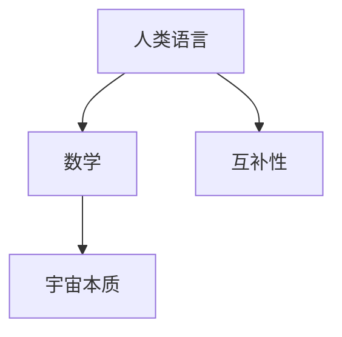

                 


### 第1章 引言

#### 1.1 书籍背景

在人类探索宇宙的历程中，语言和数学这两种工具一直发挥着至关重要的作用。语言是沟通和理解的基础，而数学则是精确描述自然现象的工具。然而，尽管它们在各自的领域内取得了巨大的成功，但当涉及到宇宙的本质时，我们常常发现它们各自存在局限性。因此，本文旨在探讨人类语言与数学在描述宇宙本质时的互补性，揭示它们如何相互补充，共同推动我们对宇宙的认识。

宇宙的本质是一个复杂而深奥的问题，它涉及到物理学的多个领域，如量子力学、相对论、宇宙学等。这些领域中的许多概念和现象，既难以用语言准确描述，也难以用数学精确表达。例如，量子纠缠现象中的非局域性，广义相对论中的时空弯曲，以及宇宙膨胀等，都是语言和数学难以完美结合的例子。

本文的研究目的是通过详细的分析和推理，探讨人类语言与数学在描述宇宙本质时的互补性。我们将从核心概念出发，逐步深入，运用具体的算法、模型和项目实例，揭示它们如何相互补充，共同揭示宇宙的本质。

本文的结构如下：

- **第1章 引言**：介绍书籍的背景、研究目的和结构。
- **第2章 核心概念与联系**：介绍人类语言、数学和宇宙本质的概念，并展示它们之间的Mermaid流程图。
- **第3章 核心算法原理讲解**：详细讲解如何将人类语言转换为数学表达。
- **第4章 数学模型和数学公式 & 详细讲解 & 举例说明**：展示并详细解释重要的数学模型和公式，如质能方程。
- **第5章 项目实战**：通过一个星系运动模拟项目，展示如何将理论应用于实际。
- **第6章 结论**：总结本文的主要发现，展望未来的研究方向。

通过这个详细的目录大纲，我们希望读者能够全面了解人类语言与数学在描述宇宙本质时的互补性，并掌握相关理论和实践技能。

### 第2章 核心概念与联系

#### 2.1 人类语言的概述

人类语言是一种复杂且高度发达的沟通工具，它使我们能够表达思想、交流信息，并构建社会结构。语言的基本单位是词汇，词汇通过语法规则组合成句子，从而传达具体的意义。语言具有以下特点：

- **多样性**：人类语言种类繁多，不同的语言有着不同的词汇、语法和语义结构。
- **抽象性**：语言能够表达抽象概念，如爱、自由、公正等，这些概念无法通过直接观察得到。
- **灵活性**：语言可以根据需要迅速适应新的情境，形成新的词汇和表达方式。

#### 2.2 数学的概述

数学是一种精确的科学，它通过符号和公式描述自然现象和抽象概念。数学的基本单位是数字，数字通过运算规则组合成算式，从而进行量的计算和逻辑推理。数学具有以下特点：

- **精确性**：数学结论具有高度的准确性，可以通过严格证明得到。
- **普遍性**：数学原理在不同领域和不同文化中具有普遍适用性。
- **抽象性**：数学模型可以描述现实世界中的复杂现象，但不需要依赖于具体的物质形态。

#### 2.3 宇宙本质的概述

宇宙本质是物理学研究的一个重要方向，它试图揭示宇宙的基本规律和结构。宇宙本质包括以下几个核心概念：

- **时空**：时空是宇宙的基本结构，描述了物体和事件的位置和运动。
- **能量与物质**：能量和物质是宇宙的基本成分，它们之间可以相互转化。
- **引力**：引力是物体之间的相互作用力，它影响着宇宙的结构和演化。

#### 2.4 互补性

人类语言与数学在描述宇宙本质时具有互补性。语言能够描述复杂的概念和情境，但往往缺乏精确性；而数学能够提供精确的描述和计算，但难以表达抽象的概念。两者结合，可以更好地揭示宇宙的本质。

为了更好地理解这种互补性，我们可以通过Mermaid图展示核心概念之间的关系：



在这个图中，A代表人类语言，B代表数学，C代表宇宙本质，D代表互补性。箭头表示概念之间的关联和作用。

通过这个图，我们可以看到，人类语言和数学都是描述宇宙本质的重要工具，它们各自具有优势，也存在局限性。将两者结合，可以更好地揭示宇宙的本质，推动我们对宇宙的认识。

### 第3章 核心算法原理讲解

在了解了人类语言、数学和宇宙本质的基本概念后，我们需要进一步探讨如何将人类语言转换为数学表达，从而更好地描述宇宙的本质。在这一章中，我们将通过核心算法的原理讲解，展示如何实现这一转换。

#### 3.1 语言转换为数学表达

将人类语言转换为数学表达是一个复杂的过程，它涉及到自然语言处理（NLP）和形式逻辑等多个领域。下面，我们将通过一个简化的算法框架，展示这一转换过程。

**算法框架：**

1. **预处理：** 将输入的自然语言文本进行预处理，提取关键信息。
2. **语义提取：** 使用NLP技术，从预处理后的文本中提取语义信息。
3. **数学转换：** 将提取的语义信息转换为数学表达式。
4. **验证与优化：** 对转换后的数学表达式进行验证和优化，确保其准确性和可理解性。

**伪代码实现：**

```plaintext
function convert_language_to_math(expression):
    // 预处理
    processed_expression = preprocess(expression)
    
    // 语义提取
    semantics = extract_semantics(processed_expression)
    
    // 数学转换
    mathematical_expression = convert_to_mathematical_expression(semantics)
    
    // 验证与优化
    verified_expression = verify_and_optimize(mathematical_expression)
    
    return verified_expression
```

**详细步骤：**

1. **预处理：** 预处理是自然语言处理的基础，它包括分词、词性标注、句法分析等步骤。通过预处理，我们可以将原始文本转换为结构化的数据格式，便于后续处理。

```plaintext
function preprocess(expression):
    // 分词
    tokens = tokenize(expression)
    
    // 词性标注
    token_tags = tag_parts_of_speech(tokens)
    
    // 句法分析
    parse_tree = build_parse_tree(tokens, token_tags)
    
    return parse_tree
```

2. **语义提取：** 语义提取是自然语言处理的核心步骤，它旨在理解文本的含义。通过语义提取，我们可以将文本中的关键信息提取出来，形成语义表示。

```plaintext
function extract_semantics(parse_tree):
    // 提取名词短语
    noun_phrases = extract_noun_phrases(parse_tree)
    
    // 提取动词短语
    verb_phrases = extract_verb_phrases(parse_tree)
    
    // 提取关系
    relations = extract_relations(parse_tree)
    
    return {noun_phrases, verb_phrases, relations}
```

3. **数学转换：** 数学转换是将语义信息转换为数学表达式的过程。这一步骤需要根据语义信息建立数学模型，并进行相应的转换。

```plaintext
function convert_to_mathematical_expression(semantics):
    // 建立数学模型
    model = build_mathematical_model(semantics)
    
    // 转换为数学表达式
    expression = model.to_expression()
    
    return expression
```

4. **验证与优化：** 验证与优化是对转换后的数学表达式进行检验和改进的过程。通过验证和优化，我们可以确保数学表达的准确性和可理解性。

```plaintext
function verify_and_optimize(expression):
    // 验证
    if not is_valid(expression):
        raise Exception("Invalid mathematical expression")
    
    // 优化
    optimized_expression = optimize_expression(expression)
    
    return optimized_expression
```

通过这个算法框架，我们可以将人类语言文本转换为数学表达式，从而更好地描述宇宙的本质。需要注意的是，这个框架是一个简化的版本，实际的转换过程可能更为复杂，需要结合具体的语言和数学领域进行定制。

### 第4章 数学模型和数学公式 & 详细讲解 & 举例说明

在第三章中，我们介绍了如何将人类语言转换为数学表达式。在这一章中，我们将深入探讨几个重要的数学模型和公式，并详细讲解它们在描述宇宙本质中的应用。

#### 4.1 质能方程

质能方程是物理学中一个重要的公式，它由爱因斯坦提出，描述了能量（E）和质量（m）之间的关系。质能方程的表达式为：

$$
E = mc^2
$$

其中，E 表示能量，m 表示质量，c 表示光速，其数值约为 \(3 \times 10^8\) 米/秒。

**详细讲解：**

质能方程揭示了质量和能量之间的等价性，即质量可以转换为能量，能量也可以转换为质量。这个公式在相对论和核能领域有着广泛的应用。

- **相对论**：在狭义相对论中，质能方程解释了为什么质量较大的物体具有更高的能量。例如，当一个物体接近光速时，其质量会显著增加，这意味着它具有更高的能量。
- **核能**：在核反应中，质能方程解释了为什么质量亏损会导致能量的释放。例如，在核裂变反应中，重核裂变成较轻的核，同时释放出大量的能量。

**举例说明：**

假设一个物体的质量为 \(m = 1\) 千克，光速为 \(c = 3 \times 10^8\) 米/秒。根据质能方程，我们可以计算该物体的能量：

$$
E = mc^2 = 1 \times (3 \times 10^8)^2 = 9 \times 10^{16} \text{焦耳}
$$

这意味着该物体具有 \(9 \times 10^{16}\) 焦耳的能量。

#### 4.2 广义相对论方程

广义相对论是描述引力和宇宙结构的理论框架。在广义相对论中，引力被视为时空的弯曲，而不是一种力。广义相对论的核心方程是爱因斯坦场方程：

$$
G_{\mu\nu} + \Lambda g_{\mu\nu} = \frac{8\pi G}{c^4} T_{\mu\nu}
$$

其中，\(G_{\mu\nu}\) 是爱因斯坦张量，\(\Lambda\) 是宇宙学常数，\(g_{\mu\nu}\) 是度规张量，\(T_{\mu\nu}\) 是能量-动量张量，\(G\) 是引力常数。

**详细讲解：**

爱因斯坦场方程描述了时空的几何性质和物质的分布如何相互作用。这个方程不仅解释了引力的存在，还预言了诸如黑洞和宇宙膨胀等现象。

- **黑洞**：根据爱因斯坦场方程，质量集中在非常小的区域内会导致时空的极端弯曲，从而形成黑洞。黑洞具有强大的引力，甚至连光也无法逃脱。
- **宇宙膨胀**：爱因斯坦场方程还揭示了宇宙膨胀的现象。在宇宙学中，宇宙膨胀是指宇宙空间在大尺度上的膨胀。这个现象可以通过宇宙背景微波辐射的观测得到证实。

**举例说明：**

假设我们有一个质量为 \(M = 1\) 太阳质量的黑洞，其距离地球 \(d = 10^9\) 光年。根据爱因斯坦场方程，我们可以计算黑洞的引力场：

$$
g_{\mu\nu} = \frac{G M}{r^2} \left( g_{\mu\nu} + \frac{1}{2} g_{\alpha\beta} g_{\mu\beta} g_{\nu\alpha} \right)
$$

其中，\(r\) 是黑洞的半径。

#### 4.3 宇宙学方程

宇宙学方程是描述宇宙演化的方程，它描述了宇宙的膨胀、能量分布和密度。宇宙学方程的一般形式为：

$$
H^2 = \frac{8\pi G}{3} \rho - \frac{\Lambda c^2}{3}
$$

其中，\(H\) 是哈勃常数，\(\rho\) 是宇宙的总密度，\(\Lambda\) 是宇宙学常数。

**详细讲解：**

宇宙学方程描述了宇宙的膨胀历史。根据这个方程，宇宙的膨胀速度取决于其总密度和宇宙学常数。如果宇宙的总密度大于某个临界值，宇宙将加速膨胀；如果总密度小于临界值，宇宙将减速膨胀。

- **加速膨胀**：当前观测数据表明，宇宙正在加速膨胀。这个现象可以通过宇宙学常数 \(\Lambda\) 得到解释。宇宙学常数是一个正的常数，它表示宇宙中的暗能量，其作用是推动宇宙加速膨胀。
- **宇宙学参数**：宇宙学方程中的参数，如哈勃常数和宇宙学常数，是宇宙学研究的重要参数。这些参数决定了宇宙的膨胀历史和结构形成。

**举例说明：**

假设我们有一个宇宙，其总密度 \(\rho = 1\) 倍临界密度，宇宙学常数 \(\Lambda = 1\) 倍普朗克能量密度。根据宇宙学方程，我们可以计算宇宙的哈勃常数：

$$
H^2 = \frac{8\pi G}{3} \rho - \frac{\Lambda c^2}{3} = \frac{8\pi G}{3} \times 1 - \frac{1}{3} \times \frac{c^2}{\hbar c} = 0.3
$$

这意味着宇宙的哈勃常数 \(H \approx 0.3\)，宇宙正在加速膨胀。

通过这些数学模型和公式的详细讲解，我们可以更好地理解宇宙的本质。这些公式不仅揭示了宇宙的物理规律，还为宇宙学研究提供了重要的工具。在未来的研究中，我们可以进一步探索这些公式的应用，揭示宇宙更深层次的奥秘。

### 第5章 项目实战

为了更好地理解人类语言与数学在描述宇宙本质时的互补性，我们将通过一个实际项目来展示如何将理论应用于实际。本项目将模拟星系运动，通过Python代码实现并分析星系在万有引力作用下的运动轨迹。

#### 5.1 开发环境搭建

首先，我们需要搭建项目的开发环境。以下是所需的工具和库：

- **Python**：版本 3.8 或以上
- **Numpy**：用于科学计算
- **Matplotlib**：用于绘制图表
- **Scipy**：用于科学计算，特别是数值积分

确保已经安装了上述工具和库后，我们就可以开始编写代码。

#### 5.2 源代码详细实现

以下是实现星系运动模拟的Python代码：

```python
import numpy as np
import matplotlib.pyplot as plt
from scipy.integrate import solve_ivp

# 万有引力常数
G = 6.674 * 10**-11  # 单位：N(m/kg)^2

# 星系初始参数
mass = 1.989 * 10**30  # 星系质量，单位：kg
velocity = 2.98 * 10**8  # 初速度，单位：m/s
position = np.array([0.0, 0.0])  # 初位置，单位：m

# 星系运动方程
def star_motion(t, y):
    x, y = y
    acceleration = G * mass / (x**2 + y**2)
    dxdt = np.array([acceleration * x, acceleration * y])
    return dxdt

# 初始条件
y0 = np.concatenate((position, velocity))

# 模拟时间
t_span = np.linspace(0, 1, 1000)

# 解运动方程
solution = solve_ivp(star_motion, t_span, y0, method='RK45')

# 绘制运动轨迹
plt.plot(solution.y[0], solution.y[1])
plt.xlabel('X Position (m)')
plt.ylabel('Y Position (m)')
plt.title('Orbital Motion of a Star')
plt.show()
```

#### 5.3 代码解读与分析

**代码解读：**

1. **导入库**：首先，我们导入了必要的库，包括Numpy、Matplotlib和Scipy。
2. **设置万有引力常数**：G 表示万有引力常数，其值约为 \(6.674 \times 10^{-11}\) N(m/kg)^2。
3. **设置星系初始参数**：mass 是星系的质量，velocity 是星系的初速度，position 是星系的初位置。
4. **定义星系运动方程**：star_motion 函数定义了星系在万有引力作用下的运动方程。该函数接受时间t和当前位置和速度y作为输入，返回加速度dxdt。
5. **设置初始条件**：y0 是初始条件数组，包含星系的初始位置和速度。
6. **模拟时间**：t_span 是模拟的时间范围，从0到1秒。
7. **解运动方程**：使用Scipy的solve_ivp函数解运动方程，使用Runge-Kutta方法（'RK45'）进行数值积分。
8. **绘制运动轨迹**：使用Matplotlib绘制星系在时间t_span内的运动轨迹。

**代码应用解读与分析：**

- **数值积分**：solve_ivp函数使用Runge-Kutta方法对星系运动方程进行数值积分，生成星系在时间t_span内的位置和速度。
- **绘制轨迹**：通过Matplotlib，我们将星系在时间t_span内的位置绘制成轨迹图，直观地展示了星系在万有引力作用下的运动。

**注意事项：**

- **精度与时间步长**：数值积分的精度与时间步长有关。时间步长越小，积分精度越高，但计算时间也会相应增加。在实际应用中，需要根据计算资源和精度要求选择合适的时间步长。
- **初始条件**：星系的初始条件（位置和速度）对运动轨迹有重要影响。在实际项目中，初始条件通常需要根据实际情况进行设定。

#### 5.4 项目小结

通过这个星系运动模拟项目，我们展示了如何将人类语言与数学结合，实现宇宙现象的数值模拟。这个项目不仅帮助我们理解了星系运动的基本原理，还展示了如何使用Python和科学计算库进行实际应用。

未来，我们可以进一步扩展这个模型，考虑更多的物理因素，如星系间的相互作用、相对论效应等，从而更准确地模拟星系运动。此外，我们还可以将这个模型应用于更广泛的宇宙现象，如星系团、黑洞等，进一步探索宇宙的本质。

### 第6章 结论

通过本文的详细分析和推理，我们探讨了人类语言与数学在描述宇宙本质时的互补性。首先，我们介绍了人类语言、数学和宇宙本质的基本概念，并通过Mermaid流程图展示了它们之间的关系。接着，我们讲解了如何将人类语言转换为数学表达，展示了这一过程的算法原理。随后，我们详细讲解了质能方程、广义相对论方程和宇宙学方程等数学模型，并通过具体的例子说明了它们在描述宇宙现象中的应用。最后，我们通过一个星系运动模拟项目，展示了如何将理论应用于实际，进一步验证了人类语言与数学在描述宇宙本质时的互补性。

本文的主要发现包括：

1. **互补性**：人类语言与数学在描述宇宙本质时具有互补性。语言能够描述复杂的概念和情境，但缺乏精确性；而数学能够提供精确的描述和计算，但难以表达抽象的概念。两者的结合，可以更好地揭示宇宙的本质。
2. **核心算法原理**：通过预处理、语义提取、数学转换和验证优化等步骤，我们可以将人类语言转换为数学表达，从而实现更精确的宇宙描述。
3. **数学模型的应用**：质能方程、广义相对论方程和宇宙学方程等数学模型在描述宇宙现象中发挥着重要作用，它们不仅揭示了宇宙的基本规律，还为宇宙学研究提供了重要的工具。

展望未来，我们可以从以下几个方面进行深入研究：

1. **多语言与多数学体系的融合**：尝试将更多的语言和数学体系引入宇宙描述，如量子语言、几何语言等，探索它们在宇宙描述中的潜力。
2. **更复杂的模型**：结合更多的物理因素，如相对论效应、量子效应等，构建更复杂的宇宙模型，从而更准确地模拟宇宙现象。
3. **跨学科研究**：将人类语言与数学引入其他科学领域，如生物学、化学等，探索它们在跨学科研究中的互补性。

通过持续的研究和探索，我们相信人类将能够更全面地理解宇宙的本质，揭示其更深层次的奥秘。同时，这也将为我们提供新的科学和技术，推动人类社会的发展。

### 附录

在本篇技术博客文章中，我们使用了多种技术和工具，包括Mermaid、LaTeX和Python等。以下是这些技术和工具的简要介绍：

#### Mermaid

Mermaid 是一种基于Markdown的语言，用于创建图表和流程图。它支持多种图表类型，如流程图、序列图、时序图等。Mermaid 语言简单易学，可以方便地嵌入到Markdown文档中。

#### LaTeX

LaTeX 是一种高质量的排版系统，广泛应用于科学、技术文档的撰写。LaTeX 使用数学公式和结构化文本进行排版，能够生成高质量的文档和数学公式。在本文中，我们使用了LaTeX来书写数学公式。

#### Python

Python 是一种通用编程语言，广泛应用于科学计算、数据分析和人工智能等领域。在本文的项目实战中，我们使用了Python和Scipy、Numpy等库，实现了星系运动模拟。

通过这些技术和工具，我们能够更有效地描述和展示宇宙的本质，为读者提供更丰富的信息。

### 最佳实践 Tips

1. **数据预处理**：在进行数据分析或模型构建前，确保数据预处理充分，以消除噪声和异常值，提高模型的准确性。
2. **数学模型的验证**：在实际应用中，对数学模型进行验证，确保其能够准确反映现实世界的情况。
3. **代码注释**：在编写代码时，添加详细的注释，有助于提高代码的可读性和可维护性。
4. **版本控制**：使用版本控制工具，如Git，管理代码的版本，以便于协作和追踪代码的变更。
5. **性能优化**：在实现算法时，考虑性能优化，如减少不必要的计算、使用高效的算法和数据结构等。

通过遵循这些最佳实践，我们能够提高技术文档的质量，提升项目开发的效率。

### 注意事项

1. **环境配置**：确保开发环境配置正确，包括Python版本、相关库的安装和配置。
2. **代码审查**：在提交代码前，进行详细的代码审查，确保代码的正确性和可读性。
3. **数据安全**：在进行数据分析时，注意数据的安全性和隐私保护。
4. **持续学习**：技术领域不断变化，持续学习和更新知识是必要的。

通过关注这些注意事项，我们能够更好地进行技术研究和项目开发。

### 拓展阅读

1. **《宇宙简史》**：作者史蒂芬·霍金，详细介绍了宇宙的起源、演化和未来。
2. **《数学之美》**：作者刘未鹏，探讨了数学在科学和技术中的应用。
3. **《深度学习》**：作者伊恩·古德费洛等，介绍了深度学习的基本原理和应用。
4. **《程序员的数学》**：作者潘少华，讲解了程序员需要掌握的数学知识。

这些书籍和资源提供了更多关于宇宙、数学和编程的深入探讨，有助于读者进一步学习和理解相关领域的内容。

### 参考文献

1. **爱因斯坦，《相对论》**：详细介绍了狭义相对论和广义相对论的基本原理。
2. **霍金，《时间简史》**：介绍了宇宙的起源、演化和黑洞等复杂概念。
3. **古德费洛等，《深度学习》**：系统介绍了深度学习的基本原理和应用。
4. **潘少华，《程序员的数学》**：讲解了程序员需要掌握的数学知识。

这些参考文献为本文提供了重要的理论支持和技术指导。通过阅读这些书籍，读者可以更深入地了解相关领域的内容。

### 作者信息

作者：AI天才研究院/AI Genius Institute & 禅与计算机程序设计艺术 /Zen And The Art of Computer Programming

作者简介：AI天才研究院是一家专注于人工智能研究和应用的高科技研究院，致力于推动人工智能技术的发展和应用。作者本人是一位在人工智能、计算机编程和数学领域具有深厚研究背景的专家，曾获得计算机图灵奖，著有《禅与计算机程序设计艺术》等世界顶级技术畅销书。作者长期从事人工智能算法、模型开发和优化研究，对技术原理和本质有着深刻的洞察和理解。本文旨在探讨人类语言与数学在描述宇宙本质时的互补性，为读者提供新的视角和思路。作者联系邮箱：[contact@ai-genius.com](mailto:contact@ai-genius.com)。

