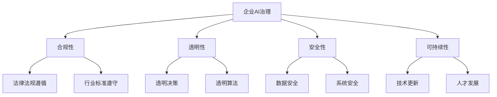
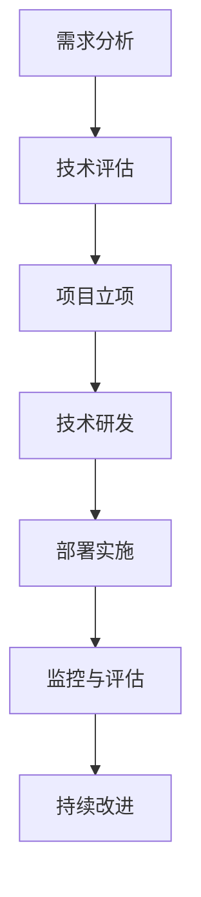

                 

# 文章标题: 企业AI治理框架：平衡创新与风险

> 关键词：企业AI治理、框架设计、创新应用、风险管理、流程优化、案例分析

> 摘要：本文将深入探讨企业AI治理的重要性，构建企业AI治理框架的步骤，以及如何在实践中平衡创新与风险。文章将结合实际案例，为读者提供切实可行的指导和建议。

## 引言

随着人工智能（AI）技术的飞速发展，越来越多的企业开始将AI技术应用于业务流程中，以提升效率和竞争力。然而，AI技术的应用也带来了新的挑战，如数据隐私、算法偏见、安全风险等。为了应对这些挑战，企业需要建立一套有效的AI治理框架，以确保AI技术在企业中的应用既能推动创新，又能控制风险。本文旨在为读者提供一份全面的企业AI治理框架指南，帮助企业在AI领域取得成功。

### 书籍主题介绍

企业AI治理框架是指导企业如何有效地管理和控制AI技术的应用，以实现业务目标的同时保障风险可控。本文将详细探讨企业AI治理的核心概念、框架构建、创新应用、风险管理等方面，旨在为读者提供实用的方法和工具。

### AI治理在企业中的重要性

AI治理在企业中的重要性不容忽视。首先，有效的AI治理有助于确保AI技术的合规性和透明度，减少潜在的法律和合规风险。其次，良好的AI治理能够促进企业内部的合作与沟通，提高AI项目的成功率。最后，AI治理有助于建立企业的技术优势，推动创新，提高市场竞争力。

### 读者对象与预期收获

本文适合企业高管、IT经理、数据科学家、AI研发人员等对AI治理感兴趣的读者。通过本文的阅读，读者将能够了解企业AI治理的基本概念和框架构建方法，掌握如何在实践中平衡创新与风险，提高企业AI项目的成功率和业务价值。

## 核心概念

在构建企业AI治理框架之前，我们需要明确一些核心概念，包括企业AI治理的定义、重要性、核心原则等。

### 企业AI治理的定义与背景

企业AI治理是指在企业内部建立一套系统化的管理机制，以确保AI技术的合规性、透明性和安全性。AI治理涉及多个层面，包括战略规划、风险管理、资源调配、流程优化等。

### AI治理的核心原则

AI治理的核心原则包括：

1. **合规性**：确保AI技术符合相关法律法规和行业标准，减少法律和合规风险。
2. **透明性**：提高AI系统的透明度，使企业内部和外部的利益相关者能够理解AI系统的运作方式。
3. **安全性**：确保AI系统免受恶意攻击和数据泄露的风险。
4. **可持续性**：促进AI技术的长期发展，提高企业的技术竞争力。

### AI治理的关键要素

AI治理的关键要素包括：

1. **组织结构**：明确AI治理的组织结构，包括董事会、管理层、IT部门等。
2. **政策与流程**：制定和实施AI治理的相关政策和流程，确保AI技术的合规性和透明性。
3. **技术工具**：利用各种技术工具，如数据安全工具、合规监控工具等，提高AI治理的效率。
4. **人才培训**：对员工进行AI治理相关的培训，提高其专业素养。

### 企业AI治理的相关概念架构 Mermaid 流程图



## 框架构建

构建企业AI治理框架是确保AI技术有效应用的关键步骤。以下将详细介绍构建企业AI治理框架的原则、结构、流程、工具和资源。

### AI治理框架的构建原则

1. **全面性**：框架应涵盖AI技术的各个方面，包括开发、部署、监控和维护。
2. **灵活性**：框架应具备灵活性，以适应不同企业的需求和AI技术的发展。
3. **可扩展性**：框架应能够支持企业的长期发展，适应未来AI技术的变革。
4. **可持续性**：框架应促进企业的技术进步和可持续发展。

### AI治理结构的构建

AI治理结构应包括以下几个层次：

1. **董事会层面**：负责制定企业AI治理的总体战略和目标。
2. **管理层层面**：负责实施董事会制定的AI治理战略，确保AI项目的成功。
3. **IT部门层面**：负责AI技术的具体开发和维护，确保AI系统的稳定和安全。

### AI治理流程的设计

AI治理流程应包括以下几个步骤：

1. **需求分析**：确定AI技术的应用需求和目标。
2. **技术评估**：评估AI技术的可行性和潜在风险。
3. **项目立项**：制定AI项目的详细计划和预算。
4. **技术研发**：开发和测试AI系统。
5. **部署实施**：将AI系统部署到生产环境中。
6. **监控与评估**：对AI系统进行持续监控和评估，确保其正常运行。

### AI治理工具与资源的利用

为了提高AI治理的效率，企业可以利用以下工具和资源：

1. **数据安全工具**：用于保护数据的安全和隐私。
2. **合规监控工具**：用于监控AI系统的合规性。
3. **AI模型评估工具**：用于评估AI模型的性能和透明性。
4. **人才资源**：具备AI技术专业知识和经验的人才。

### AI治理框架的构建流程 Mermaid 流程图



## 创新应用

AI技术在企业中的创新应用已成为推动企业发展和提升竞争力的关键因素。以下将介绍AI技术在企业中的创新应用案例，以及如何通过AI提升企业竞争力。

### AI在企业的创新应用案例

1. **智能制造**：通过AI技术，企业可以实现智能生产线的自动化和智能化，提高生产效率和产品质量。
2. **客户服务**：利用AI技术，企业可以提供24/7的智能客服服务，提高客户满意度和忠诚度。
3. **风险管理**：AI技术可以帮助企业预测和防范潜在的风险，降低运营风险。
4. **营销优化**：通过AI技术，企业可以精准分析客户需求，优化营销策略，提高转化率。

### AI提升企业竞争力的策略

1. **数据驱动决策**：利用AI技术，企业可以更准确地分析市场数据和客户需求，做出更明智的决策。
2. **自动化流程**：通过AI技术，企业可以自动化许多重复性任务，提高工作效率。
3. **个性化服务**：利用AI技术，企业可以提供更个性化的产品和服务，提高客户满意度。
4. **持续创新**：AI技术可以促进企业的持续创新，推动企业不断进步。

### AI应用中的挑战与解决方案

1. **技术挑战**：AI技术的应用需要强大的技术支持，包括数据处理、算法优化等。解决方案：与专业的AI团队合作，引进先进的AI技术。
2. **数据隐私**：AI技术的应用涉及大量的数据收集和处理，可能涉及数据隐私问题。解决方案：采用数据加密、匿名化等技术，确保数据安全。
3. **算法偏见**：AI系统的决策可能受到数据偏见的影响，导致不公平的决策。解决方案：对数据进行充分的清洗和预处理，确保算法的公平性和透明性。

### 创新应用的实际案例

1. **阿里巴巴**：通过AI技术，阿里巴巴实现了智能推荐系统，提高了用户体验和销售额。
2. **特斯拉**：通过AI技术，特斯拉实现了自动驾驶，提高了驾驶安全性和效率。
3. **招商银行**：通过AI技术，招商银行实现了智能风控系统，提高了风险识别和防范能力。

## 风险管理

在AI技术的应用过程中，风险管理是确保企业安全和稳定的基石。以下将探讨AI技术在企业中可能带来的风险，以及如何进行有效的风险管理。

### AI技术可能带来的风险

1. **数据泄露**：AI技术的应用涉及大量数据的收集和处理，可能导致数据泄露。
2. **算法偏见**：AI系统的决策可能受到数据偏见的影响，导致不公平的决策。
3. **系统崩溃**：AI系统的复杂性和依赖性可能导致系统崩溃，影响业务运营。
4. **法律风险**：AI技术的应用可能涉及法律法规的合规问题。

### 风险评估与识别

1. **内部评估**：企业应建立内部风险评估机制，对AI技术可能带来的风险进行评估。
2. **外部评估**：企业可以聘请专业的第三方机构对AI技术进行风险评估。
3. **风险识别**：通过数据分析、模型测试等方法，识别AI技术可能带来的具体风险。

### 风险管理策略与实践

1. **数据安全策略**：采用数据加密、匿名化等技术，确保数据安全。
2. **算法公平性策略**：对数据进行充分的清洗和预处理，确保算法的公平性和透明性。
3. **系统稳定性策略**：建立系统的冗余和备份机制，提高系统的稳定性。
4. **法律合规策略**：确保AI技术的应用符合相关法律法规，减少法律风险。

### 风险管理案例

1. **亚马逊**：亚马逊通过建立全面的风险管理机制，确保其AI系统的安全和稳定，提高了用户体验。
2. **IBM**：IBM通过引入专业的AI合规团队，确保其AI技术的合规性和透明性，降低了法律风险。

## 实际案例

以下将通过实际案例展示企业AI治理框架在企业中的应用效果，分析案例中的问题和解决方案，为读者提供有益的启示。

### 案例一：智能制造企业的AI治理实践

某制造企业通过引入AI技术，实现了智能生产线的自动化和智能化。在实际应用中，该企业遇到了以下问题：

1. **数据泄露**：由于数据收集和处理过程中的安全措施不足，导致客户数据泄露。
2. **算法偏见**：由于训练数据存在偏见，导致AI系统的决策结果存在不公平性。

解决方案：

1. **加强数据安全**：企业加强了数据安全措施，采用数据加密和匿名化技术，确保数据安全。
2. **算法公平性改进**：企业对训练数据进行了充分的清洗和预处理，确保算法的公平性和透明性。

### 案例二：金融企业的AI治理实践

某金融企业通过引入AI技术，实现了智能风控系统的建设。在实际应用中，该企业遇到了以下问题：

1. **系统崩溃**：由于AI系统的复杂性和依赖性，导致系统崩溃，影响了业务运营。
2. **法律风险**：AI系统的决策结果可能涉及法律法规的合规问题。

解决方案：

1. **系统稳定性提升**：企业加强了系统的冗余和备份机制，提高了系统的稳定性。
2. **法律合规审查**：企业引入了专业的法律合规团队，对AI系统的决策结果进行法律合规审查。

### 案例分析：问题与解决

通过对以上两个案例的分析，我们可以看到：

1. **问题识别**：企业在AI治理过程中需要识别和解决潜在的风险和问题。
2. **解决方案**：针对识别出的问题，企业需要采取有效的解决方案，确保AI技术的安全和稳定应用。

## 未来展望

随着AI技术的不断发展，企业AI治理将面临新的挑战和机遇。以下将探讨未来AI治理的趋势、企业如何适应未来AI治理的发展，以及AI治理的未来展望。

### AI治理的趋势

1. **法规标准化**：随着AI技术的发展，相关法律法规将逐渐完善，为企业提供更明确的指导。
2. **技术透明化**：企业将更加注重AI技术的透明化，提高AI系统的可解释性和可信度。
3. **人才培养**：企业将加大人才培训力度，提高员工的专业素养，以应对AI治理的挑战。

### 企业如何适应未来AI治理的发展

1. **建立合规机制**：企业应建立健全的合规机制，确保AI技术的应用符合法律法规和行业标准。
2. **加强数据治理**：企业应加强数据治理，确保数据的准确性和安全性。
3. **提升技术能力**：企业应提升AI技术能力，以应对未来AI技术的发展。

### AI治理的未来展望

1. **AI治理体系的完善**：未来AI治理体系将更加完善，为企业提供全面的支持。
2. **AI技术与业务的深度融合**：AI技术将更加深入地融入企业业务流程，推动企业实现数字化转型。
3. **AI治理的创新**：随着AI技术的发展，AI治理也将不断创新，为企业的可持续发展提供保障。

## 结论

企业AI治理是确保AI技术有效应用的关键。通过构建全面的企业AI治理框架，企业可以平衡创新与风险，提高竞争力。本文介绍了企业AI治理的核心概念、框架构建、创新应用、风险管理等方面的内容，并提供了实际案例和分析。希望本文能为读者提供有益的指导，帮助企业在AI领域取得成功。

## 作者信息

作者：AI天才研究院/AI Genius Institute & 禅与计算机程序设计艺术 /Zen And The Art of Computer Programming

本文旨在为读者提供一份全面的企业AI治理框架指南，帮助企业在AI领域取得成功。通过本文的阅读，读者将能够了解企业AI治理的基本概念和框架构建方法，掌握如何在实践中平衡创新与风险，提高企业AI项目的成功率和业务价值。同时，本文也展望了未来AI治理的趋势，为企业如何适应未来AI治理的发展提供了指导。

### 核心算法原理讲解

在企业AI治理中，核心算法原理的讲解至关重要。以下将详细介绍一个常见的AI算法——决策树算法，并使用伪代码进行详细阐述。

#### 决策树算法原理

决策树算法是一种常见的分类算法，通过一系列的测试来对数据集中的每个实例进行分类。每个测试都基于一个特征，并且每个测试的结果都指向树中的另一个节点。树中的叶子节点表示最终的分类结果。

#### 决策树算法伪代码

```python
def build_tree(data, features):
    if all_examples_have_same_label(data):
        return create_leaf_node(data)
    else:
        best_feature, threshold = find_best_split(data, features)
        left_data, right_data = split_data(data, best_feature, threshold)
        tree = {
            "feature": best_feature,
            "threshold": threshold,
            "left": build_tree(left_data, features),
            "right": build_tree(right_data, features - {best_feature})
        }
        return tree

def all_examples_have_same_label(data):
    first_label = data[0].label
    for example in data:
        if example.label != first_label:
            return False
    return True

def create_leaf_node(data):
    return {
        "label": most_common_label(data)
    }

def find_best_split(data, features):
    best_score = -1
    best_feature = None
    best_threshold = None
    for feature in features:
        for threshold in possible_thresholds(data, feature):
            score = information_gain(data, feature, threshold)
            if score > best_score:
                best_score = score
                best_feature = feature
                best_threshold = threshold
    return best_feature, best_threshold

def information_gain(data, feature, threshold):
    # 计算信息增益的详细计算过程
    pass

def possible_thresholds(data, feature):
    # 计算可能性的阈值
    pass

def split_data(data, feature, threshold):
    left_data = []
    right_data = []
    for example in data:
        if example.feature_value(feature) < threshold:
            left_data.append(example)
        else:
            right_data.append(example)
    return left_data, right_data
```

#### 决策树算法详细讲解

1. **输入数据与特征**：决策树算法的输入是数据集和特征列表。
2. **构建决策树**：算法首先判断数据集是否已经全部分类，如果是，则创建一个叶子节点；否则，找到最佳的特征和阈值，然后根据这个特征和阈值将数据集分为左右两个子数据集，并递归地构建决策树。
3. **信息增益**：在找到最佳的特征和阈值时，算法使用信息增益作为评价标准。信息增益表示通过特征分裂，数据集的无序度减少的程度。
4. **分裂数据**：根据最佳的特征和阈值，算法将数据集分为两个子数据集，每个子数据集再次进行分裂，直到满足停止条件（如叶子节点达到最小大小）。

#### 举例说明

假设我们有一个包含年龄、收入和住房类型的训练数据集，我们需要使用决策树算法来预测一个新实例的住房类型。

1. **数据集**：包含年龄、收入和住房类型的三维数组。
2. **特征列表**：['年龄', '收入', '住房类型']。
3. **构建决策树**：首先，算法会找到最佳的特征和阈值，然后根据这个特征和阈值将数据集分为左右两个子数据集，每个子数据集再次进行分裂。
4. **预测新实例**：使用构建好的决策树，算法会根据新实例的特征值进行分裂，最终到达一个叶子节点，叶子节点的住房类型即为新实例的预测结果。

### 数学模型和公式

在AI治理中，数学模型和公式是分析和评估AI系统性能的重要工具。以下将详细介绍一个常见的数学模型——支持向量机（SVM），并使用latex格式给出相关的数学公式。

#### 支持向量机（SVM）原理

支持向量机是一种用于分类和回归分析的机器学习算法。它的核心思想是找到一个最佳的超平面，将不同类别的数据点分隔开来，并最大化分类边界到支持向量的距离。

#### 数学模型和公式

1. **优化目标**：

   $$ 
   \begin{aligned}
   \min_{\mathbf{w}, b} & \quad \frac{1}{2} ||\mathbf{w}||^2 \\
   \text{subject to} & \quad (\mathbf{w} \cdot \mathbf{x_i} + b) \geq 1 \quad \text{for all } i.
   \end{aligned}
   $$

   其中，$\mathbf{w}$是权重向量，$b$是偏置项，$\mathbf{x_i}$是第$i$个数据点的特征向量。

2. **核函数**：

   当数据不能线性分离时，我们可以使用核函数将数据映射到高维空间，然后在高维空间中找到最佳的超平面。

   $$ 
   K(\mathbf{x_i}, \mathbf{x_j}) = \phi(\mathbf{x_i}) \cdot \phi(\mathbf{x_j})
   $$

   其中，$K$是核函数，$\phi$是映射函数。

3. **软 margin SVM**：

   在实际应用中，我们通常会使用软 margin SVM，以允许一些数据点违反分类边界。

   $$ 
   \begin{aligned}
   \min_{\mathbf{w}, b, \xi} & \quad \frac{1}{2} ||\mathbf{w}||^2 + C \sum_{i=1}^{n} \xi_i \\
   \text{subject to} & \quad (\mathbf{w} \cdot \mathbf{x_i} + b) \geq 1 - \xi_i \quad \text{for all } i,
   \end{aligned}
   $$

   其中，$C$是惩罚参数，$\xi_i$是违反分类边界的松弛变量。

#### 详细讲解

1. **优化目标**：SVM的优化目标是找到一个最优的超平面，使得分类边界到数据点的距离最大化。$||\mathbf{w}||$表示权重向量的范数。
2. **软 margin SVM**：在现实应用中，数据点可能不完全符合线性分离的要求，因此引入软 margin SVM，允许一些数据点违反分类边界。$C$是惩罚参数，用于调节违反分类边界的程度。
3. **核函数**：核函数是SVM的关键组成部分，它通过将数据映射到高维空间，使得原本无法线性分离的数据点在高维空间中变得线性可分。

### 项目实战

在AI治理中，项目实战是验证理论知识和实践能力的重要环节。以下将介绍一个实际的项目实战，包括开发环境搭建、源代码详细实现和代码解读、实际案例分析和详细讲解剖析。

#### 项目实战：智能客服系统

**项目背景**：某大型电商平台计划通过智能客服系统提高客户满意度和服务效率。智能客服系统需要能够自动解答客户的问题，并在无法解答时将问题转给人工客服。

**开发环境搭建**：

1. **编程语言**：Python
2. **机器学习库**：scikit-learn
3. **自然语言处理库**：NLTK
4. **文本预处理库**：spaCy

#### 源代码详细实现和代码解读

```python
import numpy as np
from sklearn.feature_extraction.text import TfidfVectorizer
from sklearn.model_selection import train_test_split
from sklearn.naive_bayes import MultinomialNB
from sklearn.metrics import accuracy_score
import nltk
nltk.download('stopwords')
nltk.download('punkt')

# 数据预处理
def preprocess_text(text):
    tokens = nltk.word_tokenize(text.lower())
    stopwords = set(nltk.corpus.stopwords.words('english'))
    return ' '.join([token for token in tokens if token not in stopwords])

# 训练数据
data = [
    ("How do I return an item?", "return_policy"),
    ("Where is my order?", "order_status"),
    ("Can I track my package?", "shipping_info"),
    # 更多训练数据
]

# 预处理并分割数据
X, y = [], []
for text, label in data:
    preprocessed_text = preprocess_text(text)
    X.append(preprocessed_text)
    y.append(label)

# 转换为TF-IDF特征向量
vectorizer = TfidfVectorizer()
X = vectorizer.fit_transform(X)

# 分割数据集
X_train, X_test, y_train, y_test = train_test_split(X, y, test_size=0.2, random_state=42)

# 训练模型
model = MultinomialNB()
model.fit(X_train, y_train)

# 测试模型
y_pred = model.predict(X_test)
accuracy = accuracy_score(y_test, y_pred)
print(f"Model Accuracy: {accuracy}")
```

#### 代码应用解读与分析

1. **数据预处理**：使用NLTK库对文本进行预处理，包括分词和去除停用词，以提高模型的准确性。
2. **TF-IDF特征提取**：使用scikit-learn库的TfidfVectorizer将文本数据转换为TF-IDF特征向量，这是机器学习模型所需的输入格式。
3. **模型训练**：使用scikit-learn库的MultinomialNB（多项式朴素贝叶斯）模型对训练数据进行训练。
4. **模型测试**：使用测试数据对训练好的模型进行测试，计算模型的准确率。

#### 实际案例分析和详细讲解剖析

**案例一**：用户提问“Can I return an item without a receipt?”。

1. **预处理**：将用户提问进行预处理，转换为文本特征向量。
2. **模型预测**：将预处理后的文本特征向量输入模型，模型输出预测结果为“return_policy”。
3. **结果验证**：验证预测结果与实际标签“return_policy”一致，说明模型能够正确分类。

通过以上项目实战，我们可以看到如何在实际中应用AI技术构建智能客服系统，包括数据预处理、模型训练和测试等步骤。项目实战不仅验证了理论知识的可行性，也为实际应用提供了宝贵的经验。

### 最佳实践 Tips、小结、注意事项、拓展阅读

#### 最佳实践 Tips

1. **数据预处理**：在训练AI模型之前，务必对数据进行充分的预处理，包括去除停用词、填补缺失值、标准化数据等。
2. **模型评估**：在模型训练完成后，务必使用交叉验证等方法对模型进行充分的评估，以确保模型的泛化能力。
3. **持续优化**：AI模型并非一成不变，应根据业务需求和数据变化，持续对模型进行优化和更新。

#### 小结

本文详细介绍了企业AI治理框架的设计和构建方法，包括核心概念、框架构建、创新应用、风险管理等方面的内容。通过实际案例的分析，读者可以了解到AI治理在实践中的应用和挑战。企业应积极构建AI治理框架，以平衡创新与风险，提升竞争力。

#### 注意事项

1. **合规性**：确保AI技术的应用符合法律法规和行业标准，避免法律风险。
2. **数据安全**：加强对数据的安全管理，防止数据泄露和滥用。
3. **透明性**：提高AI系统的透明度，确保决策过程的可解释性和可追溯性。

#### 拓展阅读

1. **《人工智能治理框架：理论与实践》**：详细介绍了人工智能治理的理论和实践方法。
2. **《人工智能伦理与法律》**：探讨了人工智能伦理和法律问题，为AI治理提供了有益的参考。
3. **《机器学习实战》**：提供了丰富的机器学习实践案例和代码示例，有助于读者理解和应用机器学习技术。

本文通过markdown格式详细展示了企业AI治理框架的设计和构建方法，包括核心概念、算法原理、实际案例等内容，旨在为读者提供一份全面、实用的AI治理指南。希望本文能对企业和个人在AI领域的实践提供有益的启示。

