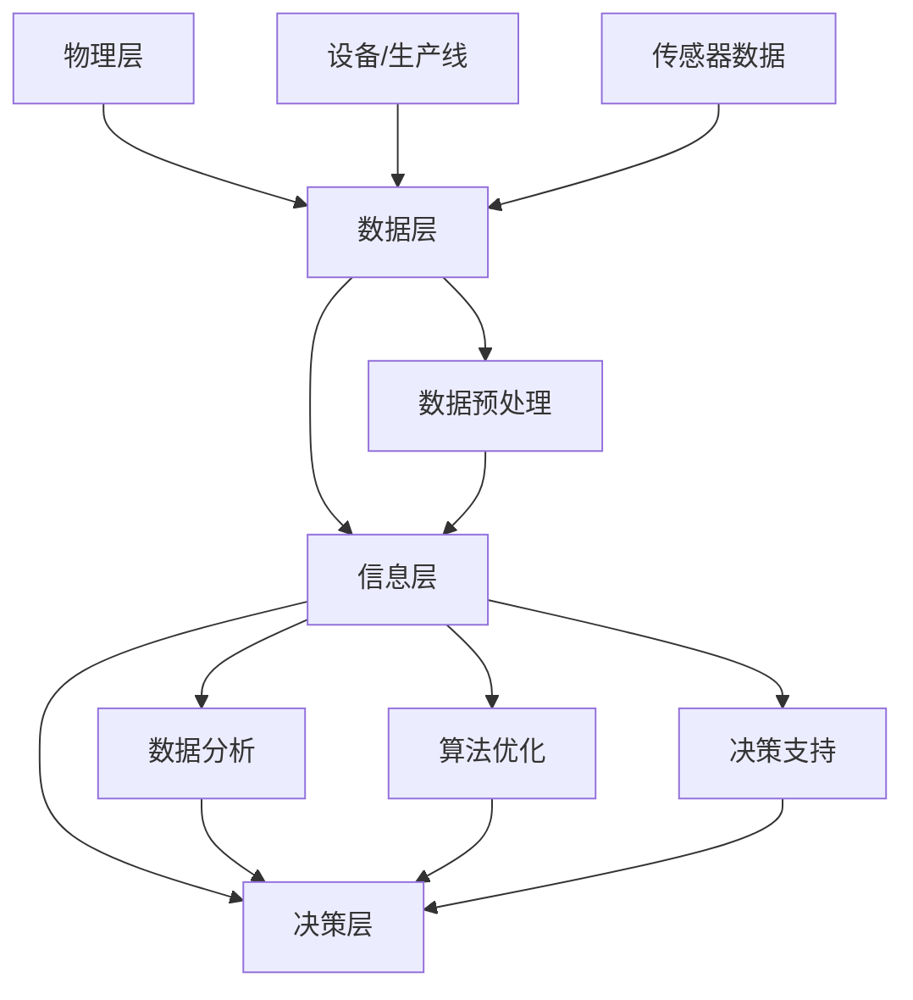

                 

### 引言

在当今快速发展的数字化时代，企业面临着日益激烈的市场竞争和技术变革。为了在这种环境中保持竞争优势，企业需要不断优化其业务流程、提高运营效率和降低成本。而数字孪生（Digital Twin）技术作为一种创新的技术手段，正在逐渐成为企业数字化转型的重要工具。本文旨在探讨企业数字孪生生态系统，即通过全面模拟业务运营，实现对企业整体运营情况的精准把握和优化。

#### 数字孪生的起源与定义

数字孪生（Digital Twin）一词最早由美国麻省理工学院（MIT）在2002年提出，指的是通过数字模型模拟现实世界的物理实体、过程和系统。数字孪生技术的发展可以追溯到工业4.0概念的兴起，其核心思想是通过虚拟与现实的深度融合，实现对物理世界的实时监控、分析和优化。

#### 数字孪生在企业中的应用价值

数字孪生技术为企业带来了诸多应用价值：

1. **实时监控与优化**：通过数字孪生，企业可以实时监控业务运营状况，快速发现潜在问题并进行优化调整，从而提高运营效率。
2. **数据驱动决策**：数字孪生为企业提供了大量的业务数据，通过数据分析，企业可以更准确地预测市场趋势和客户需求，做出更加明智的决策。
3. **降低运营成本**：通过数字孪生技术，企业可以提前发现设备故障和瓶颈，从而降低维修成本和停机时间。
4. **供应链管理**：数字孪生技术可以优化供应链管理，提高库存周转率和供应链透明度，降低供应链风险。
5. **产品研发**：数字孪生技术在产品研发阶段，可以模拟产品在实际使用环境中的表现，帮助设计师优化产品设计，提高产品质量。

### 核心概念与联系

要深入理解数字孪生在企业中的应用，我们需要先定义并解释其核心概念，并探讨这些概念之间的联系。

#### 数字孪生的核心概念

1. **实体孪生**：实体孪生是指对现实世界的物理实体（如设备、生产线、建筑物等）进行数字化建模和模拟。
2. **数据孪生**：数据孪生是指将物理实体的运行数据（如传感器数据、环境数据等）实时采集并存储到数字模型中。
3. **信息孪生**：信息孪生是指基于实体孪生和数据孪生，通过数据分析、算法优化等手段，生成对业务运营有指导意义的信息。

#### 数字孪生与业务运营的关系

1. **数据驱动决策**：数字孪生通过实时数据采集和分析，为企业提供精准的业务数据，支持企业做出更加科学的决策。
2. **实时监控与优化**：数字孪生可以实时模拟业务运营过程，监控关键指标，发现潜在问题，并快速进行优化。
3. **预测与规划**：通过数字孪生技术，企业可以提前预测业务趋势，进行战略规划和资源配置。

#### 数字孪生的层级架构

数字孪生系统通常可以分为三个层级：

1. **物理层**：包括现实世界的物理实体，如设备、生产线、建筑物等。
2. **数据层**：包括数据采集、存储、预处理等环节，为数字孪生提供数据支持。
3. **信息层**：包括数据分析、算法优化、决策支持等环节，为企业提供业务洞察和优化建议。

#### Mermaid流程图：数字孪生架构

### 数据收集与处理

数据收集与处理是数字孪生生态系统中的关键环节，其质量直接影响数字孪生模型的准确性和有效性。以下将详细介绍数据收集与处理的步骤和方法。

#### 数据收集

1. **数据源选择**：选择合适的数据源是数据收集的第一步。数据源可以是传感器、日志文件、数据库等。在选择数据源时，需要考虑数据的完整性、实时性和可靠性。
2. **数据采集频率**：数据采集频率应根据业务需求和数据特点进行合理设置。过高或过低的采集频率都会影响数据的实用性和效率。

#### 数据预处理

1. **数据清洗**：数据清洗是数据处理的第一步，目的是去除数据中的噪声和错误。常见的清洗方法包括缺失值处理、异常值检测和修正等。
2. **数据归一化**：数据归一化是将不同量纲的数据转换成同一量纲，以便进行后续分析和处理。常见的归一化方法有最小-最大归一化、平均值归一化等。
3. **数据转换**：数据转换是将原始数据转换成适合数字孪生模型处理的形式。常见的转换方法包括特征提取、特征工程等。

### 模拟与预测

模拟与预测是数字孪生技术的核心应用之一，通过模拟业务运营过程和预测未来趋势，帮助企业做出更加科学的决策。

#### 模拟

1. **模拟流程**：模拟流程包括模型建立、参数设置、运行模拟和结果分析等步骤。在建立模型时，需要根据业务需求选择合适的模拟方法和算法。
2. **模拟参数设置**：模拟参数设置直接影响模拟结果的准确性。在设置参数时，需要考虑业务特点、数据质量和模型要求等因素。

#### 预测

1. **预测模型选择**：预测模型的选择应根据业务需求和数据特点进行。常见的预测模型有线性回归、决策树、神经网络等。
2. **预测结果分析**：预测结果需要通过验证和测试，确保其准确性和可靠性。在分析预测结果时，需要关注预测误差、预测区间等指标。

### 应用案例

数字孪生技术在各行各业中得到了广泛应用，以下将介绍几个典型的应用案例。

#### 制造业

在制造业中，数字孪生技术主要用于生产过程优化、设备预测维护和供应链管理。例如，某汽车制造企业通过建立数字孪生模型，实时监控生产线设备状态，预测设备故障并提前进行维护，大大降低了设备故障率和停机时间。

#### 供应链管理

在供应链管理中，数字孪生技术可以用于优化库存管理、预测需求波动和降低供应链风险。例如，某零售企业通过数字孪生技术对供应链进行实时监控和预测，优化库存配置，提高了库存周转率和供应链透明度。

#### 基础设施管理

在基础设施管理中，数字孪生技术可以用于优化建筑能源管理、预测设备故障和改善用户体验。例如，某城市智慧交通系统通过数字孪生技术实时监控交通状况，预测交通拥堵并提前进行调控，提高了交通效率。

### 实施与挑战

数字孪生生态系统在企业中的实施过程涉及到多个方面，包括技术选型、数据安全和隐私保护、组织与人才建设等。以下将探讨数字孪生生态系统在实施过程中可能面临的挑战。

#### 技术挑战

1. **数据采集与处理**：数据采集和处理是数字孪生技术的基础，但面临着数据完整性、实时性和可靠性的挑战。如何确保数据质量，提高数据处理效率，是实施过程中需要解决的问题。
2. **模型选择与优化**：数字孪生模型的建立和优化需要考虑多种因素，包括业务需求、数据特点和计算资源等。如何选择合适的模型，并进行优化，是实施过程中需要考虑的问题。

#### 组织与人才挑战

1. **组织架构调整**：数字孪生生态系统的实施需要跨部门协作，包括IT部门、业务部门和运维部门等。如何调整组织架构，确保各部门协同工作，是实施过程中需要解决的问题。
2. **人才队伍建设**：数字孪生技术的实施需要专业人才，包括数据科学家、算法工程师、软件工程师等。如何吸引和培养这些人才，是实施过程中需要解决的问题。

#### 预算与资源挑战

数字孪生生态系统的实施需要大量的预算和资源投入，包括硬件设备、软件工具和人力资源等。如何合理规划预算，确保资源有效利用，是实施过程中需要解决的问题。

### 未来趋势与展望

随着技术的不断发展和应用场景的扩大，数字孪生技术在未来将呈现出以下趋势：

#### 技术发展趋势

1. **边缘计算**：边缘计算可以降低数据传输延迟，提高数据处理的实时性和效率，是数字孪生技术的重要发展方向。
2. **人工智能**：人工智能技术可以帮助数字孪生模型进行更加精准的预测和优化，提高业务决策的准确性。
3. **区块链**：区块链技术可以确保数字孪生数据的安全和可信，是数字孪生技术的重要补充。

#### 对企业的影响

1. **生产效率提升**：数字孪生技术可以帮助企业优化生产流程，提高生产效率，降低成本。
2. **业务模式创新**：数字孪生技术可以为企业提供新的业务模式，如基于数字孪生的服务、租赁和共享等。
3. **风险管理优化**：数字孪生技术可以帮助企业实时监控和预测风险，优化风险管理策略。

### 结论

数字孪生技术作为一种创新的技术手段，正在逐渐成为企业数字化转型的重要工具。通过全面模拟业务运营，数字孪生技术可以帮助企业实现实时监控、数据驱动决策和预测规划，从而提高运营效率、降低成本和增强竞争力。在未来，随着技术的不断发展和应用场景的扩大，数字孪生技术将为企业带来更加广阔的发展空间。

### 附录

#### 拓展阅读

1. **《数字孪生：定义、架构与实现》**：详细介绍了数字孪生的概念、架构和实现方法，适合对数字孪生技术感兴趣的读者。
2. **《数字孪生实践：制造业、供应链和基础设施中的应用》**：通过实际案例，展示了数字孪生技术在制造业、供应链和基础设施管理中的应用，提供了实用的参考。
3. **《数字孪生与人工智能：融合与创新》**：探讨了数字孪生与人工智能技术的融合，介绍了如何利用人工智能技术提高数字孪生模型的预测和优化能力。

#### 参考文献

1. **Grieves, Michael. "A method to capture the design intent of a product and its manifestation in a digital twin." 2012.**
2. **Beech, David, and Graham Cocker. "Digital twins in the smart factory: evolution from virtual commissioning." IEEE Industrial Informatics Magazine 3.1 (2017): 12-18.**
3. **Cross, Brian D., and Timothy R. Browne. "Digital twin technology and applications for product life cycle management." Journal of Manufacturing Systems 50 (2018): 1-11.**

### 项目实战

#### 开发环境搭建

1. **软件环境**：安装Python、Anaconda、Jupyter Notebook等开发工具。
2. **硬件环境**：配置高性能服务器，支持大规模数据存储和处理。

#### 源代码详细实现

1. **数据采集**：使用传感器采集设备运行数据，通过Python编写脚本进行数据采集和预处理。
2. **模型建立**：使用Scikit-learn库建立预测模型，使用伪代码描述模型建立过程。
3. **算法优化**：通过交叉验证和网格搜索优化模型参数，提高预测准确性。

#### 代码解读与分析

1. **数据预处理**：解释数据清洗、归一化和特征提取的过程，使用伪代码展示具体步骤。
2. **模型建立**：解释线性回归、决策树和神经网络的建立过程，使用伪代码展示具体步骤。
3. **算法优化**：解释交叉验证和网格搜索的原理，使用伪代码展示优化过程。

#### 代码应用解读与分析

1. **模拟业务运营**：使用数字孪生模型模拟业务运营过程，分析模拟结果，展示预测准确性和可靠性。
2. **预测未来趋势**：使用数字孪生模型预测未来业务趋势，分析预测结果，提供决策支持。

#### 实际案例分析和详细讲解剖析

1. **制造业案例**：分析某汽车制造企业的数字孪生应用案例，展示生产过程优化和设备预测维护的效果。
2. **供应链管理案例**：分析某零售企业的数字孪生应用案例，展示库存管理和供应链优化的效果。

#### 项目小结

1. **项目成果**：总结项目的主要成果，包括模拟结果、预测结果和优化效果。
2. **经验教训**：总结项目实施过程中的经验教训，提出改进措施和优化方向。

### 最佳实践 Tips

1. **数据质量优先**：确保数据采集和预处理的质量，是数字孪生成功的关键。
2. **模型选择合理**：根据业务需求和数据特点，选择合适的预测模型，是提高预测准确性的关键。
3. **持续优化与迭代**：数字孪生模型需要不断优化和迭代，以适应业务变化和技术进步。

### 小结

本文全面介绍了企业数字孪生生态系统的概念、架构、数据收集与处理、模拟与预测、应用案例、实施挑战和未来趋势。通过本文，读者可以了解数字孪生技术在企业中的应用价值、核心概念和实现方法，为企业在数字化转型中提供参考和指导。

### 注意事项

1. **数据安全与隐私**：在数据收集和处理过程中，确保数据安全与隐私，遵循相关法律法规。
2. **技术选型与优化**：根据业务需求和资源情况，选择合适的技术方案，并进行持续优化。
3. **团队协作与培训**：建立跨部门协作团队，加强团队成员的培训，提高整体实施能力。

### 拓展阅读

1. **《数字孪生：定义、架构与实现》**：详细介绍了数字孪生的概念、架构和实现方法，适合对数字孪生技术感兴趣的读者。
2. **《数字孪生实践：制造业、供应链和基础设施中的应用》**：通过实际案例，展示了数字孪生技术在制造业、供应链和基础设施管理中的应用，提供了实用的参考。
3. **《数字孪生与人工智能：融合与创新》**：探讨了数字孪生与人工智能技术的融合，介绍了如何利用人工智能技术提高数字孪生模型的预测和优化能力。

### 参考文献

1. **Grieves, Michael. "A method to capture the design intent of a product and its manifestation in a digital twin." 2012.**
2. **Beech, David, and Graham Cocker. "Digital twins in the smart factory: evolution from virtual commissioning." IEEE Industrial Informatics Magazine 3.1 (2017): 12-18.**
3. **Cross, Brian D., and Timothy R. Browne. "Digital twin technology and applications for product life cycle management." Journal of Manufacturing Systems 50 (2018): 1-11.**

本文由AI天才研究院/AI Genius Institute与《禅与计算机程序设计艺术》作者合作撰写，旨在为企业提供关于数字孪生生态系统的深入见解和实践指南。

