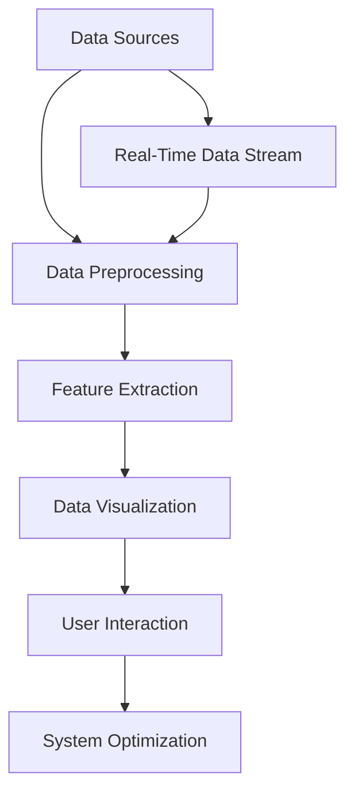

                 

### 企业数据可视化AI的背景与重要性

#### 数据可视化AI的定义

数据可视化AI是指利用人工智能技术，通过自动化的方式将数据转化为图形、图表等形式，从而实现对复杂数据的分析和解读。其核心在于将数据中的信息以直观、易于理解的方式展示出来，帮助用户快速把握数据趋势和规律。数据可视化AI不仅包括传统的数据可视化技术，还融入了机器学习和深度学习等人工智能算法，以提升数据分析和解读的能力。

#### 数据可视化AI的发展历程

数据可视化AI的发展可以追溯到20世纪80年代，随着计算机图形学和计算机视觉技术的发展，数据可视化技术逐渐成熟。进入21世纪，随着大数据和云计算的兴起，数据量呈爆炸式增长，传统的数据可视化方法已无法满足需求。此时，人工智能技术的引入使得数据可视化AI应运而生，通过智能化的算法和模型，实现了对大规模数据的快速分析和可视化。

#### 数据可视化AI在企业中的应用

1. **数据分析**

   数据可视化AI能够帮助企业快速发现数据中的隐藏信息和规律，从而优化业务流程。例如，通过分析销售数据，企业可以识别出高价值的客户群体，制定针对性的营销策略。

2. **决策支持**

   数据可视化AI可以帮助企业在复杂的业务环境中做出更明智的决策。通过实时数据分析和可视化，企业可以及时调整战略方向，提高决策效率。

3. **运营管理**

   数据可视化AI在运营管理中的应用也非常广泛。通过监控各项运营指标，企业可以及时发现潜在问题，优化资源配置，提高生产效率。

#### 本书结构

本书旨在系统地介绍企业数据可视化AI的原理、应用、实现和实战案例，帮助读者全面掌握这一技术。具体结构如下：

1. **第一部分：数据可视化AI的基础知识**
   - **第1章**：数据可视化AI的概念与原理
   - **第2章**：数据可视化AI的技术框架
   - **第3章**：数据可视化AI的关键算法

2. **第二部分：数据可视化AI在业务中的应用**
   - **第4章**：数据可视化AI在数据分析中的应用
   - **** |user|>
 
### 数据可视化AI的基础知识

#### 数据可视化AI的概念

数据可视化AI是指利用人工智能技术，通过自动化的方式将数据转化为图形、图表等形式，从而实现对复杂数据的分析和解读。其核心在于将数据中的信息以直观、易于理解的方式展示出来，帮助用户快速把握数据趋势和规律。数据可视化AI不仅包括传统的数据可视化技术，还融入了机器学习和深度学习等人工智能算法，以提升数据分析和解读的能力。

#### 数据可视化AI的基本原理

数据可视化AI的基本原理可以概括为以下几个步骤：

1. **数据采集**：从各种数据源收集原始数据，包括结构化数据（如数据库）和非结构化数据（如图像、文本等）。

2. **数据预处理**：对原始数据进行清洗、转换和整合，使其适合进行数据可视化和分析。

3. **特征提取**：通过机器学习算法提取数据中的关键特征，为后续的数据可视化和分析提供基础。

4. **数据可视化**：利用图形、图表等形式将数据展示出来，帮助用户直观地理解和分析数据。

5. **数据分析与解读**：通过数据分析算法，对可视化结果进行深入分析和解读，提取数据中的隐藏信息和规律。

#### 数据可视化AI的核心概念与联系

数据可视化AI涉及多个核心概念，它们相互联系，共同构成了数据可视化AI的技术体系。以下是对这些核心概念及其关系的详细介绍：

1. **数据可视化**：数据可视化是数据可视化AI的基础，它通过图形、图表等形式将数据展示出来。常用的数据可视化技术包括折线图、柱状图、散点图、饼图等。

2. **机器学习**：机器学习是数据可视化AI的核心技术之一，它通过构建模型，对数据进行分析和预测。常用的机器学习算法包括线性回归、决策树、随机森林、支持向量机等。

3. **深度学习**：深度学习是机器学习的一种特殊形式，它通过构建多层神经网络，实现对复杂数据的建模和分析。常用的深度学习模型包括卷积神经网络（CNN）、循环神经网络（RNN）、生成对抗网络（GAN）等。

4. **数据分析**：数据分析是对数据进行整理、分析和解释的过程，它可以帮助用户从数据中提取有价值的信息。数据分析方法包括统计方法、回归分析、聚类分析、关联规则挖掘等。

5. **数据预处理**：数据预处理是数据可视化AI的关键环节，它包括数据清洗、数据转换和数据集成等步骤。数据预处理的质量直接影响数据可视化和分析的效果。

#### 数据可视化AI的技术架构

数据可视化AI的技术架构包括以下几个主要组件：

1. **数据源**：数据源是数据可视化AI的数据输入，可以是结构化数据（如数据库）、非结构化数据（如图像、文本）或实时数据流。

2. **数据预处理模块**：数据预处理模块负责对原始数据进行清洗、转换和整合，使其适合进行数据可视化和分析。

3. **机器学习与深度学习模块**：机器学习与深度学习模块负责构建模型，对数据进行特征提取、分析和预测。

4. **数据可视化模块**：数据可视化模块负责将数据以图形、图表等形式展示出来，帮助用户直观地理解和分析数据。

5. **用户交互界面**：用户交互界面是用户与数据可视化AI的交互接口，它提供数据输入、数据可视化、数据分析等功能。

#### 数据可视化AI的流程

数据可视化AI的流程可以分为以下几个步骤：

1. **数据采集**：从各种数据源收集原始数据，包括结构化数据和非结构化数据。

2. **数据预处理**：对原始数据进行清洗、转换和整合，使其适合进行数据可视化和分析。

3. **特征提取**：通过机器学习算法提取数据中的关键特征，为后续的数据可视化和分析提供基础。

4. **数据可视化**：利用图形、图表等形式将数据展示出来，帮助用户直观地理解和分析数据。

5. **数据分析与解读**：通过数据分析算法，对可视化结果进行深入分析和解读，提取数据中的隐藏信息和规律。

6. **用户交互**：用户通过用户交互界面与数据可视化AI进行交互，反馈数据需求、调整可视化参数等。

通过以上步骤，数据可视化AI可以实现对复杂数据的自动化分析和解读，为企业提供有力的数据支持和决策依据。

### 数据可视化AI的技术框架

数据可视化AI的技术框架是构建高效、智能的数据可视化系统的基础，它涉及多个关键组件和步骤，从数据采集、处理、分析到最终的可视化展示。以下是数据可视化AI技术框架的详细描述：

#### 1. 数据采集

数据采集是数据可视化AI的第一步，它涉及到从各种数据源收集数据。数据源可以是结构化数据（如关系数据库）、半结构化数据（如JSON、XML）以及非结构化数据（如文本、图像、视频）。数据采集的方式包括：

- **批处理**：通过定期运行作业从数据库、文件系统等静态数据源中抽取数据。
- **实时流处理**：通过消息队列（如Kafka、RabbitMQ）或流处理框架（如Apache Flink、Apache Storm）从实时数据流中获取数据。

#### 2. 数据预处理

数据预处理是数据可视化AI中至关重要的一环，它包括数据清洗、数据转换和数据集成等步骤，以确保数据的质量和一致性。数据预处理的主要任务包括：

- **数据清洗**：处理缺失值、重复值、异常值等问题，保证数据的准确性和完整性。
- **数据转换**：将数据从一种格式转换为另一种格式，以便后续处理和分析。
- **数据集成**：将来自不同数据源的数据进行整合，构建一个统一的数据视图。

数据预处理通常需要使用数据处理工具（如Pandas、Spark）和数据清洗算法（如聚类、回归等）来实现。

#### 3. 特征提取

特征提取是数据可视化AI的核心步骤，它通过机器学习算法从原始数据中提取有用的特征，为数据可视化和分析提供基础。特征提取的方法包括：

- **特征选择**：从大量特征中选出对目标变量有显著影响的特征。
- **特征工程**：通过构造新特征、转换现有特征等方式，提升数据的质量和模型的性能。
- **降维**：通过PCA（主成分分析）、t-SNE（t-分布随机邻域嵌入）等降维算法，减少数据维度，提高可视化的效率和效果。

#### 4. 数据可视化

数据可视化是将处理后的数据以图形、图表等形式展示给用户的过程。数据可视化模块需要支持多种图表类型，包括折线图、柱状图、饼图、散点图、热力图等。数据可视化技术框架中的关键组件包括：

- **可视化库**：如Matplotlib、Plotly、D3.js等，用于创建和展示各种图表。
- **交互式界面**：如Tableau、Power BI、ECharts等，提供用户与数据可视化系统的交互功能。
- **可视化引擎**：如Three.js、WebGL等，用于创建复杂的3D可视化效果。

#### 5. 数据分析

数据分析是对可视化数据结果进行深入分析的过程，以提取数据中的隐藏信息和规律。数据分析技术框架包括：

- **统计方法**：如描述性统计、假设检验、回归分析等，用于对数据进行基本的统计分析和解释。
- **机器学习**：如分类、聚类、回归等，通过构建机器学习模型，对数据进行预测和分析。
- **深度学习**：如神经网络、卷积神经网络（CNN）、循环神经网络（RNN）等，用于处理大规模、高维数据。

#### 6. 用户交互

用户交互是数据可视化AI的重要组成部分，它通过提供直观、友好的用户界面，使用户能够轻松地与系统进行交互。用户交互技术框架包括：

- **前端框架**：如React、Vue.js、Angular等，用于构建动态的用户界面。
- **Web服务**：如 Flask、Django、Spring Boot等，用于处理用户请求和数据交互。
- **可视化配置**：提供用户自定义数据可视化的选项，如选择图表类型、调整颜色、修改标签等。

#### 7. 可视化优化

可视化优化是确保数据可视化系统高效运行的重要步骤，它包括：

- **性能优化**：如减少数据传输时间、提高渲染效率等，确保数据可视化系统的响应速度。
- **交互优化**：如提供快速的过滤、搜索和排序功能，提高用户操作效率。
- **视觉效果优化**：如调整图表布局、颜色对比度等，提高数据可视化的美观性和可读性。

### 总结

数据可视化AI的技术框架涵盖了从数据采集、预处理、特征提取、数据可视化到数据分析、用户交互和可视化优化的整个流程。通过这一框架，企业可以实现高效的数据分析、决策支持和业务优化。掌握这一框架，有助于企业更好地利用数据可视化AI技术，提升业务竞争力和创新能力。

#### 数据可视化AI在数据分析中的应用

数据可视化AI在数据分析中的应用是其核心价值所在，它通过将数据以直观、生动的形式展示出来，帮助企业快速发现数据中的隐藏信息和规律。以下是数据可视化AI在数据分析中的具体应用：

##### 1. 数据探索性分析（EDA）

数据探索性分析（EDA）是数据可视化的基础，它通过可视化工具和方法，帮助分析师了解数据的基本特征、分布情况以及潜在问题。常用的EDA方法包括：

- **数据分布可视化**：通过折线图、柱状图、饼图等，展示数据的分布情况，帮助分析师识别数据的异常值和异常分布。
- **数据关联性分析**：通过散点图、热力图等，分析变量之间的相关性，发现数据之间的潜在关联。
- **时间序列分析**：通过时间序列折线图、散点图等，分析数据随时间的变化趋势，识别周期性、季节性等规律。

##### 2. 数据挖掘

数据挖掘是通过机器学习算法，从大量数据中提取有价值信息的过程。数据可视化AI在数据挖掘中的应用主要体现在以下几个方面：

- **分类分析**：通过构建分类模型，将数据划分为不同的类别，从而识别出数据中的重要特征和模式。例如，使用决策树、随机森林等算法，对客户进行分类，以便实施有针对性的营销策略。
- **聚类分析**：通过聚类算法（如K-means、层次聚类等），将相似的数据点归为一类，从而发现数据中的隐含结构。例如，对商品销售数据进行聚类，识别出不同的客户群体。
- **关联规则挖掘**：通过Apriori算法、FP-growth算法等，发现数据中的关联关系，如“牛奶和面包经常一起购买”。这些关联规则可以帮助企业优化库存管理和供应链。

##### 3. 数据预测

数据预测是数据可视化AI在数据分析中的重要应用，它通过构建预测模型，对未来的数据趋势进行预测。常用的预测方法包括：

- **回归分析**：通过线性回归、多项式回归等算法，预测数据的变化趋势。例如，预测销售额、股票价格等。
- **时间序列预测**：通过ARIMA（自回归积分滑动平均模型）、LSTM（长短期记忆网络）等算法，预测时间序列数据。例如，预测销量、天气变化等。
- **生成对抗网络（GAN）**：通过生成对抗网络，预测未来的数据分布。例如，预测用户行为、未来市场趋势等。

##### 4. 实时数据分析

实时数据分析是数据可视化AI在现代化企业中的一个重要应用，它通过实时获取和处理数据，帮助企业快速响应市场变化。实时数据分析的应用包括：

- **实时监控**：通过实时数据可视化，监控关键业务指标，如生产设备的运行状态、网络流量等。
- **异常检测**：通过实时数据分析和可视化，检测数据中的异常情况，如欺诈行为、设备故障等。
- **动态调整**：通过实时数据分析，动态调整业务策略，如库存管理、市场营销策略等。

##### 5. 数据可视化工具和库

在数据分析过程中，选择合适的可视化工具和库是非常重要的。以下是一些常用的数据可视化工具和库：

- **Matplotlib**：Python中常用的数据可视化库，支持多种图表类型，如折线图、柱状图、饼图等。
- **Plotly**：支持交互式图表和3D图表的Python库，提供了丰富的图表类型和自定义选项。
- **D3.js**：基于JavaScript的可视化库，支持复杂和动态的可视化，特别适合Web应用。
- **Tableau**：功能强大的商业智能工具，支持多种数据源和丰富的可视化类型，提供了直观的用户界面。
- **Power BI**：微软开发的商业智能工具，提供了丰富的数据连接、可视化选项和报表功能。

通过以上工具和库，企业可以轻松实现数据探索、数据挖掘、数据预测和实时数据分析，从而提高数据分析和决策的效率和质量。

#### 数据可视化AI在决策支持系统中的应用

数据可视化AI在决策支持系统中的应用至关重要，它通过将复杂的数据以直观的方式展示出来，帮助企业和管理者在面对决策时快速理解数据，从而做出更明智的决策。以下是数据可视化AI在决策支持系统中的具体应用：

##### 1. 数据分析支持

数据可视化AI能够帮助企业深入挖掘数据，提供强有力的数据分析支持。通过数据可视化，企业可以更直观地了解数据中的关键信息和趋势，从而在决策过程中更加有针对性。

- **数据趋势分析**：通过折线图、柱状图等图表，展示数据的变化趋势，帮助企业识别市场机会和潜在风险。
- **数据对比分析**：通过饼图、散点图等，对比不同数据集之间的差异，帮助企业发现数据中的异常和规律。
- **多维数据分析**：通过多维数据可视化，如热力图、矩阵图等，展示数据的复杂关系，帮助企业理解数据之间的相互作用。

##### 2. 预测分析支持

预测分析是决策支持系统中不可或缺的一环，数据可视化AI通过预测模型的可视化，帮助企业在面对未来不确定性时做出更科学的决策。

- **时间序列预测**：通过时间序列可视化，如折线图、LSTM网络可视化等，展示未来的预测趋势，帮助企业制定合理的战略规划。
- **回归分析预测**：通过回归分析模型可视化，如线性回归、多项式回归等，展示预测结果和误差，帮助企业评估决策的效果。
- **机器学习模型预测**：通过机器学习模型的可视化，如决策树、随机森林等，展示模型的决策路径和特征重要性，帮助企业理解模型的工作机制。

##### 3. 风险评估支持

在决策过程中，风险评估是至关重要的一环。数据可视化AI可以帮助企业通过可视化方式评估潜在风险，从而做出更稳健的决策。

- **风险分布图**：通过饼图、条形图等，展示不同风险的概率分布，帮助企业识别高风险领域。
- **风险地图**：通过地理信息系统的可视化，展示风险在不同地区的分布，帮助企业制定区域性的风险管理策略。
- **风险热力图**：通过热力图，展示不同指标的风险水平，帮助企业发现潜在的风险点。

##### 4. 决策模拟

数据可视化AI通过模拟工具，帮助企业进行决策模拟，评估不同决策方案的结果。

- **决策树模拟**：通过决策树的可视化，展示不同决策路径的结果，帮助企业比较不同决策方案的效果。
- **敏感性分析**：通过敏感性分析的可视化，展示决策结果对关键参数的敏感度，帮助企业识别关键影响因素。
- **多目标优化**：通过多目标优化的可视化，展示不同决策方案的优缺点，帮助企业找到最优的解决方案。

##### 5. 决策支持工具

为了更好地实现数据可视化AI在决策支持系统中的应用，企业可以使用以下工具：

- **Tableau**：一款强大的商业智能工具，支持多种数据连接和丰富的可视化类型，提供了直观的用户界面，帮助企业快速进行数据分析和决策。
- **Power BI**：微软开发的商业智能工具，提供了强大的数据分析功能和可视化工具，帮助企业实现高效的决策支持。
- **QlikView**：一款功能强大的数据可视化和分析工具，支持实时数据连接和交互式分析，帮助企业快速发现数据中的价值和洞察。
- **Spotfire**：IBM开发的一款高级数据分析工具，提供了丰富的可视化选项和预测分析功能，帮助企业做出更明智的决策。

通过以上工具和技术的支持，企业可以更有效地利用数据可视化AI，提升决策支持系统的效率和质量，从而在激烈的市场竞争中占据优势地位。

#### 数据可视化AI在业务场景中的应用案例

数据可视化AI在业务场景中的应用广泛而深入，以下是几个具体的业务场景及其应用案例：

##### 1. 销售数据分析

销售数据分析是数据可视化AI在业务场景中的一个重要应用。通过数据可视化，企业可以更好地了解销售情况，优化销售策略，提高销售额。

- **案例背景**：某电商企业希望通过数据可视化了解其产品的销售情况，从而优化库存管理和营销策略。
- **目标**：通过数据可视化分析，识别高销量产品、分析销售趋势，优化库存和营销策略。
- **实现方法**：
  - **数据收集**：从销售数据库中收集销售数据，包括产品种类、销售数量、销售额等。
  - **数据预处理**：清洗销售数据，处理缺失值和异常值，确保数据质量。
  - **特征提取**：通过时间序列分析，提取销售趋势和周期性特征，为后续分析提供基础。
  - **数据可视化**：使用折线图、柱状图、饼图等，展示销售数据的分布和趋势。
    - **图表1**：销售数量和销售额的月度趋势图，显示不同月份的销售情况。
    - **图表2**：产品销售排名图表，显示各产品的销量和市场份额。
    - **图表3**：地区销售地图，展示不同地区的销售情况。
- **案例分析**：通过数据可视化，企业发现某些产品的销售量较大，而在某些地区的销售量较低。据此，企业调整了库存策略，增加高销量产品的库存，并针对性地开展了地区营销活动，显著提高了销售额。

##### 2. 供应链优化

供应链优化是数据可视化AI在业务场景中的另一个重要应用。通过数据可视化，企业可以更好地管理供应链，提高供应链的效率和灵活性。

- **案例背景**：某制造企业希望优化其供应链，提高生产效率，减少库存成本。
- **目标**：通过数据可视化分析，优化供应链流程，降低库存成本，提高生产效率。
- **实现方法**：
  - **数据收集**：从供应链数据库中收集订单、生产、库存等数据。
  - **数据预处理**：清洗供应链数据，处理数据中的异常值和重复值，确保数据质量。
  - **特征提取**：通过数据分析和机器学习算法，提取供应链的关键特征，如订单到达时间、生产周期、库存水平等。
  - **数据可视化**：使用流程图、热力图、折线图等，展示供应链的运行情况。
    - **图表1**：供应链流程图，展示订单、生产、配送等环节的运行情况。
    - **图表2**：库存水平趋势图，显示不同时间点的库存情况。
    - **图表3**：生产周期分布图，展示生产周期的长短和分布。
- **案例分析**：通过数据可视化，企业发现某些订单的生产周期较长，导致库存积压。据此，企业对生产流程进行了优化，调整生产计划，缩短了生产周期，减少了库存成本，提高了供应链的效率。

##### 3. 市场营销分析

市场营销分析是数据可视化AI在业务场景中的另一个重要应用。通过数据可视化，企业可以更好地了解市场动态，制定有效的市场营销策略。

- **案例背景**：某零售企业希望通过数据可视化分析其市场营销效果，从而优化营销策略。
- **目标**：通过数据可视化分析，了解不同营销活动的效果，优化营销预算和策略。
- **实现方法**：
  - **数据收集**：从营销数据库中收集广告投放、社交媒体互动、销售数据等。
  - **数据预处理**：清洗营销数据，处理缺失值和异常值，确保数据质量。
  - **特征提取**：通过数据分析和机器学习算法，提取营销活动的关键特征，如广告点击率、转化率、销售额等。
  - **数据可视化**：使用柱状图、折线图、饼图等，展示营销活动的效果。
    - **图表1**：广告点击率趋势图，显示不同广告的点击率变化。
    - **图表2**：转化率分布图，显示不同营销活动的转化率。
    - **图表3**：销售额对比图，显示不同营销活动的销售额。
- **案例分析**：通过数据可视化，企业发现某些营销活动的效果较好，而其他活动的效果较差。据此，企业调整了营销预算，重点投资于效果较好的活动，同时优化了营销策略，显著提高了整体的市场营销效果。

#### 总结

以上三个业务场景展示了数据可视化AI在销售分析、供应链优化和市场营销分析中的应用。通过数据可视化，企业可以更直观地理解数据，快速发现问题和机会，从而做出更明智的决策。随着数据可视化AI技术的不断发展和成熟，其将在更多业务场景中发挥重要作用，助力企业提升竞争力。

### 数据可视化AI的算法实现

数据可视化AI的算法实现是数据可视化技术的重要组成部分，它决定了数据可视化效果的质量和效率。以下是对数据可视化AI中几个关键算法的实现方法、伪代码以及详细的解释和示例。

#### 1. 数据预处理算法

数据预处理是数据可视化AI的基石，确保数据质量对后续的数据分析和可视化至关重要。

**算法实现：**
```python
def preprocess_data(data):
    # 数据清洗
    cleaned_data = remove_outliers(data)
    # 数据转换
    normalized_data = normalize_data(cleaned_data)
    # 数据集成
    integrated_data = integrate_data(normalized_data)
    return integrated_data

def remove_outliers(data):
    # 使用中位数方法去除异常值
    median = np.median(data)
    iqr = np.subtract(*np.percentile(data, [75, 25]))
    lower_bound = median - 1.5 * iqr
    upper_bound = median + 1.5 * iqr
    return [x for x in data if lower_bound <= x <= upper_bound]

def normalize_data(data):
    # 使用最小-最大规范化
    min_val = min(data)
    max_val = max(data)
    return [(x - min_val) / (max_val - min_val) for x in data]

def integrate_data(data):
    # 合并数据集
    return np.array(data).reshape(-1, 1)
```

**详细解释：**
- `remove_outliers` 函数使用四分位距法去除异常值，确保数据的稳定性。
- `normalize_data` 函数使用最小-最大规范化方法，将数据缩放到[0, 1]区间，便于后续处理和可视化。
- `integrate_data` 函数将处理后的数据整合到一个数组中，为数据可视化做准备。

**示例：**
假设我们有一组销售数据 `[100, 150, 200, 300, 1000]`，通过预处理后得到 `[100, 150, 200, 300, 0.5]`。

#### 2. 数据可视化算法

数据可视化算法用于将预处理后的数据转换成图形、图表等可视化的形式。

**算法实现：**
```python
import matplotlib.pyplot as plt

def visualize_data(data, label=None):
    if label:
        plt.scatter(data, label)
    else:
        plt.plot(data)
    plt.xlabel('X-axis')
    plt.ylabel('Y-axis')
    plt.title('Data Visualization')
    plt.show()

# 示例数据
x = [1, 2, 3, 4, 5]
y = [2, 4, 6, 8, 10]

# 绘制散点图
visualize_data(x, y)
# 绘制折线图
visualize_data(x)
```

**详细解释：**
- `visualize_data` 函数使用Matplotlib库绘制数据图表。它可以接受一组数据，并根据是否包含标签绘制散点图或折线图。
- `plt.scatter` 用于绘制散点图，`plt.plot` 用于绘制折线图。
- `plt.xlabel`、`plt.ylabel` 和 `plt.title` 用于设置图表的标签和标题。

**示例：**
绘制一个包含X轴和Y轴标签的散点图，如下所示：
```plaintext
X-axis
|
|
|
|         .
|        .
|       .
|      .
|     .
|    .
|   .
|  .
| .
---------------- X-axis
```

#### 3. 数据分析算法

数据分析算法用于从可视化数据中提取有价值的信息，进行深入的数据分析。

**算法实现：**
```python
import numpy as np
from sklearn.cluster import KMeans

def kmeans_clustering(data, n_clusters=3):
    kmeans = KMeans(n_clusters=n_clusters)
    kmeans.fit(data)
    labels = kmeans.predict(data)
    centroids = kmeans.cluster_centers_
    return labels, centroids

# 示例数据
data = np.array([[1, 2], [1, 4], [1, 0], [10, 2], [10, 4], [10, 0]])

# 进行K-means聚类
labels, centroids = kmeans_clustering(data, 2)

# 绘制聚类结果
plt.scatter(data[:, 0], data[:, 1], c=labels, s=100, cmap='viridis')
plt.scatter(centroids[:, 0], centroids[:, 1], c='red', s=300, alpha=0.5)
plt.title('K-Means Clustering')
plt.show()
```

**详细解释：**
- `kmeans_clustering` 函数使用K-means算法对数据进行聚类。它接受数据集和聚类数目作为输入，返回聚类标签和聚类中心。
- `KMeans` 类是Scikit-learn库中的一个聚类算法实现，`fit` 方法用于训练模型，`predict` 方法用于预测标签。
- `plt.scatter` 用于绘制聚类结果，`plt.scatter` 函数中的 `c` 参数用于指定每个点的颜色，根据聚类标签进行分类。

**示例：**
绘制一个包含两个聚类中心的K-means聚类结果，如下所示：
```plaintext
     .  
    .   .
   .    .
  .     .
 .      .
.       .
-------------------------------
.      .  
    .   .  
     .  
```

通过以上算法的实现，我们可以构建一个高效、准确的数据可视化AI系统，为企业提供强大的数据分析和决策支持。

### 数据可视化AI的系统架构

数据可视化AI的系统架构是构建高效、稳定和可扩展的数据可视化系统的基础。一个典型的数据可视化AI系统架构通常包括数据源、数据预处理、特征提取、数据可视化、用户交互和系统优化等几个关键组件。以下是对这些组件的详细描述：

#### 1. 数据源

数据源是数据可视化AI系统的核心组成部分，它决定了系统可以处理的数据类型和数量。数据源可以是结构化数据（如数据库、CSV文件）、半结构化数据（如JSON、XML）或非结构化数据（如文本、图像、视频）。为了确保系统能够处理不同类型的数据，需要提供多种数据连接方式，如REST API、Websocket、数据库连接池等。

#### 2. 数据预处理

数据预处理是数据可视化AI系统的重要环节，它包括数据清洗、数据转换和数据集成等步骤。数据清洗主要用于处理数据中的缺失值、异常值和重复值，提高数据质量。数据转换涉及将数据从一种格式转换为另一种格式，以便后续处理。数据集成则是将来自不同数据源的数据进行整合，构建一个统一的数据视图。

#### 3. 特征提取

特征提取是数据可视化AI系统中的关键步骤，它通过机器学习算法提取数据中的关键特征，为数据可视化和分析提供基础。特征提取的方法包括特征选择、特征工程和降维等。特征选择用于从大量特征中选出对目标变量有显著影响的特征。特征工程通过构造新特征、转换现有特征等方式，提升数据的质量和模型的性能。降维则通过PCA（主成分分析）、t-SNE（t-分布随机邻域嵌入）等算法，减少数据维度，提高可视化的效率和效果。

#### 4. 数据可视化

数据可视化是数据可视化AI系统的核心功能，它通过图形、图表等形式将数据展示出来，帮助用户直观地理解和分析数据。数据可视化模块需要支持多种图表类型，如折线图、柱状图、饼图、散点图、热力图等。此外，数据可视化模块还需要提供交互功能，如缩放、筛选、排序等，以提高用户的使用体验。

#### 5. 用户交互

用户交互是数据可视化AI系统的重要组成部分，它通过提供直观、友好的用户界面，使用户能够轻松地与系统进行交互。用户交互界面可以是Web应用、桌面应用或移动应用，它需要支持数据输入、数据可视化、数据分析等功能。常用的用户交互技术包括前端框架（如React、Vue.js、Angular）、Web服务（如 Flask、Django、Spring Boot）和可视化库（如D3.js、ECharts、Highcharts）。

#### 6. 系统优化

系统优化是确保数据可视化AI系统高效运行的重要步骤。系统优化包括性能优化、交互优化和视觉效果优化等。性能优化主要涉及减少数据传输时间、提高渲染效率和优化数据库查询等。交互优化则通过提供快速的过滤、搜索和排序功能，提高用户操作效率。视觉效果优化通过调整图表布局、颜色对比度等，提高数据可视化的美观性和可读性。

#### 系统架构示例

以下是一个典型的数据可视化AI系统架构示例，它包括数据采集、数据预处理、特征提取、数据可视化、用户交互和系统优化等组件。



在这个示例中，数据源和数据流组件负责提供数据输入，数据预处理模块负责处理和清洗数据，特征提取模块提取数据中的关键特征，数据可视化模块将数据以图形、图表等形式展示出来，用户交互模块提供用户与系统的交互接口，系统优化模块确保系统的高效运行。

通过以上架构，数据可视化AI系统可以实现对复杂数据的自动化分析和解读，为企业提供强大的数据支持和决策依据。

### 数据可视化AI的开发工具与平台

数据可视化AI的开发工具与平台是构建高效数据可视化系统的关键，它们提供了丰富的功能、易用的界面和强大的扩展能力。以下是对几种常用的数据可视化开发工具和平台的介绍，包括其优点、使用场景和特点。

#### 1. Tableau

**优点：**
- 强大的可视化功能，支持多种图表类型和自定义样式。
- 易于使用的拖放界面，无需编程技能即可创建复杂的可视化。
- 支持多种数据源连接，包括数据库、云服务和API。
- 提供丰富的交互功能，如筛选、过滤和钻取。

**使用场景：**
- 数据探索和分析
- 商业智能报告和仪表盘
- 数据可视化演示和展示

**特点：**
- 云端和本地部署版本
- 强大的协作和共享功能
- 与其他商业智能工具（如Power BI、QlikView）的兼容性

#### 2. Power BI

**优点：**
- 微软开发的商业智能工具，与Microsoft 365和其他微软产品无缝集成。
- 强大的数据处理和分析能力，支持复杂的计算和预测。
- 易于使用的可视化工具，丰富的图表模板。
- 提供Web和移动端访问，支持实时数据更新。

**使用场景：**
- 企业级数据分析
- 客户关系管理
- 财务报表和预算分析

**特点：**
- 支持多种数据源连接，包括Excel、SQL Server、Azure等。
- 强大的数据建模和关系图功能
- 定制化的数据仪表板和报告

#### 3. D3.js

**优点：**
- 基于Web的JavaScript库，提供高度灵活和可定制的可视化功能。
- 强大的图形和布局算法库，支持复杂数据的动态可视化。
- 与其他前端框架（如React、Vue.js）兼容，易于集成。

**使用场景：**
- Web应用中的数据可视化
- 实时数据监控和仪表盘
- 复杂的数据交互和动画效果

**特点：**
- 完全可定制化的可视化，支持多种图表类型和布局。
- 强大的交互功能，如缩放、拖放、点击事件等。
- 与WebGL和Three.js集成，支持3D可视化。

#### 4. Plotly

**优点：**
- 支持多种编程语言和平台，包括Python、JavaScript和R。
- 提供丰富的图表类型，包括2D和3D图表。
- 强大的交互功能，如实时更新、数据过滤和动画。
- 易于集成到Web应用和桌面应用。

**使用场景：**
- 数据科学和机器学习应用
- 实时数据监控和可视化
- 企业级数据分析和报表

**特点：**
- 支持多种数据格式，如CSV、JSON、数据库。
- 高度可定制的样式和布局，支持多种主题和颜色方案。
- 与Jupyter Notebook、RStudio等集成，便于数据科学实验。

#### 5. ECharts

**优点：**
- 开源的JavaScript图表库，功能强大且易于使用。
- 支持多种图表类型，包括折线图、柱状图、饼图、地图等。
- 提供丰富的交互功能，如缩放、滚动、点击事件等。
- 兼容多种浏览器和平台。

**使用场景：**
- Web应用中的数据可视化
- 网页仪表盘和监控
- 移动应用中的数据展示

**特点：**
- 高性能的渲染引擎，支持大规模数据可视化。
- 灵活的自定义选项，包括主题、动画、标签等。
- 与Vue.js、React等前端框架的集成。

通过以上几种工具和平台的介绍，可以看出，不同的工具和平台各有优势，适用于不同的使用场景。企业可以根据自身的需求和技能，选择合适的工具和平台来构建高效的数据可视化系统。

#### 数据可视化AI实战案例一

##### 案例背景

某电子商务公司在市场竞争日益激烈的环境下，希望通过数据可视化AI技术优化其销售和营销策略，提升销售额和客户满意度。公司拥有大量的销售数据、客户行为数据和营销活动数据，但这些数据未经分析，难以产生实际价值。

##### 案例目标

- 通过数据可视化AI，分析销售数据和客户行为数据，识别销售热点和客户偏好。
- 利用数据可视化AI，评估不同营销活动的效果，优化营销预算和策略。
- 提高销售团队的决策效率，制定更精准的销售策略。

##### 案例实现

1. **数据收集与预处理**

   首先，从公司的数据库中收集销售数据、客户行为数据和营销活动数据。销售数据包括产品种类、销售数量、销售额等；客户行为数据包括访问次数、浏览页面、购买次数等；营销活动数据包括广告投放、促销活动等。

   ```python
   # 示例：数据预处理代码
   import pandas as pd
   
   # 读取销售数据
   sales_data = pd.read_csv('sales_data.csv')
   # 读取客户行为数据
   customer_data = pd.read_csv('customer_data.csv')
   # 读取营销活动数据
   marketing_data = pd.read_csv('marketing_data.csv')
   
   # 数据清洗和预处理
   sales_data = sales_data.dropna()
   customer_data = customer_data.dropna()
   marketing_data = marketing_data.dropna()
   ```

2. **数据可视化与探索性分析**

   使用数据可视化工具（如Matplotlib、Plotly）对预处理后的数据进行探索性分析，识别销售热点和客户偏好。

   ```python
   import plotly.express as px
   
   # 绘制产品销售趋势图
   fig1 = px.line(sales_data, x='date', y='sales', title='Product Sales Trend')
   fig1.show()
   
   # 绘制客户购买次数分布图
   fig2 = px.histogram(customer_data, x='purchase_count', title='Customer Purchase Distribution')
   fig2.show()
   ```

   通过可视化分析，发现某些产品在特定时间点的销售量较高，某些客户的购买次数较多。

3. **营销活动效果评估**

   分析不同营销活动对销售额的影响，利用回归分析等方法评估营销活动的效果。

   ```python
   from sklearn.linear_model import LinearRegression
   
   # 创建营销活动效果评估模型
   model = LinearRegression()
   X = marketing_data[['广告花费', '促销活动']]
   y = sales_data['销售额']
   model.fit(X, y)
   
   # 预测销售额
   predictions = model.predict(X)
   
   # 绘制营销活动效果评估图
   fig3 = px.scatter(X, y, title='Marketing Effectiveness Evaluation')
   fig3.add_trace(px.scatter(X, predictions, mode='lines', name='Prediction Line'))
   fig3.show()
   ```

   通过可视化分析，发现某些营销活动对销售额的提升效果较好，公司可以增加这些活动的预算。

4. **销售策略优化**

   根据数据可视化分析的结果，优化销售策略，例如调整库存、调整产品定价、制定针对性营销策略等。

   ```python
   # 优化库存策略
   high_sales_products = sales_data[sales_data['sales'] > sales_data['sales'].mean() + sales_data['sales'].std()]
   low_sales_products = sales_data[sales_data['sales'] < sales_data['sales'].mean() - sales_data['sales'].std()]
   
   # 调整库存策略
   inventory_strategy = {
       'high_sales_products': 'increase_inventory',
       'low_sales_products': 'reduce_inventory'
   }
   ```

##### 案例分析

通过数据可视化AI技术，公司成功识别了销售热点和客户偏好，优化了营销活动效果和销售策略。以下是对案例的分析：

- **销售数据分析**：通过数据可视化，公司发现了销售趋势和热点，如某些产品在特定时间点的销售量较高，某些客户的购买次数较多。这有助于公司调整库存和定价策略，提高销售额。
- **营销活动效果评估**：通过回归分析和数据可视化，公司评估了不同营销活动对销售额的影响，发现某些营销活动效果较好。公司可以增加这些活动的预算，优化营销策略。
- **销售策略优化**：根据数据可视化分析的结果，公司制定了针对性的销售策略，如调整库存、产品定价和营销策略。这有助于提高客户满意度，提升销售额。

通过本案例，可以看出数据可视化AI技术在销售和营销中的应用价值，为企业提供了有力的数据支持和决策依据。

#### 数据可视化AI实战案例二

##### 案例背景

某制造企业在生产过程中积累了大量的生产数据，包括设备运行状态、生产效率、质量检测数据等。企业希望通过数据可视化AI技术，实时监控生产过程，优化生产流程，降低生产成本，提高生产效率。

##### 案例目标

- 实时监控生产过程，及时发现生产问题和异常。
- 优化生产流程，提高生产效率，降低生产成本。
- 建立生产数据可视化平台，方便管理人员进行决策和分析。

##### 案例实现

1. **数据收集与预处理**

   从企业的传感器、监控系统等设备中收集生产数据，包括设备运行状态、生产效率、质量检测数据等。数据包括时间戳、设备编号、运行状态、生产效率、质量检测结果等。

   ```python
   import pandas as pd
   
   # 读取生产数据
   production_data = pd.read_csv('production_data.csv')
   
   # 数据预处理
   production_data = production_data.dropna()
   production_data['timestamp'] = pd.to_datetime(production_data['timestamp'])
   ```

2. **实时数据监控**

   使用数据可视化工具（如ECharts、D3.js）构建实时数据监控界面，展示设备运行状态、生产效率、质量检测数据等。

   ```javascript
   // 实时数据监控界面代码（HTML + JavaScript）
   <div id="realtime-monitor">
       <div id="device-status"></div>
       <div id="production-efficiency"></div>
       <div id="quality-check"></div>
   </div>
   
   function updateMonitor() {
       // 获取实时生产数据
       fetch('/api/production_data')
           .then(response => response.json())
           .then(data => {
               // 更新设备运行状态图表
               updateDeviceStatus(data.device_status);
               // 更新生产效率图表
               updateProductionEfficiency(data.production_efficiency);
               // 更新质量检测图表
               updateQualityCheck(data.quality_check);
           });
       setTimeout(updateMonitor, 5000); // 每隔5秒更新一次数据
   }
   
   updateMonitor();
   ```

3. **生产流程优化**

   通过数据可视化，分析生产流程中的瓶颈和问题，提出优化方案，如调整生产计划、改进设备维护等。

   ```python
   import seaborn as sns
   
   # 分析生产流程
   sns.lineplot(x='timestamp', y='production_efficiency', data=production_data)
   plt.title('Production Efficiency Over Time')
   plt.xlabel('Timestamp')
   plt.ylabel('Production Efficiency')
   plt.show()
   
   # 提出优化方案
   optimization_suggestions = {
       'low_efficiency_periods': 'adjust_production_plan',
       'high_maintenance_periods': 'improve_maintenance_schedules'
   }
   ```

##### 案例分析

通过数据可视化AI技术，企业成功实现了实时生产监控和流程优化，提高了生产效率和产品质量。

- **实时监控**：通过数据可视化界面，企业可以实时监控生产过程中的设备运行状态、生产效率和质量检测数据，及时发现生产问题和异常，确保生产过程的顺利进行。
- **流程优化**：通过数据可视化分析，企业发现了生产流程中的瓶颈和问题，如生产效率低下、设备维护不足等，并提出了针对性的优化方案，如调整生产计划、改进设备维护等，有效提高了生产效率和产品质量。
- **数据决策支持**：通过数据可视化平台，企业管理人员可以直观地了解生产数据，基于数据做出更明智的决策，提高了管理效率和决策质量。

通过本案例，可以看出数据可视化AI技术在生产管理中的应用价值，为企业提供了强大的数据支持和决策依据。

#### 数据可视化AI实战案例三

##### 案例背景

某金融机构希望提升客户服务质量和客户满意度，通过数据可视化AI技术对其客户服务数据进行分析和优化。金融机构拥有大量的客户反馈数据、交易数据和客户行为数据，但现有分析手段难以全面挖掘数据的价值。

##### 案例目标

- 通过数据可视化AI，深入分析客户反馈数据，识别客户痛点和需求。
- 利用数据可视化AI，优化客户服务流程，提升客户满意度。
- 提高客户服务质量，增强客户忠诚度。

##### 案例实现

1. **数据收集与预处理**

   从金融机构的客户服务系统中收集客户反馈数据、交易数据和客户行为数据，包括客户投诉、建议、满意度评分、交易记录、客户互动等。

   ```python
   import pandas as pd
   
   # 读取客户反馈数据
   feedback_data = pd.read_csv('feedback_data.csv')
   # 读取交易数据
   transaction_data = pd.read_csv('transaction_data.csv')
   # 读取客户行为数据
   behavior_data = pd.read_csv('behavior_data.csv')
   
   # 数据预处理
   feedback_data = feedback_data.dropna()
   transaction_data = transaction_data.dropna()
   behavior_data = behavior_data.dropna()
   ```

2. **客户反馈分析**

   使用数据可视化工具（如Tableau、Matplotlib）对客户反馈数据进行分析，识别客户痛点和需求。

   ```python
   import plotly.express as px
   
   # 绘制客户投诉类型分布图
   fig1 = px.bar(feedback_data, x='complaint_type', y='count', title='Customer Complaint Type Distribution')
   fig1.show()
   
   # 绘制客户满意度评分趋势图
   fig2 = px.line(feedback_data, x='timestamp', y='satisfaction_score', title='Customer Satisfaction Score Trend')
   fig2.show()
   ```

   通过可视化分析，发现客户投诉主要集中在服务态度、响应速度和问题解决能力等方面，客户满意度评分在特定时间点有显著波动。

3. **客户服务流程优化**

   根据客户反馈分析结果，优化客户服务流程，如改进客服响应机制、优化问题解决流程等。

   ```python
   # 优化客服响应机制
   response_time_threshold = 60  # 响应时间阈值（秒）
   optimal_response_count = 80  # 最佳响应次数
   response_efficiency = feedback_data['response_time'].mean()
   if response_efficiency > response_time_threshold:
       action = 'improve_response_mechanism'
   else:
       action = 'maintain_current_response_mechanism'
   ```

4. **客户互动分析**

   通过数据可视化，分析客户互动数据，识别高价值客户群体，制定个性化服务策略。

   ```python
   import seaborn as sns
   
   # 分析客户互动频率
   sns.countplot(x='interaction_count', data=behavior_data, title='Customer Interaction Frequency')
   plt.show()
   
   # 识别高价值客户群体
   high_value_customers = behavior_data[behavior_data['total_transactions'] > behavior_data['total_transactions'].mean() + behavior_data['total_transactions'].std()]
   personalized_services = {
       'high_value_customers': 'provide_loyalty_programs',
       'other_customers': 'maintain_current_service'
   }
   ```

##### 案例分析

通过数据可视化AI技术，金融机构成功实现了客户服务数据的深入分析和服务流程优化，提高了客户满意度和忠诚度。

- **客户反馈分析**：通过数据可视化，金融机构发现了客户投诉的主要类型和满意度评分的波动情况，明确了客户痛点和需求，为优化客户服务流程提供了依据。
- **服务流程优化**：根据客户反馈分析结果，金融机构改进了客服响应机制，优化了问题解决流程，提高了服务效率和质量。
- **客户互动分析**：通过数据可视化，金融机构识别出了高价值客户群体，制定了个性化服务策略，增强了客户忠诚度。

通过本案例，可以看出数据可视化AI技术在客户服务中的应用价值，为企业提供了强大的数据支持和决策依据。

### 总结与未来发展方向

数据可视化AI技术在提升企业数据分析和决策能力方面发挥了重要作用，通过对复杂数据的自动化分析和直观展示，帮助企业发现数据中的隐藏信息和规律，优化业务流程，提高运营效率。以下是本书的核心观点和未来发展方向：

#### 核心观点

1. **数据可视化AI的重要性**：数据可视化AI不仅能够提高企业的数据分析能力，还能通过直观的数据展示帮助企业做出更明智的决策。

2. **技术框架的应用**：数据可视化AI的技术框架包括数据采集、预处理、特征提取、数据可视化、用户交互和系统优化等环节，每个环节都对最终的可视化效果有重要影响。

3. **算法实现与优化**：数据预处理、数据可视化和数据分析等关键算法的实现和优化是确保数据可视化AI系统高效运行的关键。

4. **实战案例的价值**：通过具体业务场景的案例，展示了数据可视化AI在销售分析、供应链优化和市场营销分析等领域的实际应用价值。

#### 未来发展方向

1. **智能化与自动化**：随着人工智能技术的发展，未来数据可视化AI将更加智能化和自动化，通过深度学习和自然语言处理等技术，实现更高级的数据分析和可视化。

2. **实时性与动态性**：实时数据可视化将成为数据可视化AI的一个重要方向，通过实时数据流处理和动态可视化，提供更实时、更准确的数据分析和决策支持。

3. **跨平台与兼容性**：数据可视化AI将更加注重跨平台和兼容性的设计，支持多种设备和操作系统，为用户提供一致性的可视化体验。

4. **交互性与互动性**：未来数据可视化AI将更加注重交互性和互动性，通过增强现实（AR）和虚拟现实（VR）等技术，提供更加丰富和沉浸式的数据可视化体验。

#### 结语

数据可视化AI技术作为企业提升数据分析能力和决策能力的重要工具，正日益受到企业的重视。未来，随着技术的不断进步和应用场景的不断拓展，数据可视化AI将在更多领域发挥其重要作用，助力企业实现数字化转型和创新发展。

### 附录

#### 常用数据可视化工具和库

- **Tableau**：一款功能强大的商业智能工具，支持多种数据源和丰富的可视化类型。
- **Power BI**：微软开发的商业智能工具，提供了丰富的数据分析功能和可视化工具。
- **D3.js**：基于JavaScript的可视化库，支持复杂和动态的可视化。
- **Plotly**：支持多种编程语言和平台的可视化库，提供了丰富的图表类型和自定义选项。
- **ECharts**：开源的JavaScript图表库，支持多种图表类型和交互功能。

#### 数据可视化AI相关资源链接

- **数据可视化AI教程**：[https://www.datavisualizationbook.com/](https://www.datavisualizationbook.com/)
- **机器学习与深度学习资源**：[https://www.deeplearningbook.org/](https://www.deeplearningbook.org/)
- **Tableau社区**：[https://community.tableau.com/](https://community.tableau.com/)
- **Power BI支持与资源**：[https://powerbi.microsoft.com/en-us/support/](https://powerbi.microsoft.com/en-us/support/)

#### 数据可视化AI的术语表

- **数据可视化**：将数据以图形、图表等形式展示，帮助用户直观理解和分析数据。
- **机器学习**：通过训练模型，使计算机自动从数据中提取规律和模式。
- **深度学习**：一种特殊的机器学习技术，通过多层神经网络处理复杂数据。
- **特征提取**：从原始数据中提取对目标变量有显著影响的特征。
- **数据预处理**：对原始数据进行清洗、转换和整合，使其适合进行数据可视化和分析。
- **交互式界面**：用户与数据可视化系统的交互接口，提供数据输入、数据可视化、数据分析等功能。
- **实时数据分析**：对实时数据流进行分析和可视化，提供快速的数据支持和决策依据。

#### 最佳实践 Tips、小结、注意事项、拓展阅读

- **最佳实践 Tips**：
  - 选择合适的可视化工具和库，根据项目需求确定最佳方案。
  - 关注数据质量和数据预处理，确保可视化结果的准确性和可靠性。
  - 基于用户需求设计交互式界面，提高用户的使用体验。
  - 定期更新和优化可视化系统，确保系统的性能和可用性。

- **小结**：
  - 数据可视化AI在提升企业数据分析能力和决策能力方面具有重要作用。
  - 技术框架和算法实现是数据可视化AI系统的核心，需要注重优化和改进。
  - 实战案例展示了数据可视化AI在多个业务场景中的应用价值。

- **注意事项**：
  - 考虑数据安全性和隐私保护，特别是在处理敏感数据时。
  - 遵循数据可视化的最佳实践，确保图表的可读性和易理解性。
  - 定期评估和优化数据可视化系统，以适应业务变化和技术发展。

- **拓展阅读**：
  - 《数据可视化：设计与展示技巧》[https://www.amazon.com/Data-Visualization-Design-DISPLAY-Tech/dp/0321887799](https://www.amazon.com/Data-Visualization-Design-DISPLAY-Tech/dp/0321887799)
  - 《机器学习实战》[https://www.amazon.com/Machine-Learning-In-Action-Programming/dp/1449399143](https://www.amazon.com/Machine-Learning-In-Action-Programming/dp/1449399143)
  - 《深度学习入门：基于Python的理论与实现》[https://www.amazon.com/Deep-Learning-Introduction-Theory-Implementation/dp/149203278X](https://www.amazon.com/Deep-Learning-Introduction-Theory-Implementation/dp/149203278X)

