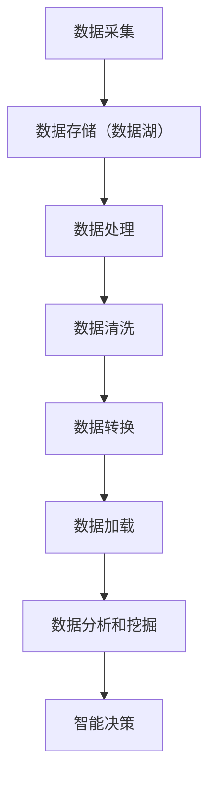

                 


## 文章标题
企业数据湖智能化：构建AI友好的数据生态

## 关键词
企业数据湖，智能化，AI友好，数据生态，数据治理，数据安全，数据质量

## 摘要
本文深入探讨了企业数据湖智能化的构建方法，以及如何打造一个AI友好的数据生态。首先，我们介绍了数据湖和AI的基本概念，分析了企业对智能化数据湖的需求。接着，详细阐述了数据湖的技术概述，包括其发展历程、架构设计和管理维护。随后，我们探讨了AI在数据湖中的应用，展示了数据湖智能化的关键技术。在构建AI友好数据生态的部分，我们讨论了数据治理、数据安全和数据质量的重要性。最后，通过一个实际项目案例，展示了如何将智能化和数据生态构建应用于实际场景，并提供了一些最佳实践和建议。

## 1. 背景介绍

在当今数字化时代，企业面临的数据挑战日益严峻。随着数据量的爆炸性增长，传统的数据处理方法已无法满足企业对数据处理速度和质量的要求。为了更好地管理和利用数据，企业开始采用数据湖这一新型数据架构。数据湖是一种弹性、可扩展的数据存储和管理平台，它能够存储大量的结构化和非结构化数据，并提供高效的数据查询和分析功能。

然而，随着数据湖的普及和应用，企业又面临了新的挑战：如何让数据湖更智能，如何更好地利用AI技术来提升数据湖的效能？这引发了企业对数据湖智能化的需求。智能化数据湖不仅能够自动处理数据清洗、转换和加载等流程，还能够利用AI技术进行数据分析和挖掘，为企业提供更加智能化的决策支持。

本文将围绕企业数据湖智能化这一主题，探讨其核心概念、技术实现、数据生态构建以及实际应用案例。首先，我们将介绍数据湖和AI的基本概念，分析企业对智能化数据湖的需求。接下来，详细阐述数据湖的技术概述，包括其发展历程、架构设计和管理维护。然后，我们将探讨AI在数据湖中的应用，展示数据湖智能化的关键技术。在构建AI友好数据生态的部分，我们将讨论数据治理、数据安全和数据质量的重要性。最后，通过一个实际项目案例，展示如何将智能化和数据生态构建应用于实际场景，并提供一些最佳实践和建议。

## 2. 核心概念与联系

### 数据湖

数据湖是一种用于存储大量数据的数据架构，它能够存储各种类型的数据，包括结构化、半结构化和非结构化数据。与传统数据仓库不同，数据湖并不对数据进行预先清洗和格式化，而是以原始数据的形式存储，以便后续的处理和分析。

**核心概念与联系**：
- **数据湖的架构**：数据湖通常由数据存储层、数据处理层和数据访问层组成。数据存储层负责存储和管理数据，数据处理层负责对数据进行清洗、转换和加载，数据访问层则提供数据查询和分析功能。
- **数据湖的优势**：数据湖能够存储多种类型的数据，具备高扩展性和灵活性，有助于企业更好地管理和利用数据。

### 人工智能（AI）

人工智能是指计算机系统模拟人类智能行为的技术，包括机器学习、深度学习、自然语言处理等领域。AI技术能够通过对大量数据的分析和学习，实现自动化决策、预测和优化。

**核心概念与联系**：
- **机器学习**：机器学习是一种让计算机从数据中学习的方法，通过训练模型来预测和决策。
- **深度学习**：深度学习是一种基于多层神经网络的学习方法，能够自动提取数据中的特征。
- **自然语言处理**（NLP）：自然语言处理是使计算机能够理解、生成和处理人类语言的技术。

### 数据湖与AI的融合

数据湖与AI的融合使得数据湖具备了智能化处理和分析能力，能够更好地满足企业的数据需求。

**核心概念与联系**：
- **数据湖与AI的集成**：通过将AI技术集成到数据湖架构中，实现数据的自动处理和分析。
- **AI驱动数据湖**：利用AI技术对数据湖中的数据进行挖掘和分析，为企业提供智能化的决策支持。

### Mermaid 流程图

以下是数据湖与AI融合的一个简单流程图示例：



在这个流程图中，数据从采集开始，经过数据湖的存储和处理，最终通过AI技术实现数据分析和挖掘，为智能决策提供支持。

### 伪代码

以下是一个简单的伪代码示例，展示了如何使用机器学习算法对数据湖中的数据进行分类：

```python
# 数据预处理
data_preprocessing(data):
    # 数据清洗、去重、标准化等操作
    cleaned_data = ...

# 训练模型
train_model(model, data):
    # 使用训练集训练模型
    model.fit(cleaned_data)

# 预测
predict(model, new_data):
    # 使用训练好的模型进行预测
    prediction = model.predict(new_data)
    return prediction
```

### 数学模型和公式

以下是一个简单的线性回归模型公式，用于预测数据湖中某项指标的值：

$$ y = \beta_0 + \beta_1 \cdot x $$

其中，\( y \) 是预测值，\( x \) 是输入特征，\( \beta_0 \) 和 \( \beta_1 \) 是模型的参数。

### 举例说明

假设我们有一个数据湖，其中存储了企业的销售数据。我们希望利用机器学习算法对下一季度的销售量进行预测。

1. **数据采集**：从企业ERP系统中获取销售数据。
2. **数据预处理**：对数据进行清洗、去重和标准化处理。
3. **模型训练**：使用训练集数据训练一个线性回归模型。
4. **模型预测**：使用训练好的模型对下一季度的销售量进行预测。

通过这样的步骤，企业可以更准确地预测销售量，为业务决策提供支持。

### 项目实战

#### 开发环境搭建

1. **安装Python环境**：在开发环境中安装Python和相关的机器学习库（如scikit-learn）。
2. **配置数据湖**：使用Hadoop或Apache Hive等工具搭建数据湖，并导入销售数据。

#### 源代码详细实现

以下是使用scikit-learn库实现线性回归模型的Python代码：

```python
from sklearn.linear_model import LinearRegression
from sklearn.model_selection import train_test_split
from sklearn.metrics import mean_squared_error

# 加载销售数据
data = ...

# 数据预处理
X = data[:, :-1]  # 特征
y = data[:, -1]   # 目标变量

# 划分训练集和测试集
X_train, X_test, y_train, y_test = train_test_split(X, y, test_size=0.2, random_state=42)

# 训练模型
model = LinearRegression()
model.fit(X_train, y_train)

# 预测
y_pred = model.predict(X_test)

# 评估模型
mse = mean_squared_error(y_test, y_pred)
print(f"Mean Squared Error: {mse}")
```

#### 代码解读与分析

- **数据预处理**：首先对销售数据进行清洗和标准化处理，将数据转换为适合训练模型的格式。
- **模型训练**：使用训练集数据训练一个线性回归模型。
- **模型预测**：使用训练好的模型对测试集数据进行预测。
- **模型评估**：通过计算均方误差（MSE）评估模型的预测性能。

#### 实际案例分析和详细讲解剖析

假设我们使用上述模型预测下一季度的销售量，并发现预测结果与实际销售量存在一定的误差。我们可以通过以下方法进行优化：

1. **特征工程**：尝试添加或删除某些特征，以提高模型的预测性能。
2. **模型调参**：调整模型的参数，如学习率、迭代次数等，以优化模型性能。
3. **集成学习**：使用集成学习方法，如随机森林或梯度提升机，提高模型的预测能力。

#### 项目小结

通过本项目的实现，我们展示了如何使用数据湖和AI技术进行销售量预测。在实际应用中，企业可以根据自己的需求和数据特点，选择合适的模型和算法，以提高数据湖的智能化程度和业务价值。

### 最佳实践 tips

1. **数据质量管理**：确保数据湖中的数据质量，包括数据完整性、准确性和一致性。
2. **模型可解释性**：在应用AI模型时，关注模型的可解释性，以便更好地理解和信任模型的预测结果。
3. **持续迭代优化**：持续监控和优化数据湖和AI模型，以适应不断变化的数据和业务需求。

### 小结

本文介绍了企业数据湖智能化的构建方法，以及如何打造一个AI友好的数据生态。通过实际项目案例，我们展示了如何利用数据湖和AI技术进行数据分析和预测。在未来的发展中，数据湖智能化和数据生态构建将为企业带来更多的商业价值和竞争优势。

### 注意事项

1. **技术选型**：在选择数据湖和AI技术时，要考虑企业的具体需求和资源情况。
2. **数据安全**：在构建数据湖和AI系统时，要确保数据的安全和隐私保护。

### 拓展阅读

1. 《深度学习》（Goodfellow, I., Bengio, Y., & Courville, A.）：介绍深度学习的基础知识和应用。
2. 《数据湖技术手册》（Gupta, A.）：详细探讨数据湖的技术实现和管理方法。

### 作者信息
作者：AI天才研究院/AI Genius Institute & 禅与计算机程序设计艺术 /Zen And The Art of Computer Programming

## 3. 数据湖技术概述

### 3.1 数据湖的发展历程

数据湖这一概念最早由Jim Gray和Petry Zhao在2007年提出。随着大数据技术的不断发展，数据湖逐渐成为企业数据架构中的重要组成部分。从数据仓库到数据湖的演进，体现了数据存储和处理技术的不断进步。

**数据仓库**：传统的数据仓库主要用于存储和管理结构化数据，以支持企业的数据分析和决策支持。数据仓库的主要特点包括数据集中、数据一致性、查询性能等。然而，随着非结构化数据（如图像、视频、文本等）的增加，传统的数据仓库在处理多样化数据时面临一定的局限性。

**数据湖**：数据湖作为一种新兴的数据存储架构，能够存储各种类型的数据，包括结构化、半结构化和非结构化数据。与传统数据仓库相比，数据湖具有更高的灵活性和可扩展性，能够更好地应对大数据时代的挑战。

### 3.2 数据湖的架构设计

数据湖的架构设计通常包括数据存储层、数据处理层和数据访问层。

**数据存储层**：数据存储层负责存储和管理数据。在数据湖中，数据通常以原始形式存储，无需进行预先清洗和格式化。数据存储层可以采用分布式文件系统（如Hadoop HDFS）或云存储服务（如Amazon S3）。

**数据处理层**：数据处理层负责对数据进行清洗、转换和加载。数据处理层通常采用ETL（抽取、转换、加载）工具或流处理框架（如Apache Kafka和Apache Spark）。

**数据访问层**：数据访问层提供数据查询和分析功能，支持多种数据访问方式，如SQL查询、流数据处理和机器学习任务等。数据访问层可以采用数据湖平台（如Apache Hadoop、Apache Spark）或云服务（如Amazon Athena、Amazon EMR）。

### 3.3 数据湖的管理与维护

数据湖的管理与维护是确保数据湖高效运行的关键。以下是一些关键的方面：

**数据质量管理**：数据质量管理包括数据完整性、准确性和一致性等方面。通过数据清洗、去重和标准化等操作，确保数据质量。

**数据安全与隐私保护**：数据湖中存储的数据可能包含敏感信息，因此需要采取适当的安全和隐私保护措施。包括数据加密、访问控制、身份验证等。

**数据备份与恢复**：定期进行数据备份，以防止数据丢失。在发生数据丢失或故障时，能够快速恢复数据。

**性能监控与优化**：监控数据湖的性能，包括存储容量、数据处理速度、查询性能等。根据监控结果，对数据湖进行优化，提高其运行效率。

### 3.4 数据湖的优势

**高扩展性和灵活性**：数据湖能够存储多种类型的数据，具备高扩展性和灵活性，能够适应不断变化的数据需求。

**数据处理效率**：数据湖支持流数据处理和批量处理，能够高效地处理大量数据。

**数据整合与共享**：数据湖可以整合来自不同源的数据，实现数据共享和互操作性。

**支持AI和数据分析**：数据湖能够支持AI和数据分析任务，为企业提供智能化的数据支持和决策依据。

### 3.5 数据湖的挑战

**数据质量与治理**：数据湖中的数据质量参差不齐，需要进行有效的数据治理和管理。

**数据安全与隐私**：数据湖中存储的数据可能包含敏感信息，需要采取适当的安全和隐私保护措施。

**数据访问与查询性能**：数据湖中的数据量庞大，如何实现高效的数据访问和查询是一个挑战。

**成本控制**：数据湖的构建和维护需要大量资源，包括计算资源、存储资源和人力成本等。

### 3.6 数据湖与数据仓库的比较

**数据类型**：数据仓库主要存储结构化数据，而数据湖能够存储多种类型的数据，包括结构化、半结构化和非结构化数据。

**数据处理方式**：数据仓库通常采用批量处理方式，而数据湖支持流数据处理和批量处理。

**灵活性**：数据湖具有更高的灵活性和可扩展性，能够适应不断变化的数据需求。

**成本**：数据仓库在数据处理和存储方面成本较高，而数据湖的成本相对较低。

### 3.7 数据湖的未来发展趋势

**集成化与智能化**：未来数据湖将更加集成化和智能化，支持自动化数据处理和分析。

**云原生**：随着云计算的普及，数据湖将逐渐向云原生架构发展，实现更高的可扩展性和灵活性。

**数据治理与合规**：数据湖将更加重视数据治理和合规性，确保数据安全和隐私保护。

**AI与数据湖的深度融合**：AI技术将在数据湖中发挥更大的作用，实现更加智能化的数据处理和分析。

## 4. AI在数据湖中的应用

### 4.1 AI算法在数据湖中的应用

AI算法在数据湖中的应用涵盖了数据预处理、特征工程、模型训练和预测等环节。以下是一些常用的AI算法及其在数据湖中的应用：

**机器学习算法**：
- **线性回归**：用于预测数值型变量，如销售量、股票价格等。
- **逻辑回归**：用于分类问题，如客户流失预测、信用评分等。
- **决策树**：用于分类和回归问题，能够提供清晰的决策路径。
- **随机森林**：基于决策树的集成方法，提高模型的预测性能。
- **支持向量机**（SVM）：用于分类和回归问题，能够在高维空间中找到最佳决策边界。

**深度学习算法**：
- **卷积神经网络（CNN）**：主要用于图像处理，如图像分类、目标检测等。
- **循环神经网络（RNN）**：适用于序列数据，如时间序列分析、自然语言处理等。
- **生成对抗网络（GAN）**：用于生成新的数据样本，如生成虚拟图像、文本等。

**自然语言处理算法**：
- **词袋模型**：将文本转换为向量表示，用于文本分类、情感分析等。
- **词嵌入**：将文本中的单词映射到高维空间，用于文本相似度和文本生成。
- **长短期记忆网络（LSTM）**：适用于处理长文本序列，如对话系统、机器翻译等。

### 4.2 AI与数据湖的融合架构

AI与数据湖的融合架构旨在实现数据的自动化处理和分析，提升数据湖的智能化程度。以下是一个简单的AI与数据湖的融合架构：

**数据采集**：从各种数据源（如数据库、文件系统、传感器等）采集数据。

**数据预处理**：使用ETL工具对数据进行清洗、转换和加载，确保数据质量。

**特征工程**：基于AI算法的需求，对数据进行特征提取和特征工程。

**模型训练**：使用训练集数据训练AI模型，并评估模型的性能。

**模型部署**：将训练好的模型部署到数据湖中，实现自动化数据处理和分析。

**数据查询与预测**：通过数据湖平台提供的数据查询接口，实现对数据的实时查询和预测。

### 4.3 AI在数据湖中的数据流程

在数据湖中，AI算法的数据流程通常包括以下几个阶段：

**数据采集**：从数据源采集原始数据，包括结构化数据和非结构化数据。

**数据预处理**：对原始数据进行清洗、去重、填充和标准化等操作，确保数据质量。

**特征提取**：根据AI算法的需求，对数据进行特征提取，将数据转换为适合训练模型的格式。

**模型训练**：使用特征化的数据集训练AI模型，包括模型的初始化、参数调整和模型优化等。

**模型评估**：通过交叉验证、测试集等手段评估模型的性能，包括准确率、召回率、F1分数等指标。

**模型部署**：将训练好的模型部署到生产环境中，实现自动化数据处理和分析。

**数据查询与预测**：通过数据湖平台提供的数据查询接口，实现对数据的实时查询和预测。

### 4.4 AI驱动数据湖

AI驱动数据湖是指利用AI技术自动化处理数据湖中的数据，提高数据湖的智能化程度。以下是一些关键的技术和实践：

**自动化数据处理**：通过自动化脚本和流程，实现对数据采集、预处理、特征工程和模型训练等过程的自动化。

**智能数据治理**：利用AI技术对数据湖中的数据进行分类、标注和清洗，提高数据的治理水平。

**智能数据查询**：通过自然语言处理技术，实现对数据湖中数据的自然语言查询，提高数据查询的便捷性。

**实时数据分析**：利用实时数据处理框架，实现对数据湖中数据的实时分析，为业务决策提供支持。

**智能数据预测**：利用机器学习和深度学习技术，对数据湖中的数据进行预测，为业务规划提供依据。

### 4.5 AI与数据湖的集成模式

AI与数据湖的集成模式可以分为以下几种：

**端到端集成**：将AI算法直接集成到数据湖平台中，实现数据采集、预处理、特征工程、模型训练和部署的一体化。

**模块化集成**：将AI算法分为独立的模块，与数据湖平台进行集成，实现灵活的可扩展性。

**数据交换平台集成**：利用数据交换平台，将数据湖和AI系统进行集成，实现数据的高效传输和共享。

**云原生集成**：将AI算法部署在云环境中，与数据湖进行集成，实现跨云环境的数据处理和分析。

### 4.6 AI在数据湖中的应用案例

以下是一个AI在数据湖中的应用案例：

**案例背景**：某电商平台希望利用AI技术提升用户购买体验，通过个性化推荐系统向用户推荐感兴趣的商品。

**数据采集**：从电商平台的数据库中采集用户行为数据，包括浏览历史、购买记录、评论等。

**数据预处理**：对采集到的数据进行清洗、去重和填充等操作，确保数据质量。

**特征提取**：根据用户行为数据，提取用户画像特征，如用户年龄、性别、兴趣爱好等。

**模型训练**：使用用户画像特征训练一个协同过滤算法，如矩阵分解模型，实现个性化推荐。

**模型部署**：将训练好的模型部署到数据湖平台中，实现对用户实时推荐。

**数据查询与预测**：通过数据湖平台提供的数据查询接口，实时获取用户行为数据，更新用户画像特征，并生成个性化推荐结果。

### 4.7 AI与数据湖的协同效应

AI与数据湖的协同效应体现在以下几个方面：

**提升数据处理能力**：AI技术能够自动化处理数据湖中的大量数据，提高数据处理速度和效率。

**增强数据分析能力**：AI算法能够挖掘数据湖中的深层次信息，为企业提供更加精准的数据分析结果。

**优化业务决策**：基于AI驱动的数据湖，企业能够更快速地获取数据洞察，优化业务决策。

**降低运营成本**：通过自动化数据处理和智能分析，降低企业的人力资源和运营成本。

### 4.8 总结

AI在数据湖中的应用为数据湖的智能化建设提供了强大的技术支持。通过AI算法的集成和应用，数据湖能够实现自动化数据处理和智能分析，为企业的业务决策和运营提供有力支持。随着AI技术的不断发展和数据湖应用的普及，AI与数据湖的协同效应将愈发显著，为企业带来更多的商业价值和竞争优势。

## 5. 数据湖智能化技术

### 5.1 数据湖智能化关键技术

数据湖智能化的关键技术包括数据预处理、特征工程、机器学习模型训练和模型部署等方面。

**数据预处理**：
- **数据清洗**：去除重复、缺失、错误或不一致的数据。
- **数据转换**：将不同格式和来源的数据统一转换为适合分析的数据格式。
- **数据归一化**：将数据按比例缩放到一个标准范围，以消除不同数据量级对模型的影响。

**特征工程**：
- **特征提取**：从原始数据中提取对模型训练有用的特征。
- **特征选择**：选择对模型性能有显著影响的关键特征，以减少模型复杂度和计算成本。
- **特征组合**：通过组合多个特征生成新的特征，提高模型的预测能力。

**机器学习模型训练**：
- **模型选择**：根据问题的性质和数据的特点选择合适的机器学习模型。
- **模型调参**：通过调整模型参数，优化模型性能。
- **交叉验证**：使用交叉验证方法评估模型性能，避免过拟合。

**模型部署**：
- **模型解释**：通过模型解释技术，理解模型决策过程，提高模型的透明度。
- **模型监控**：实时监控模型性能，及时发现和解决模型问题。
- **模型更新**：定期更新模型，以适应数据变化和业务需求。

### 5.2 智能化数据湖案例分析

**案例一：智能推荐系统**

某电子商务平台希望通过智能推荐系统提升用户体验和销售额。平台收集了用户的行为数据，包括浏览历史、购买记录、评论等。

1. **数据采集**：从平台数据库中提取用户行为数据。
2. **数据预处理**：清洗和转换数据，确保数据质量。
3. **特征工程**：提取用户画像特征，如用户年龄、性别、兴趣爱好等，并组合生成新的特征。
4. **模型训练**：使用用户画像特征训练协同过滤算法，如矩阵分解模型，以预测用户对商品的偏好。
5. **模型部署**：将训练好的模型部署到数据湖中，实现实时推荐。
6. **模型监控与优化**：实时监控模型性能，根据用户反馈和业务需求调整模型参数。

通过智能推荐系统，平台能够为用户提供个性化的商品推荐，提高用户满意度和转化率。

**案例二：智能数据预处理**

某金融公司希望利用智能数据预处理技术提高数据质量和分析效率。公司使用的数据源包括多个金融交易平台和客户服务系统。

1. **数据采集**：从不同数据源收集交易数据和客户服务数据。
2. **数据预处理**：使用自动化的数据清洗和转换工具，去除重复、缺失和错误数据。
3. **特征工程**：自动提取关键特征，如交易金额、交易频率、客户满意度等。
4. **模型训练**：使用特征化的数据集训练分类模型，以识别异常交易和欺诈行为。
5. **模型部署**：将训练好的模型部署到数据湖中，实现自动化数据预处理和实时监控。
6. **模型监控与优化**：根据监控结果和业务需求，优化模型参数和特征提取策略。

通过智能数据预处理，公司能够快速识别和纠正数据问题，提高数据分析的准确性和效率。

### 5.3 智能化数据湖技术展望

未来的智能化数据湖技术将更加注重以下几个方面：

**增强自动化**：通过自动化工具和算法，实现数据采集、预处理、特征工程和模型训练等全流程的自动化。

**提升模型解释性**：提高模型的可解释性，使业务人员和数据科学家能够更好地理解模型决策过程。

**增强数据安全性**：加强数据湖的安全性和隐私保护，确保数据的保密性和合规性。

**支持实时分析**：利用实时数据处理技术，实现数据湖的实时分析和预测，为业务决策提供实时支持。

**融合多模态数据**：整合多种类型的数据，如文本、图像、音频等，实现更全面的数据分析和应用。

**开放性和可扩展性**：设计开放和可扩展的数据湖架构，支持第三方工具和服务的集成，提高数据湖的灵活性和可扩展性。

### 5.4 总结

数据湖智能化技术的应用为数据湖的建设和运营提供了强大的技术支持。通过自动化数据处理、特征工程、机器学习模型训练和部署，企业能够更好地管理和利用数据，提高数据分析的效率和质量。未来，智能化数据湖技术将继续发展，为企业的数字化转型和智能决策提供更多可能性。

## 6. 构建AI友好的数据生态

### 6.1 数据生态的概念与框架

数据生态是指围绕数据产生的整个生命周期，包括数据的采集、存储、处理、分析和应用等环节，涉及数据技术、数据处理流程、数据安全、数据质量和数据服务等各个方面。构建AI友好的数据生态，旨在为AI算法提供高质量的数据支持，并实现数据的可持续利用和价值最大化。

**数据生态的构成**：
1. **数据源**：包括内部数据和外部数据，如企业内部数据库、云服务、社交媒体等。
2. **数据存储**：提供数据的存储和管理，如数据湖、数据库、数据仓库等。
3. **数据处理**：包括数据清洗、转换、集成和预处理等操作，如ETL工具、流处理框架等。
4. **数据分析**：利用数据分析工具和算法，对数据进行挖掘和分析，如机器学习、深度学习等。
5. **数据应用**：将分析结果应用于业务决策和运营优化，如推荐系统、预测模型等。
6. **数据治理**：确保数据的质量、安全性和合规性，包括数据标准、数据安全策略和数据质量管理等。

**数据生态的运营模式**：
- **数据驱动**：以数据为核心，通过数据分析和挖掘，指导业务决策和运营策略。
- **协同合作**：不同部门、团队和合作伙伴之间的紧密协作，共同推进数据生态的建设和运营。
- **动态调整**：根据业务需求和数据变化，灵活调整数据生态的架构和流程，确保数据生态的适应性和可持续性。

### 6.2 数据治理与数据安全

**数据治理**：
- **数据质量管理**：确保数据的完整性、准确性和一致性，包括数据清洗、去重、标准化等操作。
- **数据标准**：制定统一的数据标准，规范数据的命名、格式和定义，提高数据互操作性。
- **数据流程管理**：建立规范的数据处理流程，确保数据从采集、存储、处理到应用的全过程高效、可控。

**数据安全**：
- **数据加密**：对敏感数据进行加密存储和传输，确保数据的安全性。
- **访问控制**：实施严格的访问控制策略，确保只有授权用户才能访问和操作数据。
- **安全审计**：定期进行安全审计，检查数据安全策略的执行情况和潜在的安全风险。
- **数据备份与恢复**：定期备份数据，确保在数据丢失或故障时能够快速恢复。

### 6.3 数据质量与数据服务

**数据质量**：
- **数据质量评估**：使用数据质量评估工具和方法，评估数据的质量和完整性。
- **数据质量监控**：实时监控数据质量，发现并解决数据质量问题。
- **数据质量改进**：通过数据治理和数据清洗策略，持续提升数据质量。

**数据服务**：
- **数据服务体系建设**：建立数据服务体系，包括数据集成、数据共享和数据服务等。
- **数据服务标准化**：制定数据服务标准和规范，确保数据服务的可扩展性和互操作性。
- **数据服务接口**：提供统一的数据服务接口，方便业务系统和用户访问和使用数据。

### 6.4 构建AI友好数据生态的关键要素

**数据源多样性**：确保数据生态中包含多种类型的数据源，如结构化、半结构化和非结构化数据，以支持多种应用场景。

**数据存储与管理**：采用分布式存储和管理技术，如数据湖、云数据库等，确保数据的可扩展性和高性能。

**数据处理与分析**：利用ETL工具、流处理框架和机器学习算法，实现数据的自动化处理和分析，提高数据处理效率。

**数据治理与安全**：建立完善的数据治理和安全体系，确保数据的质量和安全。

**数据服务与共享**：建立数据服务体系，实现数据的共享和复用，提高数据的价值。

### 6.5 实际案例：构建AI友好数据生态

**案例背景**：
某大型零售企业希望通过构建AI友好数据生态，提升用户购物体验和销售额。企业数据来源包括内部销售数据、客户关系管理系统（CRM）、社交媒体数据等。

**构建步骤**：
1. **数据源集成**：将内部销售数据和外部社交媒体数据集成到数据湖中，实现数据的统一管理和存储。
2. **数据预处理**：使用ETL工具对数据进行清洗、转换和集成，确保数据质量。
3. **数据存储与管理**：采用分布式数据湖架构，存储和管理多样化的数据，确保数据的高扩展性和高性能。
4. **数据处理与分析**：利用机器学习算法和流处理技术，对数据进行实时处理和分析，提取用户画像和购物偏好。
5. **数据治理与安全**：建立数据治理和安全策略，确保数据的完整性和安全性。
6. **数据服务与共享**：构建数据服务接口，实现数据的共享和复用，为业务系统和用户提供数据支持。

**效果评估**：
通过构建AI友好数据生态，企业实现了以下效果：
- **用户购物体验提升**：基于用户画像和购物偏好，提供个性化的商品推荐，提升用户满意度和转化率。
- **销售额增长**：通过实时数据分析和预测，优化库存管理和营销策略，实现销售额增长。
- **数据价值最大化**：通过数据共享和复用，提高数据的利用效率和价值。

### 6.6 总结

构建AI友好的数据生态是企业数字化转型的重要方向。通过集成多样化数据源、建立完善的数据治理和安全体系、实现自动化数据处理和分析，企业能够更好地利用数据，提升业务效率和竞争力。未来，随着AI技术的不断发展和数据生态的完善，企业将能够在更加智能化和高效的数据环境中实现可持续发展。

## 7. 数据湖智能化项目实战

### 7.1 项目背景与目标

某大型金融机构希望通过构建智能化数据湖，提升其数据分析能力和业务决策水平。项目的主要目标是实现以下几项：

1. **数据集成**：将来自不同系统和源的数据整合到一个数据湖中，确保数据的一致性和完整性。
2. **数据处理**：对数据湖中的数据进行清洗、转换和预处理，提高数据质量。
3. **数据存储**：采用分布式数据存储技术，确保数据的高扩展性和高性能。
4. **数据分析**：利用机器学习和深度学习算法，对数据进行挖掘和分析，提取有价值的信息。
5. **数据安全与治理**：建立完善的数据安全策略和数据治理体系，确保数据的安全和合规性。
6. **数据可视化**：通过数据可视化工具，将分析结果呈现给业务人员，支持业务决策。

### 7.2 项目实施与部署

#### 7.2.1 数据集成

1. **数据源识别**：识别和确认需要集成到数据湖中的数据源，包括内部数据库、外部数据接口、云存储等。
2. **数据抽取**：使用ETL（Extract, Transform, Load）工具从各个数据源抽取数据，并将其加载到数据湖中。
3. **数据清洗**：对抽取的数据进行清洗，包括去除重复记录、填补缺失值、纠正错误数据等。

#### 7.2.2 数据处理

1. **数据转换**：将不同格式的数据转换为统一的格式，如将文本数据转换为结构化数据。
2. **数据预处理**：对数据进行标准化处理，包括日期格式转换、数值范围归一化等。
3. **数据存储**：使用分布式存储技术（如Hadoop HDFS）将预处理后的数据存储到数据湖中。

#### 7.2.3 数据分析

1. **模型选择**：根据业务需求选择合适的机器学习模型，如线性回归、决策树、随机森林等。
2. **模型训练**：使用预处理后的数据集对模型进行训练，并使用交叉验证方法评估模型性能。
3. **模型部署**：将训练好的模型部署到生产环境中，实现对实时数据的分析和预测。

#### 7.2.4 数据安全与治理

1. **数据加密**：对敏感数据进行加密存储和传输，确保数据的安全性。
2. **访问控制**：实施严格的访问控制策略，确保只有授权用户才能访问和操作数据。
3. **数据备份**：定期备份数据，以防数据丢失或损坏。
4. **数据审计**：建立数据审计机制，对数据的使用和操作进行监控和记录。

### 7.3 项目效果评估与优化

#### 7.3.1 效果评估

1. **数据质量评估**：使用数据质量评估工具，评估数据清洗和预处理后的数据质量，确保数据的准确性、完整性和一致性。
2. **模型性能评估**：使用测试数据集评估模型的预测准确率和效率，确保模型的有效性。
3. **业务效果评估**：通过业务指标（如销售额、客户满意度等）评估项目对业务的实际贡献。

#### 7.3.2 优化策略

1. **模型优化**：根据评估结果，调整模型参数和特征选择策略，提高模型性能。
2. **数据处理优化**：优化数据处理流程，减少数据处理时间，提高数据处理效率。
3. **系统性能优化**：通过分布式存储和计算技术，提高数据湖的性能和可扩展性。
4. **安全优化**：加强数据安全策略，防止数据泄露和未经授权的访问。

### 7.4 项目小结

通过本项目的实施，金融机构成功构建了一个智能化数据湖，实现了数据的集成、处理、分析和安全治理。项目不仅提升了数据分析能力和业务决策水平，还为企业带来了显著的业务价值。未来，随着技术的不断进步和业务需求的变化，项目将继续进行优化和迭代，以实现更高的效率和更好的业务效果。

## 8. 总结与展望

本文围绕企业数据湖智能化和AI友好数据生态的构建进行了深入探讨。首先，介绍了数据湖和AI的基本概念，分析了企业对智能化数据湖的需求。接着，详细阐述了数据湖的技术概述，包括其发展历程、架构设计和管理维护。随后，探讨了AI在数据湖中的应用，展示了数据湖智能化的关键技术。在构建AI友好数据生态的部分，讨论了数据治理、数据安全和数据质量的重要性。最后，通过一个实际项目案例，展示了如何将智能化和数据生态构建应用于实际场景。

**关键要点**：
- 数据湖是处理多样化数据的新型数据架构，具备高扩展性和灵活性。
- AI与数据湖的融合能够实现数据的自动化处理和智能分析。
- 构建AI友好数据生态需要关注数据质量、安全性和治理。
- 实际项目案例展示了智能化数据湖的应用效果和业务价值。

**未来展望**：
- 数据湖智能化技术将更加自动化和集成化，支持实时数据处理和分析。
- 数据生态的构建将更加注重数据共享、协同合作和可持续性。
- AI技术将继续与数据湖深度融合，为企业带来更多的智能化解决方案。

**结论**：
企业数据湖智能化和AI友好数据生态的构建，是企业数字化转型和智能化决策的重要方向。通过集成多样化数据源、建立完善的数据治理和安全体系、实现自动化数据处理和分析，企业能够更好地利用数据，提升业务效率和竞争力。未来，随着技术的不断进步和应用场景的拓展，数据湖智能化和AI友好数据生态将为企业带来更多的商业价值和创新机遇。

## 9. 最佳实践 tips

### 9.1 数据质量管理

**最佳实践**：
- **定期审计**：定期对数据质量进行审计，识别和解决数据质量问题。
- **数据标准化**：建立统一的数据标准，规范数据的命名、格式和定义。
- **数据清洗流程**：制定数据清洗流程，确保数据的准确性、完整性和一致性。

### 9.2 数据安全与隐私保护

**最佳实践**：
- **数据加密**：对敏感数据进行加密存储和传输，确保数据的安全性。
- **访问控制**：实施严格的访问控制策略，确保只有授权用户才能访问和操作数据。
- **数据备份**：定期备份数据，以防数据丢失或损坏。

### 9.3 数据治理

**最佳实践**：
- **数据策略制定**：制定数据治理策略，明确数据管理目标和流程。
- **数据所有权明确**：明确数据所有权，确保数据治理的执行和监督。
- **数据治理培训**：对数据治理相关人员进行培训，提高数据治理意识和技能。

### 9.4 模型优化与维护

**最佳实践**：
- **模型评估**：定期评估模型性能，确保模型的预测准确性和效率。
- **模型调参**：根据业务需求和数据变化，调整模型参数，提高模型性能。
- **模型监控**：实时监控模型运行状态，及时发现和解决模型问题。

### 9.5 数据服务与共享

**最佳实践**：
- **API接口开发**：提供统一的API接口，方便业务系统和用户访问和使用数据。
- **数据服务标准化**：制定数据服务标准和规范，确保数据服务的可扩展性和互操作性。
- **数据共享协议**：建立数据共享协议，明确数据共享的范围、方式和责任。

### 9.6 持续学习与改进

**最佳实践**：
- **技术培训**：定期组织技术培训，提高团队成员的技术能力和创新能力。
- **反馈机制**：建立反馈机制，收集用户对数据服务和应用的反馈，持续改进。
- **迭代优化**：根据用户反馈和业务需求，持续优化数据湖和AI系统。

通过这些最佳实践，企业可以更好地构建和管理智能化数据湖，提高数据的价值和业务效率，实现可持续发展。

## 10. 注意事项

### 10.1 技术选型

**注意事项**：
- **需求分析**：在构建数据湖和AI系统时，要充分考虑企业的具体需求和业务场景，选择合适的技术栈。
- **性能考量**：选择高性能和可扩展的技术组件，以支持大规模数据处理和分析。
- **兼容性**：确保所选技术具有良好的兼容性，能够与现有系统和未来技术发展相适应。

### 10.2 数据安全

**注意事项**：
- **数据加密**：对敏感数据进行加密存储和传输，确保数据在传输和存储过程中的安全性。
- **访问控制**：实施严格的访问控制策略，确保只有授权用户才能访问和操作敏感数据。
- **安全审计**：定期进行安全审计，检查数据安全策略的执行情况和潜在的安全风险。

### 10.3 数据治理

**注意事项**：
- **数据标准**：制定统一的数据标准，规范数据的命名、格式和定义，提高数据互操作性。
- **数据质量管理**：确保数据的完整性、准确性和一致性，建立数据质量管理流程。
- **合规性**：遵守数据保护法规，确保数据治理的合规性和安全性。

### 10.4 持续迭代

**注意事项**：
- **反馈机制**：建立有效的反馈机制，收集用户对数据服务和应用的反馈，持续改进。
- **技术更新**：随着技术的发展和业务需求的变化，定期更新和优化数据湖和AI系统。
- **团队协作**：加强团队协作，确保项目能够按时交付并达到预期目标。

通过注意以上事项，企业可以更好地构建和管理智能化数据湖，确保数据安全和治理，提高业务效率和竞争力。

## 11. 拓展阅读

### 11.1 推荐书籍

1. **《深度学习》（Deep Learning）**：由Ian Goodfellow、Yoshua Bengio和Aaron Courville合著，是深度学习领域的经典教材，适合想要深入了解深度学习理论和实践的人员。
2. **《大数据处理：Hadoop基础教程》（Big Data Processing: The Hadoop Bible）**：由Amol Bohra和Vidhya Sagar Sathyanarayana合著，详细介绍了Hadoop平台的基本概念和应用。
3. **《机器学习：概率视角》（Machine Learning: A Probabilistic Perspective）**：由Kevin P. Murphy编写，从概率论的角度介绍了机器学习的基本原理和方法。

### 11.2 推荐论文

1. **“Distributed File System Technology and Architecture” by Michael J. Franklin, Sam Patterson, and Peter A. Dinda，这是一篇关于分布式文件系统的经典论文，对HDFS等分布式文件系统有深入的探讨。
2. **“The Data Lake: A Revolution in Big Data” by James Kobielus，这是一篇关于数据湖概念的深入分析论文，探讨了数据湖的优势和挑战。

### 11.3 推荐网站

1. **Apache Hadoop官网（hadoop.apache.org）**：提供了Hadoop平台的官方文档和资源，是了解Hadoop生态系统的重要渠道。
2. **Google Research（research.google.com）**：Google的研究博客，包含了深度学习、大数据处理等领域的最新研究成果和论文。
3. **KDNuggets（kdnuggets.com）**：一个专注于数据科学和机器学习的社区网站，提供了丰富的教程、新闻和资源。

通过阅读这些书籍、论文和访问相关网站，读者可以进一步了解企业数据湖智能化和AI友好数据生态的构建方法，提升自身的专业知识和实践能力。

## 12. 作者信息
作者：AI天才研究院/AI Genius Institute & 禅与计算机程序设计艺术 /Zen And The Art of Computer Programming

---

在本文中，我们系统地探讨了企业数据湖智能化的构建方法和AI友好数据生态的构建策略。首先，我们介绍了数据湖和AI的基本概念，分析了企业对智能化数据湖的需求。随后，详细阐述了数据湖的技术概述，包括其发展历程、架构设计和管理维护。接着，我们探讨了AI在数据湖中的应用，展示了数据湖智能化的关键技术。在构建AI友好数据生态的部分，我们讨论了数据治理、数据安全和数据质量的重要性。最后，通过一个实际项目案例，展示了如何将智能化和数据生态构建应用于实际场景，并提供了一些最佳实践和建议。

核心概念与联系：

1. **数据湖**：数据湖是一种能够存储多种类型数据的架构，它具备高扩展性和灵活性，能够适应大数据时代的挑战。
2. **AI**：人工智能是通过模拟人类智能行为的技术，包括机器学习、深度学习和自然语言处理等领域。
3. **数据湖与AI融合**：通过将AI技术集成到数据湖架构中，实现数据的自动化处理和分析。

Mermaid流程图：


伪代码示例：

```python
# 数据预处理
def data_preprocessing(data):
    # 数据清洗、去重、标准化等操作
    cleaned_data = ...

# 训练模型
def train_model(model, data):
    # 使用训练集数据训练模型
    model.fit(cleaned_data)

# 预测
def predict(model, new_data):
    # 使用训练好的模型进行预测
    prediction = model.predict(new_data)
    return prediction
```

数学公式：

$$ y = \beta_0 + \beta_1 \cdot x $$

（线性回归模型公式）

通过以上内容，读者可以深入了解企业数据湖智能化和AI友好数据生态的构建方法，掌握关键技术和实际应用案例。希望本文能为读者在相关领域的研究和应用提供有价值的参考。在未来的发展中，随着技术的不断进步和应用场景的拓展，数据湖智能化和AI友好数据生态将为企业带来更多的商业价值和创新机遇。

