                 


### 第3章 区块链技术

#### 3.1 区块链技术原理

区块链技术是一种分布式数据库技术，它通过加密算法和共识机制实现数据的安全存储和可靠传输。下面我们一步步分析区块链技术的原理。

##### **3.1.1 基本概念**

区块链由多个区块（Block）组成，每个区块包含一定数量的交易记录（Transaction）。每个区块通过加密算法与上一个区块链接起来，形成一个链式数据结构。

**Mermaid 流程图：**

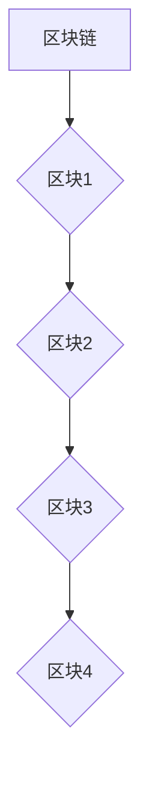

##### **3.1.2 区块结构**

每个区块包含以下内容：

- **交易记录（Transactions）**：记录了交易的内容和相关信息。
- **区块头（Block Header）**：包含区块的版本号、前一区块的哈希值、默克尔树根哈希、时间戳、难度目标等。
- **默克尔树（Merkle Tree）**：用于确保交易记录的完整性和可靠性。

**Mermaid 流程图：**

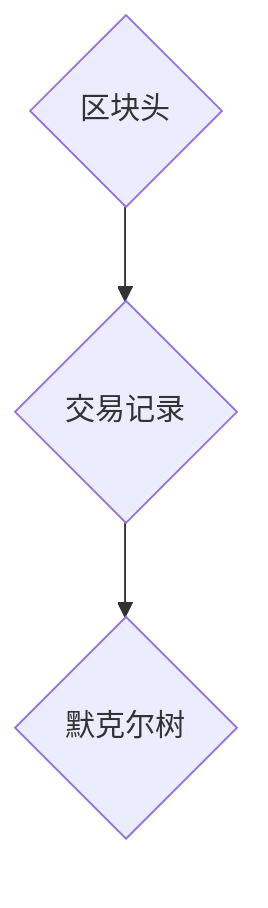

##### **3.1.3 工作原理**

1. **交易生成**：用户发起交易，交易被广播到网络中的节点。
2. **交易验证**：节点验证交易的有效性，确保交易符合规则。
3. **区块生成**：当节点收集到一定数量的交易后，生成一个新的区块。
4. **区块验证**：节点验证区块的有效性，包括验证交易记录、默克尔树和区块头的完整性。
5. **区块添加**：验证通过的区块被添加到区块链中，新区块与前一区块通过哈希值链接。

**伪代码：**

```python
def create_transaction(sender, recipient, amount):
    # 生成交易
    transaction = generate_transaction(sender, recipient, amount)
    broadcast_transaction(transaction)

def validate_transaction(transaction):
    # 验证交易
    if is_valid_transaction(transaction):
        return True
    else:
        return False

def create_block(transactions):
    # 生成区块
    block = generate_block(transactions, previous_hash)
    if is_valid_block(block):
        return block
    else:
        return None

def add_block_to_chain(block):
    # 添加区块到链
    if is_valid_block(block):
        add_block_to_chain(block)
    else:
        reject_block(block)
```

##### **3.1.4 分布式一致性**

区块链通过共识机制实现分布式一致性，确保所有节点拥有相同的区块链状态。

**共识机制：**

- **工作量证明（PoW）**：节点通过计算复杂的数学问题来争夺记账权。
- **权益证明（PoS）**：节点根据其在区块链中的权益大小争夺记账权。
- **委托权益证明（DPoS）**：节点通过投票选举出记账节点。

**Mermaid 流程图：**

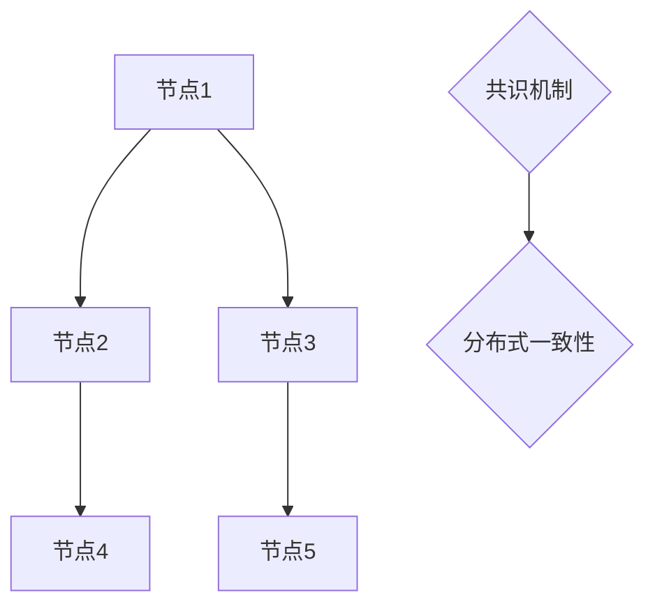

#### **3.2 区块链架构**

区块链架构包括三个主要部分：节点（Node）、区块链数据库（Blockchain Database）和网络（Network）。

##### **3.2.1 节点**

节点是区块链系统中的参与者，负责维护区块链数据库、验证交易和参与共识机制。

**Mermaid 流程图：**

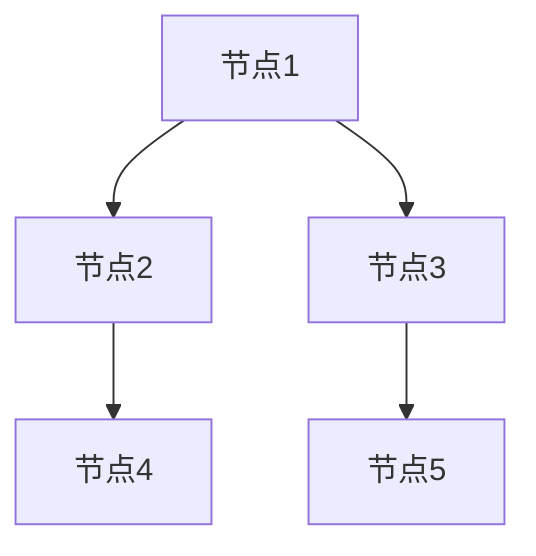

##### **3.2.2 区块链数据库**

区块链数据库存储了所有区块和交易记录，是一个去中心化的分布式数据库。

**Mermaid 流程图：**

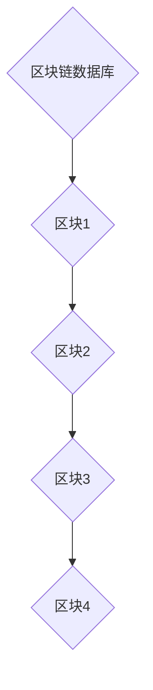

##### **3.2.3 网络**

网络是节点之间通信的渠道，用于广播交易、同步区块和实现共识机制。

**Mermaid 流程图：**

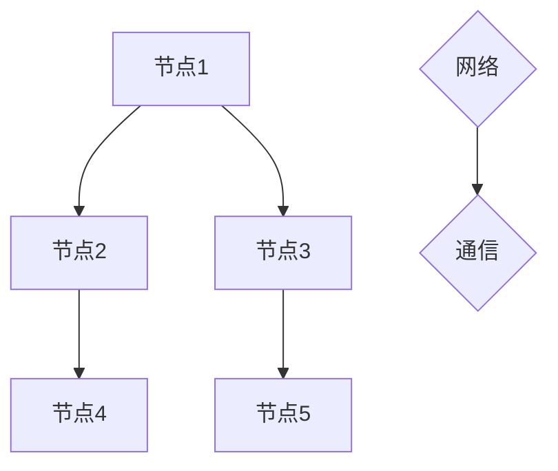

#### **3.3 区块链关键技术**

区块链技术包括多个关键技术，如加密算法、共识算法和哈希算法。

##### **3.3.1 加密算法**

加密算法用于保护区块链中的数据安全和隐私。

**加密算法：**

- **对称加密**：加密和解密使用相同的密钥。
- **非对称加密**：加密和解密使用不同的密钥。

**Mermaid 流程图：**

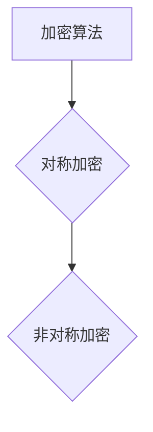

##### **3.3.2 共识算法**

共识算法用于确保区块链系统中所有节点对数据的一致性。

**共识算法：**

- **工作量证明（PoW）**：通过计算复杂度争夺记账权。
- **权益证明（PoS）**：根据节点权益争夺记账权。
- **委托权益证明（DPoS）**：通过选举产生记账节点。

**Mermaid 流程图：**

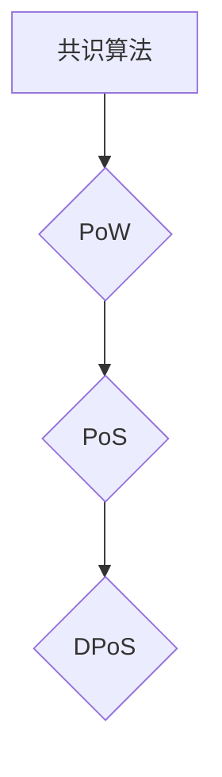

##### **3.3.3 哈希算法**

哈希算法用于生成数据摘要，确保数据的一致性和完整性。

**哈希算法：**

- **SHA-256**：一种常用的哈希算法，生成256位的哈希值。
- **RIPEMD-160**：另一种常用的哈希算法，生成160位的哈希值。

**Mermaid 流程图：**

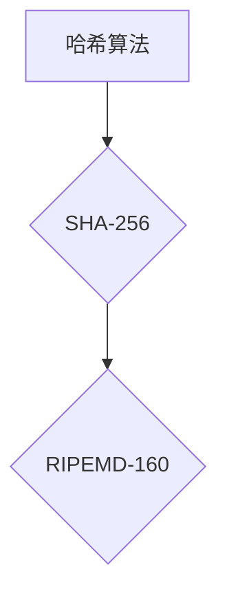

### 第4章 信息安全

#### 4.1 区块链技术在信息安全中的应用

区块链技术在提升信息安全方面具有显著优势，主要包括数据完整性保护、隐私保护、身份验证和防篡改等方面。

##### **4.1.1 数据完整性保护**

区块链通过哈希算法和默克尔树确保数据在传输和存储过程中的完整性。任何数据更改都会导致哈希值的改变，从而被区块链网络的其他节点检测到。

**Mermaid 流程图：**

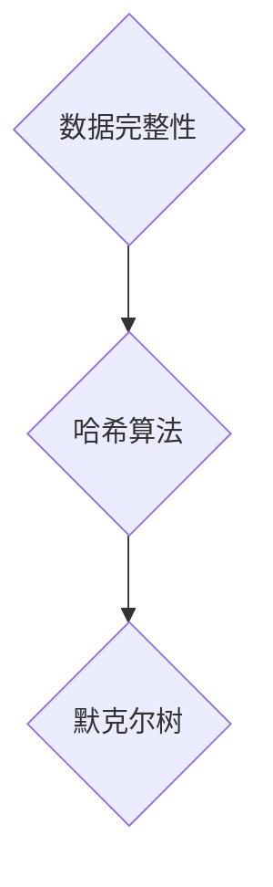

##### **4.1.2 隐私保护**

区块链技术可以通过零知识证明（Zero-Knowledge Proof）和同态加密（Homomorphic Encryption）等技术实现隐私保护。这些技术允许在保持数据隐私的同时进行数据处理和分析。

**Mermaid 流程图：**

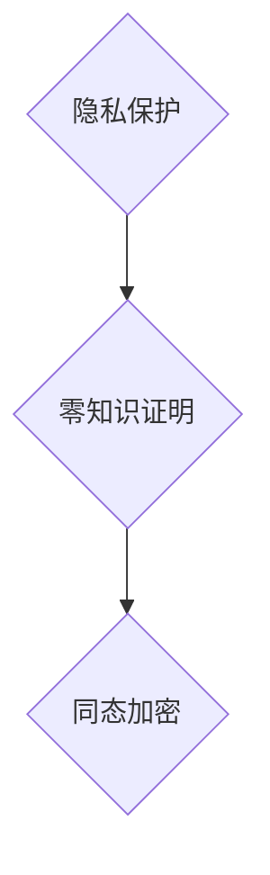

##### **4.1.3 身份验证**

区块链技术可以基于数字签名和公钥加密实现身份验证。用户使用私钥进行签名，验证方使用公钥验证签名，从而确认用户的身份。

**Mermaid 流程图：**

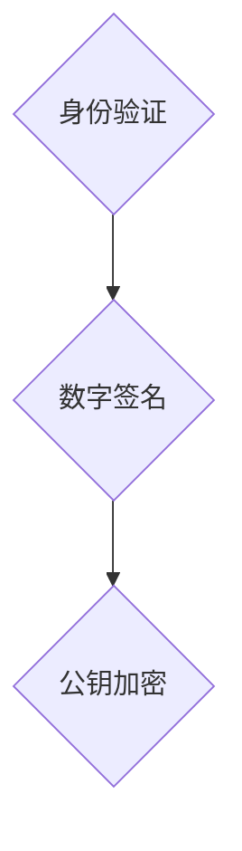

##### **4.1.4 防篡改**

区块链技术通过链式数据结构和共识机制确保数据一旦记录在区块链上就不可篡改。任何篡改行为都会被其他节点检测到，并拒绝该区块。

**Mermaid 流程图：**

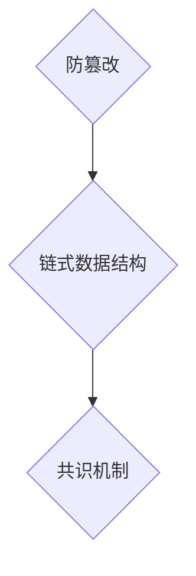

### 第5章 实际案例

在这一章中，我们将分享一些企业在数据溯源和信息安全方面的成功案例，以展示区块链技术的实际应用效果。

#### 5.1 案例一：企业数据溯源案例

**案例背景：**

某大型制造企业希望通过区块链技术实现产品生产过程中的数据溯源，提高产品透明度和客户信任度。

**解决方案：**

1. **数据记录**：企业在生产过程中，将每个生产环节的数据（如原材料信息、生产时间、生产地点等）记录在区块链上。
2. **数据验证**：区块链网络中的其他节点验证数据的有效性和完整性。
3. **数据查询**：消费者通过扫描产品上的二维码，可以查询到产品的生产过程数据。

**实施效果：**

1. **提高透明度**：消费者可以了解产品的生产过程，增加对产品的信任。
2. **减少纠纷**：企业可以提供真实可靠的数据，减少与消费者的纠纷。
3. **提升品牌形象**：企业通过数据溯源提升产品品牌形象，增加市场竞争力。

#### 5.2 案例二：信息安全案例

**案例背景：**

某金融机构希望通过区块链技术提高数据安全和隐私保护能力。

**解决方案：**

1. **数据加密**：金融机构使用区块链技术对交易数据进行加密，确保数据在传输和存储过程中的安全性。
2. **隐私保护**：采用零知识证明和同态加密技术，实现数据的隐私保护。
3. **身份验证**：采用数字签名和公钥加密实现用户身份验证。

**实施效果：**

1. **提高数据安全**：区块链技术确保交易数据的完整性和防篡改性，降低数据泄露风险。
2. **保护用户隐私**：零知识证明和同态加密技术确保用户数据在处理过程中的隐私性。
3. **增强用户信任**：金融机构提供安全可靠的数据服务，增加用户对金融机构的信任。

### 第6章 技术挑战与未来趋势

#### 6.1 区块链技术面临的挑战

尽管区块链技术在数据溯源和信息安全方面具有显著优势，但仍然面临一些技术挑战。

##### **6.1.1 性能瓶颈**

区块链技术目前存在性能瓶颈，如交易处理速度较慢、扩展性较差等问题。

**解决方案：**

- **分层架构**：将区块链分为数据层和智能合约层，提高系统性能和扩展性。
- **状态通道**：通过状态通道实现交易数据的快速处理，减少区块链的负载。

##### **6.1.2 安全性问题**

区块链系统面临安全漏洞、51%攻击等安全威胁。

**解决方案：**

- **安全审计**：对区块链系统进行定期安全审计，识别和修复安全漏洞。
- **多重签名**：采用多重签名机制，提高区块链系统的安全性。

##### **6.1.3 法律法规问题**

区块链技术的法律法规尚不完善，需要政策支持和法律法规的引导。

**解决方案：**

- **国际合作**：加强国际间的合作，制定统一的区块链法律法规。
- **政策引导**：政府出台相关政策，鼓励区块链技术的发展和应用。

#### 6.2 未来发展趋势

区块链技术在数据溯源和信息安全方面的应用将继续拓展，同时与其他技术的结合也将推动区块链技术的发展。

##### **6.2.1 区块链与云计算的结合**

区块链与云计算的结合将实现数据的安全存储和高效处理。通过云计算提供计算资源和存储空间，区块链技术确保数据的安全性和隐私性。

##### **6.2.2 区块链在物联网中的应用**

区块链技术将推动物联网（IoT）的发展，实现设备之间的安全通信和数据共享。区块链技术确保物联网设备生成的数据的真实性和完整性。

##### **6.2.3 区块链技术的国际化发展**

随着全球化的推进，区块链技术将在不同国家和地区得到广泛应用。通过国际合作，推动区块链技术的国际化发展，实现全球范围内的数据共享和安全。

### 第7章 总结与展望

本文介绍了区块链技术在企业数据溯源和信息安全中的应用，分析了区块链技术的原理、架构和关键技术。通过实际案例展示了区块链技术在数据溯源和信息安全方面的优势。尽管区块链技术面临一些挑战，但随着技术的不断发展和政策的支持，区块链技术在信息安全领域的应用前景将更加广阔。

### 参考文献

1. **Nakamoto, S. (2008). Bitcoin: A Peer-to-Peer Electronic Cash System.** *Cryptocurrency*.
2. **Buterin, V. (2014). Ethereum: A Next-Generation Smart Contract and Decentralized Application Platform.* Ethereum Foundation.*
3. **Ethereum Yellow Paper. (2015).** *Ethereum Project.*

### 附录

附录中提供了一些有用的技术文档、开源项目和社区资源，以帮助读者深入了解区块链技术。

**技术文档：**

- **比特币白皮书**：[https://bitcoin.org/bitcoin.pdf](https://bitcoin.org/bitcoin.pdf)
- **以太坊黄皮书**：[https://ethereum.github.io/yellowpaper/paper.pdf](https://ethereum.github.io/yellowpaper/paper.pdf)

**开源项目：**

- **比特币**：[https://github.com/bitcoin](https://github.com/bitcoin)
- **以太坊**：[https://github.com/ethereum](https://github.com/ethereum)

**社区资源：**

- **比特币社区**：[https://bitcointalk.org](https://bitcointalk.org)
- **以太坊社区**：[https://ethereum.org](https://ethereum.org)

### 结语

作者：AI天才研究院/AI Genius Institute & 禅与计算机程序设计艺术 /Zen And The Art of Computer Programming

本文旨在介绍区块链技术在企业数据溯源和信息安全中的应用，帮助读者了解区块链技术的基本原理和关键特点。随着区块链技术的不断发展和完善，其在信息安全领域的应用前景将更加广阔。希望本文能对读者在区块链技术应用方面提供一些启示和帮助。

**最佳实践 Tips：**

- **了解区块链技术的基本原理**：在应用区块链技术之前，先了解区块链的基本原理和关键技术，有助于更好地设计区块链应用。
- **遵循最佳实践**：在开发区块链应用时，遵循行业最佳实践，如安全审计、性能优化等。
- **持续关注技术动态**：区块链技术发展迅速，持续关注技术动态，以便及时掌握新技术和应用。
- **注重法律法规**：在应用区块链技术时，了解并遵循相关法律法规，确保技术的合规性。

**小结：**

区块链技术在企业数据溯源和信息安全方面具有显著优势。通过本文的介绍，读者可以了解到区块链技术的基本原理和关键特点，以及其实际应用案例。未来，随着区块链技术的不断发展和完善，其在信息安全领域的应用前景将更加广阔。

**注意事项：**

- **区块链技术不适用于所有场景**：在考虑使用区块链技术时，需要评估业务需求和适用性。
- **数据隐私保护**：在应用区块链技术时，注意数据隐私保护，采用适当的加密和隐私保护技术。
- **合规性**：遵循相关法律法规，确保区块链技术的合规性。

**拓展阅读：**

- **《区块链技术指南》**：详细介绍区块链技术原理、应用和未来发展趋势。
- **《区块链：从原理到实践》**：涵盖区块链技术原理、架构和开发实践。

## 文章标题：企业数据溯源：区块链技术在信息安全中的应用

关键词：区块链、数据溯源、信息安全、加密算法、共识机制、哈希算法

摘要：本文详细介绍了区块链技术在企业数据溯源和信息安全中的应用。通过分析区块链技术的原理、架构和关键技术，以及实际案例，展示了区块链技术在提升数据完整性和隐私保护方面的优势。本文还探讨了区块链技术面临的挑战和未来发展趋势，为读者提供了有价值的参考。

