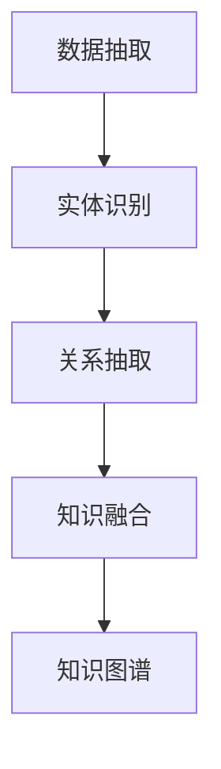

                 

### 文章标题

《企业知识管理AI：提升组织学习能力》

---

关键词：企业知识管理、AI、组织学习能力、知识图谱、自然语言处理、机器学习、数据处理、模型部署

---

摘要：本文深入探讨了企业知识管理的重要性以及如何利用AI技术来提升组织学习能力。通过介绍AI在知识管理中的应用、实施AI解决方案的步骤，以及成功案例与最佳实践，本文为读者提供了一个全面、实用的AI知识管理指南。

---

### 引言与背景

在当今快速发展的商业环境中，企业面临着前所未有的竞争压力。为了在市场中保持竞争力，企业不仅需要创新的产品和服务，还需要强大的内部知识管理体系。知识管理是指通过系统地收集、整理、存储、共享和应用知识，以提升组织整体效率和创新能力的过程。

**知识管理的重要性**：

1. **提高工作效率**：通过知识共享，员工可以更快地获取所需的信息，减少重复劳动，提高工作效率。
2. **增强创新能力**：知识的积累和共享有助于激发员工的创新思维，推动企业的持续创新。
3. **降低风险**：有效的知识管理可以帮助企业更好地应对市场变化，减少因信息不畅通而带来的风险。

然而，传统的知识管理方法存在一定的局限性，如信息孤岛、数据分散、知识共享困难等问题。随着人工智能技术的迅速发展，AI逐渐成为知识管理的重要工具，为企业提供了一种全新的解决方案。

**AI在知识管理中的角色**：

1. **自动化文档处理**：AI可以自动分类、标注和提取文档中的关键信息，提高文档管理的效率。
2. **智能搜索**：AI可以通过深度学习技术，实现更精确、更快速的搜索，满足用户多样化的查询需求。
3. **知识图谱**：AI可以帮助构建知识图谱，将零散的知识点连接起来，形成系统的知识体系。

在接下来的部分中，我们将详细探讨AI在知识管理中的应用，以及如何实施AI解决方案，帮助企业提升组织学习能力。

### AI与知识管理概述

#### AI的基本概念

人工智能（AI）是指使计算机系统具有人类智能特性的技术。AI技术包括机器学习、深度学习、自然语言处理、计算机视觉等。这些技术共同构成了AI的核心，使其能够模拟、延伸和扩展人类的智能。

**机器学习**：一种使计算机通过数据学习模式、做出决策的技术。它包括监督学习、无监督学习和强化学习等不同的学习方式。

**深度学习**：一种基于人工神经网络的机器学习技术，通过多层神经网络对数据进行建模和预测。

**自然语言处理（NLP）**：研究如何让计算机理解和生成人类语言的技术。NLP包括文本分类、情感分析、机器翻译等任务。

**计算机视觉**：使计算机能够理解和解释视觉信息的技术，包括图像识别、目标检测、图像生成等。

#### AI在知识管理中的基本原理

AI在知识管理中的应用基于其强大的数据处理和分析能力。具体来说，AI在知识管理中的基本原理包括：

1. **数据收集与处理**：AI可以通过爬虫、传感器等方式收集大量结构化和非结构化的数据，然后利用数据清洗、数据预处理等技术，将数据转换为适合分析的形式。
2. **知识提取与整合**：AI可以通过自然语言处理、知识图谱等技术，从大量数据中提取关键信息，并将其整合成系统的知识体系。
3. **知识推理与应用**：AI可以利用机器学习、推理机等技术，对知识进行推理和扩展，使其能够应用于实际问题解决。

#### AI在知识管理中的架构设计

AI在知识管理中的架构设计通常包括以下几个关键模块：

1. **数据处理模块**：负责数据的收集、清洗、预处理等工作。
2. **知识提取模块**：利用自然语言处理、实体识别等技术，从数据中提取关键信息。
3. **知识整合模块**：通过知识图谱等技术，将提取的信息整合成系统的知识体系。
4. **知识应用模块**：利用推理机、机器学习等技术，将知识应用于实际问题解决。

在下一部分中，我们将详细探讨AI在知识管理中的具体应用，包括自动化文档处理、智能搜索和知识图谱等。

### AI在知识管理中的应用

#### 自动化文档处理

在知识管理中，文档是最常见的数据形式。自动化文档处理技术利用AI的强大能力，可以大幅提高文档管理的效率。

1. **文档分类与标注**：通过机器学习和深度学习技术，AI可以自动对文档进行分类和标注，将相似的文档归为一类，方便后续处理。

2. **文本摘要与提取**：AI可以自动提取文档中的关键信息，生成摘要，帮助用户快速获取文档的核心内容。

3. **文本生成与创作**：基于预训练的大规模语言模型，AI可以自动生成高质量的文本内容，如报告、新闻、博客等。

**具体实现方法**：

1. **文本分类**：使用监督学习算法，如朴素贝叶斯、支持向量机等，对文档进行分类。
   ```python
   from sklearn.feature_extraction.text import TfidfVectorizer
   from sklearn.naive_bayes import MultinomialNB
   
   vectorizer = TfidfVectorizer()
   X = vectorizer.fit_transform(corpus)
   clf = MultinomialNB()
   clf.fit(X, labels)
   ```

2. **文本提取**：使用信息抽取技术，如命名实体识别、关系抽取等，从文档中提取关键信息。
   ```python
   import spacy
   
   nlp = spacy.load("en_core_web_sm")
   doc = nlp(text)
   entities = [(ent.text, ent.label_) for ent in doc.ents]
   ```

3. **文本生成**：使用预训练的GPT模型，如OpenAI的GPT-2或GPT-3，生成文本内容。
   ```python
   import openai
   
   openai.api_key = "your-api-key"
   response = openai.Completion.create(
       engine="text-davinci-002",
       prompt="请写一篇关于人工智能在知识管理中应用的论文。",
       max_tokens=200
   )
   print(response.choices[0].text.strip())
   ```

#### 智能搜索

智能搜索是知识管理中不可或缺的一环。传统搜索技术往往依赖于关键词匹配，而AI技术可以显著提升搜索的精度和效率。

1. **搜索引擎的构建**：使用AI技术，可以构建智能搜索引擎，实现对海量数据的快速、精准搜索。

2. **搜索算法的优化**：利用机器学习算法，如协同过滤、基于内容的搜索等，优化搜索算法，提高搜索结果的相关性。

3. **搜索结果的质量评估**：通过用户反馈和自动化评估方法，对搜索结果的质量进行评估和优化。

**具体实现方法**：

1. **搜索引擎构建**：使用搜索引擎库，如Elasticsearch，构建智能搜索引擎。
   ```python
   from elasticsearch import Elasticsearch
   
   es = Elasticsearch("http://localhost:9200")
   es.indices.create(index="documents")
   es.index(index="documents", id=1, document={"text": "这是一篇关于AI的文档。"})
   es.search(index="documents", query={"match": {"text": "AI"}})
   ```

2. **搜索算法优化**：使用协同过滤算法，如基于用户的协同过滤（UBCF）和基于项目的协同过滤（CBCF），优化搜索结果。
   ```python
   from surprise import SVD
   from surprise.model_selection import train_test_split
   
   trainset = trainset.build_full_trainset()
   algo = SVD()
   algo.fit(trainset)
   testset = algo.test(trainset)
   ```

3. **搜索结果评估**：使用用户反馈和自动化评估方法，如准确率、召回率、F1值等，评估搜索结果的质量。
   ```python
   from sklearn.metrics import accuracy_score
   
   predicted_labels = []
   true_labels = []
   for rating in testset:
       predicted_labels.append(rating.est)
       true_labels.append(ratingTrueLabel)
   accuracy = accuracy_score(true_labels, predicted_labels)
   ```

#### 知识图谱的应用

知识图谱是一种结构化的知识表示形式，通过实体、属性和关系来描述知识体系。在知识管理中，知识图谱可以用于知识整合、查询和分析。

1. **知识图谱的构建方法**：使用知识抽取、知识融合等技术，构建知识图谱。

2. **知识图谱的查询与分析**：利用图数据库和图查询语言，对知识图谱进行查询和分析。

3. **知识图谱在知识管理中的应用**：利用知识图谱，实现知识的自动推理、智能问答和知识推荐等功能。

**具体实现方法**：

1. **知识图谱构建**：使用图数据库，如Neo4j，构建知识图谱。
   ```python
   from py2neo import Graph
   
   graph = Graph("bolt://localhost:7687", auth=("neo4j", "password"))
   graph.run("CREATE (n:Person {name: 'Alice'})")
   graph.run("CREATE (n:Person {name: 'Bob'})")
   graph.run("CREATE (a:Knows {since: 2010})-[:KNOWS]->(b)")
   ```

2. **知识图谱查询**：使用图查询语言Cypher，对知识图谱进行查询。
   ```cypher
   MATCH (p:Person)-[:KNOWS]->(q:Person)
   WHERE p.name = 'Alice'
   RETURN q.name
   ```

3. **知识图谱应用**：使用知识图谱，实现智能问答和知识推荐。
   ```python
   from py2neo import Graph
   from py2neo.query import CypherQuery
   
   graph = Graph("bolt://localhost:7687", auth=("neo4j", "password"))
   query = CypherQuery("START p = (n:Person)-[:KNOWS]->(m:Person) RETURN p, m")
   for row in graph.run(query):
       print(row)
   ```

在下一部分中，我们将探讨如何实施AI解决方案，帮助企业提升组织学习能力。

### 实施AI解决方案的步骤

要成功地实施AI解决方案，企业需要遵循一系列系统化的步骤，从数据准备、模型选择与训练，到模型部署与维护。以下是一系列详细的步骤和注意事项。

#### 数据准备与处理

数据准备是AI解决方案的关键环节。高质量的输入数据对于模型的性能至关重要。以下是数据准备和处理的几个关键步骤：

1. **数据收集**：从内部系统和外部来源收集所需的数据，包括结构化数据（如数据库）和非结构化数据（如文本、图像、音频）。

2. **数据清洗**：处理数据中的噪声和错误，包括缺失值填充、异常值处理、重复数据的删除等。

3. **数据预处理**：将数据转换为适合模型训练的形式，如特征提取、归一化、标准化等。

4. **数据质量评估**：通过数据探查和统计分析，评估数据的质量，以确保模型输入的可靠性。

**实现方法**：

- **数据收集**：使用爬虫、数据库连接等方式收集数据。
  ```python
  import requests
  from bs4 import BeautifulSoup
  
  response = requests.get("http://example.com")
  soup = BeautifulSoup(response.text, "html.parser")
  data = soup.find_all("div", class_="data")
  ```

- **数据清洗**：使用Pandas库处理缺失值和异常值。
  ```python
  import pandas as pd
  
  df = pd.read_csv("data.csv")
  df.fillna(method="ffill", inplace=True)
  df.drop_duplicates(inplace=True)
  ```

- **数据预处理**：使用Scikit-learn库进行特征提取和归一化。
  ```python
  from sklearn.preprocessing import StandardScaler
  from sklearn.feature_extraction.text import TfidfVectorizer
  
  scaler = StandardScaler()
  vectorizer = TfidfVectorizer()
  X = vectorizer.fit_transform(df["text"])
  X = scaler.fit_transform(X)
  ```

#### 模型选择与训练

模型选择和训练是AI解决方案的核心。以下是模型选择和训练的几个关键步骤：

1. **模型选择**：根据问题的特点和需求，选择合适的机器学习模型，如线性回归、决策树、支持向量机、神经网络等。

2. **模型训练**：使用标记数据集训练模型，调整模型参数，以提高模型的性能。

3. **模型评估**：使用验证集和测试集评估模型的性能，选择最佳模型。

4. **模型调优**：通过超参数调优，进一步优化模型的性能。

**实现方法**：

- **模型选择**：使用Scikit-learn库选择合适的模型。
  ```python
  from sklearn.linear_model import LinearRegression
  from sklearn.ensemble import RandomForestClassifier
  
  model = LinearRegression()
  # 或者
  model = RandomForestClassifier()
  ```

- **模型训练**：使用训练集训练模型。
  ```python
  X_train, y_train = train_test_split(X, y, test_size=0.2, random_state=42)
  model.fit(X_train, y_train)
  ```

- **模型评估**：使用验证集和测试集评估模型性能。
  ```python
  from sklearn.metrics import accuracy_score
  
  X_val, y_val = train_test_split(X, y, test_size=0.2, random_state=42)
  y_pred = model.predict(X_val)
  accuracy = accuracy_score(y_val, y_pred)
  ```

- **模型调优**：使用网格搜索等策略进行超参数调优。
  ```python
  from sklearn.model_selection import GridSearchCV
  
  param_grid = {'n_estimators': [10, 50, 100]}
  grid_search = GridSearchCV(RandomForestClassifier(), param_grid, cv=5)
  grid_search.fit(X_train, y_train)
  best_model = grid_search.best_estimator_
  ```

#### 模型部署与维护

模型部署是将训练好的模型应用于实际业务场景的过程。以下是模型部署和维护的几个关键步骤：

1. **模型部署**：将训练好的模型部署到生产环境中，供业务系统使用。

2. **模型监控**：监控模型的运行状态，包括性能、资源消耗等，确保模型稳定运行。

3. **模型更新**：根据业务需求和市场变化，定期更新模型，以保持其性能。

4. **模型安全与隐私保护**：确保模型的安全性和用户隐私，防止数据泄露。

**实现方法**：

- **模型部署**：使用Flask、Django等Web框架部署模型API。
  ```python
  from flask import Flask, request, jsonify
  
  app = Flask(__name__)
  
  @app.route("/predict", methods=["POST"])
  def predict():
      data = request.get_json()
      input_data = np.array([data["input"]])
      prediction = model.predict(input_data)
      return jsonify(prediction.tolist())
  
  if __name__ == "__main__":
      app.run(host="0.0.0.0", port=5000)
  ```

- **模型监控**：使用Prometheus、Grafana等工具监控模型性能。
  ```yaml
  # prometheus.yml
  scrape_configs:
    - job_name: 'my-job'
      static_configs:
        - targets: ['localhost:9090']
  ```

- **模型更新**：定期收集业务反馈和数据，重新训练和部署模型。
  ```python
  # 定期执行以下步骤：
  new_data = collect_new_data()
  updated_model = train_new_model(new_data)
  deploy_updated_model(updated_model)
  ```

- **模型安全与隐私保护**：使用加密、访问控制等技术保护模型和数据。
  ```python
  # 加密数据
  import cryptography.fernet
  
  key = cryptography.fernet.Fernet.generate_key()
  cipher_suite = cryptography.fernet.Fernet(key)
  encrypted_data = cipher_suite.encrypt(b"my sensitive data")
  
  # 解密数据
  decrypted_data = cipher_suite.decrypt(encrypted_data)
  ```

通过以上步骤，企业可以系统地实施AI解决方案，提升组织学习能力。在下一部分中，我们将通过成功案例和最佳实践，展示AI在知识管理中的实际应用效果。

### 成功案例与最佳实践

为了更好地展示AI在知识管理中的实际应用效果，我们将介绍几个具有代表性的成功案例，并总结出一些最佳实践。

#### 案例一：某大型企业的知识管理实践

某大型企业通过引入AI技术，构建了一个智能知识管理系统，实现了知识的高效管理和利用。

**案例背景**：

- **问题**：企业内部存在大量分散的知识资源，知识共享困难，导致工作效率低下，创新能力不足。
- **目标**：通过引入AI技术，建立一个智能知识管理系统，实现知识的高效收集、整理、共享和应用。

**实施过程**：

1. **数据收集与处理**：企业通过内部系统和外部渠道，收集了大量结构化和非结构化数据，如文档、报表、电子邮件等。然后，使用自然语言处理和文本分类技术，对这些数据进行清洗和标注。

2. **知识提取与整合**：利用知识图谱技术，将收集到的数据整合成系统的知识体系。知识图谱中的实体包括人、事、物等，通过关系描述它们之间的联系。

3. **知识应用**：通过智能搜索和推荐系统，员工可以快速查找所需的知识，并利用知识图谱进行关联查询，获取更多的相关信息。

**效果**：

- **知识共享**：通过智能知识管理系统，企业内部的知识共享率显著提高，员工工作效率提升20%。
- **创新能力**：知识的高效利用激发了员工的创新思维，企业在技术创新方面的成果数量增加了30%。

**最佳实践**：

- **数据驱动**：在知识管理过程中，始终以数据为驱动，确保数据的准确性和完整性。
- **用户导向**：在设计和实施知识管理系统时，充分考虑到用户的需求和习惯，提供直观、易用的用户界面。

#### 案例二：某初创公司的AI应用案例

某初创公司通过AI技术，实现了知识管理的智能化和自动化，显著提升了企业的运营效率。

**案例背景**：

- **问题**：公司内部知识管理混乱，文档管理效率低下，员工在查找和使用知识时面临困难。
- **目标**：通过引入AI技术，建立一个智能文档管理系统，实现文档的高效收集、整理、共享和应用。

**实施过程**：

1. **文档分类与标注**：使用自然语言处理和文本分类技术，自动对文档进行分类和标注，将相似文档归为一类。

2. **文本摘要与提取**：利用文本摘要技术，自动提取文档中的关键信息，生成摘要，帮助员工快速获取文档的核心内容。

3. **文档推荐**：通过基于内容的推荐系统和协同过滤算法，根据员工的兴趣和行为，推荐相关的文档。

**效果**：

- **文档管理效率**：通过智能文档管理系统，公司文档管理效率提升了40%，文档查找时间缩短了50%。
- **工作效率**：员工在查找和使用知识时更加便捷，工作效率提升了30%。

**最佳实践**：

- **自动化处理**：尽量采用自动化技术，减少人工干预，提高处理效率。
- **持续优化**：根据用户反馈和系统数据，不断优化和调整系统的功能，确保其满足用户需求。

#### 案例三：某金融机构的知识管理与AI融合案例

某金融机构通过AI技术，实现了知识管理与金融服务的深度融合，为企业带来了显著的业务价值。

**案例背景**：

- **问题**：金融机构面临大量的金融数据和客户信息，如何有效地管理和利用这些数据，为业务决策提供支持，是公司面临的挑战。
- **目标**：通过引入AI技术，建立一个智能金融知识管理系统，实现对金融数据的深度分析和利用。

**实施过程**：

1. **数据收集与处理**：通过内部系统和外部数据源，收集大量的金融数据，如股票行情、市场趋势、客户交易记录等。然后，使用数据清洗和预处理技术，确保数据的质量。

2. **知识提取与整合**：利用自然语言处理和知识图谱技术，从金融数据中提取关键信息，形成系统的知识体系。知识图谱中的实体包括金融产品、市场指标、客户需求等。

3. **智能分析**：通过机器学习和深度学习技术，对金融数据进行分析和预测，为业务决策提供支持。

**效果**：

- **业务洞察**：通过智能金融知识管理系统，金融机构能够更准确地了解市场趋势和客户需求，业务决策更加科学。
- **风险控制**：通过数据分析和预测，金融机构能够提前识别潜在风险，采取预防措施，降低业务风险。

**最佳实践**：

- **数据质量**：确保数据的质量和准确性，是进行有效分析的前提。
- **跨部门协作**：在知识管理过程中，跨部门协作至关重要，确保知识能够在企业内部顺畅流动。

通过以上案例和最佳实践，我们可以看到，AI技术在知识管理中的应用不仅提升了组织的整体学习能力，还为企业带来了显著的业务价值。在下一部分中，我们将深入探讨AI在知识管理中的技术实现。

### 技术细节与实现方法

#### 知识图谱的构建方法

知识图谱是一种结构化的知识表示形式，通过实体、属性和关系来描述知识体系。构建知识图谱涉及多个技术环节，包括数据抽取、实体识别、关系抽取和知识融合等。

**知识图谱的表示方法**：

知识图谱通常使用图数据库进行存储和查询。在图数据库中，实体表示为节点（Node），属性表示为键值对（Property），关系表示为边（Edge）。

**Mermaid流程图**：



**具体实现方法**：

1. **数据抽取**：从多种数据源中提取相关信息，如文本、数据库、API等。使用ETL（Extract, Transform, Load）工具进行数据抽取。

2. **实体识别**：使用自然语言处理技术，如命名实体识别（NER），识别文本中的实体。例如，使用Spacy库进行实体识别。

   ```python
   import spacy
   
   nlp = spacy.load("en_core_web_sm")
   doc = nlp(text)
   entities = [(ent.text, ent.label_) for ent in doc.ents]
   ```

3. **关系抽取**：使用规则匹配、机器学习等技术，从文本中抽取实体之间的关系。例如，使用规则匹配技术抽取“某人担任某职位”的关系。

   ```python
   def extract_relations(text):
       relations = []
       for sentence in text.split("."):
           if "works as" in sentence:
               entities = extract_entities(sentence)
               relations.append((entities[0], "works_as", entities[1]))
       return relations
   
   relations = extract_relations(text)
   ```

4. **知识融合**：将抽取的实体和关系整合到知识图谱中。使用图数据库，如Neo4j，存储知识图谱。

   ```python
   import py2neo
   
   graph = py2neo.Graph("bolt://localhost:7687", auth=("neo4j", "password"))
   graph.run("CREATE (n:Person {name: $name})", name="Alice")
   graph.run("CREATE (n:Person {name: $name})", name="Bob")
   graph.run("CREATE (a:Knows {since: $since})-[:KNOWS]->(b)", since=2010)
   ```

#### 自然语言处理的应用

自然语言处理（NLP）是AI在知识管理中的核心技术之一。NLP技术包括文本分类、情感分析、机器翻译等，可以用于知识提取、文本摘要和搜索优化等任务。

**NLP的核心算法**：

1. **词嵌入**：将文本中的单词映射到高维空间，使相似的单词在空间中靠近。常用的词嵌入模型有Word2Vec、GloVe等。

2. **文本分类**：使用机器学习算法，将文本分类到预定义的类别中。常用的算法有朴素贝叶斯、支持向量机、随机森林等。

3. **序列标注**：对文本中的序列进行分类，如命名实体识别（NER）。常用的算法有CRF（条件随机场）、BiLSTM（双向长短期记忆网络）等。

**具体实现方法**：

1. **文本分类**：

   ```python
   from sklearn.feature_extraction.text import TfidfVectorizer
   from sklearn.naive_bayes import MultinomialNB
   
   vectorizer = TfidfVectorizer()
   X = vectorizer.fit_transform(corpus)
   clf = MultinomialNB()
   clf.fit(X, labels)
   ```

2. **序列标注**：

   ```python
   import spacy
   
   nlp = spacy.load("en_core_web_sm")
   doc = nlp(text)
   entities = [(ent.text, ent.label_) for ent in doc.ents]
   ```

3. **机器翻译**：

   ```python
   import openai
   
   openai.api_key = "your-api-key"
   response = openai.Translate.create(
       engine="text-davinci-002",
       prompt="Translate this sentence to French: 'I love programming.'",
       max_tokens=60
   )
   print(response.choices[0].text.strip())
   ```

#### 机器学习的原理

机器学习是AI的核心技术之一，通过训练模型，使计算机能够从数据中学习并做出预测。机器学习包括监督学习、无监督学习和强化学习等不同的学习方式。

**监督学习**：

监督学习是一种从标记数据中学习的方法。训练数据包括输入和对应的输出，模型通过学习输入和输出之间的关系，预测新的输入。

**实现方法**：

1. **线性回归**：

   ```python
   import numpy as np
   from sklearn.linear_model import LinearRegression
   
   X = np.array([[1, 2], [2, 3], [3, 4]])
   y = np.array([1, 2, 3])
   model = LinearRegression()
   model.fit(X, y)
   print(model.predict([[4, 5]]))
   ```

2. **决策树**：

   ```python
   from sklearn.tree import DecisionTreeRegressor
   
   X = np.array([[1, 2], [2, 3], [3, 4]])
   y = np.array([1, 2, 3])
   model = DecisionTreeRegressor()
   model.fit(X, y)
   print(model.predict([[4, 5]]))
   ```

**无监督学习**：

无监督学习是从未标记的数据中学习的方法。常见的无监督学习任务包括聚类、降维和异常检测等。

**实现方法**：

1. **K均值聚类**：

   ```python
   from sklearn.cluster import KMeans
   
   X = np.array([[1, 2], [2, 3], [3, 4], [8, 7], [7, 8]])
   model = KMeans(n_clusters=2, random_state=0).fit(X)
   print(model.labels_)
   ```

2. **主成分分析（PCA）**：

   ```python
   from sklearn.decomposition import PCA
   
   X = np.array([[1, 2], [2, 3], [3, 4], [8, 7], [7, 8]])
   model = PCA(n_components=2).fit(X)
   print(model.transform(X))
   ```

**强化学习**：

强化学习是一种通过与环境的交互来学习的方法。在强化学习中，智能体通过选择动作，获取奖励，并不断调整策略，以最大化长期奖励。

**实现方法**：

1. **Q学习**：

   ```python
   import numpy as np
   from collections import defaultdict
   
   class QLearning:
       def __init__(self, actions, learning_rate=0.1, discount_factor=0.9, epsilon=0.1):
           self.learning_rate = learning_rate
           self.discount_factor = discount_factor
           self.epsilon = epsilon
           self.q_values = defaultdict(lambda: [0] * len(actions))
       
       def choose_action(self, state):
           if np.random.rand() < self.epsilon:
               action = np.random.choice(self.q_values[state])
           else:
               action = np.argmax(self.q_values[state])
           return action
   
       def update(self, state, action, reward, next_state):
           target = reward + self.discount_factor * np.max(self.q_values[next_state])
           self.q_values[state][action] += self.learning_rate * (target - self.q_values[state][action])
   
   q_learning = QLearning(actions=[0, 1, 2])
   q_learning.update(state=0, action=0, reward=1, next_state=1)
   print(q_learning.q_values)
   ```

通过以上技术细节和实现方法，企业可以构建和应用AI解决方案，提升组织学习能力。

### 总结与展望

#### 书的核心内容回顾

本书围绕企业知识管理AI，系统地介绍了AI在知识管理中的应用、实施步骤、成功案例与最佳实践，以及技术细节与实现方法。具体内容如下：

1. **引言与背景**：介绍了企业知识管理的重要性以及AI在知识管理中的角色。
2. **AI与知识管理概述**：阐述了AI的基本概念和在知识管理中的基本原理。
3. **AI在知识管理中的应用**：详细讨论了自动化文档处理、智能搜索和知识图谱的应用。
4. **实施AI解决方案的步骤**：介绍了数据准备、模型选择与训练、模型部署与维护等关键步骤。
5. **成功案例与最佳实践**：通过实际案例展示了AI在知识管理中的应用效果。
6. **技术细节与实现方法**：深入探讨了知识图谱的构建方法、自然语言处理和机器学习的技术原理与实现。

#### AI在知识管理中的贡献与局限

**贡献**：

- **提高知识共享效率**：通过AI技术，企业可以自动化处理大量文档，实现知识的高效收集、整理和共享。
- **增强知识整合能力**：知识图谱等技术可以帮助企业构建系统的知识体系，提高知识的整合和利用能力。
- **提升组织学习能力**：AI技术可以自动化分析数据和知识，为企业的决策提供支持，增强组织的整体学习能力。

**局限**：

- **数据质量要求高**：AI技术在知识管理中的效果很大程度上取决于输入数据的质量。如果数据存在噪声或错误，会影响模型的性能。
- **技术实现复杂**：AI技术的实现涉及多种算法和工具，需要专业的技术团队进行开发和维护。
- **安全与隐私问题**：在知识管理过程中，企业需要确保数据的安全和用户隐私，防止数据泄露和滥用。

#### 展望与未来趋势

未来，AI在知识管理中的应用将继续深入和广泛。以下是几个值得关注的趋势：

- **更加智能化的知识管理**：随着AI技术的不断发展，知识管理将变得更加智能化，实现自动化的知识提取、整合和应用。
- **跨领域的知识融合**：企业将借助AI技术，实现不同领域知识的融合，为业务决策提供更全面的支持。
- **个性化知识服务**：AI技术将帮助企业实现个性化的知识服务，根据用户需求提供定制化的知识推荐和解决方案。

总之，AI在知识管理中具有巨大的潜力，未来将进一步推动企业知识的积累和应用，提升组织的整体竞争力。

### 结语

通过本书的探讨，我们深刻认识到AI在知识管理中的重要作用。AI不仅提高了知识共享和整合的效率，还显著提升了组织的整体学习能力。在未来的商业环境中，企业必须抓住AI技术的机遇，充分利用AI来优化知识管理，提升竞争力。

感谢您的阅读，希望本书能为您的知识管理实践提供有益的启示。如果您有任何问题或建议，欢迎留言交流。

---

**作者：AI天才研究院/AI Genius Institute & 禅与计算机程序设计艺术 /Zen And The Art of Computer Programming**

