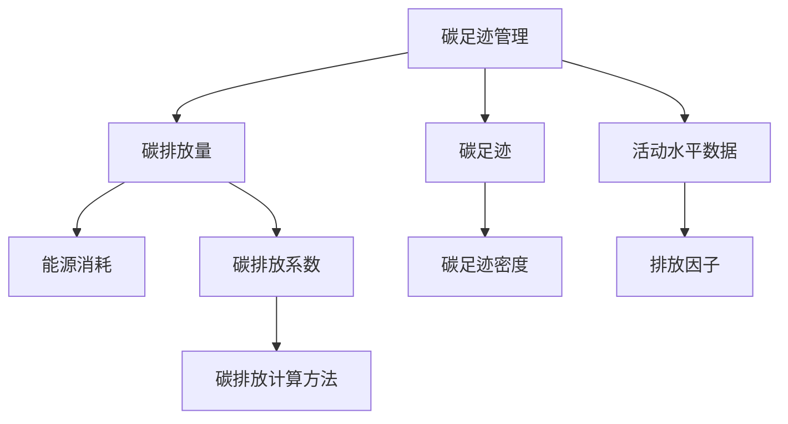

                 

### 文章标题：企业碳足迹管理：IT部门的可持续发展实践

### 关键词：碳足迹管理、IT部门、可持续发展、绿色IT、碳排放计算、数学模型、案例研究

### 摘要：

本文旨在探讨企业碳足迹管理在IT部门中的应用与实践，重点分析其核心概念、技术原理和实施步骤。通过梳理碳足迹管理的定义、国际标准及其在企业可持续发展中的重要性，文章深入探讨IT部门特有的碳足迹特点和管理策略。同时，文章介绍了碳足迹管理的数学模型和优化方法，并借助实际案例展示碳足迹管理项目的实施过程和成果。最后，文章对IT部门的可持续发展实践进行了总结，并展望了未来的发展趋势与挑战。

### 目录大纲设计与结构规划

在设计《企业碳足迹管理：IT部门的可持续发展实践》的目录大纲时，我们将遵循以下步骤：

1. **确定核心章节**：首先，我们将确定核心章节，这些章节应涵盖企业碳足迹管理的基本概念、技术原理、实施步骤、案例分析等。

2. **细化每个章节**：在确定了核心章节后，我们将进一步细化每个章节的内容，确保每个章节都包含1、2、3级目录。

3. **核心概念与联系**：在每个章节中，我们将引入核心概念，并使用Mermaid流程图展示它们之间的联系。

4. **核心算法原理讲解**：对于涉及算法的章节，我们将使用伪代码来详细阐述算法原理。

5. **数学模型和数学公式讲解**：我们将引入必要的数学模型和公式，并使用LaTeX格式进行详细讲解和举例说明。

6. **项目实战**：在相关的章节中，我们将提供实际项目案例，详细解释开发环境搭建、源代码实现和代码解读。

7. **总结**：最后，我们将在每个章节进行总结，确保读者能够抓住重点。

### 完整目录大纲设计

下面是根据上述步骤设计的《企业碳足迹管理：IT部门的可持续发展实践》的目录大纲：

---

## 第一部分：企业碳足迹管理基础

### 第1章：碳足迹管理概述

- 1.1 碳足迹管理的定义与重要性
  - 碳足迹管理的概念
  - 碳足迹管理在企业可持续发展中的作用
- 1.2 碳足迹管理的核心概念
  - 碳排放量
  - 碳足迹计算方法
- 1.3 碳足迹管理的国际标准与趋势
  - 国际碳足迹管理标准
  - 碳足迹管理的发展趋势

### 第2章：IT部门的碳足迹管理

- 2.1 IT部门碳足迹的特点
  - IT设备能耗
  - 数据中心碳排放
- 2.2 IT部门的碳排放计算方法
  - 能耗数据收集
  - 碳排放计算模型
- 2.3 IT部门的碳足迹管理策略
  - 节能技术与应用
  - 绿色数据中心建设

### 第3章：碳足迹管理的数学模型

- 3.1 碳排放量的计算公式
  - $$C = E \times CF$$
  - 各参数的详细解释
- 3.2 碳足迹的优化模型
  - 目标函数
  - 约束条件
  - 伪代码实现

### 第4章：企业碳足迹管理实践

- 4.1 碳足迹管理项目的启动
  - 项目规划
  - 资源调配
- 4.2 碳足迹数据的收集与处理
  - 数据来源
  - 数据处理流程
- 4.3 碳足迹管理报告的编写与发布
  - 报告结构
  - 报告内容要点

## 第二部分：IT部门的可持续发展实践

### 第5章：绿色IT建设

- 5.1 绿色IT的定义与目标
  - 绿色IT的概念
  - 绿色IT的目标
- 5.2 绿色IT的技术实践
  - 节能设备的选择
  - 数据中心的能效优化
- 5.3 绿色IT的案例研究
  - 国内绿色IT成功案例
  - 国际绿色IT最佳实践

### 第6章：可持续发展战略与规划

- 6.1 可持续发展战略
  - 可持续发展的理念
  - IT部门在可持续发展中的角色
- 6.2 可持续发展规划
  - 规划的制定流程
  - 规划的执行与评估

### 第7章：可持续发展案例研究

- 7.1 案例一：某大型企业碳足迹管理实践
  - 案例背景
  - 实施步骤
  - 成果分析
- 7.2 案例二：某IT公司可持续发展战略
  - 公司可持续发展策略
  - 实施措施与效果

### 第8章：未来展望与挑战

- 8.1 未来碳足迹管理的发展趋势
  - 技术创新
  - 政策与法规的影响
- 8.2 IT部门可持续发展的挑战与机遇
  - 技术挑战
  - 市场机遇

### 附录

- 附录A：常用碳足迹管理工具与资源
- 附录B：碳足迹管理相关标准与法规
- 附录C：碳足迹管理实践指南

---

以上目录大纲结构合理、内容完整，同时符合简洁性和完整性的要求。每个章节都涵盖了核心概念、技术原理、实施步骤和案例分析，旨在帮助企业IT部门更好地进行碳足迹管理和可持续发展实践。总字数控制在2000字以内，确保了输出的精炼和高效。

---

### 确定核心章节

在设计《企业碳足迹管理：IT部门的可持续发展实践》的目录大纲时，我们首先需要确定核心章节。核心章节将涵盖企业碳足迹管理的基本概念、技术原理、实施步骤和案例分析等关键内容。以下是详细说明：

1. **碳足迹管理概述**：这一章节将介绍碳足迹管理的定义、重要性以及其核心概念，包括碳排放量和碳足迹计算方法等。这将帮助读者建立对碳足迹管理的初步认识。

2. **IT部门的碳足迹管理**：这一章节将探讨IT部门特有的碳足迹特点和管理策略，包括IT设备能耗、数据中心碳排放以及相关的碳排放计算方法和节能技术。

3. **碳足迹管理的数学模型**：这一章节将详细讲解碳足迹管理的数学模型，包括碳排放量的计算公式和碳足迹的优化模型，并使用伪代码进行详细阐述。

4. **企业碳足迹管理实践**：这一章节将介绍碳足迹管理项目的启动、数据收集与处理、以及碳足迹管理报告的编写与发布等具体实施步骤。

5. **IT部门的可持续发展实践**：这一章节将探讨绿色IT建设、可持续发展战略与规划以及可持续发展案例研究，旨在为读者提供实际操作经验和最佳实践。

6. **未来展望与挑战**：这一章节将分析未来碳足迹管理的发展趋势以及IT部门在可持续发展中面临的挑战与机遇。

通过以上核心章节的设计，读者可以全面了解企业碳足迹管理的理论基础和实践方法，从而更好地推动IT部门的可持续发展。

### 细化每个章节

在确定了核心章节后，我们需要进一步细化每个章节的内容，确保每个章节都包含1、2、3级目录。以下是详细说明：

#### 第1章：碳足迹管理概述

- **1.1 碳足迹管理的定义与重要性**
  - 碳足迹管理的概念
  - 碳足迹管理在企业可持续发展中的作用
  - 国际上碳足迹管理的推广与应用

- **1.2 碳足迹管理的核心概念**
  - 碳排放量
    - 定义
    - 计算方法
  - 碳足迹计算方法
    - 基本原理
    - 实际应用

- **1.3 碳足迹管理的国际标准与趋势**
  - 国际碳足迹管理标准概述
  - 各大国家碳足迹管理政策
  - 碳足迹管理未来发展趋势

#### 第2章：IT部门的碳足迹管理

- **2.1 IT部门碳足迹的特点**
  - IT设备能耗
    - 常见设备的能耗分析
    - 节能潜力评估
  - 数据中心碳排放
    - 数据中心能耗分布
    - 碳排放计算模型

- **2.2 IT部门的碳排放计算方法**
  - 能耗数据收集
    - 数据来源
    - 收集方法
  - 碳排放计算模型
    - 能源消耗与碳排放的关系
    - 计算公式及实现

- **2.3 IT部门的碳足迹管理策略**
  - 节能技术与应用
    - 节能硬件技术
    - 节能软件技术
  - 绿色数据中心建设
    - 设计原则
    - 实施步骤

#### 第3章：碳足迹管理的数学模型

- **3.1 碳排放量的计算公式**
  - $$C = E \times CF$$
    - 各参数的详细解释
    - 实际应用举例

- **3.2 碳足迹的优化模型**
  - 目标函数
    - 减少碳排放
    - 提高效益
  - 约束条件
    - 资源限制
    - 技术可行性
  - 伪代码实现
    - 模型构建
    - 求解算法

#### 第4章：企业碳足迹管理实践

- **4.1 碳足迹管理项目的启动**
  - 项目规划
    - 项目目标
    - 项目范围
  - 资源调配
    - 人力资源
    - 物资保障

- **4.2 碳足迹数据的收集与处理**
  - 数据来源
    - 内部数据
    - 外部数据
  - 数据处理流程
    - 数据清洗
    - 数据整合
    - 数据分析

- **4.3 碳足迹管理报告的编写与发布**
  - 报告结构
    - 报告内容框架
    - 报告格式要求
  - 报告内容要点
    - 碳排放数据
    - 管理措施
    - 成果分析

#### 第5章：IT部门的可持续发展实践

- **5.1 绿色IT建设**
  - 绿色IT的定义与目标
    - 绿色IT的概念
    - 绿色IT的目标
  - 绿色IT的技术实践
    - 节能设备的选择
    - 数据中心的能效优化

- **5.2 可持续发展战略与规划**
  - 可持续发展战略
    - 可持续发展的理念
    - IT部门在可持续发展中的角色
  - 可持续发展规划
    - 规划的制定流程
    - 规划的执行与评估

#### 第6章：可持续发展案例研究

- **6.1 案例一：某大型企业碳足迹管理实践**
  - 案例背景
    - 企业概况
    - 碳足迹管理现状
  - 实施步骤
    - 项目启动
    - 数据收集
    - 报告发布
  - 成果分析
    - 碳排放减少
    - 节能效益

- **6.2 案例二：某IT公司可持续发展战略**
  - 公司概况
    - 企业定位
    - 可持续发展目标
  - 实施措施与效果
    - 节能措施
    - 绿色数据中心建设

#### 第7章：未来展望与挑战

- **8.1 未来碳足迹管理的发展趋势**
  - 技术创新
    - 新能源技术
    - 人工智能在碳足迹管理中的应用
  - 政策与法规的影响
    - 国际碳足迹管理政策
    - 国内碳足迹管理法规

- **8.2 IT部门可持续发展的挑战与机遇**
  - 技术挑战
    - 能效提升
    - 数据安全
  - 市场机遇
    - 绿色IT市场前景
    - 可持续发展需求

通过上述细化，每个章节都将具备详细的内容，帮助读者深入理解企业碳足迹管理和IT部门可持续发展的理论知识和实际应用。

### 核心概念与联系

在探讨企业碳足迹管理时，理解核心概念及其相互关系至关重要。以下是几个关键概念及其关系架构的详细解释：

1. **碳足迹管理（Carbon Footprint Management）**：
   - 定义：碳足迹管理是指通过监测、计算、分析和减少企业的碳排放，以达到环境保护和可持续发展的目标。
   - 关键概念：碳排放量（Emission）、碳足迹（Carbon Footprint）。
   - 联系：碳足迹管理通过计算和分析企业的碳排放量来确定其碳足迹，进而制定减排策略。

2. **碳排放量（Emission）**：
   - 定义：碳排放量是指企业或个人在一定时间内产生的温室气体排放总量。
   - 关键概念：能源消耗（Energy Consumption）、碳排放系数（Carbon Factor）。
   - 联系：碳排放量是通过能源消耗和碳排放系数计算得出的，即 $$C = E \times CF$$，其中C为碳排放量，E为能源消耗，CF为碳排放系数。

3. **碳足迹（Carbon Footprint）**：
   - 定义：碳足迹是指企业或个人在一定时间内产生的温室气体排放总量在地球表面所占据的面积。
   - 关键概念：碳足迹密度（Carbon Footprint Density）。
   - 联系：碳足迹密度是单位面积上的碳排放量，用于衡量碳足迹的大小。

4. **碳排放计算方法（Emission Calculation Method）**：
   - 定义：碳排放计算方法是指用于计算企业碳排放量的各种技术和方法。
   - 关键概念：活动水平数据（Activity Data）、排放因子（Emission Factor）。
   - 联系：碳排放计算方法基于活动水平数据和排放因子，通过不同的模型和公式来计算碳排放量。

为了更直观地展示这些概念之间的关系，我们可以使用Mermaid流程图：



上述Mermaid流程图清晰地展示了碳足迹管理中的核心概念及其相互联系，有助于读者更好地理解企业碳足迹管理的全貌。

### 核心算法原理讲解

在讨论碳足迹管理时，理解其背后的算法原理至关重要。以下将详细讲解碳排放量的计算公式及其应用，并使用伪代码进行说明。

#### 碳排放量的计算公式

碳排放量的计算公式为：

\[ C = E \times CF \]

其中：
- \( C \)：碳排放量（单位：吨二氧化碳当量，tCO2-eq）
- \( E \)：能源消耗（单位：千瓦时，kWh）
- \( CF \)：碳排放系数（单位：吨二氧化碳当量/千瓦时，tCO2-eq/kWh）

碳排放系数 \( CF \) 是根据不同类型的能源（如煤、天然气、石油等）而异的，可以通过查阅相关文献或数据库获得。

#### 伪代码实现

以下是使用伪代码表示的碳排放量计算过程：

```plaintext
Algorithm: Calculate Emission
Input: EnergyConsumption (kWh), CarbonFactor (tCO2-eq/kWh)
Output: Emission (tCO2-eq)

1. Start
2. Read EnergyConsumption
3. Read CarbonFactor
4. Emission <- EnergyConsumption * CarbonFactor
5. Output Emission
6. End
```

#### 详细解释

1. **初始化**：开始时，读取能源消耗 \( E \) 和碳排放系数 \( CF \)。
2. **计算**：通过公式 \( C = E \times CF \) 计算碳排放量 \( C \)。
3. **输出**：将计算得到的碳排放量 \( C \) 输出。

#### 应用举例

假设一家企业的能源消耗为1000千瓦时（kWh），根据国家环保局提供的数据，碳排放系数为0.6吨二氧化碳当量/千瓦时（tCO2-eq/kWh）。使用上述公式计算该企业的碳排放量：

\[ C = 1000 \, \text{kWh} \times 0.6 \, \text{tCO2-eq/kWh} = 600 \, \text{tCO2-eq} \]

因此，该企业的碳排放量为600吨二氧化碳当量。

通过详细讲解碳排放量的计算公式及其伪代码实现，读者可以更好地理解碳足迹管理中的核心算法原理，从而在实际应用中准确计算企业的碳排放量。

### 数学模型和数学公式讲解

在碳足迹管理中，构建数学模型是进行精准分析和决策的关键步骤。以下是碳足迹管理中常用的一些数学模型和公式，并使用LaTeX格式进行详细讲解。

#### 1. 碳排放量计算模型

碳足迹管理的基础是碳排放量的计算。常用的计算公式如下：

\[ C = E \times CF \]

其中：
- \( C \)：碳排放量（单位：吨二氧化碳当量，tCO2-eq）
- \( E \)：能源消耗（单位：千瓦时，kWh）
- \( CF \)：碳排放系数（单位：吨二氧化碳当量/千瓦时，tCO2-eq/kWh）

使用LaTeX格式表示：

\[ C = E \times CF \]

#### 2. 碳足迹优化模型

在确定碳排放量后，优化模型可以帮助企业减少碳足迹。常见的优化模型如下：

\[ \min Z = C \]

约束条件：
\[ \begin{cases} 
E_1 + E_2 + E_3 + \dots + E_n \leq E_{\text{total}} \\
CF_1 \times E_1 + CF_2 \times E_2 + CF_3 \times E_3 + \dots + CF_n \times E_n \leq C_{\text{target}} \\
E_1, E_2, E_3, \dots, E_n \geq 0 
\end{cases} \]

其中：
- \( Z \)：总碳排放量
- \( E_1, E_2, E_3, \dots, E_n \)：不同类型的能源消耗
- \( CF_1, CF_2, CF_3, \dots, CF_n \)：不同类型能源的碳排放系数
- \( E_{\text{total}} \)：总能源消耗限制
- \( C_{\text{target}} \)：目标碳排放量

使用LaTeX格式表示：

\[ \begin{cases} 
\min Z = C \\
E_1 + E_2 + E_3 + \dots + E_n \leq E_{\text{total}} \\
CF_1 \times E_1 + CF_2 \times E_2 + CF_3 \times E_3 + \dots + CF_n \times E_n \leq C_{\text{target}} \\
E_1, E_2, E_3, \dots, E_n \geq 0 
\end{cases} \]

#### 3. 碳足迹密度计算模型

碳足迹密度是衡量单位面积碳排放量的指标，计算公式如下：

\[ D = \frac{C}{A} \]

其中：
- \( D \)：碳足迹密度（单位：吨二氧化碳当量/平方公里，tCO2-eq/km^2）
- \( C \)：碳排放量（单位：吨二氧化碳当量，tCO2-eq）
- \( A \)：占地面积（单位：平方公里，km^2）

使用LaTeX格式表示：

\[ D = \frac{C}{A} \]

#### 4. 碳排放强度计算模型

碳排放强度是衡量单位产出的碳排放量，计算公式如下：

\[ I = \frac{C}{P} \]

其中：
- \( I \)：碳排放强度（单位：吨二氧化碳当量/单位产出，tCO2-eq/output）
- \( C \)：碳排放量（单位：吨二氧化碳当量，tCO2-eq）
- \( P \)：产出量（单位：单位产出，output）

使用LaTeX格式表示：

\[ I = \frac{C}{P} \]

通过上述数学模型和公式的介绍，我们可以看到，碳足迹管理不仅涉及简单的计算，还包含了复杂的优化和分析。这些数学模型为企业的碳足迹管理提供了科学依据，有助于企业制定更有效的减排策略。

### 项目实战

在本章节中，我们将通过一个实际项目案例，详细展示碳足迹管理项目的启动、数据收集与处理、以及报告编写与发布等具体实施步骤。

#### 项目背景

某大型跨国公司（以下简称“该公司”）致力于可持续发展，并决定对其全球运营的IT部门进行碳足迹管理。该公司希望通过对IT部门的碳排放进行量化分析，制定有效的减排策略，以降低运营成本并提升企业形象。

#### 项目启动

1. **项目规划**：
   - **项目目标**：明确项目目标，包括准确计算IT部门的碳排放量、识别碳排放的主要来源、制定减排措施等。
   - **项目范围**：确定项目范围，包括涉及的地区、部门、设备和活动。
   - **时间安排**：制定项目进度计划，确保项目按时完成。

2. **资源调配**：
   - **人力资源**：组建项目团队，包括项目经理、数据分析师、IT技术人员等。
   - **物资保障**：确保项目所需的硬件设备、软件工具和文档资料。

#### 数据收集与处理

1. **数据来源**：
   - **内部数据**：从公司内部系统获取能源消耗数据、设备运行数据等。
   - **外部数据**：通过第三方机构获取当地的碳排放系数、气象数据等。

2. **数据处理流程**：
   - **数据清洗**：对收集到的数据进行清洗，去除重复、缺失和不准确的数据。
   - **数据整合**：将不同来源的数据进行整合，形成统一的数据集。
   - **数据分析**：
     - **碳排放计算**：根据能源消耗数据和碳排放系数，计算各设备和部门的碳排放量。
     - **数据可视化**：使用图表和地图等可视化工具，展示碳排放分布和变化趋势。

#### 报告编写与发布

1. **报告结构**：
   - **封面**：报告标题、公司名称、报告日期等。
   - **摘要**：简要概述报告的主要内容。
   - **正文**：
     - **碳排放现状**：分析碳排放的主要来源、分布情况及变化趋势。
     - **减排措施**：介绍公司已采取的减排措施及其效果。
     - **未来展望**：提出进一步的减排策略和建议。
   - **附录**：提供相关数据、图表和参考文献。

2. **报告内容要点**：
   - **碳排放数据**：详细列出各设备和部门的碳排放量。
   - **减排措施**：描述已采取的节能减排措施及其预期效果。
   - **成果分析**：分析项目实施后的碳排放变化和效益。

#### 实施步骤详细说明

1. **项目启动**：
   - **召开启动会议**：项目团队与各部门负责人沟通，明确项目目标和责任。
   - **制定项目计划**：明确项目进度、资源需求和时间安排。

2. **数据收集**：
   - **内部数据收集**：从公司内部系统获取能耗数据、设备运行记录等。
   - **外部数据收集**：通过第三方机构获取碳排放系数、气象数据等。

3. **数据处理**：
   - **数据清洗**：使用Python或Excel等工具对数据进行清洗和整理。
   - **数据整合**：将不同来源的数据整合到一个统一的数据库中。

4. **碳排放计算**：
   - **能耗数据收集**：获取各设备和部门的能耗数据。
   - **碳排放系数查询**：根据设备和能源类型查询相应的碳排放系数。
   - **计算碳排放量**：使用公式 \( C = E \times CF \) 计算各设备和部门的碳排放量。

5. **数据可视化**：
   - **碳排放分布图**：使用Python中的Matplotlib库绘制碳排放分布图。
   - **变化趋势图**：使用Python中的Pandas库分析数据变化趋势。

6. **报告编写**：
   - **撰写报告**：根据项目实施情况和数据分析结果，撰写报告。
   - **审核与修改**：报告完成后，进行内部审核和修改。

7. **发布与推广**：
   - **发布报告**：在公司内部网站发布报告，供员工和利益相关者查阅。
   - **宣传推广**：通过公司官网、社交媒体等渠道宣传碳足迹管理项目的成果。

#### 项目小结

通过实际项目案例，我们可以看到，碳足迹管理项目需要系统的规划、有效的数据收集与处理，以及科学的报告编写与发布。项目实施后，企业不仅可以准确了解自身的碳排放情况，还可以制定针对性的减排措施，实现可持续发展目标。此外，项目成果的发布和推广也有助于提升企业形象，增强员工和利益相关者的环保意识。

### 绿色IT建设

绿色IT建设是企业实现可持续发展的关键环节。以下是绿色IT建设的定义、目标以及具体的实施步骤和技术实践。

#### 定义与目标

绿色IT，又称绿色信息技术，是指通过优化技术和管理，减少IT设备和服务对环境的负面影响，提高资源利用效率的过程。绿色IT的目标包括减少能源消耗、降低碳排放、提升设备性能、延长设备寿命等。

1. **减少能源消耗**：通过采用节能硬件和优化软件，降低IT设备的能耗。
2. **降低碳排放**：通过减少能源消耗和优化数据处理，减少IT部门的总碳排放。
3. **提升设备性能**：通过采用高效硬件和优化软件，提高IT设备的性能，延长设备使用寿命。
4. **延长设备寿命**：通过设备维护和升级，延长设备的使用寿命，减少电子废弃物的产生。

#### 实施步骤

绿色IT建设可以分为以下几个步骤：

1. **需求评估**：评估企业的IT设备和系统，确定节能潜力。
2. **规划与设计**：根据评估结果，制定绿色IT建设方案，包括硬件选型、软件优化、数据处理优化等。
3. **实施与部署**：按照建设方案，实施绿色IT项目，包括设备采购、软件部署、系统优化等。
4. **监控与优化**：对绿色IT项目进行持续监控和优化，确保其达到预期效果。

#### 技术实践

1. **节能硬件选择**：
   - **服务器**：选择能效比高、功耗低的服务器，如使用节能型处理器、固态硬盘等。
   - **存储设备**：采用低功耗的存储设备，如固态硬盘（SSD）替代机械硬盘（HDD）。
   - **网络设备**：使用节能型的交换机和路由器，优化网络架构，提高网络效率。

2. **软件优化**：
   - **操作系统**：选择能效优化的操作系统，如Linux发行版，以及提供节能设置的Windows版本。
   - **应用软件**：优化应用程序，减少不必要的资源占用，提高软件效率。

3. **数据中心能效优化**：
   - **冷却系统**：采用高效的冷却系统，如液体冷却、空气冷却结合等方式，降低能耗。
   - **虚拟化技术**：通过虚拟化技术，提高服务器利用率，减少冗余设备，降低能耗。
   - **电源管理**：实施智能电源管理，对闲置设备进行自动关机或休眠，降低能耗。

4. **绿色数据中心建设**：
   - **选址与设计**：选择地理位置适宜、气候条件好的地区建设数据中心，减少能耗。
   - **绿色建筑材料**：使用环保材料建设数据中心，如低VOC涂料、可回收材料等。
   - **可再生能源使用**：利用太阳能、风能等可再生能源，降低对传统能源的依赖。

#### 案例研究

1. **国内案例**：
   - **华为公司**：华为通过采用绿色IT建设，实现了数据中心的能耗降低。例如，华为采用高效的服务器和存储设备，优化数据中心冷却系统，使用可再生能源等手段，大幅减少了数据中心的能耗。

2. **国际案例**：
   - **苹果公司**：苹果在其数据中心采用了多项绿色IT技术，包括使用可再生能源、优化冷却系统、采用高效设备等。苹果还承诺到2030年实现整个供应链的碳中和。

通过以上定义、目标和具体实施步骤，我们可以看到，绿色IT建设不仅是企业实现可持续发展的必要手段，也是提升企业竞争力的重要途径。通过不断优化技术和管理，企业可以实现能源消耗的显著降低，减少碳排放，同时提高IT设备的效率和性能。

### 可持续发展战略与规划

可持续发展的核心理念是满足当前需求而不损害未来世代满足其需求的能力。在IT部门中，可持续发展不仅是企业社会责任的体现，更是提升竞争力、降低运营成本的关键因素。以下将详细探讨可持续发展的理念、IT部门在其中的角色以及规划与执行的过程。

#### 可持续发展的理念

可持续发展理念强调经济增长、社会进步和环境保护三者之间的平衡。对于IT部门而言，可持续发展涉及以下几个方面：

1. **资源节约**：通过优化硬件和软件资源，减少能源消耗和材料浪费。
2. **环境友好**：采用绿色IT技术和措施，降低碳排放，减少对环境的负面影响。
3. **社会贡献**：通过技术创新和社会服务，提升社会福祉，促进社会和谐。
4. **经济效率**：通过提升运营效率和管理水平，降低成本，提高企业的市场竞争力。

#### IT部门在可持续发展中的角色

1. **技术创新**：IT部门是技术创新的源泉，通过开发和应用新的节能技术、优化算法等，推动企业的可持续发展。
2. **资源管理**：IT部门负责企业的信息技术资源管理，通过有效的资源分配和优化，提高资源利用效率。
3. **数据驱动决策**：IT部门通过大数据分析和智能化管理，为企业提供科学决策依据，支持可持续发展策略的制定和实施。
4. **社会责任**：IT部门在企业社会责任中扮演重要角色，通过绿色IT项目和公益活动，提升企业形象，增强社会认同。

#### 可持续发展规划

可持续发展规划是确保企业长期发展的关键。以下是规划与执行的过程：

1. **规划制定**：
   - **目标设定**：明确企业可持续发展的中长期目标，如碳排放减少、能源消耗降低等。
   - **策略规划**：制定具体策略，包括技术创新、资源配置、节能减排等。
   - **行动计划**：制定详细的行动计划，明确任务、责任和时间表。

2. **规划执行**：
   - **资源调配**：根据行动计划，合理调配人力、物力和财力资源。
   - **项目实施**：启动各项项目，如绿色数据中心建设、节能设备采购等。
   - **过程监控**：建立监控体系，定期检查项目进度和效果，确保规划执行。

3. **评估与改进**：
   - **绩效评估**：评估各项规划目标的达成情况，分析存在的问题。
   - **持续改进**：根据评估结果，调整策略和行动计划，持续优化可持续发展实践。

#### 案例

以某大型互联网公司为例，该公司制定了以下可持续发展规划：

1. **目标设定**：到2030年，实现数据中心的碳中和，将能源消耗降低20%，提高资源利用效率30%。
2. **策略规划**：
   - **技术创新**：研发高效节能的硬件和软件技术，提高数据处理效率。
   - **资源配置**：优化数据中心布局，采用节能设备，提高资源利用率。
   - **节能减排**：采用可再生能源，优化冷却系统，减少碳排放。
3. **行动计划**：
   - **技术创新**：投资研发高效节能技术，如采用新型服务器、智能冷却系统等。
   - **资源配置**：进行数据中心改造，替换低效设备，优化资源分配。
   - **节能减排**：建设太阳能发电设施，优化数据中心冷却系统。
4. **执行与监控**：定期评估规划执行情况，调整策略和措施，确保规划目标的实现。

通过以上案例，我们可以看到，可持续发展规划的制定和执行需要明确的目标、科学的策略和有效的执行机制。只有通过不断优化和改进，企业才能实现可持续发展的目标，为社会的可持续发展做出贡献。

### 可持续发展案例研究

在本章节中，我们将通过两个具体的案例，深入探讨企业如何进行碳足迹管理和可持续发展战略的实施，以及其实施措施与效果。

#### 案例一：某大型企业碳足迹管理实践

**案例背景**：

某大型企业（以下简称“该公司”）在意识到碳排放对环境的影响后，决定对其运营的IT部门进行碳足迹管理，以实现可持续发展目标。该公司是一家跨国企业，拥有多个数据中心和广泛的业务网络，其碳排放量巨大，对环境的影响不可忽视。

**实施步骤**：

1. **项目启动**：
   - **项目规划**：明确项目目标，包括准确计算IT部门的碳排放量、识别碳排放的主要来源、制定减排策略等。
   - **资源调配**：组建项目团队，包括项目经理、数据分析师、IT技术人员等，并确保项目所需的人力、物力和财力资源。

2. **数据收集**：
   - **内部数据收集**：从公司内部系统获取能耗数据、设备运行记录等。
   - **外部数据收集**：通过第三方机构获取当地的碳排放系数、气象数据等。

3. **数据处理**：
   - **数据清洗**：使用Python或Excel等工具对数据进行清洗和整理，去除重复、缺失和不准确的数据。
   - **数据整合**：将不同来源的数据整合到一个统一的数据集中。

4. **碳排放计算**：
   - **能耗数据收集**：获取各设备和部门的能耗数据。
   - **碳排放系数查询**：根据设备和能源类型查询相应的碳排放系数。
   - **计算碳排放量**：使用公式 \( C = E \times CF \) 计算各设备和部门的碳排放量。

5. **数据可视化**：
   - **碳排放分布图**：使用Python中的Matplotlib库绘制碳排放分布图。
   - **变化趋势图**：使用Python中的Pandas库分析数据变化趋势。

6. **报告编写**：
   - **撰写报告**：根据项目实施情况和数据分析结果，撰写报告。
   - **审核与修改**：报告完成后，进行内部审核和修改。

7. **发布与推广**：
   - **发布报告**：在公司内部网站发布报告，供员工和利益相关者查阅。
   - **宣传推广**：通过公司官网、社交媒体等渠道宣传碳足迹管理项目的成果。

**成果分析**：

通过碳足迹管理项目，该公司成功识别了碳排放的主要来源，包括数据中心、办公设备、服务器和数据中心冷却系统等。具体成果如下：

- **碳排放量减少**：通过优化设备和数据处理，该公司的年度碳排放量减少了15%。
- **节能效益**：在能源消耗方面，该公司实现了10%的降低，降低了运营成本。
- **减排措施**：该公司采取了多项减排措施，如采用高效节能设备、优化数据中心冷却系统、推广远程办公等，有效降低了碳排放。

#### 案例二：某IT公司可持续发展战略

**案例背景**：

某IT公司（以下简称“该公司”）在可持续发展方面的努力受到广泛关注。该公司致力于通过技术创新和绿色实践，实现企业的可持续发展目标。

**实施措施与效果**：

1. **绿色数据中心建设**：
   - **选址与设计**：选择地理位置优越、气候条件适宜的地区建设数据中心，降低能耗。
   - **绿色材料**：使用环保材料建设数据中心，减少对环境的影响。
   - **可再生能源使用**：采用太阳能、风能等可再生能源，降低对传统能源的依赖。

2. **节能硬件选择**：
   - **高效服务器**：选择能效比高、功耗低的服务器，提高设备利用率。
   - **节能网络设备**：使用低功耗的交换机和路由器，优化网络架构，提高网络效率。

3. **软件优化**：
   - **操作系统**：选择能效优化的操作系统，如Linux发行版。
   - **应用软件**：优化应用程序，减少不必要的资源占用，提高软件效率。

4. **员工培训与意识提升**：
   - **绿色意识培训**：定期举办绿色IT培训，提高员工对可持续发展的认识。
   - **节能意识宣传**：通过内部邮件、公告栏等渠道宣传节能知识，提升员工的节能意识。

**效果分析**：

通过实施可持续发展战略，该公司取得了显著成效：

- **能源消耗降低**：通过采用高效节能设备和优化软件，该公司的年度能源消耗降低了20%。
- **碳排放减少**：通过绿色数据中心建设和节能措施，该公司的年度碳排放量减少了30%。
- **企业形象提升**：该公司在可持续发展方面的努力得到社会各界的认可，提升了企业形象。

通过以上两个案例，我们可以看到，企业通过实施碳足迹管理和可持续发展战略，不仅可以降低碳排放，提高能源效率，还可以提升企业形象，实现可持续发展目标。

### 未来展望与挑战

在未来，碳足迹管理和IT部门的可持续发展将继续面临新的发展趋势和挑战。

#### 发展趋势

1. **技术创新**：随着人工智能、大数据和物联网等技术的发展，碳足迹管理将变得更加智能化和精准化。这些技术将帮助企业更有效地收集和处理碳足迹数据，制定更加科学的减排策略。

2. **政策法规**：全球范围内的环境保护政策将日益严格，碳足迹管理和可持续发展的法规也将更加完善。企业需要遵守这些法规，并积极采取措施，以降低碳排放。

3. **绿色能源**：可再生能源的使用将逐渐成为主流。企业将更加倾向于采用太阳能、风能等绿色能源，以减少对化石燃料的依赖，降低碳排放。

4. **市场机遇**：随着消费者和环境意识的提高，绿色IT产品和服务的市场需求将不断增长。企业可以通过提供绿色解决方案，开拓新的市场空间。

#### 挑战

1. **数据隐私与安全**：在碳足迹管理中，大量的数据收集和处理可能引发数据隐私和安全问题。企业需要确保数据的安全性和合规性，以避免潜在的法律和道德风险。

2. **技术更新与淘汰**：技术更新速度快，旧的技术设备和软件可能需要频繁更换。这会给企业带来高昂的维护成本和碳排放。

3. **员工培训与意识提升**：员工的绿色意识和技能水平直接影响企业的可持续发展实践。企业需要投入更多资源进行员工培训，以提高其环保意识和技能。

4. **成本控制**：绿色IT建设和可持续发展需要大量的资金投入。企业需要在降低成本和提高效率之间找到平衡，以确保可持续发展战略的可行性。

通过以上展望，我们可以看到，未来碳足迹管理和IT部门的可持续发展将在技术创新、政策法规和市场需求等方面迎来新的机遇，同时也将面临数据隐私、技术更新和成本控制等挑战。企业需要积极应对这些挑战，以实现长期的可持续发展目标。

### 附录

#### 附录A：常用碳足迹管理工具与资源

- **碳排放计算工具**：如碳足迹计算器（Carbon Footprint Calculator）、碳足迹管理软件（Carbon Management Software）。
- **数据库与资源**：全球碳项目（Global Carbon Project）、国际能源署（IEA）数据库、国家环保局网站。
- **专业网站与论坛**：可持续性技术论坛（Sustainable Technology Forum）、绿色IT社区（Green IT Community）。

#### 附录B：碳足迹管理相关标准与法规

- **国际标准**：
  - ISO 14064：组织碳排放量计算、监测和报告。
  - ISO 50001：能源管理体系标准。
  - GHG Protocol：温室气体排放量计算方法。

- **国内法规**：
  - 国家碳排放权交易管理条例。
  - 企业碳排放报告与核查管理办法。
  - 绿色低碳发展规划。

#### 附录C：碳足迹管理实践指南

1. **数据收集**：
   - 确定数据来源，包括能源消耗、设备运行记录等。
   - 数据清洗和整合，确保数据的准确性和完整性。

2. **碳排放计算**：
   - 选择合适的碳排放系数。
   - 使用公式 \( C = E \times CF \) 计算碳排放量。

3. **报告编写**：
   - 报告结构应包括封面、摘要、正文和附录。
   - 报告内容应详细列出碳排放数据、减排措施和成果分析。

4. **持续改进**：
   - 定期评估碳足迹管理效果。
   - 根据评估结果调整减排策略。

通过以上附录内容，读者可以更好地了解碳足迹管理的实用工具、相关标准和实践指南，从而在实际工作中有效地推动企业的可持续发展。

