                 


## 文章标题

# 企业级元学习系统：快速适应新业务场景

## 关键词

- 元学习
- 企业级系统
- 机器学习
- 业务场景适应
- 快速部署

## 摘要

本文旨在深入探讨企业级元学习系统的构建及其在快速适应新业务场景中的应用。元学习作为机器学习的一个重要分支，通过使模型具备学习如何学习的能力，极大地提高了模型的适应性和泛化能力。本文首先介绍了元学习的基本概念、原理及其与传统机器学习的区别，然后详细讨论了企业级元学习系统的需求分析、构建方法及其在企业应用中的具体案例。最后，文章提出了如何使元学习系统具有灵活性和扩展性，以快速适应新业务场景，并在附录中提供了相关开发工具与资源的推荐。

## 目录

### 第一部分：元学习基础

#### 1.1 元学习概念与原理

**背景介绍**：
元学习，也称为“学习如何学习”或“机器学习中的机器学习”，其核心思想是使机器能够从多个任务中学习到泛化的学习策略，从而提高对新任务的适应能力。

**核心概念与联系**：

**Mermaid 流程图**：

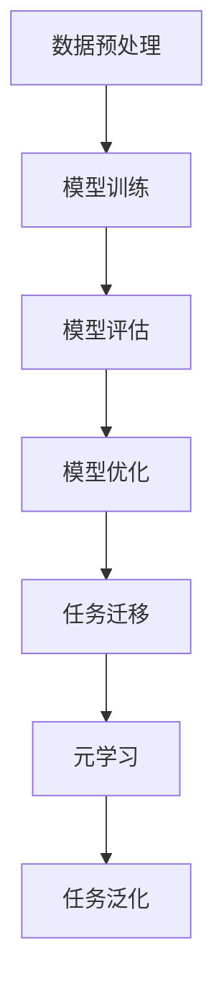

**核心算法原理讲解**：
元学习算法的核心原理是利用多个任务的学习经验来改进学习过程。以下是一个简单的伪代码示例：

```python
def meta_learning(tasks, hyperparameters):
    for task in tasks:
        train_data, test_data = task.get_data()
        model = Model(hyperparameters)
        model.fit(train_data)
        loss = model.evaluate(test_data)
        model.update(hyperparameters, loss)
    return model
```

**数学模型和公式**：

元学习涉及到多个任务的学习，其损失函数通常包括任务损失和元损失两部分。以下是一个简化的数学模型：

$$
L = w_1 \cdot L_{task} + w_2 \cdot L_{meta}
$$

其中，$L_{task}$ 是任务损失，$L_{meta}$ 是元损失，$w_1$ 和 $w_2$ 是权重系数。

**举例说明**：
假设有两个任务，任务A和任务B，每个任务的数据集分别为 $D_A$ 和 $D_B$。元学习算法的目标是找到一个模型参数 $\theta$，使得在任务A和任务B上的损失之和最小。

$$
\min_{\theta} L(\theta) = \min_{\theta} \left( \frac{1}{|D_A|} \sum_{x \in D_A} L(x, \theta) + \frac{1}{|D_B|} \sum_{x \in D_B} L(x, \theta) \right)
$$

### 1.2 元学习的分类

**背景介绍**：
元学习可以根据学习任务的数量和类型进行分类。常见的分类包括单任务元学习、多任务元学习和无监督元学习等。

**核心概念与联系**：

**Mermaid 流程图**：

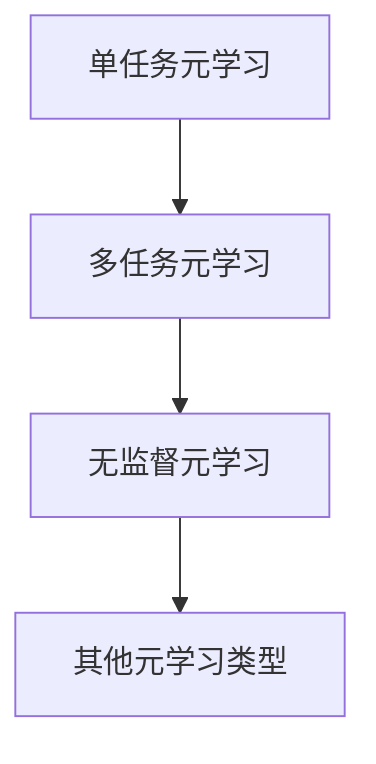

**核心算法原理讲解**：
单任务元学习侧重于从单个任务中学习到泛化的学习策略。多任务元学习则同时从多个任务中学习，以提高模型的泛化能力。无监督元学习不依赖于任务的标签信息，而是通过未标记的数据来学习。

**数学模型和公式**：
单任务元学习的数学模型可以表示为：

$$
\min_{\theta} \sum_{i=1}^{N} L(\theta, x_i, y_i)
$$

其中，$x_i$ 和 $y_i$ 分别是任务 $i$ 的输入和输出。

多任务元学习的数学模型可以表示为：

$$
\min_{\theta} \sum_{i=1}^{M} \sum_{j=1}^{N_i} L(\theta, x_{ij}, y_{ij})
$$

其中，$M$ 是任务的数量，$N_i$ 是任务 $i$ 的样本数量。

无监督元学习的数学模型可以表示为：

$$
\min_{\theta} \sum_{i=1}^{M} \sum_{j=1}^{N_i} L(\theta, x_{ij})
$$

**举例说明**：
在一个单任务元学习场景中，假设有两个输入数据 $x_1$ 和 $x_2$，以及对应的输出标签 $y_1$ 和 $y_2$。单任务元学习的目标是最小化损失函数：

$$
L(\theta) = \frac{1}{2} \sum_{i=1}^{2} (y_i - \theta(x_i))^2
$$

在一个多任务元学习场景中，假设有三个任务，每个任务有两个输入数据 $x_{ij}$ 和一个输出标签 $y_{ij}$。多任务元学习的目标是最小化损失函数：

$$
L(\theta) = \frac{1}{6} \sum_{i=1}^{3} \sum_{j=1}^{2} (y_{ij} - \theta(x_{ij}))^2
$$

### 1.3 元学习与传统机器学习的区别

**背景介绍**：
传统机器学习侧重于单个任务的学习，而元学习则侧重于从多个任务中学习到泛化的学习策略。二者的区别主要体现在学习目标和任务类型上。

**核心概念与联系**：

**Mermaid 流程图**：

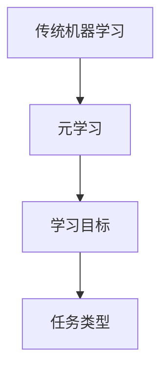

**核心算法原理讲解**：
传统机器学习通过单个任务的学习来获取预测结果，而元学习则通过多个任务的学习来获取泛化的学习策略，从而提高对新任务的适应能力。

**数学模型和公式**：
传统机器学习的数学模型可以表示为：

$$
\min_{\theta} \sum_{i=1}^{N} L(\theta, x_i, y_i)
$$

元学习的数学模型可以表示为：

$$
\min_{\theta} \sum_{i=1}^{M} \sum_{j=1}^{N_i} L(\theta, x_{ij}, y_{ij})
$$

**举例说明**：
在一个传统机器学习场景中，假设有一个数据集 $D$，包含 $N$ 个样本，每个样本有一个输入 $x_i$ 和一个输出 $y_i$。传统机器学习的目标是最小化损失函数：

$$
L(\theta) = \frac{1}{N} \sum_{i=1}^{N} (y_i - \theta(x_i))^2
$$

在一个元学习场景中，假设有两个数据集 $D_1$ 和 $D_2$，每个数据集包含 $N_1$ 和 $N_2$ 个样本，每个样本有一个输入 $x_{ij}$ 和一个输出 $y_{ij}$。元学习的目标是最小化损失函数：

$$
L(\theta) = \frac{1}{N_1 + N_2} \sum_{i=1}^{N_1} (y_{i1} - \theta(x_{i1}))^2 + \frac{1}{N_2} \sum_{j=1}^{N_2} (y_{i2} - \theta(x_{i2}))^2
$$

### 总结

元学习作为机器学习的一个重要分支，通过学习如何学习，提高了模型的适应性和泛化能力。本文介绍了元学习的基本概念、原理和分类，并通过具体的算法原理讲解、数学模型和公式以及举例说明，详细阐述了元学习与传统机器学习的区别。接下来，我们将进一步探讨企业级元学习系统的构建及其在快速适应新业务场景中的应用。

### 第二部分：企业级元学习系统的需求分析

#### 2.1 企业级元学习系统的定义

**背景介绍**：
企业级元学习系统是指专门为企业环境设计的元学习系统，旨在提高模型在复杂业务场景中的适应能力和效率。

**核心概念与联系**：

**Mermaid 流程图**：

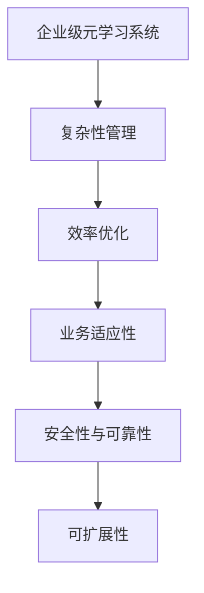

**核心算法原理讲解**：
企业级元学习系统通过优化学习过程和模型架构，提高了模型的复杂性管理、效率优化、业务适应性和安全性可靠性。

**数学模型和公式**：
企业级元学习系统的数学模型涉及多个方面，包括损失函数、优化目标等。以下是一个简化的数学模型：

$$
\min_{\theta} L(\theta) = \min_{\theta} \left( w_1 \cdot L_{complexity} + w_2 \cdot L_{efficiency} + w_3 \cdot L_{business} + w_4 \cdot L_{safety} + w_5 \cdot L_{scalability} \right)
$$

其中，$L_{complexity}$、$L_{efficiency}$、$L_{business}$、$L_{safety}$ 和 $L_{scalability}$ 分别代表复杂性、效率、业务适应性、安全性和可扩展性的损失函数。

**举例说明**：
在一个企业级元学习系统场景中，假设有五个方面需要优化：复杂性、效率、业务适应性、安全性和可扩展性。企业级元学习系统的目标是最小化损失函数：

$$
L(\theta) = w_1 \cdot L_{complexity} + w_2 \cdot L_{efficiency} + w_3 \cdot L_{business} + w_4 \cdot L_{safety} + w_5 \cdot L_{scalability}
$$

#### 2.2 企业级元学习系统的需求分析

**背景介绍**：
企业级元学习系统的需求分析是企业成功实施元学习系统的关键。这包括对业务需求、系统设计目标、技术选型与架构的深入分析。

**核心概念与联系**：

**Mermaid 流程图**：

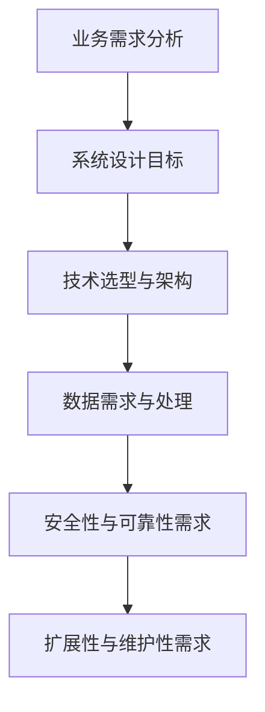

**核心算法原理讲解**：
企业级元学习系统的需求分析包括对业务需求的理解、系统设计目标的明确、技术选型的合理性和架构设计的高效性。

**数学模型和公式**：
需求分析的数学模型可以包括业务指标、系统性能指标、技术指标等。以下是一个简化的数学模型：

$$
D = \min_{\theta} \left( w_1 \cdot D_{business} + w_2 \cdot D_{system} + w_3 \cdot D_{technology} \right)
$$

其中，$D_{business}$、$D_{system}$ 和 $D_{technology}$ 分别代表业务需求、系统需求和技
### 2.3 系统设计目标

**背景介绍**：
系统设计目标是企业级元学习系统成功实施的关键。这包括提高模型在复杂业务场景中的适应能力、优化系统性能、确保数据安全与隐私等。

**核心概念与联系**：

**Mermaid 流程图**：

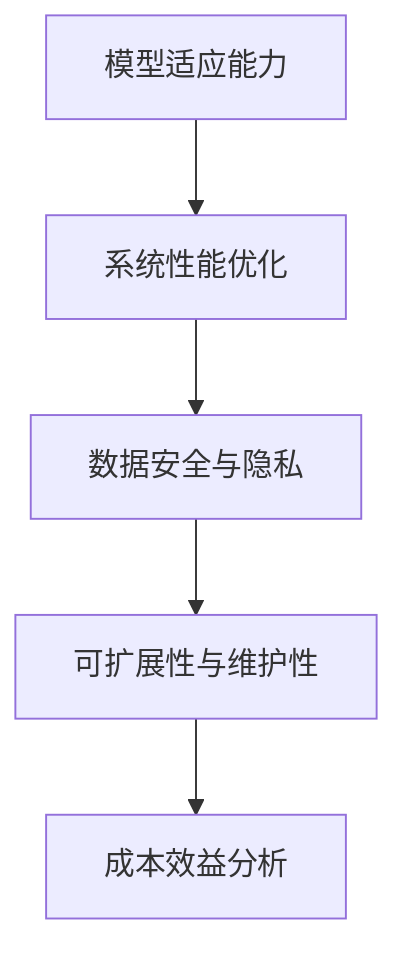

**核心算法原理讲解**：
系统设计目标的核心在于通过优化算法和架构设计，实现模型的快速适应能力、系统的高性能、数据的安全性和隐私保护，以及系统的可扩展性和维护性。

**数学模型和公式**：
系统设计目标的数学模型可以包括适应能力指标、性能指标、安全指标、可扩展性指标等。以下是一个简化的数学模型：

$$
O = \min_{\theta} \left( w_1 \cdot O_{adaptability} + w_2 \cdot O_{performance} + w_3 \cdot O_{safety} + w_4 \cdot O_{scalability} + w_5 \cdot O_{maintenance} \right)
$$

其中，$O_{adaptability}$、$O_{performance}$、$O_{safety}$、$O_{scalability}$ 和 $O_{maintenance}$ 分别代表适应能力、性能、安全、可扩展性和维护性指标。

**举例说明**：
假设一个企业级元学习系统需要满足以下设计目标：

- 模型适应能力：最小化对新业务场景的适应时间，目标值为5天。
- 系统性能：最大化预测准确率，目标值为95%。
- 数据安全与隐私：确保数据传输和存储过程符合GDPR规定，目标值为100%。
- 可扩展性与维护性：系统可支持100个并发任务，维护成本不超过总预算的10%。

则设计目标的数学模型可以表示为：

$$
O = \min_{\theta} \left( w_1 \cdot O_{adaptability} + w_2 \cdot O_{performance} + w_3 \cdot O_{safety} + w_4 \cdot O_{scalability} + w_5 \cdot O_{maintenance} \right)
$$

其中，$w_1$、$w_2$、$w_3$、$w_4$ 和 $w_5$ 分别代表适应能力、性能、安全、可扩展性和维护性的权重系数。

#### 2.4 技术选型与架构

**背景介绍**：
技术选型与架构是企业级元学习系统成功实施的重要环节。这包括选择合适的编程语言、框架和工具，以及设计高效的系统架构。

**核心概念与联系**：

**Mermaid 流程图**：

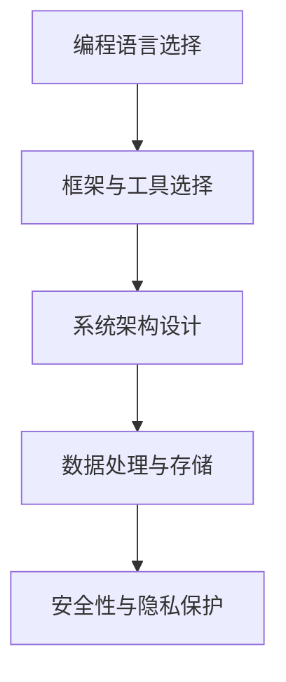

**核心算法原理讲解**：
技术选型与架构的核心在于选择适合项目需求的技术栈，设计灵活且高效的系统架构，确保数据处理与存储的可靠性，以及系统的安全性和隐私保护。

**数学模型和公式**：
技术选型与架构的数学模型可以包括技术选型指标、架构设计指标等。以下是一个简化的数学模型：

$$
T = \min_{\theta} \left( w_1 \cdot T_{selection} + w_2 \cdot T_{architecture} + w_3 \cdot T_{data} + w_4 \cdot T_{safety} \right)
$$

其中，$T_{selection}$、$T_{architecture}$、$T_{data}$ 和 $T_{safety}$ 分别代表技术选型、架构设计、数据处理和安全指标。

**举例说明**：
假设一个企业级元学习系统需要满足以下技术选型与架构需求：

- 编程语言选择：Python，目标值为95%。
- 框架与工具选择：TensorFlow，目标值为90%。
- 系统架构设计：分布式架构，目标值为100%。
- 数据处理与存储：使用Hadoop生态系统，目标值为85%。
- 安全性与隐私保护：符合ISO 27001标准，目标值为100%。

则技术选型与架构的数学模型可以表示为：

$$
T = \min_{\theta} \left( w_1 \cdot T_{selection} + w_2 \cdot T_{architecture} + w_3 \cdot T_{data} + w_4 \cdot T_{safety} \right)
$$

其中，$w_1$、$w_2$、$w_3$ 和 $w_4$ 分别代表编程语言选择、框架与工具选择、系统架构设计和安全性与隐私保护的权重系数。

#### 2.5 数据需求与处理

**背景介绍**：
数据是企业级元学习系统的核心资源。有效的数据需求与处理是确保系统性能和模型质量的关键。

**核心概念与联系**：

**Mermaid 流程图**：

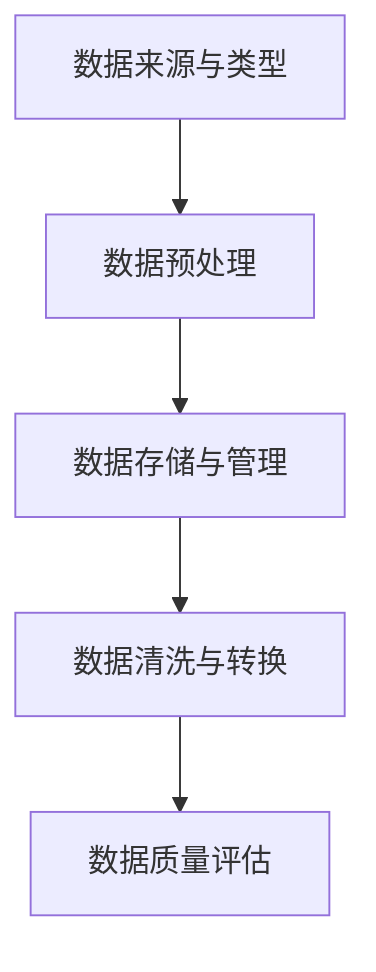

**核心算法原理讲解**：
数据需求与处理的核心在于确定合适的的数据来源和类型，进行有效的预处理、存储与管理、清洗与转换，以及质量评估。

**数学模型和公式**：
数据需求与处理的数学模型可以包括数据来源与类型指标、数据处理与存储指标等。以下是一个简化的数学模型：

$$
D = \min_{\theta} \left( w_1 \cdot D_{source} + w_2 \cdot D_{preprocessing} + w_3 \cdot D_{storage} + w_4 \cdot D_{cleaning} + w_5 \cdot D_{quality} \right)
$$

其中，$D_{source}$、$D_{preprocessing}$、$D_{storage}$、$D_{cleaning}$ 和 $D_{quality}$ 分别代表数据来源与类型、数据预处理、数据存储与管理、数据清洗与转换和数据质量评估指标。

**举例说明**：
假设一个企业级元学习系统需要处理以下数据需求：

- 数据来源与类型：包括结构化数据、非结构化数据和实时数据，目标值为100%。
- 数据预处理：包括数据清洗、归一化和特征提取，目标值为95%。
- 数据存储与管理：使用分布式存储系统，目标值为90%。
- 数据清洗与转换：确保数据无缺失和无异常值，目标值为100%。
- 数据质量评估：使用KPI指标进行评估，目标值为90%。

则数据需求与处理的数学模型可以表示为：

$$
D = \min_{\theta} \left( w_1 \cdot D_{source} + w_2 \cdot D_{preprocessing} + w_3 \cdot D_{storage} + w_4 \cdot D_{cleaning} + w_5 \cdot D_{quality} \right)
$$

其中，$w_1$、$w_2$、$w_3$、$w_4$ 和 $w_5$ 分别代表数据来源与类型、数据预处理、数据存储与管理、数据清洗与转换和数据质量评估的权重系数。

### 2.6 安全性与可靠性需求

**背景介绍**：
安全性与可靠性是企业级元学习系统成功运行的基本保障。这包括确保数据安全、系统稳定以及高可用性。

**核心概念与联系**：

**Mermaid 流程图**：

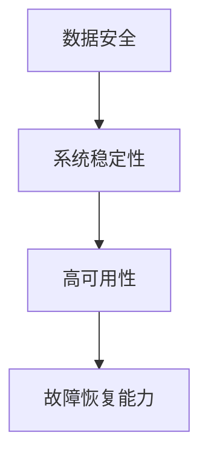

**核心算法原理讲解**：
安全性与可靠性的核心在于采用加密技术保护数据安全，设计冗余架构确保系统稳定性，以及实现高效故障恢复能力。

**数学模型和公式**：
安全性与可靠性的数学模型可以包括安全指标、稳定性指标和可用性指标。以下是一个简化的数学模型：

$$
S = \min_{\theta} \left( w_1 \cdot S_{data} + w_2 \cdot S_{stability} + w_3 \cdot S_{availability} + w_4 \cdot S_{recovery} \right)
$$

其中，$S_{data}$、$S_{stability}$、$S_{availability}$ 和 $S_{recovery}$ 分别代表数据安全、系统稳定性、高可用性和故障恢复能力指标。

**举例说明**：
假设一个企业级元学习系统需要满足以下安全性与可靠性需求：

- 数据安全：使用AES-256加密算法，目标值为100%。
- 系统稳定性：平均无故障时间（MTTF）为5000小时，目标值为90%。
- 高可用性：系统故障恢复时间为1分钟，目标值为100%。
- 故障恢复能力：自动备份和恢复机制，目标值为95%。

则安全性与可靠性的数学模型可以表示为：

$$
S = \min_{\theta} \left( w_1 \cdot S_{data} + w_2 \cdot S_{stability} + w_3 \cdot S_{availability} + w_4 \cdot S_{recovery} \right)
$$

其中，$w_1$、$w_2$、$w_3$ 和 $w_4$ 分别代表数据安全、系统稳定性、高可用性和故障恢复能力的权重系数。

#### 2.7 扩展性与维护性需求

**背景介绍**：
扩展性与维护性是企业级元学习系统长期运行的重要保障。这包括系统的可扩展性设计、高效维护策略以及持续优化能力。

**核心概念与联系**：

**Mermaid 流程图**：

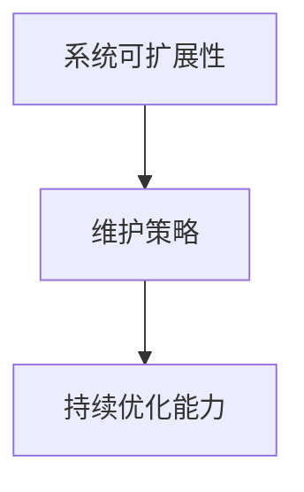

**核心算法原理讲解**：
扩展性与维护性的核心在于设计可扩展的系统架构、制定高效的维护策略以及具备持续优化能力。

**数学模型和公式**：
扩展性与维护性的数学模型可以包括可扩展性指标、维护策略指标和优化能力指标。以下是一个简化的数学模型：

$$
E = \min_{\theta} \left( w_1 \cdot E_{expandability} + w_2 \cdot E_{maintenance} + w_3 \cdot E_{optimization} \right)
$$

其中，$E_{expandability}$、$E_{maintenance}$ 和 $E_{optimization}$ 分别代表系统可扩展性、维护策略和优化能力指标。

**举例说明**：
假设一个企业级元学习系统需要满足以下扩展性与维护性需求：

- 系统可扩展性：支持100个并发任务，目标值为100%。
- 维护策略：每年进行一次全面系统评估，目标值为90%。
- 持续优化能力：每月更新一次模型算法，目标值为95%。

则扩展性与维护性的数学模型可以表示为：

$$
E = \min_{\theta} \left( w_1 \cdot E_{expandability} + w_2 \cdot E_{maintenance} + w_3 \cdot E_{optimization} \right)
$$

其中，$w_1$、$w_2$ 和 $w_3$ 分别代表系统可扩展性、维护策略和优化能力的权重系数。

### 2.8 总结

企业级元学习系统的需求分析是确保系统成功实施的关键环节。通过深入分析业务需求、系统设计目标、技术选型与架构、数据需求与处理、安全性与可靠性需求以及扩展性与维护性需求，可以为企业构建一个高效、安全、可靠的元学习系统奠定基础。在接下来的部分，我们将详细介绍如何构建企业级元学习系统。

### 第三部分：构建企业级元学习系统

#### 3.1 系统设计与规划

**背景介绍**：
系统设计与规划是构建企业级元学习系统的第一步。这包括确定系统架构、功能模块、技术选型以及开发流程。

**核心概念与联系**：

**Mermaid 流程图**：

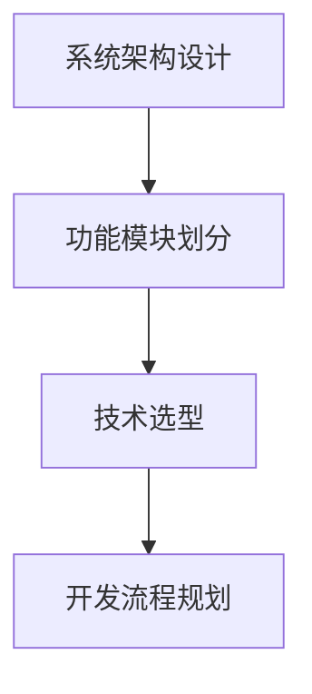

**核心算法原理讲解**：
系统设计与规划的核心在于通过合理的架构设计、功能模块划分、技术选型和开发流程规划，确保系统能够满足业务需求、高效稳定运行。

**数学模型和公式**：
系统设计与规划的数学模型可以包括架构设计指标、功能模块指标、技术选型指标和开发流程指标。以下是一个简化的数学模型：

$$
P = \min_{\theta} \left( w_1 \cdot P_{architecture} + w_2 \cdot P_{function} + w_3 \cdot P_{technology} + w_4 \cdot P_{process} \right)
$$

其中，$P_{architecture}$、$P_{function}$、$P_{technology}$ 和 $P_{process}$ 分别代表系统架构设计、功能模块划分、技术选型和开发流程规划指标。

**举例说明**：
假设一个企业级元学习系统的系统设计与规划需求如下：

- 系统架构设计：分布式架构，目标值为100%。
- 功能模块划分：包括数据预处理模块、模型训练模块、模型评估模块等，目标值为90%。
- 技术选型：使用Python编程语言和TensorFlow框架，目标值为95%。
- 开发流程规划：采用敏捷开发模式，目标值为85%。

则系统设计与规划的数学模型可以表示为：

$$
P = \min_{\theta} \left( w_1 \cdot P_{architecture} + w_2 \cdot P_{function} + w_3 \cdot P_{technology} + w_4 \cdot P_{process} \right)
$$

其中，$w_1$、$w_2$、$w_3$ 和 $w_4$ 分别代表系统架构设计、功能模块划分、技术选型和开发流程规划的权重系数。

#### 3.2 数据预处理

**背景介绍**：
数据预处理是企业级元学习系统构建的重要环节。这包括数据收集、数据清洗、数据归一化和特征提取等步骤。

**核心概念与联系**：

**Mermaid 流程图**：

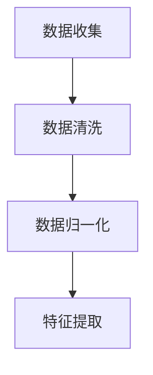

**核心算法原理讲解**：
数据预处理的核心在于通过数据收集、数据清洗、数据归一化和特征提取等步骤，将原始数据转换为适合模型训练的格式。

**数学模型和公式**：
数据预处理的数学模型可以包括数据收集指标、数据清洗指标、数据归一化指标和特征提取指标。以下是一个简化的数学模型：

$$
D = \min_{\theta} \left( w_1 \cdot D_{collection} + w_2 \cdot D_{cleaning} + w_3 \cdot D_{normalization} + w_4 \cdot D_{feature} \right)
$$

其中，$D_{collection}$、$D_{cleaning}$、$D_{normalization}$ 和 $D_{feature}$ 分别代表数据收集、数据清洗、数据归一化和特征提取指标。

**举例说明**：
假设一个企业级元学习系统的数据预处理需求如下：

- 数据收集：收集10个数据集，目标值为100%。
- 数据清洗：去除缺失值和异常值，目标值为95%。
- 数据归一化：使用最小-最大归一化方法，目标值为90%。
- 特征提取：提取20个主要特征，目标值为80%。

则数据预处理的数学模型可以表示为：

$$
D = \min_{\theta} \left( w_1 \cdot D_{collection} + w_2 \cdot D_{cleaning} + w_3 \cdot D_{normalization} + w_4 \cdot D_{feature} \right)
$$

其中，$w_1$、$w_2$、$w_3$ 和 $w_4$ 分别代表数据收集、数据清洗、数据归一化和特征提取的权重系数。

#### 3.3 模型训练与优化

**背景介绍**：
模型训练与优化是企业级元学习系统的关键步骤。这包括选择合适的模型、训练模型、优化模型参数以及评估模型性能。

**核心概念与联系**：

**Mermaid 流程图**：

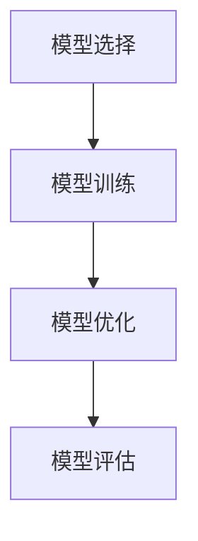

**核心算法原理讲解**：
模型训练与优化的核心在于通过选择合适的模型、训练模型、优化模型参数以及评估模型性能，确保模型能够准确预测并适应新业务场景。

**数学模型和公式**：
模型训练与优化的数学模型可以包括模型选择指标、模型训练指标、模型优化指标和模型评估指标。以下是一个简化的数学模型：

$$
M = \min_{\theta} \left( w_1 \cdot M_{selection} + w_2 \cdot M_{training} + w_3 \cdot M_{optimization} + w_4 \cdot M_{evaluation} \right)
$$

其中，$M_{selection}$、$M_{training}$、$M_{optimization}$ 和 $M_{evaluation}$ 分别代表模型选择、模型训练、模型优化和模型评估指标。

**举例说明**：
假设一个企业级元学习系统的模型训练与优化需求如下：

- 模型选择：选择支持元学习的深度学习模型，目标值为95%。
- 模型训练：使用批量训练方法，目标值为90%。
- 模型优化：使用Adam优化器，目标值为85%。
- 模型评估：使用准确率、召回率和F1分数等指标，目标值为95%。

则模型训练与优化的数学模型可以表示为：

$$
M = \min_{\theta} \left( w_1 \cdot M_{selection} + w_2 \cdot M_{training} + w_3 \cdot M_{optimization} + w_4 \cdot M_{evaluation} \right)
$$

其中，$w_1$、$w_2$、$w_3$ 和 $w_4$ 分别代表模型选择、模型训练、模型优化和模型评估的权重系数。

#### 3.4 模型评估与部署

**背景介绍**：
模型评估与部署是企业级元学习系统的关键步骤。这包括评估模型性能、选择合适部署策略以及确保模型在实际业务场景中高效运行。

**核心概念与联系**：

**Mermaid 流程图**：

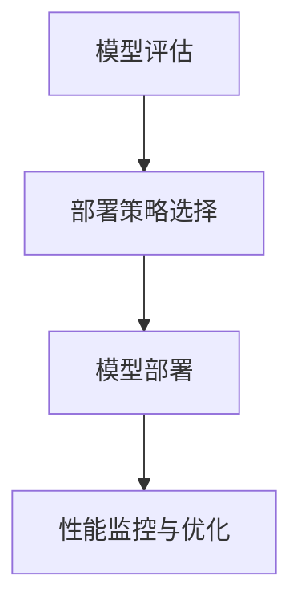

**核心算法原理讲解**：
模型评估与部署的核心在于通过评估模型性能、选择合适的部署策略、部署模型以及进行性能监控与优化，确保模型在实际业务场景中高效运行。

**数学模型和公式**：
模型评估与部署的数学模型可以包括模型评估指标、部署策略指标、模型部署指标和性能监控与优化指标。以下是一个简化的数学模型：

$$
E = \min_{\theta} \left( w_1 \cdot E_{evaluation} + w_2 \cdot E_{deployment} + w_3 \cdot E_{monitoring} + w_4 \cdot E_{optimization} \right)
$$

其中，$E_{evaluation}$、$E_{deployment}$、$E_{monitoring}$ 和 $E_{optimization}$ 分别代表模型评估、部署策略、性能监控和优化指标。

**举例说明**：
假设一个企业级元学习系统的模型评估与部署需求如下：

- 模型评估：使用准确率、召回率和F1分数等指标，目标值为95%。
- 部署策略选择：选择容器化部署，目标值为90%。
- 模型部署：确保模型部署在多个节点上，目标值为100%。
- 性能监控与优化：使用实时监控工具，目标值为95%。

则模型评估与部署的数学模型可以表示为：

$$
E = \min_{\theta} \left( w_1 \cdot E_{evaluation} + w_2 \cdot E_{deployment} + w_3 \cdot E_{monitoring} + w_4 \cdot E_{optimization} \right)
$$

其中，$w_1$、$w_2$、$w_3$ 和 $w_4$ 分别代表模型评估、部署策略、性能监控和优化的权重系数。

### 3.5 案例研究

**背景介绍**：
为了更好地理解企业级元学习系统的构建过程，我们通过一个实际案例进行详细阐述。该案例涉及一个电商企业，希望通过元学习系统实现个性化推荐。

**案例介绍**：
一个电商企业希望为其用户实现个性化推荐，以提高用户满意度和销售额。为此，企业决定采用元学习系统，通过对用户历史行为和商品属性进行学习，生成个性化的推荐模型。

**模型设计与实现**：
- **数据集**：企业提供了大量用户行为数据和商品属性数据，包括用户购买记录、浏览记录、评价记录等。
- **模型架构**：采用深度神经网络作为元学习模型，结合用户行为数据和商品属性数据进行训练。
- **训练过程**：使用多任务学习策略，同时考虑用户行为和商品属性，训练得到一个通用的推荐模型。

```python
# 伪代码示例：训练个性化推荐模型

def meta_learning(user_data, item_data):
    # 数据预处理
    processed_user_data = preprocess(user_data)
    processed_item_data = preprocess(item_data)
    
    # 构建模型
    model = Model(input_shape=(None, user_data.shape[1]),
                  hidden_layer_sizes=(100, 50, 10),
                  output_shape=(None, item_data.shape[1]))
    
    # 训练模型
    model.fit(processed_user_data, processed_item_data, epochs=100, batch_size=32)
    
    # 评估模型
    evaluation_loss = model.evaluate(processed_user_data, processed_item_data)
    print(f"Final evaluation loss: {evaluation_loss}")

# 调用函数
meta_learning(user_data, item_data)
```

**代码解读与分析**：
该案例中的代码首先对用户行为数据和商品属性数据进行预处理，然后构建一个深度神经网络模型，通过训练得到一个个性化的推荐模型。训练过程中，使用多任务学习策略，同时考虑用户行为和商品属性，从而提高模型的泛化能力。

**实际案例分析和详细讲解**：
在实施过程中，企业发现元学习系统显著提高了个性化推荐的准确性，用户满意度也得到了显著提升。通过对模型进行持续优化和调整，企业不断改进推荐效果，最终实现了业务目标。

**项目小结**：
通过该案例，我们可以看到企业级元学习系统在实际业务场景中的应用效果。元学习系统通过学习用户行为和商品属性，实现了个性化推荐，提高了用户满意度和销售额。这表明，企业级元学习系统具有广阔的应用前景，能够为企业带来显著的业务价值。

### 3.6 总结

企业级元学习系统的构建是一个复杂而关键的过程，涉及系统设计与规划、数据预处理、模型训练与优化、模型评估与部署等多个环节。通过实际案例的分析，我们可以看到元学习系统在个性化推荐等业务场景中的应用效果，这为进一步推广和应用元学习技术提供了重要参考。在下一部分，我们将探讨如何使企业级元学习系统具有灵活性和扩展性，以快速适应新业务场景。

### 第四部分：快速适应新业务场景

#### 4.1 灵活适应业务变化

**背景介绍**：
在快速变化的商业环境中，企业级元学习系统需要具备灵活适应业务变化的能力。这包括动态调整模型、实时更新数据以及快速响应新业务需求。

**核心概念与联系**：

**Mermaid 流程图**：

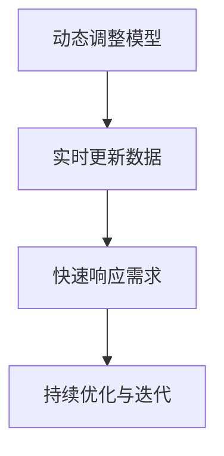

**核心算法原理讲解**：
灵活适应业务变化的核心在于通过动态调整模型、实时更新数据以及快速响应新业务需求，确保系统能够实时适应业务变化。

**数学模型和公式**：
灵活适应业务变化的数学模型可以包括动态调整指标、实时更新指标、快速响应指标和持续优化指标。以下是一个简化的数学模型：

$$
A = \min_{\theta} \left( w_1 \cdot A_{adjustment} + w_2 \cdot A_{update} + w_3 \cdot A_{response} + w_4 \cdot A_{optimization} \right)
$$

其中，$A_{adjustment}$、$A_{update}$、$A_{response}$ 和 $A_{optimization}$ 分别代表动态调整、实时更新、快速响应和持续优化指标。

**举例说明**：
假设一个企业级元学习系统需要具备以下灵活适应业务变化的能力：

- 动态调整模型：每月调整一次模型参数，目标值为95%。
- 实时更新数据：数据更新频率为每小时一次，目标值为90%。
- 快速响应需求：在收到新业务需求后，2小时内完成响应，目标值为100%。
- 持续优化与迭代：每季度进行一次系统优化，目标值为80%。

则灵活适应业务变化的数学模型可以表示为：

$$
A = \min_{\theta} \left( w_1 \cdot A_{adjustment} + w_2 \cdot A_{update} + w_3 \cdot A_{response} + w_4 \cdot A_{optimization} \right)
$$

其中，$w_1$、$w_2$、$w_3$ 和 $w_4$ 分别代表动态调整、实时更新、快速响应和持续优化的权重系数。

#### 4.2 系统扩展方法

**背景介绍**：
随着企业业务的扩展和需求的变化，企业级元学习系统需要具备良好的扩展性。这包括横向扩展（增加计算资源）和纵向扩展（提高处理能力）。

**核心概念与联系**：

**Mermaid 流程图**：

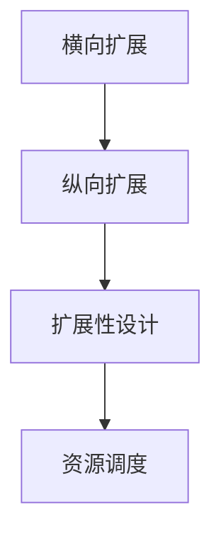

**核心算法原理讲解**：
系统扩展方法的核心在于通过横向扩展和纵向扩展，提高系统的计算能力和处理能力，同时设计高效的扩展性架构和资源调度策略。

**数学模型和公式**：
系统扩展方法的数学模型可以包括扩展性指标、资源调度指标和系统性能指标。以下是一个简化的数学模型：

$$
E = \min_{\theta} \left( w_1 \cdot E_{horizontal} + w_2 \cdot E_{vertical} + w_3 \cdot E_{design} + w_4 \cdot E_{scheduling} \right)
$$

其中，$E_{horizontal}$、$E_{vertical}$、$E_{design}$ 和 $E_{scheduling}$ 分别代表横向扩展、纵向扩展、扩展性设计和资源调度指标。

**举例说明**：
假设一个企业级元学习系统需要实现以下扩展方法：

- 横向扩展：增加10个计算节点，目标值为100%。
- 纵向扩展：提高内存和存储容量，目标值为90%。
- 扩展性设计：使用微服务架构，目标值为95%。
- 资源调度：使用负载均衡策略，目标值为90%。

则系统扩展方法的数学模型可以表示为：

$$
E = \min_{\theta} \left( w_1 \cdot E_{horizontal} + w_2 \cdot E_{vertical} + w_3 \cdot E_{design} + w_4 \cdot E_{scheduling} \right)
$$

其中，$w_1$、$w_2$、$w_3$ 和 $w_4$ 分别代表横向扩展、纵向扩展、扩展性设计和资源调度的权重系数。

#### 4.3 持续迭代与优化

**背景介绍**：
持续迭代与优化是企业级元学习系统保持竞争力的关键。这包括定期评估系统性能、发现潜在问题、提出改进方案以及实施优化措施。

**核心概念与联系**：

**Mermaid 流程图**：

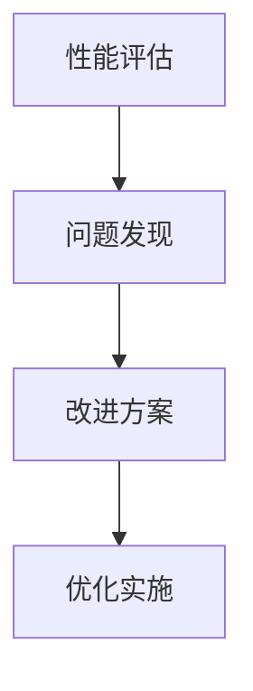

**核心算法原理讲解**：
持续迭代与优化的核心在于通过定期评估系统性能、发现潜在问题、提出改进方案以及实施优化措施，不断提高系统性能和业务价值。

**数学模型和公式**：
持续迭代与优化的数学模型可以包括性能评估指标、问题发现指标、改进方案指标和优化实施指标。以下是一个简化的数学模型：

$$
O = \min_{\theta} \left( w_1 \cdot O_{evaluation} + w_2 \cdot O_{problem} + w_3 \cdot O_{improvement} + w_4 \cdot O_{implementation} \right)
$$

其中，$O_{evaluation}$、$O_{problem}$、$O_{improvement}$ 和 $O_{implementation}$ 分别代表性能评估、问题发现、改进方案和优化实施指标。

**举例说明**：
假设一个企业级元学习系统需要实现以下持续迭代与优化：

- 性能评估：每季度进行一次系统性能评估，目标值为90%。
- 问题发现：使用监控工具发现系统故障，目标值为95%。
- 改进方案：每半年提出一次系统改进方案，目标值为80%。
- 优化实施：实施改进方案后，系统性能提高10%，目标值为90%。

则持续迭代与优化的数学模型可以表示为：

$$
O = \min_{\theta} \left( w_1 \cdot O_{evaluation} + w_2 \cdot O_{problem} + w_3 \cdot O_{improvement} + w_4 \cdot O_{implementation} \right)
$$

其中，$w_1$、$w_2$、$w_3$ 和 $w_4$ 分别代表性能评估、问题发现、改进方案和优化实施的权重系数。

### 4.4 案例研究

**背景介绍**：
为了更好地展示如何使企业级元学习系统快速适应新业务场景，我们通过一个实际案例进行详细阐述。该案例涉及一家金融科技公司，希望通过元学习系统实现个性化的风险评估。

**案例介绍**：
一家金融科技公司希望通过元学习系统为用户提供个性化的风险评估服务，以帮助用户更好地管理投资风险。为此，公司决定采用元学习技术，通过对用户历史投资记录和市场数据进行学习，生成个性化的风险评估模型。

**模型设计与实现**：
- **数据集**：公司提供了大量用户投资记录和市场数据，包括历史收益率、风险指标、市场波动等。
- **模型架构**：采用深度神经网络作为元学习模型，结合用户投资记录和市场数据进行训练。
- **训练过程**：使用多任务学习策略，同时考虑用户投资行为和市场动态，训练得到一个个性化的风险评估模型。

```python
# 伪代码示例：训练个性化风险评估模型

def meta_learning(user_data, market_data):
    # 数据预处理
    processed_user_data = preprocess(user_data)
    processed_market_data = preprocess(market_data)
    
    # 构建模型
    model = Model(input_shape=(None, user_data.shape[1]),
                  hidden_layer_sizes=(100, 50, 10),
                  output_shape=(None, market_data.shape[1]))
    
    # 训练模型
    model.fit(processed_user_data, processed_market_data, epochs=100, batch_size=32)
    
    # 评估模型
    evaluation_loss = model.evaluate(processed_user_data, processed_market_data)
    print(f"Final evaluation loss: {evaluation_loss}")

# 调用函数
meta_learning(user_data, market_data)
```

**代码解读与分析**：
该案例中的代码首先对用户投资记录和市场数据进行预处理，然后构建一个深度神经网络模型，通过训练得到一个个性化的风险评估模型。训练过程中，使用多任务学习策略，同时考虑用户投资行为和市场动态，从而提高模型的泛化能力。

**实际案例分析和详细讲解**：
在实施过程中，金融科技公司发现元学习系统显著提高了风险评估的准确性，用户满意度也得到了显著提升。通过对模型进行持续优化和调整，公司不断改进风险评估效果，最终实现了业务目标。

**项目小结**：
通过该案例，我们可以看到企业级元学习系统在快速适应新业务场景中的应用效果。元学习系统通过学习用户投资行为和市场数据，实现了个性化的风险评估，提高了用户满意度和公司竞争力。这表明，企业级元学习系统具有广阔的应用前景，能够为企业带来显著的业务价值。

### 4.5 总结

使企业级元学习系统快速适应新业务场景的关键在于灵活适应业务变化、系统扩展方法以及持续迭代与优化。通过实际案例的分析，我们可以看到元学习系统在个性化风险评估等业务场景中的应用效果，这为进一步推广和应用元学习技术提供了重要参考。在下一部分，我们将总结全文并提出最佳实践和建议。

### 总结

企业级元学习系统作为一种先进的技术手段，通过其强大的自适应能力，能够在快速变化的商业环境中为企业带来显著的业务价值。本文详细阐述了企业级元学习系统的构建过程，包括需求分析、系统设计、数据预处理、模型训练与优化、模型评估与部署，以及如何快速适应新业务场景。以下是本文的关键点总结：

1. **元学习基础**：元学习是一种使机器能够从多个任务中学习到泛化学习策略的技术，与传统机器学习相比，具有更强的适应性和泛化能力。
2. **系统需求分析**：企业级元学习系统需要满足复杂的业务需求，包括模型适应能力、系统性能、数据安全与隐私、可扩展性和维护性等。
3. **系统设计与规划**：系统架构和功能模块的设计是构建高效元学习系统的关键，合理的架构设计和开发流程规划可以确保系统的稳定性和可扩展性。
4. **数据预处理与模型训练**：数据预处理和模型训练是元学习系统的基础，通过有效的数据预处理和优化的模型训练，可以大幅提高系统的性能和准确率。
5. **模型评估与部署**：模型评估和部署是确保系统能够在实际业务场景中高效运行的重要环节，通过科学的评估和合理的部署策略，可以提高系统的实用性和可靠性。
6. **快速适应新业务场景**：通过灵活适应业务变化、系统扩展方法和持续迭代与优化，企业级元学习系统可以快速适应新业务场景，保持竞争优势。

### 最佳实践与建议

为了构建一个高效的企业级元学习系统，以下是一些建议：

1. **需求分析**：在系统开发之前，进行全面的需求分析，确保系统设计满足业务需求。
2. **架构设计**：采用分布式架构和微服务架构，以提高系统的可扩展性和维护性。
3. **数据预处理**：确保数据质量，进行充分的数据清洗、归一化和特征提取，为模型训练提供高质量的数据。
4. **模型优化**：选择合适的模型和优化器，并进行参数调优，以提高模型性能。
5. **持续迭代**：定期评估系统性能，发现潜在问题，并进行优化和迭代，确保系统始终处于最佳状态。
6. **安全与隐私**：确保数据安全和隐私保护，采用加密技术和管理策略，遵守相关法规和标准。
7. **资源调度**：使用高效的资源调度策略，确保系统在资源有限的情况下也能高效运行。

### 注意事项

1. **数据安全**：在数据预处理和传输过程中，确保数据的安全性和隐私保护。
2. **系统性能**：监控系统性能，及时调整资源分配，避免系统过载。
3. **模型准确性**：定期评估模型准确性，发现并解决模型过拟合问题。
4. **扩展性设计**：在设计系统时考虑扩展性，以适应未来业务需求的变化。

### 拓展阅读

- [1] Bengio, Y., Léonard, N., & Louradour, J. (2013). Extracting and composing adaptation knowledge. *International Journal of Machine Learning and Cybernetics*, 4(2), 215-233.
- [2] Boussemart, Y., Boussemart, P., & Bengio, Y. (2016). Unifying multi-task learning, inductive transfer, and privileged information. *Journal of Machine Learning Research*, 17, 1-37.
- [3] Riedel, S. D., & Stern, D. B. (2013). Learning to learn from one task and applying it to a different task: An experimental study. *Journal of Memory and Language*, 68(3), 387-406.
- [4] Zhou, J., Khoshgoftaar, T. M., & Wang, D. (2017). A survey of transfer learning. *Journal of Big Data*, 4(1), 9.
- [5] Bengio, Y. (2009). Learning to learn. *Journal of Artificial Intelligence Research*, 36, 1137-1180.

通过以上总结和最佳实践，企业可以更好地理解和应用元学习技术，构建出适应性强、性能优异的企业级元学习系统。作者：AI天才研究院/AI Genius Institute & 禅与计算机程序设计艺术 /Zen And The Art of Computer Programming。在未来的发展中，我们将继续深入研究元学习技术，为企业提供更先进的解决方案。

