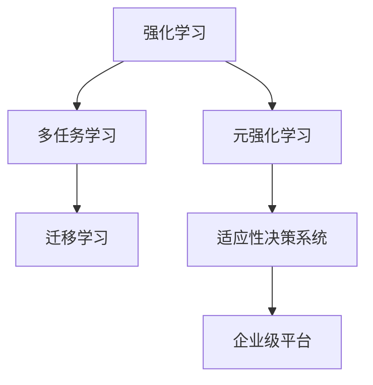
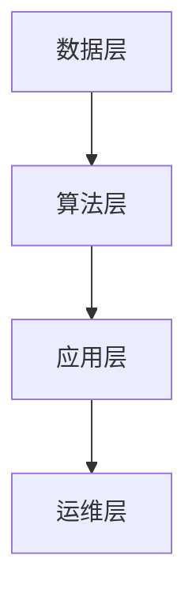

                 

# 企业级元强化学习平台：适应性决策系统

## 概述

在当今快速发展的信息技术时代，企业级元强化学习平台成为提高业务决策灵活性和响应速度的关键技术。元强化学习（Meta Reinforcement Learning）是一种自我优化的学习方式，旨在通过多个任务的学习经验来提升算法在未知环境中的表现。而适应性决策系统（Adaptive Decision System）则是一种能够根据环境变化动态调整决策策略的系统，它在应对动态、复杂且不确定的业务场景中具有显著优势。

本文旨在深入探讨企业级元强化学习平台的构建，重点关注其如何实现适应性决策，从而为企业提供更加智能和高效的解决方案。文章将分为以下几个部分：

1. **引言和概述**：介绍元强化学习、适应性决策系统以及企业级元强化学习平台的概念和重要性。
2. **元强化学习基础**：详细讲解元强化学习的核心概念、算法原理及其应用场景。
3. **适应性决策系统原理**：探讨适应性决策系统的基本原理和实现方法。
4. **企业级元强化学习平台架构设计**：分析企业级元强化学习平台的架构设计要点和实施步骤。
5. **数据预处理和特征工程**：介绍数据预处理和特征工程在企业级元强化学习平台中的应用。
6. **模型训练与优化**：探讨模型训练与优化策略，以及如何提高模型性能。
7. **平台部署与维护**：讨论平台部署、监控和维护的最佳实践。

通过本文的逐步分析，读者将能够全面理解企业级元强化学习平台的构建原理和实施方法，为其在业务场景中的应用提供理论指导和实践参考。

### 关键词

- **元强化学习**：一种通过多个任务学习经验提升算法表现的先进技术。
- **适应性决策系统**：能够根据环境变化动态调整决策策略的系统。
- **企业级平台**：为大型企业定制开发的元强化学习平台。
- **数据预处理**：提高数据质量和模型性能的关键步骤。
- **特征工程**：从原始数据中提取有效特征的过程。
- **模型优化**：提高模型预测准确性和泛化能力的策略。

### 摘要

本文首先介绍了元强化学习和适应性决策系统的基本概念，分析了它们在现代企业决策中的重要性。随后，文章详细探讨了企业级元强化学习平台的架构设计，包括数据预处理、模型训练和优化等关键环节。通过逐步讲解和实例分析，本文旨在为读者提供构建高效适应性决策系统的指导，以帮助企业应对动态和复杂的业务环境。

## 第1章 引言和概述

### 1.1 元强化学习概述

元强化学习（Meta Reinforcement Learning）是一种在多个任务环境中自我优化的学习方式，其核心目标是利用多个任务的学习经验来提升算法在未知环境中的表现。传统的强化学习主要关注单一任务的学习，而元强化学习则通过学习如何学习来提高算法的泛化能力。

#### 核心概念与联系

元强化学习的关键概念包括：

- **强化学习（Reinforcement Learning）**：一种通过与环境交互来学习最优策略的机器学习方法。
- **多任务学习（Multi-task Learning）**：在多个相关任务上同时训练模型，以提高模型在未知任务上的表现。
- **迁移学习（Transfer Learning）**：利用在不同任务上学习到的知识来提升新任务的学习效果。

元强化学习将这些概念结合起来，通过跨任务的学习来提升算法的泛化能力。以下是元强化学习与相关概念之间的联系架构图：



#### 应用场景

元强化学习在多个领域有广泛的应用，包括但不限于：

- **自主驾驶**：利用元强化学习算法来自动驾驶汽车，以适应不同驾驶环境和场景。
- **机器人控制**：机器人通过元强化学习来学习在复杂环境中的运动策略，从而提高其自主导航能力。
- **游戏**：在电子游戏中，元强化学习算法可以帮助游戏AI快速学会复杂策略，提高游戏体验。
- **供应链管理**：通过元强化学习优化供应链管理策略，以应对市场需求的变化。

### 1.2 适应性决策系统

适应性决策系统（Adaptive Decision System）是一种能够根据环境变化动态调整决策策略的系统。它通过不断学习环境中的变化和模式，来优化决策过程，提高决策的准确性和响应速度。

#### 核心算法原理

适应性决策系统的核心算法通常包括以下步骤：

1. **数据预处理**：对输入数据进行清洗、归一化和特征提取，以提高数据质量和模型性能。
2. **模型训练**：使用训练数据来训练模型，使其能够预测和识别环境中的变化。
3. **决策生成**：根据模型的预测结果来生成决策，并在实际环境中进行验证。
4. **适应调整**：根据决策的效果来调整模型参数，以适应环境的变化。

以下是适应性决策系统的伪代码：

```python
# 伪代码：适应性决策系统算法

def adaptive_decision_system(data):
    # 数据预处理
    preprocess_data(data)
    
    # 模型训练
    model = train_model(data)
    
    # 决策
    decision = model.predict(data)
    
    # 适应调整
    model = update_model(model, decision)
    
    return decision
```

#### 数学模型

适应性决策系统的数学模型通常涉及决策函数和损失函数。决策函数用于生成决策，而损失函数用于评估决策效果，并根据评估结果来调整模型参数。

$$
J(\theta) = \frac{1}{n}\sum_{i=1}^{n} \Big[ r_i - \hat{r_i} \Big]^2
$$

其中，$J(\theta)$ 是损失函数，$r_i$ 是实际奖励，$\hat{r_i}$ 是预测奖励。

### 1.3 企业级元强化学习平台架构

企业级元强化学习平台是企业用于构建和部署元强化学习模型的技术基础设施。其架构设计需要考虑模块化、可扩展性和高性能，以满足企业复杂业务场景的需求。

#### 架构设计要点

1. **数据层**：包括数据存储、数据预处理和数据流管理模块，负责数据的收集、存储和处理。
2. **算法层**：包括元强化学习算法库、模型训练和优化模块，负责算法的实现和模型训练。
3. **应用层**：包括决策引擎、API接口和可视化模块，负责模型的应用和决策的生成。
4. **运维层**：包括监控、日志管理和故障恢复模块，负责平台的运维和管理。

以下是企业级元强化学习平台的基本架构图：



通过以上架构设计，企业级元强化学习平台能够提供高效、灵活和可靠的元强化学习服务，帮助企业实现智能化决策。

在下一章中，我们将深入探讨元强化学习的基础知识和核心算法，为理解企业级元强化学习平台的构建打下坚实的基础。

### 第2章 元强化学习基础

元强化学习（Meta Reinforcement Learning）是一种自我优化的学习方式，旨在通过多个任务的学习经验来提升算法在未知环境中的表现。本章将详细讲解元强化学习的基本原理、核心算法及其应用场景。

#### 2.1 元强化学习原理

元强化学习的基本原理可以概括为：通过在一个元学习框架下同时训练多个任务，从而学习到一个通用的策略表示，使得算法在面临新任务时能够快速适应并取得良好的表现。与传统强化学习相比，元强化学习具有以下优势：

1. **跨任务学习**：元强化学习通过多个任务的学习来提升算法的泛化能力，使模型能够更好地适应未知环境。
2. **快速适应**：通过在元学习框架下训练，算法可以在短时间内适应新任务，提高学习效率。
3. **少样本学习**：元强化学习能够利用多个任务的经验来应对少样本学习问题，从而提高模型的泛化性能。

#### 2.2 元强化学习算法

元强化学习算法主要包括以下几个步骤：

1. **任务选择**：在多个任务中选择一组具有代表性的任务用于训练。
2. **策略优化**：使用梯度下降或其他优化算法来优化策略参数。
3. **模型评估**：在测试集上评估策略的表现，并根据评估结果调整策略。
4. **模型更新**：根据策略优化结果来更新模型，使其能够更好地适应新任务。

以下是元强化学习算法的伪代码：

```python
# 伪代码：元强化学习算法

def meta_reinforcement_learning(q_function, policy):
    # 演习环境
    environment = create_environment()
    
    # 重置环境
    state = environment.reset()
    
    # 执行策略
    action = policy(state)
    
    # 接收奖励和下一状态
    reward, next_state, done = environment.step(action)
    
    # 更新Q函数
    q_function.update(state, action, reward, next_state, done)
    
    # 重复直到环境结束
    while not done:
        state = next_state
        action = policy(state)
        reward, next_state, done = environment.step(action)
        q_function.update(state, action, reward, next_state, done)
```

在上面的伪代码中，`q_function` 是Q函数，用于评估策略的好坏；`policy` 是策略，用于生成动作。`create_environment()` 函数用于创建一个仿真环境，`step(action)` 函数用于执行动作并返回奖励、下一状态和是否结束的标志。

#### 2.3 元强化学习应用场景

元强化学习在多个领域具有广泛的应用，以下是一些典型的应用场景：

1. **自主驾驶**：在自动驾驶领域，元强化学习算法可以用于学习自动驾驶汽车在不同驾驶环境中的行为策略，从而提高其在复杂道路条件下的适应能力。
2. **机器人控制**：在机器人控制领域，元强化学习可以帮助机器人学习在不同场景下的运动策略，从而提高其自主导航和任务执行能力。
3. **游戏**：在电子游戏领域，元强化学习算法可以用于训练游戏AI，使其能够快速学会复杂的游戏策略，提高游戏体验。
4. **供应链管理**：在供应链管理领域，元强化学习可以用于优化供应链中的库存管理、运输规划和生产调度等决策，从而提高供应链的灵活性和响应速度。

#### 2.4 元强化学习与其他技术的比较

元强化学习与其他强化学习方法（如传统的强化学习和深度强化学习）相比，具有以下特点：

1. **灵活性**：元强化学习通过跨任务学习来提高算法的灵活性，使其能够更好地适应未知环境。
2. **效率**：元强化学习利用多个任务的学习经验来提高学习效率，减少对新任务的训练时间。
3. **复杂性**：元强化学习算法通常较为复杂，需要处理多个任务之间的相互作用，但这也是其能够提高泛化能力的关键。

#### 2.5 元强化学习的挑战和未来发展方向

尽管元强化学习具有许多优势，但其在实际应用中也面临一些挑战：

1. **计算资源**：元强化学习算法通常需要大量的计算资源，特别是在处理复杂任务时，这对算法的优化和部署提出了较高要求。
2. **数据需求**：元强化学习需要大量的数据来训练和优化模型，这对于数据稀缺的场景来说是一个挑战。
3. **模型解释性**：元强化学习模型的解释性较低，难以理解其决策过程，这对于需要透明度和可解释性的应用场景来说是一个问题。

未来，元强化学习的发展方向可能包括：

1. **算法优化**：通过改进算法结构和优化算法效率，来降低计算资源和数据需求。
2. **多模态学习**：扩展元强化学习算法，使其能够处理多模态数据，提高其在复杂任务中的适应性。
3. **应用拓展**：将元强化学习应用于更多领域，如生物医学、金融分析等，以发挥其优势。

通过本章的详细讲解，读者可以深入理解元强化学习的基本原理和应用场景，为后续章节的学习和应用打下坚实的基础。

### 第3章 适应性决策系统原理

适应性决策系统（Adaptive Decision System）是一种能够根据环境变化动态调整决策策略的系统。在复杂和动态的商环境业场景中，适应性决策系统通过实时分析和预测，提供优化的决策支持，从而提高企业的灵活性和竞争力。本章将探讨适应性决策系统的基本原理、实现方法和应用案例。

#### 3.1 适应性决策系统概述

适应性决策系统的核心思想在于“动态调整”，即系统能够实时捕捉环境变化，并根据变化调整决策策略。这种系统能够在不确定性和不确定性环境中提供持续优化的决策支持，具有以下特点：

1. **实时响应**：系统能够快速响应环境变化，实时调整决策策略。
2. **自优化**：系统能够通过历史数据和学习算法不断优化决策模型。
3. **透明性**：决策过程和结果具有可解释性，便于用户理解和信任。
4. **可扩展性**：系统能够适应不同规模和复杂度的业务场景。

适应性决策系统由以下几个关键模块组成：

- **数据采集与预处理**：负责收集环境数据，并进行清洗、归一化和特征提取。
- **决策模型**：根据输入数据生成决策，通常采用机器学习算法和预测模型。
- **反馈机制**：收集决策结果的反馈，用于模型优化和策略调整。
- **用户界面**：提供决策结果和可视化工具，便于用户理解和交互。

#### 3.2 适应性决策系统的核心算法原理

适应性决策系统的核心算法原理通常包括以下几个步骤：

1. **数据预处理**：对收集到的环境数据进行清洗、归一化和特征提取，以提高数据质量和模型性能。
2. **模型训练**：使用预处理后的数据来训练决策模型，使其能够预测和识别环境中的变化。
3. **决策生成**：根据模型的预测结果生成决策，并在实际环境中进行验证。
4. **适应调整**：根据决策的效果来调整模型参数，以适应环境的变化。

以下是适应性决策系统算法的伪代码：

```python
# 伪代码：适应性决策系统算法

def adaptive_decision_system(data):
    # 数据预处理
    preprocess_data(data)
    
    # 模型训练
    model = train_model(data)
    
    # 决策
    decision = model.predict(data)
    
    # 适应调整
    model = update_model(model, decision)
    
    return decision
```

在上面的伪代码中，`preprocess_data()` 函数用于数据预处理，`train_model()` 函数用于模型训练，`predict()` 函数用于生成决策，`update_model()` 函数用于模型参数调整。

#### 3.3 适应性决策系统的应用场景

适应性决策系统在多个应用场景中表现出色，以下是一些典型的应用场景：

1. **供应链管理**：通过适应性决策系统，企业可以优化库存管理、运输规划和生产调度，从而提高供应链的灵活性和响应速度。
2. **金融风控**：在金融领域，适应性决策系统可以用于实时监控和预测金融市场的风险，为风险管理和决策提供支持。
3. **医疗健康**：在医疗健康领域，适应性决策系统可以用于患者病情预测和治疗方案推荐，提高医疗决策的准确性和效率。
4. **能源管理**：在能源管理领域，适应性决策系统可以用于实时调整能源供应和消耗策略，以提高能源利用效率和降低成本。

#### 3.4 应用案例：智能交通管理系统

智能交通管理系统是适应性决策系统在交通管理领域的成功应用案例。该系统通过实时收集交通数据，如车辆流量、交通速度和道路状况，使用机器学习算法进行预测和决策，以优化交通信号控制和路线规划。

以下是一个简化的应用案例：

1. **数据采集**：系统通过交通摄像头、传感器和GPS数据实时收集交通数据。
2. **数据预处理**：对采集到的数据进行清洗、归一化和特征提取，以提高数据质量和模型性能。
3. **模型训练**：使用预处理后的数据训练交通信号控制模型和路线规划模型。
4. **决策生成**：根据实时交通数据和模型预测结果，生成交通信号控制和路线规划决策。
5. **适应调整**：通过收集的交通信号控制和路线规划结果的反馈，调整模型参数，以提高决策的准确性和适应性。

通过上述步骤，智能交通管理系统可以有效缓解交通拥堵，提高交通流量，减少交通事故，从而提升城市交通管理水平。

#### 3.5 总结

适应性决策系统通过实时响应和自优化，为企业提供了强大的决策支持。本章详细介绍了适应性决策系统的基本原理、实现方法和应用场景，并举例说明了其在智能交通管理系统中的应用。在接下来的章节中，我们将进一步探讨企业级元强化学习平台的架构设计和实现方法。

### 第4章 企业级元强化学习平台架构设计

企业级元强化学习平台是企业用于构建、部署和管理元强化学习模型的核心基础设施。该平台不仅需要具备高性能、高可靠性和易扩展性，还需要能够满足企业多样化业务需求。本章将深入分析企业级元强化学习平台的设计原则、关键组件及其实现步骤。

#### 4.1 设计原则

企业级元强化学习平台的设计应遵循以下原则：

1. **模块化**：平台应采用模块化设计，以方便扩展和维护。各个模块之间应具有良好的接口和独立性，便于替换和升级。
2. **高性能**：平台应能够处理大规模数据和复杂的计算任务，确保模型训练和推理的效率。
3. **高可靠性**：平台应具备高可用性和容错能力，确保系统稳定运行，减少因故障导致的业务中断。
4. **可扩展性**：平台应能够根据业务需求进行扩展，支持不同规模和类型的元强化学习应用。
5. **用户友好**：平台应提供易用的用户界面和开发工具，降低用户的学习和使用门槛。

#### 4.2 关键组件

企业级元强化学习平台通常包括以下关键组件：

1. **数据层**：负责数据的存储、管理和预处理。数据层需要支持大规模数据存储和快速数据访问，同时提供数据清洗、归一化和特征提取等功能。
2. **算法层**：包括元强化学习算法库、模型训练和优化模块。算法层需要提供丰富的算法选项，支持多种元强化学习模型的训练和优化。
3. **应用层**：负责模型的部署和应用。应用层提供API接口和可视化工具，便于用户调用模型和服务，以及监控和调整模型性能。
4. **运维层**：负责平台的监控、日志管理和故障恢复。运维层需要提供自动化运维工具，确保平台的稳定运行和高效管理。

以下是企业级元强化学习平台的基本架构图：


#### 4.3 实现步骤

构建企业级元强化学习平台通常包括以下步骤：

1. **需求分析**：与业务部门沟通，明确元强化学习平台的需求，包括数据需求、算法需求和应用需求。
2. **系统设计**：根据需求分析结果，设计平台的架构和功能模块。确定各个模块的接口和交互方式，确保系统的高效性和可扩展性。
3. **技术选型**：选择合适的技术和工具，包括数据库、编程语言、机器学习框架等，以满足平台的需求。
4. **开发与测试**：根据系统设计进行开发，并进行全面的测试，确保平台的稳定性和可靠性。
5. **部署与上线**：将平台部署到生产环境，并进行上线前的测试和调试，确保平台的正常运行。
6. **运维与优化**：持续监控和优化平台的性能，确保平台的稳定性和高效性。

#### 4.4 应用案例：智能供应链优化平台

智能供应链优化平台是企业级元强化学习平台的一个典型应用案例。该平台通过元强化学习算法，实现供应链中的库存管理、运输规划和生产调度优化。

1. **需求分析**：企业希望提高供应链的灵活性和响应速度，降低库存成本和运输费用。
2. **系统设计**：设计一个模块化、可扩展的智能供应链优化平台，包括数据层、算法层、应用层和运维层。
3. **技术选型**：选择Hadoop和Spark进行大数据处理，使用TensorFlow和PyTorch进行模型训练和优化。
4. **开发与测试**：开发智能供应链优化算法，并进行测试，确保算法的性能和可靠性。
5. **部署与上线**：将平台部署到云基础设施上，进行上线前的测试和调试，确保系统的稳定运行。
6. **运维与优化**：持续监控和优化平台性能，根据业务需求进行功能升级和算法优化。

通过以上步骤，企业级智能供应链优化平台有效提高了供应链的灵活性和响应速度，降低了库存成本和运输费用，为企业创造了显著的价值。

#### 4.5 总结

企业级元强化学习平台的设计和实现是一项复杂且关键的任务。本章详细分析了企业级元强化学习平台的设计原则、关键组件和实现步骤，并通过智能供应链优化平台的应用案例，展示了平台的实际应用价值。在下一章中，我们将探讨数据预处理和特征工程在企业级元强化学习平台中的重要性。

### 第5章 数据预处理和特征工程

在企业级元强化学习平台中，数据预处理和特征工程是两个至关重要的环节。它们不仅直接影响模型的训练效果和预测准确性，还决定了模型在现实业务场景中的应用价值。本章将详细介绍数据预处理和特征工程的基本概念、方法及其在元强化学习中的重要性。

#### 5.1 数据预处理

数据预处理是指对原始数据进行清洗、归一化和特征提取等一系列处理步骤，以提高数据质量和模型性能。数据预处理的重要性在于：

1. **消除噪声**：原始数据往往包含噪声和异常值，这些噪声会影响模型的训练效果。通过数据预处理，可以去除噪声，提高数据质量。
2. **提升性能**：经过预处理的数据可以减少模型的复杂度，提高模型的训练速度和预测准确性。
3. **减少过拟合**：过拟合是指模型在训练数据上表现良好，但在测试数据上表现较差。通过数据预处理，可以减少模型对噪声的敏感度，降低过拟合的风险。

常见的数据预处理方法包括：

1. **数据清洗**：删除重复数据、处理缺失值、填补异常值等。
2. **数据归一化**：将不同尺度的数据转换到相同的尺度，如使用最小-最大缩放法或Z-Score标准化。
3. **特征提取**：从原始数据中提取有代表性的特征，以减少数据的维度。

以下是一个数据预处理流程的伪代码示例：

```python
# 伪代码：数据预处理流程

def preprocess_data(data):
    # 数据清洗
    data = remove_duplicates(data)
    data = handle_missing_values(data)
    data = remove_outliers(data)
    
    # 数据归一化
    data = min_max_scale(data)
    # 或
    data = z_score_normalize(data)
    
    # 特征提取
    features = extract_features(data)
    
    return features
```

#### 5.2 特征工程

特征工程是指从原始数据中提取和构造有用的特征，以提高模型的预测性能。特征工程的重要性在于：

1. **增强模型性能**：通过构造和选择合适的特征，可以显著提高模型的预测准确性和泛化能力。
2. **降低数据维度**：特征工程可以帮助降低数据的维度，减少模型的复杂度和计算成本。
3. **提升模型解释性**：某些特征工程方法（如特征选择和特征构造）可以增强模型的可解释性，有助于理解和优化模型。

常见的特征工程方法包括：

1. **特征选择**：选择对模型影响最大的特征，如使用信息增益、互信息等方法。
2. **特征构造**：通过数学变换、组合或插值等方法构造新的特征，以提高模型的预测性能。
3. **特征缩放**：对特征进行标准化或归一化处理，使其具有相同的尺度。

以下是一个特征工程方法的示例：

```python
# 伪代码：特征工程方法

def feature_engineering(data):
    # 特征选择
    selected_features = select_features(data, method='info_gain')
    
    # 特征构造
    new_features = construct_features(selected_features, method='polynomial')
    
    # 特征缩放
    scaled_features = scale_features(new_features)
    
    return scaled_features
```

#### 5.3 数据预处理和特征工程在元强化学习中的应用

在元强化学习场景中，数据预处理和特征工程具有以下应用：

1. **增强模型泛化能力**：通过预处理和特征工程，可以减少模型对噪声的敏感度，提高模型在未知环境中的泛化能力。
2. **提高训练效率**：预处理和特征工程可以降低模型的复杂度，减少训练时间和计算资源的需求。
3. **优化决策质量**：预处理和特征工程有助于提高模型对环境变化的敏感度，从而优化决策质量。

以下是一个应用案例：

假设我们要训练一个元强化学习模型来优化供应链中的库存管理。首先，我们对原始数据进行预处理，包括数据清洗、缺失值处理和异常值去除。然后，我们使用特征工程方法提取和构造有用的特征，如历史销售数据、库存水平和需求预测等。通过这些预处理和特征工程步骤，我们能够构建一个更准确和泛化的库存管理模型，从而提高供应链的灵活性和响应速度。

```python
# 伪代码：数据预处理和特征工程在元强化学习中的应用

def preprocess_and_engineer_data(data):
    # 数据清洗
    data = remove_duplicates(data)
    data = handle_missing_values(data)
    data = remove_outliers(data)
    
    # 特征提取
    features = extract_features(data)
    
    # 特征构造
    new_features = construct_features(features, method='polynomial')
    
    # 特征缩放
    scaled_features = scale_features(new_features)
    
    return scaled_features
```

通过上述数据预处理和特征工程步骤，我们能够为元强化学习模型提供高质量的输入数据，从而提高模型的训练效果和预测准确性。

#### 5.4 总结

数据预处理和特征工程是企业级元强化学习平台中不可或缺的环节。通过有效的预处理和特征工程，可以显著提升模型的性能和应用价值。本章详细介绍了数据预处理和特征工程的基本概念、方法及其在元强化学习中的应用。在下一章中，我们将探讨模型训练与优化的策略和技巧。

### 第6章 模型训练与优化

在企业级元强化学习平台中，模型训练与优化是决定系统性能和效果的关键环节。一个高效、准确的模型不仅需要高质量的输入数据，还需要合适的训练策略和优化方法。本章将深入探讨模型训练与优化的基本策略、常见优化技巧以及如何在实际项目中应用这些策略和技巧。

#### 6.1 模型训练的基本策略

模型训练的基本策略主要包括数据准备、算法选择、训练过程和模型评估。以下是这些策略的详细说明：

1. **数据准备**：在训练模型之前，需要确保数据的完整性和质量。数据准备包括数据清洗、数据增强、数据归一化等步骤，以提高模型的泛化能力。
   
2. **算法选择**：选择合适的算法是模型训练的关键。不同的任务和场景可能需要不同的算法。例如，对于连续动作空间的问题，可以选择基于值函数的算法（如深度确定性策略梯度算法DQN）；对于离散动作空间的问题，可以选择策略优化算法（如深度强化学习算法PPO）。

3. **训练过程**：训练过程涉及初始化模型参数、选择优化器、设置学习率等。训练过程中需要监控模型性能，调整参数，以避免过拟合和欠拟合。

4. **模型评估**：在训练完成后，需要评估模型的性能。常用的评估指标包括平均奖励、动作成功率、时间步数等。评估结果可以帮助判断模型是否达到预期效果。

以下是一个简单的模型训练流程伪代码：

```python
# 伪代码：模型训练流程

def train_model(data, algorithm, optimizer, learning_rate):
    # 数据准备
    processed_data = preprocess_data(data)
    
    # 初始化模型参数
    model = initialize_model(algorithm)
    
    # 设置优化器和学习率
    optimizer = set_optimizer(optimizer, learning_rate)
    
    # 训练模型
    for epoch in range(num_epochs):
        for batch in data_loader(processed_data):
            # 前向传播
            loss = model.forward(batch)
            
            # 反向传播
            loss.backward()
            
            # 更新模型参数
            optimizer.step()
        
        # 记录训练进度和模型性能
        print(f"Epoch {epoch+1}: Loss = {loss}")
    
    return model
```

#### 6.2 常见优化技巧

在模型训练过程中，优化技巧对于提高模型性能和效率至关重要。以下是一些常见的优化技巧：

1. **学习率调整**：学习率是模型训练中的一个关键参数。常用的调整方法包括恒定学习率、指数衰减学习率、自适应学习率（如Adam优化器）。

2. **批量大小**：批量大小影响模型的收敛速度和稳定性。较小的批量大小有助于减少方差，但训练速度较慢；较大的批量大小有助于减少偏差，但可能引起梯度消失。

3. **正则化**：正则化方法（如L1、L2正则化）可以防止模型过拟合，提高模型的泛化能力。

4. **数据增强**：数据增强通过生成数据的变体来扩充训练数据集，有助于提高模型的泛化能力。

5. **早期停止**：在模型训练过程中，如果模型性能在验证集上不再提升，可以提前停止训练，以避免过拟合。

以下是一个包含部分优化技巧的模型训练流程伪代码：

```python
# 伪代码：优化后的模型训练流程

def train_model_with_optimizations(data, algorithm, optimizer, learning_rate):
    # 数据准备
    processed_data = preprocess_data(data)
    
    # 初始化模型参数
    model = initialize_model(algorithm)
    
    # 设置优化器和学习率
    optimizer = set_optimizer(optimizer, learning_rate)
    
    # 使用自适应学习率优化器
    optimizer = AdamOptimizer(learning_rate)
    
    # 训练模型
    for epoch in range(num_epochs):
        for batch in data_loader(processed_data):
            # 前向传播
            loss = model.forward(batch)
            
            # 反向传播
            loss.backward()
            
            # 更新模型参数
            optimizer.step()
            
            # 数据增强
            enhanced_data = data_augmentation(batch)
            
            # 记录训练进度和模型性能
            print(f"Epoch {epoch+1}: Loss = {loss}")
            
            # 检查是否需要调整学习率或提前停止训练
            adjust_learning_rate(optimizer, epoch)
            if should_stop_training(loss, epoch):
                break
    
    return model
```

#### 6.3 模型优化技巧的实际应用

以下是一个实际应用案例，展示了如何将优化技巧应用于模型训练和优化：

**案例**：智能推荐系统

目标：构建一个基于用户行为的智能推荐系统，为电商平台提供个性化商品推荐。

方法：

1. **数据准备**：收集用户的历史购买数据、浏览记录、商品信息等，并进行数据清洗、归一化和特征提取。

2. **算法选择**：选择基于深度强化学习的推荐算法，如基于注意力机制的深度强化学习模型（如DQN或PPO）。

3. **训练过程**：初始化模型参数，使用Adam优化器，设置合适的学习率和批量大小。在训练过程中，使用数据增强方法（如生成对抗网络GAN）来扩充训练数据。

4. **模型评估**：使用交叉验证方法评估模型性能，根据评估结果调整模型参数。

5. **优化技巧**：使用学习率调整策略，在训练过程中根据模型性能自动调整学习率。在训练初期使用较大的批量大小以提高训练速度，在训练后期使用较小的批量大小以减少过拟合。

通过上述步骤，构建的智能推荐系统能够根据用户行为提供个性化商品推荐，显著提高用户满意度和平台销售额。

#### 6.4 总结

模型训练与优化是构建高效、准确的元强化学习系统的重要环节。本章详细介绍了模型训练的基本策略、常见优化技巧以及实际应用案例。通过合理的数据准备、算法选择、训练过程和优化策略，可以构建出满足业务需求的元强化学习模型。在下一章中，我们将讨论企业级元强化学习平台的部署与维护。

### 第7章 平台部署与维护

在企业级元强化学习平台的构建过程中，平台的部署与维护是确保其稳定运行和持续优化的重要环节。本章将详细探讨平台部署的策略、实施步骤、维护方法以及监控与故障处理。

#### 7.1 部署策略

部署策略是指将企业级元强化学习平台从开发环境迁移到生产环境的过程。部署策略需要考虑以下几个方面：

1. **环境一致性**：确保开发环境与生产环境的一致性，包括硬件配置、操作系统、软件版本等，以避免环境差异导致的问题。
2. **自动化部署**：通过自动化工具（如Docker、Kubernetes）实现平台的自动化部署，提高部署效率，减少人为错误。
3. **逐步部署**：采取逐步部署的策略，先在部分环境中进行测试和验证，确保部署成功后再逐步扩展到整个生产环境。
4. **弹性扩展**：根据业务需求，设计具备弹性扩展能力的部署方案，以便在流量高峰期或需求增加时能够快速扩展资源。

#### 7.2 部署实施步骤

部署实施步骤包括以下几个关键阶段：

1. **环境准备**：准备部署环境，包括安装操作系统、依赖库、配置网络等。
2. **容器化**：使用Docker等容器技术将平台应用程序打包成容器镜像，确保应用程序在不同环境中的一致性和可移植性。
3. **编排与部署**：使用Kubernetes等编排工具管理容器化应用程序的部署、扩展和更新，确保平台的稳定性和可靠性。
4. **测试与验证**：在部署前进行全面的测试，包括功能测试、性能测试和安全性测试，确保平台能够正常运行并满足业务需求。
5. **上线与监控**：将平台部署到生产环境，并进行实时监控，确保平台的稳定运行和快速响应。

以下是部署实施步骤的伪代码示例：

```python
# 伪代码：部署实施步骤

def deploy_platform():
    # 环境准备
    setup_environment()
    
    # 容器化
    create_docker_image()
    
    # 编排与部署
    deploy_to_kubernetes()
    
    # 测试与验证
    run_tests()
    
    # 上线与监控
    monitor_platform()
```

#### 7.3 维护方法

平台维护包括日常监控、性能调优、安全更新和故障处理等。以下是维护方法的详细说明：

1. **日常监控**：使用监控系统（如Prometheus、Grafana）实时监控平台的性能和健康状况，及时发现潜在问题。
2. **性能调优**：定期对平台进行性能调优，包括调整配置参数、优化数据库查询、减少负载等，确保平台的稳定性和高效性。
3. **安全更新**：及时更新平台软件和依赖库，修复已知漏洞，确保平台的安全性。
4. **故障处理**：建立故障处理流程，快速响应和处理故障，减少对业务的影响。

以下是维护方法的伪代码示例：

```python
# 伪代码：维护方法

def maintain_platform():
    # 日常监控
    monitor_performance()
    
    # 性能调优
    optimize_performance()
    
    # 安全更新
    update_software()
    
    # 故障处理
    handle_issues()
```

#### 7.4 监控与故障处理

监控与故障处理是平台维护的关键环节，以下是具体的方法：

1. **性能监控**：通过监控平台中的关键性能指标（如响应时间、吞吐量、错误率），及时发现性能瓶颈，进行优化。
2. **日志分析**：收集和分析平台的日志文件，识别潜在问题和故障原因。
3. **故障预警**：设置预警机制，在出现异常情况时及时通知相关人员和进行故障处理。
4. **故障处理**：按照预设的故障处理流程，快速定位故障原因，进行修复，确保平台尽快恢复正常运行。

以下是监控与故障处理的伪代码示例：

```python
# 伪代码：监控与故障处理

def monitor_and_handle_issues():
    # 性能监控
    check_performance_metrics()
    
    # 日志分析
    analyze_logs()
    
    # 故障预警
    set_alerts()
    
    # 故障处理
    if issue_detected():
        handle_issue()
```

#### 7.5 最佳实践

以下是平台部署与维护的一些最佳实践：

1. **持续集成与持续部署（CI/CD）**：采用CI/CD流程，确保代码变更经过自动化测试后顺利部署到生产环境。
2. **版本控制**：使用版本控制系统（如Git）管理平台代码和配置文件，确保变更的可追溯性和可恢复性。
3. **文档与培训**：编写详细的平台文档，为运维团队提供操作指南，并定期进行培训，提高团队对平台的熟悉度。
4. **应急计划**：制定详细的应急计划，包括故障处理流程、备援系统和数据备份策略，确保在发生紧急情况时能够迅速响应。

#### 7.6 总结

平台部署与维护是企业级元强化学习平台成功运行的关键。通过合理的部署策略、详细的部署实施步骤、科学的维护方法和高效的监控与故障处理，可以确保平台在复杂和动态的业务环境中稳定运行。本章详细介绍了平台部署与维护的相关内容，为构建高效、可靠的企业级元强化学习平台提供了实践指导。在下一章中，我们将总结全文，回顾关键知识点，并提供未来研究方向。

### 总结与展望

本文围绕企业级元强化学习平台的构建，从概念介绍、核心算法、架构设计、数据预处理、模型训练与优化、平台部署与维护等多个角度进行了详细探讨。通过系统性的分析和实例讲解，我们不仅了解了元强化学习与适应性决策系统的理论基础，还学习了如何在实际业务场景中应用这些技术。

#### 主要知识点回顾

- **元强化学习**：通过多个任务的学习经验提升算法的泛化能力，其核心概念包括强化学习、多任务学习和迁移学习。
- **适应性决策系统**：能够根据环境变化动态调整决策策略，通过数据预处理、模型训练和适应调整等步骤实现自适应决策。
- **企业级元强化学习平台架构**：包括数据层、算法层、应用层和运维层，关键在于模块化、高性能和高可靠性。
- **数据预处理和特征工程**：提升模型性能和泛化能力的重要步骤，包括数据清洗、归一化、特征提取和特征构造。
- **模型训练与优化**：通过合理的选择和调整训练策略，提高模型训练效率和预测准确性。
- **平台部署与维护**：确保平台稳定运行和持续优化，包括部署策略、监控与故障处理等。

#### 未来研究方向

1. **算法优化**：继续研究和开发更加高效、鲁棒和可解释的元强化学习算法，以适应复杂和动态的业务场景。
2. **多模态数据融合**：将多模态数据（如文本、图像、音频）融合到元强化学习平台中，提升系统的感知能力和决策质量。
3. **隐私保护**：在保障数据隐私和安全的前提下，探索如何在元强化学习平台中有效利用个人和企业数据。
4. **实时决策**：实现元强化学习平台的实时决策功能，提高系统对突发事件的响应速度和决策准确性。
5. **跨领域应用**：将元强化学习技术拓展到更多领域，如医疗健康、金融分析和能源管理，以发挥其广泛的应用价值。

#### 最佳实践与注意事项

- **持续学习和反馈**：定期更新模型和策略，结合用户反馈进行优化，确保系统始终处于最佳状态。
- **数据安全和隐私**：在数据处理和模型训练过程中，严格遵循数据安全和隐私保护的相关法规和标准。
- **灵活扩展**：设计可扩展的架构，以便在业务需求发生变化时能够快速调整和扩展。

通过本文的学习，读者应能够全面理解企业级元强化学习平台的构建原理和实施方法，为其在业务场景中的应用提供有力支持。未来，随着技术的不断进步和应用的不断拓展，元强化学习平台将为企业和个人带来更多创新和机遇。作者：AI天才研究院/AI Genius Institute & 禅与计算机程序设计艺术 /Zen And The Art of Computer Programming。

