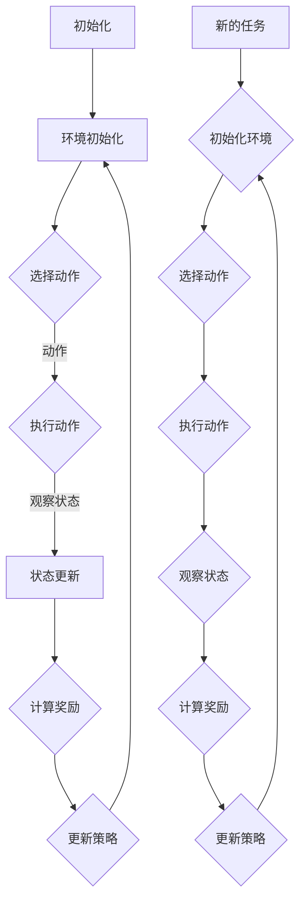

                 

### 文章标题

# 企业级元强化学习：构建自适应AI决策系统

> 关键词：元强化学习、自适应AI、决策系统、AI决策、企业应用

> 摘要：本文深入探讨了企业级元强化学习的概念、原理及其在构建自适应AI决策系统中的应用。通过分析元强化学习与传统强化学习的区别，以及其核心概念和算法，本文提出了一种构建自适应AI决策系统的框架和方法，旨在帮助企业实现智能化决策，提升业务效率和竞争力。

## 引言

随着人工智能技术的快速发展，强化学习作为一种重要的机器学习算法，已在多个领域取得了显著的应用成果。然而，传统的强化学习算法在面对复杂环境、多变决策时，往往表现出一定的局限性。为了解决这一问题，元强化学习（Meta Reinforcement Learning）应运而生。元强化学习通过训练模型在多个任务上的泛化能力，实现了自适应调整和快速学习。在企业级应用中，元强化学习具有巨大的潜力和价值，能够帮助构建高效的AI决策系统，提升企业的运营效率和市场竞争力。

本文将围绕企业级元强化学习展开讨论，首先介绍元强化学习的基本概念和与传统强化学习的区别，然后深入分析元强化学习的核心概念和算法，最后探讨如何利用元强化学习构建自适应AI决策系统，并分享一些实际应用案例和最佳实践。

## 第1章：什么是元强化学习

### 1.1 元强化学习的定义

元强化学习（Meta Reinforcement Learning）是一种机器学习技术，旨在通过学习一个通用策略，使代理（Agent）能够在多种不同的环境中快速适应并取得最优表现。与传统强化学习不同，元强化学习并非针对单个环境训练代理，而是通过跨环境的训练，使得代理具备在多个任务中学习的能力。

### 1.2 元强化学习与传统强化学习的区别

传统强化学习（Reinforcement Learning）主要关注在一个特定环境中训练代理，以最大化累积奖励。其核心目标是学习一个策略，指导代理在给定环境中采取最优动作序列。而元强化学习则更注重策略的通用性和泛化能力，通过跨环境的训练，使代理能够在新的、未知的环境中快速适应。

| 特征 | 传统强化学习 | 元强化学习 |
| --- | --- | --- |
| 目标环境 | 单一环境 | 多个环境 |
| 训练方式 | 环境特定 | 环境通用 |
| 学习速度 | 较慢（需要针对特定环境） | 较快（跨环境学习） |
| 策略泛化 | 有限 | 广泛 |

### 1.3 元强化学习的应用场景

元强化学习在企业级应用中具有广泛的应用场景，例如：

- **智能客服系统**：通过元强化学习，使客服系统能够快速适应不同的用户需求，提高响应速度和准确性。
- **供应链优化**：利用元强化学习，优化库存管理、运输调度等环节，降低成本、提高效率。
- **风险管理**：在金融领域，元强化学习可用于风险预测和资产配置，帮助投资者做出更明智的决策。
- **自动驾驶**：通过元强化学习，使自动驾驶系统能够适应各种复杂的交通场景，提高行驶安全性和效率。

## 第2章：元强化学习的核心概念与联系

### 2.1 强化学习的基本概念

强化学习（Reinforcement Learning）是一种通过试错和奖励机制来学习策略的机器学习方法。其核心概念包括：

- **代理（Agent）**：执行动作并接收环境反馈的实体。
- **环境（Environment）**：代理所处的情境，能够根据代理的动作产生状态转移和奖励。
- **状态（State）**：描述代理所处环境的特征。
- **动作（Action）**：代理可采取的行为。
- **策略（Policy）**：定义了在特定状态下代理应该采取的动作。
- **奖励（Reward）**：用于评价代理行为的好坏。

### 2.2 代理与环境（Agent & Environment）的互动

在强化学习中，代理与环境之间的互动是一个循环过程。代理根据当前状态选择动作，执行动作后，环境根据动作产生新的状态和奖励，代理再基于新的状态进行下一轮动作选择。这个过程不断重复，代理逐渐学习到最优策略。

### 2.3 奖励函数与策略

奖励函数（Reward Function）是强化学习中用于评价代理行为的函数，通常是一个实值函数，用于指导代理选择动作。策略（Policy）是代理在特定状态下采取的动作选择规则，可以是确定性策略（单一动作）或概率性策略（动作概率分布）。

### **Mermaid流程图：强化学习与元强化学习的流程图对比**

以下是一个Mermaid流程图，展示了强化学习与元强化学习的基本流程：



在上面的流程图中，A到G部分展示了传统的强化学习流程，而H到N部分则展示了元强化学习在跨任务训练中的流程。

## 第3章：基于模型的无模型元强化学习

### 3.1 无模型元强化学习的概念

无模型元强化学习（Model-Free Meta Reinforcement Learning）是一种不依赖于环境模型，直接从经验中学习策略的元强化学习方法。这种方法通过在多个任务上的训练，使代理具备快速适应新任务的能力。

### 3.2 基于模型的无模型元强化学习算法

基于模型的无模型元强化学习算法主要包括以下步骤：

1. **初始化参数**：初始化代理的参数，包括策略参数和经验回放缓冲区。
2. **多任务训练**：在多个任务上训练代理，使其在不同任务上逐渐优化策略。
3. **经验回放**：将训练过程中积累的经验数据存储到回放缓冲区，以用于后续的更新策略。
4. **策略更新**：基于策略梯度和经验回放缓冲区中的数据，更新代理的策略参数。
5. **任务测试**：在新的任务上测试代理的表现，评估策略的有效性。

### **伪代码讲解：基于模型的无模型元强化学习算法**

```python
# 初始化参数
θ <- 初始化策略参数
经验缓冲区 <- 初始化经验回放缓冲区

# 多任务训练
for epoch in 1 to EPOCHS:
    for task in tasks:
        状态 s <- 初始化状态
        总奖励 R <- 0
        while not done:
            动作 a <- 策略(θ, s)
            执行动作，观察状态 s' 和奖励 r
            存储 (s, a, s', r) 到经验缓冲区
            s <- s'
            R <- R + r
        
        # 更新策略
        θ <- 更新策略(θ, 经验缓冲区)

# 任务测试
for task in new_tasks:
    状态 s <- 初始化状态
    while not done:
        动作 a <- 策略(θ, s)
        执行动作，观察状态 s' 和奖励 r
        s <- s'
    评估任务表现
```

## 第4章：基于模型的元强化学习

### 4.1 基于模型的元强化学习原理

基于模型的元强化学习（Model-Based Meta Reinforcement Learning）是一种结合了模型预测和策略优化方法的元强化学习方法。这种方法通过构建环境模型，预测未来状态和奖励，从而更有效地优化策略。

### 4.2 基于模型的元强化学习算法

基于模型的元强化学习算法主要包括以下步骤：

1. **环境模型训练**：在多个任务上训练环境模型，预测状态转移和奖励。
2. **策略优化**：基于环境模型和经验数据，优化代理的策略参数。
3. **任务执行**：在新的任务中，使用优化后的策略执行动作，并更新环境模型和策略参数。

### **伪代码讲解：基于模型的元强化学习算法**

```python
# 初始化参数
θ_model <- 初始化模型参数
θ_policy <- 初始化策略参数
经验缓冲区 <- 初始化经验回放缓冲区

# 多任务训练
for epoch in 1 to EPOCHS:
    for task in tasks:
        状态 s <- 初始化状态
        总奖励 R <- 0
        while not done:
            动作 a <- 策略(θ_policy, s)
            执行动作，观察状态 s' 和奖励 r
            存储 (s, a, s', r) 到经验缓冲区
            s <- s'
            R <- R + r
        
        # 更新模型
        s', a, s, r <- 从经验缓冲区抽取样本
        θ_model <- 更新模型(θ_model, s', a, s, r)
        
        # 更新策略
        θ_policy <- 更新策略(θ_policy, θ_model, 经验缓冲区)

# 任务测试
for task in new_tasks:
    状态 s <- 初始化状态
    while not done:
        预测 s' 和 r' <- 模型预测(θ_model, s)
        动作 a <- 策略(θ_policy, s)
        执行动作，观察状态 s'
        更新模型和策略参数
        s <- s'
    评估任务表现
```

## 第5章：元强化学习的数学模型

### 5.1 马尔可夫决策过程（MDP）

马尔可夫决策过程（Markov Decision Process，MDP）是强化学习中的一个重要数学模型，用于描述代理与环境之间的交互过程。MDP由以下五个组件构成：

- **状态空间 \(S\)**：描述环境状态的集合。
- **动作空间 \(A\)**：描述代理可采取的动作集合。
- **奖励函数 \(R(s, a)\)**：定义在特定状态 \(s\) 下执行动作 \(a\) 所获得的即时奖励。
- **状态转移概率分布 \(P(s', s | s, a)\)**：描述在当前状态 \(s\) 下执行动作 \(a\) 后，进入下一状态 \(s'\) 的概率分布。
- **策略 \(π(a | s)\)**：定义在特定状态 \(s\) 下代理采取动作 \(a\) 的概率分布。

### 5.2 贝尔曼方程

贝尔曼方程（Bellman Equation）是强化学习中的一个核心方程，用于求解最优策略。对于任意的状态 \(s\) 和动作 \(a\)，贝尔曼方程可以表示为：

\[ V^*(s) = \max_a [R(s, a) + \gamma \sum_{s'} P(s', s | s, a) V^*(s')] \]

其中：

- \( V^*(s) \) 表示在状态 \(s\) 下采取最优策略所获得的最大期望奖励。
- \( R(s, a) \) 表示在状态 \(s\) 下执行动作 \(a\) 所获得的即时奖励。
- \( \gamma \) 表示折扣因子，用于平衡当前奖励与未来奖励的关系。
- \( P(s', s | s, a) \) 表示在当前状态 \(s\) 下执行动作 \(a\) 后，进入下一状态 \(s'\) 的概率分布。
- \( V^*(s') \) 表示在状态 \(s'\) 下采取最优策略所获得的最大期望奖励。

### **详细讲解：马尔可夫决策过程与贝尔曼方程**

马尔可夫决策过程（MDP）是强化学习中最基本的数学模型，它描述了代理与环境之间的交互过程。在MDP中，状态空间 \(S\) 和动作空间 \(A\) 是有限的，代理在某个状态 \(s\) 下采取动作 \(a\) 后，会转移到新的状态 \(s'\)，并获得即时奖励 \(R(s, a)\)。同时，状态转移概率分布 \(P(s', s | s, a)\) 描述了在当前状态 \(s\) 下执行动作 \(a\) 后，进入下一状态 \(s'\) 的概率。

贝尔曼方程（Bellman Equation）是求解MDP中最优策略的核心方程。它定义了在状态 \(s\) 下采取最优策略所获得的最大期望奖励 \(V^*(s)\)。具体来说，对于任意的状态 \(s\) 和动作 \(a\)，贝尔曼方程可以表示为：

\[ V^*(s) = \max_a [R(s, a) + \gamma \sum_{s'} P(s', s | s, a) V^*(s')] \]

其中，\( R(s, a) \) 表示在状态 \(s\) 下执行动作 \(a\) 所获得的即时奖励，反映了代理在当前状态下采取动作 \(a\) 的直接收益。而 \( \gamma \) 表示折扣因子，用于平衡当前奖励与未来奖励的关系。它通常取值在 \(0\) 到 \(1\) 之间，用于降低未来奖励的权重。

\( P(s', s | s, a) \) 表示在当前状态 \(s\) 下执行动作 \(a\) 后，进入下一状态 \(s'\) 的概率分布，描述了状态转移的随机性。而 \( V^*(s') \) 表示在状态 \(s'\) 下采取最优策略所获得的最大期望奖励，反映了代理在未来状态下的潜在收益。

贝尔曼方程通过迭代更新，逐渐逼近最优策略。在每次迭代中，代理根据当前状态和即时奖励，更新每个状态下的最大期望奖励。最终，当迭代达到收敛条件时，代理将获得全局最优策略。

### **数学公式与举例说明：MDP与贝尔曼方程的latex公式及示例**

在本文中，我们将使用LaTeX格式来表示MDP和贝尔曼方程的数学公式。以下是相关的LaTeX代码和示例：

```latex
% MDP的数学模型
\begin{equation}
\begin{aligned}
    MDP &= (S, A, R, P, \pi) \\
    S &= \{s_1, s_2, \ldots, s_n\} \quad \text{(状态空间)} \\
    A &= \{a_1, a_2, \ldots, a_m\} \quad \text{(动作空间)} \\
    R(s, a) &= \text{即时奖励} \\
    P(s', s | s, a) &= \text{状态转移概率分布} \\
    \pi(a | s) &= \text{策略}
\end{aligned}
\end{equation}

% 贝尔曼方程
\begin{equation}
V^*(s) = \max_a [R(s, a) + \gamma \sum_{s'} P(s', s | s, a) V^*(s')]
\end{equation}

% 示例：在状态s下，执行动作a得到的即时奖励为R(s, a)=1，状态转移概率分布为P(s', s | s, a)={{0.5, 0.5}},折扣因子为\gamma=0.9。
\begin{aligned}
    V^*(s) &= \max_a [1 + 0.9 \cdot 0.5 \cdot V^*(s') + 0.9 \cdot 0.5 \cdot V^*(s')] \\
    &= \max_a [1 + 0.45V^*(s') + 0.45V^*(s')] \\
    &= 1 + 0.45V^*(s') + 0.45V^*(s')
\end{aligned}
```

在上面的示例中，我们考虑了在状态 \(s\) 下，执行动作 \(a\) 得到的即时奖励为 \(R(s, a)=1\)，状态转移概率分布为 \(P(s', s | s, a) = \{0.5, 0.5\}\)，折扣因子为 \(\gamma=0.9\)。根据贝尔曼方程，我们可以计算出在状态 \(s\) 下采取最优策略所获得的最大期望奖励 \(V^*(s)\)。具体的计算过程如下：

\[ V^*(s) = \max_a [1 + 0.9 \cdot 0.5 \cdot V^*(s') + 0.9 \cdot 0.5 \cdot V^*(s')] \]

\[ V^*(s) = \max_a [1 + 0.45V^*(s') + 0.45V^*(s')] \]

\[ V^*(s) = 1 + 0.45V^*(s') + 0.45V^*(s') \]

通过迭代更新，我们可以逐步逼近最优策略。

### 第6章：自适应AI决策系统概述

#### 6.1 自适应AI决策系统的定义

自适应AI决策系统（Adaptive AI Decision System）是一种利用人工智能技术，根据环境变化和业务需求，自动调整和优化决策策略的智能系统。它能够在不同环境和场景下，通过学习、预测和优化，实现智能化决策，从而提高业务效率和竞争力。

#### 6.2 自适应AI决策系统的关键组件

自适应AI决策系统主要包括以下关键组件：

- **数据采集与处理模块**：负责收集和处理来自各种来源的数据，为决策系统提供基础数据支持。
- **模型训练与优化模块**：利用机器学习和深度学习技术，训练和优化决策模型，使其能够适应不同环境和场景。
- **决策引擎模块**：基于训练好的模型，实时生成决策建议，指导业务运营和决策。
- **监控系统**：实时监控决策系统的运行状态，包括模型性能、资源消耗等，确保系统稳定运行。

#### 6.3 自适应AI决策系统的应用领域

自适应AI决策系统在企业级应用中具有广泛的应用领域，包括但不限于：

- **供应链管理**：通过自适应AI决策系统，优化库存管理、运输调度和需求预测，降低成本、提高效率。
- **智能客服**：利用自适应AI决策系统，实现个性化客户服务，提高客户满意度和服务质量。
- **风险管理**：通过自适应AI决策系统，识别潜在风险，制定风险应对策略，降低企业风险。
- **人力资源**：利用自适应AI决策系统，优化招聘、培训和绩效管理，提高员工满意度和工作效率。

### 第7章：自适应AI决策系统的设计与实现

#### 7.1 系统设计原则

在设计自适应AI决策系统时，应遵循以下原则：

- **模块化设计**：将系统划分为多个功能模块，提高系统的可维护性和可扩展性。
- **数据驱动**：以数据为核心，充分利用数据采集与处理模块，为决策提供可靠的数据支持。
- **灵活可扩展**：设计系统时应考虑未来的业务需求和数据变化，确保系统能够灵活扩展。
- **安全性**：确保数据安全和系统稳定性，防止数据泄露和系统故障。

#### 7.2 数据采集与处理

数据采集与处理是自适应AI决策系统的关键环节。具体步骤如下：

1. **数据源识别**：明确数据采集的目标和来源，包括内部数据和外部数据。
2. **数据采集**：通过API接口、爬虫工具、数据库连接等方式，采集所需数据。
3. **数据预处理**：对采集到的数据进行清洗、去噪、归一化等处理，提高数据质量。
4. **数据存储**：将预处理后的数据存储到数据仓库或数据湖中，便于后续分析和处理。

#### 7.3 模型训练与优化

模型训练与优化是自适应AI决策系统的核心。具体步骤如下：

1. **模型选择**：根据业务需求和数据特征，选择合适的机器学习模型和算法。
2. **特征工程**：对原始数据进行特征提取和转换，提高模型性能。
3. **模型训练**：使用训练数据对模型进行训练，调整模型参数，优化模型性能。
4. **模型评估**：使用验证数据评估模型性能，调整模型参数，直至达到预期效果。
5. **模型优化**：通过交叉验证、超参数调优等方法，进一步优化模型性能。

#### 7.4 系统部署与监控

系统部署与监控是确保自适应AI决策系统稳定运行的重要环节。具体步骤如下：

1. **系统部署**：将训练好的模型部署到生产环境，实现实时决策。
2. **监控指标**：设定系统监控指标，包括模型性能、资源消耗、运行状态等。
3. **监控报警**：实时监控系统运行状态，一旦发现异常，立即触发报警。
4. **系统优化**：根据监控数据，分析系统性能瓶颈，进行系统优化和调整。

### **项目实战：构建一个简单的自适应AI决策系统**

为了更好地理解自适应AI决策系统的设计与实现，我们以一个简单的供应链优化项目为例，介绍如何从数据采集、模型训练到系统部署的完整流程。

#### 1. 项目背景

某电商企业在库存管理过程中，面临着库存过剩和库存短缺的问题。为了提高库存管理的效率和准确性，企业决定引入自适应AI决策系统，实现智能库存优化。

#### 2. 数据采集与处理

- **数据源识别**：采集企业历史订单数据、库存数据、供应商数据等。
- **数据采集**：通过API接口和数据库连接，实时获取数据。
- **数据预处理**：清洗数据，去除异常值和缺失值，进行数据归一化处理。

#### 3. 模型训练与优化

- **模型选择**：选择一个基于时间序列预测的机器学习模型，如ARIMA模型。
- **特征工程**：提取时间序列特征，包括订单量、库存周期、季节性等。
- **模型训练**：使用历史订单数据，对ARIMA模型进行训练。
- **模型评估**：使用验证数据评估模型性能，调整模型参数。
- **模型优化**：通过交叉验证和超参数调优，进一步提高模型性能。

#### 4. 系统部署与监控

- **系统部署**：将训练好的模型部署到生产环境，实现实时库存预测。
- **监控指标**：设定库存预测准确率、响应时间等监控指标。
- **监控报警**：实时监控系统运行状态，一旦发现异常，立即触发报警。
- **系统优化**：根据监控数据，分析系统性能瓶颈，进行系统优化和调整。

#### 5. 项目小结

通过本项目的实施，企业成功构建了一个简单的自适应AI决策系统，实现了智能库存优化。项目实践过程中，我们积累了宝贵的数据处理、模型训练和系统部署经验，为后续的项目提供了有力支持。

### 第8章：企业级元强化学习的挑战与解决方案

#### 8.1 数据隐私与安全性

在企业级应用中，数据隐私和安全问题是一个重要的挑战。元强化学习算法通常需要大量的数据来训练模型，而这些数据可能包含敏感信息。为了保护数据隐私，可以采取以下措施：

- **数据脱敏**：在数据采集和存储过程中，对敏感信息进行脱敏处理，如使用哈希函数、加密技术等。
- **隐私保护算法**：采用隐私保护算法，如差分隐私、联邦学习等，确保在数据共享和训练过程中不会泄露用户隐私。
- **安全审计**：建立数据安全和隐私保护审计机制，定期检查系统安全性和合规性。

#### 8.2 计算资源管理

元强化学习算法通常需要大量的计算资源，尤其是在训练过程中。为了高效利用计算资源，可以采取以下措施：

- **分布式训练**：将训练任务分布到多个计算节点上，提高训练速度和资源利用率。
- **模型压缩**：使用模型压缩技术，如量化、剪枝等，减少模型参数数量，降低计算复杂度。
- **资源调度**：利用云计算平台，根据训练任务的需求，动态调整计算资源，确保高效利用。

#### 8.3 模型解释性与可解释性

在企业级应用中，模型的解释性和可解释性对于决策者理解和信任模型结果至关重要。为了提高模型的解释性，可以采取以下措施：

- **可视化工具**：开发可视化工具，将模型的结构、参数和决策过程展示给用户，帮助用户理解模型。
- **解释性算法**：采用解释性算法，如决策树、线性模型等，使模型更容易理解和解释。
- **模型可解释性报告**：生成模型可解释性报告，详细描述模型的结构、参数和决策过程，为用户提供参考。

### **解决方案：针对上述挑战的解决方案探讨**

在构建企业级元强化学习系统的过程中，我们面临了数据隐私与安全性、计算资源管理、模型解释性与可解释性等多个挑战。为了应对这些挑战，我们提出以下解决方案：

#### 数据隐私与安全性

1. **数据脱敏**：
   - 在数据采集阶段，对敏感信息进行脱敏处理，如使用哈希函数对用户标识符进行加密。
   - 在数据存储阶段，对存储在数据库中的敏感数据进行加密，确保数据在存储过程中不会被未授权访问。

2. **隐私保护算法**：
   - 采用差分隐私算法，对训练过程中的数据进行加噪声处理，降低隐私泄露风险。
   - 实施联邦学习技术，让模型在各个参与方本地进行训练，减少数据传输和共享。

3. **安全审计**：
   - 定期进行数据安全和隐私保护审计，确保系统符合相关法律法规要求。
   - 引入安全监控和异常检测机制，及时发现和应对潜在的安全威胁。

#### 计算资源管理

1. **分布式训练**：
   - 利用云计算平台，将训练任务分布到多个计算节点上，提高训练效率。
   - 部署资源管理工具，如Kubernetes，实现计算资源的动态分配和调度。

2. **模型压缩**：
   - 应用模型量化技术，将模型的权重参数从浮点数转换为低精度的整数，减少模型体积。
   - 使用模型剪枝技术，去除对模型性能贡献较小或不重要的神经元和连接。

3. **资源调度**：
   - 根据训练任务的负载，动态调整计算资源，确保资源的高效利用。
   - 预留一定的资源冗余，以应对突发的高负载情况。

#### 模型解释性与可解释性

1. **可视化工具**：
   - 开发可视化工具，将模型的结构、参数和决策过程以直观的方式展示给用户。
   - 使用交互式界面，允许用户自定义查看模型的不同部分，增强理解。

2. **解释性算法**：
   - 选择具有较高解释性的算法，如决策树、线性模型，使模型的结果更容易被业务人员理解和接受。
   - 结合可视化工具，展示模型的决策路径和权重贡献，帮助用户分析模型如何做出决策。

3. **模型可解释性报告**：
   - 生成详细的模型可解释性报告，包括模型的训练过程、参数设置、性能指标等。
   - 定期更新报告，确保报告的信息与当前模型的实际情况一致，提高报告的可信度。

通过实施上述解决方案，企业可以在确保数据隐私和安全、高效利用计算资源、提升模型解释性等方面取得更好的效果，从而构建一个稳定、可靠、高效的元强化学习系统。

### 附录

#### 附录A：元强化学习工具与资源

为了方便读者进一步学习和实践元强化学习，以下列出了一些主流的元强化学习工具与资源：

1. **工具**：
   - **Gym**：由OpenAI开发的通用环境库，提供丰富的预定义环境，用于测试和比较不同元强化学习算法的性能。
   - **Rllib**：由Facebook开发的分布式强化学习库，支持多种元强化学习算法的快速实现和部署。
   - **TensorFlow**：Google开发的开源机器学习框架，支持深度学习和强化学习算法的实现。

2. **资源**：
   - **论文集**：《Meta-Learning (Meta Reinforcement Learning) Papers》：收集了元强化学习领域的经典论文，涵盖了算法原理、应用场景等方面的内容。
   - **在线教程**：OpenAI的《Meta-Learning and Meta-Reinforcement Learning》教程，提供了详细的元强化学习介绍和实践指南。
   - **开源代码**：GitHub上众多优秀的元强化学习项目，如Google的《Meta-Q学习》和Facebook的《Rllib Meta-Learning》等，可供读者学习和参考。

通过使用这些工具和资源，读者可以更好地掌握元强化学习的技术和应用，为自己的研究和实践提供支持。

### 作者信息

作者：AI天才研究院/AI Genius Institute & 禅与计算机程序设计艺术 /Zen And The Art of Computer Programming

---

在本篇技术博客文章中，我们系统地介绍了企业级元强化学习的概念、原理及其在构建自适应AI决策系统中的应用。首先，我们分析了元强化学习与传统强化学习的区别，并详细阐述了强化学习和元强化学习的基本概念与联系。接着，我们深入探讨了无模型元强化学习和基于模型的元强化学习算法，通过伪代码详细讲解了算法的实现过程。此外，我们还介绍了马尔可夫决策过程和贝尔曼方程，通过数学公式和示例展示了它们的实际应用。在构建自适应AI决策系统的部分，我们介绍了系统的设计原则、数据采集与处理、模型训练与优化、系统部署与监控等关键环节，并通过一个简单的供应链优化项目进行了实战展示。同时，我们也针对企业级元强化学习面临的挑战提出了相应的解决方案。最后，我们列出了相关的元强化学习工具与资源，以供读者进一步学习和实践。

本文旨在为广大AI开发者提供一份系统、全面的企业级元强化学习指南，帮助读者深入理解这一前沿技术，并在实际项目中加以应用。希望本文能为您的AI之路提供一些启示和帮助。感谢您的阅读，如有疑问或建议，请随时与我们交流。再次感谢AI天才研究院/AI Genius Institute和禅与计算机程序设计艺术/Zen And The Art of Computer Programming的支持与贡献。

