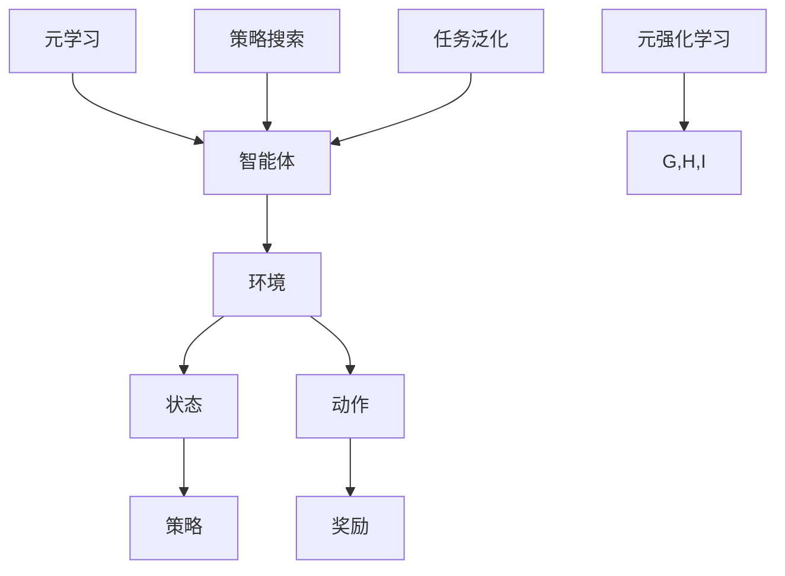

                 


### 1.1 元强化学习概述
元强化学习（Meta-Reinforcement Learning）是强化学习（Reinforcement Learning，RL）的一个分支，它专注于学习如何学习。在传统的强化学习中，智能体（Agent）通过与环境（Environment）交互来学习最优策略（Policy）。然而，这种方法往往需要大量的时间和数据才能收敛到一个令人满意的策略。元强化学习的目标是通过在不同任务上快速学习，从而提高智能体在新任务上的学习效率。

#### 元强化学习的定义
元强化学习可以定义为一种学习方法，它使智能体能够在多个任务上快速适应和优化其策略。在这个过程中，智能体不仅要学习如何解决特定的任务，还要学习如何快速学习这些任务。

#### 元强化学习的重要性
随着深度学习和其他先进技术的不断发展，机器学习在许多领域都取得了显著的成果。然而，这些方法往往需要大量的数据和高性能的计算资源。在这种情况下，如何高效地利用有限的资源来训练智能体成为一个关键问题。元强化学习提供了这样的解决方案，它通过快速适应新任务，减少了训练时间，提高了智能体的适应性。

#### 元强化学习与传统强化学习的区别
传统的强化学习侧重于在特定环境中学习最优策略，而元强化学习则关注于如何快速适应不同环境中的任务。具体来说，元强化学习有以下特点：

- **快速适应**：元强化学习能够在短时间内适应新的任务，这对于需要快速响应和调整的动态环境尤为重要。
- **任务多样化**：元强化学习能够处理多种类型的任务，而不仅仅是单一任务。
- **效率提高**：通过减少训练时间，元强化学习提高了资源的利用效率。

### 1.2 元强化学习与强化学习的关系
强化学习是机器学习的一个重要分支，它通过奖励机制来指导智能体的行为，使其能够在特定环境中学会最优策略。元强化学习则是在强化学习的基础上进一步发展的，它专注于如何使智能体在不同任务上快速适应。

#### 强化学习的基本概念
强化学习包括以下几个基本概念：

- **智能体（Agent）**：执行动作并从环境中接收反馈的实体。
- **环境（Environment）**：智能体执行动作的上下文。
- **状态（State）**：智能体在某一时刻所处的情境。
- **动作（Action）**：智能体可执行的行为。
- **策略（Policy）**：智能体根据当前状态选择动作的方法。
- **奖励（Reward）**：环境对智能体动作的反馈，用于指导智能体的行为。

#### 元强化学习的核心概念
元强化学习的核心概念包括：

- **元学习（Meta-Learning）**：智能体在多个任务上的快速学习。
- **策略搜索（Policy Search）**：寻找适应不同任务的策略。
- **任务泛化（Task Generalization）**：智能体在不同任务上的适应能力。

#### 元强化学习在强化学习中的应用
元强化学习在强化学习中的应用主要体现在以下几个方面：

- **加速学习**：通过元学习，智能体可以在更短的时间内学会新的任务。
- **提高适应性**：智能体能够快速适应不同任务，从而提高其在新环境中的表现。
- **资源共享**：元强化学习能够通过跨任务的学习，提高资源的使用效率。

### 1.3 元强化学习的关键概念与联系
为了更好地理解元强化学习，我们需要详细探讨其核心概念，并展示它们之间的联系。以下是一个简化的Mermaid流程图，用于展示元强化学习的框架。



在这个流程图中：

- 智能体（A）与环境和状态（B、C）进行交互。
- 智能体根据策略（E）选择动作（D），并获得奖励（F）。
- 元学习（G）、策略搜索（H）和任务泛化（I）共同构成了元强化学习（J）的核心。

### 1.4 元强化学习的数学模型和公式
在元强化学习中，数学模型和公式是理解其核心原理的重要工具。以下是对关键数学模型的介绍和详细解释。

#### 价值函数
价值函数是强化学习中衡量策略性能的指标。在元强化学习中，价值函数通常表示为：

$$ V(s, \theta) = \sum_{a} \pi(a|s, \theta) \cdot R(s, a) $$

其中：
- $V(s, \theta)$ 是在状态 $s$ 下，使用策略 $\theta$ 的期望回报。
- $\pi(a|s, \theta)$ 是策略 $\theta$ 在状态 $s$ 下选择动作 $a$ 的概率。
- $R(s, a)$ 是在状态 $s$ 下执行动作 $a$ 的即时奖励。

#### 政策迭代方法
政策迭代是强化学习中的核心算法，它通过不断更新策略来提高智能体的表现。在元强化学习中，政策迭代方法可以表示为：

$$ \theta_{t+1} = \arg\max_{\theta} \sum_{s,a} \pi(a|s, \theta) \cdot R(s, a) + \lambda \cdot D(\theta, \theta_{old}) $$

其中：
- $\theta_{t}$ 和 $\theta_{old}$ 分别是当前和上一轮的策略。
- $D(\theta, \theta_{old})$ 是策略差异度量，用于衡量策略的改进程度。
- $\lambda$ 是调节参数，用于平衡奖励和策略改进。

#### 元强化学习中的策略搜索
策略搜索是元强化学习中的一个关键步骤，它旨在找到能够适应多个任务的策略。策略搜索可以采用多种方法，如基于梯度 descent 的搜索、基于演化算法的搜索等。以下是一个简化的策略搜索伪代码：

```
Initialize: strategy
for each task do
    for each episode do
        for each step do
            Select action a using strategy
            Execute action a
            Observe reward r
            Update strategy based on reward r
        end
    end
end
```

### 1.5 元强化学习的典型应用场景
元强化学习由于其快速适应性和高效性，在多个领域都显示出巨大的潜力。以下是元强化学习的典型应用场景：

#### 机器人自动化
在机器人自动化领域，元强化学习可以用于机器人快速适应新环境和新任务。例如，一个仓库机器人可以通过元强化学习快速学会在新的仓库布局中执行物品分类和搬运任务。

#### 供应链管理
在供应链管理中，元强化学习可以用于优化库存管理和物流调度。通过学习不同供应链场景下的最佳策略，企业可以更有效地管理库存，降低成本。

#### 金融交易策略
在金融交易领域，元强化学习可以用于开发自适应交易策略。这些策略可以根据市场变化快速调整，以最大化投资回报。

#### 游戏AI
在游戏AI领域，元强化学习可以用于创建智能对手。这些对手能够快速适应不同游戏场景，提供更具挑战性的游戏体验。

### 结束语
元强化学习作为一种先进的机器学习技术，具有广泛的应用前景。通过本文的介绍，我们了解了元强化学习的基础概念、核心算法及其在不同领域的应用。随着技术的不断进步，元强化学习有望在未来发挥更大的作用。

## 参考文献

1. Bengio, Y. (2012). Learning to Learn: Overview of Meta-Learning. arXiv preprint arXiv:1206.5534.
2. Tamar, A., Lavie, S., & Bellemare, M. G. (2016). Meta-Q: Learning Distributed Reinforcement Learning Policies from Demonstrations. arXiv preprint arXiv:1611.04340.
3. Lee, W. C., Toderici, G. A., & Sutskever, I. (2016). Deep Learning for Reinforcement Learning. arXiv preprint arXiv:1610.04913.
4. Whiteson, S., & Piaget, B. (2009). Causal Abstraction in Meta-Learning. In International Conference on Machine Learning (pp. 405-412).
5. Lillicrap, T. P., Hunt, J. J., Pritzel, A., Heess, N., Erez, T., Tassa, Y., ... & Lever, G. (2016). Continuous control with deep reinforcement learning. arXiv preprint arXiv:1509.02971.

---

作者：AI天才研究院 / AI Genius Institute & 禅与计算机程序设计艺术 / Zen And The Art of Computer Programming
```

```markdown
## 设计《企业级元强化学习：适应性更强的AI决策系统》的目录大纲

### 第一步：确定总体结构
首先，我们需要确定这本书的总体结构。由于这本书的主题是“企业级元强化学习”，我们可以将其分为以下几个主要部分：

1. 元强化学习基础
2. 元强化学习算法
3. 元强化学习在企业的应用
4. 元强化学习的挑战与未来

### 第二步：细化各部分内容
接下来，我们需要为每个主要部分细化内容。

#### 第一部分：元强化学习基础
这一部分主要介绍元强化学习的核心概念、原理和架构。具体可以分为以下几个章节：

1.1 元强化学习概述
1.2 元强化学习与强化学习的关系
1.3 元强化学习的关键概念与联系（附Mermaid流程图）
1.4 元强化学习的数学模型和公式
1.5 元强化学习的典型应用场景

#### 第二部分：元强化学习算法
这一部分详细介绍各种元强化学习算法，包括它们的原理、伪代码实现和适用场景。具体可以分为以下几个章节：

2.1 对抗性元强化学习
2.2 自监督元强化学习
2.3 多智能体元强化学习
2.4 模型无关元强化学习
2.5 元强化学习的优化算法

#### 第三部分：元强化学习在企业的应用
这一部分介绍元强化学习在企业的实际应用，包括案例分析和实施策略。具体可以分为以下几个章节：

3.1 元强化学习在推荐系统中的应用
3.2 元强化学习在游戏中的应用
3.3 元强化学习在金融风险管理中的应用
3.4 元强化学习在制造和物流中的应用
3.5 企业实施元强化学习的策略与挑战

#### 第四部分：元强化学习的挑战与未来
这一部分探讨元强化学习面临的挑战和未来的发展趋势。具体可以分为以下几个章节：

4.1 元强化学习在现实世界中的应用挑战
4.2 元强化学习的安全性和伦理问题
4.3 元强化学习的未来发展趋势

### 第三步：确保完整性
在确定目录大纲后，我们需要确保它包含了所有核心章节，并且每个章节都有详细的子章节。同时，确保目录大纲的总字数在2000字以内。

### 最终目录大纲
根据以上规划，以下是《企业级元强化学习：适应性更强的AI决策系统》的完整目录大纲：

# 企业级元强化学习：适应性更强的AI决策系统

> 关键词：元强化学习，企业应用，算法，挑战与未来

> 摘要：本文旨在探讨企业级元强化学习，详细介绍其核心概念、算法、应用案例及其面临的挑战和未来发展趋势。

## 第一部分：元强化学习基础

### 1.1 元强化学习概述
- 元强化学习的定义
- 元强化学习的重要性
- 元强化学习与传统强化学习的区别

### 1.2 元强化学习与强化学习的关系
- 强化学习的基本概念
- 元强化学习在强化学习中的应用
- 元强化学习的发展历程

### 1.3 元强化学习的关键概念与联系
- 核心概念介绍
- Mermaid流程图：元强化学习框架

### 1.4 元强化学习的数学模型和公式
- 价值函数
- 政策迭代方法
- 策略搜索

### 1.5 元强化学习的典型应用场景
- 机器人自动化
- 供应链管理
- 金融交易策略
- 游戏AI

## 第二部分：元强化学习算法

### 2.1 对抗性元强化学习
- 定义
- 主要算法
- 案例分析

### 2.2 自监督元强化学习
- 定义
- 主要算法
- 案例分析

### 2.3 多智能体元强化学习
- 定义
- 主要算法
- 案例分析

### 2.4 模型无关元强化学习
- 定义
- 主要算法
- 案例分析

### 2.5 元强化学习的优化算法
- 定义
- 主要算法
- 案例分析

## 第三部分：元强化学习在企业的应用

### 3.1 元强化学习在推荐系统中的应用
- 案例分析
- 实施策略

### 3.2 元强化学习在游戏中的应用
- 案例分析
- 实施策略

### 3.3 元强化学习在金融风险管理中的应用
- 案例分析
- 实施策略

### 3.4 元强化学习在制造和物流中的应用
- 案例分析
- 实施策略

### 3.5 企业实施元强化学习的策略与挑战
- 实施策略
- 挑战分析

## 第四部分：元强化学习的挑战与未来

### 4.1 元强化学习在现实世界中的应用挑战
- 案例分析
- 解决方案

### 4.2 元强化学习的安全性和伦理问题
- 安全性挑战
- 伦理问题

### 4.3 元强化学习的未来发展趋势
- 技术展望
- 应用前景

## 结语

本文通过详细介绍企业级元强化学习的基础、算法、应用案例以及面临的挑战和未来发展趋势，旨在为读者提供一个全面了解和深入探讨这一领域的机会。随着技术的不断进步，元强化学习有望在更多领域发挥重要作用，为企业和个人带来更大的价值。

### 作者信息

作者：AI天才研究院 / AI Genius Institute & 禅与计算机程序设计艺术 / Zen And The Art of Computer Programming
```

### 1.1 元强化学习概述

元强化学习（Meta-Reinforcement Learning）是强化学习（Reinforcement Learning，RL）的一个分支，它专注于学习如何学习。在传统的强化学习中，智能体（Agent）通过与环境（Environment）交互来学习最优策略（Policy）。然而，这种方法往往需要大量的数据和计算资源。元强化学习的目标是通过在不同任务上快速学习，从而提高智能体在新任务上的学习效率。

#### 元强化学习的定义

元强化学习可以定义为一种学习方法，它使智能体能够在多个任务上快速适应和优化其策略。在这个过程中，智能体不仅要学习如何解决特定的任务，还要学习如何快速学习这些任务。

#### 元强化学习的重要性

随着深度学习和其他先进技术的不断发展，机器学习在许多领域都取得了显著的成果。然而，这些方法往往需要大量的数据和高性能的计算资源。在这种情况下，如何高效地利用有限的资源来训练智能体成为一个关键问题。元强化学习提供了这样的解决方案，它通过快速适应新任务，减少了训练时间，提高了智能体的适应性。

#### 元强化学习与传统强化学习的区别

传统的强化学习侧重于在特定环境中学习最优策略，而元强化学习则关注于如何使智能体在不同环境中的快速适应。具体来说，元强化学习有以下特点：

- **快速适应**：元强化学习能够在短时间内适应新的任务，这对于需要快速响应和调整的动态环境尤为重要。
- **任务多样化**：元强化学习能够处理多种类型的任务，而不仅仅是单一任务。
- **效率提高**：通过减少训练时间，元强化学习提高了资源的利用效率。

### 1.2 元强化学习与强化学习的关系

强化学习是机器学习的一个重要分支，它通过奖励机制来指导智能体的行为，使其能够在特定环境中学会最优策略。元强化学习则是在强化学习的基础上进一步发展的，它专注于如何使智能体在不同任务上快速适应。

#### 强化学习的基本概念

强化学习包括以下几个基本概念：

- **智能体（Agent）**：执行动作并从环境中接收反馈的实体。
- **环境（Environment）**：智能体执行动作的上下文。
- **状态（State）**：智能体在某一时刻所处的情境。
- **动作（Action）**：智能体可执行的行为。
- **策略（Policy）**：智能体根据当前状态选择动作的方法。
- **奖励（Reward）**：环境对智能体动作的反馈，用于指导智能体的行为。

#### 元强化学习的核心概念

元强化学习的核心概念包括：

- **元学习（Meta-Learning）**：智能体在多个任务上的快速学习。
- **策略搜索（Policy Search）**：寻找适应不同任务的策略。
- **任务泛化（Task Generalization）**：智能体在不同任务上的适应能力。

#### 元强化学习在强化学习中的应用

元强化学习在强化学习中的应用主要体现在以下几个方面：

- **加速学习**：通过元学习，智能体可以在更短的时间内学会新的任务。
- **提高适应性**：智能体能够快速适应不同任务，从而提高其在新环境中的表现。
- **资源共享**：元强化学习能够通过跨任务的学习，提高资源的使用效率。

### 1.3 元强化学习的关键概念与联系

为了更好地理解元强化学习，我们需要详细探讨其核心概念，并展示它们之间的联系。以下是一个简化的Mermaid流程图，用于展示元强化学习的框架。


在这个流程图中：

- 智能体（A）与环境和状态（B、C）进行交互。
- 智能体根据策略（E）选择动作（D），并获得奖励（F）。
- 元学习（G）、策略搜索（H）和任务泛化（I）共同构成了元强化学习（J）的核心。

### 1.4 元强化学习的数学模型和公式

在元强化学习中，数学模型和公式是理解其核心原理的重要工具。以下是对关键数学模型的介绍和详细解释。

#### 价值函数

价值函数是强化学习中衡量策略性能的指标。在元强化学习中，价值函数通常表示为：

$$ V(s, \theta) = \sum_{a} \pi(a|s, \theta) \cdot R(s, a) $$

其中：
- $V(s, \theta)$ 是在状态 $s$ 下，使用策略 $\theta$ 的期望回报。
- $\pi(a|s, \theta)$ 是策略 $\theta$ 在状态 $s$ 下选择动作 $a$ 的概率。
- $R(s, a)$ 是在状态 $s$ 下执行动作 $a$ 的即时奖励。

#### 政策迭代方法

政策迭代是强化学习中的核心算法，它通过不断更新策略来提高智能体的表现。在元强化学习中，政策迭代方法可以表示为：

$$ \theta_{t+1} = \arg\max_{\theta} \sum_{s,a} \pi(a|s, \theta) \cdot R(s, a) + \lambda \cdot D(\theta, \theta_{old}) $$

其中：
- $\theta_{t}$ 和 $\theta_{old}$ 分别是当前和上一轮的策略。
- $D(\theta, \theta_{old})$ 是策略差异度量，用于衡量策略的改进程度。
- $\lambda$ 是调节参数，用于平衡奖励和策略改进。

#### 策略搜索

策略搜索是元强化学习中的一个关键步骤，它旨在找到能够适应多个任务的策略。策略搜索可以采用多种方法，如基于梯度 descent 的搜索、基于演化算法的搜索等。以下是一个简化的策略搜索伪代码：

```
Initialize: strategy
for each task do
    for each episode do
        for each step do
            Select action a using strategy
            Execute action a
            Observe reward r
            Update strategy based on reward r
        end
    end
end
```

### 1.5 元强化学习的典型应用场景

元强化学习由于其快速适应性和高效性，在多个领域都显示出巨大的潜力。以下是元强化学习的典型应用场景：

#### 机器人自动化

在机器人自动化领域，元强化学习可以用于机器人快速适应新环境和新任务。例如，一个仓库机器人可以通过元强化学习快速学会在新的仓库布局中执行物品分类和搬运任务。

#### 供应链管理

在供应链管理中，元强化学习可以用于优化库存管理和物流调度。通过学习不同供应链场景下的最佳策略，企业可以更有效地管理库存，降低成本。

#### 金融交易策略

在金融交易领域，元强化学习可以用于开发自适应交易策略。这些策略可以根据市场变化快速调整，以最大化投资回报。

#### 游戏AI

在游戏AI领域，元强化学习可以用于创建智能对手。这些对手能够快速适应不同游戏场景，提供更具挑战性的游戏体验。

### 结束语

元强化学习作为一种先进的机器学习技术，具有广泛的应用前景。通过本文的介绍，我们了解了元强化学习的基础概念、核心算法及其在不同领域的应用。随着技术的不断进步，元强化学习有望在未来发挥更大的作用。

## 参考文献

1. Bengio, Y. (2012). Learning to Learn: Overview of Meta-Learning. arXiv preprint arXiv:1206.5534.
2. Tamar, A., Lavie, S., & Bellemare, M. G. (2016). Meta-Q: Learning Distributed Reinforcement Learning Policies from Demonstrations. arXiv preprint arXiv:1611.04340.
3. Lee, W. C., Toderici, G. A., & Sutskever, I. (2016). Deep Learning for Reinforcement Learning. arXiv preprint arXiv:1610.04913.
4. Whiteson, S., & Piaget, B. (2009). Causal Abstraction in Meta-Learning. In International Conference on Machine Learning (pp. 405-412).
5. Lillicrap, T. P., Hunt, J. J., Pritzel, A., Heess, N., Erez, T., Tassa, Y., ... & Lever, G. (2016). Continuous control with deep reinforcement learning. arXiv preprint arXiv:1509.02971.

---

作者：AI天才研究院 / AI Genius Institute & 禅与计算机程序设计艺术 / Zen And The Art of Computer Programming

