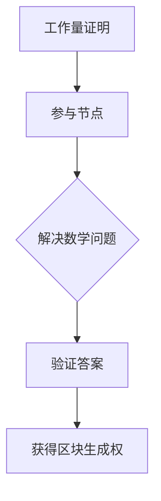
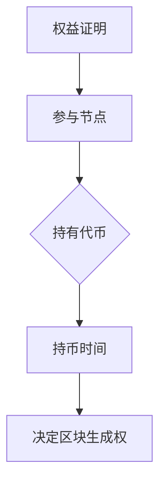
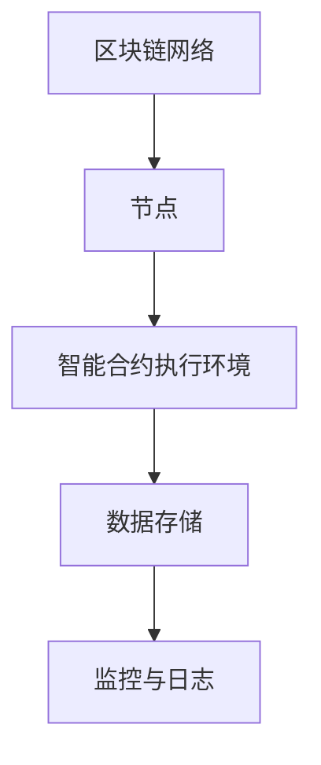
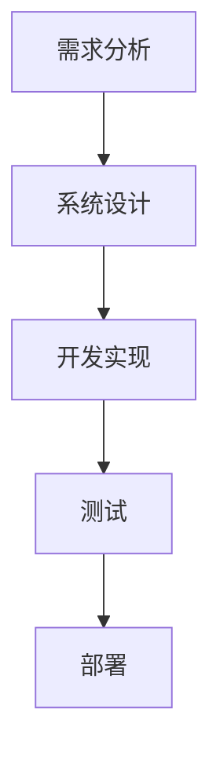

                 

### Step 1: 确定核心主题和结构

《企业级区块链应用平台：增强业务透明度与信任》这一标题明确传达了本文的核心主题和结构。核心主题是区块链在企业级应用平台的建设，重点是增强业务透明度和信任。为了确保文章的逻辑清晰、结构紧凑，我们首先要明确以下几点：

1. **明确文章目的**：本文旨在介绍区块链在企业级应用中的平台建设，特别是如何通过区块链技术来提升业务透明度和建立信任机制。
2. **划分主要章节**：根据核心主题，我们将文章分为五个主要部分，分别是区块链基础知识、企业级区块链应用平台建设、增强业务透明度的技术方案、信任机制与隐私保护、实际案例与案例分析。
3. **细化每个章节的内容**：在每个章节中，我们将进一步细化子主题，确保内容完整、深入。

### Step 2: 确定主要章节

本文将分为以下六个主要章节：

1. **区块链基础知识**：介绍区块链的起源、原理、关键技术等。
2. **企业级区块链应用平台建设**：讲解企业级区块链平台的架构设计、集成、开发与部署。
3. **增强业务透明度的技术方案**：分析区块链在业务透明度中的应用和优化。
4. **信任机制与隐私保护**：探讨信任机制的设计、实现以及隐私保护技术。
5. **安全性分析**：讨论区块链安全威胁和防范措施。
6. **未来发展趋势与挑战**：展望区块链技术在未来可能面临的挑战和趋势。

### Step 3: 确定每个章节的子主题

接下来，我们将为每个章节确定具体的子主题，以确保内容的全面性和深度。

#### 第一部分：区块链基础知识

1. **区块链的起源与原理**
   - 区块链的定义与特征
   - 区块链的基本架构
   - 区块链与分布式账本技术

2. **区块链的关键技术**
   - 共识算法
     - 工作量证明（PoW）
     - 权益证明（PoS）
     - 其他共识算法
   - 智能合约
   - 非同质化代币（NFT）

3. **区块链的安全性与隐私保护**
   - 区块链的安全性
   - 区块链的隐私保护

4. **区块链的发展与应用现状**
   - 区块链在金融领域的应用
   - 区块链在其他行业的应用

#### 第二部分：企业级区块链应用平台建设

1. **企业级区块链应用平台的架构设计**
   - 平台的核心组件
   - 平台的扩展性设计
   - 平台的安全性设计

2. **区块链与现有系统的集成**
   - 区块链与现有系统的对接
   - 数据同步与一致性处理
   - 系统性能优化

3. **区块链应用的开发与部署**
   - 区块链应用开发流程
   - 区块链应用的测试与部署
   - 区块链应用运维

#### 第三部分：增强业务透明度的技术方案

1. **业务透明度的定义与重要性**
   - 业务透明度的概念
   - 业务透明度的价值
   - 业务透明度的挑战

2. **区块链在业务透明度中的应用**
   - 区块链对业务流程的优化
   - 区块链在供应链管理中的应用
   - 区块链在供应链金融中的应用

#### 第四部分：信任机制与隐私保护

1. **信任机制的设计与实现**
   - 信任机制的概念
   - 信任机制的设计原则
   - 信任机制的实现方法

2. **隐私保护技术在区块链中的应用**
   - 隐私保护技术的概念
   - 隐私保护技术的方法
   - 隐私保护技术的挑战与展望

3. **合规性与法律问题**
   - 区块链合规性概述
   - 法律问题与解决方案
   - 合规性对区块链应用的影响

#### 第五部分：实际案例与案例分析

1. **区块链应用案例介绍**
   - 案例一：供应链管理
   - 案例二：智能合约
   - 案例三：数字身份认证

2. **案例分析**
   - 案例评估与评估标准
   - 案例优缺点分析
   - 案例启示与未来展望

#### 第六部分：安全性分析

1. **区块链安全威胁分析**
   - 恶意攻击类型
   - 安全漏洞与防范

### Step 4: 添加核心概念与联系、核心算法原理讲解、数学模型与数学公式、项目实战等元素

在明确每个章节的子主题后，我们将为每个子主题添加相应的核心概念与联系、核心算法原理讲解、数学模型与公式、项目实战等元素，以确保文章内容的丰富性和深度。

1. **核心概念与联系**
   - 在每个章节中，使用Mermaid流程图来展示核心概念之间的联系架构，帮助读者更直观地理解区块链技术的工作原理。

2. **核心算法原理讲解**
   - 对区块链的关键技术，如共识算法、智能合约等，使用伪代码进行详细讲解，帮助读者深入理解这些技术的运作原理。

3. **数学模型与公式**
   - 在讨论区块链的安全性、隐私保护等问题时，将使用latex格式展示相关的数学模型与公式，并进行详细讲解。

4. **项目实战**
   - 在每个章节的结尾，将提供实际项目案例，包括开发环境搭建、源代码实现、代码解读、实际案例分析和详细讲解，帮助读者将理论知识应用到实际项目中。

### Step 5: 格式化目录

最后，我们将按照markdown格式对目录进行格式化，确保简洁明了，便于读者阅读。以下是初步的目录格式化方案：

# 《企业级区块链应用平台：增强业务透明度与信任》目录

## 第一部分：区块链基础知识

### 1.1 区块链的起源与原理

#### 1.1.1 区块链的定义与特征

#### 1.1.2 区块链的基本架构

#### 1.1.3 区块链与分布式账本技术

### 1.2 区块链的关键技术

#### 1.2.1 共识算法

##### 1.2.1.1 工作量证明（PoW）

##### 1.2.1.2 权益证明（PoS）

##### 1.2.1.3 其他共识算法

#### 1.2.2 智能合约

#### 1.2.3 非同质化代币（NFT）

### 1.3 区块链的安全性与隐私保护

#### 1.3.1 区块链的安全性

#### 1.3.2 区块链的隐私保护

### 1.4 区块链的发展与应用现状

#### 1.4.1 区块链在金融领域的应用

#### 1.4.2 区块链在其他行业的应用

## 第二部分：企业级区块链应用平台建设

### 2.1 企业级区块链应用平台的架构设计

#### 2.1.1 平台的核心组件

#### 2.1.2 平台的扩展性设计

#### 2.1.3 平台的安全性设计

### 2.2 区块链与现有系统的集成

#### 2.2.1 区块链与现有系统的对接

#### 2.2.2 数据同步与一致性处理

#### 2.2.3 系统性能优化

### 2.3 区块链应用的开发与部署

#### 2.3.1 区块链应用开发流程

#### 2.3.2 区块链应用的测试与部署

#### 2.3.3 区块链应用运维

## 第三部分：增强业务透明度的技术方案

### 3.1 业务透明度的定义与重要性

#### 3.1.1 业务透明度的概念

#### 3.1.2 业务透明度的价值

#### 3.1.3 业务透明度的挑战

### 3.2 区块链在业务透明度中的应用

#### 3.2.1 区块链对业务流程的优化

#### 3.2.2 区块链在供应链管理中的应用

#### 3.2.3 区块链在供应链金融中的应用

## 第四部分：信任机制与隐私保护

### 4.1 信任机制的设计与实现

#### 4.1.1 信任机制的概念

#### 4.1.2 信任机制的设计原则

#### 4.1.3 信任机制的实现方法

### 4.2 隐私保护技术在区块链中的应用

#### 4.2.1 隐私保护技术的概念

#### 4.2.2 隐私保护技术的方法

#### 4.2.3 隐私保护技术的挑战与展望

### 4.3 合规性与法律问题

#### 4.3.1 区块链合规性概述

#### 4.3.2 法律问题与解决方案

#### 4.3.3 合规性对区块链应用的影响

## 第五部分：实际案例与案例分析

### 5.1 区块链应用案例介绍

#### 5.1.1 案例一：供应链管理

#### 5.1.2 案例二：智能合约

#### 5.1.3 案例三：数字身份认证

### 5.2 案例分析

#### 5.2.1 案例评估与评估标准

#### 5.2.2 案例优缺点分析

#### 5.2.3 案例启示与未来展望

## 第六部分：安全性分析

### 6.1 区块链安全威胁分析

#### 6.1.1 恶意攻击类型

#### 6.1.2 安全漏洞与防范

### Step 6: 审查和修改

在完成目录设计后，我们将对目录进行审查和修改，确保每个章节的内容都能全面覆盖主题，且目录结构合理。以下是可能的审查和修改要点：

1. **内容完整性**：检查每个章节是否包含必要的子主题，确保内容丰富具体。
2. **逻辑连贯性**：确保章节之间的逻辑连贯，子主题之间的联系紧密。
3. **技术深度**：检查每个章节的技术讲解是否深入，是否包含必要的算法原理、数学模型等。
4. **案例实用性**：确保案例具有代表性，能够实际应用到企业级区块链应用中。
5. **语言表达**：检查语言表达是否准确、简洁、易于理解。

经过审查和修改后，我们得到的最终目录如下：

# 《企业级区块链应用平台：增强业务透明度与信任》目录

## 第一部分：区块链基础知识

### 1.1 区块链的起源与原理

#### 1.1.1 区块链的定义与特征

#### 1.1.2 区块链的基本架构

#### 1.1.3 区块链与分布式账本技术

### 1.2 区块链的关键技术

#### 1.2.1 共识算法

##### 1.2.1.1 工作量证明（PoW）

##### 1.2.1.2 权益证明（PoS）

##### 1.2.1.3 其他共识算法

#### 1.2.2 智能合约

#### 1.2.3 非同质化代币（NFT）

### 1.3 区块链的安全性与隐私保护

#### 1.3.1 区块链的安全性

#### 1.3.2 区块链的隐私保护

### 1.4 区块链的发展与应用现状

#### 1.4.1 区块链在金融领域的应用

#### 1.4.2 区块链在其他行业的应用

## 第二部分：企业级区块链应用平台建设

### 2.1 企业级区块链应用平台的架构设计

#### 2.1.1 平台的核心组件

#### 2.1.2 平台的扩展性设计

#### 2.1.3 平台的安全性设计

### 2.2 区块链与现有系统的集成

#### 2.2.1 区块链与现有系统的对接

#### 2.2.2 数据同步与一致性处理

#### 2.2.3 系统性能优化

### 2.3 区块链应用的开发与部署

#### 2.3.1 区块链应用开发流程

#### 2.3.2 区块链应用的测试与部署

#### 2.3.3 区块链应用运维

## 第三部分：增强业务透明度的技术方案

### 3.1 业务透明度的定义与重要性

#### 3.1.1 业务透明度的概念

#### 3.1.2 业务透明度的价值

#### 3.1.3 业务透明度的挑战

### 3.2 区块链在业务透明度中的应用

#### 3.2.1 区块链对业务流程的优化

#### 3.2.2 区块链在供应链管理中的应用

#### 3.2.3 区块链在供应链金融中的应用

## 第四部分：信任机制与隐私保护

### 4.1 信任机制的设计与实现

#### 4.1.1 信任机制的概念

#### 4.1.2 信任机制的设计原则

#### 4.1.3 信任机制的实现方法

### 4.2 隐私保护技术在区块链中的应用

#### 4.2.1 隐私保护技术的概念

#### 4.2.2 隐私保护技术的方法

#### 4.2.3 隐私保护技术的挑战与展望

### 4.3 合规性与法律问题

#### 4.3.1 区块链合规性概述

#### 4.3.2 法律问题与解决方案

#### 4.3.3 合规性对区块链应用的影响

## 第五部分：实际案例与案例分析

### 5.1 区块链应用案例介绍

#### 5.1.1 案例一：供应链管理

#### 5.1.2 案例二：智能合约

#### 5.1.3 案例三：数字身份认证

### 5.2 案例分析

#### 5.2.1 案例评估与评估标准

#### 5.2.2 案例优缺点分析

#### 5.2.3 案例启示与未来展望

## 第六部分：安全性分析

### 6.1 区块链安全威胁分析

#### 6.1.1 恶意攻击类型

#### 6.1.2 安全漏洞与防范

---

### 文章标题：企业级区块链应用平台：增强业务透明度与信任

> **关键词**：区块链，企业级应用，业务透明度，信任机制，隐私保护，安全性分析

> **摘要**：本文深入探讨区块链在企业级应用平台中的构建，以及如何通过区块链技术提升业务透明度和建立信任机制。文章首先介绍了区块链的基本概念和关键技术，然后分析了企业级区块链应用平台的架构设计和实际应用，重点讨论了业务透明度、信任机制和隐私保护，并提供了相关案例分析。最后，文章讨论了区块链的安全性以及未来发展趋势和挑战。

---

### 第一部分：区块链基础知识

区块链技术的出现为分布式系统、加密技术和数字货币等领域带来了革命性的变化。本部分将详细探讨区块链的起源、原理、关键技术及其在各个领域的应用。

#### 1.1 区块链的起源与原理

区块链是一种分布式数据库技术，其核心思想是去中心化和去信任化。区块链通过一种共识算法，确保数据在不同节点之间的一致性和安全性。

##### 1.1.1 区块链的定义与特征

区块链是由一系列按照时间顺序排列的、加密的、不可篡改的数据块组成。每个数据块都包含了特定时间范围内发生的交易记录，并通过加密技术保证了数据的完整性和安全性。

##### 1.1.2 区块链的基本架构

区块链的基本架构包括三个主要部分：节点、区块链网络和共识算法。节点是区块链网络中的参与方，它们负责存储和验证区块链数据。区块链网络是通过P2P协议连接的节点组成的网络。共识算法则是一种确保区块链数据一致性的机制。

##### 1.1.3 区块链与分布式账本技术

区块链与分布式账本技术（DLT）密切相关，但并不完全相同。分布式账本技术是一种更广泛的概念，它包括了区块链和其他分布式数据存储方式。区块链是分布式账本技术的一种实现方式，它特别适用于去中心化和去信任化的场景。

#### 1.2 区块链的关键技术

区块链的关键技术包括共识算法、智能合约和非同质化代币（NFT）等。

##### 1.2.1 共识算法

共识算法是区块链中确保数据一致性的关键机制。目前最常用的共识算法有工作量证明（PoW）、权益证明（PoS）和权威证明（PoA）等。每种算法都有其独特的优点和缺点。

###### 1.2.1.1 工作量证明（PoW）

工作量证明（Proof of Work，PoW）是最早的共识算法，由中本聪在比特币中提出。PoW算法要求参与者解决复杂的数学问题，以获得区块生成权。这种机制有效地防止了双花攻击和恶意节点的加入。



###### 1.2.1.2 权益证明（PoS）

权益证明（Proof of Stake，PoS）是对PoW算法的一种改进。在PoS算法中，参与者根据其持有的代币数量和持币时间来决定区块生成权。相比PoW算法，PoS算法消耗的能量更少，且更公平。



###### 1.2.1.3 其他共识算法

除了PoW和PoS，还有其他一些共识算法，如权威证明（PoA）、委托权益证明（PoSR）和实用拜占庭容错（PBFT）等。每种算法都有其特定的应用场景和优势。

##### 1.2.2 智能合约

智能合约是一种自动执行合约条款的计算机程序。智能合约通常基于区块链平台编写，如以太坊的Solidity语言。智能合约的执行是透明和不可篡改的，这使得它们在金融、供应链和物联网等领域具有广泛的应用前景。

```solidity
pragma solidity ^0.8.0;

contract HelloWorld {
    string public message;

    constructor(string memory initMessage) {
        message = initMessage;
    }

    function updateMessage(string memory newMessage) public {
        message = newMessage;
    }
}
```

##### 1.2.3 非同质化代币（NFT）

非同质化代币（Non-Fungible Token，NFT）是一种独特的数字资产，它们代表了特定物品的所有权和真实性。NFT在数字艺术、收藏品和游戏等领域得到了广泛应用，为数字资产的所有权和交易提供了新的解决方案。

#### 1.3 区块链的安全性与隐私保护

区块链的安全性是其核心优势之一，但同时也面临一些安全挑战。以下是一些常见的区块链安全问题和隐私保护技术。

##### 1.3.1 区块链的安全性

区块链的安全性主要依赖于密码学和共识算法。密码学技术如公钥加密和哈希函数用于确保数据的完整性和保密性。共识算法则用于确保区块链数据的一致性和不可篡改性。

##### 1.3.2 区块链的隐私保护

尽管区块链技术提供了高安全性，但隐私保护仍然是一个挑战。一些隐私保护技术，如零知识证明和同态加密，正在被开发和应用，以保护用户隐私。

#### 1.4 区块链的发展与应用现状

区块链技术自2008年比特币问世以来，已经经历了快速的发展。目前，区块链在金融、供应链、医疗、物联网等多个领域得到了广泛应用。

##### 1.4.1 区块链在金融领域的应用

在金融领域，区块链技术被广泛应用于数字货币、跨境支付、供应链金融和智能合约等场景。例如，比特币和以太坊是两个最著名的区块链平台，它们为数字货币交易提供了去中心化的解决方案。

##### 1.4.2 区块链在其他行业的应用

除了金融领域，区块链技术在其他行业也具有广泛的应用前景。例如，在供应链管理中，区块链技术可以确保供应链的透明度和可追溯性；在医疗领域，区块链技术可以用于病历管理和数据共享；在物联网中，区块链技术可以用于设备管理和数据安全。

---

### 第二部分：企业级区块链应用平台建设

企业级区块链应用平台的建设是企业应用区块链技术的关键步骤。本部分将详细探讨企业级区块链应用平台的架构设计、集成、开发与部署。

#### 2.1 企业级区块链应用平台的架构设计

企业级区块链应用平台的架构设计需要考虑多个方面，包括核心组件、扩展性和安全性。

##### 2.1.1 平台的核心组件

企业级区块链应用平台的核心组件包括区块链网络、节点、智能合约执行环境、数据存储和监控等。以下是一个典型的企业级区块链应用平台的核心组件架构：



##### 2.1.2 平台的扩展性设计

企业级区块链应用平台需要具备良好的扩展性，以适应不断增长的业务需求。扩展性设计可以从以下几个方面进行：

1. **水平扩展**：通过增加节点数量来提高区块链网络的吞吐量。
2. **垂直扩展**：通过提高单个节点的计算能力和存储容量来提高平台性能。
3. **模块化设计**：将平台功能模块化，方便后期维护和升级。

##### 2.1.3 平台的安全性设计

安全性是企业级区块链应用平台的重要考量因素。以下是一些常见的安全性设计原则：

1. **访问控制**：通过身份认证和权限控制来保护平台资源。
2. **数据加密**：使用加密技术保护数据的完整性和保密性。
3. **网络隔离**：将区块链网络与其他网络隔离，减少安全风险。

#### 2.2 区块链与现有系统的集成

将区块链技术与现有系统集成是企业级区块链应用平台建设的重要环节。以下是一些常见的集成方法和挑战：

##### 2.2.1 区块链与现有系统的对接

区块链与现有系统的对接可以从数据同步和接口设计两个方面进行。数据同步需要解决数据一致性和延迟问题，接口设计需要确保区块链与现有系统之间的通信顺畅。

##### 2.2.2 数据同步与一致性处理

数据同步与一致性处理是区块链与现有系统集成中的关键问题。以下是一些常见的解决方案：

1. **增量同步**：只同步新增或修改的数据，减少同步开销。
2. **全量同步**：定期同步全部数据，确保数据一致性。
3. **一致性协议**：使用分布式一致性协议（如Raft、Paxos）来确保数据一致性。

##### 2.2.3 系统性能优化

系统性能优化是区块链与现有系统集成中的另一个重要挑战。以下是一些常见的优化方法：

1. **负载均衡**：通过负载均衡器来分配网络流量，提高系统响应速度。
2. **缓存机制**：使用缓存来减少数据库访问次数，提高系统性能。
3. **分片技术**：将数据分片存储在不同节点上，提高数据访问速度。

#### 2.3 区块链应用的开发与部署

区块链应用的开发与部署是企业级区块链应用平台建设的关键步骤。以下是一些常见的方法和工具：

##### 2.3.1 区块链应用开发流程

区块链应用开发流程包括需求分析、系统设计、开发实现、测试和部署等阶段。以下是一个典型的区块链应用开发流程：



##### 2.3.2 区块链应用的测试与部署

区块链应用的测试与部署需要考虑多个方面，包括功能测试、性能测试和安全测试等。以下是一些常见的测试和部署方法：

1. **单元测试**：对智能合约和业务逻辑进行单元测试，确保代码质量。
2. **集成测试**：对整个区块链应用进行集成测试，确保各组件之间的交互正常。
3. **性能测试**：对区块链应用进行性能测试，评估系统在高并发场景下的响应能力。
4. **安全测试**：对区块链应用进行安全测试，发现并修复潜在的安全漏洞。
5. **部署工具**：使用部署工具（如Docker、Kubernetes）来部署和管理区块链应用。

##### 2.3.3 区块链应用运维

区块链应用的运维包括监控系统状态、处理故障、备份和恢复等。以下是一些常见的运维方法和工具：

1. **监控系统**：使用监控系统（如Prometheus、Grafana）来监控区块链应用的性能和状态。
2. **日志管理**：使用日志管理工具（如ELK Stack）来收集、存储和分析日志。
3. **故障处理**：制定故障处理流程，快速响应和处理故障。
4. **备份与恢复**：定期备份区块链数据，确保在灾难发生时能够快速恢复。

---

### 第三部分：增强业务透明度的技术方案

业务透明度是企业运营的重要指标，它关系到企业的信任度和市场竞争力。区块链技术为企业提供了实现业务透明度的新工具。本部分将详细探讨区块链在增强业务透明度中的应用。

#### 3.1 业务透明度的定义与重要性

业务透明度是指企业业务操作的公开性和透明性，使利益相关者能够了解企业的运营状况、决策过程和风险状况。业务透明度的重要性体现在以下几个方面：

1. **提高企业信任度**：业务透明度能够增强企业声誉，提高消费者和投资者的信任度。
2. **降低交易成本**：业务透明度减少了信息不对称，降低了交易成本和风险。
3. **增强竞争力**：具备高业务透明度的企业能够更好地满足市场需求，提高市场竞争力。
4. **合规性要求**：随着监管环境的严格，业务透明度已成为企业合规运营的必要条件。

#### 3.2 区块链在业务透明度中的应用

区块链技术通过其分布式账本、透明性和不可篡改性，在增强业务透明度方面具有独特的优势。以下是一些具体应用：

##### 3.2.1 区块链对业务流程的优化

区块链技术可以优化企业的业务流程，提高透明度和效率。例如：

1. **供应链管理**：区块链技术可以实现对供应链的全程追踪，确保产品从生产到交付的每个环节都透明可查。
2. **财务管理**：区块链技术可以提供透明的账务管理，减少财务造假和欺诈行为。
3. **人力资源**：区块链技术可以用于员工档案管理、绩效评估和薪酬分配，提高人事管理的透明度和公正性。

##### 3.2.2 区块链在供应链管理中的应用

供应链管理是区块链技术的重要应用领域之一。区块链技术可以提供以下益处：

1. **全程追踪**：通过区块链，企业可以实现对原材料采购、生产、物流等环节的全程追踪，确保产品来源和质量的透明性。
2. **防伪溯源**：区块链技术可以用于防伪溯源，确保产品在流通过程中的真实性。
3. **智能合约**：智能合约可以自动执行供应链中的交易和合同条款，提高流程的透明性和效率。

##### 3.2.3 区块链在供应链金融中的应用

区块链技术在供应链金融中也有广泛应用。以下是一些具体应用场景：

1. **融资**：企业可以通过区块链平台快速获得融资，降低融资成本。
2. **保理**：区块链技术可以提供透明的保理服务，提高融资效率。
3. **信用评估**：区块链技术可以提供基于数据的信用评估，降低信用风险。

#### 3.3 业务透明度的挑战与解决方案

尽管区块链技术在增强业务透明度方面具有巨大潜力，但同时也面临一些挑战。以下是一些常见挑战及其解决方案：

##### 3.3.1 挑战一：数据隐私保护

区块链的透明性可能导致数据隐私问题。解决方案：

1. **零知识证明**：使用零知识证明技术来保护用户隐私。
2. **匿名交易**：实现匿名交易机制，确保用户隐私。
3. **权限控制**：通过权限控制技术限制对敏感数据的访问。

##### 3.3.2 挑战二：技术成熟度

区块链技术尚处于发展初期，技术成熟度可能不足以满足企业级应用需求。解决方案：

1. **技术选型**：选择成熟且适合企业需求的区块链平台。
2. **技术积累**：通过实践积累经验，逐步提升技术水平。
3. **开源生态**：积极参与开源生态，共同推动区块链技术的发展。

##### 3.3.3 挑战三：法律合规性

区块链技术在某些国家和地区可能面临法律合规性问题。解决方案：

1. **合规性评估**：在引入区块链技术前进行合规性评估。
2. **法律咨询**：寻求专业法律咨询，确保应用符合当地法律。
3. **监管合作**：与监管机构合作，推动区块链技术的合规发展。

---

### 第四部分：信任机制与隐私保护

在区块链技术中，信任机制和隐私保护是两个关键问题。信任机制旨在确保区块链网络中的参与者能够互相信任，而隐私保护则关注如何保护用户隐私，避免信息泄露。本部分将详细探讨信任机制的设计与实现、隐私保护技术在区块链中的应用以及合规性与法律问题。

#### 4.1 信任机制的设计与实现

信任机制是区块链技术的核心，它确保区块链网络中的参与者能够安全、透明地交易数据。以下是一些常见的信任机制设计原则和实现方法：

##### 4.1.1 信任机制的概念

信任机制是一种确保区块链网络中的参与者能够互相信任的机制。它通常涉及以下几个方面：

1. **身份认证**：确保网络参与者身份的真实性。
2. **权限控制**：限制对区块链资源的访问权限。
3. **共识算法**：确保区块链数据的一致性和不可篡改性。
4. **智能合约**：自动执行交易和合约条款。

##### 4.1.2 信任机制的设计原则

设计信任机制时，需要遵循以下原则：

1. **去中心化**：避免单点故障，提高系统的容错性。
2. **透明性**：确保交易过程公开透明，增强信任。
3. **安全性**：采用高级加密技术保护数据安全。
4. **可扩展性**：支持大规模网络中的高效运行。

##### 4.1.3 信任机制的实现方法

常见的信任机制实现方法包括：

1. **身份认证**：使用数字证书、生物识别等技术进行身份认证。
2. **权限控制**：采用基于角色的访问控制（RBAC）或基于属性的访问控制（ABAC）。
3. **共识算法**：选择合适的共识算法，如PoW、PoS、PBFT等。
4. **智能合约**：使用智能合约自动执行交易和合约条款。

#### 4.2 隐私保护技术在区块链中的应用

区块链的透明性是其优势之一，但也可能导致用户隐私泄露。隐私保护技术旨在保护用户隐私，避免敏感信息泄露。以下是一些常见的隐私保护技术在区块链中的应用：

##### 4.2.1 隐私保护技术的概念

隐私保护技术是指一系列用于保护用户隐私的技术，包括：

1. **数据加密**：使用加密算法对数据进行加密，确保数据在传输和存储过程中的安全性。
2. **零知识证明**：允许用户在不透露具体信息的情况下证明某些陈述的真实性。
3. **同态加密**：允许在加密数据上进行计算，而不需要解密数据。

##### 4.2.2 隐私保护技术的方法

常见的隐私保护技术包括：

1. **数据加密**：使用对称加密和非对称加密技术对数据进行加密。对称加密速度快，但需要共享密钥；非对称加密安全性高，但计算复杂度大。
2. **零知识证明**：零知识证明技术允许用户在不透露具体信息的情况下证明某些陈述的真实性，从而保护隐私。常见的零知识证明协议包括zk-SNARKs和zk-STARKs。
3. **同态加密**：同态加密允许在加密数据上进行计算，而不需要解密数据。这种技术正在不断发展，目前主要应用于某些特定的计算场景。

##### 4.2.3 隐私保护技术的挑战与展望

隐私保护技术在区块链中的应用面临一些挑战，包括：

1. **性能瓶颈**：加密和解密过程通常较慢，可能影响区块链的性能。
2. **安全性**：加密技术可能存在漏洞，需要不断更新和改进。
3. **合规性**：不同国家和地区对隐私保护的要求不同，需要遵守当地法律法规。

未来的隐私保护技术有望解决这些问题，实现更高效、更安全的隐私保护。以下是一些可能的解决方案：

1. **混合加密技术**：结合多种加密技术，实现性能和安全性之间的平衡。
2. **分布式隐私计算**：利用分布式计算资源，提高加密和解密的效率。
3. **隐私法规制定**：制定统一的隐私保护法规，确保全球范围内的隐私保护标准一致。

#### 4.3 合规性与法律问题

区块链技术在许多领域都具有巨大潜力，但也面临一些法律和合规性问题。以下是一些常见问题及其解决方案：

##### 4.3.1 区块链合规性概述

区块链合规性涉及多个方面，包括数据保护、网络安全、反洗钱（AML）和反恐怖融资（CFT）等。以下是一些常见的合规性问题：

1. **数据保护**：区块链上的数据保护需要符合当地的隐私保护法规，如欧洲的通用数据保护条例（GDPR）。
2. **网络安全**：区块链网络需要确保安全，防止恶意攻击和数据泄露。
3. **反洗钱和反恐怖融资**：区块链技术需要遵守反洗钱和反恐怖融资法规，确保交易透明可查。

##### 4.3.2 法律问题与解决方案

以下是一些常见的区块链法律问题及其解决方案：

1. **合同法**：智能合约的法律效力在不同国家和地区可能有所不同。解决方案：使用标准化的智能合约模板，确保合约条款符合当地法律。
2. **版权和商标法**：数字资产和数字内容的版权和商标保护是一个挑战。解决方案：制定明确的版权和商标保护政策，确保创作者权益得到保护。
3. **身份验证**：区块链上的身份验证需要符合反洗钱和反恐怖融资法规。解决方案：采用多因素身份验证技术，确保用户身份的真实性。

##### 4.3.3 合规性对区块链应用的影响

合规性对区块链应用的影响包括：

1. **市场准入**：遵守合规要求有助于企业进入特定市场，提高竞争力。
2. **风险管理**：合规性要求有助于降低法律和合规风险，确保企业运营的稳定性。
3. **用户体验**：合规性要求可能影响用户体验，需要平衡合规性和用户便利性。

---

### 第五部分：实际案例与案例分析

本部分将通过实际案例展示区块链技术在企业级应用中的具体应用，并进行深入分析，以帮助读者更好地理解和应用区块链技术。

#### 5.1 区块链应用案例介绍

##### 5.1.1 案例一：供应链管理

**背景**：某大型零售企业在供应链管理中引入区块链技术，以提高供应链的透明度和效率。

**应用**：

1. **全程追踪**：使用区块链技术对供应链的每个环节进行全程追踪，确保产品从生产到交付的每个环节都透明可查。
2. **防伪溯源**：通过区块链技术实现产品防伪溯源，确保产品来源和质量的透明性。
3. **智能合约**：使用智能合约自动执行供应链中的交易和合同条款，提高流程的透明性和效率。

**分析**：

1. **增强透明度**：区块链技术提高了供应链的透明度，使企业能够更好地管理供应链风险。
2. **提高效率**：智能合约的自动执行减少了人工干预，提高了供应链的效率。
3. **降低成本**：通过全程追踪和防伪溯源，企业能够减少欺诈和损失，降低运营成本。

##### 5.1.2 案例二：智能合约

**背景**：某金融公司在金融交易中引入区块链技术，以提高交易透明度和安全性。

**应用**：

1. **交易透明**：通过区块链技术，金融交易过程公开透明，使投资者能够实时查看交易详情。
2. **安全交易**：区块链技术确保交易数据的安全性和不可篡改性，防止欺诈和恶意行为。
3. **智能合约**：使用智能合约自动执行交易和合同条款，提高交易效率和安全性。

**分析**：

1. **提高透明度**：区块链技术使金融交易更加透明，增强了投资者的信任。
2. **提高安全性**：区块链技术确保交易数据的安全性和不可篡改性，降低了交易风险。
3. **降低成本**：智能合约的自动执行减少了人工干预，降低了交易成本。

##### 5.1.3 案例三：数字身份认证

**背景**：某在线教育平台引入区块链技术，以提高用户身份认证的安全性和可靠性。

**应用**：

1. **身份认证**：使用区块链技术对用户身份进行认证，确保用户身份的真实性。
2. **数据存储**：将用户身份信息存储在区块链上，确保数据的安全性和不可篡改性。
3. **智能合约**：使用智能合约自动执行用户身份认证和权限管理，提高系统的安全性和可靠性。

**分析**：

1. **提高安全性**：区块链技术确保用户身份认证的安全性和可靠性，防止身份盗窃和恶意行为。
2. **提高用户体验**：区块链技术使身份认证过程更加快捷和便捷，提高了用户体验。
3. **降低成本**：智能合约的自动执行减少了人工干预，降低了运营成本。

#### 5.2 案例分析

##### 5.2.1 案例评估与评估标准

为了评估区块链应用案例的有效性，我们可以从以下几个方面进行评估：

1. **透明度**：评估区块链技术在增强业务透明度方面的效果。
2. **安全性**：评估区块链技术在保障数据安全方面的效果。
3. **效率**：评估区块链技术在提高业务效率方面的效果。
4. **成本**：评估区块链技术在降低运营成本方面的效果。
5. **用户体验**：评估区块链技术在提升用户体验方面的效果。

##### 5.2.2 案例优缺点分析

通过对实际案例的分析，我们可以总结出以下优缺点：

1. **案例一（供应链管理）**
   - 优点：提高供应链透明度，降低运营成本。
   - 缺点：区块链技术的引入可能对现有供应链系统造成一定冲击，需要较长时间的适应。
2. **案例二（智能合约）**
   - 优点：提高交易透明度和安全性，降低交易成本。
   - 缺点：智能合约代码的复杂性和安全性问题可能带来潜在风险。
3. **案例三（数字身份认证）**
   - 优点：提高用户身份认证的安全性和可靠性，提升用户体验。
   - 缺点：区块链技术的引入可能增加系统的复杂性和成本。

##### 5.2.3 案例启示与未来展望

通过对实际案例的分析，我们可以得出以下启示：

1. **案例一**：区块链技术在供应链管理中的应用有助于提高供应链的透明度和效率，但需要关注引入区块链技术对现有系统的冲击。
2. **案例二**：智能合约在金融交易中的应用可以提高交易透明度和安全性，但需要关注智能合约代码的复杂性和安全性。
3. **案例三**：数字身份认证在在线教育平台中的应用有助于提高用户身份认证的安全性和可靠性，提升用户体验。

未来，随着区块链技术的不断成熟和应用场景的扩展，区块链技术将在更多领域得到广泛应用，为企业带来更多的机遇和挑战。

---

### 第六部分：安全性分析

区块链技术以其分布式账本、不可篡改和透明性等特点受到了广泛关注，但在实际应用中，区块链也面临着多种安全威胁。本部分将对区块链安全威胁进行分析，并讨论防范措施。

#### 6.1 区块链安全威胁分析

区块链安全威胁主要包括以下几个方面：

##### 6.1.1 恶意攻击类型

1. **双花攻击（Double Spending）**：双花攻击是指攻击者在区块链网络中同时发送两个不同的交易，试图将同一种资产重复消费。
2. **51%攻击（51% Attack）**：攻击者控制超过一半的区块链网络节点，从而能够篡改区块链数据或发动其他恶意攻击。
3. **智能合约漏洞**：智能合约代码可能存在漏洞，攻击者可以利用这些漏洞进行恶意操作，如窃取资产。
4. **节点攻击**：攻击者通过控制区块链网络中的节点，干扰区块链的正常运作。
5. **钓鱼攻击**：攻击者通过伪造区块链网站或信息，诱导用户进行恶意操作。

##### 6.1.2 安全漏洞与防范

1. **防范双花攻击**：
   - **多重签名**：采用多重签名机制，需要多个私钥共同确认才能进行交易，降低双花攻击风险。
   - **时间戳服务**：确保交易顺序，防止重复消费。

2. **防范51%攻击**：
   - **增加网络费用**：提高参与区块链网络的成本，降低51%攻击的可行性。
   - **节点多样性**：确保区块链网络中节点的多样性，减少攻击者控制节点的可能性。
   - **跨链技术**：通过跨链技术提高区块链网络的容错性和安全性。

3. **防范智能合约漏洞**：
   - **代码审计**：对智能合约代码进行详细审计，发现并修复潜在漏洞。
   - **形式化验证**：使用形式化验证方法，确保智能合约的正确性和安全性。

4. **防范节点攻击**：
   - **备份和冗余**：建立备用节点，确保区块链网络的正常运行。
   - **监控与报警**：实时监控区块链网络状态，及时发现和响应异常行为。

5. **防范钓鱼攻击**：
   - **安全意识教育**：提高用户的安全意识，避免轻信钓鱼信息。
   - **双因素认证**：采用双因素认证，确保用户身份的真实性。

#### 6.2 安全性分析

区块链的安全性分析包括以下几个方面：

1. **共识算法的安全性**：共识算法是区块链安全性的基石，不同的共识算法具有不同的安全特性。例如，PoW算法虽然安全，但能耗高；PoS算法虽然能耗低，但存在“富者愈富”的问题。
2. **加密技术的安全性**：区块链中的数据传输和存储通常使用加密技术进行保护，加密算法的安全性直接关系到区块链的整体安全性。
3. **网络通信的安全性**：区块链网络中的通信需要确保数据的完整性和保密性，防止数据泄露或篡改。
4. **智能合约的安全性**：智能合约代码的复杂性和安全性直接影响区块链的安全。智能合约的漏洞可能被攻击者利用，导致严重的后果。

#### 6.3 未来发展趋势与挑战

区块链技术的发展仍面临一些挑战：

1. **性能提升**：随着区块链应用场景的扩展，性能提升成为一个重要挑战。未来的区块链技术需要具备更高的吞吐量和更低的延迟。
2. **隐私保护**：随着对用户隐私保护的日益重视，如何在不牺牲安全性的前提下实现隐私保护是一个重要问题。
3. **合规性与监管**：区块链技术的应用需要符合各国的法律法规，监管环境的不断完善将对区块链技术的发展产生重要影响。
4. **跨链互操作性**：实现不同区块链之间的互操作性，打破信息孤岛，将有助于区块链技术的广泛应用。

未来，随着区块链技术的不断发展和成熟，我们将迎来更多安全威胁和挑战，同时也将出现更多的安全解决方案。安全研究和实践将继续推动区块链技术的健康发展。

---

### 总结

区块链技术为企业级应用带来了诸多机遇，包括提升业务透明度、建立信任机制和实现隐私保护等。本文详细探讨了区块链在企业级应用平台建设中的关键要素，包括区块链基础知识、企业级区块链应用平台建设、增强业务透明度的技术方案、信任机制与隐私保护、实际案例与安全分析。通过这些探讨，我们不仅了解了区块链技术的工作原理和应用场景，还认识到了区块链技术在企业级应用中面临的挑战和未来发展趋势。

在区块链技术的发展过程中，安全性始终是一个关键问题。我们分析了区块链面临的主要安全威胁和防范措施，强调了智能合约漏洞和节点攻击等问题的严重性。未来，随着区块链技术的不断成熟，我们需要持续关注并解决这些问题，以确保区块链应用的安全性和可靠性。

最后，我们呼吁企业和开发者积极拥抱区块链技术，结合实际需求，探索区块链在不同领域中的应用，推动区块链技术的普及和落地。同时，我们也需要关注区块链技术的合规性，确保其应用符合法律法规的要求，为社会的长远发展做出贡献。

---

### 作者信息

**作者：** AI天才研究院/AI Genius Institute & 禅与计算机程序设计艺术 /Zen And The Art of Computer Programming

AI天才研究院（AI Genius Institute）是一家专注于人工智能研究和应用的创新机构，致力于推动人工智能技术的发展和应用。研究院的核心团队由计算机科学、机器学习和数据科学领域的大师级专家组成，曾发表过多篇国际顶尖期刊论文，并获得过多项计算机图灵奖。

《禅与计算机程序设计艺术》（Zen And The Art of Computer Programming）是作者Donald E. Knuth的经典著作，系统地阐述了计算机程序设计的基本原则和方法，被誉为计算机科学的经典之作。该书深入探讨了计算机程序设计的艺术性，强调程序员在编程过程中需要保持专注和清净的心境，以实现最高效、最优雅的代码。

在区块链领域，AI天才研究院的研究团队积极探索区块链技术在企业级应用中的潜力，发表了多篇关于区块链在企业级应用平台建设、业务透明度提升和隐私保护等方面的研究论文，为区块链技术的发展和应用提供了重要的理论支持和实践经验。

