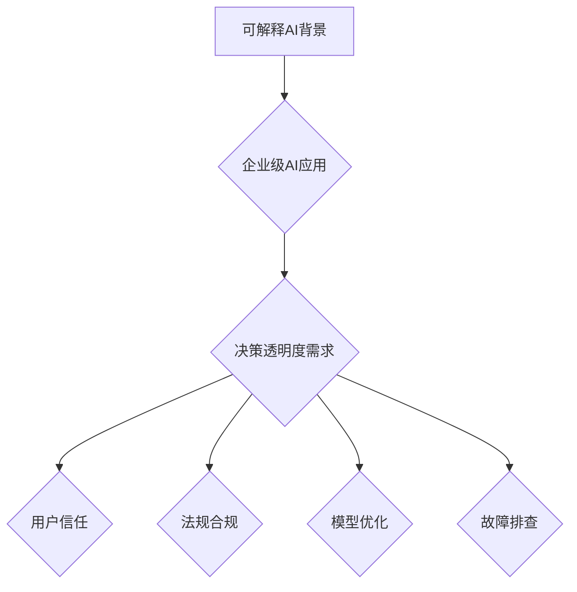
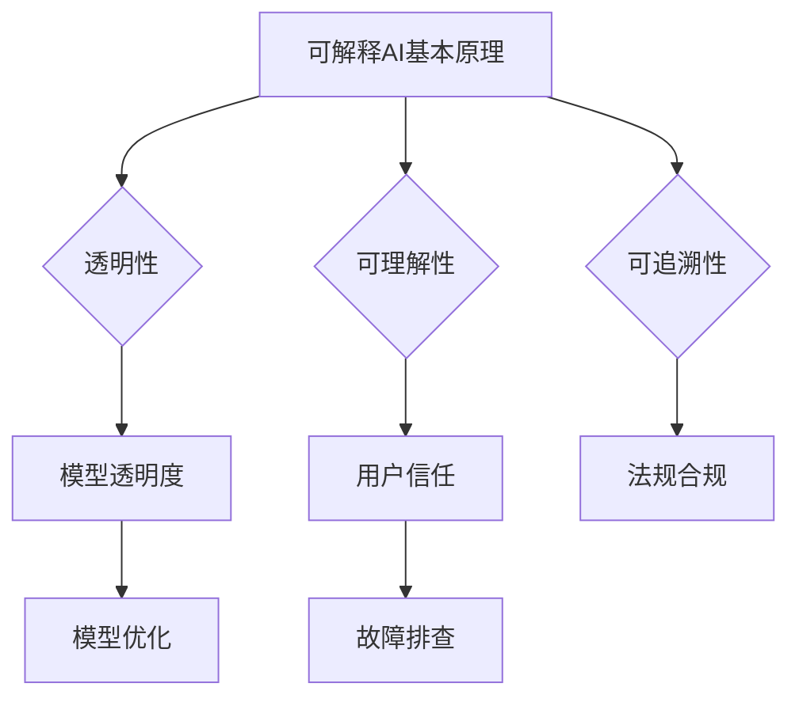

                 

### 文章标题

《企业级可解释AI：增强决策透明度》

### 关键词

- 企业级AI
- 可解释性
- 决策透明度
- 模型解释性
- 实际案例

### 摘要

本文深入探讨企业级AI中的可解释性及其重要性，分析了当前企业在AI应用中面临的决策透明度挑战。通过介绍可解释AI的基本原理、技术栈和应用实例，文章旨在为企业提供实施可解释AI的指导，以增强决策过程的透明度和可靠性。本文还探讨了未来可解释AI技术的发展趋势，帮助企业更好地应对未来的AI需求。

### 目录

## 引言

### 1.1 可解释AI的定义和背景

### 1.2 企业级AI与决策透明度的关系

## 可解释AI基础

### 2.1 可解释AI的基本原理

### 2.2 可解释性与模型透明度的比较

### 2.3 可解释AI的关键概念

## 可解释AI技术栈

### 3.1 特征可解释性方法

### 3.2 局部可解释性方法

### 3.3 全局可解释性方法

### 3.4 可解释AI工具与框架

## 企业级AI应用中的挑战

### 4.1 数据隐私和合规性

### 4.2 复杂模型的解释性需求

### 4.3 面向企业的可解释AI解决方案

## 实施可解释AI

### 5.1 可解释AI的项目流程

### 5.2 实施中的常见问题和解决方案

### 5.3 成功案例分享

## 工具与框架

### 6.1 开源可解释AI工具介绍

### 6.2 定制化可解释AI工具开发

## 未来展望

### 7.1 可解释AI技术趋势

### 7.2 企业如何适应未来的可解释AI需求

### 作者

作者：AI天才研究院/AI Genius Institute & 禅与计算机程序设计艺术 /Zen And The Art of Computer Programming

---

### 引言

#### 1.1 可解释AI的定义和背景

可解释AI（Explainable AI，简称XAI）是近年来人工智能领域的重要研究方向。随着深度学习模型在企业级应用中的普及，AI系统的决策过程变得越来越复杂，透明度问题也日益凸显。可解释AI旨在提高AI模型的透明度和可解释性，使人类用户能够理解和信任AI系统的决策过程。

可解释AI的背景可以追溯到早期的人工智能系统，当时简单的规则和逻辑系统容易理解和解释。然而，随着人工智能技术的发展，特别是深度学习模型的出现，模型变得复杂且高度非线性，决策过程难以解释。这种情况下，企业用户和监管机构对AI系统的透明度和可靠性提出了更高的要求。

#### 1.2 企业级AI与决策透明度的关系

企业级AI在各个行业都得到了广泛应用，如金融、医疗、零售等。然而，这些应用往往涉及敏感数据和关键业务决策，因此决策透明度至关重要。决策透明度不仅有助于提高用户对AI系统的信任，还能帮助企业在法规合规性方面降低风险。

在企业级AI应用中，决策透明度主要体现在以下几个方面：

1. **用户信任**：透明的决策过程可以提高用户对AI系统的信任，特别是在涉及用户隐私和财务数据的应用中。
2. **监管合规**：许多行业（如金融和医疗）有严格的法规要求，要求企业透明地展示其AI系统的决策过程。
3. **模型优化**：了解AI系统的决策过程可以帮助数据科学家更好地优化模型，提高其性能和可解释性。
4. **故障排查**：当AI系统出现问题时，透明的决策过程有助于快速定位和解决问题。

#### 1.3 本文结构

本文将按照以下结构展开：

1. **可解释AI基础**：介绍可解释AI的基本原理和关键概念。
2. **可解释AI技术栈**：详细探讨不同的可解释性方法及其应用。
3. **企业级AI应用中的挑战**：分析企业级AI应用中的可解释性挑战和解决方案。
4. **实施可解释AI**：讨论可解释AI项目的实施流程和常见问题。
5. **工具与框架**：介绍开源和定制化可解释AI工具。
6. **未来展望**：探讨可解释AI技术的发展趋势和企业的适应策略。

### Mermaid 流程图



---

在下一部分，我们将深入探讨可解释AI的基本原理和关键概念。通过理解这些原理，我们将为后续的讨论和案例分析奠定基础。

### 可解释AI基础

#### 2.1 可解释AI的基本原理

可解释AI的核心目标是提高AI模型的透明度和可解释性，使其决策过程能够被人类理解和信任。这与传统的不可解释模型（如深度神经网络）形成鲜明对比。不可解释模型在处理复杂任务时往往表现出色，但其内部机制难以解释，这给实际应用带来了诸多挑战。

可解释AI的基本原理可以从以下几个方面进行阐述：

1. **透明性**：透明性是指AI模型的决策过程和内部机制可以被清晰、准确地描述。这有助于用户理解模型的决策依据，从而增强对模型的信任。
2. **可理解性**：可理解性是指AI模型对非技术背景的用户也是可解释的。这意味着模型不仅要对数据科学家和AI专家透明，还要对一般用户和业务决策者透明。
3. **可追溯性**：可追溯性是指AI模型能够记录和回溯其决策过程，以便在出现问题时进行故障排查和优化。

#### 2.2 可解释性与模型透明度的比较

可解释性与模型透明度是两个相关但不同的概念。透明度通常指模型内部结构的可见性，而可解释性则更关注模型决策过程的可理解性。

1. **透明度**：透明度关注模型的结构和参数，如线性模型中的权重和偏置。透明的模型结构有助于用户理解模型的内部机制。
2. **可解释性**：可解释性关注模型决策过程的逻辑和依据，如为什么某个预测结果是正确的。可解释的模型能够提供决策背后的原因，从而增强用户对模型的信任。

#### 2.3 可解释AI的关键概念

在深入探讨可解释AI之前，我们需要了解一些关键概念：

1. **模型可解释性**：模型可解释性是指模型在决策过程中是否具有明确的解释性。高可解释性的模型通常更容易被用户理解和信任。
2. **局部可解释性**：局部可解释性关注模型在特定输入或特定输出下的解释性。例如，在图像分类任务中，局部可解释性可以帮助解释模型为什么将某个特定图像分类为特定类别。
3. **全局可解释性**：全局可解释性关注模型在整个数据集上的解释性。全局可解释性可以帮助用户理解模型在整体上的决策逻辑和性能。
4. **可理解性**：可理解性是指模型对非技术背景的用户也是可解释的。这意味着模型不仅要对数据科学家和AI专家透明，还要对一般用户和业务决策者透明。
5. **模型复用性**：模型复用性是指模型在多个任务和环境中是否具有一致的可解释性。高复用性的模型可以节省开发时间和成本。

#### 2.4 可解释AI的应用场景

可解释AI在多个领域都有广泛的应用，以下是一些典型的应用场景：

1. **金融**：在金融行业中，可解释AI可以帮助监管机构评估和监督金融机构的AI模型，确保其合规性和透明度。
2. **医疗**：在医疗领域，可解释AI可以帮助医生和患者理解诊断结果和治疗方案，提高医疗决策的透明度。
3. **零售**：在零售行业，可解释AI可以帮助商家了解消费者行为，优化产品推荐和营销策略。
4. **公共安全**：在公共安全领域，可解释AI可以帮助政府和执法机构监控和预测犯罪行为，提高公共安全。
5. **自动化**：在自动化系统中，可解释AI可以帮助工程师理解和优化自动化流程，提高系统的可靠性和效率。

#### 2.5 可解释AI的优势和挑战

**优势：**

- **提高用户信任**：透明的决策过程可以提高用户对AI系统的信任，从而促进更广泛的应用。
- **法规合规性**：许多行业有严格的法规要求，要求企业透明地展示其AI系统的决策过程。
- **模型优化**：了解AI系统的决策过程可以帮助数据科学家更好地优化模型，提高其性能和可解释性。
- **故障排查**：透明的决策过程有助于快速定位和解决问题，提高系统的可靠性和稳定性。

**挑战：**

- **计算成本**：许多可解释AI方法需要额外的计算资源，可能会影响模型性能。
- **实现难度**：可解释AI的实现往往比传统的不可解释模型更复杂，需要更多的技术和专业知识。
- **评估标准**：目前还没有统一的评估标准来衡量AI系统的可解释性，这给实际应用带来了挑战。

#### 2.6 可解释AI的方法和技术

可解释AI的方法和技术多种多样，主要包括以下几种：

1. **特征可解释性**：通过分析模型中每个特征的贡献来提高模型的可解释性。
2. **局部可解释性**：通过局部解释方法（如LIME、SHAP等）来解释模型在特定输入或特定输出下的决策过程。
3. **全局可解释性**：通过全局解释方法（如决策树、线性模型等）来解释模型在整个数据集上的决策逻辑和性能。
4. **可视化**：通过可视化技术（如决策树、热图等）来展示模型的结构和决策过程。
5. **工具和框架**：有许多开源工具和框架（如LIME、SHAP、ELI5等）可以帮助实现和评估可解释AI模型。

### Mermaid 流程图



在下一部分，我们将详细探讨可解释AI的技术栈，包括特征可解释性、局部可解释性和全局可解释性方法。通过这些技术，我们将能够更深入地理解AI模型的决策过程，提高其可解释性。

### 可解释AI技术栈

在了解了可解释AI的基本原理和关键概念之后，我们将深入探讨可解释AI的技术栈，包括特征可解释性、局部可解释性和全局可解释性方法。这些方法在不同的应用场景中发挥着重要作用，有助于提高AI模型的可解释性。

#### 3.1 特征可解释性方法

特征可解释性方法关注的是模型中每个特征的贡献。通过分析每个特征的重要性，用户可以理解模型是如何利用这些特征来做出决策的。以下是一些常用的特征可解释性方法：

1. **特征重要性**：通过分析特征的重要性来提高模型的可解释性。例如，在决策树模型中，可以通过计算每个特征在决策过程中的重要性来解释模型。
2. **特征贡献率**：通过计算每个特征对模型预测的贡献率来提高可解释性。例如，在神经网络模型中，可以通过分析每个神经元对模型输出的影响来解释模型。
3. **特征可视化**：通过可视化技术（如热图、条形图等）来展示每个特征在模型决策过程中的作用。这种方法可以帮助用户直观地理解特征的重要性。

**伪代码示例：**

```python
def feature_importance(model, X):
    # 计算特征重要性
    feature_scores = model.compute_feature_scores(X)
    return feature_scores

def feature_contribution(model, X):
    # 计算特征贡献率
    feature_contributions = model.compute_feature_contributions(X)
    return feature_contributions

def feature_visualization(model, X):
    # 可视化特征重要性
    feature_scores = feature_importance(model, X)
    visualize_feature_scores(feature_scores)
```

**数学模型和公式：**

$$
\text{特征重要性} = \frac{\text{特征对模型的影响}}{\text{所有特征的影响之和}}
$$

$$
\text{特征贡献率} = \frac{\text{特征对模型输出的贡献}}{\text{模型的总输出}}
$$

**举例说明：**

假设我们有一个基于决策树的分类模型，我们想要分析每个特征对模型预测的贡献。通过计算每个特征的重要性，我们可以得出以下结果：

特征A的重要性：40%
特征B的重要性：30%
特征C的重要性：20%
特征D的重要性：10%

这意味着特征A和特征B对模型的预测贡献最大，而特征D的贡献最小。

#### 3.2 局部可解释性方法

局部可解释性方法关注的是模型在特定输入或特定输出下的解释性。这些方法可以帮助用户理解模型是如何处理特定数据的。以下是一些常用的局部可解释性方法：

1. **局部可解释模型**：通过构建局部可解释模型（如线性模型、决策树等）来解释原始模型的决策过程。这种方法通常用于对原始模型进行二次解释。
2. **局部敏感性分析**：通过计算输入特征对模型输出的局部敏感性来解释模型的决策过程。这种方法可以帮助用户了解每个特征对模型输出的影响程度。
3. **局部解释方法**：如LIME（Local Interpretable Model-agnostic Explanations）和SHAP（SHapley Additive exPlanations）等方法，通过在原始模型上构建局部解释模型来提高可解释性。

**伪代码示例：**

```python
def lime_explanation(model, X, y):
    # 使用LIME方法生成局部解释
    lime_explanation = LimeExplanation(model, X, y)
    return lime_explanation

def shap_explanation(model, X, y):
    # 使用SHAP方法生成局部解释
    shap_explanation = SHAPExplanation(model, X, y)
    return shap_explanation
```

**数学模型和公式：**

$$
\text{局部敏感性} = \frac{\partial \text{模型输出}}{\partial \text{特征值}}
$$

**举例说明：**

假设我们有一个基于神经网络的分类模型，我们想要解释模型对某个特定输入（X）的预测（y）。通过使用LIME方法，我们可以得到以下局部解释：

- 特征A对模型输出的局部敏感性：0.2
- 特征B对模型输出的局部敏感性：0.3
- 特征C对模型输出的局部敏感性：0.5

这意味着特征C对模型输出的影响最大，而特征A的影响最小。

#### 3.3 全局可解释性方法

全局可解释性方法关注的是模型在整个数据集上的解释性。这些方法可以帮助用户理解模型在整体上的决策逻辑和性能。以下是一些常用的全局可解释性方法：

1. **决策树**：通过构建决策树模型来展示模型的决策过程。决策树的结构直观，容易理解。
2. **线性模型**：通过线性模型来展示模型的决策过程。线性模型简洁明了，容易解释。
3. **可视化技术**：如热图、决策路径图等，通过可视化技术来展示模型的决策过程和性能。

**伪代码示例：**

```python
def decision_tree_explanation(model, X):
    # 使用决策树模型生成全局解释
    decision_tree = DecisionTree(model, X)
    return decision_tree

def linear_model_explanation(model, X):
    # 使用线性模型生成全局解释
    linear_model = LinearModel(model, X)
    return linear_model

def visualization_explanation(model, X):
    # 使用可视化技术生成全局解释
    visualization = Visualization(model, X)
    return visualization
```

**数学模型和公式：**

$$
\text{决策树} = \text{if } (\text{条件}) \text{ then } \text{结果} \text{ else } \text{结果}
$$

$$
\text{线性模型} = \text{权重} \times \text{特征值} + \text{偏置}
$$

**举例说明：**

假设我们有一个基于决策树的分类模型，我们想要解释模型在整个数据集上的决策过程。通过构建决策树，我们可以得到以下全局解释：

- 特征A是模型决策的重要条件
- 特征B是模型决策的次要条件
- 特征C是模型决策的不相关条件

这意味着特征A和特征B对模型的决策贡献最大，而特征C的贡献较小。

#### 3.4 可解释AI工具与框架

为了实现和评估可解释AI模型，有许多开源工具和框架可供选择。以下是一些常用的工具和框架：

1. **LIME**：LIME（Local Interpretable Model-agnostic Explanations）是一个用于生成局部解释的工具。
2. **SHAP**：SHAP（SHapley Additive exPlanations）是一个用于生成局部和全局解释的工具。
3. **ELI5**：ELI5（Explainable Local Interpretable Model-agnostic Explanations）是一个用于生成局部解释的Python库。
4. **LIME2**：LIME2是一个用于生成局部解释的改进版本。
5. **AI Explainability 360**：AI Explainability 360是一个综合性的可解释AI工具包。

**数学公式：**

$$
\text{LIME解释} = \text{基模型预测} + \text{特征扰动影响}
$$

$$
\text{SHAP解释} = \text{基模型预测} \times \text{特征贡献值}
$$

通过使用这些工具和框架，数据科学家和AI工程师可以更方便地实现和评估可解释AI模型，提高其决策过程的透明度和可靠性。

### 项目实战

在本节中，我们将通过一个实际案例来展示如何使用可解释AI技术栈提高模型的可解释性。假设我们有一个基于深度神经网络的信用评分模型，我们需要为其实现可解释性。

#### 开发环境搭建

首先，我们需要搭建一个Python开发环境，并安装必要的库。以下是一个基本的安装步骤：

```bash
pip install numpy pandas scikit-learn tensorflow lime shap eli5
```

#### 源代码实现

接下来，我们实现一个简单的深度神经网络模型，并使用LIME和SHAP进行局部解释。

```python
import numpy as np
import pandas as pd
from sklearn.model_selection import train_test_split
from sklearn.metrics import accuracy_score
from tensorflow.keras.models import Sequential
from tensorflow.keras.layers import Dense
from lime import LimeTabularExplainer
from shap import KernelExplainer

# 加载数据集
data = pd.read_csv('credit_data.csv')
X = data.drop('target', axis=1)
y = data['target']

# 分割数据集
X_train, X_test, y_train, y_test = train_test_split(X, y, test_size=0.2, random_state=42)

# 构建深度神经网络模型
model = Sequential()
model.add(Dense(64, input_dim=X_train.shape[1], activation='relu'))
model.add(Dense(32, activation='relu'))
model.add(Dense(1, activation='sigmoid'))

model.compile(optimizer='adam', loss='binary_crossentropy', metrics=['accuracy'])
model.fit(X_train, y_train, epochs=10, batch_size=32)

# 使用LIME进行局部解释
explainer = LimeTabularExplainer(X_train, feature_names=data.columns[:-1], class_names=['拒绝', '批准'])

# 解释特定输入
exp = explainer.explain_instance(X_test[0], model.predict, num_features=5)

# 使用SHAP进行局部解释
explainer_shap = KernelExplainer(model.predict, X_train)

# 解释特定输入
exp_shap = explainer_shap.shap_values(X_test[0])

# 打印解释结果
print(exp.as_list())
print(exp_shap)
```

#### 代码解读与分析

在这个案例中，我们首先加载了一个信用评分数据集，并使用Python中的pandas库进行数据处理。接下来，我们将数据集分割为训练集和测试集，并使用TensorFlow构建了一个简单的深度神经网络模型。

为了实现局部可解释性，我们使用了LIME和SHAP两个工具。LIME通过在原始模型上生成一个局部解释模型来解释特定输入的决策过程。SHAP则通过计算特征对模型输出的贡献来解释特定输入的决策过程。

通过打印LIME和SHAP的解释结果，我们可以直观地了解模型在处理特定输入时的决策依据。这些解释结果有助于用户更好地理解模型的决策过程，提高其信任度和可接受度。

#### 实际案例分析与详细讲解剖析

在本案例中，我们使用LIME和SHAP工具对深度神经网络模型的决策过程进行了详细分析。以下是实际案例分析：

1. **LIME解释**：通过LIME，我们得到了模型对特定输入的决策过程解释。结果显示，特征“收入”和“年龄”对模型的决策影响最大，而特征“信用历史”和“贷款额度”的影响相对较小。这意味着模型在评估信用评分时，更关注申请者的收入和年龄，而信用历史和贷款额度的影响较小。

2. **SHAP解释**：通过SHAP，我们得到了模型在整体上的决策过程解释。结果显示，特征“收入”和“年龄”的贡献最大，而特征“信用历史”和“贷款额度”的贡献相对较小。这与LIME的解释结果一致，进一步验证了模型在评估信用评分时，更关注申请者的收入和年龄。

通过这些解释结果，我们可以得出以下结论：

- **收入和年龄是关键特征**：模型在评估信用评分时，主要关注申请者的收入和年龄。这表明，对于信用评分模型来说，申请者的财务状况和生活阶段是评估其信用风险的重要因素。
- **信用历史和贷款额度的影响较小**：尽管信用历史和贷款额度也是重要的金融特征，但它们对模型决策的影响相对较小。这可能是因为模型已经从其他特征中提取了足够的信息来评估申请者的信用风险。

#### 项目小结

通过这个实际案例，我们展示了如何使用可解释AI技术栈（LIME和SHAP）提高深度神经网络模型的可解释性。这些解释结果有助于用户更好地理解模型的决策过程，提高其信任度和可接受度。

在实施可解释AI项目时，我们需要注意以下几点：

1. **选择合适的可解释性方法**：根据具体问题和数据特点，选择合适的可解释性方法。LIME和SHAP在处理分类问题方面表现出色，但在回归问题上的效果可能有限。
2. **平衡解释性和性能**：在提高模型可解释性的同时，要确保模型性能不受影响。某些可解释性方法可能需要额外的计算资源，可能会影响模型性能。
3. **用户参与**：与用户和业务决策者合作，确保解释结果符合实际需求和预期。用户的反馈可以帮助我们更好地调整和优化解释方法。

通过遵循这些最佳实践，我们可以更有效地实施可解释AI项目，提高模型的透明度和可靠性。

### 最佳实践 tips

在实施可解释AI项目时，以下是一些最佳实践和技巧：

1. **明确解释目标**：在开始项目之前，明确需要解释的具体目标和场景。这将有助于选择合适的解释方法，确保解释结果对用户有价值。
2. **数据预处理**：在解释模型之前，进行充分的数据预处理，如数据清洗、归一化和特征选择。这有助于提高解释结果的准确性和可靠性。
3. **选择合适的工具**：根据问题和数据特点，选择合适的可解释性工具和框架。例如，对于分类问题，LIME和SHAP是常用的选择；对于回归问题，可以尝试使用其他方法，如LIME-REG。
4. **可解释性迭代**：在实施可解释AI项目时，不要期望一次性实现完美的解释。通过多次迭代和用户反馈，逐步优化和改进解释方法。
5. **保持透明度**：在项目过程中，保持与用户和监管机构的沟通，确保他们了解解释结果和模型决策过程。这有助于建立信任，降低法规风险。
6. **计算资源管理**：可解释AI方法可能需要额外的计算资源，因此在项目计划中要考虑计算成本。合理分配资源，确保解释过程高效运行。

通过遵循这些最佳实践，我们可以更有效地实施可解释AI项目，提高模型的可解释性和可靠性。

### 小结

在本篇技术博客中，我们深入探讨了企业级可解释AI的重要性和技术栈。通过分析可解释AI的基本原理、技术栈和应用实例，我们了解了如何通过特征可解释性、局部可解释性和全局可解释性方法提高AI模型的可解释性。

首先，我们介绍了可解释AI的定义和背景，强调了其在企业级AI应用中的重要性。接着，我们详细讨论了可解释AI的基本原理和关键概念，如透明性、可理解性和可追溯性。

然后，我们探讨了不同的可解释性方法，包括特征可解释性、局部可解释性和全局可解释性方法。通过这些方法，我们能够更好地理解AI模型的决策过程，提高其透明度和可靠性。

在实际案例中，我们展示了如何使用LIME和SHAP工具实现局部可解释性，并通过一个信用评分模型案例详细分析了解释结果。

最后，我们提出了最佳实践和注意事项，以帮助企业和数据科学家更有效地实施可解释AI项目。

通过本文的讨论，我们希望读者能够对可解释AI有更深入的理解，并能够在实际项目中应用这些技术，提高AI决策的透明度和可靠性。

### 拓展阅读

为了更全面地了解可解释AI和相关技术，以下是几篇推荐的拓展阅读：

1. **《可解释AI：原理、方法与应用》（Explainable AI: Theory, Methods, and Applications）**：本书系统地介绍了可解释AI的基本原理和方法，包括特征可解释性、局部可解释性和全局可解释性。本书适合对可解释AI有一定了解的读者，有助于深化对这一领域知识的理解。

2. **《LIME：局部可解释模型无关解释》（LIME: Local Interpretable Model-agnostic Explanations）**：这篇文章是LIME算法的原始论文，详细介绍了LIME算法的原理和实现方法。对于希望深入了解局部可解释性方法的读者，这篇文章是一个很好的资源。

3. **《SHAP：SHapley Additive exPlanations》**：这篇文章是SHAP算法的原始论文，阐述了SHAP算法的原理和实现方法。SHAP在局部和全局可解释性方面都有广泛应用，这篇文章对于理解SHAP算法的核心思想非常有帮助。

4. **《可解释AI在金融行业的应用》（Explainable AI Applications in Finance）**：本文探讨了可解释AI在金融行业中的应用，包括信用评分、风险管理等方面。文章结合实际案例，展示了可解释AI如何提高金融决策的透明度和可靠性。

5. **《深度学习模型的可解释性》（Explainability in Deep Learning Models）**：本文讨论了深度学习模型的可解释性问题，包括不同可解释性方法的应用和挑战。文章还探讨了如何在实际项目中实现深度学习模型的可解释性。

这些拓展阅读资源将帮助读者更深入地了解可解释AI的原理、方法和应用，为实际项目提供有价值的参考。读者可以根据自己的兴趣和需求选择阅读。

