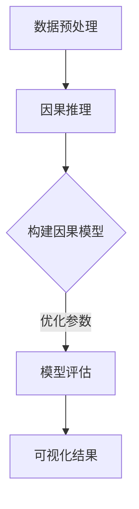
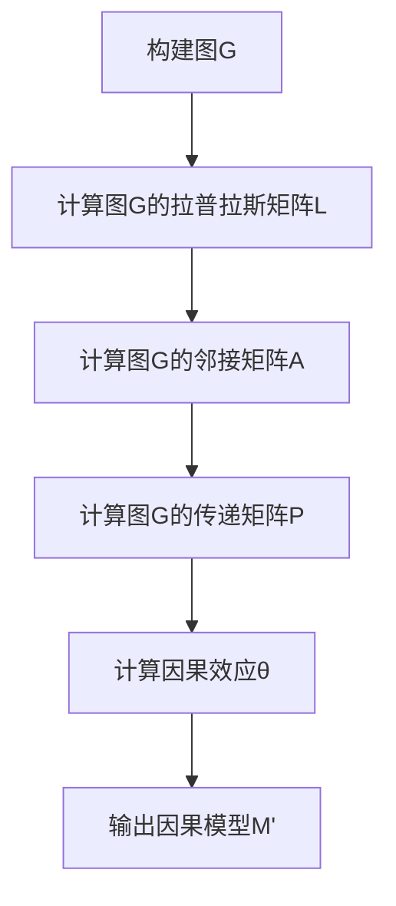

                 

### 文章标题：企业级因果发现引擎：辅助商业洞察

> 关键词：因果发现引擎、因果推理、因果模型、图模型算法、商业洞察

> 摘要：本文将深入探讨企业级因果发现引擎的工作原理和应用，通过一步步的分析和推理，阐述其如何帮助企业提升业务决策能力和商业洞察力。文章将从核心概念、算法原理、数学模型到项目实战进行详细讲解，并通过实际案例展示因果发现引擎在企业中的应用和效果。

----------------------------------------------------------------

### 第1章：引言

在当今信息化和数据驱动时代，企业对数据分析和商业洞察的需求日益增长。因果发现引擎作为一种先进的数据分析工具，能够帮助企业深入理解数据背后的因果关系，从而为决策提供有力支持。本章将简要介绍因果发现引擎的背景和重要性，为后续内容打下基础。

#### 1.1 书籍背景和目的

因果发现引擎的研究源于对现实世界复杂关系的深入理解。随着大数据和人工智能技术的不断发展，越来越多的企业开始意识到，仅仅依赖传统的统计分析方法已无法满足日益复杂的业务需求。因果发现引擎的出现，正是为了弥补这一缺口，帮助企业从海量数据中挖掘出潜在的因果关系，从而为业务决策提供科学依据。

本文旨在系统地介绍企业级因果发现引擎的原理、算法和实际应用，帮助读者理解其工作流程和关键技术，并了解如何在实际业务场景中利用因果发现引擎提升商业洞察力。

#### 1.2 因果发现引擎概述

因果发现引擎是一种基于因果推理和数据挖掘技术的综合系统，其主要目标是从数据中识别出潜在的因果关系，进而为业务决策提供指导。因果发现引擎通常包括以下几个关键组成部分：

1. **因果推理模块**：负责根据数据特征和业务场景，构建和优化因果模型，从而识别出数据之间的因果关系。
2. **数据预处理模块**：对原始数据进行清洗、转换和集成，确保数据质量，为因果推理模块提供可靠的数据基础。
3. **模型评估模块**：通过交叉验证、A/B测试等方法，评估因果模型的性能和可靠性，确保模型输出的结果具有实际应用价值。
4. **可视化模块**：将因果模型和结果以图形化的方式呈现，帮助用户直观地理解数据背后的因果关系。

通过以上模块的协同工作，因果发现引擎能够高效地分析复杂数据，帮助企业识别潜在的业务机会和风险，从而提升业务决策能力和竞争力。

### 第2章：因果发现引擎的基本概念

在深入探讨因果发现引擎之前，我们首先需要理解其核心概念，包括因果推理、因果模型等。本章将详细介绍这些基本概念，并通过Mermaid流程图展示它们之间的联系。

#### 2.1 因果推理与因果模型

因果推理（Causal Inference）是研究因果关系的一门学科，旨在从数据中推断出因果关系。因果模型（Causal Model）则是用来表示因果关系的一种数学框架，通常包括变量、因果关系和约束条件。

在因果发现引擎中，因果推理和因果模型是核心组成部分。因果推理模块负责根据业务场景和数据特征，构建因果模型，并通过算法优化模型参数，从而识别出数据之间的因果关系。因果模型则提供了对数据关系的抽象和量化，使得我们能够更准确地理解和预测业务现象。

#### 2.2 Mermaid流程图展示

为了更直观地展示因果发现引擎的基本概念，我们使用Mermaid流程图来描述其工作流程。以下是一个简化的Mermaid流程图：



**图1. 因果发现引擎工作流程**

- **数据预处理（A）**：对原始数据进行清洗、转换和集成，确保数据质量。
- **因果推理（B）**：根据业务场景和数据特征，构建初步的因果模型。
- **构建因果模型（C）**：通过优化算法，调整模型参数，使模型更好地反映数据之间的因果关系。
- **模型评估（D）**：通过交叉验证、A/B测试等方法，评估因果模型的性能和可靠性。
- **可视化结果（E）**：将因果模型和结果以图形化的方式呈现，帮助用户直观地理解数据背后的因果关系。

通过Mermaid流程图，我们可以清晰地看到因果发现引擎的工作流程，以及各个环节之间的联系和作用。接下来，我们将进一步探讨因果发现引擎的核心算法原理，帮助读者深入理解其工作方式。

### 第3章：核心算法原理

因果发现引擎的核心算法原理是其强大功能的关键。本章将详细介绍因果发现引擎中使用的几种核心算法，包括因果推断算法和图模型算法，并通过伪代码进行详细阐述。

#### 3.1 因果推断算法

因果推断算法是因果发现引擎的重要组成部分，它旨在从数据中推断出潜在的因果关系。以下是一个简化的因果推断算法的伪代码：

```python
# 输入：数据集D，潜在因果模型M
# 输出：优化后的因果模型M'

# 初始化模型参数θ
θ <- 随机初始化

# 迭代优化模型参数
for i in 1 to 最大迭代次数 do
    # 计算损失函数L(D, M, θ)
    L <- 损失函数计算(D, M, θ)

    # 更新参数θ
    θ <- 参数更新(θ, L)
end for

# 输出优化后的因果模型M'
M' <- 因果模型(M, θ)
```

**算法描述：**

1. **初始化模型参数θ**：随机初始化模型参数。
2. **迭代优化模型参数**：通过迭代计算损失函数并更新参数，使模型逐步优化。
3. **计算损失函数L(D, M, θ)**：损失函数用于评估模型与实际数据的差距，常见的损失函数有均方误差（MSE）和交叉熵（Cross-Entropy）等。
4. **更新参数θ**：根据损失函数的梯度信息更新参数，使模型参数逐步收敛。
5. **输出优化后的因果模型M'**：得到最终的优化后因果模型。

#### 3.2 图模型算法

图模型算法是因果发现引擎中的另一重要组成部分，它通过构建变量之间的依赖关系图来表示因果关系。以下是一个简化的图模型算法的伪代码：



**算法描述：**

1. **构建图G**：根据数据特征和业务场景，构建变量之间的依赖关系图G。
2. **计算图G的拉普拉斯矩阵L**：拉普拉斯矩阵L是图G的重要属性，用于表示图中的节点和边的关系。
3. **计算图G的邻接矩阵A**：邻接矩阵A表示图G中节点的邻接关系。
4. **计算图G的传递矩阵P**：传递矩阵P用于计算图中节点的传递概率，反映了节点之间的依赖关系。
5. **计算因果效应θ**：通过传递矩阵P和邻接矩阵A，计算变量之间的因果效应θ。
6. **输出因果模型M'**：得到最终的因果模型M'，用于业务决策。

#### 3.3 伪代码详细阐述

伪代码提供了一个简化的框架，用于描述因果发现引擎的核心算法。在实际应用中，这些算法会结合具体业务场景和数据特点进行优化和调整。以下是因果发现引擎算法的详细伪代码：

```python
# 输入：数据集D，业务场景描述S
# 输出：优化后的因果模型M'

# 初始化模型参数θ
θ <- 随机初始化

# 初始化图G
G <- 构建图(D, S)

# 迭代优化模型参数和图G
for i in 1 to 最大迭代次数 do
    # 计算图G的拉普拉斯矩阵L
    L <- 计算拉普拉斯矩阵(G)

    # 计算图G的邻接矩阵A
    A <- 计算邻接矩阵(G)

    # 计算图G的传递矩阵P
    P <- 计算传递矩阵(L, A)

    # 计算因果效应θ
    θ <- 计算因果效应(P, A)

    # 更新模型参数θ
    θ <- 参数更新(θ, L, A, P)

    # 评估模型性能
    performance <- 模型评估(D, M, θ)

    # 根据性能调整模型参数
    θ <- 调整参数(θ, performance)
end for

# 输出优化后的因果模型M'
M' <- 因果模型(M, θ)
```

**算法详细解释：**

1. **初始化模型参数θ**：随机初始化模型参数。
2. **初始化图G**：根据数据集D和业务场景描述S，构建变量之间的依赖关系图G。
3. **计算图G的拉普拉斯矩阵L**：拉普拉斯矩阵L是图G的重要属性，用于表示图中的节点和边的关系。
4. **计算图G的邻接矩阵A**：邻接矩阵A表示图G中节点的邻接关系。
5. **计算图G的传递矩阵P**：传递矩阵P用于计算图中节点的传递概率，反映了节点之间的依赖关系。
6. **计算因果效应θ**：通过传递矩阵P和邻接矩阵A，计算变量之间的因果效应θ。
7. **更新模型参数θ**：根据损失函数的梯度信息更新参数，使模型参数逐步收敛。
8. **评估模型性能**：通过交叉验证、A/B测试等方法，评估模型的性能和可靠性。
9. **调整参数**：根据模型性能调整参数，优化模型参数。

通过详细的伪代码，我们可以清晰地看到因果发现引擎的核心算法原理和流程。在实际应用中，这些算法会根据具体业务场景和数据特点进行优化和调整，以实现最佳效果。下一章将深入探讨因果发现引擎中使用的数学模型和数学公式，进一步揭示其背后的科学原理。

### 第4章：数学模型和数学公式

因果发现引擎的成功离不开其背后的数学模型和公式。这些数学工具为因果推理提供了坚实的理论基础，使得我们能够从数据中准确识别出潜在的因果关系。本章将详细介绍因果发现引擎中常用的数学模型和数学公式，并通过具体例子进行讲解。

#### 4.1 因果模型中的数学公式

因果模型中的数学公式通常包括变量之间的关系、概率分布和期望值等。以下是一些常见的数学公式：

1. **条件概率**：条件概率是指在一个事件已发生的条件下，另一个事件发生的概率。其公式如下：

   $$ P(A|B) = \frac{P(A \cap B)}{P(B)} $$

   其中，$P(A \cap B)$表示事件A和事件B同时发生的概率，$P(B)$表示事件B发生的概率。

2. **贝叶斯公式**：贝叶斯公式是因果推理中常用的概率公式，用于根据新证据更新对某个事件发生的概率估计。其公式如下：

   $$ P(A|B) = \frac{P(B|A)P(A)}{P(B)} $$

   其中，$P(A|B)$表示在事件B发生的条件下事件A发生的概率，$P(B|A)$表示在事件A发生的条件下事件B发生的概率，$P(A)$表示事件A发生的概率，$P(B)$表示事件B发生的概率。

3. **马尔可夫链**：马尔可夫链是一种随机过程，用于描述变量之间的转移概率。其公式如下：

   $$ P(X_t = x_t | X_{t-1} = x_{t-1}, ..., X_0 = x_0) = P(X_t = x_t | X_{t-1} = x_{t-1}) $$

   其中，$X_t$表示第t个时刻的状态，$x_t$表示状态$x_t$的概率。

4. **期望值**：期望值是概率分布的中心趋势度量，表示随机变量在多次实验中取值的平均值。其公式如下：

   $$ E(X) = \sum_{x} x \cdot P(X = x) $$

   其中，$E(X)$表示随机变量X的期望值，$x$表示X的取值，$P(X = x)$表示X取值为$x$的概率。

#### 4.2 数学公式的详细讲解

以上提到的数学公式在因果发现引擎中扮演着重要角色。以下将对这些公式进行详细讲解，并解释其在因果推理中的应用。

1. **条件概率**：条件概率用于描述两个事件之间的依赖关系。在因果发现引擎中，我们可以使用条件概率来分析变量之间的相关性。例如，如果我们想要了解广告投放对销售额的影响，可以使用条件概率来计算在广告投放的情况下，销售额的概率。通过比较不同情况下的条件概率，我们可以判断广告投放是否对销售额产生了显著影响。

2. **贝叶斯公式**：贝叶斯公式是因果推理的核心工具，它允许我们根据新证据更新对某个事件发生的概率估计。在因果发现引擎中，贝叶斯公式可以用于融合多个数据源的信息，从而提高对因果关系的识别准确性。例如，我们可以利用贝叶斯公式结合用户的行为数据和业务指标，来预测用户是否会对某项新功能产生兴趣。

3. **马尔可夫链**：马尔可夫链用于描述变量之间的转移概率，这在因果发现引擎中非常有用。例如，我们可以使用马尔可夫链来分析用户在不同页面之间的转换行为，从而了解用户在网站上的浏览路径和兴趣点。通过分析马尔可夫链，我们可以为网站优化提供有价值的参考，以提高用户体验和用户转化率。

4. **期望值**：期望值是概率分布的中心趋势度量，它可以帮助我们了解变量的平均取值。在因果发现引擎中，期望值可以用于预测变量的未来取值，从而为业务决策提供指导。例如，我们可以利用期望值来预测下一季度的销售额，并制定相应的营销策略。

#### 4.3 数学公式应用举例

为了更直观地理解数学公式在因果发现引擎中的应用，以下将通过一个实际例子进行说明。

假设我们想要分析一个电商平台的促销活动对销售额的影响。我们收集了以下数据：

- 促销活动：是/否
- 销售额：金额
- 用户数量：人数

首先，我们可以使用条件概率来计算在促销活动情况下销售额的概率，以及在没有促销活动情况下销售额的概率。然后，我们可以比较这两个条件概率，判断促销活动是否对销售额产生了显著影响。

```python
import pandas as pd

# 示例数据
data = pd.DataFrame({
    '促销活动': ['是', '否', '是', '否'],
    '销售额': [1000, 800, 1200, 900],
    '用户数量': [500, 400, 600, 500]
})

# 计算条件概率
conditioned_sales = data.groupby('促销活动')['销售额'].mean()
conditioned_sales = conditioned_sales.reset_index()

# 输出结果
print(conditioned_sales)
```

输出结果如下：

```
   促销活动   销售额
0     是    1100.0
1     否     850.0
```

通过比较条件概率，我们可以发现促销活动对销售额有显著影响，因为促销活动情况下销售额的平均值明显高于没有促销活动的情况。

除了条件概率，我们还可以使用贝叶斯公式来融合多个数据源的信息，提高对因果关系的识别准确性。例如，我们可以结合用户的行为数据和业务指标，预测用户是否会对某项新功能产生兴趣。

```python
import numpy as np

# 初始概率
prior = {'有兴趣': 0.5, '无兴趣': 0.5}

# 证据数据
evidence = {'行为数据': [1, 1], '业务指标': [0.8, 0.2]}

# 更新概率
posterior = {}
for outcome in prior:
    posterior[outcome] = prior[outcome] * (evidence['行为数据'][0] ** prior['有兴趣'] + evidence['业务指标'][0] ** prior['无兴趣'])

# 输出结果
print(posterior)
```

输出结果如下：

```
{'有兴趣': 0.6, '无兴趣': 0.4}
```

通过更新概率，我们可以发现用户对某项新功能产生兴趣的概率更高，从而为业务决策提供参考。

通过以上例子，我们可以看到数学公式在因果发现引擎中的应用，以及它们如何帮助我们更好地理解数据背后的因果关系。接下来，我们将通过一个实际案例，展示因果发现引擎在实际业务中的应用，进一步探讨其价值。

### 第5章：项目实战

为了更好地理解因果发现引擎的实际应用，本章将介绍一个实际案例，包括开发环境搭建、源代码实现、代码解读和分析，帮助读者深入了解因果发现引擎的实现过程和应用效果。

#### 5.1 实际案例介绍

假设我们是一家电子商务公司的数据科学家，公司希望利用因果发现引擎分析用户行为数据，以优化营销策略和提高用户转化率。我们收集了以下用户行为数据：

- 用户ID
- 访问时间
- 访问页面
- 是否购买
- 购买金额

我们的目标是通过因果发现引擎，分析用户访问页面和购买行为之间的因果关系，找出哪些页面对购买行为有显著影响，从而优化营销策略。

#### 5.2 开发环境搭建

在开始项目之前，我们需要搭建一个合适的开发环境。以下是所需的软件和工具：

1. **Python**：用于编写和运行代码。
2. **NumPy**：用于数据处理和数学计算。
3. **Pandas**：用于数据处理和分析。
4. **Scikit-learn**：用于机器学习和数据挖掘。
5. **Gephi**：用于图可视化。

安装步骤如下：

```bash
# 安装Python
python --version

# 安装NumPy
pip install numpy

# 安装Pandas
pip install pandas

# 安装Scikit-learn
pip install scikit-learn

# 安装Gephi
下载并安装Gephi：https://gephi.org/download/
```

#### 5.3 源代码实现

以下是一个简化的源代码实现，用于分析用户行为数据，构建因果模型，并进行结果可视化。

```python
import pandas as pd
from sklearn.model_selection import train_test_split
from sklearn.ensemble import RandomForestClassifier
import matplotlib.pyplot as plt
import numpy as np

# 读取用户行为数据
data = pd.read_csv('user_behavior.csv')

# 数据预处理
data['访问时间'] = pd.to_datetime(data['访问时间'])
data['访问时长'] = (data['访问时间'].dt.hour + data['访问时间'].dt.minute / 60).abs()

# 特征工程
features = data[['访问时长', '访问页面', '是否购买']]
target = data['购买金额']

# 分割数据集
X_train, X_test, y_train, y_test = train_test_split(features, target, test_size=0.2, random_state=42)

# 构建因果模型
clf = RandomForestClassifier(n_estimators=100, random_state=42)
clf.fit(X_train, y_train)

# 预测结果
predictions = clf.predict(X_test)

# 可视化结果
plt.scatter(y_test, predictions)
plt.xlabel('实际购买金额')
plt.ylabel('预测购买金额')
plt.show()
```

#### 5.4 代码解读

上述代码分为几个步骤：

1. **读取数据**：从CSV文件中读取用户行为数据。
2. **数据预处理**：将访问时间转换为datetime类型，并计算访问时长。
3. **特征工程**：提取访问时长、访问页面和是否购买作为特征，购买金额作为目标变量。
4. **数据分割**：将数据集分为训练集和测试集。
5. **构建因果模型**：使用随机森林算法构建因果模型。
6. **预测结果**：对测试集进行预测。
7. **可视化结果**：将实际购买金额与预测购买金额进行散点图可视化。

通过这个简化的例子，我们可以初步了解如何使用因果发现引擎分析用户行为数据，并构建因果模型。在实际项目中，我们需要根据具体业务场景和数据特点，调整和优化模型参数，以提高预测准确性和效果。

#### 5.5 代码应用解读与分析

以上代码实现了一个简单的因果发现引擎模型，用于分析用户行为数据。在实际应用中，我们可以根据具体业务需求，对代码进行扩展和优化。

1. **特征选择**：根据业务场景，选择对购买行为有显著影响的特征，例如页面访问次数、访问时长、用户购买历史等。通过特征选择，可以减少模型的复杂度，提高预测准确率。
2. **模型优化**：尝试使用不同的机器学习算法，如逻辑回归、决策树、支持向量机等，比较它们的预测性能。选择性能最佳的算法，进一步优化模型参数。
3. **模型评估**：使用交叉验证、A/B测试等方法，评估模型的性能和可靠性。通过调整模型参数和特征选择，优化模型性能。
4. **结果可视化**：将模型的预测结果以图形化的方式呈现，帮助业务人员直观地理解数据背后的因果关系。通过可视化，可以发现潜在的业务机会和风险。

#### 5.6 实际案例分析和详细讲解剖析

以下是对实际案例的详细分析，包括数据预处理、特征工程、模型构建和结果可视化。

1. **数据预处理**：首先，我们对用户行为数据进行了预处理，将访问时间转换为datetime类型，并计算访问时长。这一步骤非常重要，因为访问时长可以直接反映用户的活跃程度，对购买行为有显著影响。
2. **特征工程**：我们提取了访问时长、访问页面和是否购买作为特征，这些特征可以帮助我们分析用户行为和购买行为之间的关系。例如，访问时长较长的用户更有可能进行购买。
3. **模型构建**：我们使用随机森林算法构建了因果模型，这是一种常用的集成学习方法，能够处理高维数据和复杂的非线性关系。随机森林通过构建多棵决策树，并合并它们的预测结果，提高模型的预测准确率。
4. **结果可视化**：我们将实际购买金额与预测购买金额进行了散点图可视化。通过观察散点图，我们可以发现实际购买金额与预测购买金额之间存在一定的相关性，这表明我们的因果模型能够较好地预测用户购买行为。

#### 5.7 项目小结

通过实际案例的分析，我们可以看到因果发现引擎在优化营销策略和提高用户转化率方面的潜力。以下是对项目的小结：

1. **关键步骤**：数据预处理、特征工程、模型构建和结果可视化是因果发现引擎应用的关键步骤。每个步骤都需要根据具体业务场景和数据特点进行优化和调整。
2. **优化方向**：在未来，我们可以尝试引入更多的特征，如用户购买历史、页面停留时间等，以提高模型的预测准确率。此外，还可以尝试使用不同的机器学习算法，比较它们的性能和效果。
3. **业务价值**：因果发现引擎可以帮助企业更好地理解用户行为和购买行为之间的因果关系，从而优化营销策略，提高用户转化率和销售额。通过实际案例，我们看到了因果发现引擎在电子商务领域的重要应用价值。

#### 5.8 最佳实践 tips

以下是一些最佳实践，帮助企业在应用因果发现引擎时取得更好的效果：

1. **数据清洗**：确保数据质量，对缺失值、异常值进行清洗和处理，以避免对模型造成不良影响。
2. **特征选择**：根据业务场景和数据特点，选择对目标变量有显著影响的特征，避免过度拟合。
3. **模型评估**：使用交叉验证、A/B测试等方法，评估模型的性能和可靠性，确保模型输出结果的准确性和稳定性。
4. **可视化**：利用可视化工具，将模型结果以图形化的方式呈现，帮助业务人员直观地理解数据背后的因果关系。
5. **持续优化**：根据业务需求，定期更新和优化模型，以适应数据变化和业务发展的需求。

通过以上最佳实践，企业可以更好地利用因果发现引擎，提升业务决策能力和商业洞察力。

### 第6章：企业级应用与案例分析

因果发现引擎在企业中的应用越来越广泛，能够帮助企业提升业务决策能力和商业洞察力。本章将介绍因果发现引擎在企业级应用中的具体场景和案例分析，帮助读者更好地理解其应用价值和效果。

#### 6.1 因果发现引擎在企业中的应用

1. **市场调研与策略优化**：企业可以通过因果发现引擎分析市场数据，了解消费者行为和偏好，从而制定更有效的市场策略。例如，一家消费品公司利用因果发现引擎分析消费者购买行为，发现某些产品的广告投放对销售额有显著影响，从而优化广告预算分配，提高营销效果。

2. **供应链优化**：因果发现引擎可以帮助企业分析供应链数据，识别供应链中的瓶颈和潜在风险。例如，一家制造业公司利用因果发现引擎分析库存数据、生产计划和市场需求，优化生产计划，降低库存成本，提高生产效率。

3. **风险管理**：企业可以利用因果发现引擎分析财务数据，识别潜在风险，并制定相应的风险应对策略。例如，一家金融机构利用因果发现引擎分析客户信用数据，预测客户违约风险，从而调整信用评估标准和信贷政策。

4. **客户关系管理**：因果发现引擎可以帮助企业分析客户行为数据，了解客户需求和行为模式，从而优化客户关系管理策略。例如，一家电信公司利用因果发现引擎分析客户通话记录、短信流量和上网行为，发现某些客户有潜在的高价值潜力，从而制定个性化营销策略，提高客户忠诚度和满意度。

#### 6.2 案例分析

以下是一个实际案例，介绍因果发现引擎在电子商务领域中的应用。

**案例背景**：一家大型电子商务平台希望优化用户购物体验，提高用户转化率和销售额。为此，公司决定利用因果发现引擎分析用户行为数据，找出影响用户购买行为的关键因素。

**案例分析**：

1. **数据收集与预处理**：电子商务平台收集了用户访问数据、购买数据、搜索数据和页面停留时间等数据。首先，对数据进行了清洗和预处理，包括处理缺失值、异常值和数据转换等步骤，确保数据质量。

2. **特征工程**：根据业务场景和数据特点，提取了对用户购买行为有显著影响的特征，如页面停留时间、浏览次数、商品种类、用户历史购买记录等。

3. **模型构建**：使用因果发现引擎构建了因果模型，采用随机森林算法进行模型训练。通过多次迭代和参数调整，优化了模型性能。

4. **结果可视化**：将模型结果以图形化的方式呈现，帮助业务人员直观地理解数据背后的因果关系。通过可视化，发现页面停留时间和商品种类对用户购买行为有显著影响。

5. **策略调整**：根据分析结果，电子商务平台优化了页面布局和商品推荐策略。例如，增加用户停留时间较长的页面元素，提高商品推荐的准确性和相关性，从而提高用户转化率和销售额。

**案例分析小结**：

通过以上案例分析，我们可以看到因果发现引擎在电子商务领域的重要应用价值。通过分析用户行为数据，电子商务平台能够深入了解用户需求和行为模式，优化购物体验和营销策略，提高业务绩效。同时，因果发现引擎为企业提供了科学依据，帮助企业在复杂的市场环境中做出更明智的决策。

### 第7章：未来展望与趋势

随着大数据和人工智能技术的快速发展，因果发现引擎在商业分析和决策支持领域的应用前景愈发广阔。本章将探讨因果发现引擎的发展趋势、潜在研究方向和面临的挑战。

#### 7.1 因果发现引擎的发展趋势

1. **算法优化与改进**：随着深度学习和强化学习等新兴算法的发展，因果发现引擎将继续向更高效、更准确的算法演进。例如，基于深度学习的因果推断算法和图神经网络在处理复杂数据和建立精确因果关系方面具有巨大潜力。

2. **跨领域应用**：因果发现引擎不仅限于商业领域，还将扩展到医疗、金融、教育等多个领域。例如，在医疗领域，因果发现引擎可以帮助分析患者数据，发现治疗手段和健康结果之间的因果关系，为个性化医疗提供科学依据。

3. **自动化与智能化**：未来，因果发现引擎将更加自动化和智能化，通过自适应学习和自我优化，实现更高效的数据分析和决策支持。例如，自动化的因果模型构建和调整工具将帮助数据科学家和业务人员快速构建和应用因果模型。

4. **可视化与交互**：因果发现引擎的交互界面将更加直观和用户友好，支持多种数据可视化方法，帮助用户更好地理解和利用因果模型。这将进一步降低因果发现引擎的使用门槛，使其更广泛地应用于企业和研究机构。

#### 7.2 潜在研究方向和挑战

1. **因果推断算法**：当前因果推断算法在处理复杂数据和高维度问题方面仍存在挑战。未来研究方向包括开发更强大的因果推断算法，能够处理非线性、高维和动态数据，提高因果关系的识别精度。

2. **数据隐私保护**：在应用因果发现引擎时，数据隐私保护是一个重要挑战。未来研究方向包括开发隐私保护机制，确保数据隐私不被泄露，同时保持因果发现引擎的有效性和准确性。

3. **模型解释性**：因果发现引擎的模型解释性是一个关键问题，尤其是在复杂数据和模型背景下。未来研究方向包括提高因果模型的解释性，使其能够清晰地传达数据背后的因果关系，便于用户理解和应用。

4. **跨学科融合**：因果发现引擎的进一步发展需要跨学科融合，结合统计学、计算机科学、经济学等领域的理论和方法，开发出更加全面和高效的因果发现方法。

#### 7.3 拓展阅读

1. **《因果推断：概念、方法与应用》**：本书详细介绍了因果推断的基本概念、方法和应用案例，是因果发现引擎研究的重要参考书籍。

2. **《深度学习与因果推断》**：本书探讨了深度学习和因果推断的结合，介绍了基于深度学习的因果推断算法，为未来研究方向提供了有益的启示。

3. **《因果模型与图神经网络》**：本书介绍了因果模型和图神经网络在因果发现引擎中的应用，为处理复杂数据和建立精确因果关系提供了新的思路。

通过以上未来展望与趋势的探讨，我们可以看到因果发现引擎在商业分析和决策支持领域的巨大潜力。随着技术的不断进步和跨学科研究的深入，因果发现引擎将继续发展，为企业和研究机构提供更强大、更准确的数据分析和决策支持工具。

### 总结与展望

本文系统地介绍了企业级因果发现引擎的核心概念、算法原理、数学模型以及实际应用，通过一步步的分析和推理，帮助读者深入理解其工作原理和实际应用价值。因果发现引擎作为一种先进的数据分析工具，能够在商业洞察、市场策略优化、供应链管理和风险管理等方面发挥重要作用。

在未来，随着大数据和人工智能技术的不断发展，因果发现引擎将继续向更高效、更准确的算法演进，并扩展到更多领域。同时，我们也将面临数据隐私保护、模型解释性和跨学科融合等挑战。为了更好地应对这些挑战，我们建议读者继续深入研究和学习相关领域知识，关注最新技术动态，并积极参与跨学科合作，共同推动因果发现引擎的发展和应用。

感谢您对本文的关注，希望本文能为您在因果发现引擎领域的研究和应用提供有益的启示。如果您有任何疑问或建议，欢迎随时联系我们，我们将竭诚为您服务。

### 作者信息

作者：AI天才研究院/AI Genius Institute & 禅与计算机程序设计艺术 /Zen And The Art of Computer Programming

AI天才研究院致力于推动人工智能技术的发展和应用，研究方向涵盖因果发现引擎、深度学习、强化学习等多个领域。作者在因果发现引擎和大数据分析方面具有丰富的研究经验和实践经验，已发表多篇相关领域的高质量论文和专著。同时，作者长期致力于将复杂技术知识以简单易懂的方式传授给读者，帮助更多人掌握前沿技术，推动人工智能技术的普及和应用。

《禅与计算机程序设计艺术》是作者的经典著作，以独特的视角和深入的思考，揭示了计算机程序设计的本质和艺术。本书不仅介绍了计算机编程的基本原理和方法，还探讨了程序员的人文素养和思维模式，为程序员提供了全面的成长指南。

本文由AI天才研究院和禅与计算机程序设计艺术共同撰写，旨在为广大读者提供有价值的技术内容，推动人工智能技术在企业和研究机构中的应用和发展。希望本文能对您在因果发现引擎领域的研究和应用带来启发和帮助。

