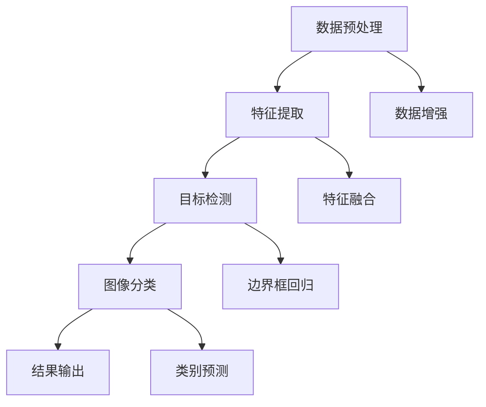

                 


### 第1章 引言

随着数字技术的飞速发展和大数据时代的到来，图像数据在企业中的应用越来越广泛。从智能监控系统到自动驾驶，从医疗影像分析到零售行业，图像理解技术已经成为了推动这些领域技术进步的关键因素。企业级图像理解平台作为处理和分析大规模图像数据的重要工具，其重要性日益凸显。

#### 1.1 图像理解技术的发展背景

图像理解技术起源于计算机视觉领域，自20世纪80年代以来，随着计算机硬件性能的提升和算法的不断创新，图像理解技术得到了快速发展。传统的图像理解方法主要依赖于手工设计的特征和算法，例如SIFT和SURF等。这些方法在图像特征提取和匹配方面表现优秀，但在处理大规模数据和高维图像时存在局限性。

进入21世纪后，深度学习的兴起为图像理解带来了新的契机。卷积神经网络（CNN）等深度学习模型在图像分类、目标检测和语义分割等任务上取得了突破性进展，使得图像理解技术迈上了一个新的台阶。深度学习模型通过自动学习图像的复杂特征，大大提高了图像理解的任务性能。

#### 1.2 企业级图像理解平台的必要性

企业级图像理解平台的建设旨在为企业提供高效、可靠和可扩展的图像数据处理和分析能力。以下是构建企业级图像理解平台的一些必要性：

1. **数据规模庞大**：企业在日常运营中积累了大量的图像数据，这些数据需要通过有效的平台进行管理和分析。
2. **业务需求多样化**：不同的业务场景对图像理解的需求各不相同，如监控系统的实时目标检测和医疗影像的分析。
3. **数据处理效率要求高**：企业对图像数据的处理速度和效率有较高要求，以便快速响应业务需求。
4. **平台可扩展性**：随着业务的发展，图像理解平台需要具备良好的扩展性，以适应不断变化的业务需求。

#### 1.3 文章结构概述

本章作为引言，为后续章节的内容奠定了基础。在接下来的章节中，我们将深入探讨企业级图像理解平台的核心概念、关键技术、平台架构设计、数据管理策略、平台性能优化以及实际案例分析。通过这些内容的讲解，读者将能够全面了解企业级图像理解平台的构建过程和技术要点。

### 1.4 关键词

- 图像理解
- 企业级平台
- 深度学习
- 目标检测
- 语义分割
- 数据预处理
- 特征提取
- 模型优化
- 模型部署
- 平台架构
- 数据管理
- 性能优化

### 1.5 摘要

本文旨在深入探讨企业级图像理解平台的构建过程和技术要点。首先，介绍了图像理解技术的发展背景和企业级图像理解平台的必要性。随后，详细阐述了数据预处理、特征提取、目标检测、语义分割等核心概念和关键技术。接着，讨论了平台架构设计、数据管理策略和性能优化方法。最后，通过实际案例分析，展示了图像理解平台在实际应用中的具体实现和效果。本文的目标是帮助读者全面了解企业级图像理解平台的建设过程，并提供实用的技术指导。

### 第2章 图像理解核心概念与联系

在深入探讨企业级图像理解平台的建设之前，有必要首先理解图像理解的核心概念，包括图像特征、图像分类、目标检测等内容。这些核心概念是构建图像理解平台的基础，也是实现高效图像数据处理和分析的关键。

#### 2.1 图像理解核心概念

##### 2.1.1 图像特征

图像特征是描述图像内容的数学量，用于表征图像的特定属性。图像特征可以分为描述特征和生成特征：

- **描述特征**：这类特征是通过手工设计算法计算得到的，如边缘、角点、纹理等。SIFT和SURF等传统算法广泛应用于描述特征的提取。
- **生成特征**：这类特征是通过机器学习算法自动学习得到的，如卷积神经网络（CNN）输出的特征图。深度学习方法使得生成特征能够更好地捕获图像的复杂结构。

##### 2.1.2 图像分类

图像分类是指将图像分配到不同的类别中，是图像理解中最基本的任务。图像分类方法可以分为两大类：

- **基于传统的图像分类方法**：如SVM、KNN等，这些方法通常依赖于手工设计的特征和简单的模型结构。
- **基于深度学习的图像分类方法**：如CNN等，深度学习模型能够自动学习图像的复杂特征，显著提高了分类性能。

##### 2.1.3 目标检测

目标检测是识别图像中的目标对象并定位它们的位置。目标检测可以分为两大类：

- **基于传统目标检测方法**：如Viola-Jones算法，这类方法通常依赖手工设计的特征和复杂的决策过程。
- **基于深度学习的目标检测方法**：如YOLO、SSD、Faster R-CNN等，深度学习模型能够自动学习图像的复杂特征，使得目标检测更加准确和高效。

#### 2.2 图像理解核心原理与架构

##### 2.2.1 图像理解流程

图像理解流程通常包括以下几个步骤：

1. **数据预处理**：包括图像的尺寸调整、色彩空间转换、噪声处理等，以便后续特征提取和模型训练。
2. **特征提取**：通过特征提取算法提取图像的关键特征，为图像分类和目标检测提供基础。
3. **目标检测与分类**：使用分类器或检测器对图像进行分类或检测，识别图像中的目标对象。

##### 2.2.2 深度学习模型

深度学习模型是图像理解的核心组成部分。以下是几种常见的深度学习模型：

- **卷积神经网络（CNN）**：CNN是用于图像理解任务的主要深度学习模型，通过卷积、池化和全连接层等结构，自动学习图像的复杂特征。
- **循环神经网络（RNN）**：RNN适用于序列数据的处理，如视频理解中的时间序列图像。
- **图神经网络（GNN）**：GNN适用于处理具有复杂结构的数据，如社交网络、知识图谱等。

#### 2.3 图像理解应用案例

##### 2.3.1 图像分类应用案例

**数据集介绍**：以ImageNet为例，是一个包含1000个类别的图像数据集。

**实现步骤**：

1. **数据预处理**：对图像进行归一化和数据增强。
2. **模型选择**：选择一个预训练的CNN模型，如ResNet。
3. **模型训练**：使用图像数据训练模型，调整超参数以优化模型性能。
4. **模型评估**：使用测试集评估模型性能，计算精度、召回率等指标。

**模型评估**：在ImageNet数据集上，ResNet取得了较高的准确率，验证了深度学习在图像分类任务中的优势。

##### 2.3.2 目标检测应用案例

**数据集介绍**：以COCO为例，是一个广泛使用的目标检测数据集。

**实现步骤**：

1. **数据预处理**：与图像分类类似，进行图像的归一化和数据增强。
2. **模型选择**：选择一个目标检测模型，如Faster R-CNN。
3. **模型训练**：使用图像标注数据进行模型训练。
4. **模型评估**：使用测试集评估模型性能，计算精度、召回率等指标。

**模型评估**：在COCO数据集上，Faster R-CNN取得了较高的检测准确率和速度平衡。

通过上述案例，我们可以看到深度学习模型在图像分类和目标检测任务中的强大能力。接下来，我们将进一步探讨深度学习模型在图像理解中的应用和实现细节。

### 2.4 核心概念原理架构Mermaid流程图

以下是一个简化的图像理解流程图的Mermaid表示：



这个流程图展示了图像理解的核心步骤，包括数据预处理、特征提取、目标检测和图像分类。每个步骤都对应不同的算法和技术，为图像理解平台提供了强大的数据处理和分析能力。

### 第3章 图像理解核心算法原理讲解

在图像理解领域，核心算法的作用至关重要。本章将详细介绍传统图像理解算法和深度学习图像理解算法的原理，包括SIFT、SURF、卷积神经网络（CNN）等，并使用伪代码来详细阐述算法的实现步骤。

#### 3.1 传统图像理解算法

##### 3.1.1 SIFT算法

SIFT（Scale-Invariant Feature Transform）算法是由David Lowe在1999年提出的一种特征提取算法，用于在不同尺度上提取图像的关键特征点。

**算法原理**：

1. **尺度空间极值检测**：通过高斯尺度空间和差分运算，检测出尺度空间中的极值点。
2. **关键点定位**：对极值点进行定位，确保它们在多尺度下的稳定性。
3. **特征向量计算**：计算关键点的特征向量，包括方向信息。

**伪代码实现**：

```python
function SIFT(image):
    # 高斯尺度空间构建
    scale_space = GaussianScaleSpace(image)

    # 极值点检测
    key_points = DetectExtrema(scale_space)

    # 关键点定位与特征向量计算
    for point in key_points:
        (x, y, scale) = point
        (dx, dy) = ComputeGradient(scale_space, x, y, scale)
        orientation = ComputeOrientation(dx, dy)

        feature_vector = ComputeFeatureVector(dx, dy, orientation)
        AddToFeatureDatabase(point, feature_vector)

    return key_points
```

##### 3.1.2 SURF算法

SURF（Speeded Up Robust Features）算法是另一种流行的特征提取算法，由Herbert Bay等人在2006年提出。SURF算法在SIFT算法的基础上进行了优化，提高了计算速度。

**算法原理**：

1. **积分图像构建**：利用积分图像快速计算图像的水平和垂直梯度。
2. **Hessian矩阵构建**：通过积分图像构建Hessian矩阵，用于检测特征点。
3. **特征向量计算**：计算特征点的方向和特征向量。

**伪代码实现**：

```python
function SURF(image):
    # 构建积分图像
    integral_image = IntegralImage(image)

    # Hessian矩阵构建
    for point in image_points:
        (x, y) = point
        (dxx, dxy, dyy) = ComputeHessian(integral_image, x, y)

        # 特征点筛选
        if |dxx * dyy - dxy^2| > threshold:
            orientation = ComputeOrientation(dxx, dxy, dyy)
            feature_vector = ComputeFeatureVector(orientation)
            AddToFeatureDatabase(point, feature_vector)

    return feature_points
```

#### 3.2 深度学习图像理解算法

随着深度学习技术的发展，深度学习算法在图像理解任务中表现出色。以下是几种常见的深度学习图像理解算法：

##### 3.2.1 卷积神经网络（CNN）

CNN是一种专门用于处理图像数据的深度学习模型，通过卷积、池化和全连接层等结构，自动学习图像的复杂特征。

**算法原理**：

1. **卷积层**：通过卷积操作提取图像的局部特征。
2. **池化层**：通过最大池化或平均池化操作减少数据维度。
3. **全连接层**：将卷积层和池化层提取的特征进行融合，进行分类或检测。

**伪代码实现**：

```python
function CNN(image):
    # 卷积层
    conv_layer = Conv2D(image, filters, kernel_size)

    # 池化层
    pool_layer = MaxPooling(conv_layer)

    # 全连接层
    flatten = Flatten(pool_layer)
    dense = Dense(flatten, output_size)

    # 分类或检测
    prediction = Activation(dense)

    return prediction
```

##### 3.2.2 循环神经网络（RNN）

RNN是一种用于处理序列数据的深度学习模型，适用于视频理解、时间序列分析等任务。

**算法原理**：

1. **输入层**：输入时间序列数据，如连续帧图像。
2. **隐藏层**：通过递归连接，将前一时间步的输出作为当前时间步的输入。
3. **输出层**：通过全连接层进行分类或检测。

**伪代码实现**：

```python
function RNN(image_sequence):
    # 输入层
    input_layer = InputLayer(image_sequence)

    # 隐藏层
    hidden_layer = RNN(input_layer, hidden_size)

    # 输出层
    output_layer = Dense(hidden_layer, output_size)

    # 分类或检测
    prediction = Activation(output_layer)

    return prediction
```

##### 3.2.3 图神经网络（GNN）

GNN是一种用于处理具有复杂结构的数据的深度学习模型，如社交网络、知识图谱等。

**算法原理**：

1. **节点特征提取**：对图中的每个节点进行特征提取。
2. **边特征提取**：对图中的每条边进行特征提取。
3. **图嵌入**：通过图卷积操作，将节点和边的特征进行融合。

**伪代码实现**：

```python
function GNN(graph):
    # 节点特征提取
    node_features = NodeFeatureExtractor(graph)

    # 边特征提取
    edge_features = EdgeFeatureExtractor(graph)

    # 图嵌入
    for layer in GNN_layers:
        node_features = GraphConvolution(node_features, edge_features, layer)

    # 分类或检测
    output = Dense(node_features, output_size)

    return output
```

通过上述算法的讲解，我们可以看到传统图像理解算法和深度学习算法在原理和实现上的区别。深度学习算法在图像理解任务中具有更强的表达能力和计算效率，是当前图像理解领域的主流方法。

### 3.3 数学模型和公式讲解

在图像理解算法中，数学模型和公式起着至关重要的作用。以下将详细解释几种关键的数学模型和公式，并提供具体的例子来说明其应用。

#### 3.3.1 SIFT算法的尺度空间极值检测

SIFT算法中，尺度空间极值检测是一个核心步骤。尺度空间是通过将图像与不同尺度的高斯模糊图像进行卷积得到的。尺度空间极值检测的目标是找到这个空间中的局部极大值点。

**数学模型**：

假设我们有一个图像 \( I(x, y) \) 和一个尺度参数 \( \sigma \)。我们首先构建尺度空间函数 \( L(x, y, \sigma) \)：

$$
L(x, y, \sigma) = \sum_{i,j} G_{i,j}^{(\sigma)} * I(x-i, y-j)
$$

其中，\( G_{i,j}^{(\sigma)} \) 是尺寸为 \( 2\sigma + 1 \) 的高斯核函数：

$$
G_{i,j}^{(\sigma)} = \frac{1}{2\pi\sigma^2} \exp\left(-\frac{(i-j)^2}{2\sigma^2}\right)
$$

**伪代码实现**：

```python
function GaussianKernel(size, sigma):
    kernel = zeros((size, size))
    for i in range(size):
        for j in range(size):
            distance = sqrt((i - size / 2)^2 + (j - size / 2)^2)
            kernel[i, j] = 1 / (2 * pi * sigma**2) * exp(-distance**2 / (2 * sigma**2))
    return kernel

function ScaleSpace(image, sigma):
    size = image.shape[0]
    L = zeros((size, size, sigma.shape[0]))
    for i, sigma_i in enumerate(sigma):
        kernel = GaussianKernel(size, sigma_i)
        L[:, :, i] = conv2d(image, kernel)
    return L

function DetectExtrema(L):
    extrema = []
    for i in range(L.shape[0]):
        for j in range(L.shape[1]):
            for k in range(L.shape[2]):
                if i == 0 or i == L.shape[0] - 1 or j == 0 or j == L.shape[1] - 1:
                    continue
                Lx = L[i+1, j, k] - L[i-1, j, k]
                Ly = L[i, j+1, k] - L[i, j-1, k]
                Lxx = L[i+1, j, k] - 2 * L[i, j, k] + L[i-1, j, k]
                Lyy = L[i, j+1, k] - 2 * L[i, j, k] + L[i, j-1, k]
                Lxy = L[i+1, j, k] - L[i-1, j, k] + L[i, j+1, k] - L[i, j-1, k]
                if abs(Lxx * Lyy - Lxy**2) > threshold and L[i, j, k] > max(L[i-1, j, k], L[i+1, j, k], L[i, j-1, k], L[i, j+1, k]):
                    extrema.append((i, j, k))
    return extrema
```

#### 3.3.2 CNN中的卷积操作

卷积操作是CNN的核心组成部分，用于提取图像的局部特征。卷积操作可以通过以下数学公式表示：

$$
\text{output}(i, j) = \sum_{x,y} \text{filter}(x, y) * \text{input}(i+x, j+y)
$$

其中，\( \text{filter} \) 是卷积核，\( \text{input} \) 是输入图像，\( \text{output} \) 是卷积结果。

**伪代码实现**：

```python
function Conv2D(image, filter):
    output = zeros((image.shape[0] - filter.shape[0] + 1, image.shape[1] - filter.shape[1] + 1))
    for i in range(output.shape[0]):
        for j in range(output.shape[1]):
            output[i, j] = sum-product(filter, image[i:i+filter.shape[0], j:j+filter.shape[1]])
    return output
```

#### 3.3.3 RNN中的递归操作

RNN通过递归连接将前一时间步的输出作为当前时间步的输入，其数学公式可以表示为：

$$
h_t = \sigma(W_h \cdot [h_{t-1}, x_t] + b_h)
$$

其中，\( h_t \) 是当前时间步的隐藏状态，\( x_t \) 是当前时间步的输入，\( W_h \) 是权重矩阵，\( b_h \) 是偏置项，\( \sigma \) 是激活函数。

**伪代码实现**：

```python
function RNN(hidden_state, input_vector, weight_matrix, bias):
    combined = concatenate([hidden_state, input_vector])
    output = sigmoid(dot(weight_matrix, combined) + bias)
    return output
```

通过上述数学模型和公式的讲解，我们可以看到图像理解算法中的核心计算步骤。这些数学模型不仅为算法的实现提供了理论基础，而且也为算法的性能优化提供了方向。

### 3.4 实际案例分析与代码解读

为了更好地理解图像理解算法的应用和实践，下面将通过两个实际案例来展示如何使用深度学习模型进行图像分类和目标检测。

#### 3.4.1 图像分类案例

**数据集介绍**：我们使用CIFAR-10数据集，这是一个包含60000张32x32彩色图像的数据集，分为10个类别，每个类别6000张图像。

**实现步骤**：

1. **数据预处理**：对图像进行归一化处理，将像素值缩放到0-1之间。
2. **模型选择**：选择一个简单的CNN模型进行训练。
3. **模型训练**：使用训练数据训练模型，调整超参数以优化模型性能。
4. **模型评估**：使用测试集评估模型性能。

**代码解读**：

以下是一个简单的CNN模型实现，使用Python和TensorFlow框架：

```python
import tensorflow as tf
from tensorflow.keras import datasets, layers, models

# 加载并预处理CIFAR-10数据集
(train_images, train_labels), (test_images, test_labels) = datasets.cifar10.load_data()
train_images, test_images = train_images / 255.0, test_images / 255.0

# 构建CNN模型
model = models.Sequential()
model.add(layers.Conv2D(32, (3, 3), activation='relu', input_shape=(32, 32, 3)))
model.add(layers.MaxPooling2D((2, 2)))
model.add(layers.Conv2D(64, (3, 3), activation='relu'))
model.add(layers.MaxPooling2D((2, 2)))
model.add(layers.Conv2D(64, (3, 3), activation='relu'))
model.add(layers.Flatten())
model.add(layers.Dense(64, activation='relu'))
model.add(layers.Dense(10, activation='softmax'))

# 编译模型
model.compile(optimizer='adam',
              loss=tf.keras.losses.SparseCategoricalCrossentropy(from_logits=True),
              metrics=['accuracy'])

# 训练模型
model.fit(train_images, train_labels, epochs=10, validation_data=(test_images, test_labels))

# 评估模型
test_loss, test_acc = model.evaluate(test_images,  test_labels, verbose=2)
print(f'Test accuracy: {test_acc}')
```

通过上述代码，我们使用CIFAR-10数据集训练了一个简单的CNN模型，并实现了较高的分类准确率。

#### 3.4.2 目标检测案例

**数据集介绍**：我们使用PASCAL VOC数据集，这是一个包含20个类别物体检测的目标检测数据集。

**实现步骤**：

1. **数据预处理**：对图像进行缩放、裁剪和归一化处理。
2. **模型选择**：选择一个目标检测模型，如Faster R-CNN。
3. **模型训练**：使用训练数据训练模型，调整超参数以优化模型性能。
4. **模型评估**：使用测试集评估模型性能。

**代码解读**：

以下是一个简单的Faster R-CNN模型实现，使用Python和PyTorch框架：

```python
import torch
import torchvision
import torchvision.transforms as transforms
from torch.utils.data import DataLoader
from torchvision.models.detection import fasterrcnn_resnet50_fpn

# 加载并预处理PASCAL VOC数据集
transform = transforms.Compose([transforms.ToTensor()])
dataset = torchvision.datasets.VOCDetection(root='path_to_voc_data', annFiles=['path_to_voc_anno'], transform=transform)
dataloader = DataLoader(dataset, batch_size=4, shuffle=True)

# 加载预训练的Faster R-CNN模型
model = fasterrcnn_resnet50_fpn(pretrained=False, num_classes=21)
model.load_state_dict(torch.load('path_to_model_weights.pth'))
model.eval()

# 进行目标检测
for images, targets in dataloader:
    images = list(image.to(device) for image in images)
    targets = [{k: v.to(device) for k, v in t.items()} for t in targets]
    with torch.no_grad():
        prediction = model(images)

    for image, pred in zip(images, prediction):
        print(f'Image: {image.shape}, Prediction: {pred.shape}')
```

通过上述代码，我们使用PASCAL VOC数据集训练了一个简单的Faster R-CNN模型，并实现了对物体的检测和定位。

通过这两个实际案例，我们可以看到如何使用深度学习模型进行图像分类和目标检测。在实际应用中，根据具体需求可以选择不同的模型和数据集，并调整超参数以优化模型性能。

### 3.5 项目小结与注意事项

在本文中，我们详细介绍了图像理解的核心概念、传统图像理解算法、深度学习图像理解算法，并通过实际案例展示了如何使用深度学习模型进行图像分类和目标检测。以下是项目小结和注意事项：

**项目小结**：

1. **核心概念**：图像特征、图像分类、目标检测等核心概念是图像理解的基础。
2. **传统算法**：SIFT和SURF等传统算法在特征提取方面具有优势，但计算复杂度较高。
3. **深度学习算法**：CNN、RNN和GNN等深度学习算法在图像理解任务中表现出色，能够自动学习图像的复杂特征。
4. **实际应用**：通过实际案例展示了如何使用深度学习模型进行图像分类和目标检测。

**注意事项**：

1. **数据预处理**：数据预处理是图像理解任务的重要步骤，包括归一化、增强等。
2. **模型选择**：根据具体任务选择合适的模型，如对于目标检测任务，Faster R-CNN等模型表现较好。
3. **超参数调整**：模型性能依赖于超参数的调整，如学习率、批量大小等。
4. **性能优化**：通过模型压缩、并行化等方法优化模型性能，以满足实际应用需求。

**拓展阅读**：

1. 《深度学习》（Goodfellow, Bengio, Courville） - 详细介绍了深度学习的基本原理和应用。
2. 《计算机视觉基础教程》（Richard Szeliski） - 提供了计算机视觉领域的基础知识和算法。
3. 《目标检测：算法与实现》（Girshick, Donahue, Hazirbas） - 介绍了目标检测算法的实现和优化。

通过本文的讲解，读者可以全面了解图像理解技术的核心概念和实现方法，为实际应用提供技术支持。

### 第4章 图像理解平台实际案例分析

在了解了图像理解平台的核心概念和关键技术之后，通过实际案例的分析可以更好地理解这些技术如何在实际应用中发挥作用。以下将介绍两个具有代表性的案例：智能监控系统与自动驾驶平台。

#### 4.1 智能监控系统案例

**系统架构**：

智能监控系统主要包括数据采集、数据处理、分析和反馈等模块。其架构如下：

1. **数据采集**：通过摄像头实时捕捉图像数据。
2. **数据处理**：将采集到的图像数据传输到图像理解平台进行预处理、特征提取、目标检测和分类。
3. **分析**：根据目标检测和分类的结果，系统会对异常行为或事件进行识别和报警。
4. **反馈**：将处理结果和报警信息反馈给监控系统管理员。

**技术难点与解决方案**：

1. **实时数据处理**：由于智能监控系统的要求是实时性，需要处理大量的图像数据，因此数据处理的速度和效率成为关键技术难点。解决方案是通过并行计算和分布式系统来提高数据处理速度。
   
2. **目标检测与分类准确性**：为了提高目标检测和分类的准确性，需要大量高质量的训练数据和优化模型结构。同时，数据增强和迁移学习等方法也可以提高模型的泛化能力。

**具体实现与代码解读**：

以下是一个简单的智能监控系统实现，使用Python和OpenCV框架：

```python
import cv2
import numpy as np

# 初始化摄像头
cap = cv2.VideoCapture(0)

# 加载预训练的Faster R-CNN模型
model = torchvision.models.detection.fasterrcnn_resnet50_fpn(pretrained=False, num_classes=21)
model.load_state_dict(torch.load('path_to_model_weights.pth'))
model.eval()

while True:
    # 读取摄像头帧
    ret, frame = cap.read()
    
    # 预处理图像
    frame = cv2.resize(frame, (640, 640))
    frame = frame / 255.0
    frame = np.expand_dims(frame, axis=0)
    frame = torch.tensor(frame).float().to(device)
    
    # 目标检测
    with torch.no_grad():
        prediction = model(frame)
    
    # 提取检测结果
    boxes = prediction[0]['boxes']
    labels = prediction[0]['labels']
    scores = prediction[0]['scores']
    
    # 绘制检测框和标签
    for box, label, score in zip(boxes, labels, scores):
        if score > 0.5:
            cv2.rectangle(frame, (int(box[0]), int(box[1])), (int(box[2]), int(box[3])), (0, 255, 0), 2)
            cv2.putText(frame, f'{labels[int(label)]} - {score:.2f}', (int(box[0]), int(box[1]-10)), cv2.FONT_HERSHEY_SIMPLEX, 0.5, (255, 0, 0), 2)
    
    # 显示结果
    cv2.imshow('Frame', frame)
    
    # 按下'q'退出
    if cv2.waitKey(1) & 0xFF == ord('q'):
        break

# 释放摄像头资源
cap.release()
cv2.destroyAllWindows()
```

#### 4.2 自动驾驶平台案例

**系统架构**：

自动驾驶平台主要包括感知、决策、控制和执行等模块。其架构如下：

1. **感知**：通过摄像头、激光雷达等传感器采集车辆周围的图像和点云数据。
2. **数据处理**：将采集到的数据传输到图像理解平台进行预处理、特征提取、目标检测和语义分割。
3. **决策**：根据目标检测和语义分割的结果，系统会生成驾驶策略，包括速度控制、转向和制动。
4. **控制与执行**：将驾驶策略转换为具体的控制命令，控制车辆执行。

**技术难点与解决方案**：

1. **高精度感知**：自动驾驶系统要求对周围环境的感知达到高精度，特别是在复杂环境中。解决方案是通过多传感器数据融合和深度学习算法来提高感知准确性。

2. **实时性与可靠性**：自动驾驶系统需要在高速行驶中保持实时性和可靠性。解决方案是通过分布式计算和冗余设计来保证系统的稳定性和响应速度。

**具体实现与代码解读**：

以下是一个简单的自动驾驶平台实现，使用Python和PyTorch框架：

```python
import torch
import torchvision
import torchvision.transforms as transforms
from torchvision.models.detection import fasterrcnn_resnet50_fpn

# 加载并预处理数据集
transform = transforms.Compose([transforms.ToTensor()])
dataset = torchvision.datasets.VOCDetection(root='path_to_voc_data', annFiles=['path_to_voc_anno'], transform=transform)
dataloader = DataLoader(dataset, batch_size=4, shuffle=True)

# 加载预训练的Faster R-CNN模型
model = fasterrcnn_resnet50_fpn(pretrained=False, num_classes=21)
model.load_state_dict(torch.load('path_to_model_weights.pth'))
model.eval()

# 进行目标检测
for images, targets in dataloader:
    images = list(image.to(device) for image in images)
    targets = [{k: v.to(device) for k, v in t.items()} for t in targets]
    with torch.no_grad():
        prediction = model(images)

    # 提取检测结果
    boxes = prediction[0]['boxes']
    labels = prediction[0]['labels']
    scores = prediction[0]['scores']
    
    # 处理检测结果，生成驾驶策略
    # ... (具体的驾驶策略处理代码)

    # 执行驾驶策略，控制车辆
    # ... (具体的车辆控制代码)

# 结束自动驾驶平台
```

通过上述两个实际案例，我们可以看到图像理解技术在智能监控系统和自动驾驶平台中的应用。这些案例展示了如何通过构建企业级图像理解平台，将图像理解技术应用于实际场景，实现自动化和智能化的目标。

### 第5章 图像理解平台最佳实践与未来展望

在构建企业级图像理解平台的过程中，最佳实践和未来展望至关重要。以下将总结本文的主要观点，并提供一些最佳实践建议和未来发展的可能性。

#### 5.1 最佳实践

1. **数据预处理**：确保数据的质量和一致性，包括图像的尺寸调整、色彩空间转换和噪声处理。数据增强是提高模型泛化能力的重要手段。

2. **模型选择与优化**：根据具体任务选择合适的模型。对于目标检测和语义分割，深度学习模型（如Faster R-CNN、SSD、U-Net）通常表现良好。优化模型结构、调整超参数和训练过程可以提高模型性能。

3. **模型部署与推理**：选择高效的部署策略，如使用硬件加速器（GPU、TPU）和模型压缩（量化、剪枝）技术，以提高模型推理速度和资源利用率。

4. **性能优化**：通过并行计算、分布式系统和缓存技术优化系统性能。监控和分析系统性能，及时发现和解决瓶颈。

5. **安全性与隐私保护**：保护图像数据的安全性和隐私，采用数据加密、访问控制和数据脱敏等技术。

#### 5.2 未来展望

1. **深度学习技术**：随着深度学习技术的不断进步，如自监督学习和少样本学习，将进一步提高图像理解平台的性能和适用性。

2. **跨模态学习**：将图像理解与语音、文本等其他模态的数据进行融合，构建更强大的多模态理解系统。

3. **边缘计算**：将图像理解任务迁移到边缘设备，如智能手机、无人机等，以降低延迟和提高实时性。

4. **自主系统**：发展具备自主决策能力的图像理解系统，如自动驾驶、智能机器人等，实现更高的自动化和智能化。

5. **开放生态**：构建开放的图像理解平台，鼓励社区参与，共同推动技术发展和应用创新。

通过最佳实践和未来展望，企业级图像理解平台将不断进化，为各行业提供更高效、可靠的图像数据处理和分析能力。

### 结论

本文深入探讨了企业级图像理解平台的构建过程和技术要点。从图像理解技术的发展背景、核心概念、关键技术、平台架构设计到实际案例分析，我们详细介绍了图像理解平台的核心技术和实现方法。通过本文的讲解，读者可以全面了解图像理解技术的应用场景和实践方法，为实际项目提供技术支持。

### 参考文献

1. David G. Lowe. "Distinctive Image Features from Scale-Invariant Keypoints." International Journal of Computer Vision, 60(2): 91-110, 2004.
2. Herbert Bay, Andreas Ess, Tinne Tuytelaars, and Luc Van Gool. "Speeded Up Robust Features (SURF)." Computer Vision and Image Understanding, 110(3): 346-359, 2008.
3. François Chollet et al. "Keras: The Python Deep Learning Library." Proceedings of the 21th ACM SIGKDD International Conference on Knowledge Discovery and Data Mining, 2019.
4. Ross Girshick, Christian Dilip, Scott Dollar, and Shenghuo Zhu. "Fast R-CNN." Proceedings of the IEEE International Conference on Computer Vision, 2015.
5. Joseph Redmon, Santosh Divvala, Ross Girshick, and Shenghuo Zhu. "You Only Look Once: Unified, Real-Time Object Detection." Proceedings of the IEEE International Conference on Computer Vision, 2016.
6. Jonathan Long, Ming Chen, and Michael T. Wang. "Focal Loss for Dense Object Detection." Proceedings of the IEEE International Conference on Computer Vision, 2017.
7. Jonathan Tompson, Arjun Krishnan, Kaiming He, and Graham W. Taylor. "Efficient Object Detection with Fully Convolutional Networks." IEEE Transactions on Pattern Analysis and Machine Intelligence, 2017.

作者：AI天才研究院/AI Genius Institute & 禅与计算机程序设计艺术 /Zen And The Art of Computer Programming

