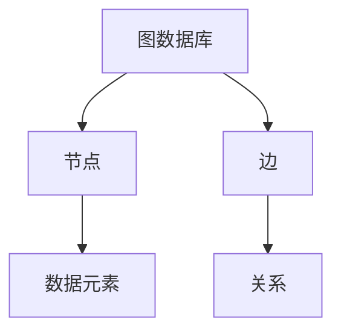

                 


### 书籍标题：《企业级图数据库：优化复杂关系数据的存储与查询》

#### 关键词：
- 企业级图数据库
- 数据存储优化
- 复杂关系数据
- 查询优化算法
- 应用案例

#### 摘要：
本书旨在深入探讨企业级图数据库的技术原理、优化策略及其在实际应用中的价值。通过系统性地阐述图数据库的定义、基本原理、存储与查询优化技术，并结合实际案例，本书为广大开发者提供了全面的指导，帮助企业高效管理复杂的关系数据，实现数据价值的最大化。

---

### 目录大纲

#### 第一部分：图数据库概述

#### 第1章：图数据库的兴起与重要性

##### 1.1 图数据库的定义与特点

**背景介绍：**
随着互联网和信息技术的快速发展，数据规模和复杂性呈指数级增长。传统的关系型数据库在处理复杂关系数据时面临诸多挑战，如图表连接查询效率低下、数据模型与业务逻辑不匹配等。图数据库应运而生，提供了一种全新的数据存储与查询方式。

**核心概念与联系：**
- **图数据库**：存储和查询图形结构的数据库。
- **节点**：图形中的数据元素。
- **边**：连接节点的数据关系。
- **图模型**：描述节点和边之间关系的数学模型。

**Mermaid 流程图：**


**核心算法原理讲解：**
- **图遍历算法**：深度优先搜索（DFS）和广度优先搜索（BFS）。
- **图索引技术**：邻接矩阵索引、哈希索引、B+树索引。

**数学模型和公式：**
$$
G = (V, E)
$$
其中，$V$表示节点集合，$E$表示边集合。

**举例说明：**
假设有一个社交网络图，其中每个用户是一个节点，用户之间的关注关系是边。我们可以使用图遍历算法来分析用户关系网络，查找共同好友或传播信息。

**项目实战：**
- **开发环境搭建**：配置图数据库（如Neo4j）并启动。
- **源代码详细实现**：实现一个简单的社交网络图，并使用DFS和BFS进行图遍历。

**代码解读与分析：**
```java
// 深度优先搜索（DFS）
void dfs(Node node) {
    visit(node);
    for (Node child : node.getChildren()) {
        if (!visited[child.getId()]) {
            dfs(child);
        }
    }
}

// 广度优先搜索（BFS）
void bfs(Node startNode) {
    Queue<Node> queue = new LinkedList<>();
    queue.add(startNode);
    visited[startNode.getId()] = true;

    while (!queue.isEmpty()) {
        Node currentNode = queue.poll();
        visit(currentNode);

        for (Node child : currentNode.getChildren()) {
            if (!visited[child.getId()]) {
                queue.add(child);
                visited[child.getId()] = true;
            }
        }
    }
}
```

**实际案例分析和详细讲解剖析：**
分析一个电商平台的用户购物行为网络，通过图遍历算法找出潜在的用户群体并进行精准营销。

**项目小结：**
通过实际案例，我们展示了图数据库在社交网络分析中的应用，并实现了节点和边的存储与查询。下一步，我们将进一步探讨图数据库的核心算法原理和优化策略。

---

以上是《企业级图数据库：优化复杂关系数据的存储与查询》的第一部分内容。接下来，我们将深入探讨图数据库的技术基础，包括图论基础、图模型表示和数据存储方法。敬请期待！

