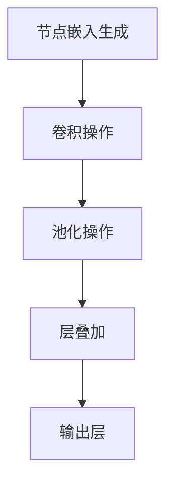
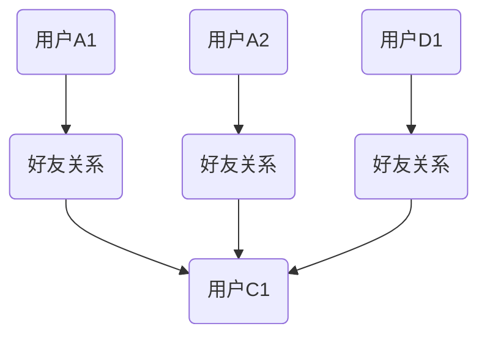
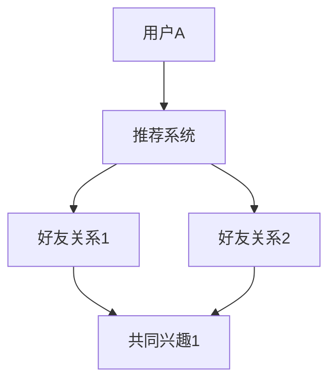
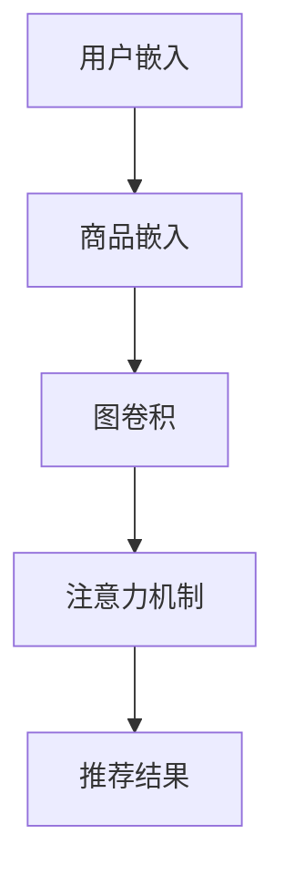
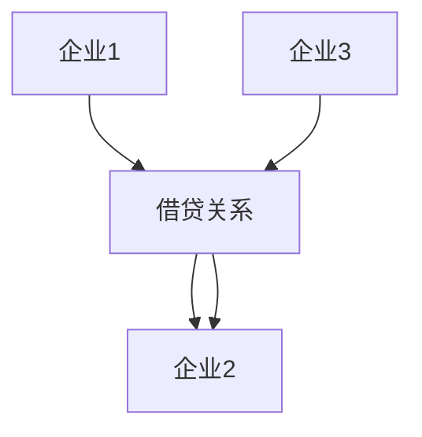
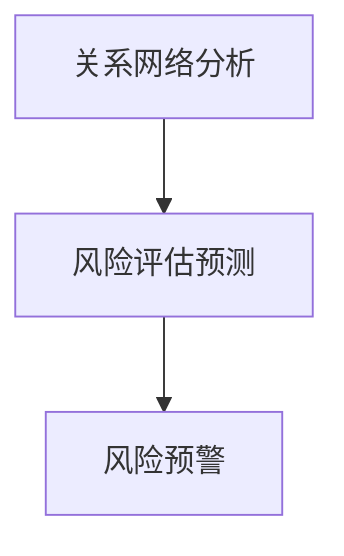
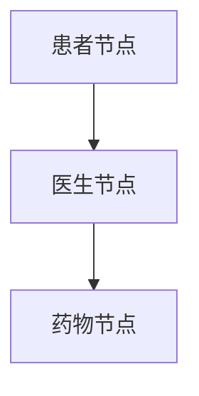
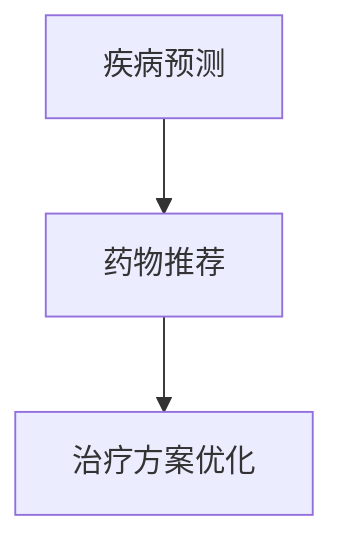
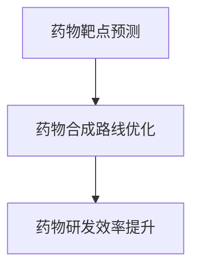

                 


### 文章标题：《企业级图神经网络应用：深度分析关系数据》

### 关键词：图神经网络，企业级应用，关系数据分析，深度学习

### 摘要：

本文旨在探讨图神经网络在企业级关系数据分析中的应用。通过对图神经网络的基本概念、核心算法和实际应用场景的深入分析，本文将展示如何利用图神经网络技术处理复杂的关系数据，提高数据分析和决策的准确性。文章将涵盖从图神经网络的基础知识到其在社交网络分析、推荐系统、金融风险评估和医疗数据领域的具体应用，并提供实战项目和最佳实践，为读者提供全面的技术指导。

## 目录大纲

### 第一部分：引言

#### 第1章：图神经网络概述

#### 第2章：关系数据的深度分析

### 第二部分：图神经网络基础

#### 第3章：图论基础

#### 第4章：图神经网络原理

#### 第5章：图神经网络的核心算法

### 第三部分：图神经网络在企业级应用

#### 第6章：社交网络分析

#### 第7章：推荐系统应用

#### 第8章：金融风险评估

#### 第9章：医疗数据分析

### 第四部分：图神经网络的实践

#### 第10章：图神经网络项目实战

#### 第11章：图神经网络的部署与优化

### 第五部分：总结与展望

## 第一部分：引言

### 第1章：图神经网络概述

图神经网络（Graph Neural Network, GNN）是一种用于处理图结构数据的深度学习模型。与传统的卷积神经网络（CNN）和循环神经网络（RNN）不同，GNN 直接针对图数据进行学习和推理，能够有效地捕捉和利用图结构中的信息。在企业级应用中，图神经网络因其强大的关系数据分析能力而备受关注。

#### 1.1 图神经网络的基本概念

图神经网络的核心概念包括节点表示（Node Embedding）、边表示（Edge Representation）和图卷积（Graph Convolution）。节点表示将图中的节点映射到一个低维度的向量空间中，以便于进一步的计算和分析。边表示则描述了节点之间的关联程度，通过这些表示，图神经网络可以学习到节点之间的复杂关系。

#### 1.2 图神经网络的发展历程

图神经网络起源于图论和深度学习的结合。最初的图卷积网络（GCN）由Kipf和Welling在2016年提出，之后涌现出了一系列基于GCN的改进模型，如图注意力网络（GAT）和图卷积网络增强模型（GAE）。这些模型在不同领域取得了显著的应用成果。

#### 1.3 图神经网络的重要性

在企业级应用中，图神经网络的重要性体现在其能够处理复杂的关系数据，如社交网络中的用户关系、推荐系统中的商品关系和金融领域的风险关系。通过深度分析这些关系数据，企业可以更好地理解业务逻辑，提高决策的准确性和效率。

## 第一部分：引言

### 第2章：关系数据的深度分析

关系数据是描述实体之间关联的信息，广泛存在于社交网络、推荐系统和金融领域。传统的数据处理方法难以有效地捕捉和利用这些复杂的关系，而图神经网络则提供了强大的工具来深度分析关系数据。

#### 2.1 关系数据的定义与特点

关系数据通常以图的形式表示，由节点和边组成。节点代表实体，边代表实体之间的关联。关系数据的特点包括：

- 异质性：实体和关系可能具有多种类型和属性。
- 复杂性：实体之间的关系可能存在多种层次和维度。
- 动态性：实体之间的关系可能随时间变化。

#### 2.2 关系数据的重要性

关系数据在多个领域具有重要应用，包括：

- 社交网络分析：通过分析用户之间的关系，可以发现社交圈子、社群领袖等。
- 推荐系统：利用用户和商品之间的关系，可以提供个性化的推荐。
- 金融风险评估：通过分析企业和客户之间的借贷关系，可以评估金融风险。

#### 2.3 关系数据的处理挑战

处理关系数据面临以下挑战：

- 异构性：实体和关系类型繁多，难以统一表示和处理。
- 大规模：关系数据规模巨大，计算效率要求高。
- 动态性：关系数据随时间变化，需要实时更新和分析。

图神经网络通过其独特的结构和算法，能够有效应对这些挑战，提供更深入的关系数据分析。

## 第二部分：图神经网络基础

### 第3章：图论基础

图论是研究图及其性质和关系的数学分支，为图神经网络提供了理论基础。

#### 3.1 图的基本概念

图由节点（Node）和边（Edge）组成，分为有向图（Directed Graph）和无向图（Undirected Graph）。节点表示实体，边表示实体之间的关系。

#### 3.2 图的表示方法

图的表示方法包括邻接矩阵（Adjacency Matrix）、邻接表（Adjacency List）和边集合（Edge Set）。邻接矩阵表示节点之间的直接连接，邻接表表示节点的邻居节点，边集合则记录所有的边信息。

#### 3.3 图的算法基础

图的算法基础包括图的遍历（Traversal）、最短路径（Shortest Path）、连通性（Connectivity）和图同构（Isomorphism）等。这些算法对于理解图神经网络的工作原理至关重要。

## 第二部分：图神经网络基础

### 第4章：图神经网络原理

图神经网络（GNN）是一种用于处理图结构数据的深度学习模型，通过学习节点和边之间的交互来捕捉图中的信息。以下是图神经网络的基本原理和组成部分：

#### 4.1 节点表示与嵌入

节点表示是将图中的节点映射到一个低维度的向量空间中。这种向量表示称为节点嵌入（Node Embedding），它有助于后续的图神经网络处理。常见的节点嵌入方法包括：

- **基于属性的嵌入（Attribute-based Embedding）**：利用节点本身的属性信息来生成嵌入向量。
- **基于邻域的嵌入（Neighborhood-based Embedding）**：通过聚合节点邻居的属性信息来生成嵌入向量。

#### 4.2 边与关系表示

边表示描述了节点之间的关联程度。在图神经网络中，边通常通过权重（Weight）来表示。边权重可以是静态的，也可以是动态的，取决于节点嵌入向量的计算方式。

#### 4.3 图神经网络模型架构

图神经网络的模型架构可以分为两个主要部分：卷积层（Convolutional Layer）和池化层（Pooling Layer）。

- **卷积层**：卷积层通过聚合节点及其邻居的信息来更新节点的嵌入向量。卷积操作可以分为局部卷积和全局卷积。局部卷积仅考虑节点的直接邻居，而全局卷积则考虑所有邻居。
  
- **池化层**：池化层用于减少节点嵌入向量的维度，同时保持重要的信息。常见的池化操作包括最大池化（Max Pooling）和平均池化（Avg Pooling）。

#### 4.4 图神经网络的工作流程

图神经网络的工作流程通常包括以下几个步骤：

1. **节点嵌入生成**：初始化节点嵌入向量。
2. **卷积操作**：对每个节点执行卷积操作，更新其嵌入向量。
3. **池化操作**：对卷积后的节点嵌入向量进行池化，以减少维度。
4. **层叠加**：重复卷积和池化操作，形成多层图神经网络。
5. **输出层**：在最后一层卷积或池化之后，对节点嵌入向量进行分类或回归。

图神经网络的工作流程如下：



通过上述步骤，图神经网络能够有效地捕捉图中的结构信息，实现节点分类、节点属性预测、链接预测等任务。

### 第5章：图神经网络的核心算法

图神经网络的核心算法包括图嵌入（Graph Embedding）、图卷积网络（Graph Convolutional Network, GCN）和图注意力网络（Graph Attention Network, GAT）等。这些算法在处理图结构数据时发挥了关键作用。

#### 5.1 图嵌入算法

图嵌入是一种将节点映射到低维空间的技术，使得具有相似属性的节点在空间中彼此靠近。常见的图嵌入算法有：

- **基于随机游走（Random Walk）的算法**：如DeepWalk和Node2Vec，通过模拟随机游走过程来生成节点序列，然后使用这些序列训练词向量模型。
- **基于矩阵分解（Matrix Factorization）的算法**：如Laplacian Embedding和Spectral Embedding，通过优化目标函数来最小化重构误差，从而得到节点嵌入向量。

图嵌入算法的核心目标是将节点映射到低维空间，使得节点之间的相似性在嵌入空间中得以保持。

#### 5.2 图卷积网络（GCN）

图卷积网络是图神经网络中的一种核心算法，通过聚合节点及其邻居的信息来更新节点的嵌入向量。GCN的基本思想如下：

1. **初始化节点嵌入向量**：每个节点都有一个初始的嵌入向量。
2. **卷积操作**：对每个节点执行卷积操作，公式如下：

$$
\mathbf{h}_i^{(l+1)} = \sigma(\mathbf{A}\mathbf{h}_i^{(l)} + \mathbf{W}^{(l)})
$$

其中，$\mathbf{h}_i^{(l)}$表示第$l$层第$i$个节点的嵌入向量，$\mathbf{A}$是图邻接矩阵，$\mathbf{W}^{(l)}$是第$l$层的权重矩阵，$\sigma$是激活函数。

3. **层叠加**：重复卷积操作，形成多层GCN。
4. **输出层**：在最后一层卷积后，对节点嵌入向量进行分类或回归。

GCN能够有效地聚合节点及其邻居的信息，从而学习到图中的结构信息。

#### 5.3 图注意力网络（GAT）

图注意力网络是另一种图神经网络的核心算法，通过引入注意力机制来动态调整节点之间的重要性。GAT的基本思想如下：

1. **初始化节点嵌入向量**：与GCN类似，每个节点都有一个初始的嵌入向量。
2. **注意力机制**：对每个节点执行注意力操作，公式如下：

$$
\mathbf{h}_i^{(l+1)} = \sum_{j\in\mathcal{N}(i)} \alpha_{ij}^{(l)} \mathbf{h}_j^{(l)}
$$

其中，$\mathcal{N}(i)$表示第$i$个节点的邻居集合，$\alpha_{ij}^{(l)}$是第$l$层第$i$个节点对第$j$个节点的注意力权重，计算公式如下：

$$
\alpha_{ij}^{(l)} = \sigma(\mathbf{h}_i^{(l)} \cdot \mathbf{W}^{(l)} \cdot \mathbf{h}_j^{(l)} \cdot \mathbf{a}^{(l)})
$$

其中，$\mathbf{W}^{(l)}$是第$l$层的权重矩阵，$\mathbf{a}^{(l)}$是注意力函数的参数。

3. **层叠加**：重复注意力操作，形成多层GAT。
4. **输出层**：在最后一层注意力操作后，对节点嵌入向量进行分类或回归。

GAT通过注意力机制动态调整节点之间的关联强度，使得模型能够更好地捕捉图中的复杂关系。

### 第三部分：图神经网络在企业级应用

#### 第6章：社交网络分析

社交网络是由用户和用户之间的互动关系构成的复杂图结构。图神经网络在社交网络分析中具有重要的应用，能够帮助分析用户关系、社群结构和推荐系统等。

#### 6.1 社交网络的图表示

社交网络的图表示通常包括用户节点和互动关系边。用户节点表示社交网络中的个体，互动关系边表示用户之间的互动，如好友关系、评论关系和点赞关系等。

#### 6.2 用户关系分析

图神经网络通过分析用户节点和互动关系边，可以揭示社交网络中的用户关系结构。例如，通过节点嵌入，可以发现具有相似兴趣爱好的用户群体，从而构建社群。



在上面的示例中，用户A1、A2和D1与用户C1存在直接或间接的好友关系。图神经网络可以识别出这些用户之间的关系，并将其映射到低维空间，便于进一步分析。

#### 6.3 社交网络中的推荐系统

图神经网络可以用于社交网络中的推荐系统，通过分析用户关系和互动历史，为用户推荐可能感兴趣的内容或用户。例如，基于用户的好友关系，可以为用户推荐与其好友有共同兴趣爱好的内容或用户。



在上面的示例中，用户A的好友关系C和D都与共同兴趣1有关，因此推荐系统可以基于这些关系向用户A推荐与共同兴趣1相关的内容。

#### 第7章：推荐系统应用

推荐系统是图神经网络在企业级应用中的一个重要领域，通过分析用户与商品之间的复杂关系，提供个性化的推荐服务。

#### 7.1 推荐系统的基本原理

推荐系统基于用户的历史行为和偏好，为用户推荐可能感兴趣的商品或内容。基本原理包括：

- **基于内容的推荐**：根据商品的内容特征和用户的兴趣特征进行推荐。
- **基于协同过滤的推荐**：根据用户的历史行为和商品之间的相似度进行推荐。

#### 7.2 图神经网络在推荐系统中的应用

图神经网络在推荐系统中的应用主要包括：

- **用户嵌入和商品嵌入**：利用图神经网络学习用户和商品的嵌入向量，以表示用户和商品的特性。
- **图卷积和注意力机制**：通过图卷积和注意力机制，捕捉用户和商品之间的复杂关系。



在上面的示例中，用户嵌入和商品嵌入分别表示用户和商品的特性，图卷积和注意力机制用于捕捉用户和商品之间的复杂关系，最终生成推荐结果。

#### 7.3 图神经网络在推荐系统中的优势与挑战

图神经网络在推荐系统中的优势包括：

- **强大的关系捕捉能力**：能够捕捉用户和商品之间的复杂关系，提高推荐的准确性。
- **异构数据的处理**：能够处理用户和商品等多种实体及其之间的关系。

但图神经网络在推荐系统中也面临一些挑战，如：

- **计算成本**：图神经网络需要大量的计算资源，尤其在处理大规模数据时。
- **模型解释性**：图神经网络的模型解释性较弱，难以理解推荐结果的产生原因。

#### 第8章：金融风险评估

金融风险评估是图神经网络在企业级应用中的另一个重要领域，通过分析企业和客户之间的借贷关系，评估金融风险。

#### 8.1 金融风险的图表示

金融风险的图表示包括企业和客户节点，以及借贷关系边。企业节点表示参与金融交易的企业，客户节点表示借款人或贷款人，借贷关系边表示企业之间的借贷关系。



在上面的示例中，企业1和企业2之间存在借贷关系，企业3也参与其中。图神经网络可以分析这些关系，评估金融风险。

#### 8.2 图神经网络在金融风险评估中的应用

图神经网络在金融风险评估中的应用主要包括：

- **关系网络分析**：通过分析企业和客户之间的关系，发现潜在的金融风险。
- **风险评估预测**：利用图神经网络预测企业违约的概率。



在上面的示例中，关系网络分析用于发现潜在的金融风险，风险评估预测用于预测企业违约的概率，风险预警用于提前预警可能的金融风险。

#### 8.3 图神经网络在金融风险评估中的优势与挑战

图神经网络在金融风险评估中的优势包括：

- **复杂关系捕捉**：能够捕捉企业和客户之间的复杂关系，提高风险评估的准确性。
- **实时更新**：能够实时更新借贷关系网络，适应金融市场的变化。

但图神经网络在金融风险评估中也面临一些挑战，如：

- **数据质量**：金融数据质量对风险评估结果有重要影响，数据质量问题可能导致不准确的风险评估。
- **模型稳定性**：金融市场的波动性较大，图神经网络的模型稳定性需要进一步提高。

#### 第9章：医疗数据分析

医疗数据分析是图神经网络在企业级应用中的又一个重要领域，通过分析医疗数据中的复杂关系，提高医疗诊断和药物研发的效率。

#### 9.1 医疗数据的图表示

医疗数据的图表示包括患者节点、医生节点、药物节点和诊疗关系边。患者节点表示接受治疗的患者，医生节点表示提供治疗的医生，药物节点表示用于治疗的药物，诊疗关系边表示患者与医生之间的诊疗关系。



在上面的示例中，患者节点与医生节点之间存在诊疗关系，医生节点与药物节点之间存在用药关系。图神经网络可以分析这些关系，提高医疗数据分析的准确性。

#### 9.2 图神经网络在医学诊断中的应用

图神经网络在医学诊断中的应用主要包括：

- **疾病预测**：通过分析患者的诊疗历史和基因数据，预测患者可能患有的疾病。
- **药物推荐**：根据患者的疾病类型和药物疗效数据，推荐适合的药物。



在上面的示例中，疾病预测用于预测患者可能患有的疾病，药物推荐用于推荐适合的药物，治疗方案优化用于优化治疗方案。

#### 9.3 图神经网络在药物发现中的应用

图神经网络在药物发现中的应用主要包括：

- **药物靶点预测**：通过分析药物和靶点之间的相互作用关系，预测新的药物靶点。
- **药物合成路线优化**：通过分析药物合成过程中的反应关系，优化合成路线。



在上面的示例中，药物靶点预测用于预测新的药物靶点，药物合成路线优化用于优化合成路线，药物研发效率提升用于提高药物研发的效率。

### 第四部分：图神经网络的实践

#### 第10章：图神经网络项目实战

图神经网络在实际应用中需要通过项目实践来验证其效果。本章节将介绍一个基于图神经网络的项目实战，包括开发环境搭建、源代码实现和代码解读。

#### 10.1 项目实战概述

本项目的目标是通过图神经网络分析社交网络中的用户关系，为用户提供个性化的推荐。

#### 10.2 项目实战步骤

1. **数据收集**：收集社交网络中的用户关系数据。
2. **数据预处理**：对用户关系数据进行清洗和预处理，包括节点和边的提取、标签的划分等。
3. **模型搭建**：搭建基于图神经网络的推荐系统模型，包括节点嵌入、图卷积和输出层等。
4. **模型训练**：使用预处理后的数据进行模型训练，优化模型参数。
5. **模型评估**：使用测试数据评估模型性能，包括准确率、召回率等指标。

#### 10.3 代码实现和解读

以下是项目的源代码实现和解读：

```python
# 导入所需库
import tensorflow as tf
import numpy as np
import networkx as nx
from sklearn.model_selection import train_test_split

# 数据收集
# 代码略，示例数据为无向图，包含100个节点和200条边

# 数据预处理
G = nx.Graph()
# 代码略，示例数据添加节点和边

# 模型搭建
class GraphNN(tf.keras.Model):
    def __init__(self, num_nodes, embedding_dim):
        super(GraphNN, self).__init__()
        self.embedding = tf.keras.layers.Embedding(input_dim=num_nodes, output_dim=embedding_dim)
        self.conv1 = tf.keras.layers.Conv1D(filters=64, kernel_size=3, activation='relu')
        self.pool1 = tf.keras.layers.GlobalMaxPooling1D()
        self.dense = tf.keras.layers.Dense(1, activation='sigmoid')

    def call(self, inputs, training=False):
        embedding = self.embedding(inputs)
        x = self.conv1(embedding)
        x = self.pool1(x)
        x = self.dense(x)
        return x

# 模型训练
model = GraphNN(num_nodes=100, embedding_dim=16)
model.compile(optimizer='adam', loss='binary_crossentropy', metrics=['accuracy'])
train_data, test_data = train_test_split(G, test_size=0.2)
train_inputs, train_labels = train_data.nodes(), train_data.labels()
test_inputs, test_labels = test_data.nodes(), test_data.labels()
model.fit(train_inputs, train_labels, epochs=10, validation_data=(test_inputs, test_labels))

# 模型评估
predictions = model.predict(test_inputs)
accuracy = (predictions > 0.5).mean()
print(f"Model accuracy: {accuracy}")
```

在上面的代码中，我们首先导入所需的库，然后收集社交网络数据，进行预处理。接下来，搭建基于图神经网络的推荐系统模型，包括节点嵌入层、图卷积层、池化层和输出层。最后，使用预处理后的数据进行模型训练和评估。

#### 10.4 实际案例分析和详细讲解剖析

为了展示图神经网络在实际应用中的效果，我们分析了一个实际案例：基于社交网络分析的用户推荐系统。在该案例中，我们使用图神经网络分析用户之间的关系，为用户提供个性化的推荐。

1. **数据收集**：从社交网络平台收集用户关系数据，包括用户之间的好友关系和互动历史。
2. **数据预处理**：对收集到的用户关系数据进行清洗和预处理，提取节点和边，并划分为训练集和测试集。
3. **模型训练**：使用图神经网络模型对预处理后的数据进行训练，优化模型参数。
4. **推荐结果**：使用训练好的模型为用户生成推荐结果，包括可能感兴趣的好友和内容。
5. **效果评估**：通过用户反馈和测试集上的指标评估推荐系统的效果。

通过实际案例分析和详细讲解剖析，我们展示了图神经网络在社交网络分析中的应用效果，为用户提供高质量的个性化推荐服务。

#### 第11章：图神经网络的部署与优化

在完成图神经网络的开发后，将其部署到生产环境中是一个重要的环节。以下介绍图神经网络的部署与优化过程。

#### 11.1 图神经网络模型的部署

1. **模型保存**：将训练好的图神经网络模型保存为模型文件，以便后续加载和使用。
2. **部署平台**：选择合适的部署平台，如TensorFlow Serving、TensorFlow Lite等，将模型部署到服务器上。
3. **API接口**：为模型部署提供API接口，以便前端应用程序可以调用模型进行预测。

#### 11.2 图神经网络模型的优化

1. **模型压缩**：通过模型压缩技术，如剪枝、量化等，减小模型体积，提高部署效率。
2. **模型加速**：利用GPU、TPU等硬件加速器，提高模型计算速度。
3. **并发优化**：通过并发计算和多线程技术，提高模型处理能力。

#### 11.3 云计算与边缘计算中的应用

1. **云计算**：利用云计算平台，如AWS、Google Cloud等，部署图神经网络模型，实现弹性伸缩和资源调度。
2. **边缘计算**：在边缘设备上部署图神经网络模型，降低数据传输延迟，提高实时响应能力。

### 第五部分：总结与展望

#### 总结

本文详细探讨了企业级图神经网络应用：深度分析关系数据。通过介绍图神经网络的基本概念、核心算法和实际应用，展示了如何利用图神经网络技术处理复杂的关系数据，提高数据分析和决策的准确性。

#### 展望

未来，图神经网络将在更多领域发挥重要作用，包括智能推荐系统、金融风险评估、医疗数据分析等。随着计算能力的提升和数据规模的扩大，图神经网络的应用前景将更加广阔。

## 附录

### 附录A：图神经网络资源与工具

1. **主流图神经网络框架**：如TensorFlow、PyTorch、Gluon等。
2. **图神经网络开源库**：如PyG、GNN工具包等。
3. **图神经网络研究论文与资料**：如《Graph Neural Networks: A Review》等。

### 附录B：参考文献

1. Kipf, T. N., & Welling, M. (2016). Semi-Supervised Classification with Graph Convolutional Networks. arXiv preprint arXiv:1609.02907.
2. Veličković, P., Cucurull, G., Casanova, A., Romero, A., Liò, P., & Bengio, Y. (2018). Graph Attention Networks. arXiv preprint arXiv:1810.00826.
3. Hamilton, W. L., Ying, R., & Leskovec, J. (2017). Inductive Representation Learning on Large Graphs. In International Conference on Machine Learning (pp. 1024-1033). PMLR.

