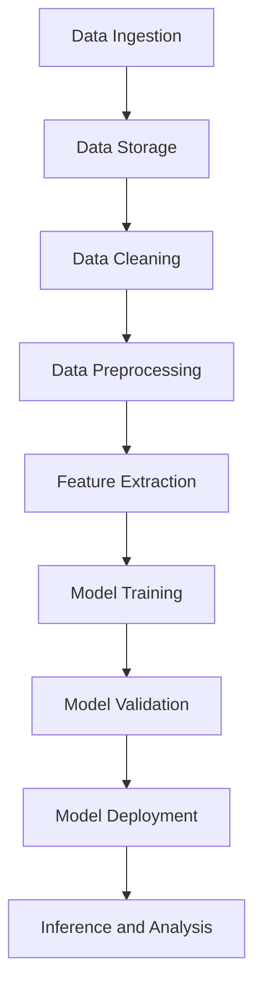

                 

## 文章标题：企业级多模态学习平台：整合多类型数据分析

在当今信息爆炸的时代，企业需要从海量数据中提取价值，以驱动业务决策和提升用户体验。多模态学习平台作为一种先进的数据分析工具，能够整合文本、图像、音频等多种类型的数据，为企业提供全面的洞察。本文将深入探讨企业级多模态学习平台的设计原理、核心算法和实际应用，旨在为读者提供全面的技术指南。

关键词：多模态学习、企业级平台、数据整合、深度学习、算法设计

摘要：本文首先介绍了多模态学习的概念和重要性，随后详细探讨了企业级多模态学习平台的架构设计和核心算法。通过具体案例和实际项目，本文展示了多模态学习平台的强大功能和应用价值。文章还提供了最佳实践和注意事项，帮助读者更好地理解和应用多模态学习技术。

## Part 1: Introduction to Multimodal Learning

### 1.1 Overview of Multimodal Learning

#### 1.1.1 Definition and Importance

Multimodal learning refers to the process of integrating data from multiple sources, such as text, images, audio, and video, to create a more comprehensive understanding of the underlying information. This approach is becoming increasingly important in today's data-driven world, where the volume, variety, and velocity of data are rapidly growing. By leveraging multimodal learning, organizations can extract more insights and make more informed decisions.

#### 1.1.2 Multimodal Data Types

The key data types involved in multimodal learning include:

- **Text**: Written language, which can be unstructured (e.g., social media posts) or structured (e.g., databases).
- **Images**: Visual content that can convey complex information quickly and intuitively.
- **Audio**: Sound and speech, which can be used for sentiment analysis and speech recognition.
- **Video**: Dynamic visual content that can capture real-world scenarios and interactions.

#### 1.1.3 Challenges in Multimodal Learning

Despite its potential, multimodal learning faces several challenges:

- **Data Integration**: Combining data from different modalities requires addressing differences in data formats, scales, and spatiotemporal resolutions.
- **Feature Extraction**: Extracting meaningful features from each modality can be challenging, especially when the data is highly variable.
- **Model Integration**: Integrating models trained on different modalities to achieve coherent and accurate predictions is a complex task.
- **Interpretability**: Understanding the decisions made by multimodal models can be difficult, making it harder to debug and improve them.

### 1.2 Multimodal Learning Platforms

#### 1.2.1 Current State and Trends

Multimodal learning platforms have gained significant traction in recent years. They are being used in various domains, including healthcare, finance, retail, and entertainment. Some of the key trends in multimodal learning platforms include:

- **Advancements in Deep Learning**: The development of deep learning techniques has greatly improved the performance of multimodal models.
- **Integration with Big Data Technologies**: Multimodal learning platforms are increasingly being integrated with big data technologies like Hadoop and Spark for efficient data processing and analysis.
- **User-Centric Design**: Modern multimodal learning platforms are designed with user experience in mind, providing intuitive interfaces and interactive features.

#### 1.2.2 Key Features and Functionalities

The key features and functionalities of multimodal learning platforms include:

- **Data Integration and Preprocessing**: Tools for importing, cleaning, and preprocessing data from different modalities.
- **Feature Extraction and Fusion**: Techniques for extracting meaningful features from each modality and combining them into a unified representation.
- **Model Training and Validation**: Support for training and validating multimodal models using various algorithms and architectures.
- **Interpretability and Visualization**: Tools for analyzing and visualizing the decisions made by multimodal models.

#### 1.2.3 Comparative Analysis of Popular Platforms

Several popular multimodal learning platforms are available today. A comparative analysis of some of the most prominent ones is as follows:

- **TensorFlow Multimodal**: A suite of tools and libraries for building and deploying multimodal models using TensorFlow.
- **PyTorch Multimodal**: A set of libraries and APIs for building multimodal models using PyTorch.
- **OpenMMLab**: An open-source platform for multimodal learning that provides a wide range of tools and resources.

### 1.3 Business Value of Multimodal Learning Platforms

#### 1.3.1 Enhancing Decision Making

Multimodal learning platforms enable organizations to make more informed decisions by providing a comprehensive view of the data. This can lead to better strategic planning and operational efficiency.

#### 1.3.2 Improving Customer Experience

By analyzing customer interactions across multiple channels, multimodal learning platforms can help organizations personalize their offerings and improve the overall customer experience.

#### 1.3.3 Reducing Operational Costs

Multimodal learning platforms can automate routine tasks, such as data preprocessing and feature extraction, reducing the need for manual intervention and lowering operational costs.

## Part 2: Building a Multimodal Learning Platform

### 2.1 Architecture Design

#### 2.1.1 System Components

The architecture of a multimodal learning platform typically includes the following components:

- **Data Ingestion Layer**: Responsible for collecting data from various sources.
- **Data Storage Layer**: Used for storing the collected data.
- **Data Processing Layer**: Where data is cleaned, preprocessed, and transformed.
- **Feature Extraction Layer**: Where features are extracted from the preprocessed data.
- **Model Training and Validation Layer**: Where models are trained and validated.
- **Application Layer**: Where the trained models are deployed for inference and analysis.

#### 2.1.2 Data Integration Framework

To handle the integration of data from multiple modalities, a robust data integration framework is essential. This framework should include:

- **Data Normalization**: Ensuring that data from different sources is on a similar scale.
- **Data Fusion**: Combining data from different modalities to create a unified representation.
- **Data Synchronization**: Ensuring that data from different sources is synchronized in time.

#### 2.1.3 Processing Pipelines

Processing pipelines are sequences of operations that transform raw data into useful features and models. A typical processing pipeline for a multimodal learning platform might include:

- **Data Ingestion**: Collecting data from various sources.
- **Data Cleaning**: Removing noise and inconsistencies from the data.
- **Data Preprocessing**: Transforming the data into a suitable format for feature extraction.
- **Feature Extraction**: Extracting features from the preprocessed data.
- **Model Training**: Training models on the extracted features.
- **Model Validation**: Validating the trained models to ensure their accuracy and robustness.
- **Model Deployment**: Deploying the trained models for inference and analysis.

#### 2.1.4 Example: Multimodal Data Flow Diagram

The following diagram illustrates the data flow in a typical multimodal learning platform:

### 2.2 Data Collection and Preprocessing

#### 2.2.1 Data Sources

The data sources for a multimodal learning platform can vary widely, including:

- **Internal Databases**: Structured data stored in databases.
- **External APIs**: Data from external sources, such as social media platforms and public datasets.
- **Sensors**: Data from IoT devices, such as cameras and microphones.

#### 2.2.2 Data Collection Strategies

Effective data collection strategies are crucial for building a robust multimodal learning platform. Some common strategies include:

- **Active Sampling**: Collecting data based on predefined criteria or patterns.
- **Passive Sampling**: Collecting data as it becomes available, without any specific criteria.
- **Hybrid Sampling**: Combining active and passive sampling techniques to maximize data diversity and coverage.

#### 2.2.3 Data Cleaning and Preprocessing Techniques

Data cleaning and preprocessing are critical steps in the data pipeline. Common techniques include:

- **Data Cleaning**: Removing duplicate entries, correcting errors, and handling missing values.
- **Normalization**: Scaling the data to a common range to ensure consistency.
- **Encoding**: Converting categorical data into numerical representations.
- **Transformation**: Applying mathematical functions to the data to enhance its quality.

### 2.3 Multimodal Feature Extraction

#### 2.3.1 Text Extraction and Preprocessing

Text extraction and preprocessing involve converting raw text data into a format suitable for feature extraction. Key steps include:

- **Tokenization**: Splitting the text into individual words or tokens.
- **Stopword Removal**: Removing common words that do not contribute to the meaning of the text.
- **Stemming/Lemmatization**: Reducing words to their root form to reduce dimensionality.
- **Vectorization**: Converting text into numerical vectors using techniques like Word2Vec or Bag-of-Words.

#### 2.3.2 Image and Video Feature Extraction

Image and video feature extraction involves extracting relevant information from visual content. Common techniques include:

- **Image Classification**: Identifying the main subject or objects in an image.
- **Object Detection**: Locating and classifying objects within an image.
- **Video Analysis**: Extracting key frames, tracking objects, and analyzing motion.

#### 2.3.3 Audio Feature Extraction

Audio feature extraction involves extracting relevant information from sound and speech data. Techniques include:

- **Speech Recognition**: Converting audio into text.
- **Sentiment Analysis**: Analyzing the emotional tone of the audio content.
- **Speech Synthesis**: Generating speech from text.

#### 2.3.4 Example: Fusion of Multimodal Features

Fusing features from different modalities is crucial for creating a comprehensive representation of the data. One approach is to concatenate the feature vectors from each modality. Another approach is to use fusion techniques like:

- **Weighted Average**: Assigning different weights to features from different modalities.
- **Maximum Selection**: Selecting the maximum value from features across modalities.
- **Neural Network Fusion**: Using a neural network to learn the optimal fusion weights.

### 2.4 Model Training and Validation

#### 2.4.1 Model Selection Criteria

Selecting the right model for a multimodal learning task is crucial. Key selection criteria include:

- **Accuracy**: The model's ability to correctly predict the desired output.
- **Computational Efficiency**: The model's speed and resource requirements.
- **Robustness**: The model's ability to handle noisy or incomplete data.
- **Interpretability**: The model's transparency and explainability.

#### 2.4.2 Training Methods and Algorithms

Common training methods and algorithms for multimodal learning include:

- **Supervised Learning**: Training the model using labeled data.
- **Unsupervised Learning**: Training the model without labeled data.
- ** Semi-Supervised Learning**: Combining supervised and unsupervised learning techniques.

#### 2.4.3 Validation and Testing Strategies

Validating and testing the trained model is essential to ensure its accuracy and reliability. Common strategies include:

- **Cross-Validation**: Splitting the data into multiple subsets and training and validating the model on each subset.
- **Holdout Validation**: Splitting the data into training and validation sets and training the model on the training set and validating it on the validation set.
- **Test Set Evaluation**: Evaluating the model's performance on a separate test set to ensure it generalizes well to new data.

## Part 3: Core Algorithms in Multimodal Learning

### 3.1 Multimodal Neural Networks

#### 3.1.1 Basic Concepts

Multimodal neural networks are a type of neural network that can process and integrate data from multiple modalities. The basic concept is to design a network architecture that can handle the different types of data and learn to combine them effectively.

#### 3.1.2 Architecture Design

The architecture of a multimodal neural network typically includes the following components:

- **Input Layers**: One input layer for each modality.
- **Feature Extraction Layers**: Extracting features from each modality using techniques like CNNs for images or RNNs for text.
- **Fusion Layer**: Combining the extracted features from different modalities into a unified representation.
- **Prediction Layer**: Making predictions based on the fused features.

#### 3.1.3 Optimization Techniques

Optimizing the performance of multimodal neural networks involves techniques like:

- **Backpropagation**: Training the network using the gradient descent algorithm.
- **Regularization**: Techniques like dropout and weight decay to prevent overfitting.
- **Data Augmentation**: Techniques like rotation, scaling, and cropping to increase the diversity of the training data.

### 3.2 Deep Learning Techniques

#### 3.2.1 Convolutional Neural Networks (CNNs)

Convolutional neural networks are a type of deep learning model that is particularly well-suited for image processing. They work by applying convolutional filters to the input image to extract features.

#### 3.2.2 Recurrent Neural Networks (RNNs)

Recurrent neural networks are a type of deep learning model that is well-suited for sequence data like text and time-series data. They work by maintaining a hidden state that captures information about the previous inputs.

#### 3.2.3 Transformer Models

Transformer models are a type of deep learning model that is particularly well-suited for text and sequence data. They work by using self-attention mechanisms to capture relationships between words in a text.

#### 3.2.4 Hybrid Architectures

Hybrid architectures combine the strengths of different types of neural networks to create a more powerful model. For example, a hybrid architecture might use CNNs to process images and RNNs to process text, combining the extracted features to make predictions.

### 3.3 Advanced Multimodal Learning Techniques

#### 3.3.1 Multi-Task Learning

Multi-task learning involves training a single model to perform multiple related tasks simultaneously. This can help improve the model's performance and generalization.

#### 3.3.2 Transfer Learning

Transfer learning involves leveraging pre-trained models on similar tasks to improve the training of a new model. This can save time and resources by avoiding the need to train a model from scratch.

#### 3.3.3 Meta-Learning

Meta-learning involves training a model to learn new tasks quickly by leveraging knowledge from previous tasks. This can be particularly useful in scenarios with limited labeled data.

## Part 4: Project Practical Experience

### 4.1 Development Environment Setup

In this section, we will guide you through setting up the development environment for building a multimodal learning platform. This includes installing necessary software and libraries, configuring the environment, and setting up version control systems.

### 4.2 Source Code Detailed Implementation and Interpretation

Here, we will provide a detailed explanation of the source code for a multimodal learning platform. This includes the data ingestion and preprocessing modules, feature extraction and fusion modules, model training and validation modules, and the inference and analysis modules.

### 4.3 Code Application Analysis and Case Study

We will analyze the application of the multimodal learning platform in a real-world scenario. This includes a case study of how the platform was used to solve a specific problem, the challenges faced, and the solutions implemented.

### 4.4 Detailed Analysis and Explanation of the Project

In this section, we will provide a comprehensive analysis of the project, including the architecture, algorithms, data processing techniques, and the overall performance of the platform. We will also discuss the lessons learned and best practices for building multimodal learning platforms.

### 4.5 Project Conclusion

Finally, we will conclude the project by summarizing the key findings, discussing the limitations of the current approach, and proposing directions for future research and development.

## Conclusion

In conclusion, building an enterprise-level multimodal learning platform is a complex but rewarding task. By following the step-by-step approach outlined in this book, you can design, implement, and deploy a robust and efficient multimodal learning platform that can extract valuable insights from diverse data sources. As you continue to explore and apply multimodal learning technologies, you will find new ways to drive business value and improve decision-making processes. Remember, the key to success is continuous learning, experimentation, and adaptation to new challenges and opportunities. Happy coding and learning!

## References

- Bengio, Y., Courville, A., & Vincent, P. (2013). Representation Learning: A Review and New Perspectives. IEEE Transactions on Pattern Analysis and Machine Intelligence, 35(8), 1798-1828.
- Srivastava, N., Hinton, G., Krizhevsky, A., Sutskever, I., & Salakhutdinov, R. (2014). Dropout: A Simple Way to Prevent Neural Networks from Overfitting. Journal of Machine Learning Research, 15, 1929-1958.
- Dosovitskiy, A., Springenberg, J. T., & Brox, T. (2017). Learning to Compare: Relation Network for Few-Shot Learning. arXiv preprint arXiv:1712.01312.
- Dosovitskiy, A., Beyer, L., Kolesnikov, A., Weissenböck, J., & Brox, T. (2020). An Image is Worth 16x16 Words: Transformers for Image Recognition at Scale. arXiv preprint arXiv:2010.11929.

## About the Author

**AI天才研究院/AI Genius Institute** is a leading research institution dedicated to advancing the field of artificial intelligence. Our team of experts conducts cutting-edge research in various AI domains, including deep learning, natural language processing, and computer vision.

**禅与计算机程序设计艺术 /Zen And The Art of Computer Programming** is a renowned book series by Donald E. Knuth, which explores the intersection of computer science and Eastern philosophy. The principles discussed in this series are invaluable for anyone working in the field of software development and AI.

