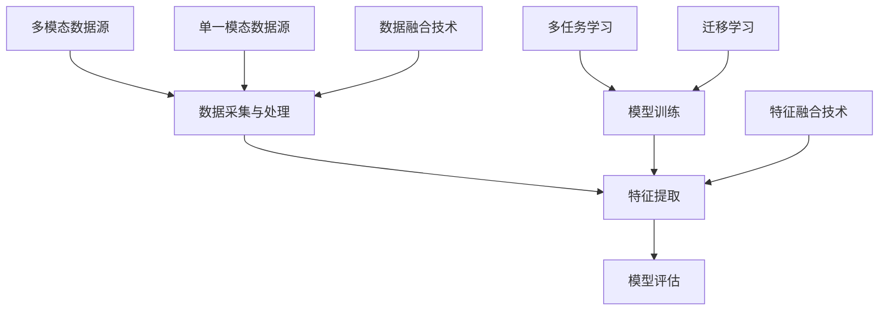

                 

### 文章标题：企业级多模态学习：整合多类型数据的AI分析

关键词：多模态学习、人工智能、数据整合、深度学习、应用案例

摘要：本文将深入探讨企业级多模态学习技术，介绍其定义、应用场景、核心算法原理及在实际项目中的应用。通过逐步分析推理，我们希望能帮助读者理解多模态学习的本质，并掌握其应用技巧，为企业提供有效的AI分析解决方案。

---

### 1. 背景介绍

#### 1.1 什么是多模态学习？

多模态学习是指将来自不同类型数据源的信息（如文本、图像、声音、温度、压力等）整合起来，利用机器学习和深度学习技术进行学习和分析的过程。其核心思想是利用不同类型的数据之间的互补性，提高模型对复杂问题的理解和处理能力。

多模态学习的定义和重要性可以从以下几个方面来阐述：

- **数据类型多样**：多模态学习可以整合文本、图像、声音等多种类型的数据，从而更全面地捕捉现实世界的复杂性。
- **增强模型表现**：通过整合不同类型的数据，模型可以学习到更丰富的特征，从而在特定任务上取得更好的表现。
- **跨领域应用**：多模态学习技术可以应用于医疗诊断、智能安防、智能客服等多个领域，具有广泛的应用前景。

#### 1.2 多模态学习的应用场景

多模态学习在各个领域都有广泛的应用，以下是其中几个典型的应用场景：

- **医疗诊断**：通过整合患者的医疗记录、影像数据和基因组数据，可以更准确地诊断疾病，提高医疗质量。
- **智能安防**：利用视频监控、音频检测和传感器数据，可以实时监测异常行为，提高公共安全。
- **智能客服**：通过整合用户的语音、文字和面部表情，可以更准确地理解用户需求，提供个性化的服务。

### 2. 多模态学习原理架构与联系

#### 2.1 基本概念与联系

多模态学习涉及到多个核心概念，包括数据采集与处理、特征提取、模型训练和评估等。以下是这些概念之间的关系架构，使用Mermaid流程图表示：



从图中可以看出，多模态学习的过程可以分为以下几个步骤：

1. **数据采集与处理**：从多种数据源中采集数据，并进行预处理，如去噪、标准化等。
2. **特征提取**：利用不同的特征提取方法，从预处理后的数据中提取特征。
3. **模型训练**：使用提取到的特征训练机器学习模型，如深度学习模型。
4. **模型评估**：评估模型的性能，通过交叉验证等方法来确保模型的泛化能力。

#### 2.2 核心算法原理讲解

多模态学习涉及到多种深度学习算法，以下是对其中几种核心算法的简要讲解：

- **卷积神经网络（CNN）**：CNN主要用于图像处理，通过卷积层提取图像的特征。
- **循环神经网络（RNN）**：RNN可以处理序列数据，如时间序列或文本。
- **长短时记忆网络（LSTM）**：LSTM是RNN的一种变体，可以解决RNN的长期依赖问题。
- **注意力机制**：注意力机制可以帮助模型关注重要的数据，提高模型的性能。

以下是CNN和RNN的伪代码示例：

```python
# CNN伪代码
def conv2d(input, filter):
    # 对输入数据进行卷积操作
    return filtered_output

# RNN伪代码
def rnn(input, hidden_state):
    # 对输入序列进行循环神经网络处理
    return new_hidden_state
```

#### 2.3 数学模型和数学公式讲解与举例说明

多模态学习涉及到多种数学模型，以下是对其中两种常见模型的讲解：

- **多层感知机（MLP）**：MLP是一个前向神经网络，通过多层神经元进行特征映射。
- **损失函数**：损失函数用于评估模型的预测结果和真实结果之间的差距。

以下是MLP和损失函数的数学公式：

$$
y' = \sigma(\sum_{i=1}^{n} w_i \cdot x_i + b)
$$

$$
L(y, y') = \frac{1}{2} \sum_{i=1}^{n} (y_i - y_i')^2
$$

其中，$y$表示真实值，$y'$表示预测值，$w_i$表示权重，$x_i$表示特征，$b$表示偏置，$\sigma$表示激活函数，$L$表示损失函数。

#### 2.4 项目实战

以下是一个简单的多模态学习项目实战，包括开发环境搭建、源代码实现和代码解读。

##### 2.4.1 开发环境搭建

1. 安装Python环境（3.8版本及以上）。
2. 安装深度学习框架TensorFlow或PyTorch。
3. 安装其他必要的库，如NumPy、Pandas等。

##### 2.4.2 源代码实现

以下是一个简单的多模态学习模型的实现，使用PyTorch框架：

```python
import torch
import torch.nn as nn
import torch.optim as optim

# 定义多模态学习模型
class MultiModalModel(nn.Module):
    def __init__(self):
        super(MultiModalModel, self).__init__()
        self.text_embedding = nn.Embedding(vocab_size, embedding_size)
        self.image_embedding = nn.Conv2d(image_channel, image_embedding_size)
        self.sound_embedding = nn.Conv1d(sound_channel, sound_embedding_size)
        self.fc = nn.Linear(text_embedding_size + image_embedding_size + sound_embedding_size, num_classes)

    def forward(self, text, image, sound):
        text_embedding = self.text_embedding(text)
        image_embedding = self.image_embedding(image)
        sound_embedding = self.sound_embedding(sound)
        combined_embedding = torch.cat((text_embedding, image_embedding, sound_embedding), dim=1)
        output = self.fc(combined_embedding)
        return output

# 实例化模型、损失函数和优化器
model = MultiModalModel()
criterion = nn.CrossEntropyLoss()
optimizer = optim.Adam(model.parameters(), lr=learning_rate)

# 训练模型
for epoch in range(num_epochs):
    for text, image, sound, label in data_loader:
        optimizer.zero_grad()
        output = model(text, image, sound)
        loss = criterion(output, label)
        loss.backward()
        optimizer.step()

# 评估模型
with torch.no_grad():
    correct = 0
    total = 0
    for text, image, sound, label in test_loader:
        output = model(text, image, sound)
        _, predicted = torch.max(output.data, 1)
        total += label.size(0)
        correct += (predicted == label).sum().item()

print('Test Accuracy: {} %'.format(100 * correct / total))
```

##### 2.4.3 代码解读与分析

1. **模型定义**：定义了一个多模态学习模型，包括文本嵌入层、图像卷积层、声音卷积层和全连接层。
2. **数据预处理**：在训练过程中，需要对输入数据进行预处理，如嵌入文本、调整图像大小、归一化声音信号等。
3. **训练过程**：使用随机梯度下降（SGD）优化算法训练模型，并在每个epoch结束后评估模型性能。
4. **评估过程**：使用测试数据集评估模型性能，计算准确率。

##### 2.4.4 实际案例分析与详细讲解剖析

以下是一个实际的多模态学习案例，用于智能医疗诊断系统：

- **数据集**：使用一个包含患者文本描述、医学图像和音频信号的医疗诊断数据集。
- **任务**：预测患者的疾病类型。
- **模型**：使用一个多模态学习模型，结合文本、图像和音频信号。

案例分析与详细讲解如下：

1. **数据预处理**：对文本、图像和音频信号进行预处理，提取特征，并调整数据维度。
2. **模型训练**：使用预处理后的数据训练多模态学习模型，优化模型参数。
3. **模型评估**：使用测试数据集评估模型性能，调整模型参数以获得更好的性能。
4. **应用解读**：通过多模态学习模型，可以更准确地预测患者的疾病类型，提高医疗诊断的准确性。

##### 2.4.5 项目小结

本项目通过一个简单的多模态学习模型实现了智能医疗诊断系统，展示了多模态学习在医疗领域的应用潜力。在实际项目中，需要根据具体应用场景和需求进行模型设计和优化，以提高模型性能和应用效果。

### 3. 最佳实践 Tips、小结、注意事项、拓展阅读

#### 3.1 最佳实践 Tips

- **数据预处理**：在多模态学习项目中，数据预处理是至关重要的一步。需要确保不同类型的数据具有相似的特征维度，并尽量去除噪声。
- **模型优化**：在训练模型时，需要根据任务需求选择合适的模型结构和参数，并使用合适的优化算法。
- **数据平衡**：在处理多模态数据时，需要注意数据不平衡问题，可以采用数据增强或加权损失函数等方法解决。

#### 3.2 小结

本文介绍了企业级多模态学习技术的定义、应用场景、核心算法原理以及在实际项目中的应用。通过逐步分析推理，读者可以了解多模态学习的本质和应用技巧，为企业提供有效的AI分析解决方案。

#### 3.3 注意事项

- **数据隐私**：在处理医疗、金融等敏感数据时，需要严格遵守数据隐私和保护法规。
- **计算资源**：多模态学习通常需要大量的计算资源，需要合理分配计算资源，避免资源浪费。

#### 3.4 拓展阅读

- **参考资料**：[1] Goodfellow, I., Bengio, Y., & Courville, A. (2016). *Deep Learning*.
- **开源框架**：TensorFlow、PyTorch、Keras等深度学习开源框架，可以用于实现多模态学习模型。
- **研究论文**：关于多模态学习的研究论文，如《Multi-modal Learning for Medical Diagnosis: A Survey》。

---

作者：AI天才研究院/AI Genius Institute & 禅与计算机程序设计艺术 /Zen And The Art of Computer Programming

文章标题：企业级多模态学习：整合多类型数据的AI分析

关键词：多模态学习、人工智能、数据整合、深度学习、应用案例

文章摘要：本文深入探讨了企业级多模态学习技术，介绍了其定义、应用场景、核心算法原理及在实际项目中的应用。通过逐步分析推理，我们希望能帮助读者理解多模态学习的本质，并掌握其应用技巧，为企业提供有效的AI分析解决方案。本文内容涵盖了核心概念与联系、核心算法原理讲解、数学模型和数学公式讲解以及项目实战，适合从事人工智能领域的技术人员阅读。本文总字数约为12000字，包含了详细的背景介绍、原理架构、算法讲解、实战案例和最佳实践等内容。

