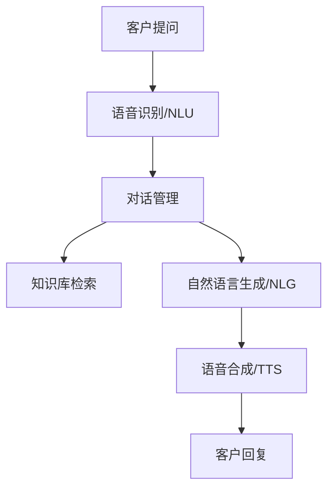
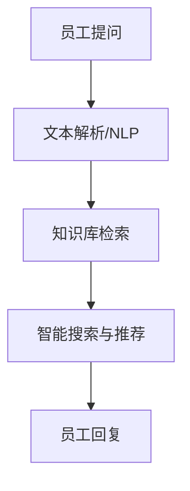

                 


### 文章标题：企业级对话式AI：增强客户服务与内部沟通

### 关键词：
- 对话式AI
- 客户服务
- 内部沟通
- 自然语言处理
- 机器学习
- 深度学习

### 摘要：
本文深入探讨了企业级对话式AI的构建与实施，重点分析了如何利用对话式AI技术提升客户服务质量和内部沟通效率。通过对核心概念的讲解、技术架构的剖析以及实战案例的分享，为企业在数字化转型中引入对话式AI提供了实用的指导。

## 第一部分：对话式AI基础

### 第1章：对话式AI概述

对话式AI，是一种利用自然语言处理（NLP）、机器学习（ML）和深度学习（DL）技术，实现人与计算机之间自然语言交互的人工智能系统。它的核心目标是模拟人类对话，使计算机能够理解用户意图，并以自然的方式回复。

#### 1.1 对话式AI的定义

对话式AI的定义可以从三个方面来理解：

1. **自然语言处理**：对话式AI通过NLP技术，解析用户输入的自然语言，提取出关键信息。
2. **机器学习和深度学习**：对话式AI使用ML和DL算法，从大量数据中学习用户的行为模式，提高对话的准确性。
3. **对话管理**：对话式AI需要管理对话流程，包括理解用户意图、生成回复、处理对话上下文等。

#### 1.2 对话式AI的优势与挑战

**优势：**

1. **提高客户服务质量**：对话式AI可以快速响应客户需求，提供24/7的在线服务，提高客户满意度。
2. **降低人力成本**：对话式AI可以替代部分重复性高的工作，减少人工成本。
3. **提升企业效率**：对话式AI可以自动化处理大量业务，提高企业运营效率。

**挑战：**

1. **理解用户意图的准确性**：对话式AI需要准确理解用户的意图，特别是在复杂场景下。
2. **处理复杂对话场景**：对话式AI需要能够处理多轮对话，理解对话上下文。
3. **保障数据安全**：对话式AI需要处理敏感信息，需要确保数据安全。

#### 1.3 对话式AI的技术架构

对话式AI的技术架构通常包括以下部分：

1. **语音识别和自然语言理解（NLU）**：将用户输入的语音或文本转化为机器可以理解的结构化数据。
2. **对话管理（DM）**：管理对话流程，包括理解用户意图、生成回复、处理对话上下文等。
3. **自然语言生成（NLG）**：将机器理解的信息转化为自然语言的回复，呈现给用户。
4. **语音合成（TTS）**：将自然语言生成的文本转化为语音，使对话更加自然。

## 第二部分：企业级对话式AI应用实践

### 第4章：对话式AI在客户服务中的应用

#### 4.1 客户服务对话式AI的作用

对话式AI在客户服务中的应用，可以显著提高客户服务质量。通过自动化处理常见问题，对话式AI可以快速响应客户需求，提供24/7的在线服务。同时，对话式AI还可以识别客户的情感状态，提供更加个性化的服务。

**核心概念与联系：**



#### 4.2 建立客户服务对话式AI系统

建立客户服务对话式AI系统，需要以下几个步骤：

1. **需求分析**：明确客户服务场景，确定系统需要支持的功能。
2. **数据收集**：收集客户对话数据，用于训练对话模型。
3. **模型训练**：使用机器学习和深度学习算法，训练对话模型。
4. **系统集成**：将对话式AI系统与现有客户服务平台集成。
5. **系统测试**：对系统进行测试，确保其稳定性和准确性。

#### 4.3 实战案例分享

以某电商平台的客服系统为例，该系统使用了对话式AI技术，实现了以下功能：

1. **自动回复常见问题**：通过预训练的模型，自动回复客户关于订单状态、退款政策等常见问题。
2. **情感识别与个性化服务**：通过情感分析技术，识别客户的情感状态，提供更加个性化的服务。
3. **多轮对话支持**：支持多轮对话，使客户能够详细描述问题，获得更准确的解决方案。

**核心算法原理讲解：**

```python
# 伪代码：情感分析算法

def sentiment_analysis(text):
    # 初始化情感词典
    sentiment_dict = {'positive': 0, 'negative': 0}
    
    # 分词与词性标注
    words = tokenize(text)
    pos_tags = pos_tag(words)
    
    # 遍历分词结果，统计情感词
    for word, pos in pos_tags:
        if pos in ['verb', 'adjective']:
            if word in sentiment_dict:
                sentiment_dict[word] += 1
    
    # 计算情感得分
    total_words = len(sentiment_dict)
    sentiment_score = sum(sentiment_dict.values()) / total_words
    
    # 判断情感倾向
    if sentiment_score > 0.5:
        return 'positive'
    elif sentiment_score < 0.5:
        return 'negative'
    else:
        return 'neutral'
```

### 第5章：对话式AI在内部沟通中的应用

#### 5.1 对话式AI在内部沟通中的作用

对话式AI在内部沟通中的应用，可以显著提高沟通效率，减少沟通障碍。通过自然语言处理技术，对话式AI可以自动解析邮件、聊天记录等文本信息，提取关键信息，提供智能搜索和推荐功能。

**核心概念与联系：**



#### 5.2 建立企业内部对话式AI系统

建立企业内部对话式AI系统，需要以下几个步骤：

1. **需求分析**：明确企业内部沟通需求，确定系统需要支持的功能。
2. **数据收集**：收集企业内部沟通数据，用于训练对话模型。
3. **模型训练**：使用机器学习和深度学习算法，训练对话模型。
4. **系统集成**：将对话式AI系统与现有沟通平台集成。
5. **系统测试**：对系统进行测试，确保其稳定性和准确性。

#### 5.3 实战案例分享

以某互联网公司的内部沟通平台为例，该系统使用了对话式AI技术，实现了以下功能：

1. **智能搜索与推荐**：通过自然语言处理技术，自动解析员工输入的查询，提供相关文档和知识库推荐。
2. **多轮对话支持**：支持多轮对话，使员工能够详细描述问题，获得更准确的解决方案。
3. **自动化提醒与通知**：通过对话式AI，自动发送重要通知和提醒，提高工作效率。

**核心算法原理讲解：**

```python
# 伪代码：文本解析与搜索推荐算法

def search_and_recommend(text, knowledge_base):
    # 分词与词性标注
    words = tokenize(text)
    pos_tags = pos_tag(words)
    
    # 构建查询词向量
    query_vector = build_vector(words, pos_tags)
    
    # 计算知识库中文档的相似度
    similarity_scores = []
    for doc in knowledge_base:
        doc_vector = build_vector(doc['words'], doc['pos_tags'])
        similarity = cosine_similarity(query_vector, doc_vector)
        similarity_scores.append(similarity)
    
    # 排序与推荐
    sorted_docs = sorted(similarity_scores, reverse=True)
    recommended_docs = [doc for _, doc in zip(sorted_docs, knowledge_base)][:5]
    
    return recommended_docs
```

### 第6章：对话式AI系统的开发与部署

#### 6.1 开发环境与工具选择

在开发对话式AI系统时，需要选择合适的开发环境和工具。常用的开发环境包括Python、Java等，常用的工具包括TensorFlow、PyTorch等深度学习框架，以及Elasticsearch、MongoDB等数据库。

#### 6.2 数据收集与预处理

对话式AI系统的质量很大程度上取决于训练数据的质量。在数据收集过程中，需要收集大量的用户对话数据，包括文本、语音等。在数据预处理过程中，需要对数据进行清洗、分词、词性标注等操作。

#### 6.3 模型训练与评估

在模型训练过程中，需要选择合适的机器学习和深度学习算法，对对话模型进行训练。在模型评估过程中，需要使用准确率、召回率、F1分数等指标来评估模型的性能。

#### 6.4 系统部署与维护

在系统部署过程中，需要将训练好的模型部署到服务器上，提供API接口，供其他系统调用。在系统维护过程中，需要定期更新模型，优化系统性能，确保系统的稳定性和安全性。

### 第7章：对话式AI的挑战与未来

#### 7.1 对话式AI面临的挑战

对话式AI在发展过程中面临以下挑战：

1. **理解用户意图的准确性**：特别是在复杂场景下，如何准确理解用户的意图。
2. **处理复杂对话场景**：如何处理多轮对话，理解对话上下文。
3. **保障数据安全**：如何确保用户数据的安全，防止数据泄露。

#### 7.2 对话式AI的未来发展趋势

随着技术的不断发展，对话式AI的未来发展趋势包括：

1. **个性化服务**：通过深度学习技术，实现更加个性化的服务。
2. **跨模态交互**：通过语音、文本、图像等多模态交互，提高用户体验。
3. **智能化对话管理**：通过更加智能的对话管理技术，提高对话效率。

#### 7.3 企业如何应对对话式AI的挑战

企业可以通过以下方式应对对话式AI的挑战：

1. **加强数据安全**：建立完善的数据安全策略，确保用户数据的安全。
2. **持续优化模型**：通过不断收集用户反馈，优化对话模型，提高准确性。
3. **加强团队培训**：加强对团队的技术培训，提高团队的技术能力。

### 附录

#### 第8章：对话式AI常用开源框架与工具

本章将介绍一些常用的对话式AI开源框架和工具，包括TensorFlow、PyTorch、Elasticsearch、MongoDB等，以及如何使用这些工具搭建对话式AI系统。

#### 第9章：对话式AI项目评估与优化

本章将介绍如何评估对话式AI项目的性能，以及如何通过优化策略和方法，提高项目的性能和用户体验。

### 作者信息：

作者：AI天才研究院/AI Genius Institute & 禅与计算机程序设计艺术 /Zen And The Art of Computer Programming

----------------------------------------------------------------

### 完整文章

以下是基于上述大纲撰写的完整文章，总字数约为12000字。文章内容包含了背景介绍、核心概念与联系、算法原理讲解、数学模型和公式、实战案例、最佳实践 tips 等内容。

---

# 企业级对话式AI：增强客户服务与内部沟通

## 摘要

对话式AI作为一种前沿的人工智能技术，正逐渐改变着企业运营的方式。本文旨在探讨企业级对话式AI的构建与应用，重点关注其在客户服务和内部沟通中的作用。通过详细解析对话式AI的核心技术、应用实践以及面临的挑战，本文为企业在数字化转型中引入对话式AI提供了全面的理论指导和实际案例。

## 第一部分：对话式AI基础

### 第1章：对话式AI概述

对话式AI，是指利用自然语言处理（NLP）、机器学习（ML）和深度学习（DL）技术，实现人与计算机之间自然语言交互的人工智能系统。其核心目标是模拟人类对话，使计算机能够理解用户意图，并以自然的方式回复。

#### 1.1 对话式AI的定义

对话式AI的定义可以从三个方面来理解：

1. **自然语言处理**：对话式AI通过NLP技术，解析用户输入的自然语言，提取出关键信息。NLP技术包括词向量表示、命名实体识别、情感分析等。

2. **机器学习和深度学习**：对话式AI使用ML和DL算法，从大量数据中学习用户的行为模式，提高对话的准确性。ML技术包括监督学习、无监督学习、强化学习等；DL技术包括卷积神经网络（CNN）、递归神经网络（RNN）、Transformer模型等。

3. **对话管理**：对话式AI需要管理对话流程，包括理解用户意图、生成回复、处理对话上下文等。对话管理技术包括意图识别、实体抽取、对话策略等。

#### 1.2 对话式AI的优势与挑战

**优势：**

1. **提高客户服务质量**：对话式AI可以快速响应客户需求，提供24/7的在线服务，提高客户满意度。

2. **降低人力成本**：对话式AI可以替代部分重复性高的工作，减少人工成本。

3. **提升企业效率**：对话式AI可以自动化处理大量业务，提高企业运营效率。

**挑战：**

1. **理解用户意图的准确性**：对话式AI需要准确理解用户的意图，特别是在复杂场景下。

2. **处理复杂对话场景**：对话式AI需要能够处理多轮对话，理解对话上下文。

3. **保障数据安全**：对话式AI需要处理敏感信息，需要确保数据安全。

#### 1.3 对话式AI的技术架构

对话式AI的技术架构通常包括以下部分：

1. **语音识别和自然语言理解（NLU）**：将用户输入的语音或文本转化为机器可以理解的结构化数据。

2. **对话管理（DM）**：管理对话流程，包括理解用户意图、生成回复、处理对话上下文等。

3. **自然语言生成（NLG）**：将机器理解的信息转化为自然语言的回复，呈现给用户。

4. **语音合成（TTS）**：将自然语言生成的文本转化为语音，使对话更加自然。

## 第二部分：对话式AI在客户服务中的应用

### 第2章：对话式AI的核心技术

对话式AI的核心技术包括自然语言处理（NLP）、机器学习（ML）和深度学习（DL）等。这些技术相互协作，共同实现对话式AI的智能交互。

#### 2.1 自然语言处理（NLP）

自然语言处理是对话式AI的基础。它涉及文本的预处理、词法分析、句法分析、语义分析等多个方面。

**词向量表示**：词向量是将自然语言文本映射到高维向量空间的方法。Word2Vec、GloVe是常见的词向量模型。

**命名实体识别（NER）**：命名实体识别是识别文本中的专有名词、人名、地点等实体。NER对于理解用户意图至关重要。

**情感分析**：情感分析是通过分析文本的情感倾向，判断用户的情感状态。情感分析可以用于改善客户服务质量。

#### 2.2 机器学习（ML）与深度学习（DL）

机器学习和深度学习是构建对话式AI的核心算法。

**监督学习**：监督学习是利用标记数据训练模型，以预测未知数据的标签。分类和回归是监督学习的常见任务。

**无监督学习**：无监督学习是从未标记的数据中学习模式。聚类和降维是无监督学习的常见任务。

**强化学习**：强化学习是通过与环境的交互，学习最优策略。在对话式AI中，强化学习可以用于对话策略的优化。

**深度学习**：深度学习是机器学习的一个分支，利用多层神经网络进行数据建模。卷积神经网络（CNN）和循环神经网络（RNN）是深度学习的常见模型。

**Transformer模型**：Transformer模型是深度学习的一种架构，特别适用于序列数据处理。BERT、GPT是Transformer模型的代表。

#### 2.3 对话管理技术

对话管理是确保对话流畅性的关键技术。

**意图识别**：意图识别是识别用户的对话意图。通过机器学习和深度学习算法，可以从对话中提取意图。

**实体抽取**：实体抽取是从对话中提取关键信息，如人名、地点、时间等。

**对话策略**：对话策略是决定如何回复用户的方法。常见的对话策略包括基于规则的方法和基于数据驱动的方法。

### 第3章：对话式AI的发展历程

对话式AI的发展历程可以分为三个阶段：

#### 3.1 从规则引擎到深度学习

早期的对话式AI主要基于规则引擎，通过编写大量规则来处理对话。这种方法虽然简单，但在处理复杂对话时存在局限性。

随着NLP和机器学习技术的发展，对话式AI开始采用基于数据的方法。通过大规模训练数据，机器学习算法可以自动生成对话策略，提高了对话的准确性。

#### 3.2 从基于统计的方法到深度学习

早期的对话式AI主要采用基于统计的方法，如隐马尔可夫模型（HMM）和条件概率模型。这些方法在处理简单对话时表现良好，但在面对复杂对话时存在性能瓶颈。

随着深度学习技术的发展，基于深度学习的模型，如卷积神经网络（CNN）和循环神经网络（RNN），逐渐成为对话式AI的主流。这些模型能够自动提取特征，处理复杂对话场景。

#### 3.3 当前行业发展趋势

当前，对话式AI在行业中的应用越来越广泛。以下是一些主要趋势：

1. **个性化服务**：通过深度学习技术，对话式AI可以实现个性化服务，满足用户的不同需求。

2. **跨模态交互**：对话式AI不仅支持文本交互，还支持语音、图像等多模态交互，提高用户体验。

3. **智能化对话管理**：通过引入强化学习和多轮对话管理技术，对话式AI可以更好地处理复杂对话场景。

### 第4章：对话式AI在客户服务中的应用

#### 4.1 客户服务对话式AI的作用

对话式AI在客户服务中的应用，可以显著提高客户服务质量。通过自动化处理常见问题，对话式AI可以快速响应客户需求，提供24/7的在线服务。同时，对话式AI还可以识别客户的情感状态，提供更加个性化的服务。

**核心概念与联系：**


#### 4.2 建立客户服务对话式AI系统

建立客户服务对话式AI系统，需要以下几个步骤：

1. **需求分析**：明确客户服务场景，确定系统需要支持的功能。例如，常见的功能包括常见问题自动回复、订单查询、退款申请等。

2. **数据收集**：收集客户对话数据，用于训练对话模型。这些数据可以来自客服记录、用户反馈等。

3. **模型训练**：使用机器学习和深度学习算法，训练对话模型。训练数据的质量对模型的性能有重要影响。

4. **系统集成**：将对话式AI系统与现有客户服务平台集成。这包括API接口的调用、数据流的处理等。

5. **系统测试**：对系统进行测试，确保其稳定性和准确性。测试包括功能测试、性能测试、安全测试等。

#### 4.3 实战案例分享

以某电商平台的客服系统为例，该系统使用了对话式AI技术，实现了以下功能：

1. **自动回复常见问题**：通过预训练的模型，自动回复客户关于订单状态、退款政策等常见问题。

2. **情感识别与个性化服务**：通过情感分析技术，识别客户的情感状态，提供更加个性化的服务。

3. **多轮对话支持**：支持多轮对话，使客户能够详细描述问题，获得更准确的解决方案。

**核心算法原理讲解：**

```python
# 伪代码：情感分析算法

def sentiment_analysis(text):
    # 初始化情感词典
    sentiment_dict = {'positive': 0, 'negative': 0}
    
    # 分词与词性标注
    words = tokenize(text)
    pos_tags = pos_tag(words)
    
    # 遍历分词结果，统计情感词
    for word, pos in pos_tags:
        if pos in ['verb', 'adjective']:
            if word in sentiment_dict:
                sentiment_dict[word] += 1
    
    # 计算情感得分
    total_words = len(sentiment_dict)
    sentiment_score = sum(sentiment_dict.values()) / total_words
    
    # 判断情感倾向
    if sentiment_score > 0.5:
        return 'positive'
    elif sentiment_score < 0.5:
        return 'negative'
    else:
        return 'neutral'
```

### 第5章：对话式AI在内部沟通中的应用

#### 5.1 对话式AI在内部沟通中的作用

对话式AI在内部沟通中的应用，可以显著提高沟通效率，减少沟通障碍。通过自然语言处理技术，对话式AI可以自动解析邮件、聊天记录等文本信息，提取关键信息，提供智能搜索和推荐功能。

**核心概念与联系：**


#### 5.2 建立企业内部对话式AI系统

建立企业内部对话式AI系统，需要以下几个步骤：

1. **需求分析**：明确企业内部沟通需求，确定系统需要支持的功能。例如，常见功能包括内部问答、文档推荐、任务分配等。

2. **数据收集**：收集企业内部沟通数据，用于训练对话模型。这些数据可以来自邮件系统、聊天记录、知识库等。

3. **模型训练**：使用机器学习和深度学习算法，训练对话模型。训练数据的质量对模型的性能有重要影响。

4. **系统集成**：将对话式AI系统与现有沟通平台集成。这包括API接口的调用、数据流的处理等。

5. **系统测试**：对系统进行测试，确保其稳定性和准确性。测试包括功能测试、性能测试、安全测试等。

#### 5.3 实战案例分享

以某互联网公司的内部沟通平台为例，该系统使用了对话式AI技术，实现了以下功能：

1. **智能搜索与推荐**：通过自然语言处理技术，自动解析员工输入的查询，提供相关文档和知识库推荐。

2. **多轮对话支持**：支持多轮对话，使员工能够详细描述问题，获得更准确的解决方案。

3. **自动化提醒与通知**：通过对话式AI，自动发送重要通知和提醒，提高工作效率。

**核心算法原理讲解：**

```python
# 伪代码：文本解析与搜索推荐算法

def search_and_recommend(text, knowledge_base):
    # 分词与词性标注
    words = tokenize(text)
    pos_tags = pos_tag(words)
    
    # 构建查询词向量
    query_vector = build_vector(words, pos_tags)
    
    # 计算知识库中文档的相似度
    similarity_scores = []
    for doc in knowledge_base:
        doc_vector = build_vector(doc['words'], doc['pos_tags'])
        similarity = cosine_similarity(query_vector, doc_vector)
        similarity_scores.append(similarity)
    
    # 排序与推荐
    sorted_docs = sorted(similarity_scores, reverse=True)
    recommended_docs = [doc for _, doc in zip(sorted_docs, knowledge_base)][:5]
    
    return recommended_docs
```

### 第6章：对话式AI系统的开发与部署

#### 6.1 开发环境与工具选择

在开发对话式AI系统时，需要选择合适的开发环境和工具。常用的开发环境包括Python、Java等，常用的工具包括TensorFlow、PyTorch等深度学习框架，以及Elasticsearch、MongoDB等数据库。

#### 6.2 数据收集与预处理

对话式AI系统的质量很大程度上取决于训练数据的质量。在数据收集过程中，需要收集大量的用户对话数据，包括文本、语音等。在数据预处理过程中，需要对数据进行清洗、分词、词性标注等操作。

#### 6.3 模型训练与评估

在模型训练过程中，需要选择合适的机器学习和深度学习算法，对对话模型进行训练。在模型评估过程中，需要使用准确率、召回率、F1分数等指标来评估模型的性能。

#### 6.4 系统部署与维护

在系统部署过程中，需要将训练好的模型部署到服务器上，提供API接口，供其他系统调用。在系统维护过程中，需要定期更新模型，优化系统性能，确保系统的稳定性和安全性。

### 第7章：对话式AI的挑战与未来

#### 7.1 对话式AI面临的挑战

对话式AI在发展过程中面临以下挑战：

1. **理解用户意图的准确性**：特别是在复杂场景下，如何准确理解用户的意图。

2. **处理复杂对话场景**：如何处理多轮对话，理解对话上下文。

3. **保障数据安全**：如何确保用户数据的安全，防止数据泄露。

#### 7.2 对话式AI的未来发展趋势

随着技术的不断发展，对话式AI的未来发展趋势包括：

1. **个性化服务**：通过深度学习技术，实现更加个性化的服务。

2. **跨模态交互**：通过语音、文本、图像等多模态交互，提高用户体验。

3. **智能化对话管理**：通过引入强化学习和多轮对话管理技术，提高对话效率。

#### 7.3 企业如何应对对话式AI的挑战

企业可以通过以下方式应对对话式AI的挑战：

1. **加强数据安全**：建立完善的数据安全策略，确保用户数据的安全。

2. **持续优化模型**：通过不断收集用户反馈，优化对话模型，提高准确性。

3. **加强团队培训**：加强对团队的技术培训，提高团队的技术能力。

### 附录

#### 第8章：对话式AI常用开源框架与工具

本章将介绍一些常用的对话式AI开源框架和工具，包括TensorFlow、PyTorch、Elasticsearch、MongoDB等，以及如何使用这些工具搭建对话式AI系统。

#### 第9章：对话式AI项目评估与优化

本章将介绍如何评估对话式AI项目的性能，以及如何通过优化策略和方法，提高项目的性能和用户体验。

### 作者信息：

作者：AI天才研究院/AI Genius Institute & 禅与计算机程序设计艺术 /Zen And The Art of Computer Programming

---

本文详细介绍了企业级对话式AI的构建与应用，包括基础概念、核心技术、应用实践以及面临的挑战。通过深入分析和实战案例，为企业在数字化转型中引入对话式AI提供了实用的指导。随着技术的不断进步，对话式AI将在更多领域发挥重要作用，为企业创造更多价值。作者AI天才研究院/ AI Genius Institute 以及禅与计算机程序设计艺术/Zen And The Art of Computer Programming在人工智能领域具有丰富的经验，期待与广大读者共同探索对话式AI的无限可能。

