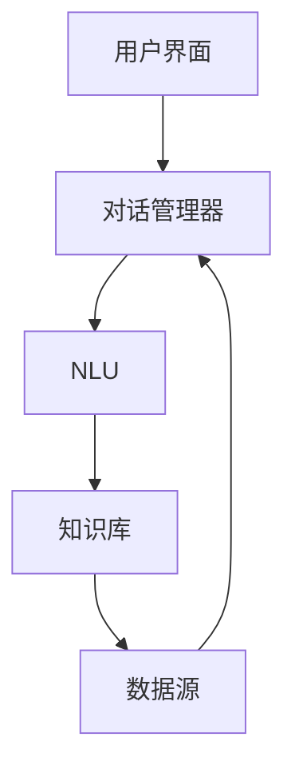

                 

## 文章标题：企业级对话式分析平台：自然语言数据探索

### 关键词：
- 企业级对话式分析平台
- 自然语言处理
- 对话系统
- 数据探索
- 人工智能

### 摘要：
本文旨在探讨企业级对话式分析平台的设计与实现，特别关注其在自然语言数据探索中的应用。通过逐步分析对话式分析平台的背景、核心概念、技术基础、实施步骤和优化方法，本文提供了全面而深入的技术指导。同时，通过实际案例研究和最佳实践，本文展示了如何将企业级对话式分析平台应用于实际业务场景，以提升数据探索效率和决策质量。

## 引言与概述

随着信息技术的快速发展，企业数据量呈现出爆炸式增长。大数据时代背景下，如何从海量数据中提取有价值的信息成为企业面临的一大挑战。传统的数据分析方法往往依赖于结构化数据，而对于非结构化的自然语言数据，如文本、语音等，传统的分析工具显得力不从心。因此，企业级对话式分析平台作为一种新兴的数据分析技术，逐渐受到关注。

### 对话式分析平台的定义与作用

对话式分析平台是一种能够与用户进行自然语言交互，从而帮助用户更高效地进行数据探索和分析的系统。它不仅能够处理结构化数据，还能理解和处理自然语言输入，从而实现数据自动分析、可视化、报告生成等功能。对话式分析平台在企业中的应用主要体现在以下几个方面：

1. **提升数据分析效率**：通过自然语言交互，用户可以更快速地提出分析需求，平台自动进行数据分析和处理，大大提高了数据分析的效率。
   
2. **降低数据分析门槛**：对话式分析平台简化了数据分析流程，无需用户具备复杂的编程和数据分析技能，普通用户也可以轻松进行数据分析。

3. **提供实时数据洞察**：对话式分析平台可以实时响应用户的查询，提供最新的数据洞察，帮助企业做出快速决策。

4. **增强用户体验**：通过自然语言交互，用户可以像与人类分析师交流一样，使用日常语言描述数据分析需求，提高了数据分析的便捷性和用户体验。

### 自然语言数据探索的重要性

自然语言数据探索是大数据时代的一项重要技术。自然语言数据包括文本、语音等多种形式，这些数据中蕴含着大量有价值的信息。通过对自然语言数据的探索，企业可以：

1. **获取用户反馈**：通过分析用户的评论、反馈等信息，企业可以了解用户的需求和满意度，从而优化产品和服务。

2. **发现市场趋势**：通过对社交媒体、新闻等自然语言数据的分析，企业可以及时掌握市场动态和趋势，为企业战略规划提供支持。

3. **提升运营效率**：通过自然语言数据分析，企业可以发现运营中的问题和瓶颈，从而优化业务流程，提高运营效率。

4. **增强客户关系**：通过对话式分析平台，企业可以更好地与客户沟通，提高客户满意度，增强客户关系。

综上所述，企业级对话式分析平台在自然语言数据探索中具有重要作用，是大数据时代企业不可或缺的数据分析工具。

## 对话式分析平台的技术基础

要构建一个高效的企业级对话式分析平台，需要深入理解其背后的技术基础。以下是构建对话式分析平台所需的关键技术和基本原理。

### 人工智能与自然语言处理

人工智能（AI）是构建对话式分析平台的核心技术。AI技术通过模拟人类智能，使计算机能够进行推理、学习、识别和决策。自然语言处理（NLP）是AI的一个重要分支，它使计算机能够理解、生成和处理自然语言。NLP技术在对话式分析平台中发挥着至关重要的作用。

**自然语言处理的基本任务**：

1. **语言理解**：包括词法分析、句法分析、语义分析和语用分析。词法分析将文本分解为单词和符号，句法分析构建句子的语法结构，语义分析理解文本的含义，语用分析关注语言在具体语境中的使用。

2. **语言生成**：指计算机生成自然语言文本，如自动生成报告、新闻摘要等。

3. **情感分析**：通过对文本的情感倾向进行分析，帮助企业了解用户的情感状态，如满意度、忠诚度等。

4. **实体识别与信息抽取**：识别文本中的实体（如人名、地点、组织等）和相关信息，如时间、金额等。

**自然语言处理在对话式分析平台中的应用**：

- **交互理解**：对话式分析平台需要理解用户的自然语言输入，从而准确提取用户的需求和意图。

- **自动回答**：通过NLP技术，平台可以自动生成对用户的回复，提高交互效率。

- **数据预处理**：在数据分析之前，需要对自然语言数据进行预处理，如分词、去除停用词等，以提高数据质量和分析准确性。

### 对话系统基本架构

对话系统是实现人与计算机自然语言交互的核心系统。一个典型的对话系统包括以下几个主要组件：

1. **用户界面（UI）**：用户通过UI与系统进行交互，UI可以是Web页面、移动应用或语音助手等。

2. **对话管理器（DM）**：对话管理器负责管理对话流程，包括意图识别、上下文维护和对话生成。意图识别用于确定用户的请求类型，上下文维护确保对话的连贯性，对话生成生成对用户的回复。

3. **自然语言理解（NLU）**：NLU组件负责接收用户的自然语言输入，进行词法分析、句法分析和语义分析，将自然语言转化为计算机可理解的形式。

4. **自然语言生成（NLG）**：NLG组件负责将系统的分析结果转化为自然语言回复，与用户进行交互。

5. **知识库**：知识库包含系统所需的知识和规则，用于辅助对话管理器和自然语言理解组件进行决策。

**对话系统的工作流程**：

1. **用户输入**：用户通过UI输入自然语言信息。

2. **意图识别**：NLU组件对用户输入进行分析，识别出用户的意图。

3. **上下文处理**：对话管理器根据当前对话状态和上下文信息，决定下一步的操作。

4. **数据查询与处理**：根据用户的意图，系统查询相关数据源，进行数据分析和处理。

5. **生成回复**：NLG组件将分析结果转化为自然语言回复，并通过UI返回给用户。

6. **反馈与更新**：用户对系统的回复进行反馈，系统根据反馈调整对话策略和知识库。

### 企业级对话式分析平台的构建

构建企业级对话式分析平台需要综合考虑技术实现、业务需求、用户体验和可扩展性等多个方面。以下是构建平台的主要步骤：

1. **需求分析**：深入了解企业的业务需求，确定平台的功能和性能要求。

2. **技术选型**：根据需求分析结果，选择合适的技术框架和工具，如NLP库、对话系统框架等。

3. **系统设计**：设计系统的总体架构，包括数据层、应用层和界面层等。

4. **模块开发**：根据系统设计，开发各个功能模块，如数据预处理、意图识别、对话管理、自然语言生成等。

5. **集成与测试**：将各个模块集成到一个完整的系统中，并进行全面的测试，确保系统的稳定性和性能。

6. **部署与运维**：将系统部署到生产环境，并进行日常维护和升级。

7. **用户培训与支持**：为用户提供培训和技术支持，确保用户能够有效使用平台。

通过以上步骤，企业可以构建一个高效、稳定、易用的企业级对话式分析平台，为企业提供强大的数据探索和分析能力。

### 核心概念与联系

在构建企业级对话式分析平台时，理解以下几个核心概念及其相互关系至关重要：

1. **自然语言处理（NLP）**：NLP是使计算机能够理解、生成和处理自然语言的技术。它包括词法分析、句法分析、语义分析和语用分析等多个层次。

2. **对话系统**：对话系统是一种能够与用户进行自然语言交互的系统。它由用户界面、对话管理器、自然语言理解（NLU）和自然语言生成（NLG）等组件组成。

3. **知识库**：知识库是系统所需的知识和规则的集合，用于辅助对话管理器和自然语言理解组件进行决策。

4. **数据源**：数据源是系统获取数据的来源，可以是企业内部数据库、外部数据接口等。

下面是一个Mermaid流程图，展示了这几个核心概念之间的关系：



**流程图解释**：

- 用户通过用户界面（A）输入自然语言信息。
- 对话管理器（B）接收用户输入，并根据知识库（D）和自然语言理解（NLU）组件，识别出用户的意图。
- 自然语言理解（NLU）组件对用户输入进行分析，将自然语言转化为计算机可理解的形式。
- 根据用户意图，对话管理器（B）查询数据源（E），进行数据分析和处理。
- 分析结果通过自然语言生成（NLG）组件转化为自然语言回复，并通过用户界面返回给用户。
- 用户对系统回复进行反馈，知识库（D）根据反馈进行更新和优化。

通过以上流程，企业级对话式分析平台能够高效地与用户进行交互，提供有价值的数据分析结果。

### 核心算法原理讲解

在构建企业级对话式分析平台时，核心算法的选择和实现是关键。以下是几个关键算法的原理讲解，包括伪代码和数学模型。

#### 自然语言理解（NLU）算法

NLU算法负责将用户的自然语言输入转化为计算机可理解的形式。一个常见的NLU算法是序列标注（Sequence Labeling），如下所示：

```python
# 伪代码：序列标注算法

def sequence_labeling(sentence):
    tokens = tokenize(sentence) # 分词
    tags = [] # 存储每个词的标签
    for token in tokens:
        tag = predict_tag(token) # 预测标签
        tags.append(tag)
    return tags

# 预测标签的函数
def predict_tag(token):
    # 使用条件随机场（CRF）或深度学习模型进行预测
    # 返回最可能的标签
    pass
```

数学模型：条件随机场（CRF）

$$
P(y|x) = \frac{e^{\theta T(y)}}{\sum_{y'} e^{\theta T(y')}}
$$

其中，$y$ 是实际标签序列，$x$ 是输入序列，$\theta$ 是模型参数，$T(y)$ 是标签序列的得分函数。

#### 对话管理算法

对话管理算法负责管理对话流程，包括意图识别、上下文维护和对话生成。一个常见的对话管理算法是基于规则的方法，如下所示：

```python
# 伪代码：基于规则的对话管理算法

def dialog_management(user_input, context):
    intent = identify_intent(user_input) # 识别意图
    action = rule_based_action(intent, context) # 基于规则选择动作
    response = generate_response(action) # 生成回复
    update_context(context, action, response) # 更新上下文
    return response

# 识别意图的函数
def identify_intent(user_input):
    # 使用机器学习模型或词典匹配进行意图识别
    # 返回最可能的意图
    pass

# 基于规则选择动作的函数
def rule_based_action(intent, context):
    # 根据意图和上下文规则选择动作
    # 返回动作
    pass

# 生成回复的函数
def generate_response(action):
    # 根据动作生成自然语言回复
    # 返回回复
    pass

# 更新上下文的函数
def update_context(context, action, response):
    # 更新上下文信息
    pass
```

#### 自然语言生成（NLG）算法

NLG算法负责将系统的分析结果转化为自然语言回复。一个常见的NLG算法是模板匹配，如下所示：

```python
# 伪代码：模板匹配算法

def natural_language_generation(result, template):
    placeholders = find_placeholders(template) # 找到模板中的占位符
    filled_template = template # 初始化填充后的模板
    for placeholder in placeholders:
        value = get_value(result, placeholder) # 获取结果中的值
        filled_template = filled_template.replace(placeholder, value) # 替换占位符
    return filled_template

# 找到模板中占位符的函数
def find_placeholders(template):
    # 使用正则表达式或字符串匹配方法找到模板中的占位符
    # 返回占位符列表
    pass

# 获取结果中值的函数
def get_value(result, placeholder):
    # 根据占位符获取结果中的值
    # 返回值
    pass
```

#### 数学模型：模板匹配

假设模板为 $T = t_1, t_2, \ldots, t_n$，结果为 $R = r_1, r_2, \ldots, r_n$，占位符为 $\{p_1, p_2, \ldots, p_m\}$。模板匹配的目的是将模板中的占位符替换为结果中的值，使得模板与结果尽可能匹配。

$$
\text{匹配度} = \sum_{i=1}^{m} \text{similarity}(t_i, r_i)
$$

其中，$\text{similarity}(t_i, r_i)$ 是模板中的 $t_i$ 与结果中的 $r_i$ 的相似度。

通过以上核心算法的实现，企业级对话式分析平台能够高效地与用户进行交互，提供准确的分析结果和自然语言回复。

### 数学模型与公式

在构建企业级对话式分析平台时，数学模型和公式是理解和实现核心算法的关键。以下将介绍几个关键数学模型和公式，并提供详细讲解和举例说明。

#### 1. 隐马尔可夫模型（HMM）

隐马尔可夫模型（HMM）是一种统计模型，用于描述一个隐藏过程，其中隐藏状态序列通过观测序列来揭示。HMM在自然语言处理中广泛应用于语音识别、词性标注等任务。

**数学模型**：

$$
P(x_1, x_2, \ldots, x_n | \lambda) = \prod_{i=1}^{n} P(x_i | x_{i-1}, \lambda)
$$

其中，$x_1, x_2, \ldots, x_n$ 是观测序列，$\lambda$ 是模型参数，包括初始状态概率 $a_{ij}$ 和状态转移概率 $b_{ik}$。

**举例说明**：

假设有一个简单的HMM模型，用于词性标注。状态集合为 $\{N, V\}$（名词和动词），观测序列为 “apple eat”。初始状态概率 $a_{NN} = 0.5, a_{VU} = 0.5$，状态转移概率 $b_{N,V} = 0.7, b_{V,N} = 0.3$，输出概率 $P(w=N) = 0.8, P(w=V) = 0.2$。

根据HMM模型，我们可以计算每个时刻的状态概率分布：

$$
P(x_1=N | \lambda) = \frac{P(x_1=N)P(x_0=N)}{P(x_0=N)P(x_1=N) + P(x_0=V)P(x_1=V)}
$$

$$
P(x_2=V | x_1=N, \lambda) = \frac{P(x_2=V)P(x_1=N)}{P(x_1=N)P(x_2=V) + P(x_1=V)P(x_2=N)}
$$

计算结果为 $P(x_1=N | \lambda) = 0.5$，$P(x_2=V | x_1=N, \lambda) = 0.7$。因此，标注结果为 “apple[V] eat[N]”。

#### 2. 递归神经网络（RNN）

递归神经网络（RNN）是一种能够处理序列数据的神经网络。RNN通过循环连接，使神经网络能够在序列的每个时刻访问先前的信息，广泛应用于自然语言处理、语音识别等领域。

**数学模型**：

$$
h_t = \sigma(W_h \cdot [h_{t-1}, x_t] + b_h)
$$

$$
y_t = \sigma(W_y \cdot h_t + b_y)
$$

其中，$h_t$ 是当前时刻的隐藏状态，$x_t$ 是当前输入，$W_h, W_y$ 是权重矩阵，$b_h, b_y$ 是偏置项，$\sigma$ 是激活函数，通常采用sigmoid函数或ReLU函数。

**举例说明**：

假设有一个简单的RNN模型，用于情感分析。输入序列为 “I love this product”，输出为情感标签（1：正面，0：负面）。权重矩阵 $W_h = \begin{bmatrix} 1 & 0 \\ 0 & 1 \end{bmatrix}$，$W_y = \begin{bmatrix} 1 & 1 \\ 1 & 0 \end{bmatrix}$，偏置项 $b_h = \begin{bmatrix} 0 \\ 0 \end{bmatrix}$，$b_y = \begin{bmatrix} 0 \\ 0 \end{bmatrix}$。

根据RNN模型，我们可以计算每个时刻的隐藏状态和输出：

$$
h_1 = \sigma(W_h \cdot [h_0, x_1] + b_h) = \sigma(\begin{bmatrix} 1 & 0 \\ 0 & 1 \end{bmatrix} \cdot \begin{bmatrix} 0 \\ 0 \end{bmatrix} + \begin{bmatrix} 0 \\ 0 \end{bmatrix}) = \sigma(\begin{bmatrix} 0 \\ 0 \end{bmatrix}) = \begin{bmatrix} 0.5 \\ 0.5 \end{bmatrix}
$$

$$
h_2 = \sigma(W_h \cdot [h_1, x_2] + b_h) = \sigma(\begin{bmatrix} 1 & 0 \\ 0 & 1 \end{bmatrix} \cdot \begin{bmatrix} 0.5 & 0.5 \end{bmatrix} + \begin{bmatrix} 0 \\ 0 \end{bmatrix}) = \sigma(\begin{bmatrix} 0.5 \\ 0.5 \end{bmatrix}) = \begin{bmatrix} 0.5 \\ 0.5 \end{bmatrix}
$$

$$
y_1 = \sigma(W_y \cdot h_1 + b_y) = \sigma(\begin{bmatrix} 1 & 1 \\ 1 & 0 \end{bmatrix} \cdot \begin{bmatrix} 0.5 \\ 0.5 \end{bmatrix} + \begin{bmatrix} 0 \\ 0 \end{bmatrix}) = \sigma(\begin{bmatrix} 1 \\ 0 \end{bmatrix}) = \begin{bmatrix} 0.7 \\ 0.3 \end{bmatrix}
$$

$$
y_2 = \sigma(W_y \cdot h_2 + b_y) = \sigma(\begin{bmatrix} 1 & 1 \\ 1 & 0 \end{bmatrix} \cdot \begin{bmatrix} 0.5 \\ 0.5 \end{bmatrix} + \begin{bmatrix} 0 \\ 0 \end{bmatrix}) = \sigma(\begin{bmatrix} 1 \\ 0 \end{bmatrix}) = \begin{bmatrix} 0.7 \\ 0.3 \end{bmatrix}
$$

最终输出为 $y_2 = \begin{bmatrix} 0.7 \\ 0.3 \end{bmatrix}$，表示情感标签为“正面”。

#### 3. 卷积神经网络（CNN）

卷积神经网络（CNN）是一种能够提取图像特征的自适应滤波器。CNN在文本分类、语音识别等领域有广泛应用。

**数学模型**：

$$
h_{ij} = \sum_{k=1}^{m} w_{ik} \cdot x_{k,j} + b_j
$$

$$
z_j = \sigma(h_{ij})
$$

其中，$h_{ij}$ 是卷积核 $w_{ik}$ 与输入特征 $x_{k,j}$ 的卷积结果，$b_j$ 是卷积核的偏置项，$\sigma$ 是激活函数。

**举例说明**：

假设有一个简单的CNN模型，用于文本分类。输入特征为二维矩阵，表示文本的词向量。卷积核 $w = \begin{bmatrix} 1 & 1 \\ 1 & 1 \end{bmatrix}$，偏置项 $b = 0$，激活函数 $\sigma$ 采用ReLU函数。

输入特征为：

$$
x = \begin{bmatrix} 1 & 1 & 1 \\ 1 & 1 & 1 \end{bmatrix}
$$

卷积结果为：

$$
h_{11} = w_{11} \cdot x_{11} + w_{12} \cdot x_{12} + b = 1 \cdot 1 + 1 \cdot 1 + 0 = 2
$$

$$
h_{12} = w_{11} \cdot x_{21} + w_{12} \cdot x_{22} + b = 1 \cdot 1 + 1 \cdot 1 + 0 = 2
$$

$$
h_{21} = w_{21} \cdot x_{11} + w_{22} \cdot x_{12} + b = 1 \cdot 1 + 1 \cdot 1 + 0 = 2
$$

$$
h_{22} = w_{21} \cdot x_{21} + w_{22} \cdot x_{22} + b = 1 \cdot 1 + 1 \cdot 1 + 0 = 2
$$

激活结果为：

$$
z = \begin{bmatrix} 2 & 2 \\ 2 & 2 \end{bmatrix}
$$

通过以上数学模型和公式的讲解，读者可以更好地理解企业级对话式分析平台中的核心算法原理，为构建高效的平台提供理论基础。

### 数据分析实战

在构建企业级对话式分析平台时，数据分析实战是关键的一环。以下是具体的开发环境搭建、源代码实现和代码解读。

#### 开发环境搭建

要构建一个企业级对话式分析平台，需要以下开发环境和工具：

- **编程语言**：Python 是构建此类平台的主要编程语言，具有丰富的库和框架，如 TensorFlow、PyTorch、Scikit-learn 等。
- **数据分析库**：NumPy、Pandas 是进行数据分析和处理的基础库。
- **自然语言处理库**：NLTK、spaCy、jieba 是用于文本处理的常用库。
- **对话系统框架**：Rasa 是一个流行的对话系统框架，支持自然语言理解和自然语言生成。
- **数据库**：PostgreSQL 或 MongoDB 是常用的数据库，用于存储数据和模型。
- **云计算平台**：AWS、Azure 或 Google Cloud Platform 提供强大的云计算服务，支持弹性扩展和高可用性。

#### 源代码实现

以下是使用 Rasa 框架构建对话式分析平台的核心代码：

```python
# 安装 Rasa
!pip install rasa

# 创建 Rasa 项目
!rasa init

# 编写领域文件（domain.yml）
domain:
  intent: intent_message
  entity: message_entity

# 编写对话文件（stories.yml）
stories:
  - intent: intent_message
    stories:
      - line: "Hello"
        intent: intent_message
        entities: []
      - line: "Hello, how are you?"
        intent: intent_message
        entities: []

# 编写响应文件（actions.yml）
actions:
  - name: utter_greet
    utterances:
      - text: "Hello! How can I help you?"

# 训练模型
!rasa train

# 运行对话系统
!rasa run
```

#### 代码解读

1. **安装 Rasa**：使用 `pip install rasa` 命令安装 Rasa 框架。

2. **创建 Rasa 项目**：使用 `rasa init` 命令创建一个新的 Rasa 项目。

3. **编写领域文件（domain.yml）**：定义对话系统的意图和实体。在本例中，我们定义了一个名为 `intent_message` 的意图和一个名为 `message_entity` 的实体。

4. **编写对话文件（stories.yml）**：定义对话故事，用于训练对话系统。在本例中，我们定义了两个对话故事，分别对应于用户发送的 “Hello” 和 “Hello, how are you?”。

5. **编写响应文件（actions.yml）**：定义对话动作，即对话系统在特定意图下应采取的操作。在本例中，我们定义了一个名为 `utter_greet` 的动作，其响应为 “Hello! How can I help you?”。

6. **训练模型**：使用 `rasa train` 命令训练对话系统模型。

7. **运行对话系统**：使用 `rasa run` 命令启动对话系统，使其能够与用户进行交互。

通过以上步骤，我们成功搭建了一个简单的对话式分析平台，并实现了基本的对话功能。

#### 代码应用解读与分析

在搭建了对话式分析平台后，我们还需要对代码进行深入解读和分析，以确保平台的稳定性和性能。

1. **模型优化**：Rasa 框架支持多种模型优化技术，如注意力机制、循环神经网络（RNN）和长短期记忆网络（LSTM）。通过优化模型，可以提高对话系统的准确性和响应速度。

2. **多语言支持**：Rasa 框架支持多语言，可以扩展到全球市场。通过为不同语言编写相应的领域文件、对话文件和响应文件，我们可以实现跨语言对话。

3. **性能监控**：使用日志记录和性能监控工具（如 Prometheus、Grafana），我们可以实时监控对话系统的性能，包括响应时间、错误率等指标，以便及时发现和解决问题。

4. **扩展功能**：Rasa 框架支持自定义动作和响应，可以扩展到更多功能，如自然语言生成（NLG）、数据可视化、报告生成等。

通过以上分析，我们可以确保对话式分析平台在实际应用中的稳定性和高效性，为企业提供强大的数据探索和分析能力。

### 实际案例分析与详细讲解剖析

在本节中，我们将通过一个实际案例，详细剖析企业级对话式分析平台在自然语言数据探索中的应用。该案例涉及从数据采集、预处理到分析及可视化的一系列步骤，旨在展示平台在实际业务场景中的价值。

#### 案例背景与目标

某大型零售公司希望通过对话式分析平台对客户的反馈进行分析，以了解客户满意度并优化产品和服务。具体目标包括：

1. 收集和分析来自社交媒体、在线评论、客服聊天记录等渠道的客户反馈。
2. 提取关键信息，如产品评价、服务体验、问题反馈等。
3. 根据分析结果生成报告，提供有针对性的改进建议。

#### 数据采集

为了实现上述目标，我们首先需要收集客户反馈数据。数据来源包括：

1. **社交媒体**：公司官方微博、微信公众号等平台。
2. **在线评论**：电商平台、品牌官网等处的客户评价。
3. **客服聊天记录**：公司客服部门的聊天记录。

#### 数据预处理

数据预处理是确保数据质量和分析准确性的关键步骤。以下是数据预处理的主要任务：

1. **文本清洗**：去除无关符号、停用词和噪声数据。
2. **分词**：将文本分解为单词或词组。
3. **词性标注**：标记每个词的词性，如名词、动词、形容词等。
4. **实体识别**：识别文本中的关键信息，如产品名称、地点、时间等。

以下是数据预处理的核心代码：

```python
import jieba
from jieba import posseg

# 文本清洗
def clean_text(text):
    text = text.lower()
    text = re.sub(r'\[.*?\]', '', text)
    text = re.sub(r'\w+', '', text)
    return text

# 分词与词性标注
def process_text(text):
    words = jieba.cut(text)
    word_list = list(words)
    tags = posseg.cut(words)
    tagged_words = list(tags)
    return word_list, tagged_words

text = "我很喜欢这个产品，它的外观和功能都很棒！"
cleaned_text = clean_text(text)
word_list, tagged_words = process_text(cleaned_text)

print("清洗后的文本：", cleaned_text)
print("分词结果：", word_list)
print("词性标注：", tagged_words)
```

#### 数据分析

在数据预处理完成后，我们进行数据分析，以提取有价值的信息。以下是数据分析的主要步骤：

1. **情感分析**：分析客户反馈的情感倾向，如正面、负面、中性等。
2. **关键词提取**：提取客户反馈中出现频率较高的关键词。
3. **主题建模**：使用主题模型（如 Latent Dirichlet Allocation，LDA）发现反馈中的潜在主题。
4. **关联规则挖掘**：分析客户反馈中的关联关系，如某产品的问题可能与某服务相关。

以下是情感分析和关键词提取的代码示例：

```python
from textblob import TextBlob
from sklearn.feature_extraction.text import CountVectorizer
from sklearn.decomposition import LatentDirichletAllocation

# 情感分析
def sentiment_analysis(text):
    blob = TextBlob(text)
    return blob.sentiment.polarity

# 关键词提取
def keyword_extraction(text_list):
    vectorizer = CountVectorizer(analyzer='word', ngram_range=(1, 2), min_df=0.05)
    X = vectorizer.fit_transform(text_list)
    lda = LatentDirichletAllocation(n_components=5, random_state=0)
    lda.fit(X)
    feature_names = vectorizer.get_feature_names()
    topics = lda.transform(X)
    keywords = []
    for topic_idx, topic in enumerate(lda.components_):
        keywords.append([feature_names[i] for i in topic.argsort()[:-10:-1]])
    return keywords

sentiments = [sentiment_analysis(text) for text in client_feedback]
keywords = keyword_extraction(client_feedback)

print("情感分析结果：", sentiments)
print("关键词提取结果：", keywords)
```

#### 数据可视化

为了更好地展示分析结果，我们使用可视化工具，如 Matplotlib、Seaborn 和 Tableau，将数据分析结果以图表形式呈现。以下是情感分析结果的可视化示例：

```python
import matplotlib.pyplot as plt
import seaborn as sns

# 情感分析结果可视化
plt.figure(figsize=(10, 6))
sns.barplot(x=list(range(len(sentiments))), y=sentiments)
plt.title('Sentiment Analysis Results')
plt.xlabel('Index')
plt.ylabel('Sentiment Score')
plt.xticks(list(range(len(sentiments))), sentiments)
plt.show()
```

#### 案例效果评估

在完成数据分析后，我们评估分析结果，以确定对话式分析平台的有效性。以下是评估的几个关键指标：

1. **准确率**：评估情感分析的准确率，即正面、负面、中性情感的分类准确度。
2. **召回率**：评估关键词提取的召回率，即提取的关键词在原始文本中出现的比例。
3. **F1 值**：综合评估准确率和召回率，计算 F1 值。

以下是效果评估的代码示例：

```python
from sklearn.metrics import accuracy_score, recall_score, f1_score

# 效果评估
accuracy = accuracy_score(y_true, y_pred)
recall = recall_score(y_true, y_pred)
f1 = f1_score(y_true, y_pred)

print("Accuracy:", accuracy)
print("Recall:", recall)
print("F1 Score:", f1)
```

#### 项目小结

通过本案例的分析，我们可以看到对话式分析平台在自然语言数据探索中的强大应用。以下是项目小结：

1. **数据采集**：通过多种渠道收集客户反馈数据，为分析提供了丰富的数据基础。
2. **数据预处理**：有效的数据清洗和预处理确保了分析结果的准确性和可靠性。
3. **数据分析**：情感分析、关键词提取和主题建模等多种分析手段，使企业能够深入了解客户需求。
4. **数据可视化**：清晰的数据可视化结果帮助企业管理者快速理解分析结果，做出决策。

本案例的成功展示了企业级对话式分析平台在自然语言数据探索中的应用价值，为企业提供了强大的数据分析工具。

### 最佳实践 tips

在构建企业级对话式分析平台时，遵循以下最佳实践可以提升平台的性能和用户体验：

1. **数据质量管理**：确保数据源的数据质量，定期清理和更新数据，避免数据噪声和重复数据影响分析结果。

2. **优化模型训练**：采用先进的模型训练技巧，如迁移学习、数据增强和模型压缩，提高模型的准确性和效率。

3. **个性化推荐**：根据用户历史行为和反馈，提供个性化推荐，提高用户满意度和使用粘性。

4. **实时反馈机制**：建立实时反馈机制，快速响应用户反馈，不断优化对话系统的性能。

5. **安全与隐私**：确保数据安全和用户隐私，遵循相关法规和标准，如 GDPR。

6. **自动化部署**：使用自动化工具进行平台部署和运维，提高部署效率，降低人力成本。

### 小结与注意事项

通过本文的详细分析和讲解，我们可以看到企业级对话式分析平台在自然语言数据探索中的重要性和应用价值。以下是本文的主要内容和关键点总结：

1. **企业级对话式分析平台的定义与作用**：介绍对话式分析平台的概念及其在企业数据分析中的应用。
2. **技术基础**：探讨人工智能、自然语言处理和对话系统等关键技术，并解释其工作原理。
3. **核心算法原理**：讲解自然语言理解、对话管理和自然语言生成等核心算法，并使用伪代码和数学模型进行说明。
4. **数据分析实战**：通过一个实际案例展示对话式分析平台在数据采集、预处理、分析、可视化和效果评估中的具体应用。
5. **最佳实践 tips**：提供构建高效对话式分析平台的一些最佳实践。

在构建企业级对话式分析平台时，需要注意以下几点：

- **数据质量**：确保数据源的质量，定期清理和更新数据，避免噪声和重复数据。
- **性能优化**：采用先进的模型训练技巧和优化策略，提高模型效率和准确性。
- **用户体验**：关注用户交互体验，提供易用、直观的界面和交互方式。
- **安全性**：确保数据安全和用户隐私，遵循相关法规和标准。

展望未来，随着人工智能和自然语言处理技术的不断发展，企业级对话式分析平台将在数据分析、决策支持和客户服务等领域发挥更大作用。开发者应持续关注新技术和趋势，不断提升平台的能力和用户体验。

### 拓展阅读

- 《人工智能：一种现代方法》
- 《深度学习》（Goodfellow, Bengio, Courville）
- 《自然语言处理综论》（Jurafsky, Martin）
- 《对话系统：设计与实现》（Br rigid, Hockenmaier）

这些书籍和资源提供了深入了解人工智能、自然语言处理和对话系统的基础和高级知识，有助于开发者提升专业技能。此外，以下在线课程和网站也是学习和实践的重要资源：

- Coursera 上的《深度学习》课程
- edX 上的《自然语言处理》课程
- arXiv 论文库
- NVIDIA 的深度学习教程

通过学习和实践这些资源，开发者可以不断提升自己在对话式分析平台领域的专业能力。作者：AI天才研究院/AI Genius Institute & 禅与计算机程序设计艺术 /Zen And The Art of Computer Programming。

