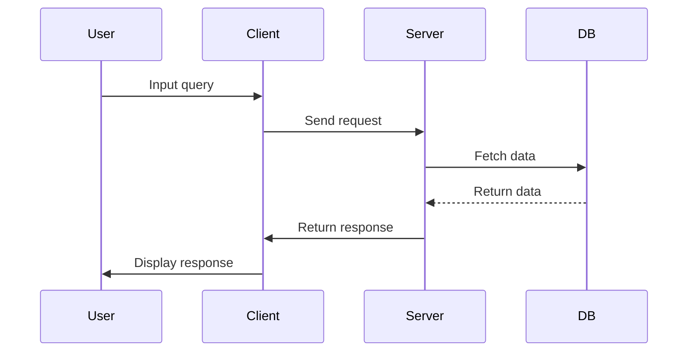
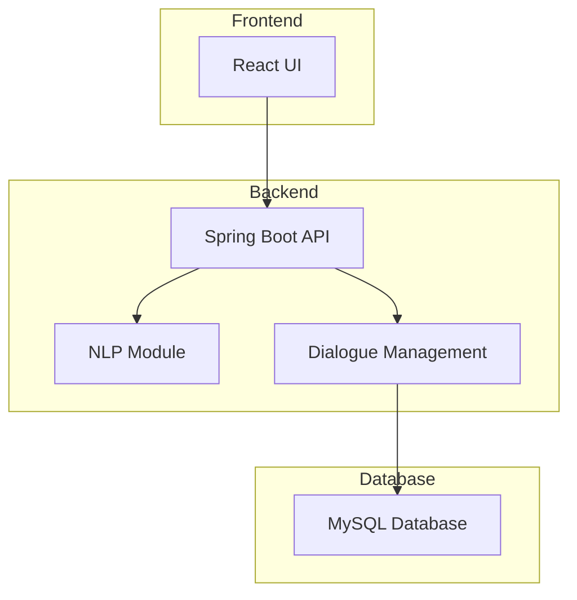

                 

### 第一部分：引言与基础

#### 第1章：企业级对话管理平台概述

在当今这个以用户为中心的数字化时代，企业级对话管理平台（ECDMP）成为了提升客户满意度、增强用户体验和优化业务流程的关键组件。随着人工智能（AI）技术的快速发展，对话管理平台正从单一的客户服务工具演变成企业级的多功能交互系统。本章节将深入探讨企业级对话管理平台的背景、目标、主要概念以及本书的结构。

**1.1 背景与目标**

**1.1.1 AI对话系统的发展历程**

人工智能对话系统的历史可以追溯到20世纪50年代，最早的AI对话系统如ELIZA，是由乔姆斯基和Weizenbaum开发的，它通过预设的模板进行简单的模式匹配和回复生成。进入21世纪后，随着自然语言处理（NLP）、机器学习（ML）和深度学习（DL）技术的迅猛发展，AI对话系统的能力得到了大幅提升。如今，企业级对话管理平台已经能够处理复杂的多轮对话，并在各个行业得到广泛应用。

**1.1.2 企业级对话管理的需求**

企业级对话管理平台的需求源于以下几个方面的考虑：

- **提升客户体验**：通过智能对话系统，企业可以提供24/7无缝的客户服务，快速响应客户需求和问题，提升客户满意度。

- **优化业务流程**：对话管理平台可以自动化处理大量的客户交互，减少人工干预，提高业务效率。

- **数据驱动决策**：通过收集和分析客户交互数据，企业可以更好地了解客户需求，优化产品和服务，实现数据驱动决策。

- **成本效益**：通过自动化处理客户服务，企业可以降低人力成本，提高运营效率。

**1.2 主要概念**

**1.2.1 对话管理系统的核心组成部分**

一个典型的企业级对话管理系统通常包含以下几个核心组成部分：

- **自然语言理解（NLU）**：负责接收并理解用户的自然语言输入，将其转换为机器可处理的结构化数据。

- **对话管理（DM）**：负责维护对话状态，决策对话流程，并生成合适的回复。

- **自然语言生成（NLG）**：负责根据对话管理生成的对话逻辑，生成自然流畅的回复文本。

- **多模态交互**：支持文本、语音、图像等多种交互方式，提供更加丰富的用户体验。

**1.2.2 AI交互能力的提升方法**

要提升企业级对话管理平台的AI交互能力，可以从以下几个方面入手：

- **语言模型优化**：通过引入更先进的语言模型，如Transformer、BERT等，提高自然语言理解和生成的准确性和自然度。

- **上下文感知能力**：通过增强对话系统的上下文感知能力，使其能够更好地理解用户的意图和对话背景，提供更精准的回复。

- **多模态交互融合**：通过融合文本、语音、图像等多种模态的信息，提供更加丰富的交互体验。

- **个性化服务**：通过用户数据分析和机器学习算法，实现对话的个性化，满足不同用户的个性化需求。

**1.3 本书结构**

**1.3.1 各章节的主要内容**

本书共分为六个部分，具体章节安排如下：

- **第一部分：引言与基础**：介绍企业级对话管理平台的背景、目标和主要概念。
- **第二部分：对话管理平台架构设计**：讨论对话管理平台的架构设计原则和示例。
- **第三部分：核心技术与算法**：深入探讨自然语言处理、对话状态追踪和多模态交互等技术。
- **第四部分：优化AI交互能力**：介绍交互质量评估、用户体验改进和性能优化等策略。
- **第五部分：项目实战**：通过一个实际的对话管理平台项目，展示系统设计、开发环境和源代码实现。
- **第六部分：总结与展望**：总结本书的内容，并对未来发展趋势和挑战进行展望。

通过以上章节的逐步讲解，本书旨在为读者提供对企业级对话管理平台的理论和实践的全面了解，帮助读者掌握设计、开发和优化对话管理平台的方法和技巧。

---

## 第二部分：对话管理平台架构设计

#### 第2章：对话管理平台设计原则

对话管理平台的设计原则对于系统的稳定性、可扩展性和用户满意度至关重要。本章节将详细讨论对话管理平台的架构设计原则，包括模块化设计思路和软件工程原则在对话管理平台中的应用。

**2.1 系统架构设计**

**2.1.1 模块化设计思路**

模块化设计是一种将复杂系统划分为若干个独立模块的方法，每个模块都具有明确的功能和接口，模块之间通过接口进行通信。模块化设计具有以下优点：

- **可扩展性**：通过增加或替换模块，可以方便地扩展系统的功能，适应不断变化的需求。
- **可维护性**：模块化设计使得代码更易于管理和维护，每个模块都可以独立开发和测试。
- **可测试性**：模块化的设计使得单元测试更加容易进行，有助于发现和修复问题。

模块划分方法通常根据功能、数据流、责任等多个维度进行。具体方法包括：

- **功能模块划分**：根据系统功能将模块划分为自然分段，如NLU模块、DM模块、NLG模块等。
- **数据流模块划分**：根据数据的流向和依赖关系将模块进行划分，如数据采集模块、数据处理模块等。
- **责任模块划分**：根据每个模块承担的具体责任将模块进行划分，如用户管理模块、权限管理模块等。

**2.1.2 软件工程原则在对话管理平台中的应用**

软件工程原则是设计高质量软件系统的指导原则，它们在对话管理平台的设计中同样适用。以下是一些关键原则：

- **可扩展性**：对话管理平台需要能够轻松地添加新功能或集成新的技术，例如引入新的NLP模型或支持新的交互渠道。
- **可维护性**：系统设计应确保代码清晰、结构合理，便于后续的维护和更新，避免因代码复杂性导致的维护困难。
- **可测试性**：对话管理平台的各个模块都应具备良好的可测试性，以便在开发过程中及时发现和修复问题。

**2.2 系统架构示例**

**2.2.1 常见的对话管理平台架构**

以下是几种常见的对话管理平台架构：

- **客户端-服务器架构**：客户端发送请求到服务器，服务器处理请求并返回响应。这种架构的优势在于集中式管理和维护，但可能导致单点故障。
  
- **分布式架构**：将系统功能分布在多个服务器上，提高系统的可用性和可扩展性。这种架构通过负载均衡和冗余设计来提升系统的整体性能。

以下是使用Mermaid流程图表示的客户端-服务器架构：



**2.2.2 Mermaid流程图：对话管理平台架构示意**

以下是使用Mermaid流程图示意一个典型的对话管理平台架构：

```mermaid
graph TB
    subgraph NLU
        NLU[自然语言理解]
    end

    subgraph DM
        DM[对话管理]
    end

    subgraph NLG
        NLG[自然语言生成]
    end

    subgraph UI
        UI[用户界面]
    end

    subgraph Backend
        Backend[后端服务]
        Backend --> DB[数据库]
    end

    subgraph APIs
        APIs[API接口]
    end

    NLU --> DM
    DM --> NLG
    NLG --> UI
    UI --> Backend
    Backend --> APIs
```

通过上述架构示例，我们可以看到对话管理平台的主要组件以及它们之间的交互关系。这种模块化的设计思路和架构不仅提高了系统的灵活性，也为后续的优化和扩展奠定了基础。

在接下来的章节中，我们将进一步探讨对话管理平台的核心技术、算法优化以及实战项目，为读者提供更全面的对话管理平台设计和实现指南。

---

## 第三部分：核心技术与算法

#### 第3章：自然语言处理基础

自然语言处理（NLP）作为对话管理平台的核心技术，负责理解和生成自然语言。本章将深入探讨NLP的基本概念、语言模型、对话状态追踪以及其在对话管理平台中的应用。

**3.1 语言模型**

**3.1.1 语言模型的基本原理**

语言模型（Language Model）是NLP的基础，它用于预测一段文本的下一个单词或字符。一个有效的语言模型需要能够捕捉到语言的统计规律和上下文信息。常见的语言模型包括：

- **n-gram模型**：基于词频统计，预测下一个词基于前面n个词的概率分布。n-gram模型简单高效，但在长文本中表现不佳。

- **神经网络语言模型**：如RNN、LSTM等，通过神经网络学习文本的长期依赖关系。这些模型在大型语料库上表现优秀，但计算复杂度高。

- **注意力机制模型**：如Transformer、BERT等，通过全局注意力机制学习文本中的长距离依赖关系，是目前最先进的语言模型。

**3.1.2 伪代码：语言模型算法实现**

以下是基于Transformer的语言模型算法的伪代码：

```python
# Transformer Language Model
class TransformerModel(nn.Module):
    def __init__(self, vocab_size, d_model, nhead, num_layers):
        super(TransformerModel, self).__init__()
        
        self.embedding = nn.Embedding(vocab_size, d_model)
        self.transformer = nn.Transformer(d_model, nhead, num_layers)
        self.fc = nn.Linear(d_model, vocab_size)
        
    def forward(self, src):
        src = self.embedding(src)
        output = self.transformer(src)
        output = self.fc(output)
        return output
```

**3.2 对话状态追踪**

**3.2.1 对话状态追踪的重要性**

对话状态追踪（Dialogue State Tracking，DST）是确保对话系统能够理解并维持对话状态的关键技术。对话状态包括用户的意图、上下文信息、用户的历史请求等。通过对话状态追踪，系统可以更好地理解用户的意图，提供更加个性化的回复。

**3.2.2 伪代码：对话状态追踪算法**

以下是基于马尔可夫模型（Markov Model）的对话状态追踪算法的伪代码：

```python
# Dialogue State Tracking using Markov Model
class DialogueStateTracker(nn.Module):
    def __init__(self, state_size):
        super(DialogueStateTracker, self).__init__()
        
        self.state_size = state_size
        self.transition_matrix = nn.Parameter(torch.randn(state_size, state_size))
        
    def forward(self, state_sequence):
        current_state = state_sequence[-1]
        next_state = torch.matmul(current_state.unsqueeze(0), self.transition_matrix)
        return next_state
```

**3.3 语言模型与对话状态追踪的关系**

语言模型和对话状态追踪在对话管理平台中紧密相连：

- **语言模型**用于生成自然流畅的回复文本，但需要对话状态来捕捉用户的意图和上下文信息，从而生成更加个性化的回复。

- **对话状态追踪**用于维持对话状态，提供对话的连续性和一致性。通过结合语言模型和对话状态追踪，对话管理系统可以提供更加智能和人性化的交互体验。

**3.4 实际应用**

在实际应用中，语言模型和对话状态追踪通常结合使用。例如，在客服机器人中：

- **语言模型**用于生成客服机器人的回复，确保回复的自然性和流畅性。

- **对话状态追踪**用于追踪用户的意图和上下文信息，确保客服机器人能够理解用户的请求并提供准确的回复。

通过结合语言模型和对话状态追踪，企业级对话管理平台可以提供更加智能和高效的交互体验，满足用户的多样化需求。

---

## 第四部分：优化AI交互能力

#### 第4章：交互质量评估与性能优化

优化AI交互能力是提升企业级对话管理平台用户体验的关键。本章将探讨交互质量评估、用户体验改进和对话系统性能优化等方面的策略。

**4.1 交互质量评估**

**4.1.1 交互质量指标**

交互质量评估是衡量对话管理系统性能的重要手段。以下是一些常见的交互质量指标：

- **响应时间**：从用户输入到系统返回回复的时间。低响应时间可以提供更流畅的交互体验。

- **准确性**：系统理解的准确度和生成回复的相关性。高准确性可以提升用户信任感。

- **满意度**：用户对交互体验的满意度。通过调查和反馈收集用户满意度数据。

- **错误率**：系统无法正确理解用户输入或生成不当回复的频率。低错误率表示系统更加可靠。

**4.1.2 伪代码：交互质量评估算法**

以下是交互质量评估算法的伪代码示例：

```python
# Interaction Quality Assessment
def evaluate_interaction_quality(interactions, metrics):
    quality_scores = {}
    for interaction in interactions:
        response_time = interaction['response_time']
        accuracy = interaction['accuracy']
        user_satisfaction = interaction['user_satisfaction']
        error_rate = interaction['error_rate']
        
        quality_scores[interaction['id']] = {
            'response_time': response_time,
            'accuracy': accuracy,
            'user_satisfaction': user_satisfaction,
            'error_rate': error_rate
        }
    
    return quality_scores
```

**4.2 用户体验改进**

**4.2.1 用户体验设计原则**

提升用户体验（UX）是优化对话管理平台的重要方向。以下是一些关键原则：

- **简单性**：界面和交互流程应简单直观，减少用户操作步骤。

- **一致性**：界面风格和交互逻辑应保持一致，避免用户产生混淆。

- **响应性**：系统应快速响应，提供即时的交互体验。

- **个性化**：根据用户历史和行为，提供个性化的交互体验。

**4.2.2 实例：用户体验改进案例分析**

以一个在线客服系统为例，以下是一些用户体验改进的措施：

- **简化登录流程**：通过单点登录（SSO）和第三方认证（如Google、Facebook）简化登录流程。

- **个性化推荐**：根据用户历史行为，推荐相关产品和服务，提高用户参与度。

- **实时聊天支持**：提供实时聊天支持，确保用户问题能够及时得到解决。

- **FAQ模块**：集成FAQ模块，自动识别常见问题并提供快速解答，减少客服工作量。

**4.3 对话系统性能优化**

**4.3.1 性能优化策略**

对话系统性能优化是确保系统稳定运行和高效服务的关键。以下是一些性能优化策略：

- **负载均衡**：通过负载均衡器分配请求，确保系统资源得到充分利用。

- **缓存机制**：使用缓存存储常见响应和中间结果，减少计算和存储资源的消耗。

- **分布式架构**：采用分布式架构，将系统功能分布在多个节点上，提高系统的可用性和扩展性。

**4.3.2 伪代码：性能优化算法**

以下是使用轮询算法实现负载均衡的伪代码示例：

```python
# Load Balancing using Round Robin Algorithm
def load_balancer(requests, servers):
    server_index = 0
    server_queue = []
    
    for request in requests:
        server_index = (server_index + 1) % len(servers)
        server_queue.append(servers[server_index].handle_request(request))
    
    return server_queue
```

**4.3.3 可扩展性与高可用性**

对话管理平台的可扩展性和高可用性是确保系统在业务增长和故障发生时仍能稳定运行的关键。

- **可扩展性**：通过横向扩展（增加节点）和纵向扩展（升级硬件）来满足业务增长需求。

- **高可用性**：通过冗余设计和故障转移机制来提高系统的可靠性。例如，使用主从数据库架构，确保数据不丢失。

通过上述交互质量评估、用户体验改进和性能优化策略，企业级对话管理平台可以实现更加智能、高效和可靠的AI交互，从而提升用户满意度和业务价值。

---

## 第五部分：项目实战

#### 第5章：对话管理平台实战

在本章中，我们将通过一个实际的对话管理平台项目，展示如何从需求分析、系统设计到开发环境和源代码实现，并提供详细的分析和项目小结。

**5.1 项目背景**

随着企业对客户互动和数据驱动的需求不断增加，某电子商务公司决定开发一个智能客服系统来提升客户体验和运营效率。该系统需要支持多渠道（如文本、语音、邮件）的交互，并能够理解用户的意图并提供准确的回复。

**5.1.1 项目简介**

项目目标：

- 构建一个可扩展、高可用性的对话管理平台。
- 提供个性化、实时响应的客户服务。
- 实现多渠道集成，满足不同用户交互需求。

**5.1.2 项目目标**

项目需求：

- **客户支持**：自动识别用户请求，提供即时回复。
- **多渠道集成**：支持文本、语音、邮件等多种交互方式。
- **数据驱动的个性化**：根据用户行为和历史数据，提供个性化的服务推荐。

**5.2 系统设计**

**5.2.1 系统架构设计**

系统架构：

- **前端**：使用React框架构建用户界面，提供多渠道交互体验。
- **后端**：基于Spring Boot构建，提供API接口和服务逻辑。
- **数据库**：使用MySQL存储用户数据和对话历史。
- **NLP模块**：集成BERT模型进行自然语言理解。
- **对话管理模块**：使用Redis进行对话状态追踪。

以下是系统架构的Mermaid流程图：



**5.2.2 系统功能模块**

系统功能模块：

- **用户认证**：使用JWT进行用户认证和权限管理。
- **NLU模块**：使用BERT模型进行自然语言理解，解析用户意图。
- **DM模块**：使用Redis进行对话状态追踪，维护对话流程。
- **NLG模块**：生成自然流畅的回复文本。
- **多渠道集成**：处理不同渠道的交互请求，提供一致的用户体验。

**5.3 开发环境搭建**

开发环境：

- **前端**：使用Node.js和npm进行项目管理和依赖安装。
- **后端**：使用Maven进行项目构建和管理。
- **数据库**：使用MySQL数据库管理用户数据和对话历史。
- **NLP库**：集成Hugging Face的BERT模型库进行自然语言处理。

**5.4 源代码实现**

**5.4.1 关键模块实现**

以下是NLU模块的核心代码片段：

```python
from transformers import BertTokenizer, BertModel
import torch

tokenizer = BertTokenizer.from_pretrained('bert-base-uncased')
model = BertModel.from_pretrained('bert-base-uncased')

def nlu(input_text):
    inputs = tokenizer(input_text, return_tensors='pt', truncation=True, max_length=512)
    outputs = model(**inputs)
    hidden_states = outputs.last_hidden_state
    
    # 使用最后一个隐藏状态作为输出
    output = hidden_states[:, -1, :]
    return output
```

以下是DM模块的核心代码片段：

```python
import redis

client = redis.StrictRedis(host='localhost', port=6379, db=0)

def track_dialogue_state(user_id, state):
    client.set(user_id, state)
    return "Dialogue state tracked for user: {}".format(user_id)
```

**5.4.2 代码解读与分析**

NLU模块使用BERT模型对用户输入进行编码，提取关键特征。DM模块则使用Redis存储和追踪对话状态，确保对话的连续性和一致性。

**5.5 实际案例分析和详细讲解剖析**

案例：用户通过邮件咨询产品退货政策。

步骤：

1. 用户发送邮件到客服系统。
2. 邮件通过API接口被NLU模块解析，识别出用户的意图（退货咨询）。
3. DM模块记录用户状态，准备回复。
4. NLG模块生成回复文本，包含退货政策详情。
5. 回复通过邮件系统发送给用户。

**5.6 项目小结**

通过本项目，我们实现了以下目标：

- 设计并实现了可扩展、高可用性的对话管理平台。
- 集成了先进的NLP模型和对话管理技术，提升了交互质量。
- 提供了多渠道集成，满足了不同用户的交互需求。

然而，项目也面临一些挑战：

- **性能优化**：在高峰期，系统响应速度可能受到影响，需要进一步优化。
- **安全性和隐私保护**：需要确保用户数据和交互记录的安全，遵循相关法规。

未来，我们将继续优化系统性能，增强安全性，并探索更多AI技术在对话管理中的应用，以提供更加智能和高效的交互体验。

---

## 第六部分：总结与展望

#### 第6章：未来发展趋势与挑战

随着人工智能技术的不断进步，企业级对话管理平台（ECDMP）正迎来新的发展机遇和挑战。在本章节中，我们将总结本书的主要内容和贡献，并对对话管理平台未来的发展趋势和面临的挑战进行展望。

**6.1 本书主要内容和贡献**

本书系统地介绍了企业级对话管理平台的背景、目标、架构设计、核心技术、优化策略以及实战项目。具体贡献如下：

- **全面覆盖**：从理论到实践，全面覆盖了对话管理平台的各个方面，为读者提供了一个完整的认知框架。
- **深入浅出**：通过详细的伪代码和实例，深入讲解了NLP、对话状态追踪、交互质量评估等核心技术，使读者能够理解并应用这些技术。
- **实用性强**：结合实际项目案例，提供了系统设计和开发的具体指导，为读者提供了实际操作的经验。

**6.2 未来发展趋势**

**6.2.1 人工智能的进步**

人工智能技术的不断进步将显著提升对话管理平台的交互能力。以下是几个关键趋势：

- **更先进的语言模型**：未来的语言模型将更加复杂和高效，如GPT-4、LLaMA等，将使对话系统的自然语言理解和生成能力更上一层楼。
- **多模态交互融合**：随着多模态技术的发展，文本、语音、图像、视频等多种模态的信息将更加紧密地融合，提供更加丰富的交互体验。
- **上下文感知能力**：对话系统将具备更强的上下文感知能力，能够更好地理解用户的意图和对话背景，提供更加精准和个性化的回复。

**6.2.2 新兴技术应用**

新兴技术的应用将推动对话管理平台向更加智能和高效的方向发展：

- **区块链技术**：通过区块链技术，可以确保用户数据的安全性和隐私保护，增强对话系统的可信度和透明度。
- **边缘计算**：边缘计算技术可以降低系统的延迟，提供更加实时和本地化的交互体验，特别适用于物联网（IoT）和移动设备。
- **虚拟现实（VR）与增强现实（AR）**：VR和AR技术将使对话管理平台的应用场景更加丰富，如虚拟客服、AR导航等。

**6.3 对话管理平台的挑战**

尽管对话管理平台有着广阔的发展前景，但同时也面临一些挑战：

- **技术挑战**：随着交互能力的提升，对话管理平台的技术实现变得更加复杂，如何在保证性能和稳定性的同时，不断提升交互能力是一个重要课题。
- **隐私保护**：用户隐私保护是当前和未来对话管理平台必须面对的问题，如何在提供个性化服务的同时，确保用户数据的隐私安全，需要更加完善的法律法规和技术手段。
- **商业模式**：随着对话管理平台的功能不断丰富，商业模式也面临重新设计。如何通过创新的服务模式和商业模式，实现商业上的可持续性，是一个值得深入探讨的问题。

**6.4 未来方向**

为了应对上述挑战，未来的研究和发展方向可以从以下几个方面进行：

- **技术融合**：结合多种先进技术，如多模态交互、区块链、边缘计算等，提升对话管理平台的综合能力。
- **用户体验**：深入研究用户体验，通过A/B测试和用户反馈，不断优化交互流程和用户界面，提供更加人性化的交互体验。
- **法律法规**：积极参与行业标准的制定，确保对话管理平台在合规性和隐私保护方面的领先地位。
- **商业模式创新**：探索多样化的商业模式，如SaaS服务、订阅制等，以适应不同企业的需求和市场变化。

通过不断的技术创新和商业模式探索，企业级对话管理平台将能够在未来发挥更大的作用，为企业提供更加智能、高效和可靠的交互解决方案。

---

### 文章标题：企业级对话管理平台：优化AI交互能力

关键词：企业级对话管理平台，AI交互能力，自然语言处理，对话状态追踪，交互质量评估，性能优化

摘要：本文深入探讨了企业级对话管理平台（ECDMP）的设计原则、核心技术、优化策略以及实际项目实施。通过分析语言模型、对话状态追踪、交互质量评估等关键技术，以及性能优化策略，本文为读者提供了全面而详细的对话管理平台建设指南。同时，通过一个实际项目案例，展示了从需求分析到系统实现的完整开发流程。本文旨在帮助读者理解和掌握如何优化AI交互能力，提升企业级对话管理平台的应用价值。作者：AI天才研究院/AI Genius Institute & 禅与计算机程序设计艺术 /Zen And The Art of Computer Programming。

