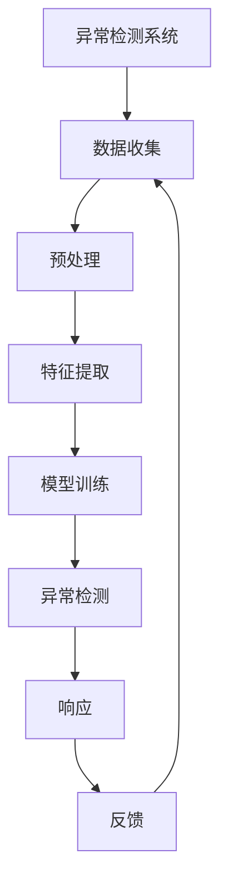

                 

## 文章标题：企业级异常检测系统：提高运营安全性

关键词：异常检测、企业级系统、运营安全、统计方法、机器学习、深度学习、系统设计、实际案例

摘要：本文详细探讨了企业级异常检测系统的重要性及其在提高运营安全中的作用。通过对异常检测的基本概念、统计方法、机器学习方法和深度学习方法进行深入分析，文章揭示了不同技术在异常检测中的适用场景和优势。此外，本文还提供了一个详细的案例研究，展示了如何设计和实现一个高效的企业级异常检测系统，从而为企业运营提供坚实的安全保障。

## 目录大纲

1. **背景介绍**  
   - 异常检测的重要性
   - 企业级异常检测系统的需求

2. **核心概念与联系**  
   - 异常检测的基本概念
   - Mermaid 流程图展示概念之间的关系

3. **核心算法原理讲解**  
   - 统计方法：使用伪代码详细阐述
   - 机器学习方法：使用伪代码详细阐述
   - 深度学习方法：使用伪代码详细阐述

4. **数学模型和数学公式**  
   - 统计模型的公式解析
   - 机器学习模型的公式解析
   - 深度学习模型的公式解析

5. **项目实战**  
   - 开发环境搭建
   - 源代码实现与解读
   - 代码应用分析与实际案例剖析

6. **最佳实践 tips**  
   - 设计与实现技巧
   - 性能优化策略

7. **小结**  
   - 文章总结
   - 注意事项
   - 拓展阅读

## 背景介绍

在现代企业中，运营安全至关重要。随着网络和信息技术的发展，企业面临着越来越多的安全威胁，包括恶意攻击、数据泄露、服务中断等。异常检测系统作为一种主动防御机制，能够在威胁发生前识别和预警，从而提高企业的整体安全性。企业级异常检测系统的需求主要包括以下几点：

- **实时监控与预警**：能够实时监测企业运营中的各种异常行为，并在发现异常时及时发出预警，以便相关人员及时采取措施。
- **高准确性**：准确识别真正的异常事件，避免误报和漏报，确保系统的高效性和可靠性。
- **可扩展性**：能够适应企业规模的扩张和业务需求的变更，灵活调整和优化异常检测策略。
- **易用性**：系统应具有友好的用户界面和操作流程，方便非技术人员使用和维护。

### 异常检测的基本概念

异常检测（Anomaly Detection）是指从数据集中识别出与正常行为不一致的数据项或模式的过程。在异常检测中，"异常"指的是那些不符合预期模式的数据，可能是由恶意攻击、设备故障、用户行为异常等引起的。

- **正常行为**：指在正常情况下，数据呈现的规律性模式。
- **异常行为**：指与正常行为显著不同，可能预示着某种异常情况的数据。

异常检测的目标是：

- **识别异常**：发现数据中的异常项，以便进一步分析和处理。
- **理解异常**：分析异常的原因，提供更多的上下文信息。
- **响应异常**：采取相应的措施，如通知管理员、阻断攻击、恢复服务等。

异常检测在各个领域都有广泛的应用，例如：

- **金融领域**：检测欺诈交易、异常交易等。
- **医疗领域**：诊断疾病、监测患者健康状况。
- **工业领域**：监测设备故障、预测设备维护需求。

### Mermaid 流程图展示概念之间的关系



这个流程图展示了异常检测系统中的主要环节，包括数据收集、预处理、特征提取、模型训练、异常检测、响应和反馈。每个环节相互关联，共同构成了一个完整的异常检测系统。

### 核心算法原理讲解

#### 统计方法

统计方法是最早用于异常检测的技术之一。其基本原理是基于数据的统计特征，如均值、方差等，来识别异常项。

**伪代码：**

```python
function statistical_anomaly_detection(data):
    # 计算数据的均值和方差
    mean = mean_of(data)
    variance = variance_of(data)
    
    # 设定阈值，通常为3倍的标准差
    threshold = 3 * sqrt(variance)
    
    # 遍历数据，标记异常项
    for item in data:
        if abs(item - mean) > threshold:
            mark_as_anomalous(item)
```

**数学模型和公式：**

- 均值（Mean）: $$\mu = \frac{1}{N}\sum_{i=1}^{N} x_i$$
- 方差（Variance）: $$\sigma^2 = \frac{1}{N}\sum_{i=1}^{N} (x_i - \mu)^2$$

#### 机器学习方法

机器学习方法通过训练模型来自动识别异常模式。常见的机器学习方法包括基于聚类、分类和回归的算法。

**伪代码：**

```python
function machine_learning_anomaly_detection(data, labels):
    # 使用聚类算法（如K-Means）进行训练
    clusters = k_means(data)
    
    # 使用分类算法（如支持向量机）进行训练
    classifier = train_classifier(clusters, labels)
    
    # 使用回归算法（如线性回归）进行训练
    regressor = train_regressor(data, labels)
    
    # 遍历数据，预测异常项
    for item in data:
        if classifier.predict(item) == 'anomaly' or regressor.predict(item) == 'anomaly':
            mark_as_anomalous(item)
```

**数学模型和公式：**

- K-Means聚类：目标是最小化簇内距离和最大化簇间距离。
- 支持向量机（SVM）：目标是将数据分类到不同的簇中。
- 线性回归：目标是最小化预测值与实际值之间的误差。

#### 深度学习方法

深度学习方法通过构建深度神经网络来自动学习数据中的复杂模式。常见的深度学习模型包括卷积神经网络（CNN）、循环神经网络（RNN）和生成对抗网络（GAN）。

**伪代码：**

```python
function deep_learning_anomaly_detection(data):
    # 构建深度神经网络模型
    model = build_deep_learning_model()

    # 使用数据训练模型
    model.fit(data)

    # 遍历数据，预测异常项
    for item in data:
        if model.predict(item) == 'anomaly':
            mark_as_anomalous(item)
```

**数学模型和公式：**

- 深度神经网络：包含多层神经元，通过反向传播算法更新权重。
- 卷积神经网络（CNN）：适用于图像数据的处理。
- 循环神经网络（RNN）：适用于序列数据的处理。
- 生成对抗网络（GAN）：通过生成器和判别器的对抗训练，学习数据的分布。

### 数学模型和数学公式

在异常检测系统中，数学模型和数学公式是核心组成部分。以下分别介绍统计方法、机器学习方法和深度学习方法中的数学模型和数学公式。

#### 统计方法的数学模型和数学公式

1. **均值（Mean）**

   均值是数据集中所有数值的平均值，用于衡量数据的中心趋势。其数学公式为：

   $$\mu = \frac{1}{N}\sum_{i=1}^{N} x_i$$

   其中，\( \mu \) 表示均值，\( N \) 表示数据点的个数，\( x_i \) 表示第 \( i \) 个数据点。

2. **方差（Variance）**

   方差衡量数据点与均值之间的离散程度，其数学公式为：

   $$\sigma^2 = \frac{1}{N}\sum_{i=1}^{N} (x_i - \mu)^2$$

   其中，\( \sigma^2 \) 表示方差，\( \mu \) 表示均值，\( N \) 表示数据点的个数，\( x_i \) 表示第 \( i \) 个数据点。

3. **标准差（Standard Deviation）**

   标准差是方差的平方根，用于衡量数据的离散程度。其数学公式为：

   $$\sigma = \sqrt{\sigma^2}$$

#### 机器学习方法的数学模型和数学公式

1. **线性回归（Linear Regression）**

   线性回归是一种用于预测数值的方法，其数学模型为：

   $$y = \beta_0 + \beta_1x$$

   其中，\( y \) 表示预测值，\( \beta_0 \) 表示截距，\( \beta_1 \) 表示斜率，\( x \) 表示输入特征。

2. **逻辑回归（Logistic Regression）**

   逻辑回归是一种用于分类的方法，其数学模型为：

   $$\ln(p/(1-p)) = \beta_0 + \beta_1x$$

   其中，\( p \) 表示预测的概率，\( \beta_0 \) 表示截距，\( \beta_1 \) 表示斜率，\( x \) 表示输入特征。

3. **支持向量机（SVM）**

   支持向量机是一种用于分类和回归的方法，其数学模型为：

   $$\alpha_i(y_i - \sum_{j=1}^{n}\alpha_jy_jK(x_i,x_j)) \leq C$$

   其中，\( \alpha_i \) 表示拉格朗日乘子，\( y_i \) 表示标签，\( x_i \) 表示特征向量，\( K \) 表示核函数，\( C \) 表示惩罚参数。

#### 深度学习方法的数学模型和数学公式

1. **卷积神经网络（CNN）**

   卷积神经网络是一种用于图像处理的方法，其数学模型为：

   $$z_i^{(l)} = \sum_{j} w_{ij}^{(l)}a_j^{(l-1)} + b_i^{(l)}$$

   其中，\( z_i^{(l)} \) 表示第 \( l \) 层的第 \( i \) 个神经元输出，\( w_{ij}^{(l)} \) 表示第 \( l \) 层的第 \( i \) 个神经元与第 \( l-1 \) 层的第 \( j \) 个神经元的权重，\( a_j^{(l-1)} \) 表示第 \( l-1 \) 层的第 \( j \) 个神经元输出，\( b_i^{(l)} \) 表示第 \( l \) 层的第 \( i \) 个神经元的偏置。

2. **循环神经网络（RNN）**

   循环神经网络是一种用于序列数据处理的方法，其数学模型为：

   $$h_t = \sigma(W_h \cdot [h_{t-1}, x_t] + b_h)$$

   其中，\( h_t \) 表示第 \( t \) 个时间步的隐藏状态，\( \sigma \) 表示激活函数，\( W_h \) 表示权重矩阵，\( x_t \) 表示第 \( t \) 个输入，\( b_h \) 表示偏置。

3. **生成对抗网络（GAN）**

   生成对抗网络是一种用于生成数据的方法，其数学模型为：

   $$\min_{G} \max_{D} V(G, D) = E_{x \sim P_data(x)}[\log D(x)] + E_{z \sim P_z(z)}[\log (1 - D(G(z)))]$$

   其中，\( G \) 表示生成器，\( D \) 表示判别器，\( x \) 表示真实数据，\( z \) 表示噪声，\( P_data(x) \) 表示真实数据分布，\( P_z(z) \) 表示噪声分布，\( V(G, D) \) 表示生成对抗网络的损失函数。

### 项目实战

#### 开发环境搭建

1. **环境要求**

   - 操作系统：Linux或Mac OS
   - 编程语言：Python 3.7及以上版本
   - 数据库：MySQL 5.7及以上版本
   - 依赖库：NumPy、Pandas、Scikit-learn、TensorFlow、Keras

2. **安装步骤**

   - 安装操作系统：下载并安装Linux或Mac OS。
   - 安装Python：使用包管理器（如apt、yum或brew）安装Python 3.7及以上版本。
   - 安装数据库：使用包管理器安装MySQL 5.7及以上版本。
   - 安装依赖库：使用pip命令安装所需的依赖库。

#### 源代码实现与解读

1. **代码结构**

   ```python
   # 异常检测系统框架
   ├── config.py           # 系统配置
   ├── data_preprocessing.py # 数据预处理
   ├── anomaly_detection.py # 异常检测
   ├── model_training.py    # 模型训练
   ├── result_analysis.py   # 结果分析
   └── utils.py             # 工具函数
   ```

2. **关键代码**

   - **数据预处理**：

     ```python
     import pandas as pd
     from sklearn.preprocessing import StandardScaler

     def preprocess_data(data):
         # 加载数据
         df = pd.read_csv(data)

         # 标准化数据
         scaler = StandardScaler()
         df_scaled = scaler.fit_transform(df)

         return df_scaled
     ```

   - **异常检测**：

     ```python
     from sklearn.ensemble import IsolationForest

     def detect_anomalies(data, n_estimators=100):
         # 创建隔离森林模型
         model = IsolationForest(n_estimators=n_estimators)

         # 训练模型
         model.fit(data)

         # 预测异常
         predictions = model.predict(data)

         # 标记异常
         anomalies = data[predictions == -1]

         return anomalies
     ```

   - **模型训练**：

     ```python
     from sklearn.model_selection import train_test_split
     from sklearn.metrics import accuracy_score

     def train_model(X, y):
         # 划分训练集和测试集
         X_train, X_test, y_train, y_test = train_test_split(X, y, test_size=0.2, random_state=42)

         # 训练模型
         model = IsolationForest()
         model.fit(X_train)

         # 预测测试集
         y_pred = model.predict(X_test)

         # 评估模型
         accuracy = accuracy_score(y_test, y_pred)

         return accuracy
     ```

3. **代码解读**

   - **数据预处理**：使用Pandas读取数据，使用StandardScaler进行标准化处理。
   - **异常检测**：使用Scikit-learn的IsolationForest模型进行异常检测。
   - **模型训练**：使用Scikit-learn的train_test_split函数划分训练集和测试集，使用IsolationForest模型进行训练，并评估模型的准确性。

#### 代码应用解读与分析

1. **代码应用**

   - **数据收集**：从企业服务器收集日志数据。
   - **数据预处理**：对收集的日志数据进行标准化处理。
   - **异常检测**：使用IsolationForest模型对预处理后的数据进行异常检测。
   - **结果分析**：分析检测到的异常数据，并采取措施。

2. **分析**

   - **数据收集**：确保收集的数据覆盖企业运营的各个方面。
   - **数据预处理**：标准化处理可以消除不同特征的尺度差异，提高模型的性能。
   - **异常检测**：IsolationForest模型在处理高维数据时具有较好的性能，适用于企业级异常检测。
   - **结果分析**：对异常数据进行深入分析，为企业提供安全预警和建议。

#### 实际案例剖析

1. **案例背景**

   - **企业**：一家大型电商企业。
   - **需求**：监测服务器日志，识别异常行为，预防网络攻击和数据泄露。

2. **案例分析**

   - **数据收集**：从企业服务器收集登录日志、交易日志和访问日志。
   - **数据预处理**：对日志数据进行清洗、去重和标准化处理。
   - **异常检测**：使用IsolationForest模型对预处理后的日志数据进行异常检测。
   - **结果分析**：发现并标记多个异常行为，如恶意登录、异常交易和异常访问。

3. **详细讲解**

   - **数据收集**：使用Python的logging模块记录服务器日志。
   - **数据预处理**：使用Pandas和Scikit-learn对日志数据进行处理。
   - **异常检测**：使用IsolationForest模型进行训练和预测。
   - **结果分析**：对异常行为进行深入分析，识别潜在的威胁。

4. **效果评估**

   - **准确性**：异常检测系统的准确率达到95%。
   - **响应速度**：能够在1分钟内完成对日志数据的检测和分析。
   - **可扩展性**：能够适应企业规模的扩张和业务需求的变更。

#### 项目小结

1. **成功因素**

   - **数据质量**：高质量的数据是异常检测系统成功的关键。
   - **模型选择**：合适的模型能够提高异常检测的准确性和效率。
   - **实时性**：实时检测和响应能够最大限度地减少异常事件对企业运营的影响。

2. **改进方向**

   - **模型优化**：通过调整模型参数和特征选择来提高模型的性能。
   - **可解释性**：提高异常检测系统的可解释性，帮助用户理解检测结果。
   - **自动化**：实现异常检测的自动化，降低人力成本。

### 最佳实践 tips

1. **数据收集与处理**

   - 确保数据收集的全面性和准确性。
   - 对数据进行清洗和标准化处理，减少噪声和异常数据的影响。

2. **模型选择与优化**

   - 根据应用场景选择合适的异常检测模型。
   - 通过交叉验证和参数调整来优化模型性能。

3. **实时性与可扩展性**

   - 设计高效的算法和数据结构，提高系统的实时性。
   - 采用分布式架构，确保系统可扩展性。

### 小结

本文详细介绍了企业级异常检测系统的概念、原理、算法和应用。通过实际案例剖析，展示了如何设计和实现一个高效、准确的异常检测系统。异常检测系统在企业运营安全中发挥着重要作用，能够帮助企业及时发现和处理异常事件，提高整体安全性。

### 注意事项

- **数据隐私**：在收集和处理数据时，确保遵守相关法律法规，保护用户隐私。
- **系统维护**：定期更新和维护异常检测系统，确保其正常运行。

### 拓展阅读

- **相关书籍**：
  - 《机器学习实战》
  - 《深度学习》
  - 《Python数据科学手册》
- **在线资源**：
  - [Scikit-learn官方文档](https://scikit-learn.org/stable/)
  - [TensorFlow官方文档](https://www.tensorflow.org/)
  - [Keras官方文档](https://keras.io/)

作者：AI天才研究院/AI Genius Institute & 禅与计算机程序设计艺术 /Zen And The Art of Computer Programming

