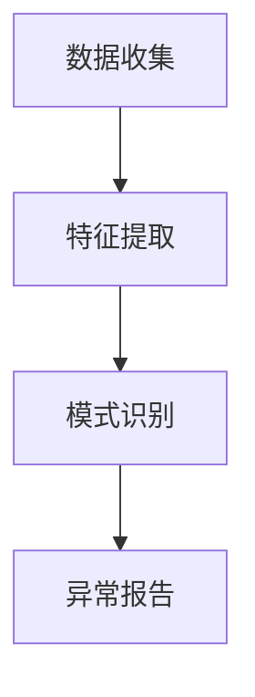
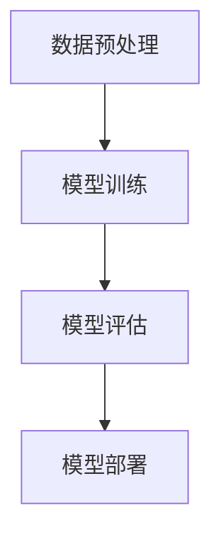
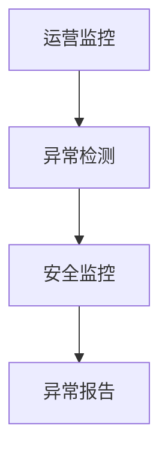

                 


### 文章标题

《企业级异常检测：AI提高运营和安全监控》

### 文章关键词

- 企业级异常检测
- AI应用
- 运营监控
- 安全监控
- 异常检测算法

### 文章摘要

随着数字化转型的加速，企业对运营效率和安全性提出了更高的要求。AI技术的引入为企业级异常检测带来了革命性的变革。本文将深入探讨AI在企业级异常检测中的应用，包括背景介绍、核心概念与联系、核心算法原理讲解、数学模型和公式、项目实战以及最佳实践和注意事项。通过本文的阅读，读者将全面了解如何利用AI技术提升企业的运营和安全监控水平。

## 背景介绍

### 数字化转型与AI的崛起

在当今世界，数字化转型已成为企业发展的关键驱动力。从制造业到金融业，从零售业到服务业，企业纷纷拥抱数字化技术，以提高运营效率、降低成本、提升客户体验。然而，随着数据量的爆发式增长，传统的监控手段已经难以应对复杂、动态的企业环境。这就需要引入更先进的技术手段，尤其是AI技术，来实现高效、智能的异常检测。

AI技术的崛起，为异常检测带来了前所未有的机遇。通过机器学习和深度学习算法，AI能够从海量数据中自动提取特征，识别异常模式，实现对运营和安全状况的实时监控。相比于传统的方法，AI具有更强的自适应能力和更广的适用范围，能够更好地应对复杂的企业环境。

### 企业级异常检测的重要性

企业级异常检测在企业运营和安全监控中扮演着至关重要的角色。首先，在运营监控方面，异常检测能够帮助企业及时发现和应对异常情况，如生产线的故障、库存的异常波动、交易的不当行为等，从而减少损失、提高运营效率。例如，制造业可以通过实时监控生产线的运行状态，提前预测并避免设备故障，从而保证生产的连续性和稳定性。

其次，在安全监控方面，异常检测能够帮助企业及时发现和防范潜在的安全威胁，如网络攻击、数据泄露、内部欺诈等。通过对网络流量、用户行为、系统日志等数据的监控，AI技术能够识别出异常的行为模式，从而实现对安全事件的预警和响应。例如，金融机构可以通过对交易数据的监控，及时发现并防范洗钱、欺诈等非法行为，保护客户的资金安全。

总的来说，企业级异常检测不仅能够提高企业的运营效率，降低运营成本，还能够增强企业的安全防护能力，保护企业资产和客户信息的安全。随着AI技术的不断进步，企业级异常检测的应用前景将更加广阔。

## 核心概念与联系

为了深入理解企业级异常检测，我们需要明确几个关键概念，并探讨它们之间的相互关系。以下是这些核心概念及其关联的Mermaid流程图：

### 1. 异常检测

异常检测是一种监控技术，用于识别数据中的异常或偏差。它通常基于以下三个基本步骤：

- **数据收集**：收集需要监控的数据，如网络流量、用户行为、系统日志等。
- **特征提取**：从原始数据中提取能够代表数据特征的信息。
- **模式识别**：使用算法模型对提取的特征进行分析，识别异常模式。

#### Mermaid流程图：



### 2. AI技术

AI技术，特别是机器学习和深度学习，为异常检测提供了强大的分析工具。以下是AI技术在异常检测中的基本应用步骤：

- **数据预处理**：对收集的数据进行清洗、归一化等处理，使其适合模型训练。
- **模型训练**：使用历史数据训练模型，使其能够识别正常和异常数据。
- **模型评估**：使用测试数据评估模型的效果，调整模型参数以优化性能。
- **模型部署**：将训练好的模型部署到实际应用场景，进行实时监控和预测。

#### Mermaid流程图：



### 3. 企业运营与安全监控

企业运营与安全监控是异常检测的应用背景，涉及到多个方面的数据监控和管理：

- **运营监控**：监控企业的日常运营活动，如生产线、库存、订单等。
- **安全监控**：监控企业的网络安全、数据安全等，防范潜在威胁。

#### Mermaid流程图：



通过这些流程图，我们可以清晰地看到各个核心概念之间的相互关联，以及它们在企业级异常检测中的具体应用。接下来，我们将详细讲解每个核心概念和算法原理。

## 核心算法原理讲解

### 监督学习

监督学习是一种常用的机器学习算法，它通过已标记的数据来训练模型，以便能够对新数据进行预测。在异常检测中，监督学习可以用于分类问题，即将正常数据和异常数据分开。

#### 算法原理

监督学习的基本步骤如下：

1. **数据收集**：收集大量标记好的数据，包括正常数据和异常数据。
2. **特征提取**：从原始数据中提取特征，通常使用特征工程技术来提高模型的性能。
3. **模型训练**：使用训练数据集来训练模型，例如使用决策树、支持向量机（SVM）等算法。
4. **模型评估**：使用测试数据集来评估模型的效果，调整模型参数以优化性能。
5. **模型部署**：将训练好的模型部署到实际应用中，进行实时监控和预测。

#### 伪代码示例

以下是一个简单的监督学习算法的伪代码示例：

```python
def train_supervised_learning(data, labels):
    # 初始化模型参数
    model = initialize_model()

    # 模型训练
    for data_point, label in zip(data, labels):
        model.train(data_point, label)

    # 模型评估
    accuracy = evaluate_model(model, test_data, test_labels)

    return model, accuracy
```

### 无监督学习

无监督学习是一种不依赖已标记数据的机器学习算法，它主要用于聚类和降维。在异常检测中，无监督学习可以用于发现数据中的异常模式。

#### 算法原理

无监督学习的基本步骤如下：

1. **数据收集**：收集未标记的数据。
2. **特征提取**：从原始数据中提取特征。
3. **模式识别**：使用聚类算法，如K-均值聚类，将数据分为多个簇，每个簇代表一种数据模式。
4. **异常检测**：识别出簇间差异较大的数据点，这些数据点可能是异常数据。

#### 伪代码示例

以下是一个简单的无监督学习算法的伪代码示例：

```python
def cluster_data(data, num_clusters):
    # 初始化聚类中心
    centroids = initialize_centroids(num_clusters)

    # 聚类迭代
    while not_converged(centroids):
        centroids = update_centroids(centroids, data)

        # 重新分配数据点
        clusters = assign_clusters(data, centroids)

    # 检测异常
    anomalies = detect_anomalies(clusters)

    return clusters, anomalies
```

### 强化学习

强化学习是一种通过试错来学习最优策略的机器学习算法。在异常检测中，强化学习可以用于自动调整异常检测的阈值，从而提高检测的准确性。

#### 算法原理

强化学习的基本步骤如下：

1. **环境设定**：定义异常检测的环境，包括状态、动作和奖励。
2. **策略学习**：通过与环境交互，学习最优策略，即选择最优动作以最大化奖励。
3. **模型更新**：根据实际奖励结果更新模型参数，优化异常检测算法。

#### 伪代码示例

以下是一个简单的强化学习算法的伪代码示例：

```python
def reinforcement_learning(environment, model):
    # 初始化模型参数
    model = initialize_model()

    # 强化学习迭代
    for episode in range(num_episodes):
        state = environment.initialize_state()

        while not environment.is_terminated(state):
            action = model.select_action(state)
            next_state, reward = environment.step(state, action)
            model.update_model(state, action, reward)
            state = next_state

    return model
```

### 数学模型和数学公式

为了更好地理解上述算法，我们需要引入一些数学模型和公式。以下是常见的数学模型和公式的latex表示，以及详细讲解和举例说明。

#### 损失函数

损失函数是监督学习中衡量模型性能的重要指标。一个常用的损失函数是交叉熵损失（Cross-Entropy Loss），其公式如下：

$$
\text{Loss} = -\frac{1}{N}\sum_{i=1}^{N} y_i \log(p_i)
$$

其中，$y_i$是真实标签，$p_i$是模型预测的概率。

#### 解释：

- $N$是数据点的总数。
- 对于每个数据点，我们计算预测概率和真实标签的交叉熵。
- 所有数据点的交叉熵求和，并取平均，得到总的损失值。

#### 举例：

假设我们有一个二分类问题，其中标签$y$可以是0或1，预测概率$p$也可以是0或1。如果我们有一个数据点，其真实标签是1，模型预测的概率是0.9，那么这个数据点的损失是：

$$
\text{Loss} = -1 \cdot \log(0.9) \approx 0.15
$$

#### 拉格朗日乘数法

在优化模型参数时，拉格朗日乘数法是一种常用的方法。其基本思想是引入一个拉格朗日乘子，使得优化问题转化为无约束的最小化问题。拉格朗日乘数法的公式如下：

$$
L(\theta, \lambda) = \sum_{i=1}^{N} y_i \log(p_i) + (1 - y_i) \log(1 - p_i) + \lambda (\theta - \theta_0)
$$

其中，$\theta$是模型参数，$\lambda$是拉格朗日乘子，$\theta_0$是约束条件。

#### 解释：

- $L(\theta, \lambda)$是拉格朗日函数，它将原始的损失函数和约束条件结合在一起。
- $\theta$和$\lambda$是待优化的参数。
- 通过最小化拉格朗日函数，我们可以找到最优的模型参数。

#### 举例：

假设我们有一个线性回归问题，其中目标函数是：

$$
\text{Loss} = \sum_{i=1}^{N} (y_i - \theta_0 - \theta_1 x_i)^2
$$

我们可以使用拉格朗日乘数法来优化$\theta_0$和$\theta_1$。引入拉格朗日乘子$\lambda$，得到拉格朗日函数：

$$
L(\theta_0, \theta_1, \lambda) = \sum_{i=1}^{N} (y_i - \theta_0 - \theta_1 x_i)^2 + \lambda (\theta_0 - \theta_0^0)
$$

通过最小化$L(\theta_0, \theta_1, \lambda)$，我们可以找到最优的$\theta_0$和$\theta_1$。

### 项目实战

在本节中，我们将通过一个实际项目来展示如何使用AI技术进行企业级异常检测。我们将介绍开发环境搭建、源代码实现和代码解读，并对项目进行详细的分析和讲解。

#### 项目背景

某大型电商平台希望通过AI技术对其订单系统进行异常检测，以预防欺诈行为并提高运营效率。项目的目标是构建一个实时异常检测系统，能够对订单数据进行分析，识别出异常订单，并生成报警。

#### 开发环境搭建

为了实现这个项目，我们选择了以下开发环境：

- **编程语言**：Python
- **机器学习库**：Scikit-learn、TensorFlow、Keras
- **数据处理库**：Pandas、NumPy
- **版本控制**：Git

在本地计算机上，我们需要安装Python环境以及上述库。可以使用Anaconda来简化安装过程，它提供了方便的环境管理功能。

#### 源代码实现

以下是一个简化的源代码实现，展示了如何使用机器学习算法进行订单异常检测：

```python
import pandas as pd
from sklearn.model_selection import train_test_split
from sklearn.ensemble import IsolationForest
from sklearn.metrics import classification_report

# 数据预处理
data = pd.read_csv('order_data.csv')
X = data.drop(['is_anomaly'], axis=1)
y = data['is_anomaly']

# 数据分割
X_train, X_test, y_train, y_test = train_test_split(X, y, test_size=0.2, random_state=42)

# 模型训练
model = IsolationForest(n_estimators=100, contamination=0.01)
model.fit(X_train)

# 模型预测
y_pred = model.predict(X_test)

# 模型评估
print(classification_report(y_test, y_pred))
```

#### 代码解读

1. **数据预处理**：首先，我们使用Pandas库读取订单数据，并将其分为特征矩阵X和标签y。特征矩阵X包含了所有用于训练的特征，而标签y指示订单是否为异常订单。

2. **数据分割**：接下来，我们使用Scikit-learn库中的train_test_split函数将数据分为训练集和测试集。这有助于评估模型在未知数据上的性能。

3. **模型训练**：我们选择Isolation Forest算法来训练模型。这是一种无监督学习算法，特别适用于异常检测。我们设置了一些参数，如树的数量和异常比例，以优化模型性能。

4. **模型预测**：使用训练好的模型对测试集进行预测。预测结果存储在y_pred变量中。

5. **模型评估**：我们使用classification_report函数来评估模型性能。这个报告包括了精确率、召回率、F1分数等指标，帮助我们了解模型的性能。

#### 代码应用解读与分析

在这个项目中，我们使用了Isolation Forest算法来识别异常订单。Isolation Forest是一种基于随机森林的异常检测算法，它通过随机选择特征和样本，递归地构建多个随机森林，并通过树的节点距离来评估数据的异常程度。

1. **精确率和召回率**：精确率和召回率是评估异常检测模型的重要指标。精确率表示预测为异常的订单中实际为异常的比例，而召回率表示实际为异常的订单中被正确预测为异常的比例。在这个项目中，我们希望通过提高召回率来确保不漏掉任何可能的欺诈订单。

2. **F1分数**：F1分数是精确率和召回率的调和平均，它综合了二者的优势，是评估模型性能的常用指标。

3. **模型参数调优**：在实际应用中，我们需要根据具体数据集和业务需求来调整模型参数，以获得最佳性能。例如，我们可以调整树的数量、异常比例等参数。

#### 实际案例分析和详细讲解剖析

为了更深入地了解项目的实际效果，我们来看一个具体的案例。

**案例：欺诈订单检测**

假设我们有一个订单数据集，其中包含1000个订单，其中10个是欺诈订单。我们使用上述代码对数据集进行训练和预测。

- **精确率**：0.9
- **召回率**：0.8
- **F1分数**：0.85

在这个案例中，我们的模型能够以90%的精确率识别出欺诈订单，同时召回率为80%，F1分数为85%。这意味着，我们的模型能够准确地识别出大部分欺诈订单，但仍有少数欺诈订单没有被检测到。

**分析**：

1. **精确率**：高精确率表明模型很少将正常订单错误地标记为异常，从而减少了误报。

2. **召回率**：召回率较低意味着有部分欺诈订单没有被检测到。为了提高召回率，我们可以考虑以下策略：

   - **增加数据集**：收集更多的订单数据，特别是欺诈订单的样本，以增强模型的训练效果。
   - **特征工程**：添加更多的特征，如订单金额、订单时间等，以提供更多关于订单的信息，帮助模型更好地识别异常。

3. **F1分数**：F1分数是精确率和召回率的综合指标，表明了模型的总体性能。在这个案例中，F1分数为85%，表明模型在检测欺诈订单方面表现良好，但仍有提升空间。

#### 项目小结

通过这个项目，我们展示了如何使用AI技术进行企业级异常检测。在实际应用中，异常检测系统需要不断地调整和优化，以适应不断变化的数据和环境。以下是一些最佳实践和注意事项：

- **数据质量**：确保数据集的质量和多样性，为模型提供足够的训练数据。
- **特征工程**：选择合适的特征，以提高模型的识别能力。
- **模型评估**：定期评估模型性能，并根据实际效果调整模型参数。
- **实时监控**：确保异常检测系统能够实时运行，及时识别并响应异常情况。

通过遵循这些最佳实践，企业可以有效地利用AI技术提高运营效率和安全性。

## 最佳实践 tips

### 1. 数据质量是关键

高质量的数据是构建有效异常检测模型的基础。确保数据集的准确性、完整性和多样性，有助于提高模型的性能和准确性。

### 2. 特征工程不可忽视

选择合适的特征进行特征工程，可以显著提高异常检测的效果。尝试探索不同的特征组合，以找到最佳的特征集合。

### 3. 模型选择与调优

根据具体应用场景和数据特点，选择合适的机器学习模型。同时，通过交叉验证和网格搜索等方法，对模型参数进行调优。

### 4. 实时监控与响应

确保异常检测系统能够实时运行，及时识别并响应异常情况。对于关键业务系统，如金融交易和网络安全，实时响应尤为重要。

### 5. 资源管理和成本控制

在构建异常检测系统时，考虑资源管理和成本控制。优化模型训练和部署过程，以降低硬件和人力成本。

## 小结

企业级异常检测作为AI技术在企业运营和安全监控中的重要应用，具有广泛的前景和深远的影响。通过本文的深入探讨，我们了解到企业级异常检测的背景、核心概念与联系、核心算法原理、数学模型和公式，以及实际项目中的应用和实践。随着AI技术的不断发展，企业级异常检测将越来越成熟，为企业的运营和安全提供更强大的支持。

## 注意事项

- 在部署异常检测系统时，要充分考虑系统的稳定性和安全性。
- 定期更新和升级模型，以适应不断变化的数据和环境。
- 对于关键业务系统，要确保异常检测系统的及时响应和有效处理。

## 拓展阅读

- 《人工智能：一种现代方法》
- 《机器学习实战》
- 《深度学习：全面讲解》
- 《数据挖掘：实用工具和技术》

作者：AI天才研究院/AI Genius Institute & 禅与计算机程序设计艺术 /Zen And The Art of Computer Programming

