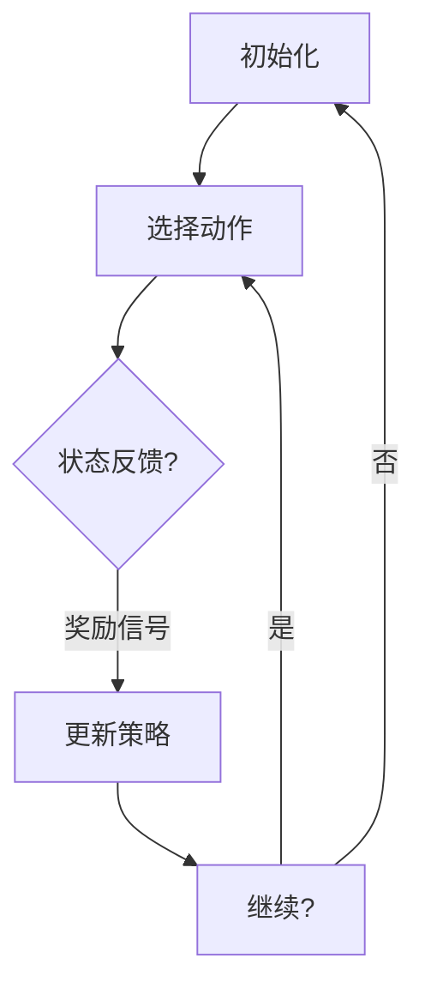

                 

### 文章标题：企业级强化学习应用：优化复杂业务决策

### 关键词：强化学习，企业应用，业务优化，决策模型

#### 摘要：
本文旨在探讨强化学习在企业级复杂业务决策中的应用，通过介绍强化学习的基本概念和理论框架，阐述其在优化供应链管理、广告投放、风险管理等领域的实际应用。文章将结合实际案例，详细讲解强化学习算法的开发环境搭建、源代码实现和代码解读，以期为读者提供一套完整的强化学习应用指南。

---

### 基础理论部分

#### 第1章：强化学习概述

##### 1.1 什么是强化学习

强化学习是一种通过试错来学习最优行为策略的机器学习方法。与监督学习和无监督学习不同，强化学习通过奖励信号不断调整其行为策略，以达到最大化长期回报的目标。

##### 1.2 强化学习的基本概念

- **代理（Agent）**：执行动作并学习策略的实体。
- **环境（Environment）**：代理交互的动态环境。
- **状态（State）**：描述代理所处环境的特征。
- **动作（Action）**：代理可执行的行为。
- **奖励（Reward）**：代理在每个时间步获得的即时奖励。
- **策略（Policy）**：从状态到动作的映射。

##### 1.3 强化学习的主要算法

- **Q-Learning算法**：通过迭代更新Q值来学习最优策略。
  $$ Q(s, a) = \sum_{j} q(s, a) * p(s', r | s, a) $$
- **SARSA算法**：同时更新当前状态和下一状态的动作值。
  $$ Q(s, a) = \sum_{j} q(s', a') * p(s', r | s, a) $$
- **深度强化学习算法**：结合深度神经网络，解决高维状态和动作空间的问题。

#### Mermaid流程图



---

#### 第2章：强化学习的数学基础

##### 2.1 马尔可夫决策过程

马尔可夫决策过程（MDP）描述了代理在不确定环境中做出决策的过程，其状态转移概率和奖励函数是固定的。

$$ 
P(s'|s, a) = \text{状态转移概率} \\
R(s, a) = \text{奖励函数} \\
\gamma = \text{折扣因子} \\
V^*(s) = \max_{a} \sum_{s'} p(s'|s, a) [r(s, a) + \gamma V^*(s')]
$$

##### 2.2 贝尔曼方程

贝尔曼方程是强化学习中的核心方程，用于递归计算最优值函数。

$$ 
V^*(s) = \max_{a} [R(s, a) + \gamma V^*(s')] \\
Q^*(s, a) = R(s, a) + \gamma \sum_{s'} p(s'|s, a) Q^*(s', a)
$$

##### 数学模型和公式

$$
\begin{aligned}
& V^*(s) = \max_{a} \left[ R(s, a) + \gamma \sum_{s'} p(s'|s, a) V^*(s') \right] \\
& Q^*(s, a) = R(s, a) + \gamma \sum_{s'} p(s'|s, a) \max_{a'} Q^*(s', a')
\end{aligned}
$$

#### 核心算法原理讲解

伪代码：

```python
# 初始化参数
V = np.zeros(state_space_size)
Q = np.zeros(state_action_space_size)
learning_rate = 0.1
discount_factor = 0.9

# 主循环
for episode in range(total_episodes):
    state = env.reset()
    done = False
    
    while not done:
        action = np.argmax(Q[state])
        next_state, reward, done, _ = env.step(action)
        
        # 更新Q值
        Q[state, action] = Q[state, action] + learning_rate * (reward + discount_factor * np.max(Q[next_state]) - Q[state, action])
        
        state = next_state
```

---

#### 第3章：强化学习算法

##### 3.1 Q-Learning算法

Q-Learning算法通过不断更新状态-动作值函数来学习最优策略。其核心思想是利用经验进行学习，通过比较当前策略和最优策略的差异来调整行为。

##### 3.2 SARSA算法

SARSA算法是一种同时考虑当前状态和下一状态的动作值函数的算法。其更新策略如下：

$$ 
Q(s, a) = Q(s, a) + \alpha [R(s, a) + \gamma Q(s', a') - Q(s, a)] 
$$

##### 3.3 深度强化学习算法

深度强化学习算法结合深度神经网络，解决高维状态和动作空间的问题。其核心思想是通过神经网络将高维状态编码为低维特征表示，然后利用这些特征进行决策。

```python
# 深度Q网络实现
class DQN:
    def __init__(self, state_space_size, action_space_size, learning_rate, discount_factor):
        self.state_space_size = state_space_size
        self.action_space_size = action_space_size
        self.learning_rate = learning_rate
        self.discount_factor = discount_factor
        
        self.model = keras.Sequential()
        self.model.add(keras.layers.Dense(64, activation='relu', input_shape=(state_space_size,)))
        self.model.add(keras.layers.Dense(64, activation='relu'))
        self.model.add(keras.layers.Dense(action_space_size, activation='linear'))
        
        self.model.compile(loss='mse', optimizer=keras.optimizers.Adam(learning_rate))
```

---

### 实践应用部分

#### 第4章：强化学习在业务优化中的应用

##### 4.1 业务决策优化中的挑战

业务决策优化涉及到大量不确定性因素，如市场需求、竞争环境、政策变化等。传统方法往往难以处理这种复杂性，而强化学习提供了一种有效的解决方案。

##### 4.2 强化学习在供应链管理中的应用

供应链管理中的决策优化问题，如库存管理、运输路线规划、生产排程等，可以通过强化学习算法来实现优化。例如，使用Q-Learning算法优化库存管理策略，以减少库存成本和提高服务水平。

##### 4.3 强化学习在广告投放优化中的应用

广告投放优化是另一个典型的复杂业务决策问题。强化学习算法可以帮助广告主根据用户行为和历史数据，动态调整广告投放策略，以最大化广告效果。

---

#### 第5章：强化学习在风险管理中的应用

##### 5.1 风险管理中的强化学习算法

风险管理中的决策优化问题，如金融风险评估、信用评分、保险定价等，可以通过强化学习算法来实现优化。例如，使用SARSA算法优化信用评分模型，以提高信用评分的准确性。

##### 5.2 案例研究：金融风控中的强化学习应用

金融风控中的强化学习应用，如反欺诈系统、市场预测等，可以通过构建强化学习模型，实现风险识别和预测。

##### 5.3 案例研究：医疗风险管理中的强化学习应用

医疗风险管理中的决策优化问题，如疾病预测、资源分配等，可以通过强化学习算法来实现优化。

---

#### 第6章：强化学习在个性化推荐中的应用

##### 6.1 个性化推荐系统的基础知识

个性化推荐系统通过分析用户历史行为和兴趣，为用户提供个性化推荐。强化学习算法可以帮助推荐系统动态调整推荐策略，以提高推荐效果。

##### 6.2 强化学习在个性化推荐中的应用

强化学习在个性化推荐中的应用，如用户行为预测、推荐策略优化等，可以通过构建强化学习模型，实现推荐系统的优化。

##### 6.3 案例研究：电商平台个性化推荐系统

电商平台个性化推荐系统的应用案例，如基于用户行为的商品推荐、基于用户的协同过滤推荐等，可以通过强化学习算法来实现优化。

---

#### 第7章：强化学习应用实践

##### 7.1 开发环境搭建

搭建强化学习开发环境，包括Python环境、TensorFlow或PyTorch等深度学习框架。

##### 7.2 强化学习项目实战

通过实际项目，如强化学习在游戏控制中的应用，来展示强化学习算法的开发过程。

##### 7.3 代码解读与分析

对实际项目中的代码进行解读，分析强化学习算法在不同场景下的应用。

---

#### 第8章：前沿趋势与展望

##### 8.1 强化学习的前沿研究

讨论强化学习在人工智能领域的前沿研究，如多智能体强化学习、联邦强化学习等。

##### 8.2 强化学习在新兴领域的应用

探讨强化学习在新兴领域的应用，如自动驾驶、机器人控制等。

##### 8.3 未来强化学习的挑战与机遇

分析未来强化学习面临的挑战和机遇，如算法优化、计算效率提升等。

---

### 附录

##### 附录A：强化学习资源汇总

汇总强化学习相关资源，包括书籍、论文、在线课程等。

##### 附录B：代码实现示例

提供实际项目中的代码实现示例，供读者参考。

##### 附录C：参考文献

列出本文引用的相关参考文献。

---

### 文章小结

本文系统地介绍了强化学习在企业级复杂业务决策中的应用，包括基础理论、算法实现和实际案例。通过本文的阅读，读者可以掌握强化学习的基本原理和实际应用方法，为后续的深入研究提供基础。

### 注意事项

- 在实际应用中，强化学习算法需要根据具体问题进行调整和优化。
- 强化学习模型的训练过程需要大量的数据和计算资源。
- 在使用强化学习解决实际问题时，需要充分考虑安全性和鲁棒性。

### 拓展阅读

- [Reinforcement Learning: An Introduction](https://web.stanford.edu/class/psych210/Readings/SuttonBartoIPRLBook2ndEd.pdf)
- [Deep Reinforcement Learning](https://arxiv.org/abs/1707.06284)
- [Practical Guide to Reinforcement Learning](https://www.amazon.com/Practical-Guide-Reinforcement-Learning-Applications/dp/1788994705)

---

### 作者信息

作者：AI天才研究院/AI Genius Institute & 禅与计算机程序设计艺术 /Zen And The Art of Computer Programming

---

### 总结

本文系统地介绍了强化学习在企业级复杂业务决策中的应用，从基础理论、算法实现到实际案例进行了全面剖析。强化学习作为一种先进的机器学习方法，具有广泛的应用前景，尤其在优化复杂业务决策方面具有显著优势。通过本文的阅读，读者可以深入了解强化学习的基本原理和实际应用方法，为未来的研究和实践提供指导。在后续的研究中，我们将继续探索强化学习在新兴领域的应用，以及如何优化算法性能和提升计算效率。希望本文能对您的学习和研究有所帮助。

