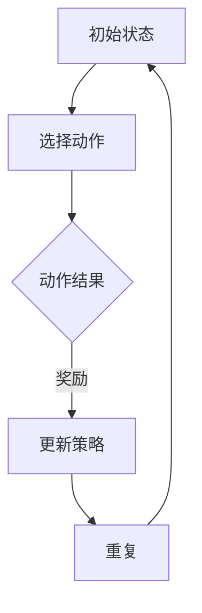

                 


### 目录大纲：企业级强化学习应用：持续优化业务决策过程

## 第一部分：强化学习基础

### 第1章：强化学习概述

#### 背景介绍
强化学习作为一种机器学习的重要分支，起源于对动物行为的建模。通过智能体在环境中进行互动，强化学习使智能体能够不断学习并优化其行为策略。在商业环境中，强化学习被广泛应用于优化业务决策、提升运营效率和降低成本。

#### 核心概念与联系
- **强化学习定义**：强化学习是一种通过奖励机制驱动的机器学习方法，智能体通过不断尝试不同动作，学习在特定环境中获得最大累积奖励的策略。
- **要素**：强化学习包括以下四个关键要素：
  - **状态（State）**：描述环境当前的状态。
  - **动作（Action）**：智能体可以采取的动作。
  - **奖励（Reward）**：智能体执行动作后接收的即时奖励。
  - **策略（Policy）**：智能体在特定状态下采取的动作。
- **目标**：强化学习的目标是学习一个最优策略，使得智能体在长期运行中能够获得最大累积奖励。

#### Mermaid流程图


#### 强化学习与其他机器学习方法的比较
- **监督学习**：输入输出已知，模型通过学习输入输出关系进行预测。
- **无监督学习**：输入输出未知，模型通过学习数据分布或结构进行预测。
- **强化学习**：输入输出未知，模型通过与环境交互学习最优策略。

#### 强化学习的主要应用场景
- **游戏人工智能**：例如围棋、电子竞技等。
- **自动驾驶**：智能体通过感知环境，进行路径规划和决策。
- **业务决策优化**：例如供应链管理、广告投放、物流调度等。

### 第2章：强化学习核心算法

#### 背景介绍
强化学习算法是构建智能体策略的基础。本章将介绍几种主要的强化学习算法，包括Q-Learning、深度Q网络（DQN）和策略梯度方法。

#### 核心算法原理讲解

#### 2.1 Q-Learning算法

**2.1.1 Q-Learning算法原理**
Q-Learning算法通过更新Q值（即状态-动作值函数）来学习最优策略。Q值表示在某个状态下采取某个动作所能获得的累积奖励。

$$ Q(s, a) = \sum_{s'} P(s' | s, a) \cdot R(s', a) + \gamma \cdot \max_{a'} Q(s', a') $$

其中：
- \( s \)：当前状态
- \( a \)：当前动作
- \( s' \)：下一状态
- \( a' \)：下一动作
- \( R(s', a) \)：从状态\( s' \)采取动作\( a \)获得的即时奖励
- \( \gamma \)：折扣因子，表示对未来奖励的期望
- \( P(s' | s, a) \)：从状态\( s \)采取动作\( a \)转移到状态\( s' \)的概率

**2.1.2 Q-Learning算法伪代码**

```pseudo
for each episode do
  s = initial_state()
  while not end_of_episode() do
    a = epsilon-greedy(s)
    s', r = step(s, a)
    Q(s, a) = Q(s, a) + alpha * (r + gamma * max(Q(s', a')) - Q(s, a))
    s = s'
  end while
end for
```

**2.1.3 Q-Learning算法案例**
- **案例场景**：智能投顾系统，通过学习投资市场的动态，为用户提供最佳投资策略。

#### 2.2 深度Q网络（DQN）

**2.2.1 DQN算法原理**
DQN通过深度神经网络来近似Q值函数，从而提高Q-Learning算法在复杂环境中的性能。

$$ Q(s, a) = f_{\theta}(s, a) $$

其中：
- \( f_{\theta}(s, a) \)：参数化的神经网络函数
- \( \theta \)：神经网络参数

**2.2.2 DQN算法伪代码**

```pseudo
Initialize Q-network with random weights
for each episode do
  s = initial_state()
  while not end_of_episode() do
    a = epsilon-greedy(s)
    s', r = step(s, a)
    target = r + gamma * max(Q(s', ))
    Q(s, a) = Q(s, a) + alpha * (target - Q(s, a))
    s = s'
  end while
end for
```

**2.2.3 DQN算法案例**
- **案例场景**：自动驾驶，通过学习道路环境，实现自动驾驶车辆的智能决策。

#### 2.3 策略梯度方法

**2.3.1 Policy Gradient算法原理**
Policy Gradient方法通过直接优化策略的概率分布来学习，其核心公式为：

$$ \nabla_{\theta} J(\theta) = \sum_{s \in S} \pi(\s

