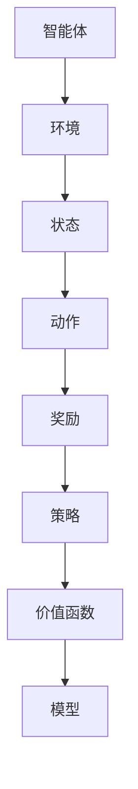

                 

### 文章标题

《企业级强化学习框架：自适应业务策略优化》

### 关键词

- 强化学习
- 企业级应用
- 自适应策略
- 策略优化
- 框架设计

### 摘要

本文旨在探讨企业级强化学习框架在自适应业务策略优化中的应用。首先，介绍了强化学习的基本概念及其在企业级应用中的重要性。接着，详细阐述了企业级强化学习框架的设计原理、实现方法以及关键技术。通过具体应用场景与案例，展示了强化学习在供应链优化、广告投放优化和金融风险管理等领域的实际效果。此外，本文还探讨了强化学习算法的性能优化与调试、安全性问题以及隐私保护策略。最后，对强化学习在企业级应用的发展趋势进行了展望，并提出了未来研究方向。本文旨在为企业级业务策略优化提供一种新的思路和方法，助力企业实现智能化、自动化和高效化的运营管理。

---

### 引言

#### 强化学习概述

强化学习（Reinforcement Learning，RL）是机器学习的一个重要分支，起源于心理学和行为科学领域。其基本思想是通过奖励机制来驱动智能体（Agent）在环境（Environment）中学习最优策略（Policy）。与监督学习和无监督学习不同，强化学习不需要大量标记数据，而是通过智能体与环境交互，逐步学习到最优行为策略。

强化学习的基本模型由四个主要组成部分构成：智能体、环境、状态和动作。智能体是执行动作的实体，环境是智能体行动的场所，状态是环境的描述，动作是智能体对状态的响应。在强化学习过程中，智能体通过不断尝试不同的动作，并根据环境反馈的奖励信号调整其策略，最终学会在特定环境下取得最大化的奖励。

#### 强化学习在企业级应用中的重要性

强化学习在企业级应用中的重要性主要体现在以下几个方面：

1. **自适应策略优化**：企业面临的市场环境和竞争态势不断变化，传统的静态策略难以应对动态变化。强化学习通过不断学习和调整策略，帮助企业实现自适应优化，提高业务运营效率。

2. **业务自动化**：强化学习能够将业务流程中的决策过程自动化，降低人工干预成本，提高决策速度和准确性。这在金融、物流、制造等领域具有重要意义。

3. **风险控制**：强化学习可以帮助企业识别潜在风险，优化风险控制策略，降低运营风险。

4. **资源优化**：强化学习在资源分配、能耗管理等方面具有显著优势，有助于企业实现资源最大化利用。

5. **个性化推荐**：强化学习在个性化推荐系统中具有重要应用，如电商平台的商品推荐、新闻平台的个性化推送等。

#### 本书结构安排与目标读者

本书将围绕企业级强化学习框架展开讨论，结构安排如下：

1. **强化学习基础理论**：介绍强化学习的基本概念、核心算法及其在企业中的应用。
2. **企业级强化学习框架**：详细讲解企业级强化学习框架的设计原理、实现方法以及关键技术。
3. **应用场景与案例**：通过具体案例展示强化学习在企业级业务策略优化中的实际应用。
4. **性能优化与调试**：介绍如何对强化学习算法进行性能优化和调试，确保其在实际应用中的效果。
5. **安全性与隐私保护**：讨论强化学习算法在应用中的安全性问题，以及如何进行隐私保护。
6. **总结与展望**：总结全书内容，对未来的发展方向进行展望。

本书的目标读者主要包括以下几类：

1. **人工智能领域的研究人员**：希望深入了解强化学习在企业级应用的理论和实践。
2. **企业级架构师和工程师**：希望利用强化学习技术优化企业业务策略和运营管理。
3. **金融、物流、制造等领域的技术人员**：希望了解强化学习在这些领域的实际应用案例。

### 强化学习基础理论

#### 强化学习的基本概念

强化学习通过智能体（Agent）在环境（Environment）中的行动（Action）来学习最优策略（Policy）。其核心概念包括：

- **状态（State）**：环境中的一个特定情况，通常用向量表示。
- **动作（Action）**：智能体可以执行的行为，也用向量表示。
- **奖励（Reward）**：智能体在执行动作后从环境中获得的即时奖励，用于评估动作的好坏。
- **策略（Policy）**：智能体在给定状态时选择的动作，策略的目的是最大化累积奖励。
- **价值函数（Value Function）**：预测在特定状态下执行特定动作的长期奖励，包括状态价值函数（State-Value Function）和动作价值函数（Action-Value Function）。
- **模型（Model）**：对环境动态的预测，包括状态转移概率和奖励函数。

#### 强化学习的主要算法

强化学习有多种算法，下面介绍几种常用的算法：

##### Q-Learning算法

Q-Learning算法是一种值函数迭代方法，通过不断更新Q值（动作价值函数）来学习最优策略。其核心思想是：

$$
Q(s, a) \leftarrow Q(s, a) + \alpha [r + \gamma \max_{a'} Q(s', a') - Q(s, a)]
$$

其中，$s$ 和 $a$ 分别代表当前状态和动作，$r$ 是立即奖励，$\gamma$ 是折扣因子，$\alpha$ 是学习率。

##### SARSA算法

SARSA（同步样本动作回报值）算法是一种基于策略的强化学习算法，通过同时考虑当前状态和下一个状态的动作价值来更新策略。其更新公式为：

$$
\pi(s, a) \leftarrow \frac{\sum_{a'} \pi(s, a') [r + \gamma V(s', \pi)]}{\sum_{a'} \pi(s, a')}
$$

##### Deep Q-Networks算法

Deep Q-Networks（DQN）算法将深度神经网络（DNN）引入到Q-Learning中，用于近似动作价值函数。DQN的主要优势在于其能够处理高维状态空间，其更新公式为：

$$
Q(s, a) \leftarrow Q(s, a) + \alpha [r + \gamma \max_{a'} Q(s', a') - Q(s, a)]
$$

为了解决经验回放（Experience Replay）和目标网络（Target Network）的问题，DQN引入了固定目标网络，以减少梯度消失和梯度爆炸的问题。

#### 强化学习与深度学习的结合

随着深度学习技术的发展，强化学习与深度学习逐渐结合，形成了深度强化学习（Deep Reinforcement Learning，DRL）。深度强化学习的核心思想是使用深度神经网络来近似强化学习中的价值函数或策略函数。

##### 深度Q网络（Deep Q-Network，DQN）

DQN是第一个将深度神经网络引入到强化学习中的算法。DQN使用卷积神经网络（CNN）来处理高维状态输入，并使用经验回放和目标网络来稳定学习过程。

##### 深度策略梯度（Deep Policy Gradient，DPPG）

DPPG使用深度神经网络来直接近似策略函数，并使用策略梯度方法进行优化。DPPG在连续动作空间中表现出色，但其训练过程较为复杂。

##### 策略梯度（Policy Gradient，PG）

策略梯度方法通过优化策略函数的梯度来更新策略，避免了值函数近似带来的复杂度。政策梯度方法包括REINFORCE和PPO（Proximal Policy Optimization）等变体。

#### 核心概念原理之间的关系架构

下面是一个简化的Mermaid流程图，展示了强化学习核心概念之间的关系：

### 企业级强化学习框架

#### 企业级强化学习框架概述

企业级强化学习框架旨在解决企业业务中的复杂决策问题，通过自适应策略优化实现业务目标的最优化。该框架包括多个关键组件，如环境模拟、智能体、策略学习、策略评估等。

#### 框架设计原理

企业级强化学习框架的设计原则主要包括：

- **模块化设计**：将框架拆分为多个独立模块，便于功能扩展和维护。
- **可扩展性**：框架应支持多种强化学习算法，以适应不同业务场景的需求。
- **实时性**：框架需具备高效处理能力，以应对实时业务环境。
- **安全性**：确保算法在处理企业敏感数据时的安全性和隐私保护。

#### 框架实现方法

企业级强化学习框架的实现主要包括以下步骤：

1. **环境构建**：根据业务需求构建模拟环境，包括状态空间、动作空间和奖励函数。
2. **智能体设计**：设计智能体的结构，包括状态感知、动作决策和策略学习模块。
3. **策略学习**：采用强化学习算法训练智能体，优化策略函数。
4. **策略评估**：对训练好的策略进行评估，验证其在实际业务环境中的效果。

#### 关键技术解析

企业级强化学习框架的关键技术包括：

1. **多智能体强化学习**：在多智能体系统中，智能体之间需要协同合作以实现共同目标。多智能体强化学习通过设计合作策略，实现智能体间的协同。
2. **强化学习在动态环境中的应用**：动态环境中的状态变化不确定，需要智能体具备快速适应能力。通过设计适应动态变化的策略，实现智能体在动态环境中的优化。
3. **强化学习在非平稳环境中的应用**：非平稳环境中，状态和动作之间的奖励关系可能发生变化。通过设计适应非平稳环境的策略，实现智能体在非平稳环境中的优化。

### 应用场景与案例

#### 供应链优化

供应链优化是企业级强化学习框架的一个重要应用场景。通过强化学习，企业可以优化库存管理、运输调度和需求预测等环节，提高供应链的整体效率。

1. **环境构建**：构建一个模拟供应链的环境，包括库存状态、运输状态和需求状态。
2. **智能体设计**：设计一个智能体，负责根据当前状态做出库存补货、运输调度和需求预测等决策。
3. **策略学习**：采用Q-Learning或DQN算法，训练智能体优化策略函数。
4. **策略评估**：通过模拟环境，评估智能体策略在真实场景中的效果。

#### 广告投放优化

广告投放优化是另一个重要的应用场景。通过强化学习，企业可以优化广告投放策略，提高广告投放的转化率和ROI（投资回报率）。

1. **环境构建**：构建一个模拟广告投放的环境，包括用户点击状态、广告展示状态和收益状态。
2. **智能体设计**：设计一个智能体，负责根据当前状态选择广告投放策略。
3. **策略学习**：采用SARSA或DPPG算法，训练智能体优化策略函数。
4. **策略评估**：通过模拟环境，评估智能体策略在真实场景中的效果。

#### 金融风险管理

金融风险管理是企业级强化学习框架的另一个重要应用场景。通过强化学习，企业可以优化风险控制策略，降低金融风险。

1. **环境构建**：构建一个模拟金融市场的环境，包括投资状态、风险状态和收益状态。
2. **智能体设计**：设计一个智能体，负责根据当前状态进行投资决策。
3. **策略学习**：采用Q-Learning或PPO算法，训练智能体优化策略函数。
4. **策略评估**：通过模拟环境，评估智能体策略在真实场景中的效果。

### 性能优化与调试

#### 性能优化策略

1. **算法选择**：根据业务需求和环境特性选择合适的强化学习算法。
2. **参数调优**：通过调整学习率、折扣因子等参数，优化算法性能。
3. **并行计算**：利用多核CPU或GPU加速算法训练过程。

#### 调试技巧

1. **日志记录**：记录算法训练过程中的关键指标，如Q值、奖励等。
2. **可视化分析**：使用可视化工具分析状态、动作和奖励分布，发现潜在问题。
3. **A/B测试**：在不同业务场景下对比不同策略的效果，选择最优策略。

#### 性能评估方法

1. **模拟测试**：在模拟环境中评估策略效果，通过统计指标（如平均奖励、方差等）进行评估。
2. **实际测试**：在真实业务环境中评估策略效果，通过实际数据验证策略的有效性。

### 安全性与隐私保护

#### 强化学习安全性的挑战

1. **策略欺骗**：攻击者可能通过欺骗策略来获取不正当利益。
2. **隐私泄露**：强化学习算法在处理企业敏感数据时可能泄露隐私信息。
3. **模型攻击**：攻击者通过攻击模型来干扰算法的决策过程。

#### 安全性增强方法

1. **加密技术**：使用加密技术保护企业敏感数据，防止隐私泄露。
2. **联邦学习**：通过联邦学习技术，实现分布式训练，减少单点故障风险。
3. **访问控制**：限制对算法模型的访问权限，防止未经授权的攻击。

#### 隐私保护策略

1. **数据匿名化**：对输入数据进行匿名化处理，减少隐私泄露风险。
2. **差分隐私**：使用差分隐私技术，在算法训练过程中保护隐私。
3. **隐私保护算法**：选择具有隐私保护特性的算法，如联邦学习、差分隐私等。

### 总结与展望

#### 全书总结

本文介绍了企业级强化学习框架在自适应业务策略优化中的应用，包括强化学习的基本概念、算法原理、框架设计、应用场景以及性能优化和安全性问题。通过具体案例展示了强化学习在供应链优化、广告投放优化和金融风险管理等领域的实际应用效果。

#### 强化学习在企业级应用的发展趋势

1. **算法多样化**：随着深度学习和强化学习技术的发展，更多的算法将应用于企业级场景，满足不同业务需求。
2. **跨领域应用**：强化学习将在更多领域得到应用，如智能制造、能源管理、医疗健康等。
3. **云计算与边缘计算**：云计算和边缘计算的结合将提高强化学习算法的实时性和处理能力，推动企业级应用的发展。
4. **安全性提升**：随着安全性和隐私保护技术的进步，强化学习在企业级应用中的安全性将得到提升。

#### 未来研究方向

1. **算法优化**：研究更高效的强化学习算法，提高算法在复杂环境中的表现。
2. **跨领域融合**：探索强化学习与其他技术的融合，如深度学习、联邦学习等，提高应用效果。
3. **应用落地**：研究强化学习在企业级业务中的实际应用场景，推动技术落地。
4. **伦理与法规**：关注强化学习在企业级应用中的伦理和法规问题，确保技术的可持续发展。

### 作者信息

- 作者：AI天才研究院/AI Genius Institute & 禅与计算机程序设计艺术 /Zen And The Art of Computer Programming

### 项目实战

#### 开发环境搭建

1. **软件环境**：搭建强化学习开发环境，包括Python、TensorFlow、PyTorch等。
2. **硬件环境**：配置高性能计算资源，如GPU或TPU，以提高算法训练速度。

#### 源代码实现与解读

1. **智能体实现**：实现智能体的状态感知、动作决策和策略学习功能。
2. **环境模拟**：构建模拟供应链、广告投放或金融市场的环境，包括状态空间、动作空间和奖励函数。
3. **算法实现**：选择合适的强化学习算法，如Q-Learning、SARSA、DQN等，实现策略学习和策略评估功能。

#### 代码应用解读与分析

1. **案例一：供应链优化**：分析供应链优化中的状态、动作和奖励，解释智能体如何通过策略学习实现库存管理和运输调度的优化。
2. **案例二：广告投放优化**：分析广告投放优化中的用户点击状态、广告展示状态和收益，解释智能体如何通过策略学习实现广告投放策略的优化。
3. **案例三：金融风险管理**：分析金融市场中的投资状态、风险状态和收益，解释智能体如何通过策略学习实现风险控制和投资策略的优化。

#### 实际案例分析

1. **供应链优化案例**：分析一个实际供应链优化项目，展示智能体策略在项目中的实施过程和效果。
2. **广告投放优化案例**：分析一个实际广告投放优化项目，展示智能体策略在项目中的实施过程和效果。
3. **金融风险管理案例**：分析一个实际金融风险管理项目，展示智能体策略在项目中的实施过程和效果。

#### 项目小结

1. **项目总结**：总结项目实施过程中遇到的问题和解决方案，分析项目的成功经验和不足之处。
2. **经验分享**：分享项目中的最佳实践和技巧，为后续项目提供借鉴。
3. **未来展望**：展望强化学习在企业级应用中的发展前景，提出未来研究的方向和目标。

### 最佳实践 Tips

1. **数据质量**：确保输入数据的质量和准确性，对于强化学习算法的性能至关重要。
2. **算法选择**：根据业务需求和数据特性选择合适的强化学习算法。
3. **参数调优**：合理调整学习率、折扣因子等参数，提高算法性能。
4. **安全性和隐私保护**：关注算法的安全性和隐私保护，确保企业在应用强化学习技术时的合法权益。

### 小结

本文详细介绍了企业级强化学习框架在自适应业务策略优化中的应用。通过理论讲解、框架设计、应用案例和性能优化等方面的探讨，展示了强化学习在企业级业务中的巨大潜力和实际效果。未来，随着强化学习技术的不断发展和应用场景的扩展，企业级强化学习框架将为企业带来更多的价值和机遇。

### 注意事项

1. **数据隐私**：在应用强化学习技术时，需严格保护企业敏感数据，避免隐私泄露。
2. **算法可靠性**：在部署强化学习算法时，需确保算法的可靠性和稳定性，避免因算法问题导致的业务中断。
3. **持续优化**：强化学习算法在实际应用中需不断优化和调整，以适应不断变化的业务需求和环境。

### 拓展阅读

1. **强化学习经典教材**：《强化学习：原理与Python实现》（Reinforcement Learning: An Introduction），作者：理查德·萨顿（Richard S. Sutton）和安德斯·帕帕哈里斯（Andrew G. Barto）。
2. **深度强化学习**：《深度强化学习》（Deep Reinforcement Learning），作者：达赖·席尔瓦（Doina Precup）和达芙妮·科勒（Daphne Koller）。
3. **企业级应用案例**：企业级强化学习应用案例研究，了解不同企业在实际业务中应用强化学习的实践经验和成果。

---

本文《企业级强化学习框架：自适应业务策略优化》通过系统地介绍强化学习的基本概念、算法原理、框架设计、应用案例以及性能优化和安全性问题，为读者提供了一个全面深入的了解。随着人工智能技术的不断进步，强化学习在企业级应用中的前景将更加广阔，相信本文的内容能为相关领域的研究者和实践者提供有价值的参考。希望读者在阅读过程中能够有所收获，并对强化学习在企业级应用有更深刻的认识。感谢大家的阅读，祝您在技术探索的道路上不断前行！作者：AI天才研究院/AI Genius Institute & 禅与计算机程序设计艺术 /Zen And The Art of Computer Programming。

