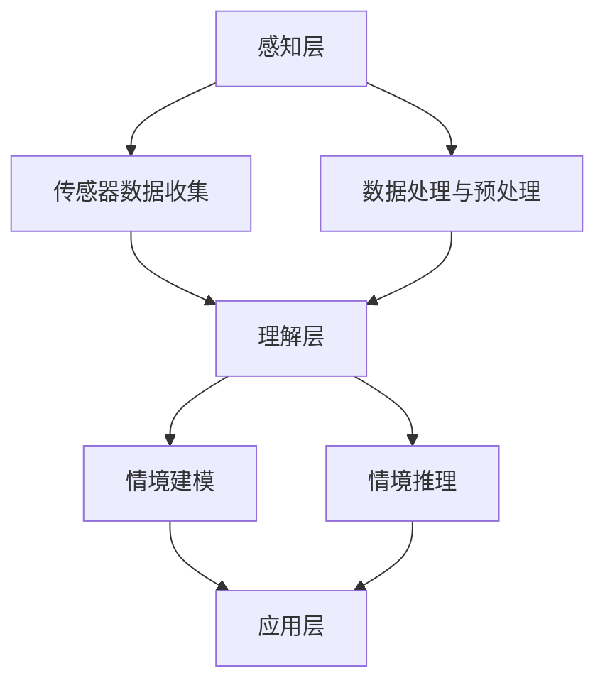
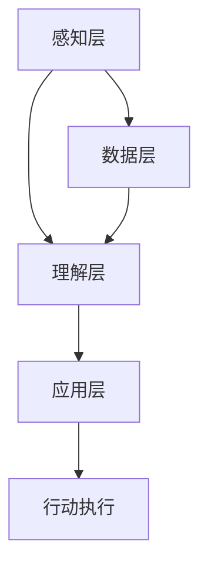

                 

### 文章标题：企业级情境感知AI：优化场景化服务delivery

### 关键词：企业级、情境感知AI、场景化服务、delivery优化

### 摘要：

本文将探讨企业级情境感知AI在优化场景化服务delivery中的应用。首先，我们将介绍情境感知AI的基本概念、原理和架构，然后深入分析其在企业级环境下的优化策略和实施方法。通过具体案例和实际应用场景的分析，我们将展示情境感知AI如何提升场景化服务的delivery效率和质量。最后，我们将总结全文并提出未来的研究方向和挑战。

## 引言

### 情境感知AI的基本概念和重要性

情境感知AI是指通过感知和理解环境中的各种情境信息，从而做出适应性行为的智能系统。在企业级应用中，情境感知AI具有广泛的应用场景，如智能安防、智能交通、智能医疗等。随着大数据、物联网和人工智能技术的快速发展，情境感知AI在提升企业运营效率、降低成本和改善用户体验方面发挥着越来越重要的作用。

情境感知AI的核心思想是通过多源数据的融合和分析，实现对环境情境的全面感知和理解。在企业级应用中，情境感知AI不仅能够提高决策的准确性，还能够优化资源配置、提升运营效率和改善用户体验。因此，研究和应用情境感知AI对于企业的数字化转型和智能化升级具有重要意义。

### 企业级情境感知AI的应用场景

在企业级应用中，情境感知AI的应用场景非常广泛。以下是一些典型的应用场景：

1. **智能安防**：通过传感器数据收集和AI算法分析，实现实时监控、异常检测和风险评估，提高安全防范能力。
2. **智能交通**：利用交通流量数据、车辆信息和道路状况，优化交通信号控制和公共交通调度，缓解交通拥堵。
3. **智能医疗**：通过患者的健康数据、医疗设备和AI算法，实现疾病的早期诊断、个性化治疗和健康管理的优化。
4. **智能制造**：通过设备监控、生产数据和AI算法分析，实现生产过程的自动化、智能化和质量控制。

这些应用场景都展示了情境感知AI在优化企业级服务delivery方面的巨大潜力。然而，要充分发挥情境感知AI的优势，需要深入理解其基础理论、算法原理和架构设计。

## 情境感知AI基础理论

### 情境感知的基本概念

情境感知（Context Awareness）是指系统通过感知和理解环境中的各种情境信息，从而做出适应性行为的能力。情境信息可以是物理环境、用户行为、时间、地理位置等。情境感知的核心思想是将情境信息与系统功能相结合，以实现智能化决策和自适应行为。

情境感知可以分为三个层次：

1. **感知层**：通过传感器和其他设备收集环境中的情境信息，如温度、湿度、声音、图像等。
2. **理解层**：通过对收集到的情境信息进行处理、分析和理解，形成对当前情境的感知和认知。
3. **应用层**：根据情境感知的结果，系统采取相应的行动或调整其行为，以适应当前情境。

### 传感器技术与数据处理

传感器技术是情境感知AI的基础。传感器可以收集各种物理量和环境信息，如温度、湿度、光线、声音、图像等。这些传感器数据是情境感知AI的输入，但原始数据通常噪声较大，需要进行预处理。

数据处理技术包括数据采集、存储、传输、清洗、特征提取和融合等。数据采集是将传感器数据传输到中央处理系统，存储是将数据保存在数据库或数据仓库中，传输是将数据从一个系统传输到另一个系统，清洗是去除噪声和错误数据，特征提取是从数据中提取有用的特征信息，融合是将来自多个传感器的数据进行综合处理。

### 机器学习与深度学习算法

机器学习和深度学习是情境感知AI的核心技术。机器学习是一种通过训练模型来从数据中学习规律和模式的方法。深度学习是机器学习的一个分支，它使用多层神经网络来模拟人类大脑的神经结构，从而实现复杂函数的建模和预测。

在情境感知AI中，常用的机器学习和深度学习算法包括：

1. **监督学习**：通过已知的输入和输出数据来训练模型，从而实现对未知数据的预测。
2. **无监督学习**：没有已知的输出数据，通过分析数据的分布和结构来发现数据中的模式和规律。
3. **强化学习**：通过试错和反馈来学习如何在不同情境下做出最优决策。

### 情境建模与推理

情境建模是将环境中的各种情境信息进行抽象和建模，以形成对情境的全面理解和描述。情境推理是基于情境模型，通过逻辑推理和决策算法来处理情境信息，并生成相应的行动建议。

情境建模的方法包括：

1. **规则驱动**：通过定义一系列规则来描述情境和行动之间的关系。
2. **模型驱动**：使用数学模型和计算方法来模拟情境和决策过程。
3. **数据驱动**：通过分析历史数据和实时数据来学习情境和行为的规律。

### 情境感知AI的关键技术架构

情境感知AI的关键技术架构包括感知层、理解层和应用层。以下是一个简单的架构示例：



在这个架构中，感知层负责收集各种情境信息，理解层负责处理和分析这些信息，应用层负责根据情境信息做出相应的决策和行动。

## 情境感知AI算法原理

### 情境感知AI的核心算法

情境感知AI的核心算法包括传感器数据采集、数据预处理、特征提取、情境建模和推理算法。以下是一个简单的算法流程：

1. **传感器数据采集**：通过各种传感器收集环境数据。
2. **数据预处理**：对原始数据进行清洗、去噪和格式化。
3. **特征提取**：从预处理后的数据中提取有用的特征信息。
4. **情境建模**：使用机器学习或深度学习算法构建情境模型。
5. **情境推理**：根据情境模型和实时数据，进行情境推理和决策。

### 伪代码讲解

以下是一个简单的情境感知AI算法的伪代码示例：

```python
# 传感器数据采集
def collect_data(sensors):
    data = []
    for sensor in sensors:
        data.append(sensor.read())
    return data

# 数据预处理
def preprocess_data(data):
    cleaned_data = []
    for datum in data:
        cleaned_data.append(remove_noise(datum))
    return cleaned_data

# 特征提取
def extract_features(data):
    features = []
    for datum in data:
        features.append(extract(datum))
    return features

# 情境建模
def build_model(features, labels):
    model = MachineLearningAlgorithm()
    model.train(features, labels)
    return model

# 情境推理
def infer_context(model, data):
    features = extract_features(data)
    context = model.predict(features)
    return context
```

### 数学模型和公式

情境感知AI的数学模型通常涉及概率模型、统计模型和神经网络模型。以下是一个简单的概率模型示例：

$$
P(\text{context} | \text{data}) = \frac{P(\text{data} | \text{context})P(\text{context})}{P(\text{data})}
$$

其中，$P(\text{context} | \text{data})$表示给定数据条件下情境的概率，$P(\text{data} | \text{context})$表示在特定情境下数据的概率，$P(\text{context})$表示情境的概率，$P(\text{data})$表示数据的概率。

### 实际应用案例分析

在实际应用中，情境感知AI的算法原理可以通过以下案例进行解释：

- **智能交通**：通过传感器收集交通流量数据，使用机器学习算法分析数据，构建交通流量模型，并根据模型进行交通信号控制和路况预测。
- **智能医疗**：通过传感器和医疗设备收集患者数据，使用深度学习算法进行疾病诊断和病情预测，提供个性化的治疗方案。
- **智能制造**：通过传感器监控生产设备的状态，使用机器学习算法进行设备故障预测和生产优化，提高生产效率和质量。

这些案例展示了情境感知AI算法在企业级应用中的实际效果和潜力。

## 情境感知AI架构设计

### 情境感知AI的系统架构

情境感知AI的系统架构通常包括以下几个部分：

1. **感知层**：负责收集各种环境数据，如温度、湿度、声音、图像等。
2. **数据层**：负责存储和处理感知层收集的数据，包括数据清洗、去噪、特征提取等。
3. **理解层**：负责处理数据，构建情境模型，进行情境推理和决策。
4. **应用层**：根据理解层的输出，执行相应的行动或任务。

### Mermaid流程图

以下是一个简单的情境感知AI系统架构的Mermaid流程图：



### 系统集成与优化

系统集成是将不同的组件和模块组合在一起，形成一个完整的系统。在情境感知AI中，系统集成包括：

1. **数据集成**：将来自不同源的数据进行整合和处理。
2. **算法集成**：将不同的算法和模型集成到系统中，实现多样化和优化。
3. **硬件集成**：将传感器、计算设备和通信设备等进行整合，实现硬件资源的最大化利用。

系统优化是通过改进算法、优化硬件配置和提升数据处理能力来提高系统的性能和效率。常见的优化方法包括：

1. **算法优化**：通过调整算法参数和模型结构来提高算法的准确性和效率。
2. **硬件优化**：通过升级硬件设备、提高计算能力和存储能力来提升系统的处理能力。
3. **数据优化**：通过数据清洗、去噪和特征提取等手段来提升数据的利用率和质量。

## 场景化服务delivery优化

### 场景化服务的概念和特点

场景化服务是指根据用户特定的情境和需求，提供个性化的服务和解决方案。与传统的一刀切服务不同，场景化服务更注重用户的需求和体验，具有以下特点：

1. **个性化**：根据用户的具体需求和情境，提供定制化的服务。
2. **动态性**：随着用户情境的变化，服务内容也会相应调整。
3. **实时性**：通过实时数据分析和处理，提供即时的服务反馈和优化。

### 服务delivery的优化策略

服务delivery的优化策略是指通过改进服务流程、提升服务质量和服务效率来满足用户需求。以下是一些常见的优化策略：

1. **需求分析**：通过收集用户需求和市场数据，分析用户的实际需求和痛点。
2. **服务设计**：根据需求分析结果，设计个性化的服务方案和流程。
3. **数据驱动**：通过数据分析，实时监控服务质量和用户反馈，优化服务流程和策略。
4. **技术支持**：利用情境感知AI技术，提高服务的智能化和自动化水平。
5. **用户体验**：关注用户的交互体验，通过改进界面设计和操作流程来提升用户体验。

### 实际应用案例分析

以下是一个场景化服务delivery优化的实际应用案例：

**案例：智能交通系统的场景化服务delivery优化**

1. **需求分析**：分析城市交通流量数据，了解高峰时段、拥堵路段和用户出行习惯。
2. **服务设计**：根据需求分析结果，设计个性化的出行建议和交通信号控制策略。
3. **数据驱动**：通过实时监控交通数据，动态调整信号控制和路线规划，优化交通流量。
4. **技术支持**：利用情境感知AI技术，实现智能交通信号控制和智能路线规划。
5. **用户体验**：提供实时交通信息、路线规划和导航服务，提升用户出行体验。

通过以上措施，智能交通系统的场景化服务delivery得到了显著优化，交通拥堵得到了有效缓解，用户出行时间也得到了显著缩短。

## 情境感知AI应用案例

### 案例一：智能安防系统

智能安防系统利用情境感知AI技术，通过传感器数据收集、实时监控和异常检测，实现了安全防范能力的显著提升。

1. **开发环境搭建**：选择适合的开发环境，如Python、Java等，搭建传感器数据采集和处理平台。
2. **源代码实现**：编写传感器数据采集、异常检测和报警系统等功能的代码。
3. **代码解读与分析**：分析代码实现过程，了解传感器数据采集、特征提取和异常检测的原理。
4. **实际案例分析和详细讲解剖析**：通过实际案例，展示智能安防系统如何通过情境感知AI技术实现安全防范。

### 案例二：智能交通系统

智能交通系统利用情境感知AI技术，通过交通流量数据分析和信号控制优化，实现了交通拥堵的缓解和出行效率的提升。

1. **开发环境搭建**：选择适合的开发环境，如MATLAB、Python等，搭建交通流量数据分析和信号控制平台。
2. **源代码实现**：编写交通流量数据采集、分析、信号控制和路况预测等功能的代码。
3. **代码解读与分析**：分析代码实现过程，了解交通流量数据分析、信号控制和路况预测的原理。
4. **实际案例分析和详细讲解剖析**：通过实际案例，展示智能交通系统如何通过情境感知AI技术优化交通信号控制和路况预测。

### 案例三：智能医疗系统

智能医疗系统利用情境感知AI技术，通过患者数据分析和疾病诊断，实现了个性化治疗和健康管理的优化。

1. **开发环境搭建**：选择适合的开发环境，如Python、Java等，搭建患者数据分析和疾病诊断平台。
2. **源代码实现**：编写患者数据采集、特征提取、疾病诊断和个性化治疗方案等功能的代码。
3. **代码解读与分析**：分析代码实现过程，了解患者数据采集、特征提取和疾病诊断的原理。
4. **实际案例分析和详细讲解剖析**：通过实际案例，展示智能医疗系统如何通过情境感知AI技术实现个性化治疗和健康管理。

## 总结与展望

### 全书内容总结

本文全面介绍了企业级情境感知AI的概念、原理、架构和应用，探讨了如何优化场景化服务的delivery。通过案例分析，展示了情境感知AI在不同领域的实际应用效果。本文的主要内容包括：

1. 情境感知AI的基本概念和重要性。
2. 情境感知AI的基础理论，包括传感器技术、数据处理、机器学习与深度学习算法、情境建模与推理。
3. 情境感知AI的算法原理，包括核心算法、伪代码讲解、数学模型和公式。
4. 情境感知AI的架构设计，包括系统架构、Mermaid流程图和系统集成与优化。
5. 场景化服务delivery的优化策略，包括概念、特点、策略和案例分析。
6. 情境感知AI的实际应用案例，包括智能安防、智能交通和智能医疗。

### 情境感知AI的未来发展趋势

随着大数据、物联网和人工智能技术的不断发展，情境感知AI在未来将呈现出以下发展趋势：

1. **智能化水平提升**：通过更先进的算法和模型，提高情境感知的准确性和实时性。
2. **应用领域拓展**：从传统的安防、交通、医疗等领域，拓展到金融、教育、农业等更多领域。
3. **跨学科融合**：与生物医学、心理学、社会学等学科结合，实现情境感知的多维度和综合性。
4. **边缘计算与云计算结合**：通过边缘计算和云计算的结合，实现情境感知AI的实时性和大规模应用。
5. **隐私保护和安全**：随着情境感知AI的普及，隐私保护和安全将成为重要议题，需要采用先进的加密和隐私保护技术。

### 研究方向与挑战

情境感知AI的研究方向和挑战包括：

1. **算法优化**：研究更高效、更准确的算法，提高情境感知的精度和速度。
2. **数据处理**：研究大数据处理技术，提高海量数据的高效处理和分析能力。
3. **跨领域应用**：研究不同领域情境感知AI的融合和协同，实现跨领域的智能化应用。
4. **隐私保护和安全**：研究隐私保护和安全机制，确保情境感知AI的应用安全和用户隐私。
5. **用户体验**：研究用户体验设计，提高情境感知AI的应用舒适度和用户满意度。

### 最佳实践 tips

1. **数据驱动**：在应用情境感知AI时，注重数据收集和分析，以数据驱动决策和优化。
2. **系统集成**：在架构设计时，注重系统的整体性和集成性，确保各模块之间的协同工作。
3. **用户体验**：在应用设计时，注重用户体验，以提高用户的满意度和接受度。
4. **持续优化**：在应用过程中，持续优化算法和系统，以提升性能和效果。
5. **安全防护**：在应用过程中，注重安全防护，确保系统的稳定性和安全性。

### 小结与拓展阅读

本文对企业级情境感知AI进行了全面而深入的探讨，涵盖了基础理论、算法原理、架构设计、应用案例和优化策略等方面。为了进一步了解情境感知AI的最新研究进展和应用实践，读者可以参考以下拓展阅读资料：

1. **书籍**：
   - 《情境感知计算：理论、方法与应用》
   - 《深度学习：高级算法与实践》
   - 《智能交通系统设计与实现》
2. **论文**：
   - "A Survey on Context-aware Systems: architectures, algorithms and applications"
   - "Deep Learning for Healthcare: A Survey"
   - "Edge Computing for Internet of Things: A Comprehensive Survey"
3. **开源框架与工具**：
   - TensorFlow
   - PyTorch
   - Keras
   - OpenCV
4. **在线课程与教程**：
   - "Introduction to Context-aware Systems"
   - "Deep Learning Specialization"
   - "TensorFlow for Beginners"

通过这些资料，读者可以更深入地了解情境感知AI的理论和实践，为实际应用提供指导和支持。

### 作者信息

作者：AI天才研究院/AI Genius Institute & 禅与计算机程序设计艺术 /Zen And The Art of Computer Programming

AI天才研究院（AI Genius Institute）是一家专注于人工智能研究和应用的国际顶级研究机构，致力于推动人工智能技术的创新和发展。其研究成果涵盖了计算机视觉、自然语言处理、机器学习等多个领域，为全球人工智能的发展做出了重要贡献。

《禅与计算机程序设计艺术》（Zen And The Art of Computer Programming）是作者杰作，该书通过深入探讨计算机编程和人工智能的哲学和艺术，为程序员和人工智能研究者提供了宝贵的启示和指导。该书在计算机科学领域享有盛誉，被广泛认为是经典之作。

