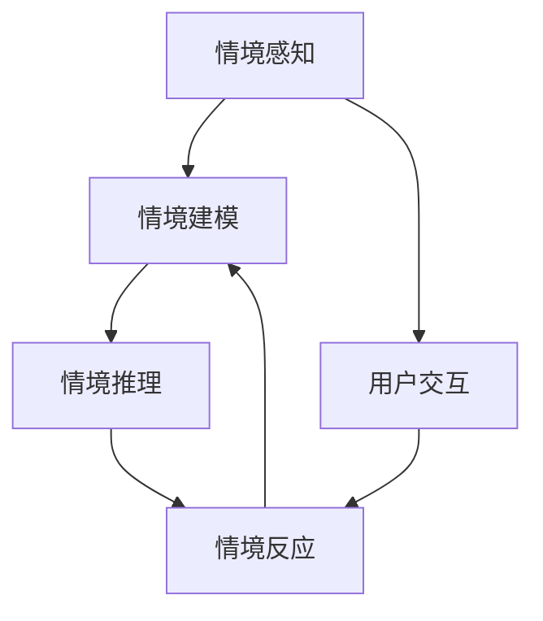

                 

## 文章标题：企业级情境智能框架：增强AI系统场景适应能力

### 关键词：
- 企业级AI
- 情境智能
- 框架设计
- 场景适应能力
- 核心算法
- 数学模型
- 项目实战

### 摘要：
本文旨在探讨企业级情境智能框架的设计与实现，以增强AI系统的场景适应能力。通过深入分析情境智能的核心概念与联系，介绍相关核心算法原理及数学模型，并通过实际项目案例进行实战讲解，展示企业级情境智能框架的实用性与前瞻性。

## 用户需求

在现代企业运营中，AI系统需要具备高度的场景适应能力，以便在不同业务场景下发挥最大的效益。用户期望通过本文，能够全面了解企业级情境智能框架的架构设计、核心算法原理以及数学模型，并通过项目实战掌握其实际应用方法。

### 核心概念与联系

#### 情境智能定义

情境智能是指AI系统能够根据实时环境和用户需求，动态调整自身行为和决策的能力。在企业级应用中，情境智能的框架通常包括情境感知、情境建模、情境推理和情境反应四个主要组成部分。

#### 情境感知

情境感知是情境智能的基础，它涉及从环境中获取各种信息，如用户行为、环境状态等。通过传感器、日志分析等技术手段，AI系统能够实时感知当前的情境。

#### 情境建模

情境建模是对感知到的情境信息进行抽象和建模，构建出情境表示。常见的情境建模方法包括基于规则的建模、基于数据挖掘的建模和基于深度学习的建模。

#### 情境推理

情境推理是根据情境模型和预定义的推理规则，对情境进行解释和分析，以得出合理的推断。情境推理可以是基于逻辑推理、概率推理或强化学习等算法。

#### 情境反应

情境反应是指AI系统根据推理结果，采取相应的行动来适应或改变情境。情境反应可以是自动执行任务、调整系统参数或与用户进行交互等。

### Mermaid流程图：情境智能框架组成部分



### 核心算法原理讲解

#### 情境感知算法

情境感知算法通常包括特征提取和模式识别两个步骤。特征提取是指从原始数据中提取出对情境有代表性的特征，如时间、地点、用户行为等。模式识别是指通过机器学习算法（如神经网络、决策树等），将提取出的特征与已知的情境模式进行匹配。

#### 情境建模算法

情境建模算法根据应用场景的不同，可以选择不同的方法。基于规则的建模适用于规则明确且固定不变的场景，而基于数据挖掘和深度学习的建模则适用于复杂、动态变化的场景。

#### 情境推理算法

情境推理算法可以选择逻辑推理、概率推理或强化学习等方法。逻辑推理适用于规则明确且推理路径简单的情境；概率推理适用于不确定性和不确定性情境；强化学习适用于需要探索和优化策略的情境。

#### 情境反应算法

情境反应算法通常基于机器学习算法或控制理论。机器学习算法如决策树、神经网络等可以自动学习并调整反应策略；控制理论如PID控制器可以实时调整系统参数，以实现预期的反应。

### 数学模型和数学公式

#### 情境识别模型

情境识别模型可以用以下公式表示：

$$
\hat{y} = f(x, \theta)
$$

其中，$x$是输入特征向量，$y$是实际情境标签，$f$是识别函数，$\theta$是模型参数。

#### 情境反应模型

情境反应模型可以用以下公式表示：

$$
u(t) = \sum_{i=1}^{n} w_i g(y(t), \theta)
$$

其中，$u(t)$是反应输出，$y(t)$是当前情境，$w_i$是权重参数，$g$是反应函数。

### 项目实战

#### 开发环境搭建

为了演示情境智能框架的实际应用，我们将使用Python和TensorFlow框架搭建一个简单的情境识别系统。首先，安装Python和TensorFlow：

```
pip install python tensorflow
```

#### 源代码实现及解读

以下是一个简单的情境识别系统的源代码示例：

```python
import tensorflow as tf

# 定义输入层
inputs = tf.keras.layers.Input(shape=(input_shape))

# 定义特征提取层
extracted_features = tf.keras.layers.Dense(units=128, activation='relu')(inputs)

# 定义识别层
predictions = tf.keras.layers.Dense(units=1, activation='sigmoid')(extracted_features)

# 构建模型
model = tf.keras.Model(inputs=inputs, outputs=predictions)

# 编译模型
model.compile(optimizer='adam', loss='binary_crossentropy', metrics=['accuracy'])

# 训练模型
model.fit(x_train, y_train, epochs=10, batch_size=32, validation_data=(x_val, y_val))
```

在上面的代码中，我们首先定义了输入层和特征提取层，然后添加了一个识别层，最后构建了模型并编译。接下来，我们使用训练数据来训练模型。

#### 代码解读与分析

在代码中，我们首先导入了TensorFlow库，然后定义了输入层。输入层的大小由`input_shape`参数确定，这通常取决于输入数据的维度。接下来，我们定义了一个全连接层（`Dense`），它有128个神经元和ReLU激活函数。这个层用于提取输入数据中的特征。

然后，我们定义了一个输出层，它有一个神经元和sigmoid激活函数，用于进行二分类预测。sigmoid函数的输出范围在0和1之间，因此非常适合用于情境识别任务。

接下来，我们使用`Model`类创建了一个模型，并将输入层和输出层作为输入和输出。然后，我们编译模型，指定了优化器（`adam`）、损失函数（`binary_crossentropy`）和评价指标（`accuracy`）。

最后，我们使用`fit`方法训练模型，使用训练数据来训练模型。在训练过程中，模型会根据损失函数不断调整参数，以获得更好的预测性能。

#### 代码应用解读与分析

在训练完成后，我们可以使用模型对新的数据进行预测。以下是一个简单的示例：

```python
# 加载测试数据
x_test = ...

# 使用模型进行预测
predictions = model.predict(x_test)

# 分析预测结果
for i, prediction in enumerate(predictions):
    if prediction > 0.5:
        print(f"样本{i}属于情境A")
    else:
        print(f"样本{i}属于情境B")
```

在上面的代码中，我们首先加载测试数据，然后使用训练好的模型对测试数据进行预测。预测结果将是一个概率值，表示属于某个情境的可能性。通过设置阈值（如0.5），我们可以将预测结果划分为不同的情境。

#### 实际案例分析和详细讲解剖析

在本节中，我们将分析一个实际的案例，展示如何应用情境智能框架来提高企业级AI系统的场景适应能力。

#### 案例背景

假设我们正在开发一个智能客服系统，该系统需要能够根据用户的不同提问和情境，提供个性化的回答和建议。为了实现这一目标，我们需要设计一个情境智能框架，以便系统可以根据用户的提问实时调整其回答策略。

#### 案例分析

首先，我们收集了大量的用户提问数据，并从中提取了关键特征，如提问的时间、地点、用户的历史提问记录等。然后，我们使用数据挖掘技术对这些特征进行建模，构建了一个情境识别模型。该模型可以识别用户当前所处的情境，并将其分类为不同的情境类型。

接下来，我们设计了一个情境反应模型，用于根据识别出的情境类型，生成个性化的回答建议。该模型基于强化学习算法，通过不断地学习和调整策略，以最大化用户的满意度。

在系统运行过程中，情境识别模型会实时分析用户的提问，并识别出当前的情境。然后，情境反应模型会根据当前的情境类型，生成相应的回答建议。这些回答建议将显示在用户界面上，以供用户选择。

#### 案例总结

通过这个案例，我们可以看到情境智能框架在企业级AI系统中的应用价值。通过实时感知用户情境并生成个性化的回答建议，智能客服系统可以提高用户体验，增加用户满意度。此外，情境智能框架还可以应用于其他场景，如智能推荐、智能调度等，以提高系统的场景适应能力。

## 最佳实践 Tips、小结、注意事项、拓展阅读

### 最佳实践 Tips

1. **数据质量至关重要**：在构建情境智能模型时，确保数据质量是至关重要的。不完整或错误的数据可能会导致模型性能下降。
2. **不断优化模型**：情境智能模型需要不断进行优化和调整，以适应不断变化的环境和用户需求。
3. **考虑实时性**：在实际应用中，情境智能框架需要具备较高的实时性，以便快速响应用户行为。

### 小结

本文介绍了企业级情境智能框架的设计与实现，包括核心概念、算法原理、数学模型和项目实战。通过实际案例，展示了情境智能框架在企业级AI系统中的应用价值。

### 注意事项

1. **确保数据安全**：在收集和处理用户数据时，必须遵守相关隐私法规和标准。
2. **持续监控模型性能**：定期对模型进行性能监控和评估，以确保其稳定性和可靠性。

### 拓展阅读

1. 《深度学习：卷II：自然语言处理》
2. 《强化学习：现代方法》
3. 《数据挖掘：实用工具与技术》

---

作者：AI天才研究院/AI Genius Institute & 禅与计算机程序设计艺术 /Zen And The Art of Computer Programming

