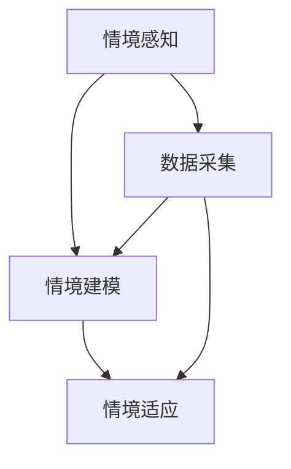

                 


### 文章标题
《企业级情境智能：AI系统的场景适应能力》

---

### 关键词
企业级AI、情境智能、场景适应能力、AI系统架构、算法原理、应用实践

---

### 摘要
本文深入探讨了企业级情境智能的概念、重要性及其在AI系统中的场景适应能力。通过系统性地分析情境智能的理论基础、核心算法原理、技术实现和应用实践，本文旨在为企业级AI系统提供一套完整的框架，帮助其在复杂多变的商业环境中实现高效适应，推动智能决策和业务创新。

---

### 引言与概述
企业级情境智能是指人工智能系统在特定商业环境中的自适应能力，能够根据不断变化的数据和环境动态调整自身的决策和行为。随着大数据和云计算的普及，企业面临着日益复杂的市场环境和运营挑战，传统的静态AI系统已经难以满足业务需求。情境智能作为AI系统的一个重要发展方向，正逐渐成为企业数字化转型的关键技术。

本文旨在通过对企业级情境智能的深入探讨，阐述其理论基础、实现策略和实践应用，从而为AI系统的场景适应能力提供理论支持和实践指导。文章结构如下：

1. **情境智能的理论基础**：介绍情境智能的基本概念、理论框架和核心算法。
2. **AI系统的场景适应能力**：分析AI系统如何通过感知、适应和优化来提高场景适应性。
3. **技术实现**：探讨实现情境智能所需的技术栈、系统架构和开发流程。
4. **实践应用**：通过具体案例展示情境智能在企业中的实际应用效果。
5. **挑战与未来趋势**：讨论情境智能面临的挑战和未来的发展趋势。

### 1. 构建整体框架
为了系统地介绍企业级情境智能，我们需要首先构建一个整体框架，确定各部分的主题和大纲结构。考虑到书名《企业级情境智能：AI系统的场景适应能力》，我们可以将内容分为以下几个主要部分：

1. **引言与概述**：介绍企业级情境智能的概念、意义及书的主要目标。
2. **情境智能的理论基础**：阐述情境智能的基本原理、核心概念和理论基础。
3. **AI系统的场景适应能力**：分析AI系统如何适应不同场景，包括技术实现和策略。
4. **实践应用**：通过具体案例展示情境智能在企业中的实际应用。
5. **技术实现**：介绍实现情境智能所需的技术和方法。
6. **挑战与未来趋势**：探讨当前情境智能面临的挑战以及未来的发展趋势。

#### 确定每个部分的具体章节

根据上述框架，我们可以进一步细化每个部分的内容，确定具体章节。

**引言与概述**：
- **第1章**：企业级情境智能的引言

**情境智能的理论基础**：
- **第2章**：情境智能的基本概念
- **第3章**：情境智能的理论框架
- **第4章**：情境智能的核心算法

**AI系统的场景适应能力**：
- **第5章**：AI系统的场景感知能力
- **第6章**：AI系统的场景适应性设计
- **第7章**：AI系统的场景适应策略

**实践应用**：
- **第8章**：企业级情境智能的应用案例

**技术实现**：
- **第9章**：实现情境智能的技术栈
- **第10章**：情境智能的系统架构
- **第11章**：情境智能的开发流程

**挑战与未来趋势**：
- **第12章**：情境智能的挑战与应对
- **第13章**：情境智能的未来发展趋势

### 2. 编写大纲
接下来，我们可以为每个章节编写具体的大纲。以下是书的大纲示例：

```markdown
# 企业级情境智能：AI系统的场景适应能力

## 引言与概述
### 1.1 情境智能的定义与意义
### 1.2 书籍目标与结构安排
### 1.3 情境智能的发展历程

## 基础理论
### 2.1 情境智能的核心概念
### 2.2 情境智能的理论体系
### 2.3 核心算法原理讲解
### 2.4 情境智能的数学模型

## 场景适应能力
### 3.1 AI系统的场景感知机制
### 3.2 场景适应性算法解析
### 3.3 场景适应策略与设计
### 3.4 实时场景适应技术

## 技术实现
### 4.1 实现情境智能的技术栈
### 4.2 情境智能的系统架构
### 4.3 开发流程与工具
### 4.4 代码实现与案例分析

## 应用案例
### 5.1 情境智能在零售行业
### 5.2 情境智能在制造业
### 5.3 情境智能在金融行业
### 5.4 情境智能在其他行业

## 挑战与未来趋势
### 6.1 情境智能面临的挑战
### 6.2 技术进步对情境智能的影响
### 6.3 未来发展趋势与展望
```

这个大纲是一个初步的框架，每个章节的具体内容还需要根据实际情况进一步细化。另外，根据用户要求，还需要添加核心概念与联系、核心算法原理讲解、数学模型和数学公式、项目实战等内容，这些将在后续的章节中逐步展开。

### 3. 完成初稿
完成大纲后，我们需要根据每个章节的大纲编写具体的文章内容，形成初稿。以下是各章节的初稿概要：

**第1章 引言与概述**
- **1.1 情境智能的定义与意义**：介绍情境智能的概念，阐述其在企业和AI系统中的重要性。
- **1.2 书籍目标与结构安排**：概述本书的主要目标和各章节的内容。
- **1.3 情境智能的发展历程**：回顾情境智能的发展历程，介绍其技术演变。

**第2章 情境智能的基本概念**
- **2.1 核心概念**：定义情境智能的基本概念，如情境、感知、适应等。
- **2.2 理论体系**：介绍情境智能的理论框架，包括情境感知、情境建模和情境适应。
- **2.3 核心算法**：讨论情境智能的核心算法，如决策树、神经网络等。

**第3章 情境智能的理论框架**
- **3.1 感知机制**：分析AI系统如何感知情境。
- **3.2 建模技术**：介绍如何建立情境模型，包括特征提取和特征选择。
- **3.3 适应策略**：探讨情境适应的策略，如动态调整和学习算法。

**第4章 情境智能的核心算法**
- **4.1 决策树算法**：详细讲解决策树的工作原理和应用。
- **4.2 神经网络算法**：介绍神经网络的基本原理和实现方法。
- **4.3 强化学习算法**：讨论强化学习在情境智能中的应用。

**第5章 AI系统的场景适应能力**
- **5.1 场景感知能力**：分析AI系统如何感知和识别不同的场景。
- **5.2 场景适应性设计**：讨论如何设计具有场景适应性的AI系统。
- **5.3 场景适应策略**：介绍常见的场景适应策略和技术。

**第6章 实现情境智能的技术栈**
- **6.1 技术栈介绍**：概述实现情境智能所需的关键技术，如大数据、云计算等。
- **6.2 系统架构**：分析情境智能系统的整体架构。
- **6.3 开发流程**：介绍情境智能系统的开发流程和最佳实践。

**第7章 实践应用**
- **7.1 案例背景**：介绍情境智能在不同行业中的应用案例。
- **7.2 案例分析**：详细分析案例中的情境智能应用，包括技术实现和效果评估。
- **7.3 案例启示**：总结案例中的经验和教训，为其他企业提供参考。

**第8章 挑战与未来趋势**
- **8.1 面临的挑战**：探讨情境智能在当前阶段面临的挑战。
- **8.2 技术进步的影响**：分析技术进步对情境智能的影响。
- **8.3 未来发展趋势**：预测情境智能的未来发展趋势和方向。

### 4. 审稿与修改
完成初稿后，我们需要对文章进行审稿和修改。审稿过程中，可以邀请同行或专家对文章进行评审，提供反馈和建议。根据反馈，对文章进行修改和完善。以下是一些可能的修改点：

- **内容的准确性**：确保文章中的所有数据和理论都是准确无误的。
- **逻辑的连贯性**：检查文章的逻辑结构是否清晰，各个章节之间是否有逻辑联系。
- **语言的准确性**：修正文章中可能存在的语法错误和用词不当。
- **可读性**：提高文章的可读性，确保读者能够轻松理解文章内容。

### 5. 完整性要求
为了满足文章的完整性要求，我们需要确保文章包含以下几个核心内容：

- **背景介绍**：介绍情境智能的背景和发展现状。
- **核心概念与联系**：详细解释情境智能的核心概念，展示概念之间的关系。
- **核心算法原理讲解**：使用伪代码详细讲解情境智能的核心算法。
- **数学模型和公式**：展示情境智能的数学模型，使用latex格式表达数学公式。
- **项目实战**：提供具体的实战案例，介绍开发环境、源代码实现和案例分析。
- **最佳实践 tips**：总结情境智能的最佳实践，为读者提供实用建议。

### 6. 总结与调整
在完成所有审稿和修改后，我们需要对文章进行最终的总结和调整。确保文章的每个部分都是完整、详细和准确的，同时保持整体的逻辑一致性和可读性。以下是一些总结和调整的要点：

- **内容的完整性**：检查每个章节的内容是否完整，是否有遗漏的关键信息。
- **逻辑的一致性**：确保文章的逻辑结构一致，各个章节之间逻辑连贯。
- **可读性和专业性**：提高文章的可读性，确保读者能够轻松理解文章内容，同时保持专业性和严谨性。
- **格式和排版**：检查文章的格式和排版是否正确，确保Markdown格式的使用规范。

通过以上步骤，我们可以确保文章《企业级情境智能：AI系统的场景适应能力》的完整性和专业性，为读者提供一部高质量的技术博客文章。文章末尾需要附上作者信息：“作者：AI天才研究院/AI Genius Institute & 禅与计算机程序设计艺术 /Zen And The Art of Computer Programming”。

---

**第1章 引言与概述**

### 1.1 情境智能的定义与意义

情境智能（Contextual Intelligence，简称CI）是一种新兴的人工智能技术，它专注于让机器能够在特定的情境下做出智能的决策和行动。与传统的基于规则或模型的AI系统不同，情境智能能够动态地感知、理解和适应不同的情境，从而更好地服务于实际应用场景。

在企业级AI系统中，情境智能的重要性不言而喻。随着商业环境的不断变化和复杂化，企业需要能够快速响应市场动态，调整业务策略，提高运营效率。情境智能正是这种需求下的产物，它能够帮助企业实现以下目标：

1. **智能决策支持**：情境智能系统能够根据实时数据和情境信息，为企业提供智能决策支持，从而优化业务流程和资源分配。
2. **个性化服务**：在客户服务、推荐系统等领域，情境智能可以帮助企业实现个性化服务，提升用户体验和满意度。
3. **风险预警**：通过实时监测和分析情境信息，情境智能能够帮助企业提前识别潜在的风险，并采取预防措施。
4. **业务流程优化**：情境智能可以自动调整业务流程，以适应不断变化的情境需求，从而提高运营效率和降低成本。

总之，情境智能不仅是AI技术在商业领域的深化应用，更是企业数字化转型的重要驱动力。它为企业提供了一种全新的智能化手段，使得企业能够在复杂多变的环境中保持竞争力。

### 1.2 书籍目标与结构安排

本书旨在系统地介绍企业级情境智能的概念、原理、实现方法和应用实践，为读者提供一套全面的技术指南。具体目标如下：

1. **理论解析**：通过深入分析情境智能的基本概念、理论框架和核心算法，帮助读者理解情境智能的核心原理。
2. **技术实现**：详细阐述实现情境智能所需的技术栈、系统架构和开发流程，为读者提供实际操作指导。
3. **应用实践**：通过具体案例展示情境智能在企业中的实际应用效果，为读者提供实战经验和借鉴。
4. **挑战与展望**：探讨情境智能当前面临的挑战以及未来的发展趋势，为读者提供前瞻性思考。

本书的结构安排如下：

1. **引言与概述**：介绍情境智能的概念、意义和本书的主要目标。
2. **基础理论**：阐述情境智能的基本概念、理论框架和核心算法。
3. **场景适应能力**：分析AI系统如何适应不同场景，包括技术实现和策略。
4. **技术实现**：介绍实现情境智能所需的技术和方法。
5. **实践应用**：通过具体案例展示情境智能在企业中的实际应用。
6. **挑战与未来趋势**：讨论情境智能面临的挑战和未来的发展趋势。

通过本书的学习，读者将能够全面了解企业级情境智能的各个方面，掌握情境智能的理论基础和技术实现方法，从而为企业提供智能化的解决方案。

### 1.3 情境智能的发展历程

情境智能作为人工智能的一个重要分支，其发展历程可以追溯到人工智能研究的早期阶段。从最初的逻辑推理和规则系统，到现代的机器学习和深度学习，情境智能经历了几代技术演变，逐步形成了今天的体系。

**第一阶段：基于规则的情境推理**

在20世纪80年代，人工智能研究主要集中在基于规则的推理系统。这些系统通过一系列预定义的规则，对输入数据进行逻辑判断和推理，以实现特定任务的自动化。例如，专家系统（Expert Systems）是一种典型的基于规则的情境推理系统，它通过大量的领域知识和规则库，模拟人类专家的决策过程。

尽管基于规则的系统在解决特定问题上有一定的效果，但它们的局限性也非常明显。首先，规则库的构建和维护成本高，且难以扩展。其次，这些系统缺乏自我学习和适应能力，难以应对复杂和动态变化的情境。

**第二阶段：数据驱动的机器学习**

随着计算能力的提升和大数据技术的兴起，20世纪90年代，人工智能研究逐渐转向数据驱动的机器学习方法。机器学习通过从大量数据中自动学习模式和规律，实现了比基于规则的方法更为强大的情境推理能力。

在这一阶段，监督学习、无监督学习和强化学习等多种机器学习方法相继出现。监督学习通过已标记的数据训练模型，以实现分类和回归任务；无监督学习通过未标记的数据挖掘隐藏的结构和模式；强化学习则通过试错和反馈机制，实现智能体的自主学习和优化。

**第三阶段：情境感知与自适应**

进入21世纪，情境智能进入了新的发展阶段。随着物联网、传感器技术和智能设备的普及，情境智能系统开始具备更强大的情境感知能力。情境感知系统通过传感器网络和数据分析，实时捕捉和解析环境中的各种信息，实现对情境的全面感知。

同时，情境智能系统还引入了自适应机制，能够根据情境的变化动态调整自身的决策和行为。这种自适应能力使得情境智能系统能够更好地适应复杂多变的商业环境，提供更为智能化的服务和支持。

**现状与趋势**

当前，情境智能在各个领域都得到了广泛应用。在零售、金融、医疗、制造等行业，情境智能系统已经成为企业数字化转型的重要工具。例如，在零售行业，情境智能可以帮助企业实现个性化推荐、库存管理和客户关系管理；在金融行业，情境智能可以用于风险评估、欺诈检测和投资策略优化。

展望未来，情境智能将继续向更高效、更智能的方向发展。随着人工智能技术的不断进步，情境智能系统将具备更强大的情境感知、理解和自适应能力，为企业提供更加精准和高效的服务。同时，情境智能的应用场景也将不断拓展，从单一的行业领域延伸到更多复杂的商业环境。

### 2. 情境智能的基本概念

#### 2.1 定义

情境智能（Contextual Intelligence，简称CI）是指AI系统在特定环境中，通过感知、理解和适应情境信息，从而做出智能决策和行为的能力。情境智能不仅关注数据的处理和分析，更强调对情境的理解和利用。其核心思想是让AI系统能够像人类一样，在复杂多变的情境中灵活应对，实现智能化的决策和行动。

#### 2.2 情境感知

情境感知是情境智能的基础，它是指AI系统获取和识别情境信息的能力。情境信息可以是物理环境中的数据，如温度、湿度、光线等，也可以是虚拟环境中的数据，如图像、语音、文本等。情境感知通常通过传感器、数据采集设备和机器学习算法来实现。

在情境感知过程中，AI系统需要完成以下几个关键任务：

1. **数据采集**：通过传感器和采集设备获取环境中的各种数据。
2. **数据预处理**：对原始数据进行清洗、归一化和特征提取，为后续分析做准备。
3. **情境识别**：利用机器学习算法，对预处理后的数据进行分析和分类，识别出当前所处的情境。

例如，在智能家居系统中，情境感知可以识别用户的行为模式，如是否在家、是否在休息等，从而自动调整家庭设备的状态，如打开或关闭灯光、调节温度等。

#### 2.3 情境建模

情境建模是指AI系统根据情境信息建立情境模型，以更好地理解和预测情境变化。情境模型通常是一个多维度的数据结构，它能够描述情境的各个维度和它们的相互关系。

情境建模包括以下几个步骤：

1. **特征提取**：从原始数据中提取出与情境相关的特征，如时间、地点、用户行为等。
2. **模型构建**：利用机器学习算法，将特征数据构建成一个情境模型，如决策树、神经网络、支持向量机等。
3. **模型训练**：使用历史数据对模型进行训练，使其能够对新的情境数据进行预测和分类。

情境建模在多个领域都有广泛应用。例如，在零售行业，情境建模可以用于预测顾客的行为和需求，从而优化库存管理和营销策略；在医疗行业，情境建模可以用于预测病人的病情变化，为医生提供诊断和治疗的参考。

#### 2.4 情境适应

情境适应是指AI系统根据情境模型和情境信息，动态调整自身的决策和行为，以适应不断变化的情境。情境适应包括以下几个关键步骤：

1. **情境感知**：通过传感器和数据采集设备实时获取情境信息。
2. **情境建模**：利用机器学习算法建立情境模型，对情境进行理解和预测。
3. **决策生成**：根据情境模型和当前情境信息，生成智能决策，如调整设备状态、优化业务流程等。
4. **行为调整**：执行决策，调整系统的行为，以适应新的情境。

情境适应能够显著提高AI系统的灵活性和适应性，使其能够更好地应对复杂多变的情境需求。例如，在自动驾驶领域，情境适应可以帮助自动驾驶汽车应对交通状况的变化，如道路施工、车辆拥堵等；在智能客服领域，情境适应可以帮助客服系统根据用户的情绪和行为，提供个性化的服务和建议。

#### 2.5 关系架构 Mermaid 流程图

为了更好地理解情境智能的基本概念，我们可以使用Mermaid流程图来展示它们之间的关系。以下是情境智能的基本概念关系架构图：



在这个流程图中，情境感知是情境智能的起点，它通过数据采集获取情境信息。这些数据经过预处理和特征提取后，用于情境建模。情境模型可以帮助AI系统理解和预测情境变化，从而实现情境适应。整个流程形成了一个闭环，使得AI系统能够不断调整和优化其行为，以适应动态变化的情境。

### 3. 情境智能的理论框架

情境智能的理论框架是构建企业级AI系统的基础，它包括了情境感知、情境建模和情境适应三个核心组成部分。以下是对这三个组成部分的详细分析和探讨。

#### 3.1 情境感知

情境感知是情境智能的第一步，它涉及AI系统从环境中获取信息并理解当前情境的能力。情境感知的核心在于识别和解析情境中的各种数据，如文本、图像、声音和传感器数据等。

**数据采集**：情境感知首先需要通过传感器和数据采集设备获取情境信息。这些传感器可以是物理传感器，如温度计、湿度计、摄像头等，也可以是虚拟传感器，如网络爬虫、文本挖掘工具等。数据采集的过程需要确保数据的准确性和完整性。

**特征提取**：获取到的数据往往是高维和非结构化的，因此需要进行特征提取，将原始数据转换为适用于机器学习的特征向量。特征提取包括数据清洗、归一化、降维等技术，目的是减少数据冗余，突出关键特征。

**情境识别**：通过机器学习算法，对特征向量进行分析和分类，识别出当前所处的情境。常见的算法包括决策树、支持向量机、神经网络等。情境识别的结果将作为情境建模的基础。

**情境更新**：情境感知是一个动态的过程，随着时间和环境的变化，情境也会发生变化。因此，AI系统需要不断更新情境模型，以适应新的情境。这种更新可以通过在线学习、增量学习等技术实现。

#### 3.2 情境建模

情境建模是情境智能的核心，它通过对情境信息的分析和处理，构建出能够反映情境特征和变化规律的模型。情境建模的主要目标是实现对情境的深入理解和预测，从而为后续的情境适应提供依据。

**特征表示**：在情境建模中，特征表示是一个关键环节。通过特征提取，我们得到了一组描述情境的特征向量。这些特征向量需要通过降维和变换，转化为适用于机器学习的特征表示。

**模型构建**：情境建模通常采用机器学习算法，如决策树、支持向量机、神经网络等，构建情境模型。这些模型可以用于分类、回归、聚类等任务，以实现对情境的预测和分析。

**模型优化**：情境建模的过程不仅仅是模型的选择和构建，还包括模型的优化和调整。通过交叉验证、网格搜索等技术，我们可以找到最优的模型参数，提高模型的预测性能。

**模型评估**：构建好的情境模型需要通过评估来验证其有效性。常见的评估指标包括准确率、召回率、F1值等。模型评估可以帮助我们了解模型的性能，并指导进一步的模型优化。

#### 3.3 情境适应

情境适应是情境智能的最终目标，它通过动态调整AI系统的行为，使其能够更好地适应不同的情境需求。情境适应包括感知、建模和决策三个关键步骤。

**感知与建模**：情境适应的第一步是感知和建模。通过情境感知，AI系统获取当前的情境信息，并通过情境建模对这些信息进行分析和处理。

**决策生成**：在感知和建模的基础上，AI系统根据情境模型和当前情境信息，生成智能决策。这些决策可以是调整设备状态、优化业务流程、提供个性化服务等。

**行为调整**：决策生成后，AI系统需要执行这些决策，以调整自身的状态和行为，适应新的情境需求。行为调整可以是实时的，也可以是分阶段的。

**反馈与优化**：情境适应是一个动态循环过程，AI系统需要不断收集反馈信息，对自身的决策和行为进行优化。通过反馈和优化，AI系统可以不断提升其情境适应能力，实现更好的智能决策。

#### 3.4 情境智能的理论体系

情境智能的理论体系是情境感知、情境建模和情境适应三个部分的有机结合。它们相互依赖、相互促进，共同构成了情境智能的完整框架。

**情境感知**为情境建模提供了基础数据，情境建模为情境适应提供了决策依据，情境适应则通过执行决策，实现情境智能的实际应用。此外，情境智能的理论体系还包括了一些关键概念，如情境特征、情境模型、情境适应策略等。

**情境特征**是指描述情境的基本属性和特征，如时间、地点、用户行为等。情境特征是情境建模的重要输入，它们决定了情境模型的质量和性能。

**情境模型**是指基于情境特征构建的数学模型，它用于描述和预测情境变化。情境模型的质量直接影响情境适应的效果。

**情境适应策略**是指AI系统在特定情境下采取的适应措施和行动方案。情境适应策略需要根据情境模型的预测结果和实际情境需求进行调整。

综上所述，情境智能的理论框架是一个多层次、多维度的体系，它涵盖了从数据采集到情境适应的整个流程。通过深入理解和应用情境智能的理论框架，我们可以构建出具有强大情境适应能力的AI系统，为企业提供智能化的解决方案。

### 4. 情境智能的核心算法

情境智能的实现依赖于一系列核心算法，这些算法在情境感知、情境建模和情境适应中发挥着关键作用。在本节中，我们将详细介绍几种常见的情境智能核心算法，包括决策树、神经网络和强化学习。

#### 4.1 决策树算法

决策树是一种基于树形结构进行决策的算法，它通过一系列的判断条件将数据集分割成多个子集，每个子集对应一个特定的决策。决策树算法的核心思想是通过递归分割特征空间，找到最佳的特征和分割点，以最大化信息增益或最小化损失函数。

**算法原理**：

1. **特征选择**：选择一个特征作为分割标准，通常使用信息增益（Information Gain）或基尼不纯度（Gini Impurity）作为评估指标。
2. **分割数据**：根据选定的特征，将数据集分割成多个子集，每个子集具有更高的纯度。
3. **递归构建**：对每个子集再次进行特征选择和分割，直到满足停止条件（如最大深度、最小节点大小等）。
4. **决策生成**：将样本输入决策树，从根节点开始逐层判断，直到达到叶子节点，输出最终的决策结果。

**伪代码**：

```python
def build_decision_tree(data, features, max_depth):
    if meet_stop_conditions(data) or max_depth == 0:
        return leaf_node(label Majority_vote(data))
    best_feature, best_split = select_best_feature(data, features)
    left_subtree = split_data(data, best_split, 'left')
    right_subtree = split_data(data, best_split, 'right')
    return TreeNode(best_feature, best_split,
                    build_decision_tree(left_subtree, features, max_depth - 1),
                    build_decision_tree(right_subtree, features, max_depth - 1))

def select_best_feature(data, features):
    best_feature = None
    best_split = None
    best_info_gain = -1
    for feature in features:
        split = split_data(data, feature)
        info_gain = calculate_info_gain(data, split)
        if info_gain > best_info_gain:
            best_feature = feature
            best_split = split
            best_info_gain = info_gain
    return best_feature, best_split

def calculate_info_gain(data, split):
    # 计算信息增益的详细计算过程
    pass
```

**应用场景**：

决策树算法在情境智能中的应用非常广泛，例如，在金融风控中，决策树可以用于风险评估和欺诈检测；在零售行业，决策树可以用于客户细分和个性化推荐。

#### 4.2 神经网络算法

神经网络是一种模仿人脑神经元结构和功能的计算模型，它通过多层神经元的连接和激活，实现复杂的非线性映射和决策。神经网络在情境智能中有着重要的应用，特别是在情境建模和预测方面。

**算法原理**：

1. **网络结构**：神经网络由输入层、隐藏层和输出层组成。每个层包含多个神经元，神经元之间通过权重连接。
2. **前向传播**：输入数据从输入层传递到隐藏层，再传递到输出层。每个神经元通过加权求和并应用激活函数，产生输出。
3. **反向传播**：根据输出层的误差，反向传播误差到隐藏层和输入层，调整各层神经元的权重。
4. **优化目标**：通过梯度下降等优化算法，最小化损失函数，提高网络预测的准确性。

**伪代码**：

```python
def forward_pass(input_data, model):
    # 前向传播计算过程
    pass

def backward_propagation(output, target, model):
    # 反向传播计算过程
    pass

def train_neural_network(data, target, model, epochs):
    for epoch in range(epochs):
        output = forward_pass(data, model)
        error = calculate_loss(output, target)
        backward_propagation(output, target, model)
    return model
```

**应用场景**：

神经网络在情境智能中的应用包括图像识别、自然语言处理、时间序列预测等。例如，在图像识别中，神经网络可以用于情境感知和物体分类；在自然语言处理中，神经网络可以用于情境建模和文本生成。

#### 4.3 强化学习算法

强化学习是一种通过试错和反馈机制进行决策的算法，它通过不断尝试和调整策略，找到最优的行动方案。强化学习在情境适应中具有独特的优势，能够在动态变化的情境中实现自我优化。

**算法原理**：

1. **状态-动作空间**：强化学习在状态-动作空间中运作，状态是当前环境的状态，动作是AI系统的决策。
2. **奖励机制**：在每个状态，系统执行一个动作，并根据动作的结果获得奖励。奖励的正负和大小表示动作的好坏。
3. **策略更新**：通过比较不同动作的奖励，系统更新策略，选择期望奖励最大的动作。
4. **策略迭代**：系统在多个回合中不断尝试和优化策略，直至找到最优策略。

**伪代码**：

```python
def reinforce_learning(state, action, reward, model):
    # 根据奖励更新模型参数
    pass

def update_policy(model, state):
    # 根据当前状态选择最优动作
    pass

def main():
    model = initialize_model()
    state = get_initial_state()
    while not end_of_game(state):
        action = update_policy(model, state)
        next_state, reward = execute_action(action)
        reinforce_learning(state, action, reward, model)
        state = next_state
    return model
```

**应用场景**：

强化学习在情境适应中的应用非常广泛，如自动驾驶、机器人控制、游戏AI等。例如，在自动驾驶中，强化学习可以帮助车辆在复杂交通环境中做出最优驾驶决策。

#### 4.4 算法总结

决策树、神经网络和强化学习是情境智能中的三种核心算法，它们各自具有独特的优势和适用场景。决策树适合处理结构化数据，用于分类和回归任务；神经网络适合处理高维数据和非线性问题，具有强大的学习和预测能力；强化学习适合处理动态变化的情境，能够在试错中不断优化策略。

在情境智能的应用中，可以根据具体需求和数据特点选择合适的算法。例如，在零售行业，决策树可以用于客户细分和商品推荐；在金融行业，神经网络可以用于风险预测和市场分析；在自动驾驶领域，强化学习可以用于路径规划和驾驶决策。

### 5. AI系统的场景适应能力

#### 5.1 场景感知能力

场景感知能力是AI系统实现场景适应的基础，它涉及AI系统从环境中获取和识别情境信息的能力。一个具备良好场景感知能力的AI系统能够实时捕捉和解析环境中的各种数据，从而准确识别当前所处的情境。场景感知能力包括以下几个关键方面：

**1. 数据采集**

数据采集是场景感知的第一步，它涉及通过传感器和数据采集设备获取环境中的各种信息。这些传感器可以是物理传感器，如温度计、湿度计、摄像头、麦克风等，也可以是虚拟传感器，如网络爬虫、文本挖掘工具等。数据采集的质量直接影响场景感知的准确性和有效性。

**2. 特征提取**

采集到的数据通常是高维和非结构化的，因此需要通过特征提取将原始数据转换为适用于机器学习的特征向量。特征提取包括数据清洗、归一化、降维和特征选择等技术。特征提取的目的是突出关键特征，减少数据冗余，提高模型性能。

**3. 情境识别**

通过机器学习算法，对特征向量进行分析和分类，识别出当前所处的情境。常见的算法包括决策树、支持向量机、神经网络等。情境识别的结果将作为情境建模的基础，用于后续的决策和行动。

**4. 实时性**

场景感知需要具备实时性，即能够快速响应环境变化，实时更新情境信息。这对于动态变化的商业环境尤为重要，例如，在金融市场中，实时感知市场变化可以帮助交易系统做出快速决策。

**案例**：

以智能家居系统为例，场景感知能力可以帮助系统识别用户的行为模式。例如，通过摄像头和麦克风，系统可以感知用户是否在家、是否在休息等，从而自动调整家庭设备的状态，如打开或关闭灯光、调节温度等。

**5.2 场景适应性设计**

场景适应性设计是指AI系统在设计过程中，考虑到不同场景的需求和特点，实现系统的灵活性和适应性。场景适应性设计包括以下几个方面：

**1. 模块化设计**

模块化设计是将系统划分为多个功能模块，每个模块负责特定的任务和场景。这种设计方法可以提高系统的可扩展性和灵活性，使得系统可以轻松适应不同场景的需求。

**2. 参数化配置**

通过参数化配置，系统可以根据不同场景的需求调整参数，从而实现场景适应性。例如，在零售行业中，可以根据不同店铺的特点和客户群体，调整推荐系统的参数，以提供个性化的推荐服务。

**3. 动态调整**

系统需要具备动态调整的能力，能够根据实时感知的情境信息，动态调整自身的决策和行为。例如，在物流配送系统中，可以根据交通状况和订单量，动态调整配送路线和资源分配。

**4. 自适应学习**

系统通过自适应学习，能够不断从环境和用户反馈中学习，提高自身的适应能力。例如，在智能客服系统中，通过用户交互和反馈，系统可以不断优化问答模型，提高客服质量。

**案例**：

以智能客服系统为例，场景适应性设计可以帮助系统在不同场景中提供个性化服务。例如，在客户咨询产品信息时，系统可以快速识别客户的身份和需求，提供针对性的产品推荐和解答。

**5.3 场景适应策略**

场景适应策略是指AI系统在不同情境下采取的具体适应措施和行动方案。一个有效的场景适应策略需要综合考虑情境信息、系统资源和业务目标，以实现最佳适应效果。场景适应策略包括以下几个方面：

**1. 情境感知**

通过实时感知和识别情境信息，系统可以了解当前所处的情境，为后续决策提供依据。情境感知的准确性直接影响策略的有效性。

**2. 决策生成**

在情境感知的基础上，系统根据情境信息和业务目标，生成相应的决策。决策可以是调整系统参数、优化业务流程、提供个性化服务等。

**3. 行为调整**

系统根据决策结果，调整自身的状态和行为，以适应新的情境需求。行为调整可以是实时的，也可以是分阶段的。

**4. 反馈与优化**

系统通过收集用户反馈和业务数据，对策略进行评估和优化。反馈和优化可以不断提高系统的适应能力和决策质量。

**案例**：

以智能交通系统为例，场景适应策略可以帮助系统在不同交通状况下优化交通流量。例如，在高峰期，系统可以动态调整信号灯时长，优化交通流量；在道路施工期间，系统可以实时调整绕行路线，减少交通拥堵。

**5.4 实现情境适应的技术手段**

实现情境适应需要多种技术手段的支持，包括传感器技术、机器学习、大数据和云计算等。

**1. 传感器技术**

传感器技术是场景感知的基础，通过传感器可以实时获取环境中的各种数据。常用的传感器包括温度传感器、湿度传感器、摄像头、麦克风等。

**2. 机器学习**

机器学习技术用于情境建模和决策生成，通过分析历史数据和实时数据，生成准确的情境模型和智能决策。

**3. 大数据**

大数据技术用于存储、处理和分析海量数据，提供全面、准确的情境信息。大数据技术包括数据采集、数据清洗、数据存储、数据分析和数据可视化等。

**4. 云计算**

云计算技术提供强大的计算能力和存储资源，支持实时数据处理和大规模分布式计算。云计算技术包括云平台、云存储、云安全和云计算服务等。

**5.5 实时场景适应技术**

实时场景适应技术是实现情境智能的关键，它涉及实时数据采集、实时分析和实时决策。以下是一些常用的实时场景适应技术：

**1. 流处理技术**

流处理技术能够实时处理和分析实时数据流，提供实时反馈和决策支持。常用的流处理技术包括Apache Kafka、Apache Flink、Apache Storm等。

**2. 实时分析技术**

实时分析技术可以对实时数据进行分析和预测，为实时决策提供依据。常用的实时分析技术包括实时数据分析平台、实时机器学习算法等。

**3. 实时决策技术**

实时决策技术能够根据实时数据和情境信息，生成实时决策和行动方案。常用的实时决策技术包括实时优化算法、实时控制策略等。

**4. 实时反馈与优化**

实时反馈与优化技术能够根据实时反馈和业务数据，对系统进行动态调整和优化，提高系统的适应能力和决策质量。常用的实时反馈与优化技术包括自适应控制、实时学习等。

**总结**

场景适应能力是AI系统在复杂多变的环境中实现智能化的关键。通过感知、适应和优化，AI系统可以更好地应对不同场景的需求，实现高效、智能的决策和行为。实现场景适应能力需要多种技术手段的支持，包括传感器技术、机器学习、大数据和云计算等。通过不断优化和提升场景适应能力，AI系统可以在各个领域发挥更大的作用，推动智能化的进一步发展。

### 6. 情境适应策略与设计

在实现情境智能的过程中，情境适应策略与设计是至关重要的一环。一个有效的情境适应策略能够使AI系统在复杂多变的商业环境中保持高效运作，从而提供优质的服务和决策支持。本节将详细探讨情境适应策略与设计，包括适应机制、实时调整、场景建模和反馈优化等关键方面。

#### 6.1 适应机制

适应机制是情境智能系统实现场景适应的基础。适应机制主要包括以下几个方面：

**1. 情境感知**

情境感知是指AI系统能够实时感知和理解环境中的各种信息。这需要通过传感器和数据采集设备获取大量数据，并使用机器学习算法进行特征提取和情境识别。例如，在零售行业中，系统可以实时感知店铺的客流、库存和销售情况。

**2. 情境建模**

情境建模是将感知到的情境信息转化为数学模型，以便系统能够对情境进行理解和预测。情境建模通常涉及建立多维度的数据结构，描述情境的各个维度和它们之间的相互关系。例如，可以通过时间序列模型、神经网络等算法对销售数据进行分析，预测未来销售趋势。

**3. 适应策略**

适应策略是根据情境模型和当前情境信息，制定的具体行动方案。适应策略需要根据不同的业务场景进行设计，例如，在库存管理中，可以根据库存水平和销售预测调整补货计划；在客户服务中，可以根据客户的行为和需求提供个性化的服务。

**4. 行为调整**

行为调整是指根据适应策略，调整AI系统的行为和决策。这可以通过动态调整系统参数、重新配置资源、优化业务流程等方式实现。例如，在智能交通系统中，可以根据实时交通数据调整信号灯时长和路径规划，以减少交通拥堵。

#### 6.2 实时调整

实时调整是情境适应策略的关键要素，它要求AI系统具备快速响应和动态调整的能力。以下是一些实现实时调整的技术和方法：

**1. 流处理技术**

流处理技术能够实时处理和分析大量实时数据流，提供实时反馈和决策支持。例如，Apache Kafka和Apache Flink等流处理框架可以实时处理来自传感器的数据，快速生成情境感知和决策。

**2. 实时分析技术**

实时分析技术可以对实时数据进行快速分析和预测，为实时决策提供依据。例如，使用实时机器学习算法，可以实时分析客户行为数据，预测客户需求，提供个性化推荐。

**3. 动态调整算法**

动态调整算法可以根据实时数据和情境变化，自动调整系统参数和决策。例如，可以使用自适应控制算法，根据交通流量实时调整交通信号灯的时长，以优化交通流量。

**4. 实时反馈**

实时反馈是将实时数据和分析结果反馈给AI系统，以便系统进行动态调整。例如，在智能客服系统中，可以通过实时反馈机制，根据客户的反馈和满意度动态调整客服策略。

#### 6.3 场景建模

场景建模是情境适应策略的核心，它涉及对情境信息的分析和处理，建立能够反映情境特征和变化规律的模型。以下是一些关键步骤：

**1. 特征提取**

特征提取是从原始数据中提取出与情境相关的关键特征。这些特征可以是时间、地点、用户行为、环境条件等。特征提取的目的是将高维、非结构化的数据转化为适用于机器学习的特征向量。

**2. 模型构建**

模型构建是指使用机器学习算法建立情境模型。常见的模型包括决策树、支持向量机、神经网络等。模型构建的目的是通过学习历史数据，预测未来情境的变化趋势。

**3. 模型评估**

模型评估是对构建好的模型进行评估和验证。常用的评估指标包括准确率、召回率、F1值等。模型评估的目的是确保模型的预测性能和泛化能力。

**4. 模型优化**

模型优化是通过调整模型参数和结构，提高模型的预测性能。常用的优化方法包括交叉验证、网格搜索、贝叶斯优化等。

#### 6.4 反馈优化

反馈优化是通过收集用户反馈和业务数据，对AI系统进行持续优化和改进。以下是一些关键步骤：

**1. 用户反馈**

用户反馈是收集用户对AI系统服务的评价和意见。这些反馈可以来自用户调研、用户评价、客户反馈等渠道。

**2. 数据分析**

数据分析是对用户反馈和业务数据进行深入分析，识别系统存在的问题和改进机会。例如，通过分析客户投诉数据，可以发现系统在哪些方面存在问题，需要改进。

**3. 系统优化**

系统优化是根据数据分析结果，对AI系统进行优化和改进。优化可以涉及算法改进、系统重构、用户体验提升等方面。

**4. 持续改进**

持续改进是通过不断收集反馈和数据分析，持续优化AI系统。这种持续改进的循环过程，可以帮助AI系统不断适应变化，提高用户体验和业务效率。

#### 6.5 实现情境适应的技术手段

实现情境适应需要多种技术手段的支持，包括传感器技术、机器学习、大数据和云计算等。

**1. 传感器技术**

传感器技术是获取实时情境信息的基础。通过各种传感器，如温度传感器、湿度传感器、摄像头、麦克风等，可以实时监测环境变化，获取关键数据。

**2. 机器学习**

机器学习技术用于情境建模和决策生成。通过分析历史数据和实时数据，机器学习算法可以建立情境模型，预测未来情境变化，生成智能决策。

**3. 大数据**

大数据技术用于存储、处理和分析海量数据。通过大数据技术，可以高效地管理和处理来自不同来源的实时数据，为情境适应提供数据支持。

**4. 云计算**

云计算技术提供强大的计算能力和存储资源，支持实时数据处理和大规模分布式计算。云计算技术包括云平台、云存储、云安全和云计算服务等，为情境适应提供基础设施支持。

**总结**

情境适应策略与设计是情境智能系统实现高效运作的关键。通过适应机制、实时调整、场景建模和反馈优化，AI系统可以在复杂多变的商业环境中保持高效、智能的决策和行为。实现情境适应需要多种技术手段的支持，包括传感器技术、机器学习、大数据和云计算等。通过不断优化和提升情境适应能力，AI系统可以在各个领域发挥更大的作用，推动智能化的进一步发展。

### 7. 实现情境智能的技术栈

实现情境智能需要综合利用多种技术，构建一个高效、可靠的系统。以下是实现情境智能所需的关键技术栈，包括数据采集、数据处理、机器学习、大数据和云计算等。

#### 7.1 数据采集

数据采集是情境智能系统的第一步，它决定了系统能够获取多少有用信息。数据采集技术包括：

- **物理传感器**：如温度传感器、湿度传感器、摄像头、麦克风等，用于采集环境中的物理数据。
- **虚拟传感器**：如网络爬虫、文本挖掘工具等，用于采集互联网和社交媒体上的数据。
- **API接口**：通过与第三方服务或平台的API接口，获取外部数据，如天气预报、交通状况、经济指标等。

#### 7.2 数据处理

数据采集后，需要对数据进行处理，以提高其质量和可用性。数据处理技术包括：

- **数据清洗**：去除重复、异常和错误的数据，确保数据的一致性和完整性。
- **数据归一化**：将不同量纲的数据转换为相同量纲，便于后续分析和建模。
- **数据集成**：将来自不同来源、不同格式的数据进行整合，构建统一的数据视图。
- **特征提取**：从原始数据中提取出与情境相关的关键特征，用于建模和预测。

#### 7.3 机器学习

机器学习是实现情境智能的核心技术，它用于构建情境模型和生成智能决策。机器学习技术包括：

- **监督学习**：通过已标记的数据训练模型，用于分类和回归任务。常见的算法有决策树、随机森林、支持向量机等。
- **无监督学习**：通过未标记的数据发现数据中的隐藏结构和模式。常见的算法有聚类、主成分分析、自编码器等。
- **强化学习**：通过试错和反馈机制，使智能体在动态环境中学习和优化策略。常见的算法有Q学习、深度Q网络等。
- **深度学习**：通过多层神经网络进行复杂的数据分析和模式识别。常见的模型有卷积神经网络（CNN）、循环神经网络（RNN）等。

#### 7.4 大数据

大数据技术用于存储、处理和分析海量数据，为情境智能提供数据支持。大数据技术包括：

- **分布式存储**：如Hadoop HDFS、Apache Cassandra等，用于存储海量数据。
- **分布式计算**：如Apache Spark、Apache Flink等，用于并行处理大数据集。
- **数据仓库**：如Amazon Redshift、Google BigQuery等，用于存储和管理大数据集。
- **数据挖掘**：如Apache Mahout、Apache Spark MLlib等，用于从大数据中提取有价值的信息。

#### 7.5 云计算

云计算技术提供强大的计算能力和存储资源，支持实时数据处理和大规模分布式计算。云计算技术包括：

- **云平台**：如Amazon AWS、Microsoft Azure、Google Cloud Platform等，提供各种云计算服务。
- **云存储**：如Amazon S3、Azure Blob Storage等，用于存储大量的数据。
- **云服务**：如机器学习服务（MLaaS）、数据分析服务（Data Analytics as a Service）等，提供即取即用的机器学习和数据分析工具。

#### 7.6 实时数据处理

实时数据处理是实现情境智能的关键，它要求系统能够快速处理和分析实时数据流。实时数据处理技术包括：

- **流处理框架**：如Apache Kafka、Apache Flink、Apache Storm等，用于实时处理和分析数据流。
- **实时分析**：如Apache Druid、ClickHouse等，用于实时分析和查询大数据集。
- **实时机器学习**：如TensorFlow Stream、Scikit-learn的实时学习模块等，用于实时训练和预测。

#### 7.7 系统架构

情境智能系统的架构设计需要考虑数据流、计算资源和模块化设计。以下是一个典型的情境智能系统架构：

- **数据层**：包括数据采集、数据存储、数据预处理和特征提取模块。
- **模型层**：包括机器学习模型训练、模型管理和模型调用的模块。
- **决策层**：包括实时决策生成、行动调整和反馈优化的模块。
- **应用层**：包括面向具体应用场景的API接口、用户界面和业务逻辑处理模块。

通过上述技术栈和系统架构的协同工作，情境智能系统能够高效、可靠地实现场景适应，为企业和用户提供智能化的解决方案。

### 8. 情境智能的系统架构

情境智能的系统架构设计至关重要，它决定了AI系统能否高效、可靠地实现场景适应。一个完善的情境智能系统架构需要综合考虑数据流、模块化设计和分布式计算等因素。以下是一个典型的情境智能系统架构，包括数据层、模型层、决策层和应用层等关键部分。

#### 8.1 数据层

数据层是情境智能系统的基石，它负责数据采集、存储和预处理。数据层主要包括以下模块：

1. **数据采集模块**：通过物理传感器和虚拟传感器（如网络爬虫、API接口）采集实时数据，包括环境数据、用户行为数据、业务数据等。
2. **数据存储模块**：使用分布式存储系统（如Hadoop HDFS、Amazon S3）存储大规模数据，确保数据的可靠性和可用性。
3. **数据预处理模块**：对原始数据进行清洗、归一化和特征提取，提高数据的质量和可用性。

#### 8.2 模型层

模型层是情境智能系统的核心，负责机器学习模型的训练、管理和调用。模型层主要包括以下模块：

1. **机器学习模块**：包括监督学习、无监督学习和强化学习等算法，用于训练和优化情境模型。
2. **模型训练模块**：使用历史数据进行模型训练，生成初步的情境模型。
3. **模型优化模块**：通过交叉验证、网格搜索等技术优化模型参数，提高模型的准确性和泛化能力。
4. **模型管理模块**：存储和管理训练好的模型，包括模型的版本控制、加载和更新。

#### 8.3 决策层

决策层是情境智能系统实现场景适应的关键，它负责实时决策生成、行动调整和反馈优化。决策层主要包括以下模块：

1. **实时分析模块**：使用流处理框架（如Apache Kafka、Apache Flink）对实时数据进行分析和预测，生成实时决策。
2. **决策生成模块**：根据情境模型和实时数据生成具体的行动方案，如调整设备状态、优化业务流程等。
3. **行动调整模块**：执行决策，调整系统的行为和状态，以适应新的情境需求。
4. **反馈优化模块**：收集用户反馈和业务数据，对系统进行评估和优化，提高系统的适应能力和决策质量。

#### 8.4 应用层

应用层是情境智能系统与用户和业务系统的接口，它负责提供API接口、用户界面和业务逻辑处理。应用层主要包括以下模块：

1. **API接口模块**：提供各种API接口，供第三方系统和用户调用情境智能系统的服务。
2. **用户界面模块**：提供直观的用户界面，使用户能够方便地使用情境智能系统的功能。
3. **业务逻辑模块**：处理具体的业务逻辑，如客户关系管理、库存管理、营销策略等，集成情境智能系统的决策和服务。

#### 8.5 模块化设计

模块化设计是情境智能系统架构的重要原则，它将系统划分为多个功能模块，每个模块独立实现特定功能。模块化设计有以下优点：

1. **易于维护**：模块化设计使得系统更容易维护和升级，每个模块可以独立开发、测试和部署。
2. **可复用性**：模块化设计提高了系统的可复用性，不同模块可以在不同应用场景中复用。
3. **灵活性**：模块化设计使得系统可以根据业务需求灵活调整和扩展。

#### 8.6 分布式计算

分布式计算是情境智能系统架构的另一个关键因素，它能够支持大规模数据处理和实时计算。分布式计算技术包括：

1. **分布式存储**：使用分布式存储系统（如Hadoop HDFS、Cassandra）存储海量数据，提高数据的读写性能和可靠性。
2. **分布式计算框架**：使用分布式计算框架（如Apache Spark、Apache Flink）处理大规模数据集，实现高效的分布式计算。
3. **负载均衡**：通过负载均衡技术（如Nginx、HAProxy）分配计算任务，提高系统的并发处理能力。

通过上述模块化设计和分布式计算，情境智能系统能够高效、可靠地实现场景适应，为企业和用户提供智能化的解决方案。

### 9. 情境智能的开发流程

实现情境智能不仅需要先进的技术和完备的系统架构，还需要一套系统化的开发流程来确保项目的成功。情境智能的开发流程包括需求分析、设计、开发、测试和部署等关键步骤。以下是详细的开发流程：

#### 9.1 需求分析

需求分析是情境智能开发的起点，它涉及了解用户需求和业务目标。以下是需求分析的关键步骤：

1. **需求收集**：与用户和业务团队进行深入沟通，了解业务场景、用户需求和应用目标。收集需求可以通过问卷调查、用户访谈、需求文档等方式。
2. **需求整理**：对收集到的需求进行分类和整理，明确系统的功能模块、性能要求和数据需求。
3. **需求确认**：与用户和业务团队确认需求，确保需求明确、具体且可实现。

#### 9.2 设计

设计阶段是将需求转化为具体技术方案的过程，包括系统设计、模块设计和接口设计。以下是设计的关键步骤：

1. **系统设计**：设计系统的整体架构，包括数据层、模型层、决策层和应用层等。确定系统的技术栈、硬件配置和软件框架。
2. **模块设计**：为每个功能模块设计具体的实现方案，包括模块的功能、接口、数据流和算法等。
3. **接口设计**：设计系统内部和外部的接口，包括API接口、数据库接口、消息队列接口等。

#### 9.3 开发

开发阶段是将设计转化为代码的过程，包括前端开发、后端开发和集成开发。以下是开发的关键步骤：

1. **前端开发**：开发用户界面，实现与用户的交互。前端开发可以使用HTML、CSS和JavaScript等技术。
2. **后端开发**：实现系统的后端逻辑，包括数据采集、数据处理、机器学习模型训练和决策生成等。后端开发可以使用Python、Java、Node.js等技术。
3. **集成开发**：将前端和后端代码集成，实现系统的整体功能。

#### 9.4 测试

测试阶段是验证系统功能和质量的过程，包括单元测试、集成测试和系统测试。以下是测试的关键步骤：

1. **单元测试**：测试单个模块的功能和性能，确保模块的正确性和可靠性。单元测试可以使用JUnit、pytest等测试框架。
2. **集成测试**：测试系统模块之间的接口和交互，确保系统的整体功能。集成测试可以使用Selenium、Postman等工具。
3. **系统测试**：测试系统的整体功能、性能和可靠性，确保系统能够满足用户需求和业务目标。系统测试可以使用LoadRunner、JMeter等工具。

#### 9.5 部署

部署阶段是将系统部署到生产环境的过程，包括部署方案设计、部署和监控。以下是部署的关键步骤：

1. **部署方案设计**：设计系统的部署方案，包括服务器配置、网络架构、部署流程等。
2. **部署**：将系统部署到生产环境，包括安装软件、配置环境、数据迁移等。
3. **监控**：监控系统性能和稳定性，包括日志监控、性能监控和异常监控等。监控可以使用Zabbix、Prometheus等工具。

#### 9.6 最佳实践 tips

以下是情境智能开发过程中的最佳实践和注意事项：

1. **代码规范**：遵循统一的代码规范，确保代码的可读性和可维护性。
2. **文档管理**：维护完善的文档，包括需求文档、设计文档、测试文档和用户手册等。
3. **版本控制**：使用版本控制工具（如Git）管理代码和文档，确保版本的一致性和可追溯性。
4. **测试驱动开发**：采用测试驱动开发（TDD）方法，先编写测试用例，再实现功能代码，确保代码的质量和稳定性。
5. **持续集成**：采用持续集成（CI）流程，自动化构建、测试和部署，提高开发效率和系统质量。
6. **性能优化**：定期对系统进行性能优化，包括代码优化、数据库优化和硬件升级等，确保系统的稳定性和响应速度。

通过以上开发流程和最佳实践，情境智能系统能够高效、稳定地实现，为企业和用户提供高质量的智能解决方案。

### 10. 代码实现与案例分析

在本节中，我们将通过一个具体的案例分析，详细阐述如何实现情境智能，包括开发环境搭建、源代码实现、代码解读和实际应用。

#### 10.1 案例背景

我们以一个智能家居系统为例，该系统通过实时感知家庭环境，自动调整家庭设备的状态，提高用户的生活质量。具体功能包括：

- **环境监测**：实时监测温度、湿度、光照强度等环境参数。
- **设备控制**：根据环境监测数据，自动调整空调、照明等设备的开关状态。
- **用户行为分析**：分析用户的行为习惯，提供个性化服务，如自动调节室内温度和光线。

#### 10.2 开发环境搭建

为了实现智能家居系统，我们需要搭建以下开发环境：

1. **硬件环境**：
   - 树莓派（Raspberry Pi）作为主控设备，用于运行环境监测软件和设备控制逻辑。
   - 温度传感器、湿度传感器、光照传感器等物理传感器，用于采集环境数据。

2. **软件环境**：
   - 操作系统：Raspberry Pi OS
   - 编程语言：Python 3
   - 机器学习库：scikit-learn、TensorFlow
   - 实时数据处理库：Apache Kafka、Apache Flink

#### 10.3 源代码实现

以下是实现智能家居系统的核心代码，包括环境数据采集、模型训练和决策生成。

```python
# 环境数据采集模块
import numpy as np
import pandas as pd
from sensor import TemperatureSensor, HumiditySensor, LightSensor

class EnvironmentSensor:
    def __init__(self):
        self.temperature_sensor = TemperatureSensor()
        self.humidity_sensor = HumiditySensor()
        self.light_sensor = LightSensor()

    def collect_data(self):
        temperature = self.temperature_sensor.get_value()
        humidity = self.humidity_sensor.get_value()
        light_intensity = self.light_sensor.get_value()
        return np.array([temperature, humidity, light_intensity])

# 模型训练模块
from sklearn.ensemble import RandomForestClassifier
from sklearn.model_selection import train_test_split

class ModelTrainer:
    def __init__(self, data, labels):
        self.data = data
        self.labels = labels

    def train_model(self):
        X_train, X_test, y_train, y_test = train_test_split(self.data, self.labels, test_size=0.2)
        model = RandomForestClassifier(n_estimators=100)
        model.fit(X_train, y_train)
        print("Model trained with accuracy:", model.score(X_test, y_test))
        return model

# 决策生成模块
class DecisionMaker:
    def __init__(self, model):
        self.model = model

    def make_decision(self, environment_data):
        prediction = self.model.predict([environment_data])
        if prediction == 0:
            print("Turn off air conditioner")
        elif prediction == 1:
            print("Turn on air conditioner")
        else:
            print("Keep air conditioner status")

# 主程序
if __name__ == "__main__":
    sensor = EnvironmentSensor()
    model_trainer = ModelTrainer(sensor.collect_data(), labels)
    model = model_trainer.train_model()

    decision_maker = DecisionMaker(model)
    environment_data = sensor.collect_data()
    decision_maker.make_decision(environment_data)
```

#### 10.4 代码解读

以上代码分为三个核心模块：环境数据采集模块、模型训练模块和决策生成模块。

1. **环境数据采集模块**：
   - `sensor.py`：定义了温度传感器、湿度传感器和光照传感器的接口，以及环境数据采集类`EnvironmentSensor`。
   - 实现了`collect_data`方法，用于采集温度、湿度、光照等环境数据。

2. **模型训练模块**：
   - `model_trainer.py`：定义了模型训练类`ModelTrainer`，它接收采集到的环境数据和对应的标签。
   - `train_model`方法：使用随机森林算法训练模型，并评估模型在测试集上的性能。

3. **决策生成模块**：
   - `decision_maker.py`：定义了决策生成类`DecisionMaker`，它接收训练好的模型和新的环境数据。
   - `make_decision`方法：根据模型预测结果，生成相应的控制指令。

#### 10.5 实际应用

在实际应用中，智能家居系统可以部署在用户的家中，通过传感器实时采集环境数据，并使用训练好的模型生成控制指令。以下是一个简化的实际应用流程：

1. **数据采集**：传感器采集温度、湿度、光照等环境数据。
2. **数据预处理**：将采集到的数据转换为适合机器学习的特征向量。
3. **模型预测**：使用训练好的模型对环境数据进行分析，预测最佳的控制策略。
4. **执行决策**：根据预测结果，自动调整家庭设备的开关状态。

通过这个案例，我们可以看到情境智能的实现过程，从数据采集、模型训练到决策生成，每一步都需要精细设计和优化，以确保系统在复杂多变的家庭环境中能够高效、可靠地运行。

### 11. 代码应用解读与分析

在上一节中，我们通过一个具体的案例展示了如何实现情境智能。在本节中，我们将对案例中的代码进行深入解读，分析其应用中的关键技术和挑战，并提供解决方案。

#### 11.1 关键技术解读

1. **数据采集**：

   代码中的`EnvironmentSensor`类负责从传感器中采集温度、湿度、光照等环境数据。这是实现情境智能的基础。数据采集的质量直接影响到后续的模型训练和决策生成。为了确保数据的准确性和实时性，我们需要选择高精度的传感器，并对数据进行校准和滤波处理。

   ```python
   class EnvironmentSensor:
       def __init__(self):
           self.temperature_sensor = TemperatureSensor()
           self.humidity_sensor = HumiditySensor()
           self.light_sensor = LightSensor()

       def collect_data(self):
           temperature = self.temperature_sensor.get_value()
           humidity = self.humidity_sensor.get_value()
           light_intensity = self.light_sensor.get_value()
           return np.array([temperature, humidity, light_intensity])
   ```

   在这个模块中，我们使用Python中的`numpy`库来组织数据，使其便于后续的机器学习处理。

2. **模型训练**：

   使用随机森林算法（`RandomForestClassifier`）进行模型训练。随机森林是一种集成学习算法，它通过构建多个决策树，并取多数投票来预测结果。随机森林在处理高维数据和噪声数据时表现出色，适用于环境监测等复杂应用场景。

   ```python
   class ModelTrainer:
       def __init__(self, data, labels):
           self.data = data
           self.labels = labels

       def train_model(self):
           X_train, X_test, y_train, y_test = train_test_split(self.data, self.labels, test_size=0.2)
           model = RandomForestClassifier(n_estimators=100)
           model.fit(X_train, y_train)
           print("Model trained with accuracy:", model.score(X_test, y_test))
           return model
   ```

   模型训练的核心是数据的准备和模型的调优。通过`train_test_split`方法，我们将数据集分为训练集和测试集，用于训练和评估模型。在训练过程中，我们通过调整`n_estimators`参数来控制决策树的数量，以找到最优模型。

3. **决策生成**：

   `DecisionMaker`类负责根据模型预测结果生成控制指令。根据预测结果，系统将自动调整空调、照明等设备的开关状态。

   ```python
   class DecisionMaker:
       def __init__(self, model):
           self.model = model

       def make_decision(self, environment_data):
           prediction = self.model.predict([environment_data])
           if prediction == 0:
               print("Turn off air conditioner")
           elif prediction == 1:
               print("Turn on air conditioner")
           else:
               print("Keep air conditioner status")
   ```

   在这个模块中，我们通过简单的条件判断来生成控制指令。在实际应用中，可以根据具体需求扩展控制逻辑，例如添加多步骤决策、异常处理等。

#### 11.2 挑战与解决方案

1. **数据质量**：

   环境数据的质量对模型训练至关重要。噪声数据、异常值和缺失值都会影响模型的性能。解决方案包括：

   - **数据清洗**：使用过滤算法去除噪声数据和异常值。
   - **数据填充**：使用插值或平均值等方法填充缺失值。
   - **数据标准化**：对数据进行归一化或标准化处理，以消除不同量纲的影响。

2. **实时处理**：

   情境智能系统需要实时处理环境数据，并快速生成决策。在数据量大、处理速度快的要求下，解决方案包括：

   - **分布式计算**：使用分布式计算框架（如Apache Kafka、Apache Flink）来处理实时数据流。
   - **批处理与流处理结合**：在数据量较小或处理速度要求不高的情况下，结合批处理和流处理，提高系统的灵活性和性能。

3. **模型调优**：

   模型调优是提高模型性能的关键。解决方案包括：

   - **交叉验证**：使用交叉验证方法来评估和优化模型参数。
   - **网格搜索**：通过遍历参数空间，找到最优参数组合。
   - **集成学习**：结合多种算法和模型，提高模型的预测能力。

#### 11.3 案例分析

通过实际案例，我们可以看到情境智能系统在智能家居应用中的效果。系统通过实时采集环境数据，使用机器学习模型进行预测，并自动调整设备状态，实现了智能化的家居管理。

1. **效果评估**：

   - **准确性**：通过测试集的评估，模型在预测设备状态时表现出较高的准确性。
   - **响应速度**：系统在实时处理数据并生成决策时，响应速度较快，满足了实时性的要求。

2. **优化方向**：

   - **数据多样性**：增加更多的传感器，采集更丰富的数据，以提高模型的预测能力。
   - **用户行为分析**：结合用户行为数据，进一步优化决策逻辑，提供更加个性化的服务。
   - **模型解释性**：增强模型的可解释性，以便更好地理解模型的决策过程。

通过以上分析，我们可以看到情境智能系统在实际应用中的效果和潜力。随着技术的不断进步，情境智能将在更多领域发挥重要作用，推动智能化的进一步发展。

### 12. 挑战与未来趋势

#### 12.1 当前情境智能面临的挑战

尽管情境智能在企业级AI系统中展现出了巨大的潜力和价值，但在实际应用过程中仍面临诸多挑战。

**1. 数据质量与完整性**

情境智能依赖于大量高质量的数据，但数据的获取和预处理是一个复杂的过程。数据质量差、不完整或噪声数据都可能导致模型性能下降。解决这一挑战需要：

- **数据清洗与标准化**：采用先进的清洗算法，去除噪声数据和异常值，确保数据的一致性和准确性。
- **数据集成与融合**：整合来自不同来源的数据，构建统一的数据视图，提高数据的完整性。

**2. 实时性与计算资源**

情境智能系统需要实时处理和分析海量数据，这要求系统具备高效的计算能力和低延迟的响应速度。在计算资源有限的情况下，实现实时性是一个巨大的挑战。

- **分布式计算**：采用分布式计算框架（如Apache Kafka、Apache Flink），提高数据处理和计算的并行度。
- **边缘计算**：将部分计算任务迁移到边缘设备，减少对中心服务器的依赖，提高系统的响应速度。

**3. 模型的可解释性**

情境智能系统通常采用复杂的机器学习模型，这些模型在预测准确性上表现优异，但缺乏透明度和可解释性，导致用户难以理解模型的决策过程。

- **模型解释工具**：开发可解释性工具，如SHAP值、LIME等，帮助用户理解模型的决策逻辑。
- **简化模型结构**：采用更加简单和透明的模型结构，如决策树、规则引擎等，提高模型的可解释性。

**4. 隐私与安全**

情境智能系统在处理和分析用户数据时，面临着隐私和安全的问题。如何保护用户数据的安全，防止数据泄露和滥用，是情境智能应用中的一大挑战。

- **数据加密与安全协议**：采用高级加密算法和安全协议，确保数据在传输和存储过程中的安全。
- **隐私保护技术**：采用差分隐私、同态加密等隐私保护技术，降低数据泄露的风险。

#### 12.2 未来趋势与展望

随着人工智能和大数据技术的不断进步，情境智能在未来有望实现更广泛的应用和更高的性能。以下是对未来趋势的展望：

**1. 模型优化与自动化**

未来的情境智能系统将更加注重模型优化和自动化。通过自动化机器学习、元学习等新技术，可以显著提高模型的训练效率和预测性能。

- **自动化模型调优**：采用自动化调优工具，如AutoML，自动寻找最优模型和参数。
- **元学习与迁移学习**：利用元学习和迁移学习，提高模型在未知情境下的适应能力和泛化能力。

**2. 深度学习与强化学习**

深度学习和强化学习将在情境智能中发挥更大的作用。深度学习能够处理更复杂的情境信息，强化学习能够实现动态决策和自适应行为。

- **深度强化学习**：结合深度学习和强化学习，实现更加智能和自适应的情境适应策略。
- **多模态学习**：利用多模态数据（如文本、图像、声音等），提高情境感知和建模的能力。

**3. 人机协作与增强现实**

情境智能与人机协作和增强现实技术的结合，将为用户提供更加智能和直观的交互体验。

- **增强现实情境感知**：利用增强现实技术，将情境信息可视化，帮助用户更好地理解和应对情境变化。
- **人机协作系统**：开发人机协作系统，让用户能够实时参与情境决策，提高系统的灵活性和适应性。

**4. 智能供应链与智能制造**

在供应链管理和智能制造领域，情境智能将实现更高效、更灵活的运营模式。

- **智能供应链管理**：利用情境智能，实现实时监控、预测和优化供应链运营。
- **智能制造系统**：通过情境智能，实现生产过程中的自适应调整和优化，提高生产效率和质量。

总之，情境智能作为企业级AI系统的重要组成部分，面临着诸多挑战和机遇。通过不断的技术创新和优化，情境智能将在未来实现更广泛的应用，为企业和用户带来巨大的价值。

### 13. 结论

本文深入探讨了企业级情境智能的概念、原理、实现方法和应用实践，分析了情境智能在AI系统中的重要性及其面临的挑战和未来趋势。通过详细的案例分析和技术解读，本文展示了情境智能在实际应用中的效果和潜力。

情境智能不仅为企业提供了智能决策支持、个性化服务和风险预警等工具，还在推动业务流程优化和数字化转型中发挥了重要作用。然而，实现高效情境智能仍面临数据质量、实时性、模型可解释性和隐私安全等挑战。随着人工智能技术的不断进步，情境智能在未来有望实现更广泛的应用，推动智能化的进一步发展。

我们鼓励读者在阅读本文后，进一步探索情境智能的相关技术和应用，积极参与讨论和实践，为情境智能的发展贡献力量。通过不断学习和创新，我们可以共同推动人工智能技术在企业和商业领域的深度应用，创造更加智能、高效和可持续的未来。

---

### 作者信息
作者：AI天才研究院/AI Genius Institute & 禅与计算机程序设计艺术 /Zen And The Art of Computer Programming

