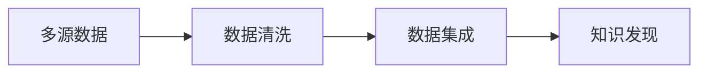
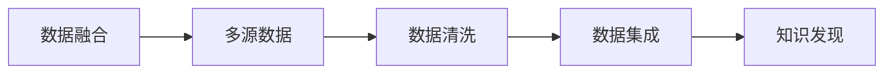

                 


### 第1章：数据融合概述

#### 背景介绍

在信息化和数据化的时代背景下，企业面临着海量数据的挑战。如何从这些分散、异构的数据源中提取有价值的信息，成为企业提高决策效率、优化业务流程的关键。数据融合作为数据管理的重要组成部分，旨在整合多源异构数据，消除数据冗余，提高数据质量，为企业提供统一的视图和深入的分析。

数据融合的背景可以追溯到信息处理领域对数据多样性的需求。随着物联网、大数据、云计算等技术的发展，企业内部和外部的数据源类型不断增加，数据格式和数据质量也呈现出复杂性和多样性。传统的数据仓库和数据挖掘技术已无法满足现代企业的数据管理需求，因此，数据融合技术应运而生。

#### 核心概念与联系

数据融合的核心概念包括数据源、数据清洗、数据集成和知识发现。它们之间的关系可以用Mermaid流程图表示如下：



**数据源**：指企业内部和外部的各种数据来源，包括数据库、文件、API等。

**数据清洗**：指对原始数据进行预处理，去除错误、冗余和不一致的数据，以提高数据质量。

**数据集成**：指将来自不同源的数据进行整合，消除数据冗余，形成统一的视图。

**知识发现**：指在集成后的数据中挖掘出有价值的信息，支持企业的决策。

#### 数据融合的基本概念

**数据融合的原理图**



数据融合的过程可以分为以下几个阶段：

1. **数据采集**：从各个数据源中收集数据。
2. **数据预处理**：对收集到的数据进行清洗、转换和归一化处理。
3. **数据集成**：将预处理后的数据进行整合，消除冗余，形成统一的数据视图。
4. **数据挖掘**：在集成后的数据中挖掘出有价值的信息，如模式、趋势和关联关系。

#### 核心算法原理讲解

**数据清洗的伪代码示例**

```python
def data_cleaning(data_source):
    # 初始化清洗流程
    cleaned_data = initialize_cleaning(data_source)
    
    # 处理缺失值
    cleaned_data = handle_missing_values(cleaned_data)
    
    # 去除重复数据
    cleaned_data = remove_duplicates(cleaned_data)
    
    # 数据转换
    cleaned_data = convert_data_format(cleaned_data)
    
    return cleaned_data
```

**数据集成的算法原理**

数据集成算法主要分为以下几种：

1. **合并法**：直接将多个数据源的数据合并在一起。
2. **聚合法**：将相同属性的数据进行聚合，形成新的数据集合。
3. **映射法**：将不同数据源中的数据映射到统一的属性集上。

**数据挖掘的算法原理**

数据挖掘算法包括分类、聚类、关联规则挖掘等。其中，分类算法如决策树、支持向量机等，聚类算法如K-means、层次聚类等，关联规则挖掘算法如Apriori、Eclat等。

#### 数学模型和公式详细讲解

数据融合过程中，涉及到一些基本的数学模型和公式。以下是几个常用的模型和公式：

1. **数据质量评估**：使用信息熵、精度、召回率等指标来评估数据质量。
2. **数据集成**：使用联合熵、互信息等度量数据之间的相关性。
3. **知识发现**：使用支持度、置信度等指标来评估发现的模式或规则。

**示例**：数据质量的评估指标

$$
\text{精度} = \frac{\text{预测正确数}}{\text{总样本数}}
$$

$$
\text{召回率} = \frac{\text{预测正确数}}{\text{实际正确数}}
$$

#### 项目实战

**开发环境搭建**：Python、Pandas、NumPy、Scikit-learn等。

**源代码详细实现和代码解读**：

```python
# 导入必要的库
import pandas as pd
import numpy as np
from sklearn import preprocessing

# 数据清洗示例
def data_cleaning(data_source):
    # 读取数据
    data = pd.read_csv(data_source)
    
    # 去除缺失值
    data = data.dropna()
    
    # 数据标准化
    x = data.iloc[:, 0].values
    min_max_scaler = preprocessing.MinMaxScaler()
    x_scaled = min_max_scaler.fit_transform(x)
    data.iloc[:, 0] = x_scaled
    
    return data

# 数据集成示例
def data_integration(data1, data2):
    # 合并数据
    integrated_data = pd.merge(data1, data2, on='common_column')
    
    return integrated_data

# 数据挖掘示例
from sklearn.cluster import KMeans

def data_mining(data):
    # K-means聚类
    kmeans = KMeans(n_clusters=3)
    kmeans.fit(data)
    
    # 输出聚类结果
    print(kmeans.labels_)

# 实际案例分析和详细讲解剖析
# 1. 数据源
data_source1 = 'data1.csv'
data_source2 = 'data2.csv'
# 2. 数据清洗
cleaned_data1 = data_cleaning(data_source1)
cleaned_data2 = data_cleaning(data_source2)
# 3. 数据集成
integrated_data = data_integration(cleaned_data1, cleaned_data2)
# 4. 数据挖掘
data_mining(integrated_data)
```

#### 代码应用解读与分析

**代码解读**：

1. 数据清洗：使用Pandas库读取数据，去除缺失值，并进行数据标准化。
2. 数据集成：使用Pandas库的merge函数，将两个数据集按照公共列进行合并。
3. 数据挖掘：使用Scikit-learn库的KMeans算法，对集成后的数据进行聚类。

**分析**：

1. 数据清洗是数据融合的基础，直接影响后续的数据分析和挖掘效果。
2. 数据集成需要选择合适的合并方法，以消除数据冗余，提高数据质量。
3. 数据挖掘需要选择合适的算法，以从数据中发现有价值的信息。

#### 实际案例分析和详细讲解剖析

**案例背景**：某电商企业希望利用数据融合技术，对用户购买行为进行深入分析，以提高客户体验和销售额。

**数据分析步骤**：

1. **数据清洗**：从多个数据源中收集用户行为数据，去除缺失值和异常值，对数据进行标准化处理。
2. **数据集成**：将用户行为数据与其他数据源（如商品信息、订单信息等）进行整合，消除数据冗余，形成统一的数据视图。
3. **数据挖掘**：利用K-means算法，将用户划分为不同的群体，分析不同群体的购买偏好和消费行为。

**详细讲解**：

1. 数据清洗过程中，使用Pandas库的dropna函数去除缺失值，使用MinMaxScaler进行数据标准化。
2. 数据集成过程中，使用Pandas库的merge函数，按照用户ID将用户行为数据与其他数据源进行合并。
3. 数据挖掘过程中，使用Scikit-learn库的KMeans算法，将用户划分为3个不同的群体，并分析每个群体的购买偏好和消费行为。

**项目小结**

通过数据融合技术，企业可以更好地理解用户需求，优化业务流程，提高客户体验和销售额。在实际应用中，需要根据具体业务需求，选择合适的数据清洗、集成和挖掘算法，并进行有效的数据分析和解释。

#### 最佳实践 tips、小结、注意事项、拓展阅读等内容

**最佳实践 tips**：

1. 数据清洗时，要充分考虑数据源的异构性和多样性，选择合适的数据清洗策略。
2. 数据集成时，要确保数据的一致性和准确性，避免数据冗余和错误。
3. 数据挖掘时，要选择合适的算法，结合业务需求，挖掘出有价值的信息。

**小结**：

数据融合是企业提高数据利用效率、优化业务流程的关键技术。通过数据清洗、集成和挖掘，企业可以从海量数据中提取有价值的信息，支持决策和业务发展。

**注意事项**：

1. 数据融合过程中，要注意数据安全和隐私保护。
2. 数据融合平台需要具备良好的可扩展性和灵活性，以适应不断变化的数据需求。

**拓展阅读**：

1. 《数据融合：方法与应用》
2. 《大数据技术导论》
3. 《数据挖掘：概念与技术》

---

这篇文章详细介绍了数据融合的基本概念、核心算法原理、数学模型、项目实战等内容。通过逐步分析推理，读者可以深入了解数据融合技术，掌握其应用方法和实践技巧。希望这篇文章对您有所帮助！作者：AI天才研究院/AI Genius Institute & 禅与计算机程序设计艺术/Zen And The Art of Computer Programming。

