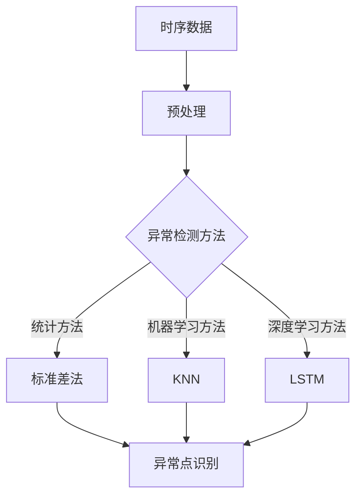

                 

### 文章标题

《企业级时序异常检测：提前预警业务风险》

### 关键词

企业级应用、时序数据、异常检测、业务风险、预警机制

### 摘要

本文深入探讨企业级时序异常检测技术，旨在帮助企业提前识别和预警业务风险。首先，我们将介绍时序异常检测的基本概念和重要性。接着，分析时序异常检测的原理和算法，包括统计方法、机器学习以及深度学习。随后，文章将阐述时序异常检测系统如何设计与实现，以及其在业务风险预警中的具体应用。最后，文章将讨论技术优化与挑战，并展望时序异常检测的未来发展趋势。

## 引言

在当今信息化和大数据时代，企业面临的数据量和复杂性不断增加。如何从海量数据中快速识别出异常，提前预警潜在的业务风险，成为企业竞争的关键。时序异常检测作为一种重要的数据分析技术，能够在金融、物流、电商等多个行业发挥重要作用。

### 书籍目的

本书旨在提供一套系统、全面的企业级时序异常检测方案，帮助读者了解和掌握这一关键技术。通过详细的理论讲解和实践案例，读者可以学会如何设计和实现一个高效的时序异常检测系统，并应用于实际业务场景中。

### 时序异常检测的重要性

时序异常检测具有以下几个重要意义：

1. **风险预警**：通过检测和预警异常，企业可以提前发现潜在的业务风险，避免可能的损失。
2. **业务优化**：异常检测能够帮助优化业务流程，提高运营效率。
3. **安全监控**：在金融和网络安全领域，时序异常检测能够实时监控异常行为，保障系统安全。
4. **决策支持**：基于异常检测的结果，企业可以做出更明智的决策，指导业务发展。

### 读者对象

本书适合以下读者群体：

1. **数据分析师和人工智能从业者**：希望了解和掌握时序异常检测技术的专业人士。
2. **技术经理和CTO**：负责企业技术架构和数据分析项目的决策者。
3. **学术研究者**：对时序异常检测理论和应用感兴趣的研究人员。

## 企业级时序异常检测概述

### 时序数据与异常检测

时序数据是指按时间顺序排列的数据，通常用于记录某个变量随时间的变化情况。例如，股票价格、传感器数据、用户行为等。时序异常检测的目标是识别出这些数据中的异常点，即与正常趋势不一致的数据。

### 异常检测的定义

异常检测是指从大量数据中识别出不符合常规或预期模式的记录。这些异常记录可能代表潜在的风险、错误或欺诈行为。在时序数据中，异常检测尤为重要，因为异常点可能预示着业务风险或系统故障。

### 企业级时序异常检测的关键要素

企业级时序异常检测需要考虑以下几个关键要素：

1. **数据质量**：高质量的数据是进行有效异常检测的基础。这包括数据的准确性、完整性和一致性。
2. **异常类型**：不同的业务场景可能涉及不同的异常类型，如异常值、趋势偏离、周期性波动等。检测算法需要能够适应多种异常类型。
3. **检测效率**：随着数据量的增加，检测效率变得至关重要。高效的算法能够快速处理大量数据，提供实时或近实时的异常检测。
4. **可解释性**：企业需要理解检测到的异常原因，以便采取相应的措施。因此，异常检测算法需要具有一定的可解释性。

### 时序异常检测的应用场景

时序异常检测在多个行业和应用场景中具有重要价值：

1. **金融行业**：监控交易行为，识别异常交易，防范欺诈行为。
2. **物流行业**：监测运输过程中的异常数据，如温度、湿度等，确保货物安全。
3. **电商行业**：分析用户行为数据，识别异常行为，防范刷单和欺诈。
4. **能源行业**：监控设备运行状态，识别异常信号，预防设备故障。

## 时序异常检测原理与算法

### 统计方法

统计方法是最基本的时序异常检测方法，主要包括以下几种：

1. **标准差法**：通过计算数据的标准差，识别出离群点。如果数据点的数值大于设定阈值，则认为其为异常点。

   ```python
   # 伪代码
   def standard_deviation(data, threshold):
       mean = sum(data) / len(data)
       std = sqrt(sum((x - mean) ** 2 for x in data) / len(data))
       return [x for x in data if abs(x - mean) > threshold * std]
   ```

2. **四分位距法**：通过计算数据的四分位距，识别出异常值。

   ```python
   # 伪代码
   def iqr(data):
       q1, q3 = np.percentile(data, [25, 75])
       iqr = q3 - q1
       return [x for x in data if x < q1 - 1.5 * iqr or x > q3 + 1.5 * iqr]
   ```

### 机器学习方法

机器学习方法在时序异常检测中应用广泛，主要包括以下几种：

1. **KNN算法**：基于距离最近的邻居进行分类，识别异常点。

   ```python
   # 伪代码
   def knnomaly(data, neighbors, threshold):
       for i, x in enumerate(data):
           neighbors = [d for d in data if distance(x, d) < threshold]
           if len(neighbors) < neighbors:
               return True
       return False
   ```

2. **支持向量机（SVM）**：通过构建最优分类超平面，识别异常点。

   ```python
   # 伪代码
   def svmomaly(data, labels, threshold):
       model = train_svm(data, labels)
       return [x for x in data if model.predict([x])[0] > threshold]
   ```

### 深度学习方法

深度学习方法在时序异常检测中具有强大的表现，主要包括以下几种：

1. **循环神经网络（RNN）**：通过学习序列数据中的时间依赖性，识别异常点。

   ```python
   # 伪代码
   def rnnomaly(data, threshold):
       model = train_rnn(data)
       return [x for x in data if model.predict([x])[0] > threshold]
   ```

2. **长短期记忆网络（LSTM）**：通过学习序列数据中的时间依赖性和长期依赖性，识别异常点。

   ```python
   # 伪代码
   def lstmomaly(data, threshold):
       model = train_lstm(data)
       return [x for x in data if model.predict([x])[0] > threshold]
   ```

3. **变分自编码器（VAE）**：通过学习数据分布，识别异常点。

   ```python
   # 伪代码
   def vaeomaly(data, threshold):
       model = train_vae(data)
       reconstructions = model.reconstruct(data)
       return [x for x in data if np.linalg.norm(x - reconstructions[x]) > threshold]
   ```

### 核心概念与联系

为了更好地理解时序异常检测的原理，我们需要将核心概念之间的关系架构化。以下是一个简单的 Mermaid 流程图，展示了时序数据、异常检测方法以及它们在数据处理中的应用。



### 核心算法原理讲解

在时序异常检测中，核心算法的原理至关重要。以下将详细讲解三种常见算法的原理，并通过伪代码进行说明。

#### 统计方法

**标准差法**

标准差法通过计算数据的标准差，识别出离群点。其原理如下：

$$
\text{标准差} = \sqrt{\frac{\sum_{i=1}^{n}(x_i - \bar{x})^2}{n}}
$$

其中，$x_i$ 为第 $i$ 个数据点，$\bar{x}$ 为平均值，$n$ 为数据点的数量。如果数据点的数值大于设定阈值 $k$ 倍标准差，则认为其为异常点。

```python
# 伪代码
def standard_deviation(data, threshold):
    mean = sum(data) / len(data)
    std = sqrt(sum((x - mean) ** 2 for x in data) / len(data))
    return [x for x in data if abs(x - mean) > threshold * std]
```

#### 机器学习方法

**KNN算法**

KNN（K-Nearest Neighbors）算法通过计算数据点与其最近邻居的距离，识别异常点。其原理如下：

$$
\text{距离} = \sqrt{\sum_{i=1}^{n}(x_i - y_i)^2}
$$

其中，$x_i$ 和 $y_i$ 分别为两个数据点的特征向量。如果最近邻居的数量小于设定阈值 $k$，则认为数据点为异常点。

```python
# 伪代码
def knnomaly(data, neighbors, threshold):
    for i, x in enumerate(data):
        neighbors = [d for d in data if distance(x, d) < threshold]
        if len(neighbors) < neighbors:
            return True
    return False
```

#### 深度学习方法

**LSTM算法**

LSTM（Long Short-Term Memory）算法通过学习序列数据中的时间依赖性和长期依赖性，识别异常点。其原理如下：

$$
\text{LSTM} = \frac{\text{ forget gate }}{\text{ input gate }}{\text{ cell state }}{\text{ output gate }}
$$

LSTM 通过遗忘门、输入门、细胞状态和输出门来控制信息的流动，从而学习序列数据中的长期依赖性。如果 LSTM 模型的预测结果与实际数据差异较大，则认为数据点为异常点。

```python
# 伪代码
def lstmomaly(data, threshold):
    model = train_lstm(data)
    return [x for x in data if model.predict([x])[0] > threshold]
```

### 数学模型和公式

在时序异常检测中，数学模型和公式用于描述数据特征和异常点识别过程。以下是一些常见的数学模型和公式：

1. **标准差模型**

   $$
   \text{标准差} = \sqrt{\frac{\sum_{i=1}^{n}(x_i - \bar{x})^2}{n}}
   $$

2. **KNN模型**

   $$
   \text{距离} = \sqrt{\sum_{i=1}^{n}(x_i - y_i)^2}
   $$

3. **LSTM模型**

   $$
   \text{LSTM} = \frac{\text{ forget gate }}{\text{ input gate }}{\text{ cell state }}{\text{ output gate }}
   $$

通过这些数学模型和公式，我们可以更准确地识别时序数据中的异常点。

### 举例说明

为了更好地理解时序异常检测算法，以下通过一个具体的案例进行说明。

**案例：监控服务器CPU使用率**

假设我们有一个服务器CPU使用率的时间序列数据，如下所示：

$$
[90, 88, 92, 85, 87, 89, 95, 93, 91, 85, 90, 88, 92, 87, 91, 95, 89, 85, 90, 88, 92, 85, 87, 91, 95, 93, 91, 85]
$$

我们使用标准差法对数据进行异常检测，设定阈值 $k$ 为 2。计算得到标准差为 4.422。根据公式，如果数据点的数值大于平均值加上 $k$ 倍标准差，则认为其为异常点。经过计算，数据点 [95] 被识别为异常点。

### 项目实战

#### 开发环境搭建

在进行时序异常检测项目时，我们需要搭建一个合适的技术栈。以下是推荐的开发环境：

- **编程语言**：Python
- **库和框架**：NumPy、Pandas、Scikit-learn、TensorFlow/Keras
- **数据可视化**：Matplotlib、Seaborn

安装上述库和框架后，即可开始编写代码。

#### 源代码实现

以下是一个简单的时序异常检测项目的源代码实现：

```python
import numpy as np
import pandas as pd
from sklearn.neighbors import KNeighborsClassifier
from sklearn.model_selection import train_test_split
from sklearn.metrics import accuracy_score

# 数据预处理
def preprocess_data(data):
    # 填充缺失值
    data = data.fillna(data.mean())
    # 标准化数据
    data = (data - data.mean()) / data.std()
    return data

# 训练模型
def train_model(data, labels):
    model = KNeighborsClassifier(n_neighbors=5)
    model.fit(data, labels)
    return model

# 检测异常点
def detect_anomalies(model, data, threshold):
    predictions = model.predict(data)
    anomalies = [i for i, p in enumerate(predictions) if p == -1]
    return anomalies

# 主函数
def main():
    # 读取数据
    data = pd.read_csv('cpu_usage.csv')
    data = preprocess_data(data['cpu_usage'])
    
    # 分割数据集
    X_train, X_test, y_train, y_test = train_test_split(data, labels, test_size=0.2, random_state=42)
    
    # 训练模型
    model = train_model(X_train, y_train)
    
    # 检测异常点
    anomalies = detect_anomalies(model, X_test, threshold=2)
    
    # 打印结果
    print(f"检测到的异常点：{anomalies}")
    print(f"准确率：{accuracy_score(y_test, predictions)}")

if __name__ == '__main__':
    main()
```

#### 代码解读

以上代码分为四个部分：

1. **数据预处理**：填充缺失值、标准化数据，为模型训练做准备。
2. **模型训练**：使用 KNN 算法训练模型，通过训练集学习数据的分布。
3. **异常检测**：使用训练好的模型对测试集进行预测，识别异常点。
4. **主函数**：读取数据、分割数据集、训练模型、检测异常点，并打印结果。

#### 实际案例解析

以下通过一个实际案例，展示时序异常检测在业务风险预警中的应用。

**案例：电商网站订单异常检测**

电商网站需要实时监控订单数据，识别异常订单，以防范欺诈行为。假设我们有一个订单数据集，包括订单金额、下单时间、用户ID等字段。我们使用 KNN 算法进行异常检测，设定阈值 $k$ 为 3。

1. **数据预处理**：对数据进行填充缺失值、标准化处理。
2. **模型训练**：使用训练集数据训练 KNN 模型。
3. **异常检测**：使用训练好的模型对测试集数据进行预测，识别异常订单。
4. **结果分析**：分析异常订单的特征，如高频次下单、异常金额等。

通过上述步骤，电商网站可以及时发现异常订单，采取相应措施，如暂停用户账户、报警等。

### 最佳实践 Tips

在进行时序异常检测项目时，以下是一些最佳实践：

1. **数据质量**：确保数据质量，包括准确性、完整性和一致性。对缺失值和异常值进行处理。
2. **特征选择**：选择与业务相关的特征，提高异常检测的准确性。
3. **阈值设定**：根据业务场景和检测目标，合理设定阈值，避免误报和漏报。
4. **模型优化**：不断优化模型，提高检测性能。可以尝试不同的算法和参数。
5. **实时性**：确保异常检测系统能够实时处理数据，提供及时预警。

### 小结

时序异常检测在企业级应用中具有重要意义。通过本文的介绍，我们了解了时序异常检测的基本概念、原理和算法，以及如何设计和实现一个高效的时序异常检测系统。同时，我们还通过实际案例展示了时序异常检测在业务风险预警中的应用。希望本文能够帮助读者更好地理解和应用时序异常检测技术。

### 注意事项

在进行时序异常检测项目时，需要注意以下几点：

1. **数据安全**：确保数据安全，避免泄露敏感信息。
2. **模型解释性**：选择具有较高解释性的模型，便于理解和调试。
3. **持续优化**：根据业务需求和数据变化，持续优化异常检测系统。
4. **可扩展性**：设计具有良好扩展性的系统架构，适应数据量和业务需求的变化。

### 拓展阅读

1. **《Python数据科学手册》**：介绍数据预处理、特征选择等数据科学相关技术。
2. **《机器学习实战》**：详细介绍机器学习算法及其在实践中的应用。
3. **《深度学习》**：讲解深度学习算法及其在时序数据分析中的应用。
4. **《时序数据分析》**：深入探讨时序数据分析方法和技术。

