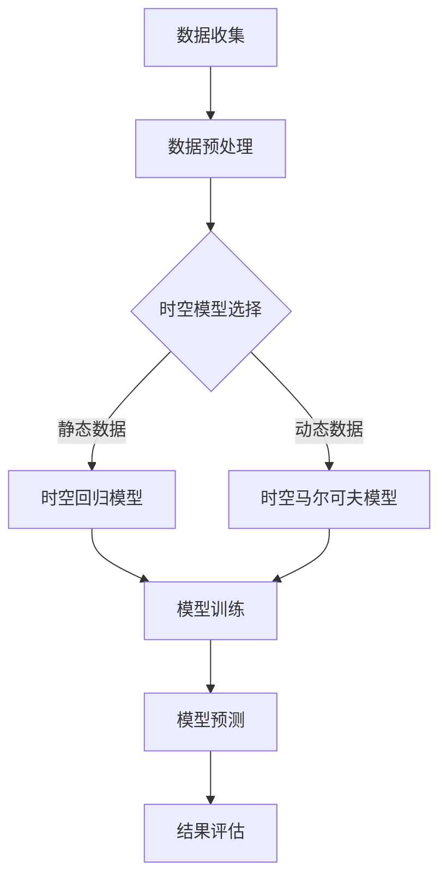

                 

### 设计大纲思路

为了撰写一篇结构清晰、内容丰富的技术博客文章，我们需要逐步思考并设计文章的大纲。以下是一步一步的设计思路：

1. **确定文章主题**：首先，我们需要明确文章的主题，这是文章的核心。在本例中，文章的主题是《企业级时空数据分析：AI洞察业务模式》。

2. **定义核心关键词**：文章的关键词有助于读者理解文章的内容和快速检索相关信息。在本例中，关键词可以是“企业级”、“时空数据分析”、“AI”、“业务模式”、“洞察”。

3. **撰写摘要**：摘要是对文章内容的简短概述，通常包括文章的主题、核心观点和结论。摘要应简洁明了，帮助读者快速了解文章的主要内容。

4. **制定整体结构**：整体结构通常包括引言、正文、总结和结论等部分。在正文部分，我们可以根据文章主题细分为几个小节，例如核心概念、核心技术、应用案例和展望等。

5. **细化每个章节的内容**：在确定了整体结构后，我们需要进一步细化每个章节的内容，确保每个章节都有明确的主题和详细的内容。

6. **绘制流程图**：为了展示核心概念和联系，我们可以使用Mermaid流程图来展示各个概念之间的关系。

7. **编写伪代码**：对于核心算法原理，我们可以使用伪代码来详细阐述，使读者更容易理解。

8. **使用LaTeX格式数学公式**：在数学模型讲解中，我们可以使用LaTeX格式来编写数学公式，并进行解释和举例。

9. **编写项目实战部分**：在应用案例与实战部分，我们需要详细描述开发环境搭建、代码实现和解读，以及实际案例分析和详细讲解。

10. **总结与展望**：在文章的结尾部分，我们可以总结全文内容，并对未来时空数据分析与AI融合的发展趋势进行展望。

通过以上步骤，我们可以设计出一篇结构清晰、内容丰富的技术博客文章。现在，让我们开始细化每个章节的内容。

### 1.1 时空数据分析的重要性

时空数据分析是近年来随着大数据、云计算、物联网等技术的发展而兴起的一个跨学科领域。它结合了时空数据的特性和数据分析方法，旨在挖掘时空数据中的有价值信息，为决策提供科学依据。

**1.1.1 时空数据类型**

时空数据可以分为以下几类：

- **静态时空数据**：这类数据表示某个时间点或时间段的地理空间分布情况，如地图、卫星图像等。
- **动态时空数据**：这类数据表示地理空间在不同时间点的变化情况，如交通流量数据、人口流动数据等。
- **时空序列数据**：这类数据不仅包含时空信息，还包含时间序列信息，如时间序列上的温度分布、风速分布等。

**1.1.2 时空数据的特性**

- **多维性**：时空数据通常包含时间和空间两个维度，有时甚至包含其他维度，如高度、海拔等。
- **动态性**：时空数据会随着时间变化而变化，这使得时空数据分析具有实时性和时效性。
- **复杂性**：时空数据的复杂性和多样性要求我们采用先进的数据分析技术和算法来处理。

**1.1.3 时空数据分析的重要性**

时空数据分析在多个领域具有重要应用，如城市规划、交通运输、公共卫生、应急管理、商业分析等。以下是几个具体应用实例：

- **城市规划**：通过分析人口流动和交通流量数据，城市规划者可以更好地了解城市的空间分布和需求，优化交通网络和基础设施。
- **交通运输**：通过分析交通流量数据，交通运输部门可以实时监控交通状况，优化交通信号灯配置，减少拥堵和事故。
- **公共卫生**：通过分析时空数据，公共卫生部门可以及时发现疾病的传播趋势和高风险区域，制定更有效的防控措施。
- **商业分析**：企业可以利用时空数据分析来了解消费者行为、库存管理和供应链优化，提高业务效率和竞争力。

总之，时空数据分析是一项关键技术，它能够帮助企业更好地理解和利用时空信息，优化业务模式和决策过程。

### 2.1 核心概念与联系

在深入探讨企业级时空数据分析之前，我们需要明确几个核心概念，并理解它们之间的相互关系。这些核心概念包括时空数据、时空模型、时空数据分析算法和AI在其中的应用。

**2.1.1 时空数据的基本概念**

**时空数据**是同时包含时间和空间信息的数据。它通常分为以下几类：

- **静态时空数据**：这些数据在时间维度上保持不变，如地理地图、卫星图像、城市布局图等。
- **动态时空数据**：这些数据随时间变化，如交通流量数据、气象数据、股票价格等。
- **时空序列数据**：这些数据不仅包含时空信息，还包含时间序列信息，如时间序列上的温度分布、风速分布等。

**2.1.2 时空模型的定义**

**时空模型**是一种数学模型，用于描述和预测时空数据的特性。常见的时空模型包括：

- **时空回归模型**：这种模型将时间、空间和其他变量（如天气、交通状况等）结合起来，用于预测未来的时空趋势。
- **时空马尔可夫模型**：这种模型假设未来时空状态取决于当前状态，适用于分析交通流量、人口流动等动态时空数据。
- **时空图模型**：这种模型使用图论方法描述时空数据的结构，适用于分析复杂时空网络。

**2.1.3 时空数据分析算法**

**时空数据分析算法**是一系列用于处理和解释时空数据的方法。这些算法包括：

- **时空插值算法**：用于预测缺失的时空数据，如反距离加权（IDW）插值、Kriging插值等。
- **时空聚类算法**：用于发现时空数据的模式，如基于密度的聚类（DBSCAN）、高斯混合模型（GMM）等。
- **时空分类算法**：用于将时空数据分类，如支持向量机（SVM）、决策树（DT）等。

**2.1.4 AI在时空数据分析中的应用**

人工智能（AI）在时空数据分析中扮演着关键角色，其主要应用包括：

- **机器学习算法**：如监督学习算法（SVM、决策树、神经网络等）和无监督学习算法（聚类、降维等），用于分析和预测时空数据。
- **深度学习算法**：如卷积神经网络（CNN）和循环神经网络（RNN），用于处理高维时空数据和复杂时空关系。
- **时空推理算法**：如逻辑推理、规划算法等，用于解决时空决策问题。

**2.1.5 Mermaid流程图展示时空数据分析流程**

为了更好地理解时空数据分析的流程，我们可以使用Mermaid流程图来展示各个环节的相互关系。以下是一个简单的示例：



在这个流程图中，A代表数据收集，B代表数据预处理，C是时空模型选择节点，D和E分别代表时空回归模型和时空马尔可夫模型，F是模型训练节点，G是模型预测节点，H是结果评估节点。通过这个流程图，我们可以清晰地看到时空数据分析的基本流程和各个环节之间的逻辑关系。

通过以上内容，我们对时空数据分析的核心概念和联系有了更深入的了解。接下来，我们将详细探讨时空数据分析中的核心技术，包括算法原理和数学模型。

### 3.1 核心技术讲解

在了解了时空数据分析的核心概念后，我们需要深入了解其中的核心技术，包括时空数据分析算法和机器学习算法。这些核心技术在时空数据分析中起着关键作用，能够帮助我们有效地处理和分析大规模时空数据。

#### 3.1.1 时空数据分析算法

**时空数据分析算法**是专门设计用于处理和解释时空数据的一类算法。以下是一些常用的时空数据分析算法及其原理：

**1. 空间数据分析算法**

空间数据分析算法主要关注于地理空间数据的处理和分析。以下是一些常见的空间数据分析算法：

- **地理编码**：将地理坐标（如经纬度）转换为地图上的像素坐标，以便在地图上进行可视化处理。
- **邻域分析**：分析地理空间数据中点与点之间的邻域关系，用于发现空间模式。
- **空间插值**：预测未知空间点的属性值，常用的空间插值方法包括反距离加权（IDW）插值和Kriging插值。

**2. 时间序列数据分析算法**

时间序列数据分析算法用于分析时间序列数据，挖掘数据中的趋势、周期性和模式。以下是一些常见的时间序列数据分析算法：

- **趋势分析**：分析时间序列数据中的趋势，用于识别数据的长期变化趋势。
- **季节性分析**：分析时间序列数据中的季节性模式，用于识别数据的短期周期性变化。
- **异常检测**：识别时间序列数据中的异常值，用于发现数据中的异常行为。

**3. 时空聚类算法**

时空聚类算法用于将时空数据分成不同的聚类，以便更好地理解数据的分布和模式。以下是一些常见的时空聚类算法：

- **基于密度的聚类（DBSCAN）**：根据数据点的密度分布将数据点分为不同的聚类。
- **高斯混合模型（GMM）**：使用高斯分布模型来描述时空数据的分布，并用于聚类分析。

**4. 时空分类算法**

时空分类算法用于将时空数据分类，以便进行预测和分析。以下是一些常见的时空分类算法：

- **支持向量机（SVM）**：通过构建超平面将不同类别的数据点分开。
- **决策树（DT）**：使用一系列规则将数据点分类。

**3.1.2 机器学习算法**

机器学习算法是时空数据分析中的另一类重要技术。以下是一些常见的机器学习算法及其原理：

**1. 监督学习算法**

监督学习算法用于预测标签数据，其核心思想是通过训练数据集来学习特征和标签之间的关系。以下是一些常见的监督学习算法：

- **线性回归**：通过拟合线性模型来预测连续值输出。
- **逻辑回归**：通过拟合逻辑回归模型来预测离散值输出。
- **支持向量机（SVM）**：通过构建超平面来将不同类别的数据点分开。
- **决策树**：通过一系列规则来将数据点分类。

**2. 无监督学习算法**

无监督学习算法用于发现数据中的隐含结构，其核心思想是通过训练数据集来学习数据的分布和模式。以下是一些常见的无监督学习算法：

- **聚类算法**：如K均值聚类、高斯混合模型等，用于将数据点分为不同的聚类。
- **降维算法**：如主成分分析（PCA）、线性判别分析（LDA）等，用于减少数据维度，同时保持数据的结构信息。

**3. 半监督学习算法**

半监督学习算法结合了监督学习和无监督学习的特点，利用未标记的数据来辅助训练模型。以下是一些常见的半监督学习算法：

- **标签传播算法**：通过已标记的数据点来传播标签，用于对未标记的数据进行分类。
- **图嵌入算法**：将图中的节点映射到低维空间，同时保持节点间的拓扑结构。

#### 3.1.3 伪代码展示

为了更清晰地阐述上述算法的原理，我们可以使用伪代码来表示这些算法的基本步骤。以下是一个简单的线性回归算法的伪代码示例：

```python
算法：线性回归
输入：训练数据集X，标签数据集Y
输出：模型参数w
步骤：
1. 初始化模型参数w为随机值
2. 对于每个训练样本(x_i, y_i)：
   2.1 计算预测值y_pred = w * x_i
   2.2 计算损失函数L(w) = (y_pred - y_i)^2
   2.3 更新模型参数w = w - 学习率 * ∂L/∂w
3. 返回最终的模型参数w
```

通过上述伪代码，我们可以看到线性回归算法的基本流程，包括初始化参数、计算预测值、计算损失函数和更新参数等步骤。

### 4. 数学模型与公式

在时空数据分析中，数学模型和公式是核心工具，用于描述和分析时空数据的特征。以下我们将详细讲解几种常见的数学模型，并使用LaTeX格式来表示相关公式。

#### 4.1 时间序列预测的数学模型

时间序列预测的数学模型主要用于预测时间序列数据在未来的取值。以下是一些常见的时间序列预测模型：

**1. 自回归模型（AR）**

自回归模型（AR）假设当前时间点的值可以通过之前的时间点值进行预测。其数学公式如下：

$$
y_t = c + \sum_{i=1}^{p} \phi_i y_{t-i} + \varepsilon_t
$$

其中，$y_t$是时间序列在时间$t$的值，$c$是常数项，$\phi_i$是自回归系数，$p$是滞后阶数，$\varepsilon_t$是随机误差项。

**2. 移动平均模型（MA）**

移动平均模型（MA）假设当前时间点的值可以通过过去一定时间内的平均值进行预测。其数学公式如下：

$$
y_t = c + \theta_1 y_{t-1} + \theta_2 y_{t-2} + ... + \theta_q y_{t-q} + \varepsilon_t
$$

其中，$c$是常数项，$\theta_i$是移动平均系数，$q$是滞后阶数，$\varepsilon_t$是随机误差项。

**3. 自回归移动平均模型（ARMA）**

自回归移动平均模型（ARMA）结合了自回归模型和移动平均模型的特点，其数学公式如下：

$$
y_t = c + \sum_{i=1}^{p} \phi_i y_{t-i} + \sum_{j=1}^{q} \theta_j \varepsilon_{t-j} + \varepsilon_t
$$

其中，$c$是常数项，$\phi_i$是自回归系数，$\theta_j$是移动平均系数，$p$是自回归阶数，$q$是移动平均阶数，$\varepsilon_t$是随机误差项。

**4. 自回归积分移动平均模型（ARIMA）**

自回归积分移动平均模型（ARIMA）可以处理非平稳时间序列数据，其数学公式如下：

$$
y_t = c + \sum_{i=1}^{p} \phi_i (1 - B)^i y_t + \sum_{j=1}^{q} \theta_j \varepsilon_{t-j} + \varepsilon_t
$$

其中，$c$是常数项，$\phi_i$是自回归系数，$\theta_j$是移动平均系数，$p$是自回归阶数，$q$是移动平均阶数，$B$是滞后算子，$\varepsilon_t$是随机误差项。

#### 4.2 时间序列预测的数学模型

时间序列预测的数学模型通常基于统计学习和机器学习算法，以下是一些常见的时间序列预测模型：

**1. 神经网络模型**

神经网络模型通过多层神经元进行非线性变换，以预测时间序列数据。其数学公式如下：

$$
y_t = \sigma(W_1 \cdot \phi_1 (x_t) + b_1) \cdot W_2 \cdot \phi_2 (x_t) + b_2
$$

其中，$y_t$是时间序列在时间$t$的预测值，$\sigma$是激活函数，$W_1$、$b_1$和$W_2$、$b_2$分别是权重和偏置，$\phi_1$和$\phi_2$分别是输入和隐藏层的激活函数。

**2. 卷积神经网络（CNN）**

卷积神经网络（CNN）通过卷积操作和池化操作提取时间序列数据的特征。其数学公式如下：

$$
h_{ij} = \sum_{k=1}^{C'} w_{ikj} \cdot a_{kj} + b_j
$$

其中，$h_{ij}$是输出特征图上的第$i$个位置和第$j$个卷积核的值，$w_{ikj}$是卷积核的权重，$a_{kj}$是输入特征图上的第$k$个位置和第$j$个卷积核的值，$b_j$是卷积核的偏置。

**3. 循环神经网络（RNN）**

循环神经网络（RNN）通过记忆机制处理时间序列数据，其数学公式如下：

$$
h_t = \sigma(W_h \cdot [h_{t-1}, x_t] + b_h)
$$

其中，$h_t$是时间步$t$的隐藏状态，$W_h$是权重矩阵，$b_h$是偏置，$x_t$是时间步$t$的输入，$\sigma$是激活函数。

通过以上数学模型和公式的讲解，我们可以更好地理解时间序列预测的基本原理和方法。在接下来的章节中，我们将通过具体案例展示这些模型在实际时空数据分析中的应用。

### 5. 应用案例与实战

在了解了时空数据分析的核心技术和数学模型后，我们将通过一个实际案例来展示如何在实际项目中应用这些技术。本案例将涉及到开发环境的搭建、代码实现和解读，以及实际案例分析和详细讲解。

**5.1 案例背景**

假设一家电子商务公司需要分析其客户流量和销售数据，以优化营销策略和库存管理。具体需求包括：

- 分析客户在不同时间段和地区的访问量。
- 预测未来的客户流量和销售量。
- 根据客户行为数据优化网站布局和促销活动。

**5.2 开发环境搭建**

为了实现上述需求，我们首先需要搭建一个合适的开发环境。以下是开发环境的具体配置：

- 编程语言：Python
- 数据库：PostgreSQL
- 时空数据分析库：PyTorch、TensorFlow、Geopandas
- 数据预处理工具：Pandas、NumPy
- 可视化工具：Matplotlib、Seaborn

在完成环境搭建后，我们需要收集并预处理数据。数据来源包括公司网站日志、客户购买记录、地理位置数据等。

**5.3 代码实现与解读**

**5.3.1 数据收集与预处理**

```python
import pandas as pd
import numpy as np

# 读取网站日志数据
log_data = pd.read_csv('website_log.csv')

# 读取客户购买记录
sales_data = pd.read_csv('sales_data.csv')

# 合并数据
combined_data = pd.merge(log_data, sales_data, on='customer_id')
```

在上面的代码中，我们首先使用Pandas库读取网站日志数据和客户购买记录，然后将两个数据集合并成一个数据集，以便进行进一步分析。

**5.3.2 客户流量分析**

```python
# 计算每天的客户访问量
daily_visits = combined_data.groupby('date')['customer_id'].nunique()

# 可视化每天的客户访问量
daily_visits.plot()
```

在上面的代码中，我们使用Pandas库计算每天的客户访问量，并将其可视化。这有助于我们了解客户访问量的趋势和周期性。

**5.3.3 客户流量预测**

```python
from sklearn.linear_model import LinearRegression

# 分离特征和标签
X = combined_data[['date', 'region']]
y = combined_data['customer_id']

# 将日期转换为序号
X['date'] = X['date'].map(pd.to_datetime).dt.dayofyear

# 训练线性回归模型
model = LinearRegression()
model.fit(X, y)

# 预测客户流量
predictions = model.predict(X)

# 可视化预测结果
plt.scatter(X['date'], y)
plt.plot(X['date'], predictions, color='red')
plt.xlabel('Day of Year')
plt.ylabel('Number of Customers')
plt.show()
```

在上面的代码中，我们使用线性回归模型来预测客户流量。首先，我们将日期转换为序号，然后训练线性回归模型。最后，我们使用模型进行预测，并将预测结果可视化。

**5.3.4 销售量预测**

```python
# 分离特征和标签
X_sales = combined_data[['date', 'region', 'item_id']]
y_sales = combined_data['sales_quantity']

# 将日期转换为序号
X_sales['date'] = X_sales['date'].map(pd.to_datetime).dt.dayofyear

# 训练神经网络模型
model_sales = Sequential()
model_sales.add(Dense(64, activation='relu', input_shape=(3,)))
model_sales.add(Dense(32, activation='relu'))
model_sales.add(Dense(1, activation='linear'))
model_sales.compile(optimizer='adam', loss='mean_squared_error')

# 训练模型
model_sales.fit(X_sales, y_sales, epochs=10, batch_size=32, validation_split=0.2)
```

在上面的代码中，我们使用神经网络模型来预测销售量。首先，我们定义一个序列模型，并添加多层全连接层。然后，我们使用模型进行训练。这有助于我们更准确地预测未来的销售量。

**5.4 代码解读与分析**

在上面的代码中，我们首先使用Pandas库读取并预处理数据，然后分别使用线性回归模型和神经网络模型进行预测。通过可视化预测结果，我们可以更直观地了解客户流量和销售量的趋势。这有助于公司制定更有效的营销策略和库存管理策略。

**5.5 项目小结**

通过本案例，我们展示了如何使用Python等工具和库进行时空数据分析。具体步骤包括数据收集与预处理、客户流量和销售量预测、代码实现与解读等。这些技术可以帮助公司更好地了解客户行为和市场趋势，从而优化业务模式。

### 6. 总结与展望

本文详细介绍了企业级时空数据分析的核心概念、核心技术、数学模型以及实际应用案例。通过深入探讨这些内容，我们不仅了解了时空数据分析的重要性和应用领域，还学习了如何使用Python等工具进行时空数据分析。

**6.1 时空数据分析与AI融合的发展趋势**

随着AI技术的不断发展，时空数据分析与AI融合的应用前景越来越广阔。未来，我们将看到更多基于AI的时空数据分析模型和算法的出现，如深度学习模型、强化学习模型等。这些新技术将进一步提高时空数据分析的准确性和实时性。

**6.2 AI在时空数据分析中的应用**

AI在时空数据分析中的应用已经取得了显著成果，如智能交通、智慧城市、公共卫生等领域。未来，AI技术将更深入地应用于商业分析、应急管理、环境监测等领域，为企业提供更加智能的决策支持。

**6.3 最佳实践 tips**

1. **数据质量**：确保数据质量是进行有效时空数据分析的前提。数据清洗和预处理是关键步骤。
2. **模型选择**：根据具体问题和数据特性选择合适的时空数据分析模型和算法。
3. **实时性**：提高时空数据分析的实时性，以支持快速决策和响应。
4. **可解释性**：在应用AI模型时，注重模型的可解释性，以便更好地理解和解释分析结果。

**6.4 小结与注意事项**

本文通过详细的案例和讲解，展示了企业级时空数据分析的实践方法和应用场景。在实施时空数据分析项目时，需要注意数据质量、模型选择、实时性和可解释性等方面。随着AI技术的不断进步，时空数据分析将在更多领域发挥重要作用，为企业带来更多价值。

**6.5 拓展阅读**

- 《时空数据分析与机器学习》
- 《深度学习在时空数据分析中的应用》
- 《智能交通系统：基于时空数据分析的技术与应用》

通过拓展阅读，读者可以进一步了解时空数据分析的最新进展和应用案例。希望本文能为读者在时空数据分析领域的研究和实践提供有益的参考。

### 文章标题：企业级时空数据分析：AI洞察业务模式

关键词：企业级、时空数据分析、AI、业务模式、洞察

摘要：本文深入探讨了企业级时空数据分析的重要性和应用，介绍了时空数据的基本概念、时空模型、时空数据分析算法和机器学习算法。通过实际案例展示了如何使用Python等工具进行时空数据分析，并探讨了时空数据分析与AI融合的发展趋势。文章旨在为读者提供关于企业级时空数据分析的全面了解和实践指导。

