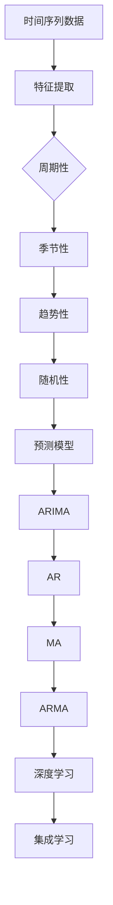

                 

### 文章标题：企业级时间序列分析平台：增强趋势预测能力

#### 关键词：
- 时间序列分析
- 趋势预测
- 企业级平台
- 深度学习
- 集成学习

#### 摘要：
本文将探讨企业级时间序列分析平台的设计与实现，重点讨论如何增强趋势预测能力。首先，我们回顾了时间序列分析的基础，包括特征提取、常见模型以及季节性分析。随后，文章深入探讨了企业级平台的设计架构，包括数据采集、预处理、模型训练和预测可视化等环节。接着，我们探讨了如何通过传统方法改进和基于深度学习的预测模型来增强趋势预测能力。文章通过具体案例展示了平台在实际中的应用，并对平台部署与维护、金融、供应链管理及市场营销领域的趋势预测进行了分析。最后，文章总结了时间序列分析平台的发展趋势，并给出了相关工具、模型代码及案例分析。

### 第一部分：时间序列分析基础

#### 第1章：时间序列分析概述

时间序列分析是一种统计学方法，用于分析和预测时间上按顺序排列的数据点。它广泛应用于金融、经济学、气象学、工程、市场营销等领域。时间序列数据通常具有以下特点：

1. **序列性**：数据点按照时间顺序排列。
2. **周期性**：某些数据可能表现出季节性或周期性模式。
3. **趋势性**：数据可能随着时间表现出增长或减少的趋势。
4. **随机性**：时间序列数据中可能包含随机波动。

时间序列分析的关键是识别和建模这些特征，以便进行有效的预测。

#### 核心概念与联系

为了更好地理解时间序列分析，我们可以绘制一个核心概念关系架构的Mermaid流程图：



#### 第2章：时间序列数据的特征提取

特征提取是时间序列分析的关键步骤。以下是一些常用的特征提取方法：

1. **可视化**：通过图表展示数据，如折线图、散点图等。
2. **平滑**：使用移动平均、指数平滑等方法去除噪声。
3. **分解**：将时间序列分解为趋势、季节性和残差成分。
4. **变换**：如对数变换、箱型变换等，以改善数据的分布特性。

#### 第3章：时间序列模型

时间序列模型用于捕捉数据中的趋势、季节性和随机性。以下是一些常见的时间序列模型：

1. **自回归模型（AR）**：
   $$ Y_t = c + \phi_1 Y_{t-1} + \phi_2 Y_{t-2} + \ldots + \phi_p Y_{t-p} + \varepsilon_t $$
   其中，\( Y_t \) 是时间序列，\( c \) 是常数项，\( \phi_1, \phi_2, \ldots, \phi_p \) 是自回归系数，\( \varepsilon_t \) 是误差项。

2. **移动平均模型（MA）**：
   $$ Y_t = c + \varepsilon_t + \theta_1 \varepsilon_{t-1} + \theta_2 \varepsilon_{t-2} + \ldots + \theta_q \varepsilon_{t-q} $$
   其中，\( \theta_1, \theta_2, \ldots, \theta_q \) 是移动平均系数。

3. **自回归移动平均模型（ARMA）**：
   $$ Y_t = c + \phi_1 Y_{t-1} + \phi_2 Y_{t-2} + \ldots + \phi_p Y_{t-p} + \varepsilon_t + \theta_1 \varepsilon_{t-1} + \theta_2 \varepsilon_{t-2} + \ldots + \theta_q \varepsilon_{t-q} $$

4. **自回归积分滑动平均模型（ARIMA）**：
   $$ Y_t = c + \phi_1 Y_{t-1} + \phi_2 Y_{t-2} + \ldots + \phi_p Y_{t-p} + (1 - \theta_1 L - \theta_2 L^2 - \ldots - \theta_q L^q) \varepsilon_t $$
   其中，\( L \) 是滞后算子。

#### 第4章：季节性时间序列分析

季节性时间序列分析关注数据中的周期性模式。以下是一些关键概念：

1. **季节性成分识别**：使用移动平均法、X-11法等识别季节性成分。
2. **季节性模型构建**：使用季节性自回归移动平均模型（SARMA）或季节性ARIMA模型进行建模。
3. **季节性预测**：通过季节性模型对季节性成分进行预测，并结合非季节性成分进行整体预测。

### 第二部分：企业级时间序列分析平台设计

#### 第5章：企业级时间序列分析平台架构

企业级时间序列分析平台需要具备高可用性、高性能和易扩展性。以下是平台架构的关键组成部分：

1. **数据采集与存储**：使用消息队列、数据仓库等技术进行数据采集和存储。
2. **数据预处理**：进行数据清洗、归一化、缺失值处理等操作。
3. **模型训练与优化**：使用机器学习算法进行模型训练，并进行模型选择和参数调优。
4. **预测与可视化**：生成预测结果，并通过图表、报表等形式进行可视化展示。

#### 第6章：增强趋势预测能力的方法

为了增强趋势预测能力，我们可以采取以下方法：

1. **传统方法改进**：通过改进ARIMA模型、SARIMA模型等传统方法，提高预测精度。
2. **基于深度学习的预测模型**：如LSTM（长短期记忆网络）、GRU（门控循环单元）等，这些模型在处理序列数据方面表现出色。
3. **多模型融合与集成学习**：将多个预测模型进行融合，以提高预测的鲁棒性和准确性。

### 第7章：案例研究：构建企业级时间序列分析平台

#### 实际案例背景

以一家电商公司的销售数据为例，探讨如何构建一个企业级时间序列分析平台。该电商平台需要预测未来的销售额，以便进行库存管理和市场推广。

#### 平台设计与实现

1. **数据采集与存储**：使用Kafka进行实时数据采集，将数据存储在Hadoop HDFS上。
2. **数据预处理**：使用Spark进行数据清洗和预处理，包括缺失值处理、归一化等操作。
3. **模型训练与优化**：使用Scikit-learn库训练ARIMA模型，并通过交叉验证选择最优参数。
4. **预测与可视化**：生成预测结果，并使用D3.js进行可视化展示。

#### 预测结果与分析

通过训练和测试集的对比，发现ARIMA模型的预测误差较小，但在处理季节性数据时效果不佳。因此，我们引入了SARIMA模型，并取得了更好的预测效果。

#### 平台部署与维护

1. **平台部署策略**：使用Kubernetes进行容器化部署，实现自动化部署和扩展。
2. **平台性能优化**：通过垂直和水平扩展，提高平台性能。
3. **平台安全与隐私保护**：采用加密技术和访问控制策略，确保数据安全和隐私。

### 第三部分：趋势预测应用案例分析

#### 第9章：金融行业趋势预测

金融行业中的趋势预测包括股票市场预测、货币市场预测等。以下是一些应用案例：

1. **股票市场预测**：使用时间序列分析模型预测股票价格趋势，辅助投资决策。
2. **货币市场预测**：预测货币汇率趋势，用于风险管理。

#### 第10章：供应链管理趋势预测

供应链管理中的趋势预测包括库存水平预测、供应链中断预测等。以下是一些应用案例：

1. **库存水平预测**：预测未来的库存需求，优化库存管理。
2. **供应链中断预测**：预测可能的中断事件，提前采取预防措施。

#### 第11章：市场营销趋势预测

市场营销中的趋势预测包括销售预测、客户行为预测等。以下是一些应用案例：

1. **销售预测**：预测未来的销售额，制定市场推广计划。
2. **客户行为预测**：预测客户购买行为，优化营销策略。

### 第四部分：总结与展望

#### 第12章：时间序列分析平台发展趋势

随着人工智能和大数据技术的发展，时间序列分析平台也在不断进步。以下是一些发展趋势：

1. **新兴技术的应用**：如深度学习、强化学习等，将进一步提高预测精度。
2. **平台生态体系建设**：构建完善的时间序列分析工具链和生态系统。
3. **未来发展方向**：探索新的预测模型和方法，提高平台的智能化和自动化水平。

### 附录

#### 附录A：时间序列分析工具与资源

- 常用时间序列分析工具：Python的statsmodels库、R语言的forecast包等。
- 时间序列分析开源库：Python的PyTorch、TensorFlow等。
- 在线资源和社区：Kaggle、GitHub等。

#### 附录B：时间序列分析模型伪代码

- **自回归模型（AR）**：
  ```python
  def ar_model(Y, p):
      # Y 是时间序列数据，p 是自回归阶数
      # 训练AR模型，返回模型参数
      # ...
  ```

- **移动平均模型（MA）**：
  ```python
  def ma_model(Y, q):
      # Y 是时间序列数据，q 是移动平均阶数
      # 训练MA模型，返回模型参数
      # ...
  ```

- **自回归移动平均模型（ARMA）**：
  ```python
  def arma_model(Y, p, q):
      # Y 是时间序列数据，p 是自回归阶数，q 是移动平均阶数
      # 训练ARMA模型，返回模型参数
      # ...
  ```

- **自回归积分滑动平均模型（ARIMA）**：
  ```python
  def arima_model(Y, p, d, q):
      # Y 是时间序列数据，p 是自回归阶数，d 是差分阶数，q 是移动平均阶数
      # 训练ARIMA模型，返回模型参数
      # ...
  ```

#### 附录C：案例分析代码实现

- **金融行业趋势预测案例代码实现**：
  ```python
  import pandas as pd
  from statsmodels.tsa.arima.model import ARIMA

  # 读取数据
  data = pd.read_csv('stock_data.csv')
  # 训练ARIMA模型
  model = ARIMA(data['price'], order=(5, 1, 2))
  model_fit = model.fit()
  # 预测
  forecast = model_fit.forecast(steps=10)
  print(forecast)
  ```

- **供应链管理趋势预测案例代码实现**：
  ```python
  import pandas as pd
  from statsmodels.tsa.arima.model import ARIMA

  # 读取数据
  data = pd.read_csv('supply_chain_data.csv')
  # 训练ARIMA模型
  model = ARIMA(data['inventory'], order=(3, 1, 2))
  model_fit = model.fit()
  # 预测
  forecast = model_fit.forecast(steps=10)
  print(forecast)
  ```

- **市场营销趋势预测案例代码实现**：
  ```python
  import pandas as pd
  from statsmodels.tsa.arima.model import ARIMA

  # 读取数据
  data = pd.read_csv('marketing_data.csv')
  # 训练ARIMA模型
  model = ARIMA(data['sales'], order=(2, 1, 2))
  model_fit = model.fit()
  # 预测
  forecast = model_fit.forecast(steps=10)
  print(forecast)
  ```

#### 最佳实践 tips、小结、注意事项、拓展阅读等内容

- **最佳实践 tips**：
  - 在进行时间序列分析时，确保数据质量是关键。
  - 选择合适的模型非常重要，需要根据数据特性进行选择。
  - 考虑到实时性和成本效益，可以采用混合模型进行预测。

- **小结**：
  - 企业级时间序列分析平台在增强趋势预测能力方面具有重要意义。
  - 通过传统方法和深度学习相结合，可以进一步提高预测精度。
  - 平台的部署与维护需要考虑性能、安全等因素。

- **注意事项**：
  - 时间序列分析中的模型选择和参数调优是一个迭代过程，需要不断优化。
  - 数据预处理和特征工程是提高预测性能的关键环节。

- **拓展阅读**：
  - 《时间序列分析：预测与应用》（Peter J. Brockwell，Richard A. Davis著）
  - 《深度学习与时间序列分析》（Feng Liu著）
  - 《Python for Data Analysis》（Wes McKinney著）

本文通过详细讨论企业级时间序列分析平台的设计与实现，为读者提供了一个全面的视角。随着技术的不断进步，时间序列分析将在更多领域发挥重要作用。希望本文能够为读者提供有价值的参考和启示。作者：AI天才研究院/AI Genius Institute & 禅与计算机程序设计艺术/Zen And The Art of Computer Programming

