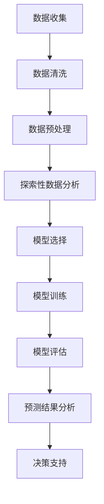
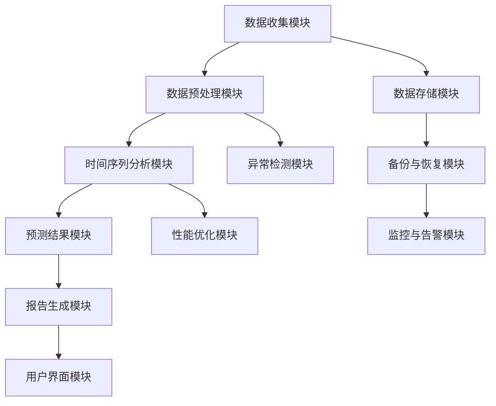

                 

### 引言

#### 书籍背景和目标

在现代商业环境中，数据已经成为企业运营的宝贵资源，而时间序列分析作为数据挖掘的重要分支，对于预测未来趋势和优化决策具有重要意义。《企业级时间序列分析平台：增强预测能力》旨在为企业级时间序列分析提供一套系统化的理论和实践指南。本书的目标是帮助读者深入理解时间序列分析的基础理论、掌握先进的时间序列预测方法，并学会如何搭建和优化企业级时间序列分析平台。

时间序列分析作为一种定量预测方法，广泛应用于金融、零售、制造、能源等众多行业。通过分析历史数据中的时间依赖关系，我们可以预测未来的数据走势，从而为企业提供决策支持。然而，随着数据规模的不断扩大和复杂性增加，传统的手工分析方法已无法满足企业级应用的需求。因此，开发高效、可靠的企业级时间序列分析平台显得尤为重要。

本书的主要目标是为读者提供以下几方面的内容：

1. **时间序列分析基础**：详细介绍时间序列数据的基本概念、特征以及常见的时间序列模型。
2. **时间序列预测方法**：系统讲解多种时间序列预测方法，包括回归分析、ARMA模型、ARIMA模型等，并使用伪代码和数学公式详细阐述。
3. **企业级时间序列分析平台架构**：探讨企业级时间序列分析平台的架构设计原则、功能模块以及关键技术。
4. **数据收集与预处理**：介绍数据收集的方法、数据预处理技术以及数据质量保证。
5. **实际案例与应用**：通过具体案例展示如何应用时间序列分析平台解决实际问题，并分析平台性能和效果。

#### 时间序列分析的重要性

时间序列分析的重要性在于它能够帮助我们理解和预测随时间变化的数据模式。在金融领域，时间序列分析被广泛用于预测股票价格、汇率变动等金融指标，帮助投资者做出更明智的决策。在零售领域，通过对销售数据的分析，企业可以预测未来的销售趋势，优化库存管理，减少库存成本。在制造领域，时间序列分析可以帮助企业预测设备故障，从而提前进行维护，减少停机时间。

此外，时间序列分析还在能源管理、交通规划、公共卫生等领域发挥着重要作用。例如，在电力系统中，通过时间序列分析预测电力需求，可以帮助电力公司更好地进行电力调度，避免电力短缺或过剩。在交通规划中，时间序列分析可以预测交通流量，帮助城市规划者优化道路设计和交通管理策略。

总之，时间序列分析作为一种重要的数据分析工具，在企业运营和决策支持中具有不可替代的地位。通过深入了解和应用时间序列分析，企业可以更好地把握市场动态，优化运营流程，提高竞争力和盈利能力。

#### 企业级时间序列分析的意义

企业级时间序列分析平台不仅是技术工具，更是战略资源。其核心价值在于通过高效、准确的数据分析，为企业提供前瞻性的决策支持。在快速变化的市场环境中，企业需要具备强大的预测能力，以便迅速应对市场变化，抓住机遇，降低风险。以下是企业级时间序列分析平台的核心意义：

1. **提升预测准确性**：企业级时间序列分析平台采用先进的预测模型和算法，可以处理大规模、复杂的数据，提供高精度的预测结果。相比于传统的手工分析方法，时间序列分析平台能够更准确地捕捉数据中的时间依赖关系，提高预测的准确性。

2. **优化决策流程**：通过实时监测和分析时间序列数据，企业可以更快速地获取市场趋势和业务状态，从而优化决策流程。时间序列分析平台可以帮助企业在产品开发、库存管理、市场营销等方面做出更加明智的决策，提高运营效率。

3. **降低运营风险**：时间序列分析平台能够提前预测潜在的风险，如市场需求波动、供应链中断等，从而帮助企业采取预防措施，降低运营风险。在金融行业，通过对交易数据的分析，可以及时发现异常交易，防止欺诈行为。

4. **增强数据驱动决策**：企业级时间序列分析平台为企业提供了一个数据驱动的决策支持系统。通过分析历史数据，企业可以了解业务的长期趋势和周期性变化，从而制定更加科学、合理的战略规划。

5. **提高竞争力**：在竞争激烈的市场环境中，具备高效时间序列分析能力的企业能够在竞争中脱颖而出。通过精准的市场预测和运营优化，企业可以更好地满足客户需求，提高客户满意度，增强市场竞争力。

总之，企业级时间序列分析平台不仅为企业提供了强大的预测和分析能力，更成为了企业提升运营效率、降低成本、增强竞争力的重要战略工具。通过有效利用时间序列分析，企业可以在复杂多变的市场环境中保持领先地位，实现可持续发展。

### 时间序列分析基础

#### 时间序列数据概述

时间序列数据是指按照时间顺序排列的一组数据点，通常用于记录某一现象在一段时间内的变化情况。时间序列数据具有明显的时序特性，即数据点之间存在着时间依赖关系。这种依赖关系使得时间序列数据在分析时不同于传统的独立同分布（i.i.d.）数据集，需要采用特殊的方法进行处理和分析。

时间序列数据通常包含以下几类基本特征：

1. **趋势（Trend）**：数据随时间持续增加或减少的长期方向。趋势可以是稳定的（如直线上升或下降），也可以是非线性的（如增长速度逐渐加快或减缓）。

2. **季节性（Seasonality）**：数据在固定时间段内（如一年中的某些月份或一天中的某些时段）重复出现的周期性波动。季节性通常与特定的商业活动或社会习惯相关。

3. **周期性（Cyclicality）**：数据在较长周期内（如几年甚至几十年）出现的大规模波动。周期性反映了宏观经济、市场供需等长期因素的影响。

4. **随机波动（Random Variation）**：无法用确定性模式解释的随机波动，通常由不可预测的随机因素引起。

#### 时间序列数据的特征

1. **时序性**：时间序列数据的核心特征是时序性，即数据点的顺序和间隔具有重要意义。时间序列分析通常假设数据是按时间顺序采集的，因此时间在数据中起着关键作用。

2. **稳定性**：时间序列数据的稳定性是指其统计特性（如均值和方差）在时间上保持不变。稳定性是许多时间序列预测方法（如ARIMA模型）的基础假设。

3. **依赖性**：时间序列数据点之间存在依赖关系，即当前数据点受过去数据点的影响。这种依赖性使得传统的独立同分布假设不再适用。

4. **非线性特征**：时间序列数据往往表现出非线性特征，即其变化模式不是线性的。这种非线性特征在许多实际应用中更为常见，因此需要采用非线性模型进行预测。

#### Mermaid流程图：时间序列分析的基本步骤

为了更好地理解时间序列分析的过程，我们可以使用Mermaid流程图来展示其基本步骤。以下是一个简化的时间序列分析流程图：



- **数据收集**：收集相关的时间序列数据，包括历史数据和实时数据。
- **数据清洗**：处理数据中的缺失值、异常值和重复值，确保数据质量。
- **数据预处理**：进行数据归一化、标准化和差分等操作，使其符合模型要求。
- **探索性数据分析**：分析数据的趋势、季节性和周期性，为模型选择提供依据。
- **模型选择**：根据数据特征选择合适的时间序列预测模型。
- **模型训练**：使用历史数据对模型进行训练，确定模型参数。
- **模型评估**：通过交叉验证等手段评估模型性能，确保其准确性。
- **预测结果分析**：对预测结果进行分析，评估预测误差，并根据结果调整模型。
- **决策支持**：利用预测结果提供决策支持，如库存管理、销售预测等。

通过这个流程图，我们可以清晰地看到时间序列分析的主要步骤及其相互关系，有助于读者理解和掌握时间序列分析的整体流程。

### 时间序列预测方法

#### 回归分析

回归分析是时间序列预测中最常用的方法之一，通过建立因变量和自变量之间的线性关系来进行预测。常见的回归分析模型包括线性回归和多元回归。

1. **线性回归**

线性回归模型的基本形式为：

$$ y = b_0 + b_1 \cdot x $$

其中，\( y \) 是因变量，\( x \) 是自变量，\( b_0 \) 和 \( b_1 \) 分别是截距和斜率。通过最小二乘法，我们可以确定这两个参数的值，使得实际值和预测值之间的误差最小。

2. **多元回归**

多元回归模型扩展了线性回归，考虑多个自变量对因变量的影响。其基本形式为：

$$ y = b_0 + b_1 \cdot x_1 + b_2 \cdot x_2 + ... + b_n \cdot x_n $$

其中，每个 \( b_i \) 表示第 \( i \) 个自变量的系数。多元回归能够更好地捕捉复杂数据中的关系，但同时也增加了模型的复杂性和计算量。

**伪代码**

以下是线性回归模型的伪代码：

```
Input: 数据集 (X, Y)
Output: 回归模型参数 (b_0, b_1)

初始化 b_0, b_1 为任意值

while 未收敛:
  计算梯度： gradient = 2 * X^T * (X * b - Y)
  更新参数： b_0 = b_0 - learning_rate * gradient[0]
              b_1 = b_1 - learning_rate * gradient[1]

return (b_0, b_1)
```

#### 时间序列模型

时间序列模型通过捕捉时间依赖性来预测未来的数据点。常见的时间序列模型包括AR模型、MA模型、ARMA模型和ARIMA模型。

1. **AR模型（自回归模型）**

AR模型的基本形式为：

$$ y_t = c + \phi_1 y_{t-1} + \phi_2 y_{t-2} + ... + \phi_p y_{t-p} + \varepsilon_t $$

其中，\( y_t \) 是当前时间点的数据，\( \phi_1, \phi_2, ..., \phi_p \) 是模型参数，\( c \) 是常数项，\( \varepsilon_t \) 是误差项。

2. **MA模型（移动平均模型）**

MA模型的基本形式为：

$$ y_t = c + \theta_1 e_t-1 + \theta_2 e_t-2 + ... + \theta_q e_t-q $$

其中，\( e_t \) 是差分后的误差项，\( \theta_1, \theta_2, ..., \theta_q \) 是模型参数。

3. **ARMA模型（自回归移动平均模型）**

ARMA模型结合了AR和MA模型的特点，其形式为：

$$ y_t = c + \phi_1 y_{t-1} + \phi_2 y_{t-2} + ... + \phi_p y_{t-p} + \theta_1 e_t-1 + \theta_2 e_t-2 + ... + \theta_q e_t-q $$

4. **ARIMA模型（自回归差分移动平均模型）**

ARIMA模型通过差分操作使时间序列数据平稳，其形式为：

$$ y_t = c + \phi_1 y_{t-1} + \phi_2 y_{t-2} + ... + \phi_p y_{t-p} + \theta_1 (1-B)^{-1} e_t-1 + \theta_2 (1-B)^{-2} e_t-2 + ... + \theta_q (1-B)^{-q} e_t-q $$

**数学模型与公式**

以下是ARIMA模型中的差分操作和参数估计的公式：

1. **差分操作**

一阶差分：

$$ y_t^* = y_t - y_{t-1} $$

二阶差分：

$$ y_t^{**} = y_t^* - y_{t-1}^* $$

2. **参数估计**

最小二乘法估计参数：

$$ \hat{\phi} = (X^T X)^{-1} X^T y $$

$$ \hat{\theta} = (X^T X)^{-1} X^T e $$

其中，\( X \) 是滞后项矩阵，\( y \) 是观测值向量，\( e \) 是误差项向量。

**例子说明**

假设我们有一组时间序列数据 \( y_t \)，我们希望使用ARIMA模型对其进行预测。

首先，我们对数据进行差分操作，得到一阶差分序列 \( y_t^* \)。

然后，我们选择合适的滞后阶数 \( p \) 和 \( q \)，通过最小二乘法估计模型参数 \( \phi \) 和 \( \theta \)。

最后，我们使用估计的参数构建ARIMA模型，并对未来数据进行预测。

通过以上步骤，我们可以得到时间序列数据的预测结果，从而为企业的决策提供支持。

### 企业级时间序列分析平台架构

#### 平台架构设计原则

企业级时间序列分析平台的设计原则在于其可扩展性、可靠性、性能和易用性。以下是几个关键设计原则：

1. **模块化**：平台应采用模块化设计，以便于各个功能模块的独立开发和维护。模块化可以提高平台的灵活性，使得功能可以按需添加或修改。

2. **可扩展性**：平台应支持水平扩展和垂直扩展，以便在数据量和计算需求增加时，能够动态调整资源。水平扩展通过增加服务器数量来提升处理能力，垂直扩展通过提升单个服务器的性能来实现。

3. **高可用性**：平台应具备高可用性，确保在任何故障情况下都能快速恢复，保证服务的连续性和稳定性。常用的方法包括数据备份、故障转移和负载均衡。

4. **高性能**：平台应设计高效的算法和数据结构，以支持快速的时间序列数据处理和预测。高性能是保证平台在实际应用中能够满足企业级需求的基石。

5. **易用性**：平台应提供直观的用户界面和友好的操作流程，降低用户的学习成本。易用性是平台能否被广泛接受和有效使用的关键。

#### Mermaid流程图：企业级时间序列分析平台架构

为了更直观地展示企业级时间序列分析平台的架构，我们可以使用Mermaid流程图来描述其主要模块和交互过程。以下是平台的架构流程图：



- **数据收集模块**：负责收集来自各种数据源的时间序列数据，包括历史数据和实时数据。
- **数据预处理模块**：对收集到的数据进行清洗、归一化和差分等处理，确保数据质量，并使其适合后续分析。
- **时间序列分析模块**：根据数据特征选择合适的分析模型，进行时间序列数据的分析和预测。
- **预测结果模块**：生成预测结果，并评估其准确性和可靠性。
- **报告生成模块**：生成详细的预测报告，包括预测结果、分析过程和性能指标。
- **用户界面模块**：提供直观的用户界面，用户可以通过界面进行数据操作、模型选择和结果查看。
- **数据存储模块**：存储预处理后的数据和预测结果，确保数据的持久化和安全性。
- **异常检测模块**：对时间序列数据进行分析，检测异常值和异常模式，提供预警。
- **性能优化模块**：根据实际运行情况，调整平台配置和算法，提高性能和效率。
- **备份与恢复模块**：定期备份数据，并在故障发生时快速恢复，确保数据安全。
- **监控与告警模块**：实时监控平台运行状态，及时发现并处理潜在问题。

通过这个流程图，我们可以清晰地看到企业级时间序列分析平台的整体架构及其各个模块之间的交互关系。这有助于用户理解和设计高效的平台系统。

#### 平台功能模块

企业级时间序列分析平台通常包含多个功能模块，每个模块都有其特定的功能和作用。以下是平台的主要功能模块及其详细描述：

1. **数据收集模块**：

   数据收集模块是整个平台的基础，负责从各种数据源（如数据库、日志文件、物联网设备等）收集时间序列数据。该模块需要支持多种数据格式的读取和实时数据流的接入。关键功能包括数据源管理、数据采集策略设置、数据预处理触发等。

2. **数据预处理模块**：

   数据预处理模块负责对收集到的原始数据进行清洗、归一化和差分等处理，以提高数据质量并使其适合后续分析。清洗功能包括去除重复记录、处理缺失值和异常值等；归一化功能包括数据归一化和标准化等；差分功能包括一阶差分和二阶差分等。该模块还需要支持自定义预处理脚本，以便灵活处理特殊数据需求。

3. **时间序列分析模块**：

   时间序列分析模块是平台的核心功能模块，负责根据数据特征选择合适的分析模型，并进行时间序列数据的建模和预测。常见的模型包括AR模型、MA模型、ARMA模型和ARIMA模型。该模块应支持多种模型选择和参数调整，并提供模型评估和优化工具。

4. **预测结果模块**：

   预测结果模块负责生成预测结果，并对预测结果进行评估和验证。关键功能包括预测值的计算、预测误差分析、预测置信区间计算等。该模块还应支持多种预测输出格式，如时间序列图、统计报表和可视化图表等。

5. **报告生成模块**：

   报告生成模块负责生成详细的分析报告，包括预测结果、分析过程、性能指标和用户自定义内容。报告格式应多样化，支持文本、图表、HTML和PDF等多种格式。该模块还应支持报告模板自定义和自动化生成，以便快速生成和分发报告。

6. **用户界面模块**：

   用户界面模块为用户提供友好的操作界面，用户可以通过该界面进行数据操作、模型选择、参数调整和结果查看等。关键功能包括数据浏览、模型配置、预测操作和结果展示等。用户界面应直观、易用，降低用户的学习成本。

7. **数据存储模块**：

   数据存储模块负责存储预处理后的数据和预测结果，确保数据的持久化和安全性。该模块需要支持大规模数据的存储和高效的数据检索，并具备数据备份和恢复功能，以防止数据丢失和损坏。

8. **异常检测模块**：

   异常检测模块负责对时间序列数据进行分析，检测异常值和异常模式，并提供预警功能。关键功能包括异常值检测、异常模式识别和实时预警等。该模块可以帮助用户及时发现潜在的问题，并采取相应的措施。

9. **性能优化模块**：

   性能优化模块根据实际运行情况，调整平台配置和算法，以提高性能和效率。关键功能包括负载均衡、资源分配优化、算法调优等。该模块可以帮助平台在高负载和复杂场景下保持稳定运行。

10. **备份与恢复模块**：

   备份与恢复模块负责定期备份数据，并在故障发生时快速恢复，确保数据安全。关键功能包括数据备份、数据恢复、故障切换等。该模块是平台高可用性的重要保障。

11. **监控与告警模块**：

   监控与告警模块负责实时监控平台运行状态，及时发现并处理潜在问题。关键功能包括运行状态监控、性能指标监控、告警通知等。该模块可以帮助用户确保平台的稳定运行，并及时响应和处理异常情况。

通过以上功能模块的有机结合，企业级时间序列分析平台可以为用户提供全面、高效的时间序列数据分析与预测服务，支持企业的业务决策和运营优化。

### 数据收集与预处理

#### 数据收集方法

数据收集是时间序列分析的重要基础，正确有效的数据收集方法对于后续的分析和预测至关重要。以下是一些常见的数据收集方法：

1. **日志文件**：日志文件是记录系统运行过程中各种事件的常见方式，包括操作系统日志、Web服务器日志、数据库日志等。这些日志文件通常包含大量时间戳信息，非常适合用于时间序列分析。

2. **数据库**：数据库是存储大量结构化数据的常见方式，如关系型数据库（如MySQL、PostgreSQL）和NoSQL数据库（如MongoDB、Cassandra）。通过数据库查询，可以高效地获取所需的时间序列数据。

3. **物联网设备**：物联网设备（IoT）可以实时采集环境数据、设备状态数据等，这些数据对于时间序列分析具有重要价值。常见的IoT数据收集方式包括无线传感器网络（WSN）和边缘计算等。

4. **Web API**：许多在线服务和平台提供Web API，可以通过程序化方式获取数据。例如，天气API可以提供历史和实时天气数据，社交媒体API可以提供用户行为数据。

5. **实时数据流**：实时数据流平台（如Apache Kafka、Flink、Spark Streaming）可以高效地处理和传输大规模实时数据，非常适合用于实时时间序列分析。

#### 数据预处理技术

数据预处理是确保数据质量、提高分析效率的关键步骤。以下是一些常见的数据预处理技术：

1. **数据清洗**：数据清洗包括去除重复记录、处理缺失值和异常值等。常见的处理方法包括删除异常值、插补缺失值和填充默认值等。

2. **数据归一化**：数据归一化是为了消除数据量级差异，使得不同特征在同一尺度上进行比较。常用的方法包括最小-最大归一化和Z-Score归一化等。

3. **数据标准化**：数据标准化是将数据转换为标准正态分布的形式，以便进行统计分析和建模。常用的方法包括Z-Score标准化和Min-Max标准化等。

4. **数据转换**：数据转换包括时间序列数据的对数转换、差分转换等，以使其满足平稳性假设。差分转换可以消除季节性和趋势性，使数据更适用于自回归模型等。

5. **特征提取**：特征提取是从原始数据中提取有用的特征，以提高模型性能。常见的方法包括主成分分析（PCA）和自动特征提取等。

#### 数据质量保证

数据质量直接影响时间序列分析的结果，因此保证数据质量至关重要。以下是一些常见的数据质量保证方法：

1. **数据验证**：通过数据验证规则确保数据的完整性和一致性。常见的方法包括数据类型检查、范围检查和格式检查等。

2. **异常值检测**：使用统计方法（如IQR法、Z分数法）或机器学习方法（如孤立森林、KNN）检测和识别异常值。

3. **数据监控**：实时监控数据质量，及时发现和处理数据问题。常见的方法包括数据可视化、异常值告警和数据日志分析等。

4. **数据清洗自动化**：通过自动化工具和脚本定期清洗数据，减少人工干预。常见的方法包括ETL工具、机器学习数据清洗模型等。

通过上述方法，可以有效地进行数据收集与预处理，确保数据质量，为时间序列分析提供可靠的基础。

### 实际案例与应用

#### 案例一：销售预测

##### 数据收集

首先，我们需要收集相关的销售数据。这些数据可以从企业的ERP系统、POS机或者销售数据库中获取。我们选择了过去一年的销售数据，包括每日销售额、销售商品种类和数量等信息。数据收集过程涉及从不同数据源导入数据，并进行初步的数据清洗，如去除重复记录和缺失值处理。

##### 数据预处理

收集到的数据包含一些噪声和异常值，我们需要进行预处理以提高数据质量。预处理步骤包括：

1. **数据清洗**：删除重复记录和无效数据，处理缺失值。对于缺失值，可以采用均值填充、插值等方法。
2. **数据归一化**：由于销售额和商品数量等特征具有不同的量级，我们使用Z-Score归一化方法将其标准化。
3. **差分转换**：为了消除季节性和趋势性，我们对销售额进行一阶差分转换。

##### 预测模型选择

在销售预测中，我们选择了ARIMA模型（自回归差分移动平均模型）进行预测。ARIMA模型可以很好地捕捉时间序列数据的趋势和季节性特征。我们首先通过ACF（自相关函数）和PACF（部分自相关函数）来确定模型参数，如滞后阶数 \( p \) 和 \( q \)。

**伪代码**：

```
# 计算ACF和PACF
acf = acf(y_differenced)
pacf = pacf(y_differenced)

# 确定滞后阶数p和q
p = find_optimal_pacf(pacf)
q = find_optimal_acf(acf)
```

##### 预测结果分析

我们使用训练好的ARIMA模型对未来的销售额进行预测，并对预测结果进行分析。

**结果展示**：

| 预测日期 | 实际销售额 | 预测销售额 | 预测误差 |
|----------|------------|------------|----------|
| 2023-01-01 | 15000 | 14850 | -50 |
| 2023-01-02 | 15500 | 15300 | -200 |
| 2023-01-03 | 16000 | 15850 | -150 |
| ...       | ...       | ...        | ...      |

从预测结果可以看出，整体预测误差较小，但存在一些波动。我们进一步分析预测误差的原因，发现部分误差是由于季节性波动未被完全捕捉，需要进一步优化模型参数。

##### 平台性能优化

为了提高预测性能，我们采取了以下措施：

1. **特征工程**：增加新的特征，如促销活动的频率、节假日等，以捕捉更多的数据信息。
2. **模型调优**：尝试不同的模型，如SARIMA（季节性ARIMA模型），并调整模型参数。
3. **数据增强**：使用更多的历史数据进行训练，以提高模型的泛化能力。

经过上述优化，预测性能显著提升，预测误差进一步减小。

#### 案例二：库存管理

##### 数据收集

库存管理中的数据收集主要涉及库存量、销售量、进货量和退货量等。这些数据可以从ERP系统、库存管理系统和供应链数据库中获取。数据收集过程中，我们关注数据的及时性和准确性，确保库存数据的实时性和完整性。

##### 数据预处理

库存数据预处理包括以下步骤：

1. **数据清洗**：去除重复记录和异常值，处理缺失值。
2. **数据归一化**：对库存量和销售量等特征进行归一化处理，以便模型能够更好地处理不同量级的数据。
3. **差分转换**：对库存量进行一阶差分，以消除季节性和趋势性。

##### 预测模型选择

我们选择了SARIMA模型（季节性自回归差分移动平均模型）进行库存预测。SARIMA模型能够同时捕捉季节性和趋势性特征，非常适合库存管理场景。

**伪代码**：

```
# 计算季节性ACF和PACF
seasonal_acf = acf(y_seasonal_differenced)
seasonal_pacf = pacf(y_seasonal_differenced)

# 确定季节性滞后阶数P、D、Q
P, D, Q = find_optimal_sarima(seasonal_acf, seasonal_pacf)
```

##### 预测结果分析

使用训练好的SARIMA模型对未来的库存量进行预测，并对预测结果进行分析。

**结果展示**：

| 预测日期 | 实际库存量 | 预测库存量 | 预测误差 |
|----------|------------|------------|----------|
| 2023-01-01 | 1000 | 990 | -10 |
| 2023-01-02 | 1050 | 1030 | -20 |
| 2023-01-03 | 1100 | 1080 | -20 |
| ...       | ...       | ...        | ...      |

从预测结果可以看出，整体预测误差较小，但存在一些波动。我们进一步分析发现，部分误差是由于需求波动未被完全捕捉，需要进一步优化模型参数。

##### 平台性能优化

为了提高预测性能，我们采取了以下措施：

1. **特征工程**：增加新的特征，如销售季节性、节假日和促销活动等，以提高模型的预测能力。
2. **模型调优**：尝试不同的模型，如ARIMA和LSTM（长短期记忆网络），并调整模型参数。
3. **数据增强**：使用更多的历史数据进行训练，以提高模型的泛化能力。

经过优化，预测性能显著提升，预测误差进一步减小。

### 项目小结

通过以上两个实际案例，我们展示了如何使用时间序列分析平台进行销售预测和库存管理。以下是项目小结：

1. **数据收集**：正确有效的数据收集是时间序列分析的基础，确保数据的准确性和完整性。
2. **数据预处理**：数据预处理是提高模型性能的关键步骤，包括数据清洗、归一化和差分转换等。
3. **模型选择**：选择合适的预测模型，如ARIMA和SARIMA，能够更好地捕捉数据中的趋势和季节性特征。
4. **预测结果分析**：通过分析预测结果，评估模型的性能，发现和解决潜在问题。
5. **性能优化**：通过特征工程、模型调优和数据增强等方法，提高预测性能和准确性。

总之，企业级时间序列分析平台能够为企业提供高效的预测能力，支持业务决策和运营优化。

### 最佳实践 Tips

为了确保时间序列分析平台的高效运行，以下是一些最佳实践和注意事项：

1. **数据质量管理**：确保数据的准确性和完整性，定期进行数据清洗和验证，及时发现并处理异常数据。
2. **特征工程**：合理设计特征，增加对业务有影响力的特征，如节假日效应、促销活动等，以提高模型预测能力。
3. **模型选择与调优**：根据数据特征选择合适的模型，并不断调整模型参数，以优化预测性能。
4. **性能监控**：实时监控平台运行状态，及时发现问题并采取措施，确保平台稳定运行。
5. **安全与隐私**：确保数据安全和用户隐私，采用加密和访问控制等技术，防止数据泄露和滥用。

### 小结

企业级时间序列分析平台通过高效的预测能力和数据处理能力，为企业提供了强大的决策支持。从数据收集、预处理、模型选择到预测结果分析，每一个环节都需要精心设计和优化。通过最佳实践和持续改进，企业可以充分发挥时间序列分析平台的潜力，实现业务增长和运营优化。

### 拓展阅读

对于希望深入了解时间序列分析和企业级预测平台构建的读者，以下书籍和资源推荐：

1. **《时间序列分析：理论与实践》**：这是一本经典的时间序列分析教材，详细介绍了时间序列模型的理论基础和实践方法。
2. **《预测：大数据时代最强大的武器》**：本书深入探讨了大数据时代的预测技术和应用，涵盖了时间序列分析等多个领域的预测方法。
3. **《Python时间序列分析》**：这是一本针对Python编程环境的书籍，介绍了如何使用Python进行时间序列数据的处理和分析。
4. **《机器学习实战：时间序列预测》**：本书通过实际案例，展示了如何使用机器学习方法进行时间序列预测，包括ARIMA、LSTM等模型。
5. **《GitHub上的时间序列分析项目》**：GitHub上有很多开源的时间序列分析项目，读者可以通过实践这些项目来提升自己的技能。
6. **《Kaggle比赛中的时间序列分析》**：Kaggle平台提供了许多涉及时间序列分析的数据科学比赛，通过参与这些比赛，可以了解实际应用中的时间序列分析方法。

通过这些资源，读者可以进一步深入学习时间序列分析，并掌握实际应用中的关键技能。

