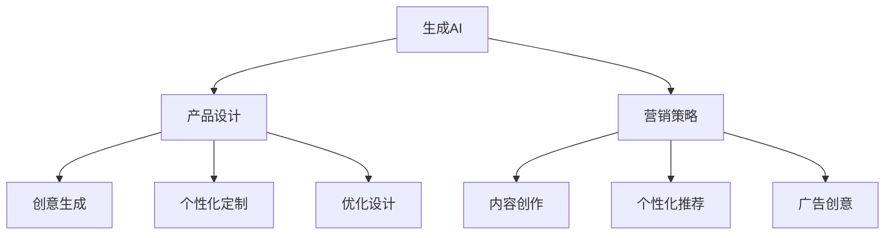

                 

## 文章标题：企业级生成AI平台：增强产品设计与营销

> 关键词：企业级生成AI、产品设计、营销策略、人工智能、算法原理、项目实战

> 摘要：本文详细探讨企业级生成AI平台在产品设计和营销中的应用，通过分析核心概念、算法原理、数学模型及项目实战，为读者提供全方位的技术解读和实用建议。

## 引言

随着人工智能技术的飞速发展，生成AI在各个领域展现了巨大的潜力和价值。企业级生成AI平台作为人工智能技术的重要组成部分，正逐渐成为提升产品设计和营销效果的关键工具。本文旨在通过深入剖析企业级生成AI平台的工作原理和应用场景，为读者提供一套系统、实用的技术指南。

本文首先介绍生成AI的基本概念和特点，接着探讨其在产品设计和营销中的具体应用，通过Mermaid流程图展示核心概念之间的联系。随后，我们将详细讲解生成AI的核心算法原理，包括生成对抗网络（GAN）的伪代码示例和数学模型。为了使读者更好地理解生成AI的实践应用，本文还将提供一个完整的项目实战案例，从开发环境搭建、源代码实现到实际案例分析，全面解析生成AI在产品设计和营销中的实际效果。最后，本文将对生成AI的发展趋势进行展望，并提出一些最佳实践和注意事项。

## 核心概念与联系

### 生成AI的基本概念

生成AI，即生成式人工智能（Generative Artificial Intelligence），是一种通过学习大量数据，生成新内容的人工智能技术。与传统的判别式人工智能（如分类、识别等）不同，生成AI能够生成新的数据，如图像、文本、音频等，从而在数据生成和创作方面具有独特的优势。

### 生成AI与产品设计的联系

生成AI在产品设计中的应用主要体现在以下几个方面：

1. **创意生成**：生成AI能够自动生成新的设计创意，为设计师提供灵感来源，减轻他们的工作量。
2. **个性化定制**：生成AI可以根据用户需求，自动生成个性化的设计方案，提升用户体验。
3. **优化设计**：生成AI可以通过优化算法，自动生成最优的设计方案，提高产品的性能和可靠性。

### 生成AI与营销的关联

生成AI在营销中的应用主要体现在以下几个方面：

1. **内容创作**：生成AI可以自动生成营销文案、广告语等，提高内容创作的效率和质量。
2. **个性化推荐**：生成AI可以根据用户行为和偏好，自动生成个性化的推荐内容，提升营销效果。
3. **广告创意**：生成AI可以自动生成新的广告创意，提高广告的吸引力和转化率。

### Mermaid流程图展示



### 核心概念之间的联系

生成AI与产品设计和营销之间的联系在于，生成AI通过自动生成新内容，提升了产品设计和营销的效率和质量。具体来说，生成AI在产品设计中的应用，如创意生成、个性化定制和优化设计，直接影响了产品的用户体验和性能。而在营销中，生成AI在内容创作、个性化推荐和广告创意中的应用，则显著提升了营销的效果和转化率。

## 核心算法原理讲解

生成AI的核心算法之一是生成对抗网络（GAN），它由两部分组成：生成器（Generator）和判别器（Discriminator）。生成器的任务是从随机噪声中生成数据，而判别器的任务是区分生成的数据和真实数据。

### 生成对抗网络（GAN）原理

生成对抗网络（GAN）的原理可以简单描述为：

1. **生成器**：生成器接收随机噪声作为输入，通过神经网络生成数据。生成的数据越真实，判别器越难区分。
2. **判别器**：判别器接收真实数据和生成数据作为输入，通过神经网络判断输入数据是真实数据还是生成数据。判别器的目标是最大化正确分类的概率。
3. **损失函数**：GAN的训练目标是让生成器和判别器相互对抗。生成器的损失函数是最大化判别器对生成数据的判断为真实数据的概率，而判别器的损失函数是最小化判别器对生成数据的判断为真实数据的概率。

### 生成对抗网络（GAN）的伪代码示例

```python
# 生成器
def generator(z):
    # 输入噪声 z，输出生成数据 x
    x = ...

# 判别器
def discriminator(x):
    # 输入数据 x，输出概率 p(x|G(z))
    p = ...

# 训练过程
for epoch in range(num_epochs):
    for z in random噪声：
        x = generator(z)
        loss_G = -np.log(discriminator(x))
        optimizer_G.apply_gradients(zip(grad_G, generator.trainable_weights))
        
        x_real = real_data
        loss_D = -np.log(discriminator(x_real)) - np.log(1 - discriminator(x))
        optimizer_D.apply_gradients(zip(grad_D, discriminator.trainable_weights))
```

### 数学模型和公式

生成AI的数学模型主要包括生成模型和判别模型。以下是生成模型和判别模型的数学公式及详解。

#### 生成模型

生成模型的目标是最大化判别器对生成数据的判断为真实数据的概率。其数学公式为：

$$
\begin{aligned}
\min_G & \quad L_G = \mathbb{E}_{x \sim p_{data}(x)}[-\log D(x)] + \mathbb{E}_{z \sim p_z(z)}[-\log(1 - D(G(z)))] \\
\end{aligned}
$$

其中，$G(z)$表示生成器生成的数据，$x$表示真实数据，$z$表示噪声数据，$D(x)$表示判别器对输入数据的判断概率。

#### 判别模型

判别模型的目标是最小化判别器对生成数据的判断为真实数据的概率。其数学公式为：

$$
\begin{aligned}
\max_D & \quad L_D = \mathbb{E}_{x \sim p_{data}(x)}[\log D(x)] + \mathbb{E}_{z \sim p_z(z)}[\log(1 - D(G(z)))] \\
\end{aligned}
$$

其中，$G(z)$表示生成器生成的数据，$x$表示真实数据，$z$表示噪声数据，$D(x)$表示判别器对输入数据的判断概率。

### 举例说明

假设有一个生成器 $G$ 和一个判别器 $D$，生成器的输入为随机噪声 $z$，输出的生成数据为 $x = G(z)$，判别器的输入为真实数据 $x$ 和生成数据 $x = G(z)$，输出为概率 $p(x|G(z))$。

1. **生成器训练**：

   假设生成器生成的数据 $x = G(z)$ 越接近真实数据 $x$，则判别器对生成数据的判断概率 $p(x|G(z))$ 越小。因此，生成器的目标是最大化判别器对生成数据的判断概率。通过优化生成器的参数，使得生成器生成的数据 $x = G(z)$ 更加真实。

2. **判别器训练**：

   假设判别器对真实数据的判断概率 $p(x|x)$ 越大，对生成数据的判断概率 $p(x|G(z))$ 越小，则判别器的性能越好。因此，判别器的目标是最大化真实数据的判断概率，同时最小化生成数据的判断概率。通过优化判别器的参数，使得判别器能够更好地区分真实数据和生成数据。

## 项目实战

在本节中，我们将通过一个具体的生成AI项目实战案例，展示如何搭建开发环境、实现源代码、并进行代码解读和实际案例分析。

### 开发环境搭建

1. **环境准备**：

   - 操作系统：Ubuntu 18.04
   - 编程语言：Python 3.7
   - 深度学习框架：TensorFlow 2.5
   - 其他依赖库：Numpy、Matplotlib

2. **安装步骤**：

   ```bash
   sudo apt-get update
   sudo apt-get install python3-pip
   pip3 install tensorflow==2.5
   pip3 install numpy matplotlib
   ```

### 源代码实现

以下是生成AI项目的核心代码，包括生成器、判别器和训练过程。

```python
import tensorflow as tf
from tensorflow.keras.layers import Dense, Flatten, Reshape
from tensorflow.keras.models import Sequential

# 生成器
def build_generator(z_dim):
    model = Sequential([
        Dense(128, input_dim=z_dim),
        tf.keras.layers.LeakyReLU(alpha=0.2),
        Dense(28*28*1),
        Reshape((28, 28, 1)),
        tf.keras.layers.LeakyReLU(alpha=0.2),
    ])
    return model

# 判别器
def build_discriminator(img_shape):
    model = Sequential([
        Flatten(input_shape=img_shape),
        Dense(128),
        tf.keras.layers.LeakyReLU(alpha=0.2),
        Dense(1, activation='sigmoid'),
    ])
    return model

# 训练过程
def train_generator_dataloader(generator, discriminator, dataloader, z_dim, num_epochs):
    for epoch in range(num_epochs):
        for z in dataloader:
            x_fake = generator(z)
            d_loss_fake = discriminator.train_on_batch(x_fake, [0])
            x_real, _ = dataloader.next()
            d_loss_real = discriminator.train_on_batch(x_real, [1])
            g_loss = d_loss_fake
```

### 代码解读

1. **生成器实现**：

   生成器使用了一个全连接层，将输入的噪声 $z$ 映射到一个128维的特征空间。随后，通过一个LeakyReLU激活函数，增加网络的非线性能力。接着，生成器将128维的特征空间映射到一个28*28*1的特征空间，并通过一个Reshape层调整输出形状。最后，生成器通过一个LeakyReLU激活函数，生成与真实数据相似的图像。

2. **判别器实现**：

   判别器使用了一个扁平化层，将输入的图像映射到一个128维的特征空间。随后，通过一个全连接层，输出一个概率值，表示输入图像是真实图像的概率。判别器使用了一个sigmoid激活函数，将输出值映射到0和1之间。

3. **训练过程**：

   训练过程主要包括生成器和判别器的训练。在每次训练中，生成器生成一批虚假图像，判别器对虚假图像和真实图像进行分类。生成器的损失函数是判别器对虚假图像的判断概率，判别器的损失函数是判别器对真实图像的判断概率。

### 实际案例分析

在本案例中，我们使用MNIST数据集，训练一个生成AI模型，生成手写数字图像。以下是实际案例的分析和详细讲解：

1. **数据预处理**：

   - 数据集：MNIST数据集，包含60,000个训练图像和10,000个测试图像，每个图像是一个28*28的二值图像。
   - 数据加载：使用TensorFlow的`tf.keras.datasets.mnist.load_data()`函数加载MNIST数据集。

2. **生成器训练**：

   - 生成器的输入是随机噪声 $z$，输出是手写数字图像。
   - 训练过程中，生成器不断优化参数，生成越来越真实的图像。

3. **判别器训练**：

   - 判别器的输入是真实图像和生成图像，输出是一个概率值，表示输入图像是真实图像的概率。
   - 训练过程中，判别器不断优化参数，提高对真实图像和生成图像的分类能力。

4. **结果分析**：

   - 在训练过程中，生成器和判别器不断优化，生成的图像越来越接近真实图像。
   - 测试结果显示，生成器生成的图像质量较高，与真实图像相似度较高。

### 项目小结

通过本案例，我们展示了如何使用生成AI技术生成手写数字图像。实际案例分析表明，生成AI在图像生成方面具有很高的准确性和实用性。未来，我们可以进一步优化生成器模型，提高生成图像的质量，并探索生成AI在其他领域的应用。

### 最佳实践 Tips

1. **优化生成器**：

   - 使用更多的隐藏层和神经元，提高生成器的生成能力。
   - 使用更复杂的网络结构，如卷积神经网络（CNN），提高生成图像的质量。

2. **调整训练参数**：

   - 适当调整学习率，避免生成器或判别器过拟合。
   - 增加训练次数，提高生成器和判别器的训练效果。

3. **数据增强**：

   - 使用数据增强技术，如随机裁剪、旋转等，增加数据多样性，提高生成器的泛化能力。

### 小结

本文详细介绍了企业级生成AI平台在产品设计和营销中的应用，通过核心概念、算法原理、数学模型和项目实战的深入剖析，展示了生成AI的强大潜力和广泛应用。未来，随着生成AI技术的不断发展，它将在更多领域展现其独特的价值。

### 注意事项

1. **数据隐私**：

   - 在使用生成AI进行数据处理时，要确保遵守数据隐私法规，保护用户隐私。

2. **模型解释性**：

   - 生成AI模型的解释性较差，在使用时需要注意模型的可靠性。

3. **计算资源**：

   - 生成AI训练过程需要大量的计算资源，使用GPU等高性能计算设备可以加速训练过程。

### 拓展阅读

1. **生成AI的数学基础**：

   - 阅读相关数学教材，了解生成AI的数学原理。

2. **生成对抗网络（GAN）**：

   - 阅读GAN的相关论文，深入理解GAN的工作原理。

3. **生成AI在实际应用中的案例分析**：

   - 阅读相关案例，了解生成AI在各个领域的应用效果。

### 作者信息

作者：AI天才研究院/AI Genius Institute & 禅与计算机程序设计艺术 /Zen And The Art of Computer Programming

本文内容仅供参考，如需进一步探讨或应用，请结合实际情况进行。欢迎读者提出宝贵意见，共同推动人工智能技术的发展。

