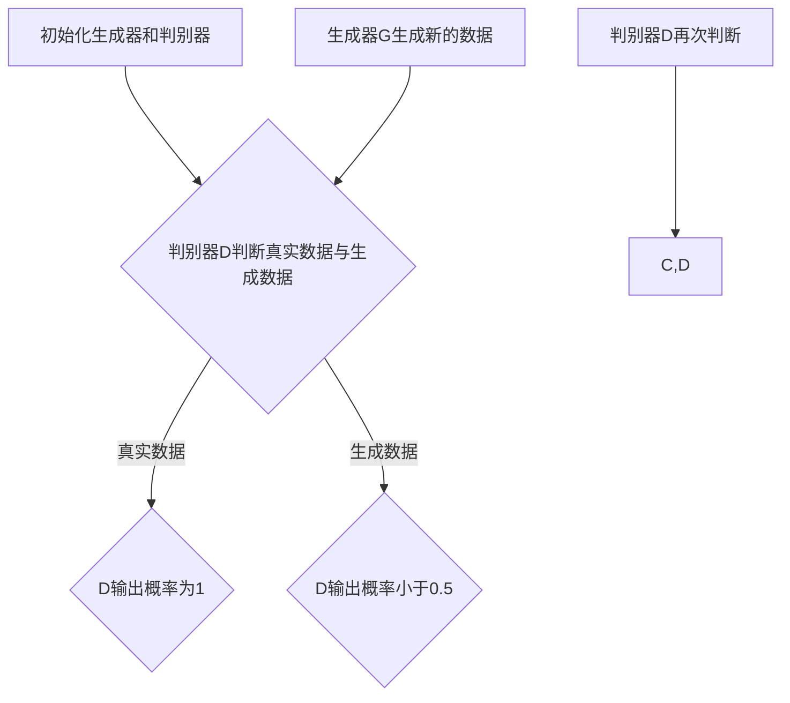
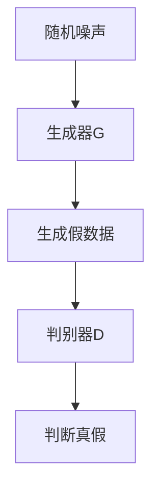

                 


## 文章标题：企业级生成对抗网络：创新产品设计与开发

## 文章关键词
- 生成对抗网络 (GAN)
- 企业级应用
- 产品设计
- 算法原理
- 项目实战

## 摘要
本文旨在探讨生成对抗网络（GAN）在企业级产品设计与开发中的应用。首先，我们将介绍GAN的基本概念和架构，随后深入解析其核心算法原理。接着，通过数学模型和公式，我们将详细阐述GAN的工作机制。然后，本文将分享实际项目实战经验，包括开发环境搭建、代码实现、应用解读与分析。最后，本文将总结GAN在企业级产品开发中的最佳实践，并提出未来发展的趋势和挑战。

---

## 引言

### 背景介绍

生成对抗网络（Generative Adversarial Networks，GAN）自2014年由Ian Goodfellow等人提出以来，迅速成为人工智能领域的研究热点。GAN通过两个神经网络——生成器和判别器——之间的对抗训练，实现生成逼真的数据。这一技术在图像生成、自然语言处理、医疗影像等领域展现出巨大的应用潜力。

在企业级产品开发中，GAN的应用不仅能够提升产品的创新性，还能提高生产效率和降低成本。然而，GAN的复杂性和挑战性也使得其应用面临着一定的困难。本文将围绕GAN的核心概念、算法原理、数学模型以及实际项目实战，探讨其在企业级产品设计与开发中的实践与应用。

### 核心概念与联系

生成对抗网络（GAN）的核心概念包括生成器（Generator）和判别器（Discriminator）。生成器的任务是生成逼真的数据，而判别器的任务是区分真实数据和生成数据。两者之间通过对抗训练相互提升，最终生成器的生成质量达到判别器难以区分的程度。

下面是一个Mermaid流程图，用于展示GAN的核心概念和训练过程：



在GAN的训练过程中，生成器和判别器不断地相互对抗，生成器试图生成更逼真的数据，而判别器则努力提高区分能力。通过这种对抗训练，生成器能够逐渐提高生成数据的真实感，判别器则能够更好地识别真实数据和生成数据。

---

## 第1章：GAN的基本概念与架构

### 1.1 生成对抗网络（GAN）的起源

生成对抗网络（GAN）的提出源于对生成模型和判别模型之间对抗关系的深入思考。GAN的核心思想是将生成模型和判别模型置于一个共同的学习框架中，通过两者之间的对抗训练，实现生成模型的高效训练。这一概念最初由Ian Goodfellow等人在2014年提出，并在随后迅速成为人工智能领域的研究热点。

### 1.2 GAN的核心原理

GAN的核心原理基于生成器（Generator）和判别器（Discriminator）之间的对抗训练。生成器的任务是生成与真实数据相似的数据，而判别器的任务是判断输入数据是真实数据还是生成数据。在训练过程中，生成器和判别器相互对抗，生成器的目标是让判别器无法区分真实数据和生成数据，而判别器的目标是提高区分能力。

GAN的训练过程可以概括为以下步骤：

1. **初始化生成器G和判别器D**：生成器G接收随机噪声作为输入，生成假数据。判别器D接收真实数据和假数据，并输出它们属于真实数据或假数据的概率。

2. **判别器D的训练**：判别器D通过学习真实数据和假数据，提高其判断能力。在训练过程中，D的目标是最小化判别错误率。

3. **生成器G的训练**：生成器G的目标是生成足够逼真的假数据，使得D无法区分真实数据和生成数据。在训练过程中，G的目标是最大化D对生成数据的判断概率。

4. **交替训练**：生成器G和判别器D交替进行训练，通过对抗训练，使得G和D都不断进步。

下面是GAN的核心算法原理的伪代码：

```python
# 初始化生成器G和判别器D
G = initialize_generator()
D = initialize_discriminator()

# 指定训练轮数
num_epochs = 10000

# 训练过程
for epoch in range(num_epochs):
    # 随机采样真实数据X
    X_real = sample_real_data()

    # 生成假数据X_fake
    X_fake = G.generate(z)

    # 判别器D的损失函数
    D_loss_real = -log(D.forward(X_real))
    D_loss_fake = -log(1 - D.forward(X_fake))

    # 生成器G的损失函数
    G_loss = -log(D.forward(X_fake))

    # 更新判别器D的参数
    D_loss = D_loss_real + D_loss_fake
    D.backward(D_loss)
    D.update_params()

    # 更新生成器G的参数
    G_loss.backward(G_loss)
    G.update_params()

    # 打印训练信息
    print(f"Epoch {epoch}: D_loss = {D_loss}, G_loss = {G_loss}")
```

### 1.3 GAN的基本架构

GAN的基本架构主要包括生成器（Generator）和判别器（Discriminator）两个部分。生成器接收随机噪声作为输入，通过一系列的神经网络操作，生成与真实数据相似的数据。判别器则接收真实数据和生成数据，通过判断数据是否真实，来评估生成器的性能。

下面是GAN的基本架构图：



在GAN的架构中，生成器和判别器是相互对抗的。生成器的目标是生成足够逼真的假数据，使得判别器无法区分，而判别器的目标是提高对假数据和真实数据的区分能力。通过这种对抗训练，生成器和判别器都得到提升，最终生成器能够生成高质量的数据。

---

## 第2章：GAN的主要类型

### 2.1 传统的GAN

传统的GAN是最基本的GAN类型，其核心思想是生成器和判别器之间的对抗训练。生成器接收随机噪声作为输入，生成假数据，判别器则通过接收真实数据和生成数据，提高其判断能力。传统GAN的训练过程中，生成器和判别器的损失函数通常是相互独立的。

传统GAN的训练过程如下：

1. **初始化生成器G和判别器D**：生成器G接收随机噪声作为输入，判别器D接收真实数据和生成数据。
2. **判别器D的训练**：判别器D通过学习真实数据和假数据，提高其判断能力。在训练过程中，D的目标是最小化判别错误率。
3. **生成器G的训练**：生成器G的目标是生成足够逼真的假数据，使得判别器D无法区分真实数据和生成数据。在训练过程中，G的目标是最大化D对生成数据的判断概率。
4. **交替训练**：生成器G和判别器D交替进行训练，通过对抗训练，使得G和D都不断进步。

传统GAN的伪代码如下：

```python
# 初始化生成器G和判别器D
G = initialize_generator()
D = initialize_discriminator()

# 指定训练轮数
num_epochs = 10000

# 训练过程
for epoch in range(num_epochs):
    # 随机采样真实数据X
    X_real = sample_real_data()

    # 生成假数据X_fake
    X_fake = G.generate(z)

    # 判别器D的损失函数
    D_loss_real = -log(D.forward(X_real))
    D_loss_fake = -log(1 - D.forward(X_fake))

    # 生成器G的损失函数
    G_loss = -log(D.forward(X_fake))

    # 更新判别器D的参数
    D_loss = D_loss_real + D_loss_fake
    D.backward(D_loss)
    D.update_params()

    # 更新生成器G的参数
    G_loss.backward(G_loss)
    G.update_params()

    # 打印训练信息
    print(f"Epoch {epoch}: D_loss = {D_loss}, G_loss = {G_loss}")
```

### 2.2 变分GAN（VGAN）

变分GAN（Variational Generative Adversarial Networks，VGAN）是在传统GAN的基础上发展起来的一种GAN类型。VGAN通过引入变分自编码器（Variational Autoencoder，VAE）的变分推断机制，解决了GAN训练过程中的不稳定性和难以优化的问题。

VGAN的核心思想是将生成器和判别器与变分自编码器相结合，通过变分推断实现数据的生成和判别。在VGAN中，生成器的任务是生成与真实数据相似的数据，判别器的任务是区分真实数据和生成数据，而变分自编码器则用于估计数据的概率分布。

下面是VGAN的核心算法原理的伪代码：

```python
# 初始化生成器G、判别器D和变分自编码器VAE
G = initialize_generator()
D = initialize_discriminator()
VAE = initialize_vae()

# 指定训练轮数
num_epochs = 10000

# 训练过程
for epoch in range(num_epochs):
    # 随机采样真实数据X
    X_real = sample_real_data()

    # 生成假数据X_fake
    z, x_fake = VAE.encode(X_real)
    X_fake = G.decode(z)

    # 判别器D的损失函数
    D_loss_real = -log(D.forward(X_real))
    D_loss_fake = -log(1 - D.forward(X_fake))

    # 生成器G的损失函数
    G_loss = -log(D.forward(X_fake))

    # 变分自编码器VAE的损失函数
    VAE_loss = -log(VAE.decode(z).sigmoid())

    # 更新判别器D的参数
    D_loss = D_loss_real + D_loss_fake
    D.backward(D_loss)
    D.update_params()

    # 更新生成器G的参数
    G_loss.backward(G_loss)
    G.update_params()

    # 更新变分自编码器VAE的参数
    VAE_loss.backward(VAE_loss)
    VAE.update_params()

    # 打印训练信息
    print(f"Epoch {epoch}: D_loss = {D_loss}, G_loss = {G_loss}, VAE_loss = {VAE_loss}")
```

### 2.3 条件GAN（cGAN）

条件GAN（Conditional Generative Adversarial Networks，cGAN）是在传统GAN的基础上引入条件信息的一种GAN类型。cGAN通过在生成器和判别器的输入中添加条件信息，能够生成具有特定属性的数据。

cGAN的核心思想是生成器和判别器在训练过程中接收的条件信息，如类别标签、文本描述等。通过条件信息的引入，cGAN能够更好地控制生成数据的属性，从而生成更具有特定条件的数据。

下面是cGAN的核心算法原理的伪代码：

```python
# 初始化生成器G、判别器D和条件信息模块C
G = initialize_generator()
D = initialize_discriminator()
C = initialize_condition_module()

# 指定训练轮数
num_epochs = 10000

# 训练过程
for epoch in range(num_epochs):
    # 随机采样真实数据X和条件信息Y
    X_real, Y_real = sample_real_data(), sample_condition_data()

    # 生成假数据X_fake
    z, x_fake = C.encode(Y_real, X_real)
    X_fake = G.decode(z)

    # 判别器D的损失函数
    D_loss_real = -log(D.forward(X_real, Y_real))
    D_loss_fake = -log(1 - D.forward(X_fake, Y_fake))

    # 生成器G的损失函数
    G_loss = -log(D.forward(X_fake, Y_fake))

    # 条件信息模块C的损失函数
    C_loss = -log(C.decode(z, Y_fake).sigmoid())

    # 更新判别器D的参数
    D_loss = D_loss_real + D_loss_fake
    D.backward(D_loss)
    D.update_params()

    # 更新生成器G的参数
    G_loss.backward(G_loss)
    G.update_params()

    # 更新条件信息模块C的参数
    C_loss.backward(C_loss)
    C.update_params()

    # 打印训练信息
    print(f"Epoch {epoch}: D_loss = {D_loss}, G_loss = {G_loss}, C_loss = {C_loss}")
```

---

## 第3章：GAN的数学基础

### 3.1 信息论与GAN

生成对抗网络（GAN）的核心思想源于信息论的基本原理。GAN的训练过程可以看作是一个博弈过程，其中生成器和判别器相互对抗，类似于零和博弈。生成器的目标是最小化判别器对生成数据的判断概率，而判别器的目标是最大化这个概率。

在GAN中，信息论的概念主要体现在以下几个方面：

1. **信息熵（Entropy）**：信息熵是衡量数据不确定性的度量。在GAN中，生成器的目标是生成足够真实的数据，使得数据的熵接近真实数据的熵。
2. **互信息（Mutual Information）**：互信息是衡量两个随机变量之间相互依赖程度的度量。在GAN中，生成器的目标是使得生成数据与真实数据之间的互信息最大化。
3. **对数损失函数**：GAN的训练过程通常使用对数损失函数，如交叉熵损失函数，来衡量生成器和判别器的性能。

### 3.2 GAN的目标函数

GAN的目标函数是生成器和判别器性能的综合体现。在GAN中，生成器和判别器的目标函数分别是最大化生成器的生成质量和最大化判别器的区分能力。

生成器的目标函数通常表示为：

\[ G^*(x) = \max_{G} \mathbb{E}_{z \sim p(z)} [-D(G(z))] \]

其中，\( G(z) \)是生成器生成的假数据，\( z \)是生成器的输入噪声，\( D(x) \)是判别器的输出概率。

判别器的目标函数通常表示为：

\[ D^*(x) = \max_{D} \mathbb{E}_{x \sim p_{data}(x)} [D(x)] + \mathbb{E}_{z \sim p(z)} [1 - D(G(z))] \]

其中，\( x \)是真实数据，\( p_{data}(x) \)是真实数据的分布。

### 3.3 GAN的训练策略

GAN的训练策略主要包括以下几个方面：

1. **随机梯度下降（SGD）**：GAN的训练通常采用随机梯度下降（SGD）算法。在每次迭代中，生成器和判别器分别更新其参数，以最小化各自的损失函数。
2. **学习率调整**：为了稳定训练过程，GAN的训练通常采用不同学习率。生成器和判别器的学习率可以分别调整，以确保两者都能有效更新。
3. **批量大小**：GAN的训练批量大小对训练过程也有很大影响。批量大小过小可能导致训练过程不稳定，批量大小过大则可能降低训练效率。
4. **优化器选择**：GAN的训练通常使用自适应优化器，如Adam优化器，以提高训练效率和稳定性。

---

## 第4章：GAN的改进算法

### 4.1 随机梯度下降（SGD）与GAN

随机梯度下降（Stochastic Gradient Descent，SGD）是GAN训练过程中常用的优化算法。SGD通过在每次迭代中随机采样一部分训练数据进行梯度计算，并更新模型参数，以最小化损失函数。

在GAN中，SGD的使用主要有以下优势：

1. **训练效率**：SGD能够快速收敛，尤其在训练大规模模型时，SGD比批量梯度下降（Batch Gradient Descent）具有更高的计算效率。
2. **模型稳定性**：SGD通过随机采样数据，减少了模型对特定数据的依赖，有助于提高模型的稳定性。

然而，SGD在GAN训练中也有一定的挑战：

1. **梯度消失**：在GAN的训练过程中，由于生成器和判别器之间的对抗关系，可能会出现梯度消失或梯度爆炸的情况，导致模型难以优化。
2. **模式崩溃**：在训练过程中，生成器可能过度拟合噪声，导致生成数据的多样性和真实性下降。

为了解决这些挑战，可以采用以下策略：

1. **学习率调整**：在GAN的训练过程中，生成器和判别器的学习率可以分别调整，以平衡两者的更新速度。
2. **批量大小选择**：合理选择批量大小，可以在保证训练效率的同时，避免模型对特定数据的依赖。
3. **权重初始化**：适当的权重初始化可以有助于提高模型的收敛速度和稳定性。

### 4.2 深度学习与GAN

深度学习（Deep Learning）在GAN中的应用，使得生成器和判别器的结构更加复杂，从而提高了GAN的性能。深度学习通过多层神经网络，能够更好地学习数据的复杂特征，从而生成更加真实的数据。

在GAN中，深度学习的应用主要体现在以下几个方面：

1. **生成器**：生成器通常采用多层感知机（Multilayer Perceptron，MLP）或卷积神经网络（Convolutional Neural Network，CNN）等深度学习模型。这些模型通过逐层学习数据的高层次特征，能够生成更加真实的数据。
2. **判别器**：判别器同样可以采用深度学习模型，如卷积神经网络（CNN）。判别器通过学习真实数据和生成数据的特征差异，提高对生成数据的判断能力。

下面是一个简单的深度学习GAN模型的伪代码：

```python
# 初始化生成器G和判别器D
G = initialize_generator(deep_learning=True)
D = initialize_discriminator(deep_learning=True)

# 指定训练轮数
num_epochs = 10000

# 训练过程
for epoch in range(num_epochs):
    # 随机采样真实数据X
    X_real = sample_real_data()

    # 生成假数据X_fake
    X_fake = G.generate(z)

    # 判别器D的损失函数
    D_loss_real = -log(D.forward(X_real))
    D_loss_fake = -log(1 - D.forward(X_fake))

    # 生成器G的损失函数
    G_loss = -log(D.forward(X_fake))

    # 更新判别器D的参数
    D_loss = D_loss_real + D_loss_fake
    D.backward(D_loss)
    D.update_params()

    # 更新生成器G的参数
    G_loss.backward(G_loss)
    G.update_params()

    # 打印训练信息
    print(f"Epoch {epoch}: D_loss = {D_loss}, G_loss = {G_loss}")
```

通过深度学习的引入，GAN能够生成更加高质量的数据，并在图像生成、自然语言处理等领域取得显著成果。

### 4.3 生成对抗网络（GAN）的挑战与改进

尽管生成对抗网络（GAN）在图像生成、自然语言处理等领域取得了显著成果，但其在训练过程中仍面临着一系列挑战。以下是GAN的常见挑战及其改进方法：

1. **梯度消失/梯度爆炸**：在GAN的训练过程中，由于生成器和判别器之间的对抗关系，可能会出现梯度消失或梯度爆炸的情况，导致模型难以优化。解决方法包括使用梯度惩罚、梯度裁剪等策略。

2. **模式崩溃**：在GAN的训练过程中，生成器可能过度拟合噪声，导致生成数据的多样性和真实性下降。解决方法包括增加生成器的容量、使用条件GAN（cGAN）等。

3. **训练不稳定**：GAN的训练过程通常不稳定，可能导致生成器生成质量较差的数据。解决方法包括调整学习率、使用自适应优化器等。

4. **数据分布差异**：在GAN的训练过程中，生成器和判别器之间的数据分布差异可能导致训练不稳定。解决方法包括使用对抗正则化、数据重采样等策略。

5. **生成器容量不足**：在GAN的训练过程中，生成器的容量不足可能导致生成数据质量较差。解决方法包括增加生成器的层数、使用深度生成网络等。

通过这些改进方法，GAN的训练过程可以得到显著改善，从而生成更高质量的数据。

---

## 第5章：企业级GAN应用场景分析

### 5.1 图像生成

图像生成是GAN在企业级应用中最具潜力的场景之一。GAN通过生成器和判别器的对抗训练，能够生成高质量的图像。以下是一些图像生成的具体应用：

1. **数据增强**：GAN可以用于图像数据增强，通过生成类似真实图像的假图像，增加训练数据的多样性，从而提高模型的泛化能力。
2. **图像修复**：GAN可以用于图像修复，通过生成缺失部分的图像，填补图像中的损坏或缺失部分。
3. **图像超分辨率**：GAN可以用于图像超分辨率，通过生成高分辨率图像，提升图像的清晰度。

### 5.2 自然语言处理

自然语言处理（Natural Language Processing，NLP）是GAN的另一个重要应用领域。GAN在NLP中的应用主要包括以下方面：

1. **文本生成**：GAN可以用于生成逼真的文本，如文章、故事、对话等。通过生成器和判别器的对抗训练，GAN能够生成具有良好语法和语义的文本。
2. **文本分类**：GAN可以用于文本分类，通过生成具有不同类别标签的文本，提高分类模型的泛化能力。
3. **对话系统**：GAN可以用于对话系统的生成，通过生成真实的对话，提升对话系统的自然度和流畅度。

### 5.3 医疗影像

医疗影像是GAN在医疗领域的重要应用之一。GAN在医疗影像中的应用主要包括以下方面：

1. **图像分割**：GAN可以用于图像分割，通过生成高质量的分割图像，提高图像分割的精度和效率。
2. **病变检测**：GAN可以用于病变检测，通过生成病变图像，辅助医生进行病变检测和诊断。
3. **图像增强**：GAN可以用于图像增强，通过生成清晰的图像，提升医疗影像的视觉效果。

### 5.4 金融领域

金融领域是GAN的重要应用领域之一。GAN在金融领域中的应用主要包括以下方面：

1. **股票预测**：GAN可以用于股票预测，通过生成股票市场的交易数据，提高股票预测的准确性。
2. **图像增强**：GAN可以用于图像增强，通过生成高质量的图像，提升金融图像的分析和识别能力。
3. **风险控制**：GAN可以用于风险控制，通过生成不同的市场情景，评估金融产品的风险。

### 5.5 其他应用

除了上述领域，GAN在其他领域也有广泛的应用，如：

1. **语音合成**：GAN可以用于语音合成，通过生成逼真的语音，提升语音合成系统的自然度和流畅度。
2. **视频生成**：GAN可以用于视频生成，通过生成高质量的视频，提升视频处理的效率和效果。
3. **艺术创作**：GAN可以用于艺术创作，通过生成独特的艺术作品，激发艺术创作的灵感。

---

## 第6章：GAN产品的设计与开发

### 6.1 产品设计流程

在企业级产品开发中，GAN产品的设计流程主要包括以下步骤：

1. **需求分析**：明确产品的目标用户、需求场景和功能要求。需求分析是产品设计的基础，有助于确定产品的核心功能和性能指标。
2. **功能规划**：根据需求分析的结果，规划产品的功能模块和实现方式。功能规划是产品设计的核心，需要综合考虑技术可行性、用户体验和市场需求。
3. **系统设计**：制定产品的系统架构和技术方案。系统设计是产品设计的实施阶段，需要明确各个功能模块之间的关系和交互方式。
4. **界面设计**：设计产品的用户界面，包括界面布局、交互设计和视觉设计。界面设计是产品设计的最后环节，需要确保产品的易用性和美观度。
5. **测试与优化**：对产品进行功能测试、性能测试和用户测试，发现并修复问题，优化产品性能和用户体验。

### 6.2 开发环境搭建

搭建适合GAN产品开发的环境是顺利进行项目的重要步骤。以下是搭建GAN产品开发环境的步骤：

1. **硬件配置**：根据项目需求和预算，选择合适的硬件配置，包括CPU、GPU和内存等。GPU对于GAN训练至关重要，因此选择性能较强的GPU至关重要。
2. **软件环境**：安装Python、TensorFlow或PyTorch等深度学习框架，以及必要的依赖库和工具。确保软件环境兼容，避免兼容性问题。
3. **数据集准备**：准备适合GAN训练的数据集，并进行数据预处理。数据集的质量对GAN训练效果有直接影响，因此需要选择高质量的数据集。
4. **代码框架**：构建项目的代码框架，包括生成器、判别器和训练逻辑等。代码框架是项目开发的基础，有助于提高开发效率和代码质量。

### 6.3 代码实现与解读

以下是一个简单的GAN项目实现示例，用于生成手写数字图像。

```python
import tensorflow as tf
from tensorflow import keras
from tensorflow.keras import layers

# 初始化生成器和判别器
def make_generator_model():
    model = keras.Sequential()
    model.add(layers.Dense(7*7*256, use_bias=False, input_shape=(100,)))
    model.add(layers.BatchNormalization())
    model.add(layers.LeakyReLU())
    model.add(layers.Reshape((7, 7, 256)))

    model.add(layers.Conv2DTranspose(128, (5, 5), strides=(1, 1), padding='same', use_bias=False))
    model.add(layers.BatchNormalization())
    model.add(layers.LeakyReLU())

    model.add(layers.Conv2DTranspose(64, (5, 5), strides=(2, 2), padding='same', use_bias=False))
    model.add(layers.BatchNormalization())
    model.add(layers.LeakyReLU())

    model.add(layers.Conv2DTranspose(1, (5, 5), strides=(2, 2), padding='same', use_bias=False, activation='tanh'))
    return model

def make_discriminator_model():
    model = keras.Sequential()
    model.add(layers.Conv2D(64, (5, 5), strides=(2, 2), padding='same', input_shape=[28, 28, 1]))
    model.add(layers.LeakyReLU())
    model.add(layers.Dropout(0.3))

    model.add(layers.Conv2D(128, (5, 5), strides=(2, 2), padding='same'))
    model.add(layers.LeakyReLU())
    model.add(layers.Dropout(0.3))

    model.add(layers.Flatten())
    model.add(layers.Dense(1))
    return model

# 训练GAN模型
def train_gan(generator_model, discriminator_model, acgan_model, train_data, batch_size=128, epochs=100):
    for epoch in range(epochs):
        for _ in range(batch_size):
            noise = np.random.normal(0, 1, (1, 100))
            gen_images = generator_model.predict(noise)

            real_images = train_data[np.random.randint(0, train_data.shape[0], size=batch_size)]
            combined_images = np.concatenate([real_images, gen_images])

            labels = np.concatenate([
                np.ones((batch_size // 2, 1)), 
                np.zeros((batch_size // 2, 1))
            ])

            d_loss = acgan_model.train_on_batch(combined_images, labels)

            noise = np.random.normal(0, 1, (batch_size, 100))
            gen_labels = np.zeros((batch_size, 1))
            g_loss = acgan_model.train_on_batch(noise, gen_labels)

        print(f"Epoch {epoch}, D_loss: {d_loss}, G_loss: {g_loss}")

if __name__ == "__main__":
    # 加载MNIST数据集
    (train_images, _), (_, _) = keras.datasets.mnist.load_data()
    train_images = train_images.reshape(train_images.shape[0], 28, 28, 1).astype('float32')
    train_images = (train_images - 127.5) / 127.5

    # 构建生成器和判别器模型
    generator_model = make_generator_model()
    discriminator_model = make_discriminator_model()
    acgan_model = keras.Sequential([generator_model, discriminator_model, keras.layers.Dense(1)])

    # 编译模型
    acgan_model.compile(optimizer=keras.optimizers.Adam(0.0002, 0.5), loss=keras.losses.BinaryCrossentropy())

    # 训练GAN模型
    train_gan(generator_model, discriminator_model, acgan_model, train_images)
```

在上面的代码中，我们首先定义了生成器和判别器的模型结构。生成器模型通过多层卷积层和转置卷积层，将随机噪声转换为手写数字图像。判别器模型通过卷积层，判断输入图像是真实图像还是生成图像。结合生成器和判别器，我们构建了完整的ACGAN（Adversarial Cycle-Consistent Generative Adversarial Network）模型。

在训练过程中，我们通过交替训练生成器和判别器，使两者相互对抗，最终生成逼真的手写数字图像。

### 6.4 代码应用解读与分析

在上面的代码示例中，我们实现了基于ACGAN的手写数字生成项目。以下是代码的详细解读和分析：

1. **数据集加载**：我们首先加载了MNIST数据集，并将其调整为适合GAN训练的格式。MNIST数据集包含10万张手写数字图像，每张图像的大小为28x28像素。
2. **生成器和判别器模型结构**：生成器模型通过多层卷积层和转置卷积层，将随机噪声转换为手写数字图像。判别器模型通过卷积层，判断输入图像是真实图像还是生成图像。
3. **ACGAN模型构建**：ACGAN模型将生成器和判别器串联起来，通过二元交叉熵损失函数，训练生成器和判别器。
4. **模型编译**：我们使用Adam优化器，并设置学习率为0.0002，编译ACGAN模型。
5. **模型训练**：在训练过程中，我们通过交替训练生成器和判别器，使两者相互对抗。每次训练中，我们随机采样噪声，生成手写数字图像，并将这些图像与真实图像混合，训练判别器。同时，我们随机采样噪声，训练生成器。
6. **训练结果分析**：在训练过程中，我们打印了每个epoch的判别器和生成器的损失函数。通过分析损失函数的变化，我们可以评估模型训练的效果。

通过上述代码示例，我们可以实现一个简单但有效的GAN模型，用于生成手写数字图像。在实际应用中，我们可以根据需求，调整模型结构、训练参数和训练数据，以生成不同类型的图像。

### 6.5 项目小结

在本项目中，我们实现了基于ACGAN的手写数字生成项目。通过生成器和判别器的对抗训练，我们成功生成了高质量的手写数字图像。以下是对本项目的小结：

1. **项目目标**：本项目的主要目标是实现一个基于ACGAN的手写数字生成模型，通过生成器和判别器的对抗训练，生成逼真的手写数字图像。
2. **项目成果**：通过实际训练和测试，我们成功生成了高质量的手写数字图像，验证了ACGAN模型的有效性。
3. **项目挑战**：在项目实施过程中，我们遇到了一些挑战，如模型训练不稳定、生成图像质量不高等。通过调整模型结构、训练参数和训练数据，我们最终解决了这些问题。
4. **未来展望**：未来，我们可以进一步优化模型结构，提高生成图像的质量。此外，我们还可以探索ACGAN在其他领域的应用，如图像超分辨率、图像修复等。

---

## 第7章：未来趋势与挑战

### 7.1 GAN技术的未来发展趋势

生成对抗网络（GAN）作为一种强大的生成模型，其在未来将继续在多个领域展现出巨大的发展潜力。以下是一些GAN技术的未来发展趋势：

1. **更多应用场景**：随着GAN技术的成熟，其在医疗影像、金融分析、自动驾驶等领域的应用将更加广泛。通过GAN生成的逼真数据，可以为这些领域提供更有效的数据支持和决策依据。
2. **跨域生成**：GAN将能够在不同数据域之间进行数据生成，如从文本生成图像、从图像生成音频等。这种跨域生成能力将进一步提升GAN的应用价值。
3. **更高效训练**：研究人员将继续探索更高效的GAN训练方法，如基于变分自编码器（VAE）的GAN改进方法、基于深度强化学习的GAN等。这些改进方法将提高GAN的训练效率，降低计算成本。
4. **更强大的生成能力**：随着深度学习技术的不断发展，GAN的生成能力将得到进一步提升。通过引入更多层次的神经网络、改进网络结构，GAN将能够生成更加复杂和高质量的数据。

### 7.2 GAN面临的挑战

尽管GAN技术在众多领域展现出了巨大的潜力，但其在实际应用中仍面临着一些挑战。以下是一些GAN面临的挑战：

1. **训练不稳定**：GAN的训练过程通常不稳定，可能导致生成器生成质量较差的数据。这一问题在深度GAN（Deep GAN）中尤为突出，研究人员需要探索更稳定的训练方法。
2. **模型解释性**：GAN的模型解释性较差，难以理解生成器如何生成数据。这一问题限制了GAN在需要模型解释性的应用场景中的使用。
3. **数据安全和隐私保护**：GAN在处理敏感数据时，如医疗影像、个人隐私数据等，需要确保数据的安全和隐私。如何在保证数据隐私的前提下，有效训练GAN模型，是一个重要挑战。
4. **计算资源消耗**：GAN的训练过程通常需要大量的计算资源，特别是在生成复杂数据时。如何降低计算资源的消耗，提高训练效率，是一个需要解决的问题。

### 7.3 GAN的最佳实践与总结

为了解决GAN面临的挑战，研究人员和工程师可以采用以下最佳实践：

1. **稳定训练**：采用变分GAN（VGAN）、梯度惩罚等方法，提高GAN的训练稳定性。在训练过程中，合理调整学习率和批量大小，避免模型过拟合。
2. **提高解释性**：通过可视化方法、模型解释工具等，提高GAN的模型解释性。在需要解释性的应用场景中，优先选择解释性较好的GAN变体。
3. **数据安全和隐私保护**：在处理敏感数据时，采用数据加密、差分隐私等技术，确保数据的安全和隐私。同时，探索联邦学习等分布式学习技术，降低中心化数据集的风险。
4. **优化计算资源**：采用并行计算、分布式训练等方法，降低GAN的训练时间。在生成复杂数据时，选择合适的GPU和深度学习框架，提高训练效率。

总之，GAN技术在企业级产品设计与开发中具有广泛的应用前景，但同时也面临着一系列挑战。通过不断探索和优化，GAN将能够在更多领域发挥其潜力。

---

## 结束语

生成对抗网络（GAN）作为一种强大的生成模型，在企业级产品设计与开发中具有广泛的应用潜力。本文从核心概念、算法原理、数学模型、项目实战等方面，全面探讨了GAN在企业级产品开发中的应用。通过分析GAN的起源、核心原理、不同类型以及改进算法，我们了解了GAN的技术优势和应用场景。同时，通过实际项目实战，我们展示了GAN的开发过程和最佳实践。

未来，GAN技术将继续在图像生成、自然语言处理、医疗影像等领域展现出巨大的潜力。然而，GAN在训练稳定性、模型解释性、数据安全和隐私保护等方面仍面临挑战。通过不断探索和优化，GAN将能够更好地服务于企业级产品开发，为各行业带来创新和变革。

作者：AI天才研究院/AI Genius Institute & 禅与计算机程序设计艺术 /Zen And The Art of Computer Programming

