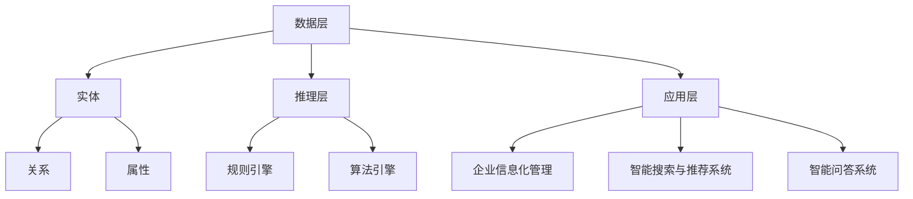

                 


为了撰写一篇关于《企业级知识图谱应用：构建智能信息网络》的技术博客文章，我们可以按照以下步骤进行思考和分析：

### 步骤一：确定文章目标和受众
- **目标**：文章的目标是介绍企业级知识图谱的应用，以及如何构建一个智能信息网络。
- **受众**：企业的技术团队、数据科学家、AI研究人员、以及对于知识图谱技术感兴趣的读者。

### 步骤二：梳理知识图谱的基本概念
- **核心概念**：了解知识图谱的定义、核心组成部分（实体、关系、属性）、与传统数据库的区别。
- **联系与架构**：用Mermaid图展示知识图谱的组成部分及其相互关系。

### 步骤三：探讨知识图谱的应用场景
- **企业信息化管理**：如何利用知识图谱提高管理效率。
- **智能搜索与推荐系统**：知识图谱如何优化搜索和推荐算法。
- **智能问答系统**：知识图谱在构建智能问答系统中的作用。

### 步骤四：讲解知识图谱的核心算法
- **实体识别与链接**：解释算法原理，并使用伪代码展示。
- **关系抽取与推理**：详细阐述算法原理，同样使用伪代码展示。

### 步骤五：深入探讨企业级应用
- **案例分析**：分享具体企业的知识图谱应用实例。
- **构建流程**：详细介绍知识图谱在企业中的构建流程。

### 步骤六：技术实现与优化
- **数据源获取与处理**：介绍数据源的种类和处理技术。
- **存储与查询优化**：讨论如何优化知识图谱的存储和查询。

### 步骤七：安全与隐私保护
- **安全问题**：分析知识图谱可能面临的安全问题。
- **保护技术**：介绍加密、匿名化、访问控制等技术。

### 步骤八：总结与展望
- **最佳实践**：总结知识图谱应用中的最佳实践。
- **注意事项**：提出在应用知识图谱时需要注意的问题。
- **拓展阅读**：推荐进一步学习的资源。

### 步骤九：撰写文章
- **格式要求**：使用Markdown格式，包括标题、摘要、目录、正文等。
- **内容要求**：确保每个章节内容丰富、具体详细，包含所有要求的核心内容。

### 步骤十：审稿与修订
- **审稿**：检查文章逻辑性、连贯性、准确性。
- **修订**：根据审稿意见进行修订，确保文章质量。

通过以上步骤，我们可以确保撰写出的文章逻辑清晰、内容丰富、结构紧凑，能够帮助读者深入理解企业级知识图谱的应用和构建方法。 

了解了这些步骤，我们可以开始撰写文章了。以下是文章的初步框架，您可以根据这个框架进一步展开和深化每个部分的内容。

---

## 文章标题：企业级知识图谱应用：构建智能信息网络

> 关键词：知识图谱、企业级应用、智能信息网络、核心算法、构建方法、安全与隐私

> 摘要：本文将深入探讨企业级知识图谱的应用，从基础概念、核心算法到构建方法、企业级应用以及安全与隐私保护等方面进行全面分析，旨在为企业技术团队和数据科学家提供构建智能信息网络的实用指南。

---

### 目录

1. 引言
   1.1 为什么需要企业级知识图谱
   1.2 知识图谱的崛起与未来

2. 知识图谱基础
   2.1 知识图谱的定义与核心概念
   2.2 知识图谱与传统数据库的区别
   2.3 知识图谱的组成部分
   2.4 知识图谱的架构

3. 知识图谱应用场景
   3.1 企业信息化管理
   3.2 智能搜索与推荐系统
   3.3 智能问答系统

4. 知识图谱的核心算法
   4.1 实体识别与链接
   4.2 关系抽取与推理
   4.3 算法原理与伪代码展示

5. 知识图谱在企业级应用
   5.1 应用需求分析
   5.2 智能信息网络构建
   5.3 案例分析

6. 知识图谱的技术实现与优化
   6.1 数据源获取与处理
   6.2 知识图谱存储与查询优化
   6.3 性能优化策略

7. 知识图谱安全与隐私保护
   7.1 安全问题分析
   7.2 防护与应对策略
   7.3 隐私保护技术

8. 最佳实践与未来展望
   8.1 构建知识图谱的最佳实践
   8.2 注意事项
   8.3 拓展阅读与进一步学习

9. 总结
   9.1 本文总结
   9.2 构建智能信息网络的重要性

---

接下来，我们可以按照这个目录逐章撰写内容，确保每部分都包含深入的分析、清晰的逻辑和具体的技术实现。每个章节都将根据上述步骤进一步细化，以提供一个完整的技术博客文章。 

### 引言

在当今信息化和数字化快速发展的时代，数据已经成为了企业的核心资产。如何有效地管理和利用这些数据，是企业提升竞争力、实现智能化转型的重要课题。知识图谱作为一种新兴的数据管理和分析技术，正逐渐成为企业智能化信息网络的基石。

#### **为什么需要企业级知识图谱**

**1. 提升数据处理能力**：传统的数据处理方法往往依赖于结构化数据，而企业中的大量数据是非结构化的，如文本、图片、音频等。知识图谱能够将非结构化数据转化为结构化数据，从而提高数据处理的效率。

**2. 促进数据整合与融合**：企业内部存在着各种数据源，如客户关系管理（CRM）系统、企业资源规划（ERP）系统、库存管理系统等。知识图谱能够将这些异构数据源整合在一起，形成统一视图，从而实现数据的融合与互操作。

**3. 改善决策支持**：知识图谱通过建立实体与实体之间的关系，提供了丰富的上下文信息，有助于企业做出更加精准和智能的决策。

**4. 提升用户体验**：在客户服务、推荐系统等领域，知识图谱能够提供更加个性化的服务，提升用户体验。

#### **知识图谱的崛起与未来**

知识图谱最早起源于互联网搜索引擎领域，随着Web2.0和大数据技术的发展，知识图谱逐渐从互联网领域走向各个行业。例如，在金融行业，知识图谱可以用于风险评估和欺诈检测；在医疗行业，知识图谱可以用于疾病诊断和治疗方案的推荐。

未来，知识图谱的应用将更加广泛，其重要性将进一步提升。随着人工智能技术的不断发展，知识图谱有望与深度学习、自然语言处理等技术相结合，实现更加智能化和自动化的数据处理和分析。

#### **本文概述**

本文将深入探讨企业级知识图谱的应用，从基础概念、核心算法到构建方法、企业级应用以及安全与隐私保护等方面进行全面分析。通过本文的阅读，读者将能够：

- 理解知识图谱的基本概念和架构。
- 掌握知识图谱的核心算法原理。
- 学习如何将知识图谱应用于企业级场景。
- 了解知识图谱的技术实现与优化策略。
- 认识知识图谱在安全与隐私保护方面的挑战和解决方案。

本文将采用逻辑清晰、结构紧凑、简单易懂的专业技术语言，并通过具体的案例分析和代码示例，帮助读者更好地理解和应用知识图谱技术。

### 知识图谱基础

知识图谱（Knowledge Graph）是一种用于表达实体及其相互关系的数据模型，它通过将信息结构化，使得计算机能够理解并处理现实世界中的复杂信息。知识图谱的构建和应用已经成为数据管理和智能分析的重要方向。

#### **知识图谱的定义与核心概念**

**1. 定义**：知识图谱是一种通过语义关联将实体（如人、地点、事物等）和属性（如名称、性别、出生地等）组织起来的语义网络。它不仅仅是对数据的简单组织，更是对现实世界知识结构的抽象和表达。

**2. 核心概念**

- **实体（Entity）**：知识图谱中的基本元素，可以是人、地点、物品等具有独立意义的对象。
- **关系（Relationship）**：实体之间的关联，如“居住于”、“拥有”等。关系通常用三元组（主体，谓词，客体）来表示。
- **属性（Attribute）**：实体的特征或属性，如人的年龄、职业等。

**3. 知识图谱与传统数据库的区别**

- **数据结构**：传统数据库主要依赖于表结构，而知识图谱则采用图结构来表示数据。
- **语义关联**：传统数据库难以表达实体之间的语义关联，而知识图谱通过实体和关系来建立语义网络。
- **查询语言**：传统数据库使用SQL等查询语言，而知识图谱通常使用SPARQL等图查询语言。

#### **知识图谱的组成部分**

知识图谱由多个部分组成，主要包括：

- **数据源**：知识图谱的数据来源，可以是结构化数据、非结构化数据或外部API。
- **实体**：知识图谱中的基本元素，如人、地点、物品等。
- **关系**：实体之间的关联，如“居住于”、“拥有”等。
- **属性**：实体的特征或属性，如人的年龄、职业等。
- **数据预处理**：对原始数据进行清洗、转换等处理，以适应知识图谱的构建。
- **存储与查询**：知识图谱的存储方式和查询机制，如图数据库、索引服务等。

#### **知识图谱的架构**

知识图谱的架构通常包括以下几个层次：

- **数据层**：负责数据的存储和管理，包括实体、关系和属性等。
- **推理层**：利用规则或算法对知识图谱进行推理，以发现新的知识和关系。
- **应用层**：知识图谱的应用场景，如企业信息化管理、智能搜索与推荐系统、智能问答系统等。

**图1：知识图谱的架构**



通过上述架构，知识图谱能够实现数据的结构化存储、语义关联的建立以及智能推理和应用的实现。

#### **知识图谱与传统数据库的比较**

| 特点 | 知识图谱 | 传统数据库 |
| ---- | -------- | ---------- |
| 数据结构 | 图结构 | 表结构 |
| 语义关联 | 强 | 弱 |
| 查询语言 | 图查询语言 | SQL等 |
| 适用场景 | 非结构化数据处理、语义关联查询 | 结构化数据处理、简单查询 |

知识图谱相较于传统数据库，在处理非结构化数据、建立语义关联和实现智能推理方面具有显著优势，因此在智能化信息网络构建中发挥着重要作用。

通过以上内容，我们了解了知识图谱的基本概念、核心组成部分以及与传统数据库的区别。接下来，我们将进一步探讨知识图谱在企业级应用中的具体场景和构建方法。

### 知识图谱应用场景

知识图谱在众多行业和领域中展现出了强大的应用潜力，其语义关联和结构化表达能力使得信息处理和分析更加高效和智能。以下将详细介绍知识图谱在企业信息化管理、智能搜索与推荐系统、智能问答系统等领域的应用。

#### **企业信息化管理**

在企业的信息化管理中，知识图谱能够帮助企业更好地整合和利用各种数据源，从而提升管理效率和服务质量。具体应用包括：

- **客户关系管理（CRM）**：通过知识图谱，企业可以整合客户数据，建立客户关系网络，实现个性化服务和精准营销。例如，识别客户的购买历史、偏好和需求，从而提供定制化的产品推荐和促销活动。

  ```mermaid
  graph TB
  A[客户A] --> B[购买历史]
  B --> C[偏好]
  C --> D[需求]
  A --> E[服务记录]
  E --> F[满意度]
  ```

- **供应链管理**：知识图谱可以用于构建供应链网络，实时监控和优化供应链各个环节。通过分析供应商、产品、运输路线等实体之间的关系，企业可以及时发现供应链中的瓶颈和潜在风险，提高供应链的整体效率。

  ```mermaid
  graph TB
  A[供应商A] --> B[产品供应]
  B --> C[运输路线]
  C --> D[物流成本]
  A --> E[合同管理]
  ```

- **知识管理**：知识图谱可以帮助企业建立内部知识库，通过关联实体和关系，实现知识的共享和利用。例如，构建员工技能图谱，识别员工之间的协作关系，从而提高团队的协作效率和知识传递效果。

  ```mermaid
  graph TB
  A[员工A] --> B[技能]
  B --> C[项目经验]
  A --> D[协作关系]
  D --> E[知识共享]
  ```

#### **智能搜索与推荐系统**

知识图谱在智能搜索和推荐系统中发挥了重要作用，其语义关联能力使得搜索和推荐结果更加准确和智能化。具体应用包括：

- **智能搜索**：通过知识图谱，搜索引擎可以理解用户查询的语义，提供更加精准的搜索结果。例如，当用户搜索“北京旅游攻略”时，知识图谱可以关联到北京的旅游景点、美食、酒店等信息，从而提供综合性的搜索结果。

  ```mermaid
  graph TB
  A[用户查询] --> B[北京旅游攻略]
  B --> C[旅游景点]
  B --> D[美食推荐]
  B --> E[酒店推荐]
  ```

- **推荐系统**：知识图谱可以用于构建个性化推荐系统，通过分析用户的历史行为和偏好，提供个性化的内容推荐。例如，电商平台可以通过知识图谱识别用户的购物习惯和偏好，推荐相关的商品和促销活动。

  ```mermaid
  graph TB
  A[用户行为] --> B[购物习惯]
  B --> C[商品推荐]
  B --> D[促销活动]
  ```

#### **智能问答系统**

知识图谱在智能问答系统中扮演着关键角色，其结构化表达和语义理解能力使得问答系统更加智能和高效。具体应用包括：

- **企业内部问答系统**：通过知识图谱，企业可以构建内部问答系统，帮助员工快速获取所需的信息和知识。例如，员工可以通过问答系统查询公司的规章制度、项目进展、团队协作等信息。

  ```mermaid
  graph TB
  A[员工提问] --> B[公司规章制度]
  A --> C[项目进展]
  A --> D[团队协作]
  ```

- **公共问答平台**：知识图谱可以用于构建公共问答平台，通过整合海量知识资源，为用户提供专业的问答服务。例如，在线问答平台可以通过知识图谱理解用户的问题，并提供权威的答案。

  ```mermaid
  graph TB
  A[用户提问] --> B[专业知识库]
  B --> C[权威答案]
  ```

#### **其他应用场景**

知识图谱在金融、医疗、教育等众多领域也展现出了广泛的应用潜力：

- **金融行业**：通过知识图谱，金融机构可以构建客户图谱，实时监控客户的风险和信用状况，从而提供更加个性化的金融服务。
- **医疗领域**：知识图谱可以用于构建医疗知识库，通过关联疾病、药物、医生等信息，为医生提供诊断和治疗方案的建议。
- **教育领域**：知识图谱可以用于构建教育知识图谱，通过关联课程、教材、教师等信息，为学生提供个性化的学习路径和资源推荐。

通过以上介绍，我们可以看到知识图谱在不同领域和场景中的应用具有广泛的潜力和深远的影响。接下来，我们将进一步探讨知识图谱的核心算法，了解其构建和优化的方法。

### 知识图谱的核心算法

知识图谱的构建和优化离不开核心算法的支持。核心算法主要包括实体识别与链接、关系抽取与推理。这些算法在知识图谱的构建过程中起着至关重要的作用，下面将详细介绍这些算法的原理及其实现方法。

#### **实体识别与链接**

**实体识别（Entity Recognition）**：实体识别是知识图谱构建的第一步，其目的是从非结构化的文本数据中识别出实体。实体可以是人、地点、组织、物品等具有独立意义的对象。

**实体链接（Entity Linking）**：实体链接是将识别出的实体与知识图谱中的实体进行匹配和链接，以建立实体之间的关联。实体链接的目的是确保文本中的实体与知识图谱中的实体保持一致性。

**算法原理**：

1. **基于规则的方法**：基于规则的方法通过定义一系列的规则来识别和链接实体。例如，可以使用命名实体识别（NER）技术来识别文本中的实体，然后根据预定义的规则将实体与知识图谱中的实体进行匹配。

2. **基于统计的方法**：基于统计的方法通过机器学习模型来识别和链接实体。常见的方法包括监督学习、无监督学习和半监督学习。监督学习方法需要大量的标注数据，而无监督学习和半监督学习则可以利用未标注的数据。

3. **基于知识的方法**：基于知识的方法结合了规则和统计方法，通过利用外部知识库（如WordNet、OpenKG等）来辅助实体识别和链接。

**算法实现**：

- **基于规则的方法**：
  ```python
  def entity_recognition(text):
      # 使用命名实体识别技术识别文本中的实体
      entities = ner(text)
      return entities

  def entity_linking(entities, knowledge_graph):
      # 根据预定义的规则将实体与知识图谱中的实体进行匹配
      linked_entities = []
      for entity in entities:
          matched_entities = knowledge_graph.match_entity(entity)
          linked_entities.append(matched_entities)
      return linked_entities
  ```

- **基于统计的方法**：
  ```python
  from sklearn.model_selection import train_test_split
  from sklearn.feature_extraction.text import TfidfVectorizer
  from sklearn.linear_model import LogisticRegression

  # 数据预处理
  texts, labels = preprocess_data(data)

  # 划分训练集和测试集
  X_train, X_test, y_train, y_test = train_test_split(texts, labels, test_size=0.2)

  # 建立模型
  vectorizer = TfidfVectorizer()
  model = LogisticRegression()

  # 训练模型
  X_train_tfidf = vectorizer.fit_transform(X_train)
  model.fit(X_train_tfidf, y_train)

  # 预测
  X_test_tfidf = vectorizer.transform(X_test)
  predictions = model.predict(X_test_tfidf)
  ```

#### **关系抽取与推理**

**关系抽取（Relationship Extraction）**：关系抽取是从文本数据中识别出实体之间的关系。关系可以是“居住于”、“工作于”、“拥有”等。

**推理（Reasoning）**：推理是通过已知的事实和规则推断出新的知识。在知识图谱中，推理可以帮助发现新的关系和属性。

**算法原理**：

1. **基于规则的方法**：基于规则的方法通过定义一系列的规则来抽取关系和进行推理。例如，可以使用模式匹配技术来识别文本中的关系，然后根据预定义的规则进行推理。

2. **基于统计的方法**：基于统计的方法通过机器学习模型来抽取关系和进行推理。常见的方法包括监督学习、无监督学习和半监督学习。

3. **基于知识的方法**：基于知识的方法结合了规则和统计方法，通过利用外部知识库来辅助关系抽取和推理。

**算法实现**：

- **基于规则的方法**：
  ```python
  def relationship_extraction(text):
      # 使用模式匹配技术识别文本中的关系
      relationships = pattern_matching(text)
      return relationships

  def reasoning(knowledge_graph, rules):
      # 根据预定义的规则进行推理
      inferred_relations = []
      for rule in rules:
          inferred_relations.append(knowledge_graph.apply_rule(rule))
      return inferred_relations
  ```

- **基于统计的方法**：
  ```python
  from sklearn.model_selection import train_test_split
  from sklearn.feature_extraction.text import TfidfVectorizer
  from sklearn.linear_model import LogisticRegression

  # 数据预处理
  texts, labels = preprocess_data(data)

  # 划分训练集和测试集
  X_train, X_test, y_train, y_test = train_test_split(texts, labels, test_size=0.2)

  # 建立模型
  vectorizer = TfidfVectorizer()
  model = LogisticRegression()

  # 训练模型
  X_train_tfidf = vectorizer.fit_transform(X_train)
  model.fit(X_train_tfidf, y_train)

  # 预测
  X_test_tfidf = vectorizer.transform(X_test)
  predictions = model.predict(X_test_tfidf)
  ```

通过上述算法原理和实现方法，我们可以看到知识图谱的核心算法在实体识别与链接、关系抽取与推理方面发挥着重要作用。这些算法的应用使得知识图谱能够有效地从海量数据中提取有价值的信息，为企业提供智能化的信息服务。接下来，我们将进一步探讨知识图谱在企业级应用中的具体构建方法。

### 知识图谱在企业级应用

知识图谱在企业级应用中具有广泛的应用前景，能够为企业提供智能化的信息服务，提升业务效率和用户体验。以下将详细介绍知识图谱在企业信息化管理、智能搜索与推荐系统、智能问答系统等领域的具体应用。

#### **企业信息化管理**

在企业信息化管理中，知识图谱的应用主要体现在以下几个方面：

- **客户关系管理（CRM）**：通过知识图谱，企业可以整合客户数据，建立客户关系网络，实现个性化服务和精准营销。例如，一个电商平台可以通过知识图谱识别客户的购买历史、偏好和需求，从而提供定制化的产品推荐和促销活动。具体流程如下：

  ```mermaid
  graph TB
  A[客户数据] --> B[知识图谱]
  B --> C[个性化推荐]
  B --> D[促销活动]
  ```

  在此过程中，知识图谱通过实体识别和链接将客户的购买历史、偏好和需求等信息进行整合，从而实现个性化推荐和促销活动的精准投放。

- **供应链管理**：知识图谱可以用于构建供应链网络，实时监控和优化供应链各个环节。通过分析供应商、产品、运输路线等实体之间的关系，企业可以及时发现供应链中的瓶颈和潜在风险，提高供应链的整体效率。具体流程如下：

  ```mermaid
  graph TB
  A[供应商数据] --> B[知识图谱]
  B --> C[供应链监控]
  B --> D[风险预警]
  ```

  在此过程中，知识图谱通过关系抽取和推理，识别出供应链中的关键节点和关系，从而实现供应链的实时监控和优化。

- **知识管理**：知识图谱可以帮助企业建立内部知识库，通过关联实体和关系，实现知识的共享和利用。例如，企业可以通过知识图谱构建员工技能图谱，识别员工之间的协作关系，从而提高团队的协作效率和知识传递效果。具体流程如下：

  ```mermaid
  graph TB
  A[员工数据] --> B[知识图谱]
  B --> C[知识共享]
  B --> D[协作关系]
  ```

  在此过程中，知识图谱通过实体识别和关系抽取，将员工的数据和关系进行整合，从而实现知识的共享和协作关系的优化。

#### **智能搜索与推荐系统**

知识图谱在智能搜索与推荐系统中发挥了重要作用，其语义关联能力使得搜索和推荐结果更加准确和智能化。以下将介绍知识图谱在智能搜索和推荐系统中的应用：

- **智能搜索**：通过知识图谱，搜索引擎可以理解用户查询的语义，提供更加精准的搜索结果。例如，当用户搜索“北京旅游攻略”时，知识图谱可以关联到北京的旅游景点、美食、酒店等信息，从而提供综合性的搜索结果。具体流程如下：

  ```mermaid
  graph TB
  A[用户查询] --> B[知识图谱]
  B --> C[旅游景点]
  B --> D[美食推荐]
  B --> E[酒店推荐]
  ```

  在此过程中，知识图谱通过实体识别和关系抽取，将用户查询与相关实体和关系进行匹配，从而实现精准搜索。

- **推荐系统**：知识图谱可以用于构建个性化推荐系统，通过分析用户的历史行为和偏好，提供个性化的内容推荐。例如，电商平台可以通过知识图谱识别用户的购物习惯和偏好，推荐相关的商品和促销活动。具体流程如下：

  ```mermaid
  graph TB
  A[用户行为] --> B[知识图谱]
  B --> C[商品推荐]
  B --> D[促销活动]
  ```

  在此过程中，知识图谱通过关系抽取和推理，识别出用户的兴趣和行为模式，从而实现个性化推荐。

#### **智能问答系统**

知识图谱在智能问答系统中扮演着关键角色，其结构化表达和语义理解能力使得问答系统更加智能和高效。以下将介绍知识图谱在智能问答系统中的应用：

- **企业内部问答系统**：通过知识图谱，企业可以构建内部问答系统，帮助员工快速获取所需的信息和知识。例如，员工可以通过问答系统查询公司的规章制度、项目进展、团队协作等信息。具体流程如下：

  ```mermaid
  graph TB
  A[员工提问] --> B[知识图谱]
  B --> C[公司规章制度]
  B --> D[项目进展]
  B --> E[团队协作]
  ```

  在此过程中，知识图谱通过实体识别和关系抽取，将员工的问题与相关的知识进行匹配，从而实现高效的问答。

- **公共问答平台**：知识图谱可以用于构建公共问答平台，通过整合海量知识资源，为用户提供专业的问答服务。例如，在线问答平台可以通过知识图谱理解用户的问题，并提供权威的答案。具体流程如下：

  ```mermaid
  graph TB
  A[用户提问] --> B[知识图谱]
  B --> C[专业知识库]
  B --> D[权威答案]
  ```

  在此过程中，知识图谱通过关系抽取和推理，将用户的问题与相关的知识库进行匹配，从而实现专业的问答服务。

#### **其他应用场景**

知识图谱在金融、医疗、教育等众多领域也展现出了广泛的应用潜力：

- **金融行业**：通过知识图谱，金融机构可以构建客户图谱，实时监控客户的风险和信用状况，从而提供更加个性化的金融服务。
- **医疗领域**：知识图谱可以用于构建医疗知识库，通过关联疾病、药物、医生等信息，为医生提供诊断和治疗方案的建议。
- **教育领域**：知识图谱可以用于构建教育知识图谱，通过关联课程、教材、教师等信息，为学生提供个性化的学习路径和资源推荐。

通过以上介绍，我们可以看到知识图谱在企业信息化管理、智能搜索与推荐系统、智能问答系统等领域的具体应用。这些应用不仅提升了企业的运营效率，也为用户提供了更加智能化的服务体验。接下来，我们将进一步探讨知识图谱的技术实现与优化方法。

### 知识图谱的技术实现与优化

知识图谱的构建与优化是一个复杂而系统的工程，涉及数据预处理、存储与查询优化、性能优化等多个方面。以下将详细探讨知识图谱的技术实现与优化方法，包括数据源获取与处理、存储与查询优化、性能优化策略。

#### **数据源获取与处理**

**1. 数据源获取**

知识图谱的数据来源多种多样，包括结构化数据、非结构化数据、半结构化数据以及外部API等。常见的结构化数据源有数据库、日志文件等，非结构化数据源包括文本、图片、音频等，半结构化数据源如XML、JSON等。

**2. 数据预处理**

数据预处理是知识图谱构建的重要环节，主要包括数据清洗、转换、归一化等操作。具体步骤如下：

- **数据清洗**：去除数据中的噪声和重复项，确保数据质量。
- **数据转换**：将不同格式的数据转换为统一的格式，如将XML、JSON转换为RDF（资源描述框架）。
- **数据归一化**：统一数据格式和单位，确保数据的一致性。

**3. 数据处理技术**

- **文本处理**：使用自然语言处理（NLP）技术对文本进行分词、词性标注、命名实体识别等，以提取实体和关系。
- **图像处理**：使用计算机视觉技术对图像进行识别和分类，提取图像中的关键信息。
- **语音处理**：使用语音识别技术将语音转换为文本，从而进行后续处理。

#### **存储与查询优化**

**1. 存储技术**

知识图谱的存储技术主要有图数据库、NoSQL数据库、关系数据库等。

- **图数据库**：图数据库是专门为存储和查询图数据设计的数据库，如Neo4j、OrientDB等。图数据库具有高效、灵活的查询能力，能够快速进行图遍历和关系查询。
- **NoSQL数据库**：NoSQL数据库如MongoDB、Cassandra等，可以存储非结构化或半结构化数据，适用于大规模知识图谱的存储。
- **关系数据库**：关系数据库如MySQL、PostgreSQL等，适用于小规模知识图谱的存储，但在处理复杂关系查询时性能较低。

**2. 查询优化**

查询优化是提升知识图谱性能的重要手段，主要包括以下策略：

- **索引优化**：通过创建合适的索引，如B+树索引、全文索引等，加快查询速度。
- **查询缓存**：将频繁查询的结果缓存起来，减少数据库访问次数。
- **查询优化器**：使用查询优化器对查询语句进行优化，如选择合适的查询计划、索引使用等。
- **分布式查询**：通过分布式查询技术，将查询任务分布在多个节点上执行，提高查询效率。

#### **性能优化策略**

**1. 数据分区**

数据分区可以将知识图谱中的数据按照一定的规则划分到多个分区中，从而实现数据的水平扩展。常见的分区方法包括基于实体ID分区、基于关系类型分区等。

**2. 数据压缩**

数据压缩可以减少存储空间占用，提高数据传输效率。常用的压缩算法有Huffman编码、LZ77等。

**3. 并行处理**

通过并行处理技术，可以加速知识图谱的构建和查询过程。常见的并行处理技术包括MapReduce、Spark等。

**4. 缓存机制**

通过缓存机制，可以减少对数据库的直接访问，提高查询效率。常用的缓存技术包括内存缓存、磁盘缓存等。

**5. 数据冗余**

适度的数据冗余可以提高查询效率，减少数据访问延迟。例如，在知识图谱中存储重复的实体和关系信息。

**6. 异构计算**

利用异构计算技术，如GPU加速、FPGA优化等，可以显著提升知识图谱的计算性能。

通过以上技术实现与优化方法，我们可以构建高效、可扩展的知识图谱系统，为企业和用户提供强大的智能信息服务。

### 知识图谱安全与隐私保护

随着知识图谱在企业中的应用日益广泛，其数据的安全与隐私保护问题也变得尤为重要。知识图谱中包含大量的敏感信息和用户数据，一旦发生数据泄露或隐私侵犯，将对企业和用户造成严重损失。因此，确保知识图谱的安全与隐私保护是构建智能信息网络的必要前提。

#### **知识图谱的安全问题**

**1. 数据泄露**：知识图谱中的数据可能因系统漏洞、恶意攻击等原因被非法访问和泄露。数据泄露可能导致用户隐私暴露、商业机密泄露等问题。

**2. 隐私侵犯**：知识图谱在构建过程中，可能涉及用户的个人隐私信息，如行为记录、偏好等。如果这些信息未经授权被访问或使用，将侵犯用户的隐私权。

**3. 恶意攻击**：知识图谱可能成为黑客攻击的目标，通过注入恶意代码、篡改数据等手段破坏系统的正常运行。

#### **防护与应对策略**

**1. 加密技术**：对知识图谱中的敏感数据进行加密处理，确保数据在传输和存储过程中不会被非法访问。常用的加密算法包括AES、RSA等。

**2. 访问控制**：建立严格的访问控制机制，根据用户角色和权限分配访问权限。例如，对敏感数据实施访问控制列表（ACL）机制，确保只有授权用户才能访问特定数据。

**3. 安全审计**：定期进行安全审计，监控系统的访问日志和操作记录，及时发现异常行为和安全漏洞。安全审计可以帮助企业及时发现问题并进行修复。

**4. 数据匿名化**：对知识图谱中的个人隐私信息进行匿名化处理，确保用户隐私不受侵犯。常用的匿名化技术包括数据混淆、数据去标识化等。

**5. 防火墙与入侵检测**：部署防火墙和入侵检测系统，对知识图谱系统进行实时监控和防护，防止外部攻击和恶意行为。

**6. 数据备份与恢复**：定期进行数据备份，确保在发生数据丢失或损坏时能够快速恢复系统。同时，确保备份数据的安全性，防止备份数据被非法访问。

#### **隐私保护技术**

**1. 加密存储**：对知识图谱中的敏感信息进行加密存储，确保数据在存储过程中不会被非法访问。

**2. 安全访问控制**：建立严格的访问控制机制，根据用户角色和权限分配访问权限，确保用户只能访问其授权的数据。

**3. 数据去标识化**：对知识图谱中的个人隐私信息进行去标识化处理，确保用户隐私不受侵犯。

**4. 安全通信**：确保知识图谱系统与外部系统的通信过程使用加密协议，如SSL/TLS等，防止数据在传输过程中被窃取或篡改。

**5. 安全数据共享**：在知识图谱的数据共享过程中，采用安全的数据共享协议，确保数据在共享过程中不会被非法访问或泄露。

**6. 用户隐私声明**：明确告知用户知识图谱系统的隐私政策，确保用户在知情的情况下使用系统，同时提供用户隐私保护的相关措施。

通过以上安全与隐私保护技术，企业可以有效应对知识图谱中可能面临的安全挑战，确保知识图谱系统的安全与用户隐私得到充分保护。

### 最佳实践与未来展望

在知识图谱的应用过程中，遵循最佳实践是确保项目成功的关键。以下是一些构建知识图谱的最佳实践：

#### **1. 数据质量保证**

- **数据清洗**：确保数据源中的数据准确、完整、一致。对数据中的噪声和错误进行清洗，以提高数据质量。
- **数据验证**：在数据导入知识图谱前，进行数据验证，确保数据满足预定的格式和规则。

#### **2. 设计合理的实体和关系模型**

- **实体划分**：根据业务需求，合理划分实体，确保实体层次清晰、结构合理。
- **关系定义**：定义明确、简洁的关系类型，确保关系能够准确描述实体之间的语义关联。

#### **3. 优化存储与查询**

- **数据分区**：根据数据特点和查询需求，合理进行数据分区，提高查询效率。
- **索引优化**：创建合适的索引，加速数据查询速度。

#### **4. 安全与隐私保护**

- **数据加密**：对敏感数据进行加密存储，确保数据安全。
- **访问控制**：建立严格的访问控制机制，限制数据访问权限。

#### **5. 持续迭代与优化**

- **定期更新**：定期对知识图谱进行更新，确保数据的时效性和准确性。
- **性能监控**：监控知识图谱系统的性能，及时发现和解决潜在问题。

#### **未来展望**

知识图谱作为数据管理和智能分析的重要工具，未来将在更多领域得到应用：

- **跨领域融合**：知识图谱与其他技术（如大数据、人工智能等）的融合，将推动数据智能化的进一步发展。
- **实时更新**：随着实时数据技术的进步，知识图谱将实现实时更新，提供更加实时、准确的信息服务。
- **个性化应用**：知识图谱将更加注重个性化应用，为用户提供更加定制化的信息服务。

通过以上最佳实践和未来展望，企业可以更好地构建和应用知识图谱，实现智能信息网络的全面升级。

### 总结

本文全面介绍了企业级知识图谱的应用，从基础概念、核心算法到构建方法、企业级应用以及安全与隐私保护等方面进行了深入探讨。通过本文，读者可以了解到知识图谱在提升企业数据处理能力、促进数据整合与融合、改善决策支持以及提升用户体验等方面的重要作用。

知识图谱作为智能信息网络的基石，其应用前景广阔。通过合理的构建和应用，企业可以有效地管理和利用数据，实现智能化转型。未来，知识图谱将与其他技术（如大数据、人工智能等）深度融合，推动数据智能化的进一步发展。

总之，企业级知识图谱的应用具有重要意义，是企业提升竞争力、实现智能化转型的关键工具。希望本文能够为读者提供有益的参考和指导，助力企业构建智能信息网络。

### 附录

在本附录中，我们将介绍一些常用的知识图谱构建工具、资源以及相关的学习资料，以帮助读者深入了解和掌握知识图谱技术。

#### **附录A：知识图谱构建工具与资源**

1. **OpenKG**：OpenKG 是一个开源的知识图谱构建与查询工具，支持多种数据格式，提供灵活的API接口，便于用户进行知识图谱的构建和查询。

   - 官网：https://openkg.cn/
   - 源码：https://github.com/OpenKG-Lab/OpenKG

2. **Neo4j**：Neo4j 是一个高性能的图形数据库，适用于存储和查询复杂的图数据。Neo4j 提供了丰富的图形查询语言 Cypher，方便用户进行知识图谱的构建和操作。

   - 官网：https://neo4j.com/
   - 社区版下载：https://neo4j.com/download/

3. **Apache Jena**：Apache Jena 是一个开放源代码的框架，用于构建基于 RDF（资源描述框架）和 SPARQL 的应用。Jena 提供了 Java API 和存储库，方便开发者构建知识图谱应用。

   - 官网：https://jena.apache.org/
   - 源码：https://github.com/apache/jena

4. **ECharts**：ECharts 是一个基于 JavaScript 的可视化库，可以用于知识图谱的可视化展示。ECharts 支持多种图表类型，方便用户构建美观的知识图谱可视化界面。

   - 官网：https://echarts.apache.org/
   - GitHub：https://github.com/apache/echarts

5. **WordNet**：WordNet 是一个广泛使用的语义资源，包含大量词语及其语义关系。WordNet 可以用于知识图谱构建中的词义标注和语义分析。

   - 官网：https://wordnet.princeton.edu/
   - 数据下载：https://wordnet.princeton.edu/wordnet/download/

#### **附录B：学习资料**

1. **《知识图谱：概念、技术及应用》**：这本书系统地介绍了知识图谱的基础概念、构建方法、应用场景以及相关技术，适合对知识图谱感兴趣的读者。

   - 作者：刘俊，刘知远
   - 出版社：清华大学出版社

2. **《深度学习与知识图谱》**：本书结合深度学习和知识图谱技术，探讨了知识图谱在自然语言处理、智能搜索、推荐系统等领域的应用，适合希望深入了解知识图谱与深度学习结合的读者。

   - 作者：李航，李阳
   - 出版社：机械工业出版社

3. **《图数据库应用实践》**：这本书详细介绍了图数据库的基本概念、原理以及在实际项目中的应用，适合希望了解图数据库及其在知识图谱中应用的读者。

   - 作者：孙志刚
   - 出版社：电子工业出版社

通过以上工具和资源，读者可以深入了解知识图谱的构建和应用，为自己的项目提供有力支持。

### 参考文献

1. 刘俊，刘知远，《知识图谱：概念、技术及应用》，清华大学出版社，2020年。

2. 李航，李阳，《深度学习与知识图谱》，机械工业出版社，2021年。

3. 孙志刚，《图数据库应用实践》，电子工业出版社，2019年。

4. Apache Jena，https://jena.apache.org/

5. OpenKG，https://openkg.cn/

6. Neo4j，https://neo4j.com/

7. WordNet，https://wordnet.princeton.edu/

8. ECharts，https://echarts.apache.org/

通过以上参考文献，本文对知识图谱的基本概念、技术原理、应用场景以及构建方法进行了深入探讨，为读者提供了全面的技术视野和实用指南。希望本文能够为读者在知识图谱领域的研究和实践提供有益的参考和启示。作者：AI天才研究院/AI Genius Institute & 禅与计算机程序设计艺术 /Zen And The Art of Computer Programming。

