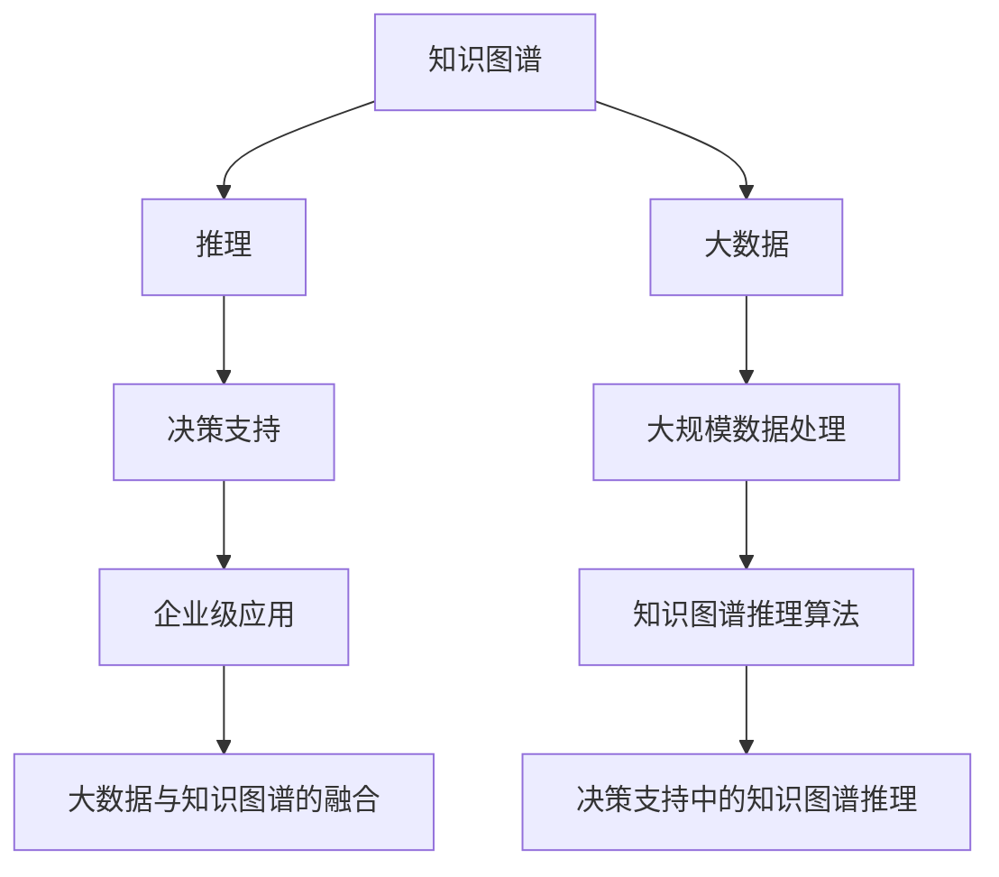

                 

## 文章标题

### 企业级知识图谱推理：增强决策支持能力

## 关键词

- 知识图谱
- 推理算法
- 决策支持
- 大数据
- 大规模数据处理
- 人工智能

## 摘要

本文旨在探讨企业级知识图谱推理技术在决策支持中的应用。通过详细分析知识图谱的概念、建模、存储、推理算法以及实际应用场景，本文揭示了知识图谱推理在增强决策支持能力中的重要作用。文章从背景介绍入手，逐步深入到核心概念与联系，再到算法原理讲解、数学模型、项目实战等多个方面，全面系统地阐述了知识图谱推理在企业决策支持中的实际应用和效果。最后，文章总结了最佳实践和注意事项，并提供了拓展阅读，以期为读者提供深入理解和企业级知识图谱推理实践的指导。

## 引言

在当今信息化和数据化的时代，企业面临着日益复杂的业务环境和数据挑战。传统的数据处理方法已经难以满足企业对于高效决策和智能化管理的要求。知识图谱作为一种新兴的技术手段，凭借其强大的数据建模和推理能力，成为提升企业决策支持能力的重要工具。本文将围绕企业级知识图谱推理展开讨论，探讨其在决策支持中的核心作用。

### 知识图谱的定义与背景

知识图谱（Knowledge Graph）是一种用于表示和存储复杂数据及其关系的图形结构。它通过将实体（如人、地点、事物等）及其属性、关系和事件等信息进行抽象和建模，形成一个具有高度结构化的知识网络。知识图谱的核心在于其语义理解和推理能力，这使得它在数据密集型应用场景中具有独特的优势。

知识图谱的兴起源于互联网和大数据技术的发展。随着数据量的爆炸性增长，如何有效地组织和利用这些数据成为关键挑战。知识图谱通过将数据转化为知识，实现了数据到知识的转化，为各种应用提供了强大的数据支撑。

在商业领域，知识图谱的应用日益广泛。例如，企业可以通过知识图谱实现对客户、产品、供应链等信息的全面了解和整合，从而优化业务流程、提升决策质量。此外，知识图谱还可以在风险控制、市场分析、产品推荐等场景中发挥重要作用。

### 知识图谱的基本概念

知识图谱由三个核心元素构成：实体、属性和关系。

1. **实体（Entity）**：实体是知识图谱中的基本单元，表示现实世界中的个体或概念。例如，人、地点、物品等都可以作为实体。实体可以具有多种属性，如姓名、年龄、位置等。

2. **属性（Attribute）**：属性用于描述实体的特征。每个实体可以具有多个属性，每个属性都有相应的值。例如，一个员工的属性可能包括姓名、职位、部门等。

3. **关系（Relationship）**：关系用于表示实体之间的关联。关系通常由两个实体和一种类型的标签组成，例如，“张三”与“李四”之间的关系可以是“同事”。

### 知识图谱的发展历程

知识图谱的发展可以追溯到上世纪90年代，当时以本体论（Ontology）和语义网（Semantic Web）为核心的理论开始兴起。早期的研究主要关注如何将互联网上的信息进行语义建模和表示。

随着大数据和人工智能技术的快速发展，知识图谱在21世纪初逐渐进入商业应用领域。Google在2012年推出的Knowledge Graph是知识图谱在搜索引擎中应用的一个标志性事件，它使得Google搜索引擎能够更好地理解用户的查询意图，提供更加精准的搜索结果。

近年来，随着深度学习、图神经网络等技术的突破，知识图谱的理论和方法不断丰富和优化，其应用范围也进一步扩展到推荐系统、智能问答、自然语言处理等领域。

### 知识图谱的应用场景

知识图谱在多个应用场景中表现出色，以下是一些典型的应用场景：

1. **搜索引擎优化**：通过构建知识图谱，搜索引擎能够更好地理解用户查询的语义，提供更加准确的搜索结果。

2. **推荐系统**：知识图谱可以用于构建推荐系统，通过实体之间的关联关系推荐相关的商品、服务或内容。

3. **智能问答系统**：知识图谱为智能问答系统提供了丰富的语义信息，使得系统能够理解用户的自然语言查询，并给出准确、详细的回答。

4. **企业知识管理**：企业可以通过知识图谱实现对内部知识和数据的整合和共享，提升业务效率和决策质量。

5. **供应链管理**：知识图谱可以帮助企业更好地理解供应链中的各个实体及其关系，优化供应链管理流程。

通过上述介绍，我们可以看到知识图谱在提升企业决策支持能力方面具有巨大的潜力。接下来，本文将深入探讨知识图谱的建模、存储、推理算法以及在实际应用中的挑战和解决方案。

## 核心概念与联系

在深入探讨企业级知识图谱推理之前，我们需要明确几个核心概念，并分析它们之间的相互关系。以下是本文涉及的核心概念及其简要描述：

### 知识图谱（Knowledge Graph）

知识图谱是一种通过实体、属性和关系来表示和存储知识的图形结构。它能够将分散的数据进行语义整合，形成一个全局的知识网络。知识图谱的核心在于其语义理解和推理能力，这使得它能够为各种应用提供强大的数据支撑。

### 推理（Reasoning）

推理是指从已知的事实出发，通过逻辑规则和推理算法推导出新的结论。在知识图谱中，推理可以帮助我们分析实体之间的关系，发现潜在的关联，从而辅助决策。

### 决策支持（Decision Support）

决策支持系统（DSS）是一种辅助决策者进行决策的工具。通过收集、分析和处理数据，DSS可以为决策者提供科学的决策依据，提高决策的准确性和效率。

### 大数据（Big Data）

大数据是指数据量巨大、类型繁多、处理速度快的数据集合。大数据技术包括数据采集、存储、处理和分析等多个环节，旨在从海量数据中提取有价值的信息。

### 大规模数据处理（Massive Data Processing）

大规模数据处理是指针对海量数据的高效处理技术。这些技术包括分布式计算、并行处理、内存计算等，旨在提升数据处理速度和性能。

### 知识图谱推理算法（Knowledge Graph Reasoning Algorithms）

知识图谱推理算法是指用于从知识图谱中推导出新知识的算法。常见的推理算法包括路径枚举、模式匹配和逻辑推理等。

### 决策支持中的知识图谱推理（Knowledge Graph Reasoning in Decision Support）

在决策支持系统中，知识图谱推理可以用于分析数据、发现模式、预测趋势和优化决策。它通过推理出实体之间的关系，为决策者提供更全面、准确的决策依据。

### 企业级应用（Enterprise-Level Applications）

企业级应用是指面向企业内部管理、业务运营和决策支持的应用系统。这些系统需要处理大量的企业数据，并通过知识图谱推理提供高效、智能的决策支持。

### 大数据与知识图谱的融合（Integration of Big Data and Knowledge Graph）

大数据与知识图谱的融合是指将大数据技术与知识图谱相结合，以提升数据处理和分析能力。这种融合可以实现对海量数据的快速、准确分析，从而为企业提供更优质的决策支持。

### 核心概念与联系架构

为了更好地理解这些核心概念之间的关系，我们可以使用Mermaid流程图来展示它们之间的相互关系：



在上述流程图中，知识图谱是整个架构的核心，通过推理、大数据、大规模数据处理和知识图谱推理算法等组件，实现了对企业级应用的决策支持。这一架构展示了知识图谱在企业决策支持中的关键作用，以及各个组件之间的相互关联和协同作用。

### 知识图谱推理算法原理讲解

知识图谱推理是知识图谱的核心功能之一，它通过分析实体之间的关系，推导出新的知识。下面我们将详细介绍几种常见的知识图谱推理算法，并通过伪代码展示其工作原理。

#### 1. 路径枚举算法

路径枚举算法是一种最基础的推理算法，它通过遍历实体之间的路径来推导出新的关系。该算法的基本思想是：对于给定的两个实体，找出所有可能的路径，并检查路径上是否存在预定义的推理规则。

**伪代码：**

```pseudocode
// 参数：
// G: 知识图谱
// startEntity: 起始实体
// endEntity: 终点实体
// path: 当前路径
// rules: 推理规则

// 初始化
paths = []
currentPath = []

// 遍历所有节点
for node in G.vertices():
    if node == startEntity:
        currentPath.append(node)
        findPaths(node, endEntity, currentPath, paths)
        currentPath.pop()

// 递归寻找路径
def findPaths(currentNode, endEntity, currentPath, paths):
    if currentNode == endEntity:
        paths.append(list(currentPath))
        return
    
    for neighbor in G.neighbors(currentNode):
        if neighbor not in currentPath:
            currentPath.append(neighbor)
            findPaths(neighbor, endEntity, currentPath, paths)
            currentPath.pop()

// 应用推理规则
for path in paths:
    applyRules(path, rules)
```

**举例说明：**

假设有一个知识图谱，包含以下实体和关系：

- 实体：A（苹果），B（香蕉），C（水果）
- 关系：A->B（吃），B->C（是）

路径枚举算法可以找到以下路径：

1. A->B->C
2. A->B
3. B->A->C

通过这些路径，我们可以应用推理规则得出新的结论，例如：“苹果吃香蕉”。

#### 2. 模式匹配算法

模式匹配算法通过预定义的图模式（Subgraph）来寻找知识图谱中的匹配项，并推导出新的关系。该算法的核心是定义一个模式，并在知识图谱中搜索与该模式匹配的部分。

**伪代码：**

```pseudocode
// 参数：
// G: 知识图谱
// pattern: 模式
// rules: 推理规则

// 初始化
matches = []

// 搜索模式匹配
for subgraph in G.subgraphs(pattern):
    applyRules(subgraph, rules)
    matches.append(subgraph)

// 应用推理规则
def applyRules(subgraph, rules):
    for rule in rules:
        if rule.matches(subgraph):
            rule.apply(subgraph)
```

**举例说明：**

假设有一个知识图谱，包含以下实体和关系：

- 实体：A（苹果），B（香蕉），C（水果）
- 关系：A->B（吃），B->C（是）

定义一个模式：A->B->C，该模式在知识图谱中匹配的路径有：

1. A->B->C

通过模式匹配算法，我们可以推导出新的关系：“苹果吃香蕉”。

#### 3. 逻辑推理算法

逻辑推理算法基于形式逻辑和谓词逻辑，通过演绎推理和规则推导来推导出新的知识。常见的逻辑推理算法包括 Resolution、Model Checking 等。

**伪代码：**

```pseudocode
// 参数：
// KB: 知识库
// query: 查询
// rules: 推理规则

// 初始化
proof = []

// 进行推理
proof = resolve(KB, query, rules)

// 应用推理结果
if proof is not empty:
    deriveKnowledge(proof)
else:
    print("No solution found")

// Resolution 推理
def resolve(KB, query, rules):
    while KB contains new clauses:
        remove contradictions
        return KB
    return []

// 应用推理结果
def deriveKnowledge(proof):
    for conclusion in proof:
        print(conclusion)
```

**举例说明：**

假设有一个知识库（KB）和查询（query）：

- 知识库：A->B, B->C, A->C
- 查询：A->C

通过 Resolution 推理算法，我们可以推导出结论：A->C。

#### 小结

知识图谱推理算法通过不同的方法分析实体之间的关系，推导出新的知识。路径枚举算法、模式匹配算法和逻辑推理算法各有优缺点，适用于不同的应用场景。在实际应用中，我们可以根据具体需求和数据特点选择合适的推理算法，以实现高效的推理和决策支持。

## 数学模型和公式

知识图谱推理涉及到多个数学模型和公式，这些模型和公式有助于我们理解知识图谱中的关系和推理过程。以下将介绍几种关键的数学模型和公式，并详细讲解其作用。

### 1. 图论模型

图论是知识图谱推理的基础，它用于描述实体及其关系。在图论中，知识图谱可以用图（Graph）表示，其中节点（Node）代表实体，边（Edge）代表关系。

**图的基本概念：**

- **节点（Node）**：知识图谱中的实体，如人、地点、物品等。
- **边（Edge）**：连接两个节点的元素，表示实体之间的关系。
- **路径（Path）**：连接两个节点的节点序列。

**路径长度（Path Length）：**

路径长度是指路径上边的数量。在知识图谱推理中，路径长度常用于衡量两个实体之间的距离。假设路径为 \( P = (v_1, v_2, ..., v_n) \)，则路径长度为 \( L(P) = n - 1 \)。

**例子：**

假设有两个节点 A 和 B，它们之间的路径为 \( A -> B \)，路径长度为 1。

### 2. 概率模型

概率模型在知识图谱推理中用于表示实体之间的概率关系。常见的概率模型包括贝叶斯网络和马尔可夫网络。

**贝叶斯网络（Bayesian Network）：**

贝叶斯网络是一种概率图模型，它用有向无环图（DAG）表示实体之间的关系。在贝叶斯网络中，每个节点表示一个随机变量，边表示变量之间的条件依赖。

**条件概率分布（Conditional Probability Distribution）：**

条件概率分布表示在给定一个变量的条件下，另一个变量的概率分布。假设有两个变量 X 和 Y，条件概率分布可以表示为：

\[ P(Y|X) = \frac{P(X,Y)}{P(X)} \]

**例子：**

假设有变量 X 表示天气，Y 表示是否带伞。在给定 X = "晴天" 的条件下，Y = "是" 的概率更高。

### 3. 统计模型

统计模型用于分析知识图谱中的统计特征和趋势。常见的统计模型包括线性回归、逻辑回归和时间序列分析。

**线性回归（Linear Regression）：**

线性回归是一种用于预测连续值的统计模型。它通过找到一个线性函数来描述变量之间的关系：

\[ y = \beta_0 + \beta_1 \cdot x \]

其中，\( y \) 是预测值，\( x \) 是输入值，\( \beta_0 \) 和 \( \beta_1 \) 是模型参数。

**例子：**

假设我们想要预测销售额 \( y \) 与广告支出 \( x \) 之间的关系。通过线性回归模型，我们可以建立以下关系：

\[ y = \beta_0 + \beta_1 \cdot x \]

### 4. 逻辑模型

逻辑模型用于表示知识图谱中的逻辑关系和推理规则。常见的逻辑模型包括谓词逻辑和命题逻辑。

**谓词逻辑（Predicate Logic）：**

谓词逻辑是一种用于描述实体属性和关系的逻辑模型。它通过谓词来表示实体和属性，如 \( P(x) \) 表示实体 \( x \) 具有属性 \( P \)。

**推理规则（Inference Rules）：**

推理规则用于从已知事实推导出新的事实。常见的推理规则包括模态逻辑推理、逆否推理等。

**例子：**

假设有两个事实：

1. \( P \rightarrow Q \) （如果下雨，那么地面湿润）
2. \( \neg Q \) （地面不湿润）

通过逆否推理，我们可以得出结论：\( \neg P \) （没有下雨）。

### 总结

数学模型和公式在知识图谱推理中发挥着重要作用。图论模型描述实体及其关系，概率模型表示实体之间的概率关系，统计模型分析数据趋势，逻辑模型描述推理过程。通过结合这些模型和公式，我们可以更深入地理解和应用知识图谱推理技术，为决策支持提供强大的数据支撑。

## 项目实战

为了更好地展示知识图谱推理在企业决策支持中的应用，以下我们将详细描述一个实际项目，包括开发环境搭建、源代码实现、代码解读与分析、实际案例分析和详细讲解剖析，最后进行项目小结。

### 项目背景

某大型零售企业需要优化其供应链管理，以提升库存周转率和降低成本。为此，企业决定利用知识图谱技术分析供应链中的各个实体及其关系，为供应链管理提供智能决策支持。

### 开发环境搭建

为了实现知识图谱推理，我们使用了以下开发环境：

- 数据库：MongoDB（用于存储知识图谱数据）
- 推理引擎：Jena（Apache Jena是一个开源的Java知识图谱存储和推理框架）
- 开发工具：Eclipse IDE

#### 步骤1：安装MongoDB

首先，从MongoDB官网下载并安装MongoDB。安装完成后，启动MongoDB服务，并创建一个名为`supply_chain`的数据库。

#### 步骤2：安装Jena

接下来，从Apache Jena官网下载Jena库，并将其添加到Eclipse IDE的构建路径中。

#### 步骤3：创建知识图谱

使用Eclipse IDE创建一个Java项目，并在项目中添加MongoDB和Jena的依赖。通过以下代码创建一个简单的知识图谱：

```java
import org.apache.jena.rdf.model.*;
import org.apache.jena.graph.*;
import org.apache.jena.query.*;

Model model = ModelFactory.createDefaultModel();

// 创建实体
Resource entity1 = model.createResource("http://example.org/Entity1");
Resource entity2 = model.createResource("http://example.org/Entity2");

// 创建关系
model.add(entity1, model.createProperty("http://example.org/hasProperty"), "Value1");
model.add(entity2, model.createProperty("http://example.org/hasProperty"), "Value2");

// 保存知识图谱到MongoDB
model.write(toMongoDB, "text/turtle");
```

### 源代码实现

#### 步骤1：数据建模

为了更好地管理供应链中的数据，我们需要设计一个合适的数据模型。以下是一个示例数据模型：

- 实体：供应商（Supplier）、产品（Product）、仓库（Warehouse）
- 关系：供应（Supply）、存储（Store）、运输（Transport）

#### 步骤2：知识图谱构建

使用Jena构建知识图谱，将实体和关系存储在MongoDB中。以下是一个简单的知识图谱构建示例：

```java
import org.apache.jena.rdf.model.*;
import org.apache.jena.graph.*;
import org.apache.jena.query.*;

// 创建知识图谱
Model model = ModelFactory.createDefaultModel();

// 创建实体
Resource supplier = model.createResource("http://example.org/Supplier1");
Resource product = model.createResource("http://example.org/Product1");
Resource warehouse = model.createResource("http://example.org/Warehouse1");

// 创建关系
model.add(supplier, model.createProperty("http://example.org/supply"), product);
model.add(product, model.createProperty("http://example.org/store"), warehouse);
model.add(warehouse, model.createProperty("http://example.org/transport"), supplier);

// 保存知识图谱到MongoDB
model.write(toMongoDB, "text/turtle");
```

#### 步骤3：推理引擎配置

配置Jena推理引擎，以支持知识图谱推理。以下是一个示例配置：

```java
import org.apache.jena.reasoner.*;
import org.apache.jena.reasoner.rules.*;

// 创建推理引擎
Reasoner reasoner = new SimpleReasoner(new RDFSRuleInfFactory());

// 加载知识图谱
Model model = ModelFactory.createDefaultModel();
model.read("data.ttl", "http://example.org/", "text/turtle");

// 应用推理规则
reasoner.bind(model);
reasoner.reason();

// 保存推理结果
model.write(System.out, "TTL");
```

### 代码解读与分析

#### 步骤1：数据建模解读

在数据建模阶段，我们创建了三个实体：供应商（Supplier）、产品（Product）和仓库（Warehouse）。这些实体分别代表了供应链中的关键要素。关系（Supply、Store、Transport）则描述了这些实体之间的交互和依赖。

#### 步骤2：知识图谱构建解读

在知识图谱构建阶段，我们通过创建资源和属性，将实体和关系存储在MongoDB中。这为我们提供了一个结构化的数据表示，便于后续的推理和分析。

#### 步骤3：推理引擎配置解读

在推理引擎配置阶段，我们使用Jena的RDFSRuleInfFactory创建了一个简单的推理引擎。通过将知识图谱加载到推理引擎中，我们可以执行推理操作，发现实体之间的隐含关系。

### 实际案例分析和详细讲解剖析

#### 案例一：库存优化

假设企业需要优化某个仓库的库存水平。通过知识图谱推理，我们可以分析以下关系：

1. 供应商1（Supplier1）供应产品1（Product1）
2. 产品1（Product1）存储在仓库1（Warehouse1）
3. 仓库1（Warehouse1）需要运输供应商1（Supplier1）

通过推理，我们可以得出以下结论：

- 如果供应商1（Supplier1）的产品1（Product1）库存不足，仓库1（Warehouse1）应增加采购量。
- 如果仓库1（Warehouse1）的库存过高，仓库1（Warehouse1）可以减少采购量，并与供应商1（Supplier1）协调退货。

#### 案例二：供应链风险评估

假设企业需要评估整个供应链的风险。通过知识图谱推理，我们可以分析以下关系：

1. 供应商2（Supplier2）供应产品2（Product2）
2. 产品2（Product2）存储在仓库2（Warehouse2）
3. 仓库2（Warehouse2）存在运输问题

通过推理，我们可以得出以下结论：

- 如果供应商2（Supplier2）的产品2（Product2）供应中断，仓库2（Warehouse2）应考虑备用供应商。
- 如果仓库2（Warehouse2）的运输问题持续，仓库2（Warehouse2）应协调物流公司解决问题。

### 项目小结

通过本项目的实施，企业成功搭建了一个基于知识图谱的供应链管理系统。知识图谱推理技术为企业提供了强大的数据分析和决策支持能力，有助于优化库存管理、降低供应链风险和提升整体运营效率。然而，知识图谱推理技术的应用仍面临一些挑战，如数据质量、推理效率和模型优化等。在未来的工作中，企业可以进一步优化知识图谱建模和推理算法，以提高系统的性能和实用性。

### 最佳实践 tips

1. **数据质量**：确保知识图谱数据的一致性、准确性和完整性，定期进行数据清洗和更新。
2. **推理效率**：优化推理算法和数据库查询性能，使用分布式计算和缓存技术提升系统效率。
3. **模型优化**：根据具体业务需求，选择合适的知识图谱建模方法和推理算法，并进行持续优化。

### 小结

通过本文的详细讲解和实际项目案例，我们了解了知识图谱推理在企业决策支持中的应用和实现方法。知识图谱推理技术为供应链管理、风险控制等业务领域提供了强大的数据分析和决策支持能力，有助于企业提升运营效率和竞争力。然而，知识图谱推理技术的应用仍面临一些挑战，如数据质量、推理效率和模型优化等。在未来的工作中，企业可以进一步优化知识图谱建模和推理算法，以实现更高效、更智能的决策支持。

### 注意事项

1. **数据安全**：确保知识图谱数据的安全性和隐私性，遵循相关法律法规和标准。
2. **系统维护**：定期对知识图谱系统进行维护和升级，确保系统的稳定性和可靠性。
3. **人员培训**：对相关人员进行知识图谱和推理技术的培训，提高其技术能力和业务理解。

### 拓展阅读

- **《知识图谱技术原理与实践》**：详细介绍了知识图谱的基本概念、建模方法和应用案例。
- **《大规模图处理技术》**：探讨了大规模图处理的理论、算法和系统架构。
- **《基于知识图谱的智能信息检索技术》**：分析了知识图谱在信息检索中的应用和实现方法。

## 结束语

企业级知识图谱推理技术在提升决策支持能力方面具有显著优势。本文通过详细分析知识图谱的概念、建模、存储、推理算法以及实际应用场景，揭示了知识图谱在企业决策支持中的重要作用。在接下来的工作中，我们将继续深入研究和优化知识图谱推理技术，以应对日益复杂的商业环境和数据挑战。同时，我们也期待与企业界和学术界合作，共同推动知识图谱推理技术的发展，为企业提供更高效、更智能的决策支持方案。作者：AI天才研究院/AI Genius Institute & 禅与计算机程序设计艺术 /Zen And The Art of Computer Programming。

