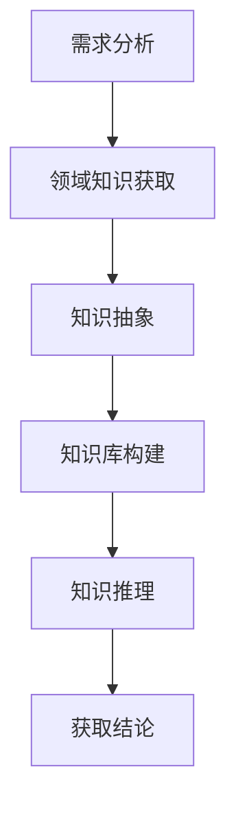

                 

### 文章标题

《企业级知识推理引擎：构建智能问答系统》

> 关键词：知识推理引擎、智能问答系统、企业应用、算法原理、架构设计、实战案例

> 摘要：本文深入探讨企业级知识推理引擎的设计与实现，重点分析其核心概念、算法原理、架构设计，并提供了详细的实战案例，旨在帮助读者理解知识推理引擎在现代企业中的应用及其构建过程。

### 引言

在现代信息化社会中，数据量和信息量呈爆炸式增长，如何有效地从海量数据中提取有用知识，实现智能化决策成为企业亟需解决的问题。知识推理引擎作为一种智能化信息处理工具，能够在企业内部构建智能问答系统，为员工提供高效的信息查询和决策支持。本文将围绕企业级知识推理引擎的设计与实现，探讨其核心概念、算法原理、架构设计，并通过实际案例展示其在企业中的应用价值。

#### 知识推理引擎的定义与重要性

知识推理引擎（Knowledge Reasoning Engine）是一种基于人工智能技术，能够自动从知识库中获取信息、推理新知识并回答用户问题的系统。它通过语义理解、知识表示、知识推理等关键技术，实现从数据到知识的转化，为企业提供智能化的信息服务。

知识推理引擎在企业管理中的重要性体现在以下几个方面：

1. **提高工作效率**：通过智能问答系统，员工可以快速获取所需信息，减少沟通成本，提高工作效率。
2. **辅助决策**：知识推理引擎能够基于已有知识库提供推理和分析，为企业管理层提供数据支持，辅助决策。
3. **知识管理**：知识推理引擎有助于企业内部知识的积累和共享，促进知识管理体系的完善。

#### 知识推理引擎的发展历程

知识推理引擎的发展经历了多个阶段，从最初基于规则的方法，到基于概率和案例的推理方法，再到现在的混合推理方法，其核心技术不断演进。

1. **基于规则的方法**：早期知识推理主要依赖于专家知识库，通过定义一系列规则来推理新知识。
2. **基于概率的方法**：随着概率论的兴起，知识推理开始引入概率模型，通过概率分布来表示知识。
3. **基于案例的方法**：案例推理方法通过从已有案例中提取知识，为解决新问题提供参考。
4. **混合推理方法**：当前知识推理引擎通常采用多种方法相结合，以提高推理的准确性和效率。

#### 知识推理引擎在现代企业中的应用场景

知识推理引擎在现代企业中的应用非常广泛，以下是一些典型的应用场景：

1. **客户服务**：构建智能客服系统，为用户提供24/7实时问答服务，提高客户满意度。
2. **内部知识库**：搭建企业内部知识库，实现员工之间的知识共享和查询，提升团队协作效率。
3. **供应链管理**：通过知识推理，优化供应链管理流程，降低成本，提高运营效率。
4. **人力资源管理**：辅助招聘、培训和绩效评估，提高人力资源管理水平。

### 核心概念与联系

要构建一个有效的知识推理引擎，首先需要理解其核心概念，包括知识表示、知识建模、知识推理等。

#### 知识表示

知识表示是知识推理的基础，它将抽象的领域知识转化为计算机可以处理的形式。常见的知识表示方法有：

1. **语义网络**：使用节点和边表示实体及其关系。
2. **框架表示**：通过定义一组属性和值来表示实体。
3. **本体论**：构建一个概念化的知识框架，用于描述领域知识和关系。

#### 知识建模

知识建模是指将领域知识抽象为模型，以便于计算机处理。知识建模通常包括以下几个步骤：

1. **需求分析**：明确系统需求，确定需要建模的知识领域。
2. **领域知识获取**：从专家、文档、数据库等渠道获取领域知识。
3. **知识抽象**：将获取的知识转化为计算机可理解的形式。
4. **知识库构建**：将抽象的知识存储在知识库中，以便后续使用。

#### 知识推理

知识推理是指根据知识库中的知识，通过逻辑推理、概率推理等方法，获取新的结论或信息。常见的知识推理方法包括：

1. **基于规则的推理**：通过条件-动作规则，从已知事实推导出新的事实。
2. **基于概率的推理**：利用概率分布，根据已知信息推测未知信息。
3. **基于案例的推理**：从已有案例中提取知识，为新问题提供解决方案。

### Mermaid流程图：知识表示与建模

为了更好地理解知识表示与建模的过程，我们使用Mermaid流程图来展示。



### 知识推理算法原理讲解

知识推理算法是知识推理引擎的核心，它决定了系统能够从知识库中推导出哪些结论。以下是几种常见的知识推理算法：

#### 基于规则的推理算法

基于规则的推理算法是最早应用的知识推理方法，其基本思想是根据一组规则和已知事实，推导出新的结论。一个简单的基于规则的推理算法可以使用以下伪代码表示：

```python
def rule_based_reasoning(knowledge_base, facts):
    conclusions = []
    for rule in knowledge_base.rules:
        if all(fact in facts for fact in rule前提条件):
            conclusions.append(rule结果)
    return conclusions
```

#### 基于概率的推理算法

基于概率的推理算法通过概率分布来表示知识，并利用贝叶斯网络、马尔可夫模型等方法进行推理。以下是一个简化的贝叶斯推理算法的伪代码：

```python
def bayesian_reasoning(evidence, prior_probabilities, conditional_probabilities):
    posterior_probabilities = {}
    for outcome in possible_outcomes:
        posterior_probabilities[outcome] = (conditional_probabilities[outcome | evidence] * prior_probabilities[outcome]) / evidence_probabilities[evidence]
    return posterior_probabilities
```

#### 基于案例的推理算法

基于案例的推理算法通过从已有案例中提取知识，为新问题提供解决方案。以下是一个简单的案例推理算法的伪代码：

```python
def case_based_reasoning(new_problem, case_base):
    similar_cases = find_similar_cases(new_problem, case_base)
    solutions = []
    for case in similar_cases:
        solutions.append(case解决方案)
    return solutions
```

### 知识推理引擎架构设计

知识推理引擎的架构设计是构建高效、可扩展系统的关键。一个典型的知识推理引擎架构包括以下几个模块：

1. **知识获取模块**：负责从外部数据源（如数据库、文件、API等）获取知识，并清洗、转换成内部格式。
2. **知识表示模块**：将获取到的知识表示为计算机可以理解的形式，如语义网络、框架等。
3. **知识存储模块**：将表示后的知识存储在知识库中，以便后续使用。
4. **推理引擎模块**：根据用户查询，利用知识库中的知识进行推理，生成答案。
5. **用户接口模块**：提供用户与系统交互的界面，接受用户查询，并展示推理结果。

### 智能问答系统的设计

智能问答系统是知识推理引擎在实际应用中的典型场景，其设计主要包括以下几个方面：

1. **用户交互设计**：设计易于使用的用户界面，接受用户的查询请求，并将查询转化为可解析的形式。
2. **问题解析与处理**：对用户的查询进行语义分析，理解查询意图，并将查询转化为知识库中的问题。
3. **答案生成与展示**：根据知识库中的知识进行推理，生成答案，并将其以直观的方式展示给用户。

### 问答系统的性能优化

为了提高智能问答系统的性能，可以采取以下优化策略：

1. **查询缓存**：缓存常见的查询及其答案，减少重复计算。
2. **索引优化**：对知识库进行索引，提高查询效率。
3. **分布式计算**：将推理任务分布到多个节点上，提高处理能力。

### 智能问答系统的部署与维护

智能问答系统的部署与维护是确保系统稳定运行的关键。主要包括以下几个方面：

1. **部署环境搭建**：搭建适合系统运行的环境，包括服务器、数据库、网络等。
2. **系统监控与调试**：实时监控系统运行状态，发现并解决潜在问题。
3. **系统升级与维护**：定期更新系统，修复漏洞，提高性能。

### 实战案例

为了更好地理解知识推理引擎在实际中的应用，我们通过以下两个实战案例进行详细讲解。

#### 案例一：构建企业内部知识库问答系统

在本案例中，我们为企业设计并实现了一个内部知识库问答系统，旨在帮助员工快速获取公司政策、流程、项目信息等。

1. **需求分析**：分析员工在日常工作中需要查询的信息类型，如公司政策、项目进度、人力资源等。
2. **系统设计**：设计系统架构，包括知识获取、知识表示、知识推理、用户接口等模块。
3. **知识库构建**：从公司文档、数据库等渠道获取知识，并进行表示和存储。
4. **系统实现**：编写代码实现各模块的功能，并进行集成测试。
5. **系统测试与优化**：进行功能测试、性能测试，并根据反馈进行优化。

#### 案例二：构建客户服务智能问答系统

在本案例中，我们为企业设计并实现了一个客户服务智能问答系统，旨在为用户提供24/7的在线客服支持。

1. **需求分析**：分析用户常见的问题类型，如产品使用、售后服务、账单查询等。
2. **系统设计**：设计系统架构，包括知识获取、知识表示、知识推理、用户接口等模块。
3. **知识库构建**：从用户反馈、FAQ、产品文档等渠道获取知识，并进行表示和存储。
4. **系统实现**：编写代码实现各模块的功能，并进行集成测试。
5. **系统测试与优化**：进行功能测试、性能测试，并根据用户反馈进行优化。

### 总结与展望

知识推理引擎作为一种智能化信息处理工具，在企业管理、客户服务等领域具有广泛的应用前景。通过本文的介绍，我们了解了知识推理引擎的核心概念、算法原理、架构设计，并通过实际案例展示了其在企业中的应用价值。

未来，随着人工智能技术的不断发展，知识推理引擎将继续演进，其在企业中的应用也将更加深入和广泛。我们可以预见，知识推理引擎将成为企业智能化转型的重要支撑工具，助力企业实现数据驱动的决策和管理。

### 作者信息

作者：AI天才研究院/AI Genius Institute & 禅与计算机程序设计艺术 /Zen And The Art of Computer Programming

### 最佳实践 Tips、小结、注意事项、拓展阅读

#### 最佳实践 Tips

1. **需求分析**：在构建知识推理引擎前，进行详细的需求分析，确保系统满足实际业务需求。
2. **知识表示**：选择适合的表示方法，提高知识的可理解和可推理性。
3. **系统优化**：定期对系统进行性能优化，提高查询和处理速度。

#### 小结

本文系统地介绍了企业级知识推理引擎的核心概念、算法原理、架构设计，并通过实战案例展示了其在实际应用中的价值。

#### 注意事项

1. **数据安全**：确保知识库中的数据安全，防止泄露。
2. **系统稳定性**：保证系统在高并发、大数据量下的稳定性。

#### 拓展阅读

1. **《人工智能：一种现代方法》**：详细介绍了人工智能的基础知识，包括知识表示和推理。
2. **《知识工程》**：探讨了知识表示、知识建模和知识推理的深度知识。
3. **《智能问答系统设计与实现》**：提供了智能问答系统的详细设计和实现案例。

