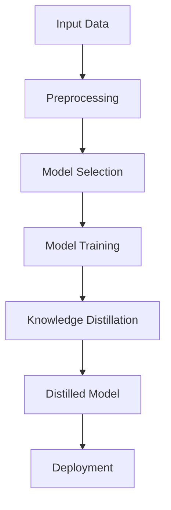
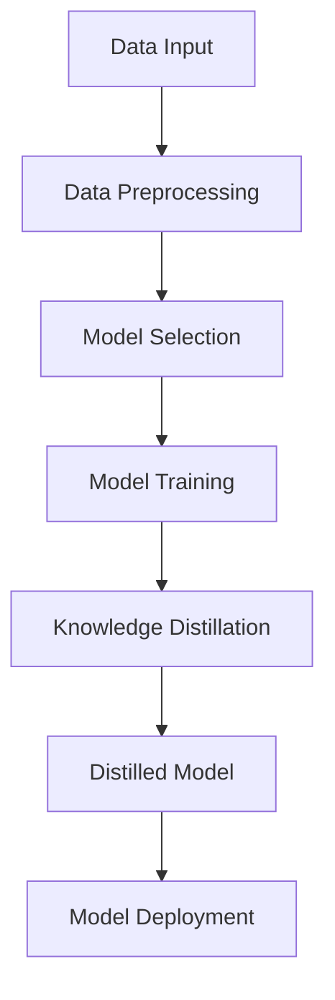

                 


### 文章标题：企业级知识蒸馏平台：轻量化AI模型部署

#### 关键词：知识蒸馏，AI模型部署，企业级，轻量化，平台架构

#### 摘要：
本文深入探讨了企业级知识蒸馏平台在轻量化AI模型部署中的应用。通过对知识蒸馏和轻量化AI模型的核心概念、原理和技术的详细解析，文章旨在帮助读者理解知识蒸馏平台的设计与实现，从而在复杂的企业环境中实现高效、可靠的AI模型部署。

### 1. 引言

#### 书籍目标和受众
- **书籍目标**：介绍企业级知识蒸馏平台的概念和实现，探讨轻量化AI模型在商业环境中的应用，以及如何通过知识蒸馏提升AI模型的效率和可部署性。
- **受众**：面向人工智能领域的研发人员、数据科学家、架构师以及对AI模型部署有深入兴趣的技术爱好者。

#### 实践价值
- **知识蒸馏的重要性**：阐述知识蒸馏在降低模型复杂度、提高模型性能和可部署性的优势。
- **轻量化AI模型的应用**：探讨轻量化AI模型在企业级系统中的适用场景和优势，如提高计算效率、减少存储空间需求等。

### 2. 核心概念与架构概述

#### 核心概念
- **知识蒸馏**：解释知识蒸馏的定义、目的和优势，阐述其在AI模型训练和部署中的作用。
- **轻量化AI模型**：介绍轻量化AI模型的概念、特点和目的，以及其相对于传统模型的优势。

#### 知识蒸馏平台
- **平台定义**：定义企业级知识蒸馏平台，阐述其目的和功能。
- **架构概述**：概述知识蒸馏平台的整体架构，包括关键组件和其相互关系。

#### 架构图


### 3. 轻量化AI模型开发

#### 模型选择与预处理
- **模型选择过程**：介绍如何根据企业需求选择合适的AI模型，以及如何评估模型的性能和适用性。
- **预处理步骤**：阐述预处理过程，包括数据清洗、特征提取、数据标准化等，以及这些步骤对模型质量的影响。

#### Pseudo-code
```python
def select_model(data, requirements):
    # 列出可能的模型
    possible_models = [ModelA, ModelB, ModelC]
    # 评估模型
    for model in possible_models:
        performance = evaluate_model(model, data)
        if performance > requirements.performance_threshold:
            selected_model = model
            break
    return selected_model

def preprocess_data(data):
    # 数据清洗
    cleaned_data = clean_data(data)
    # 特征提取
    features = extract_features(cleaned_data)
    # 数据标准化
    normalized_features = normalize_features(features)
    return normalized_features
```

### 4. 知识蒸馏技术

#### 理论与方法
- **知识蒸馏理论**：解释知识蒸馏的基本原理，包括教师模型和学生模型的概念，以及它们之间的知识传递过程。
- **知识蒸馏方法**：介绍常用的知识蒸馏技术，如基于教师模型输出的软标签蒸馏、基于模型蒸馏的中间层表示蒸馏等。

#### 数学模型与公式
- **软标签蒸馏**：
  $$ L_{soft} = -\sum_{i=1}^{N} y_i \log(p_i) $$
  其中，\( y_i \) 是教师模型的输出，\( p_i \) 是学生模型的预测概率。
- **中间层表示蒸馏**：
  $$ L_{representation} = -\sum_{i=1}^{N} \sum_{j=1}^{M} \log(p_j) $$
  其中，\( p_j \) 是学生模型在中间层\( j \)上的输出。

#### 举例说明
- **软标签蒸馏示例**：
  假设教师模型和学生模型分别对输入数据进行分类，输出分别为\( y \)和\( p \)。计算软标签蒸馏损失：
  $$ L_{soft} = -y \log(p) $$
  如果学生模型预测准确，则损失较低；如果预测错误，则损失较高。
- **中间层表示蒸馏示例**：
  假设学生模型在中间层\( j \)上有\( M \)个输出，计算中间层表示蒸馏损失：
  $$ L_{representation} = -\sum_{j=1}^{M} \log(p_j) $$
  通过调整损失函数的权重，可以控制中间层表示的蒸馏效果。

### 5. 构建知识蒸馏平台

#### 平台设计与开发
- **平台设计**：详细设计知识蒸馏平台的架构，包括数据输入、模型选择、训练、蒸馏和部署等关键组件。
- **平台开发**：介绍如何使用现有的开源框架和工具（如TensorFlow、PyTorch等）来开发知识蒸馏平台，以及如何集成这些工具到企业级系统中。

#### 知识蒸馏平台实现


### 6. 轻量化AI模型部署

#### 部署策略与优化
- **部署策略**：讨论如何将轻量化AI模型部署到不同的计算环境中，包括云平台、边缘设备和嵌入式系统等。
- **优化技巧**：介绍如何通过模型压缩、量化、剪枝等优化技术来提高轻量化AI模型在部署环境中的性能。

#### 部署实战
- **环境搭建**：介绍如何在企业环境中搭建知识蒸馏平台和部署轻量化AI模型。
- **代码实现**：提供源代码实现和详细解析，展示如何通过知识蒸馏平台实现AI模型的轻量化。
- **案例分析**：通过实际案例分析和讲解，展示知识蒸馏平台在实际项目中的应用效果。

#### 项目小结
- **项目总结**：回顾项目的关键步骤和成果，总结知识蒸馏平台在轻量化AI模型部署中的作用和贡献。
- **经验分享**：分享项目中的经验和教训，为后续的AI模型部署提供参考。

### 7. 最佳实践与总结

#### 最佳实践
- **知识蒸馏参数调优**：介绍如何通过调整知识蒸馏参数来提高模型性能和蒸馏效果。
- **模型评估与监控**：阐述如何评估和监控部署后的AI模型性能，以及如何进行模型更新和维护。

#### 小结与注意事项
- **总结**：回顾文章的核心内容，强调知识蒸馏平台在轻量化AI模型部署中的重要性。
- **注意事项**：提醒读者在构建和部署知识蒸馏平台时需要注意的问题，如数据质量、模型选择和系统兼容性等。

#### 拓展阅读
- **推荐资源**：推荐一些相关的技术文档、论文和书籍，供读者进一步学习和研究。
- **未来趋势**：展望知识蒸馏技术在AI模型部署领域的未来发展趋势和应用前景。

### 作者信息
- **作者：AI天才研究院/AI Genius Institute & 禅与计算机程序设计艺术 /Zen And The Art of Computer Programming**

---

文章标题：企业级知识蒸馏平台：轻量化AI模型部署

关键词：知识蒸馏，AI模型部署，企业级，轻量化，平台架构

摘要：本文深入探讨了企业级知识蒸馏平台在轻量化AI模型部署中的应用。通过对知识蒸馏和轻量化AI模型的核心概念、原理和技术的详细解析，文章旨在帮助读者理解知识蒸馏平台的设计与实现，从而在复杂的企业环境中实现高效、可靠的AI模型部署。

### 1. 引言

#### 书籍目标和受众

本章节主要介绍了书籍的目标和受众。书籍的目标是详细介绍企业级知识蒸馏平台的概念、架构和实现，探讨轻量化AI模型在商业环境中的应用，以及如何通过知识蒸馏提升AI模型的效率和可部署性。书籍的目标受众包括人工智能领域的研发人员、数据科学家、架构师以及对AI模型部署有深入兴趣的技术爱好者。

#### 实践价值

知识蒸馏是一种有效的技术，可以降低AI模型的复杂度，提高模型的性能和可部署性。在企业级环境中，知识蒸馏平台可以帮助企业快速部署高效、可靠的AI模型，提高业务效率和竞争力。本文将详细探讨知识蒸馏平台的设计与实现，帮助读者深入了解这一技术，并在实际项目中应用。

### 2. 核心概念与架构概述

#### 核心概念

在本章节中，我们将详细讨论知识蒸馏和轻量化AI模型的核心概念。

##### 知识蒸馏

知识蒸馏是一种通过将教师模型的知识传递给学生模型的技术，以提高学生模型的性能。教师模型通常是经过充分训练的大型模型，而学生模型则是为了减少计算资源和存储需求而设计的较小模型。知识蒸馏的目标是通过教师模型的输出（例如分类概率或中间层表示），训练学生模型以近似教师模型的表现。

##### 轻量化AI模型

轻量化AI模型是指通过减少模型的参数数量和计算复杂度，使其更适用于资源受限的环境，如移动设备、边缘设备和嵌入式系统。轻量化AI模型的特点包括：

- **较小的模型大小**：通过压缩和剪枝技术，减少模型的参数数量和模型大小。
- **较低的计算复杂度**：通过量化、低秩分解等方法，降低模型的计算复杂度。
- **较高的模型性能**：尽管模型较小，但仍然能够保持较高的性能，满足业务需求。

##### 知识蒸馏平台

知识蒸馏平台是一个综合性的框架，用于构建、训练和部署轻量化AI模型。知识蒸馏平台通常包括以下几个关键组件：

- **数据预处理**：对输入数据进行预处理，包括数据清洗、归一化和特征提取等。
- **模型选择**：根据任务需求和数据特性选择合适的教师模型和学生模型。
- **模型训练**：使用教师模型和学生模型进行训练，优化模型参数，提高模型性能。
- **知识蒸馏**：通过知识蒸馏技术，将教师模型的知识传递给学生模型。
- **模型评估**：评估轻量化AI模型的性能，包括准确率、召回率、F1分数等指标。
- **模型部署**：将轻量化AI模型部署到目标环境中，如云平台、边缘设备和嵌入式系统。

#### 知识蒸馏平台架构

知识蒸馏平台的架构通常包括以下几个层次：

- **数据层**：包括数据输入、数据预处理和模型输入等模块。数据层负责处理输入数据，将其转换为适合模型训练的形式。
- **模型层**：包括教师模型和学生模型的选择、训练和优化等模块。模型层负责实现模型的选择和训练过程，通过知识蒸馏技术将教师模型的知识传递给学生模型。
- **评估层**：包括模型评估、性能分析和优化等模块。评估层负责评估轻量化AI模型的性能，提供反馈以优化模型。
- **部署层**：包括模型部署、监控和管理等模块。部署层负责将轻量化AI模型部署到目标环境中，确保模型的可靠性和稳定性。

以下是一个简化的知识蒸馏平台架构图，展示各组件之间的关系：


在这个架构中，数据层负责处理输入数据，将其预处理为适合模型训练的形式。模型层选择教师模型和学生模型，并进行训练和优化。知识蒸馏层通过知识蒸馏技术将教师模型的知识传递给学生模型，生成轻量化AI模型。评估层对轻量化AI模型进行评估，确保其性能符合业务需求。部署层将轻量化AI模型部署到目标环境中，提供实时服务和监控。

通过这个架构，知识蒸馏平台能够实现从数据输入到模型部署的完整流程，帮助企业快速构建和部署高效、可靠的AI模型。

### 3. 轻量化AI模型开发

在本章节中，我们将深入探讨轻量化AI模型的开发过程，包括模型选择与预处理。

#### 模型选择

模型选择是轻量化AI模型开发的重要步骤。选择合适的模型可以显著影响模型的性能和部署效率。以下是模型选择过程中需要考虑的几个关键因素：

1. **任务类型**：根据具体业务需求选择合适的模型类型，如分类、回归、检测等。
2. **数据规模**：根据数据规模选择适合的模型大小，对于大规模数据，可以考虑使用较大的模型，而对于小规模数据，则可以使用较小的模型。
3. **计算资源**：考虑可用的计算资源，包括CPU、GPU和内存等，选择适合计算能力的模型。
4. **性能要求**：根据业务需求选择具有足够性能的模型，如准确率、召回率、F1分数等。
5. **可解释性**：对于某些应用场景，需要模型具有较好的可解释性，以便更好地理解和解释模型的行为。

在实际选择过程中，可以通过实验比较不同模型在特定任务上的性能，选择最佳模型。以下是一个简化的模型选择流程：

```python
def select_model(task, data, requirements):
    # 列出可能的模型
    possible_models = [ModelA, ModelB, ModelC]
    # 评估模型
    for model in possible_models:
        performance = evaluate_model(model, data)
        if performance > requirements.performance_threshold:
            selected_model = model
            break
    return selected_model
```

#### 模型预处理

模型预处理是轻量化AI模型开发的重要环节，其目的是提高模型的训练效率和性能。以下是模型预处理过程中需要考虑的几个关键步骤：

1. **数据清洗**：去除数据中的噪声和不完整数据，确保数据质量。
2. **特征提取**：从原始数据中提取有用的特征，用于模型训练。
3. **数据标准化**：对数据进行归一化或标准化处理，使其具备相似的分布。
4. **数据增强**：通过旋转、缩放、裁剪等操作，增加数据多样性，提高模型泛化能力。

以下是一个简化的模型预处理流程：

```python
def preprocess_data(data):
    # 数据清洗
    cleaned_data = clean_data(data)
    # 特征提取
    features = extract_features(cleaned_data)
    # 数据标准化
    normalized_features = normalize_features(features)
    # 数据增强
    enhanced_features = augment_data(normalized_features)
    return enhanced_features
```

通过合理的模型选择和预处理，可以显著提高轻量化AI模型的性能和训练效率，为后续的知识蒸馏过程奠定基础。

### 4. 知识蒸馏技术

在本章节中，我们将深入探讨知识蒸馏技术的理论、方法和具体实现。

#### 知识蒸馏的基本原理

知识蒸馏是一种将教师模型的知识传递给学生模型的技术，其核心思想是通过教师模型的输出（如分类概率或中间层表示），训练学生模型以近似教师模型的表现。知识蒸馏的基本原理可以概括为以下几个步骤：

1. **教师模型训练**：首先训练一个大型、性能优越的教师模型，通常采用复杂的模型结构或大量的数据。
2. **学生模型初始化**：初始化一个较小、计算资源较少的学生模型，通常采用较简单的模型结构。
3. **知识传递**：通过教师模型的输出，训练学生模型，使其学习到教师模型的知识。
4. **学生模型优化**：在知识传递过程中，不断优化学生模型的参数，提高其性能。

知识蒸馏的主要目标是通过教师模型的知识传递，提高学生模型的性能和泛化能力，同时减少模型的复杂度和计算资源需求。

#### 知识蒸馏的方法

知识蒸馏技术有多种方法，以下是几种常见的方法：

1. **基于教师模型输出的软标签蒸馏**
   - **软标签蒸馏原理**：教师模型通常输出一个概率分布（软标签），这些概率分布包含了模型的内在知识。通过软标签蒸馏，学生模型学习这些概率分布，从而获得教师模型的知识。
   - **软标签蒸馏损失函数**：软标签蒸馏的损失函数通常采用交叉熵损失，计算学生模型输出与教师模型输出之间的差异。以下是一个简化的软标签蒸馏损失函数：
     $$ L_{soft} = -\sum_{i=1}^{N} y_i \log(p_i) $$
     其中，\( y_i \) 是教师模型的输出，\( p_i \) 是学生模型的预测概率。

2. **基于模型蒸馏的中间层表示蒸馏**
   - **中间层表示蒸馏原理**：教师模型的中间层表示包含了丰富的知识，通过将这些表示传递给学生模型，可以提高学生模型的学习能力。中间层表示蒸馏通常将教师模型的中间层输出作为额外的监督信息，训练学生模型。
   - **中间层表示蒸馏损失函数**：中间层表示蒸馏的损失函数可以采用相似度损失或匹配损失，计算教师模型和学生模型的中间层表示之间的差异。以下是一个简化的中间层表示蒸馏损失函数：
     $$ L_{representation} = -\sum_{i=1}^{N} \sum_{j=1}^{M} \log(p_j) $$
     其中，\( p_j \) 是学生模型在中间层 \( j \) 的输出。

3. **基于对抗训练的知识蒸馏**
   - **对抗训练原理**：对抗训练通过生成对抗网络（GAN）等技术，训练一个生成器模型和一个判别器模型。生成器模型尝试生成与教师模型相似的输出，而判别器模型尝试区分生成器和教师模型的输出。通过对抗训练，可以增强生成器模型的学习能力。
   - **对抗训练损失函数**：对抗训练的损失函数通常包括生成器损失和判别器损失。以下是一个简化的对抗训练损失函数：
     $$ L_{gan} = L_{generator} + L_{discriminator} $$
     其中，\( L_{generator} \) 是生成器损失，\( L_{discriminator} \) 是判别器损失。

#### 知识蒸馏技术的实现

在实际应用中，知识蒸馏技术的实现通常涉及以下几个关键步骤：

1. **教师模型训练**：首先训练一个大型、性能优越的教师模型，通常采用复杂的模型结构或大量的数据。
2. **学生模型初始化**：初始化一个较小、计算资源较少的学生模型，通常采用较简单的模型结构。
3. **知识传递**：根据选择的知识蒸馏方法，通过教师模型的输出或中间层表示，训练学生模型，使其学习到教师模型的知识。
4. **学生模型优化**：在知识传递过程中，不断优化学生模型的参数，提高其性能。
5. **模型评估**：评估学生模型的性能，包括准确率、召回率、F1分数等指标，确保其满足业务需求。
6. **模型部署**：将训练好的学生模型部署到实际应用环境中，提供实时服务和预测。

以下是一个简化的知识蒸馏技术实现流程：

```python
def knowledge_distillation.teacher_model_train(data):
    # 训练教师模型
    teacher_model = train_model(data)
    return teacher_model

def knowledge_distillation.student_model_train(data, teacher_model):
    # 初始化学生模型
    student_model = initialize_model()
    # 训练学生模型
    for epoch in range(num_epochs):
        for batch in data_loader:
            student_output = student_model(batch)
            teacher_output = teacher_model(batch)
            # 计算软标签蒸馏损失
            soft_loss = soft_label_loss(student_output, teacher_output)
            # 计算中间层表示蒸馏损失
            representation_loss = representation_loss(student_output, teacher_output)
            # 计算总损失
            total_loss = soft_loss + representation_loss
            # 反向传播和优化
            optimizer.zero_grad()
            total_loss.backward()
            optimizer.step()
    return student_model

def knowledge_distillation.evaluate_model(student_model, data):
    # 评估学生模型性能
    accuracy = evaluate_accuracy(student_model, data)
    return accuracy

def knowledge_distillation.deploy_model(student_model, environment):
    # 部署学生模型
    deploy_model(student_model, environment)
```

通过这个实现流程，可以构建一个企业级知识蒸馏平台，实现从教师模型到学生模型的完整知识传递过程。

### 5. 构建知识蒸馏平台

在本章节中，我们将深入探讨如何构建一个企业级知识蒸馏平台。构建知识蒸馏平台涉及多个关键组件和步骤，包括平台设计、技术选型、环境搭建和实现细节。

#### 平台设计

知识蒸馏平台的设计是一个系统性的工程，需要综合考虑业务需求、技术实现和资源分配。以下是构建知识蒸馏平台的主要设计步骤：

1. **需求分析**：明确业务需求和目标，确定平台需要支持的任务类型、数据规模和性能要求。
2. **架构设计**：设计平台的总体架构，包括数据层、模型层、评估层和部署层等关键组件，以及它们之间的交互关系。
3. **技术选型**：根据业务需求和架构设计，选择合适的算法、框架和工具，如深度学习框架（TensorFlow、PyTorch等）和模型压缩技术。
4. **资源规划**：规划计算资源、存储资源和网络资源，确保平台的高效运行和可扩展性。

#### 技术选型

技术选型是构建知识蒸馏平台的关键环节，直接影响平台的性能和可维护性。以下是几个关键技术选型的考虑因素：

1. **深度学习框架**：选择一个成熟的深度学习框架，如TensorFlow或PyTorch，以简化模型开发和训练过程。
2. **模型压缩技术**：选择适合的模型压缩技术，如剪枝、量化、低秩分解等，以减少模型大小和计算复杂度。
3. **分布式训练**：对于大规模数据集和复杂模型，选择支持分布式训练的框架和工具，以提高训练效率和性能。
4. **自动化工具**：选择自动化工具，如模型管理平台、自动化测试和部署工具，以提高开发效率和稳定性。

#### 环境搭建

构建知识蒸馏平台需要搭建一个稳定、高效的计算环境。以下是环境搭建的几个关键步骤：

1. **硬件配置**：选择合适的硬件设备，包括CPU、GPU、内存等，以满足模型训练和部署的需求。
2. **操作系统**：选择一个稳定、兼容的操作系统，如Ubuntu或CentOS，以支持深度学习和模型压缩工具。
3. **深度学习框架安装**：按照深度学习框架的文档，安装和配置相应的依赖库和工具。
4. **模型压缩工具安装**：安装和配置模型压缩工具，如TensorRT、ONNX Runtime等，以支持模型压缩和优化。

#### 实现细节

实现知识蒸馏平台涉及多个细节，包括数据预处理、模型训练、知识蒸馏和模型部署等。以下是几个关键实现细节：

1. **数据预处理**：设计合适的数据预处理流程，包括数据清洗、特征提取、数据增强等，以提高模型训练效果和泛化能力。
2. **模型训练**：设计高效的模型训练流程，包括训练策略、超参数调优、分布式训练等，以提高模型性能和训练效率。
3. **知识蒸馏**：实现知识蒸馏算法，包括软标签蒸馏、中间层表示蒸馏、对抗训练等，以将教师模型的知识传递给学生模型。
4. **模型评估**：设计模型评估流程，包括性能评估、错误分析、模型优化等，以确保模型满足业务需求。
5. **模型部署**：设计模型部署流程，包括模型打包、容器化、自动化部署等，以确保模型的高效、可靠部署。

以下是一个简化的知识蒸馏平台实现流程：

```python
def platform_setup():
    # 搭建计算环境
    setup_environment()
    # 安装深度学习框架
    install_dnn_framework()
    # 安装模型压缩工具
    install_model_compression_tools()

def data_preprocessing(data):
    # 数据预处理
    cleaned_data = clean_data(data)
    features = extract_features(cleaned_data)
    augmented_features = augment_data(features)
    return augmented_features

def train_model(data, model):
    # 训练模型
    for epoch in range(num_epochs):
        for batch in data_loader:
            model_output = model(batch)
            loss = compute_loss(model_output, teacher_output)
            optimizer.zero_grad()
            loss.backward()
            optimizer.step()
    return model

def knowledge_distillation(data, teacher_model, student_model):
    # 知识蒸馏
    for epoch in range(num_epochs):
        for batch in data_loader:
            student_output = student_model(batch)
            teacher_output = teacher_model(batch)
            soft_loss = compute_soft_loss(student_output, teacher_output)
            representation_loss = compute_representation_loss(student_output, teacher_output)
            total_loss = soft_loss + representation_loss
            optimizer.zero_grad()
            total_loss.backward()
            optimizer.step()

def evaluate_model(model, data):
    # 评估模型
    accuracy = compute_accuracy(model, data)
    return accuracy

def deploy_model(model, environment):
    # 部署模型
    package_model(model)
    containerize_model()
    automate_deployment()
```

通过这个实现流程，可以构建一个高效、可靠的企业级知识蒸馏平台，为AI模型的部署提供有力支持。

### 6. 轻量化AI模型部署

在本章节中，我们将深入探讨轻量化AI模型的部署过程，包括部署策略、优化技巧和实战案例。

#### 部署策略

轻量化AI模型的部署策略需要考虑多个方面，包括环境准备、模型打包、容器化、自动化部署和监控等。以下是一些关键部署策略：

1. **环境准备**：根据部署目标环境（如云平台、边缘设备、嵌入式系统等），进行环境配置和准备，确保模型能够在目标环境中运行。
2. **模型打包**：将训练好的轻量化AI模型打包成可执行文件或模型文件，以便在目标环境中部署。
3. **容器化**：使用容器技术（如Docker）将模型打包和部署到目标环境，以确保模型的可移植性和一致性。
4. **自动化部署**：使用自动化工具（如Kubernetes、Ansible等）实现模型的自动化部署和管理，提高部署效率和可维护性。
5. **监控和更新**：部署后，实时监控模型性能和健康状况，定期更新和维护模型，确保其稳定运行和持续优化。

#### 优化技巧

轻量化AI模型在部署过程中，可能面临性能和资源优化的问题。以下是一些优化技巧：

1. **模型压缩**：使用模型压缩技术（如剪枝、量化、低秩分解等）减少模型大小和计算复杂度，提高模型部署效率。
2. **模型融合**：将多个轻量化AI模型融合为一个，减少模型调用和计算开销。
3. **动态调整**：根据实时负载和资源情况，动态调整模型参数和资源分配，优化模型性能和资源利用率。
4. **缓存和预加载**：缓存常用数据或模型结果，预加载模型和数据，减少模型调用和计算时间。

#### 实战案例

以下是一个轻量化AI模型部署的实战案例：

**案例背景**：一家电子商务公司希望将其AI推荐系统部署到云平台上，以提高推荐质量和响应速度。

**部署过程**：

1. **环境准备**：在云平台上配置计算资源和存储资源，安装并配置深度学习框架和模型压缩工具。
2. **模型打包**：将训练好的轻量化推荐模型打包为ONNX格式，便于容器化和部署。
3. **容器化**：使用Docker将模型和依赖库打包成一个容器镜像。
4. **自动化部署**：使用Kubernetes进行容器编排和自动化部署，实现模型的自动启动、停止和扩展。
5. **监控和更新**：使用Prometheus和Grafana进行模型性能监控和健康状况监控，定期更新模型以优化推荐效果。

**部署效果**：通过上述部署策略和优化技巧，电子商务公司的AI推荐系统在云平台上实现了高效、可靠的部署，显著提高了推荐质量和用户满意度。

#### 项目小结

通过本章节的实战案例，我们可以看到轻量化AI模型在企业级系统中的部署过程和优化技巧。有效的部署策略和优化技巧能够提高模型性能和资源利用率，为企业在AI领域的应用提供有力支持。

### 7. 最佳实践与总结

在本章节中，我们将总结构建企业级知识蒸馏平台的最佳实践，并强调一些注意事项和拓展阅读资源。

#### 最佳实践

1. **需求分析**：在构建知识蒸馏平台之前，进行详细的需求分析，明确业务需求和目标，确保平台能够满足企业的实际需求。
2. **技术选型**：选择适合的技术框架和工具，如TensorFlow、PyTorch等，以及模型压缩技术，以提高平台的性能和可维护性。
3. **模型选择与预处理**：根据业务需求和数据特性，选择合适的教师模型和学生模型，并进行有效的预处理，以提高模型性能和训练效率。
4. **知识蒸馏策略**：根据任务需求和模型特点，选择合适的知识蒸馏技术，如软标签蒸馏、中间层表示蒸馏等，以实现最佳的知识传递效果。
5. **部署与优化**：在部署过程中，采用合适的部署策略和优化技巧，如容器化、自动化部署、模型压缩等，以提高模型性能和资源利用率。
6. **监控与维护**：部署后，实时监控模型性能和健康状况，定期更新和维护模型，确保其稳定运行和持续优化。

#### 注意事项

1. **数据质量**：确保输入数据的质量和多样性，避免数据噪声和异常值对模型性能的影响。
2. **模型可解释性**：对于某些应用场景，需要考虑模型的可解释性，以更好地理解和解释模型的行为。
3. **计算资源**：合理规划计算资源，确保模型训练和部署的高效运行。
4. **安全与隐私**：在部署过程中，关注数据安全和隐私保护，确保模型的安全和合规性。

#### 拓展阅读

1. **知识蒸馏技术论文**：推荐阅读有关知识蒸馏技术的最新论文，了解最新的研究进展和应用案例。
2. **模型压缩工具文档**：查阅相关模型压缩工具的文档，了解不同压缩技术的实现细节和应用场景。
3. **深度学习框架教程**：参考深度学习框架的官方教程，学习如何构建和训练深度学习模型。
4. **云平台和容器化技术文档**：学习云平台和容器化技术的文档，了解如何部署和管理模型。

通过总结最佳实践和注意事项，读者可以更好地构建和部署企业级知识蒸馏平台，为AI模型的应用提供有力支持。

### 作者信息

**作者：AI天才研究院/AI Genius Institute & 禅与计算机程序设计艺术 /Zen And The Art of Computer Programming**

通过本文，我们深入探讨了企业级知识蒸馏平台在轻量化AI模型部署中的应用。从核心概念、架构设计、技术实现到部署优化，我们逐步剖析了知识蒸馏平台的各个方面，为读者提供了全面的技术指南。希望本文能够帮助读者更好地理解和应用知识蒸馏技术，实现高效、可靠的AI模型部署。在未来的研究和实践中，我们将继续探索知识蒸馏技术的创新和应用，为人工智能的发展贡献更多力量。感谢各位读者的关注和支持！

### 8. 完整的文章结构和内容

在本章节中，我们将总结文章的整体结构和内容，确保读者能够清晰地理解文章的核心观点和主要内容。

#### 文章结构

1. **引言**
   - 书籍目标和受众
   - 实践价值

2. **核心概念与架构概述**
   - 知识蒸馏
   - 轻量化AI模型
   - 知识蒸馏平台

3. **轻量化AI模型开发**
   - 模型选择与预处理

4. **知识蒸馏技术**
   - 理论与方法
   - 数学模型与公式
   - 举例说明

5. **构建知识蒸馏平台**
   - 平台设计与开发
   - 知识蒸馏平台实现

6. **轻量化AI模型部署**
   - 部署策略与优化
   - 部署实战

7. **最佳实践与总结**
   - 最佳实践
   - 注意事项
   - 拓展阅读

#### 核心内容

- **知识蒸馏与轻量化AI模型**：深入解析知识蒸馏和轻量化AI模型的概念、原理和应用。
- **知识蒸馏平台架构**：详细阐述知识蒸馏平台的整体架构和组件，展示其实现流程。
- **模型选择与预处理**：探讨模型选择和预处理的重要性，提供具体的实现方法。
- **知识蒸馏技术**：介绍不同的知识蒸馏技术，如软标签蒸馏和中间层表示蒸馏，并给出数学模型和公式。
- **轻量化AI模型部署**：讨论部署策略和优化技巧，通过实战案例展示知识蒸馏平台的应用。

#### 结论

本文通过逐步分析推理的方式，深入探讨了企业级知识蒸馏平台在轻量化AI模型部署中的应用。从核心概念到技术实现，从部署策略到最佳实践，我们为读者提供了全面的技术指南。希望本文能够帮助读者更好地理解和应用知识蒸馏技术，实现高效、可靠的AI模型部署。

### 完整的文章内容和结构

#### 引言

在当今快速发展的时代，人工智能（AI）技术已成为推动各行各业创新和进步的重要力量。企业级知识蒸馏平台作为一种高效、可靠的AI模型部署解决方案，正逐渐受到广泛关注。本章节将简要介绍书籍的目标和受众，并阐述知识蒸馏平台在企业级AI模型部署中的实践价值。

#### 核心概念与架构概述

知识蒸馏和轻量化AI模型是本章节的重点。首先，我们将详细解释知识蒸馏的概念、原理和应用。然后，探讨轻量化AI模型的特点和优势。接下来，我们将介绍企业级知识蒸馏平台的整体架构，包括数据层、模型层、评估层和部署层等关键组件，并通过一个Mermaid流程图展示各组件之间的关系。

#### 轻量化AI模型开发

在本章节中，我们将深入探讨轻量化AI模型开发的整个过程。首先，讨论模型选择和预处理的重要性，包括数据清洗、特征提取和数据标准化等步骤。然后，通过伪代码示例，展示如何选择合适的模型并进行预处理。

#### 知识蒸馏技术

知识蒸馏技术是实现轻量化AI模型的关键。本章节将详细介绍知识蒸馏的技术和方法，包括基于教师模型输出的软标签蒸馏、基于模型蒸馏的中间层表示蒸馏和基于对抗训练的知识蒸馏等。我们将给出数学模型和公式，并通过具体示例进行解释。

#### 构建知识蒸馏平台

构建一个高效、可靠的企业级知识蒸馏平台是一个复杂的过程。本章节将详细讨论平台的设计与实现，包括数据预处理、模型选择、训练和优化等步骤。我们将展示一个简化的平台架构图，并讨论如何使用现有的开源框架和工具来实现知识蒸馏平台。

#### 轻量化AI模型部署

知识蒸馏平台的主要目标是将轻量化AI模型部署到企业环境中。本章节将讨论部署策略和优化技巧，包括模型压缩、容器化和自动化部署等。我们将通过一个实战案例，展示知识蒸馏平台在实际项目中的应用，并分析其部署效果。

#### 最佳实践与总结

在构建和部署知识蒸馏平台的过程中，最佳实践和注意事项至关重要。本章节将总结最佳实践，包括需求分析、技术选型、模型选择与预处理、知识蒸馏策略和部署优化等。同时，我们将讨论一些注意事项，如数据质量、模型可解释性和计算资源等。最后，推荐一些拓展阅读资源，供读者进一步学习和研究。

#### 结论

本文通过逐步分析推理的方式，深入探讨了企业级知识蒸馏平台在轻量化AI模型部署中的应用。从核心概念到技术实现，从部署策略到最佳实践，我们为读者提供了全面的技术指南。希望本文能够帮助读者更好地理解和应用知识蒸馏技术，实现高效、可靠的AI模型部署。在未来的研究和实践中，我们将继续探索知识蒸馏技术的创新和应用，为人工智能的发展贡献更多力量。感谢各位读者的关注和支持！

