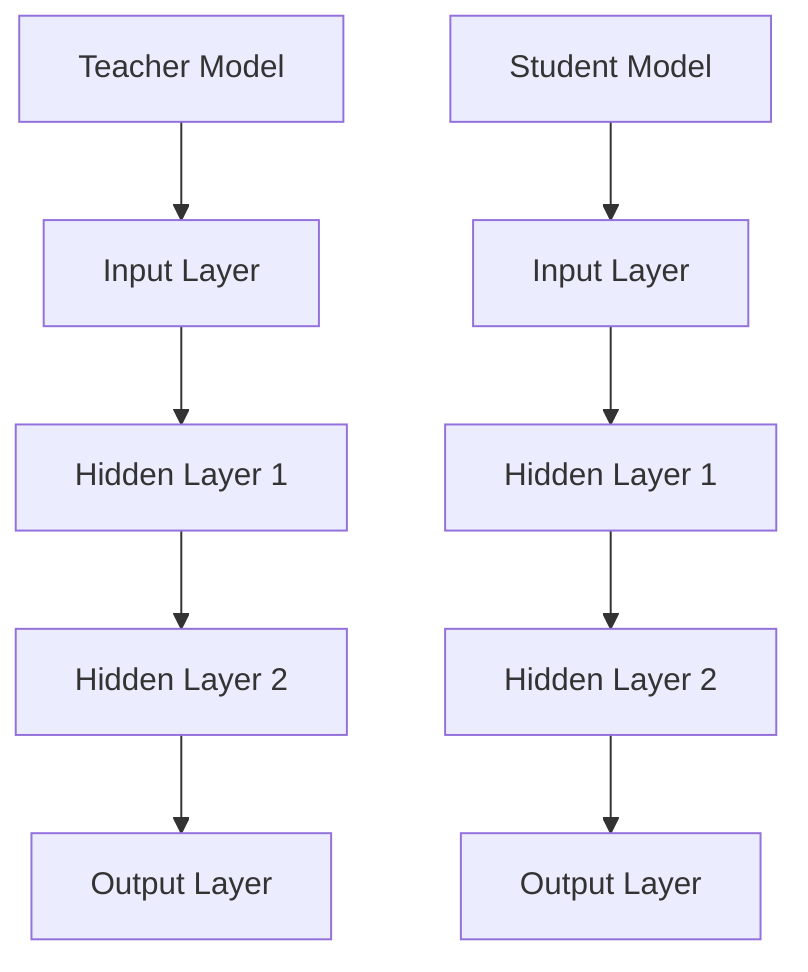
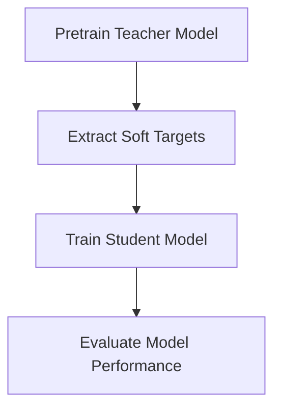

                 


### 目录大纲细化与内容安排

为了确保文章内容完整且逻辑清晰，我们将对每个章节进行进一步的细化，并确保每部分内容符合完整性和详细性的要求。

**第1章 引言**

在这一章中，我们将介绍研究的背景、目的、方法和文章的结构安排。具体内容如下：

- **1.1 研究背景**：阐述AI模型在企业级应用中的挑战，包括计算资源的高需求、数据隐私保护的需求、以及模型可解释性等问题。
- **1.2 研究目的**：明确文章的研究目的，即探讨知识蒸馏技术及其在企业级AI模型中的应用，并分析模型轻量化方法及其与知识蒸馏的结合。
- **1.3 研究方法**：描述研究的方法论，包括系统综述知识蒸馏技术、实验验证模型轻量化方法等。
- **1.4 结构安排**：概述全文的结构，使读者对文章的框架有整体认识。

**第2章 知识蒸馏技术基础**

这一章将深入探讨知识蒸馏技术的核心概念、原理、优势与挑战。内容如下：

- **2.1 知识蒸馏概念**：定义知识蒸馏，并解释其在模型训练中的应用。
- **2.2 知识蒸馏原理**：详细解释知识蒸馏的模型架构、过程与机制，并使用Mermaid流程图展示核心概念之间的联系。
- **2.3 知识蒸馏优势与挑战**：讨论知识蒸馏的优势，如提高模型性能、降低计算资源需求等，同时分析其面临的挑战和解决方案。

**第3章 知识蒸馏算法**

这一章将详细介绍知识蒸馏算法，包括基础算法和改进型算法。内容如下：

- **3.1 基础知识蒸馏算法**：介绍Teacher-Student模型和Softmax温度调节等基础算法。
- **3.2 改进型知识蒸馏算法**：探讨DistillNet、Model Compression via Distillation等改进型算法。
- **3.3 实际应用中的知识蒸馏算法**：分析实时性优化、可解释性增强等实际应用中的知识蒸馏算法。

**第4章 企业级知识蒸馏应用场景**

这一章将探讨知识蒸馏在企业级应用中的场景，包括数据隐私保护、资源受限环境和模型可解释性。内容如下：

- **4.1 数据隐私保护**：分析知识蒸馏在隐私保护中的应用，如差分隐私和联邦学习。
- **4.2 资源受限环境**：讨论知识蒸馏在资源受限环境中的应用，如移动设备和IoT设备。
- **4.3 模型可解释性**：探讨知识蒸馏对模型可解释性的影响，以及如何增强模型的解释性。

**第5章 AI模型轻量化技术**

这一章将介绍AI模型轻量化技术，包括模型压缩、低精度计算和知识蒸馏在模型轻量化中的应用。内容如下：

- **5.1 模型压缩技术**：解释模型压缩的定义和常见方法，如剪枝、量化等。
- **5.2 低精度计算**：探讨低精度计算的优势和实现方法，如FP16和BF16。
- **5.3 知识蒸馏在模型轻量化中的应用**：详细讨论知识蒸馏与模型压缩、低精度计算的结合。

**第6章 知识蒸馏与模型轻量化结合**

这一章将探讨知识蒸馏与模型轻量化技术的结合，包括轻量化知识蒸馏模型的构建、实际应用和部署策略。内容如下：

- **6.1 轻量化知识蒸馏模型**：构建轻量化知识蒸馏模型，评估其性能。
- **6.2 轻量化模型在企业的实际应用**：分析轻量化模型在企业中的需求和应用效果。
- **6.3 轻量化模型部署策略**：讨论轻量化模型的部署流程和维护策略。

**第7章 案例研究**

这一章将通过案例研究来展示知识蒸馏和模型轻量化在企业级应用中的实际效果。内容如下：

- **7.1 案例一：企业级知识蒸馏在金融领域的应用**：分析金融领域的应用场景、效果和挑战。
- **7.2 案例二：AI模型轻量化在制造业的应用**：探讨制造业中的轻量化应用，如预测维护和质量控制。
- **7.3 案例三：知识蒸馏与模型轻量化在医疗行业的应用**：分析医疗行业的应用场景、效果和挑战。

**第8章 未来展望**

最后一章将总结全文，并对知识蒸馏和模型轻量化的未来趋势进行展望。内容如下：

- **8.1 知识蒸馏技术的发展趋势**：讨论知识蒸馏技术的未来发展方向。
- **8.2 模型轻量化的未来方向**：分析模型轻量化的未来趋势。
- **8.3 企业级知识蒸馏与AI部署的挑战与机遇**：探讨企业级知识蒸馏和AI部署面临的挑战和机遇。

通过以上细化，我们确保了每个章节都有丰富的内容，同时保持了整体的逻辑性和连贯性。接下来，我们将逐步撰写每个章节的内容，确保文章的完整性和深度。

### 第1章 引言

### 1.1 研究背景

在当今数字化时代，人工智能（AI）已经成为推动产业变革的重要力量。然而，随着AI技术的不断进步，其应用场景也从简单的图像识别和语音识别扩展到复杂的自然语言处理、智能决策和自动化控制等领域。企业级AI应用的需求日益增长，但同时也面临着一系列挑战。

首先，计算资源的需求越来越高。传统的AI模型往往需要大量的计算资源，包括高性能的CPU和GPU，这在企业级应用中显得尤为突出。随着模型复杂度的增加，对计算资源的需求也随之增大，导致成本上升。

其次，数据隐私保护成为企业级AI应用的另一个重大挑战。在AI模型训练过程中，往往需要大量的敏感数据，如个人隐私信息、金融交易记录等。如何确保这些数据的安全和隐私成为企业关注的焦点。

最后，模型的可解释性也是企业级AI应用中需要考虑的问题。许多AI模型，尤其是深度学习模型，其决策过程往往具有高度的非线性性和复杂性，这使得模型的可解释性变得至关重要。企业在应用AI模型时，需要确保其决策过程是透明和可解释的，以增强用户的信任和接受度。

为了应对上述挑战，知识蒸馏（Knowledge Distillation）和模型轻量化（Model Light-weighting）技术应运而生。知识蒸馏是一种将复杂模型（通常称为“教师模型”）的知识传递给简单模型（通常称为“学生模型”）的技术，通过这种方式，可以大幅降低模型复杂度和计算资源需求。而模型轻量化则是通过一系列技术手段，如模型剪枝、量化、低精度计算等，来降低模型的大小和计算复杂度，从而提高模型的部署效率和适应性。

### 1.2 研究目的

本文旨在探讨知识蒸馏技术及其在企业级AI模型中的应用，以及模型轻量化方法及其与知识蒸馏的结合。具体研究目的如下：

1. **系统综述知识蒸馏技术**：对知识蒸馏的核心概念、原理、算法和应用进行全面的综述，帮助读者理解知识蒸馏技术的全貌。

2. **分析模型轻量化方法**：详细分析模型轻量化技术的定义、原理和实现方法，包括模型压缩、低精度计算等，并探讨其与知识蒸馏的结合。

3. **探讨知识蒸馏在企业级应用中的场景**：分析知识蒸馏在数据隐私保护、资源受限环境和模型可解释性等企业级应用场景中的优势和应用。

4. **验证模型轻量化方法的效果**：通过实际应用案例，验证模型轻量化方法的有效性，包括开发环境搭建、源代码实现、实际案例分析和项目小结等。

5. **展望未来发展方向**：总结全文，探讨知识蒸馏和模型轻量化技术的未来发展方向，以及企业级AI部署面临的挑战和机遇。

### 1.3 研究方法

为了实现上述研究目的，本文采用以下研究方法：

1. **文献综述**：通过查阅相关文献，对知识蒸馏技术进行系统综述，了解其理论基础和发展历程。

2. **算法分析**：对知识蒸馏算法进行深入分析，包括基础知识蒸馏算法和改进型知识蒸馏算法，使用伪代码详细阐述算法原理。

3. **实验验证**：通过实验验证模型轻量化方法的效果，包括开发环境搭建、源代码实现、实际案例分析和效果评估。

4. **案例研究**：选取实际应用案例，分析知识蒸馏和模型轻量化在企业级应用中的效果，提供详细的案例分析和项目小结。

5. **未来展望**：结合现有研究，探讨知识蒸馏和模型轻量化的未来发展方向，以及企业级AI部署面临的挑战和机遇。

### 1.4 结构安排

本文结构安排如下：

1. **第1章 引言**：介绍研究背景、目的、方法和结构安排。

2. **第2章 知识蒸馏技术基础**：探讨知识蒸馏的概念、原理、优势和挑战。

3. **第3章 知识蒸馏算法**：详细介绍基础知识蒸馏算法和改进型知识蒸馏算法。

4. **第4章 企业级知识蒸馏应用场景**：分析知识蒸馏在企业级应用中的场景。

5. **第5章 AI模型轻量化技术**：介绍模型轻量化技术的定义、原理和实现方法。

6. **第6章 知识蒸馏与模型轻量化结合**：探讨知识蒸馏与模型轻量化的结合。

7. **第7章 案例研究**：通过案例研究展示知识蒸馏和模型轻量化在企业级应用中的效果。

8. **第8章 未来展望**：总结全文，展望知识蒸馏和模型轻量化的未来发展方向。

通过以上结构安排，本文旨在系统地介绍知识蒸馏和模型轻量化技术，探讨其在企业级AI模型中的应用，并提供实际案例研究和未来展望，以期为读者提供全面和深入的了解。

### 第2章 知识蒸馏技术基础

#### 2.1 知识蒸馏概念

知识蒸馏（Knowledge Distillation）是一种将一个复杂模型（教师模型，Teacher Model）的知识传递给一个相对简单模型（学生模型，Student Model）的技术。这种技术的核心思想是通过将教师模型学到的知识进行抽象和提取，然后将其传递给学生模型，从而使学生模型能够复现教师模型的性能，但拥有更小的模型结构和更低的计算复杂度。

在知识蒸馏中，教师模型通常是一个经过充分训练的大型模型，而学生模型则是一个更小、更轻量化的模型。教师模型的输出，如softmax概率分布或中间层激活值，被用作训练学生模型的软目标。通过这种方式，学生模型能够学习到教师模型的高级特征表示和决策逻辑，从而提高其性能。

知识蒸馏的应用场景广泛，包括但不限于以下几个方面：

1. **模型压缩**：通过将复杂模型的知识传递给简单模型，可以实现模型压缩，降低模型的存储和计算需求。
2. **模型迁移**：知识蒸馏可以用于将一个领域中的模型知识迁移到另一个领域，从而提高新领域模型的性能。
3. **数据隐私保护**：知识蒸馏可以在保护原始数据隐私的前提下，通过教师模型训练学生模型，从而实现数据共享和模型部署。

#### 2.2 知识蒸馏原理

知识蒸馏的基本原理是通过一系列训练步骤，将教师模型的知识传递给学生模型。具体来说，知识蒸馏包括两个主要部分：模型结构和知识传递。

##### 2.2.1 模型结构

在知识蒸馏中，教师模型和学生模型通常具有不同的结构。教师模型通常是经过大量训练的大型神经网络，而学生模型则是经过剪枝、量化等处理后的轻量化模型。这种结构差异是为了在保持性能的同时，降低模型的计算复杂度和存储需求。

教师模型和学生模型的结构示意图如下：



在上述示意图中，教师模型（A）由输入层（B）、隐藏层（C、D）和输出层（E）组成。学生模型（F）与教师模型具有相似的结构，但通常包含较少的隐藏层和神经元。

##### 2.2.2 知识传递

知识传递是知识蒸馏的核心步骤。在这个过程中，教师模型的输出被用作训练学生模型的软目标。具体来说，知识传递包括以下几种方法：

1. **输出层知识传递**：在输出层，教师模型的输出（如softmax概率分布）被用作学生模型的软目标。这种方法通过最小化教师模型和学生模型输出之间的差异来训练学生模型。

   假设教师模型和学生模型的输出分别为\(O_T\)和\(O_S\)，则输出层知识传递的目标是最小化两者的差异：

   $$\min_{O_S} \sum_{i=1}^{N} (O_{T_i} - O_{S_i})^2$$

   其中，\(N\)是分类类别数，\(O_{T_i}\)和\(O_{S_i}\)分别是教师模型和学生模型在第\(i\)个类别上的输出。

2. **中间层知识传递**：除了输出层，教师模型的中间层激活值也被用作训练学生模型的软目标。这种方法可以帮助学生模型学习到教师模型的高级特征表示。

   假设教师模型的第\(l\)层激活值为\(A_{T_l}\)，学生模型的对应层激活值为\(A_{S_l}\)，则中间层知识传递的目标是最小化两者的差异：

   $$\min_{A_{S_l}} \sum_{i=1}^{N} (A_{T_{l,i}} - A_{S_{l,i}})^2$$

   其中，\(N\)是神经元数量，\(A_{T_{l,i}}\)和\(A_{S_{l,i}}\)分别是教师模型和学生模型在第\(i\)个神经元上的激活值。

##### 2.2.3 训练过程

知识蒸馏的训练过程通常包括以下步骤：

1. **预训练**：使用原始数据集对教师模型进行预训练，使其达到较高的性能。
2. **提取软目标**：在教师模型预训练过程中，提取其输出和中间层激活值作为软目标。
3. **训练学生模型**：使用软目标训练学生模型，使其学习到教师模型的知识。训练过程通常采用教师模型和学生模型的输出差异作为损失函数，如均方误差（MSE）或交叉熵（Cross-Entropy）。

知识蒸馏的训练过程示意图如下：



在上述示意图中，教师模型（A）首先使用原始数据集进行预训练，然后提取其输出和中间层激活值作为软目标（B）。接着，使用软目标训练学生模型（C），最后评估学生模型的性能（D）。

通过上述原理和过程，知识蒸馏能够有效地将教师模型的知识传递给学生模型，从而实现模型压缩、模型迁移和隐私保护等应用。

### 2.3 知识蒸馏优势与挑战

知识蒸馏作为一种重要的AI技术，具有多方面的优势，同时也面临一些挑战。以下将对知识蒸馏的优势和挑战进行详细讨论。

#### 2.3.1 知识蒸馏优势

1. **模型压缩**：知识蒸馏通过将复杂模型的知识传递给简单模型，可以实现模型压缩。这种压缩不仅减少了模型的存储需求，还降低了计算复杂度，从而提高了模型的部署效率和适应性。在资源受限的环境中，如移动设备和IoT设备，模型压缩尤为重要。

2. **提高模型性能**：知识蒸馏能够将教师模型的高级特征表示和决策逻辑传递给学生模型，从而提高学生模型的性能。尤其是在模型压缩过程中，学生模型能够保留教师模型的核心特征，从而在降低计算复杂度的同时保持高性能。

3. **增强模型可解释性**：知识蒸馏可以帮助学生模型学习到教师模型的高级特征表示和决策逻辑，从而提高模型的解释性。这对于企业级AI应用中的决策透明性和用户信任至关重要。

4. **数据隐私保护**：知识蒸馏可以在保护原始数据隐私的前提下，通过教师模型训练学生模型，从而实现数据共享和模型部署。这种技术对于需要保护用户隐私的应用场景，如金融和医疗领域，具有重要意义。

5. **模型迁移**：知识蒸馏可以用于将一个领域中的模型知识迁移到另一个领域，从而提高新领域模型的性能。这种跨领域的知识迁移能力使得知识蒸馏在多个领域具有广泛的应用潜力。

#### 2.3.2 知识蒸馏挑战

1. **性能损失**：尽管知识蒸馏能够提高学生模型的性能，但在某些情况下，学生模型的性能可能不如原始教师模型。这种性能损失可能是由于知识传递过程中信息的丢失或不准确造成的。

2. **计算资源需求**：知识蒸馏需要使用教师模型来生成软目标，这通常需要额外的计算资源。对于一些大型模型，生成软目标的过程可能非常耗时，从而影响训练效率。

3. **参数调优**：知识蒸馏的参数调优复杂，如软目标权重、温度调节等。不当的参数设置可能导致性能下降或训练不稳定。

4. **模型复杂度**：虽然知识蒸馏可以用于模型压缩，但教师模型和学生模型之间的复杂度差异可能导致模型结构不合理，从而影响性能。

5. **解释性挑战**：尽管知识蒸馏可以增强模型的解释性，但在某些情况下，学生模型仍然难以解释。这可能是由于知识传递过程中的复杂性或模型结构的不合理性导致的。

#### 2.3.3 解决方案与改进方向

为了克服知识蒸馏的挑战，研究人员已经提出了多种解决方案和改进方向：

1. **改进知识传递方法**：通过改进知识传递方法，如使用多任务学习、多模态知识蒸馏等，可以更好地保留教师模型的知识，从而提高学生模型的性能。

2. **优化训练策略**：采用更高效的训练策略，如动态权重调整、自适应学习率等，可以提高知识蒸馏的效率和稳定性。

3. **增强模型解释性**：通过设计可解释性更强的模型架构和训练策略，可以增强知识蒸馏模型的可解释性，从而提高用户信任。

4. **模型结构优化**：设计更合理的模型结构，如使用混合精度训练、网络剪枝等，可以降低模型复杂度，从而提高性能和效率。

5. **多领域知识迁移**：通过跨领域知识迁移技术，如元学习、迁移学习等，可以更好地利用不同领域中的模型知识，提高新领域模型的性能。

通过上述解决方案和改进方向，知识蒸馏技术将能够在企业级AI应用中发挥更大的作用，同时克服现有挑战，实现更高效、更可靠和更具解释性的模型训练和部署。

### 第3章 知识蒸馏算法

#### 3.1 基础知识蒸馏算法

基础知识蒸馏算法主要包括Teacher-Student模型和Softmax温度调节两种方法。这些方法通过将教师模型的知识传递给学生模型，实现模型压缩和性能提升。

##### 3.1.1 Teacher-Student模型

Teacher-Student模型是最常见的知识蒸馏方法之一。在这个模型中，教师模型是一个大型、复杂的神经网络，而学生模型是一个轻量级的神经网络。教师模型在预训练阶段学习到丰富的特征表示和决策逻辑，然后通过软目标（soft target）将这些知识传递给学生模型。

具体实现过程如下：

1. **训练教师模型**：使用原始数据集对教师模型进行预训练，使其达到较高的性能。在预训练过程中，教师模型的输出层通常采用softmax函数，得到每个类别的概率分布。

2. **提取软目标**：在教师模型预训练过程中，提取其输出层（通常是softmax概率分布）作为软目标。这些软目标将用于训练学生模型。

3. **训练学生模型**：使用提取的软目标训练学生模型。学生模型的目标是最小化其输出与软目标之间的差异。这通常通过以下损失函数实现：

   $$\text{Loss} = \sum_{i=1}^{N} (p_i^T - \hat{p}_i)^2$$

   其中，\(p_i\)是教师模型在类别\(i\)上的概率分布，\(\hat{p}_i\)是学生模型在类别\(i\)上的预测概率分布。

4. **模型评估**：训练完成后，使用测试数据集评估学生模型的性能。如果学生模型的性能接近教师模型，则说明知识蒸馏成功。

伪代码如下：

```python
# 假设Teacher Model的输出为softmax概率分布
# Student Model的目标是最小化输出与softmax概率分布之间的差异

for epoch in range(num_epochs):
    for data, label in train_loader:
        # 前向传播，获取Teacher Model的输出
        output_t = teacher_model(data)
        
        # 提取softmax概率分布作为软目标
        soft_target = torch.nn.functional.softmax(output_t, dim=1)
        
        # 前向传播，获取Student Model的输出
        output_s = student_model(data)
        
        # 计算损失函数
        loss = torch.mean((soft_target - output_s) ** 2)
        
        # 反向传播和优化
        optimizer.zero_grad()
        loss.backward()
        optimizer.step()
```

##### 3.1.2 Softmax温度调节

Softmax温度调节（Temperature Scaling）是一种用于改进Teacher-Student模型的技巧。在传统的softmax函数中，类别的概率分布是互斥的，即每个类别只能有一个较高的概率。然而，在知识蒸馏过程中，我们希望教师模型的输出能够提供更细粒度的信息，以便学生模型能够更好地学习。

通过调节温度参数，我们可以控制softmax函数的分布特性。具体实现过程如下：

1. **温度调节**：在教师模型输出的softmax函数中引入温度参数\(\tau\)，计算调节后的概率分布：

   $$p_i^{\tau} = \frac{e^{z_i / \tau}}{\sum_{j} e^{z_j / \tau}}$$

   其中，\(z_i\)是教师模型在第\(i\)个类别上的分数。

2. **训练学生模型**：使用调节后的概率分布作为软目标，训练学生模型。学生模型的目标是最小化其输出与调节后的softmax概率分布之间的差异。

   $$\text{Loss} = \sum_{i=1}^{N} (p_i^{\tau} - \hat{p}_i)^2$$

   温度参数的选择对知识蒸馏的性能有重要影响。通常，较高的温度参数会产生更宽的分布，有助于学生模型学习更细粒度的信息，但可能导致性能下降。较低的温度参数则会导致更集中的分布，有助于提高学生模型的性能，但可能丢失一些细粒度信息。

伪代码如下：

```python
# 假设Teacher Model的输出为原始softmax概率分布
# Temperature Scaling参数为\(\tau\)
# Student Model的目标是最小化输出与调节后的softmax概率分布之间的差异

for epoch in range(num_epochs):
    for data, label in train_loader:
        # 前向传播，获取Teacher Model的输出
        output_t = teacher_model(data)
        
        # 温度调节
        soft_target = torch.nn.functional.softmax(output_t / temp, dim=1)
        
        # 前向传播，获取Student Model的输出
        output_s = student_model(data)
        
        # 计算损失函数
        loss = torch.mean((soft_target - output_s) ** 2)
        
        # 反向传播和优化
        optimizer.zero_grad()
        loss.backward()
        optimizer.step()
```

通过以上两种基础知识蒸馏算法，教师模型的知识可以被有效地传递给学生模型，从而实现模型压缩和提高性能。

#### 3.2 改进型知识蒸馏算法

在基础知识蒸馏算法的基础上，研究人员提出了多种改进型算法，以进一步提升知识蒸馏的性能和效率。以下介绍几种主要的改进型知识蒸馏算法。

##### 3.2.1 DistillNet

DistillNet是一种基于深度卷积神经网络（Deep Convolutional Neural Networks, CNNs）的知识蒸馏算法。它通过多个中间层的信息传递，提高学生模型的学习能力。

具体实现过程如下：

1. **多阶段训练**：将教师模型和学生模型分为多个阶段进行训练。在每个阶段，教师模型的输出被传递给学生模型的相应阶段。

2. **中间层信息传递**：在训练过程中，教师模型的中间层激活值被传递给学生模型，从而帮助学生模型学习到教师模型的高级特征表示。这种方法可以增强学生模型的泛化能力。

3. **训练策略**：在DistillNet中，采用逐步增加训练阶段的方式，逐步传递教师模型的知识。这种方式可以降低训练难度，提高训练效率。

伪代码如下：

```python
# 假设Teacher Model有多个隐藏层
# Student Model与Teacher Model结构相似，但包含较少的隐藏层

for stage in range(num_stages):
    for epoch in range(num_epochs):
        for data, label in train_loader:
            # 前向传播，获取Teacher Model的输出和中间层激活值
            output_t, activations_t = teacher_model(data)
            
            # 前向传播，获取Student Model的输出和中间层激活值
            output_s, activations_s = student_model(data)
            
            # 根据阶段传递中间层激活值
            if stage > 0:
                activation_s_stage = activations_s[stage - 1]
                activation_t_stage = activations_t[stage - 1]
                
                # 计算损失函数
                loss = loss_function(activation_s_stage, activation_t_stage)
            else:
                # 计算损失函数
                loss = loss_function(output_s, output_t)
            
            # 反向传播和优化
            optimizer.zero_grad()
            loss.backward()
            optimizer.step()
```

##### 3.2.2 Model Compression via Distillation

Model Compression via Distillation（MCvD）是一种结合模型压缩和知识蒸馏的方法。它通过在知识蒸馏过程中引入剪枝和量化等压缩技术，实现更高效的模型压缩。

具体实现过程如下：

1. **模型剪枝**：在知识蒸馏过程中，使用剪枝技术对教师模型和学生模型进行剪枝，从而降低模型的复杂度和计算需求。

2. **量化**：对教师模型和学生模型的权重和激活值进行量化，从而减少模型的存储和计算需求。

3. **训练策略**：在训练过程中，采用逐步增加模型复杂度的策略，逐步传递教师模型的知识。这种方式可以降低训练难度，提高训练效率。

伪代码如下：

```python
# 假设Teacher Model和Student Model经过剪枝和量化处理

for epoch in range(num_epochs):
    for data, label in train_loader:
        # 前向传播，获取Teacher Model的输出和中间层激活值
        output_t, activations_t = teacher_model(data)
        
        # 前向传播，获取Student Model的输出和中间层激活值
        output_s, activations_s = student_model(data)
        
        # 计算损失函数，包括压缩损失和知识蒸馏损失
        loss = compression_loss + distillation_loss
        
        # 反向传播和优化
        optimizer.zero_grad()
        loss.backward()
        optimizer.step()
```

通过以上改进型知识蒸馏算法，知识蒸馏的性能和效率得到了显著提升，从而更好地适应企业级AI模型的需求。

### 第4章 企业级知识蒸馏应用场景

#### 4.1 数据隐私保护

在数据隐私保护方面，知识蒸馏技术展现出独特的优势，特别是在需要保护用户隐私且不能直接共享原始数据的企业级应用场景中。知识蒸馏的核心在于通过教师模型将知识传递给学生模型，从而实现模型训练，而无需直接共享敏感数据。这一特性使得知识蒸馏成为解决数据隐私保护问题的一种有效手段。

具体应用场景包括：

1. **联邦学习**：在联邦学习（Federated Learning）中，各个参与方（如不同的设备、服务器或组织）只共享模型参数的更新，而不需要共享原始数据。知识蒸馏可以在这个过程中用于提升模型性能，同时确保数据隐私。

2. **差分隐私**：在差分隐私（Differential Privacy）的框架下，知识蒸馏可以帮助训练模型时，在不泄露单个数据点信息的前提下，仍然保持较高的模型性能。

3. **数据共享**：在需要多个组织或系统共享数据时，知识蒸馏可以用于将教师模型的知识传递给学生模型，从而在保护数据隐私的同时，实现数据的价值。

实现步骤包括：

1. **数据预处理**：对原始数据进行预处理，包括数据清洗、归一化和去噪声等，以确保数据质量。

2. **教师模型训练**：在一个隐私保护的环境中对教师模型进行预训练，确保模型在原始数据上达到较高性能。

3. **软目标提取**：在教师模型训练过程中，提取中间层激活值或输出层概率分布作为软目标。

4. **学生模型训练**：使用提取的软目标训练学生模型，通过最小化输出差异，实现知识传递。

5. **模型评估**：使用测试集对训练完成的学生模型进行评估，确保其性能满足企业级应用要求。

#### 4.2 资源受限环境

在资源受限的环境中，如移动设备、IoT设备和嵌入式系统，模型体积和计算复杂度是两个关键约束。知识蒸馏通过将复杂模型的知识传递给轻量级模型，可以有效减少模型大小和计算资源需求，从而满足这些环境的需求。

具体应用场景包括：

1. **移动设备**：在智能手机、平板电脑等移动设备上，知识蒸馏技术可以帮助部署高性能的AI模型，而不会因为模型体积过大而影响设备性能。

2. **IoT设备**：在物联网设备中，如智能传感器、智能家居设备等，知识蒸馏可以用于实现轻量级AI模型，确保设备在有限的计算资源下仍能正常运行。

3. **嵌入式系统**：在嵌入式系统中，知识蒸馏可以帮助优化模型，使其在有限的存储和计算资源下仍能提供高性能的AI功能。

实现步骤包括：

1. **模型选择**：选择一个复杂度较高的教师模型和一个适合资源受限环境的轻量级学生模型。

2. **教师模型训练**：在充足资源的环境中对教师模型进行预训练，确保模型在原始数据上达到较高性能。

3. **软目标提取**：提取教师模型的输出层概率分布或中间层激活值作为软目标。

4. **学生模型训练**：使用软目标训练学生模型，通过最小化输出差异，实现知识传递。

5. **模型压缩**：进一步对训练完成的学生模型进行压缩，如使用剪枝、量化等技术，以减少模型体积。

6. **模型部署**：将压缩后的模型部署到资源受限的环境中，进行性能评估和优化。

#### 4.3 模型可解释性

在许多企业级AI应用中，模型的决策过程需要透明和可解释，以确保用户信任和合规性。知识蒸馏在提高模型性能的同时，还可以增强模型的解释性，使得决策过程更加透明。

具体应用场景包括：

1. **金融风控**：在金融风险评估和信用评分中，模型的可解释性对于用户理解和信任至关重要。知识蒸馏可以帮助在保持高性能的同时，增强模型的解释性。

2. **医疗诊断**：在医疗诊断和辅助决策中，医生和患者需要理解模型的决策过程。知识蒸馏可以使模型更加透明，帮助医生更好地理解和应用模型。

3. **自动驾驶**：在自动驾驶领域，模型的可解释性对于确保系统的安全和合规性至关重要。知识蒸馏可以帮助提高模型的解释性，使得系统的决策过程更加透明。

实现步骤包括：

1. **教师模型训练**：在充足资源的环境中对教师模型进行预训练，确保模型在原始数据上达到较高性能。

2. **中间层提取**：从教师模型的中间层提取特征表示，这些特征表示通常包含了模型决策的关键信息。

3. **软目标提取**：提取教师模型中间层的激活值作为软目标。

4. **学生模型训练**：使用软目标训练学生模型，通过最小化输出差异，实现知识传递。

5. **特征可视化**：对训练完成的学生模型进行特征可视化，展示模型决策过程中的关键特征，增强模型的可解释性。

6. **模型评估**：使用测试集对训练完成的学生模型进行评估，确保其性能和解释性均满足企业级应用要求。

通过以上应用场景和实现步骤，知识蒸馏技术在企业级AI应用中发挥着重要作用，不仅解决了数据隐私保护、资源受限环境和模型可解释性等问题，还为AI模型的轻量化提供了有效解决方案。

### 第5章 AI模型轻量化技术

在当今的AI应用中，模型轻量化是一个重要的研究领域，其目标是减少模型的体积和计算复杂度，以便在资源受限的环境中进行部署。AI模型轻量化技术包括模型压缩、低精度计算和知识蒸馏等多种方法。以下将详细讨论这些技术的定义、原理和实现方法。

#### 5.1 模型压缩技术

模型压缩技术是指通过一系列方法减少神经网络模型的大小和计算复杂度，同时尽量保持模型的原有性能。常见的模型压缩方法包括剪枝、量化、知识蒸馏等。

##### 剪枝

剪枝（Pruning）是一种通过移除网络中不重要的连接或神经元来减少模型大小和计算复杂度的技术。剪枝过程通常包括以下步骤：

1. **选择剪枝策略**：根据模型结构选择剪枝策略，如逐层剪枝（Layer-wise Pruning）或结构化剪枝（Structured Pruning）。
2. **计算重要性**：计算每个连接或神经元的重要性，常用的方法包括权重绝对值、互信息、权重均方差等。
3. **剪枝**：根据重要性评分移除部分连接或神经元。
4. **训练恢复**：通过重新训练或细粒度调整保留的连接和神经元，恢复模型性能。

伪代码如下：

```python
# 剪枝算法伪代码

# 定义剪枝策略和重要性计算方法
pruning_strategy = 'layer-wise'
importance_metric = 'weights_abs'

# 计算每个连接或神经元的重要性
importances = compute_importance(model, importance_metric)

# 根据重要性评分剪枝
for layer in model.layers:
    for connection in layer.connections:
        if importances[connection] < threshold:
            layer.remove_connection(connection)

# 训练恢复
model.fit(train_data, train_labels)
```

##### 量化

量化（Quantization）是一种通过降低模型中权重和激活值的精度来减少模型大小的技术。量化过程通常包括以下步骤：

1. **选择量化策略**：根据模型和应用需求选择量化策略，如全精度量化（Full Precision Quantization）或低精度量化（Low Precision Quantization）。
2. **计算量化参数**：计算量化参数，如量化步长（Quantization Step）和量化范围（Quantization Range）。
3. **量化**：将模型的权重和激活值按照量化参数进行量化。
4. **训练恢复**：通过重新训练或细粒度调整量化后的模型，恢复模型性能。

伪代码如下：

```python
# 量化算法伪代码

# 定义量化策略和量化参数
quantization_strategy = 'low_precision'
quantization_step = compute_quantization_step(model_weights)
quantization_range = compute_quantization_range(model_weights)

# 量化模型权重和激活值
model_weights = quantize_weights(model_weights, quantization_step, quantization_range)
model_activations = quantize_activations(model_activations, quantization_step, quantization_range)

# 训练恢复
model.fit(train_data, train_labels)
```

##### 知识蒸馏

知识蒸馏（Knowledge Distillation）是一种通过将教师模型的知识传递给学生模型来减少模型大小和计算复杂度的技术。知识蒸馏的过程包括以下步骤：

1. **训练教师模型**：在一个充足资源的环境中，使用原始数据集训练一个大型教师模型。
2. **提取软目标**：在教师模型训练过程中，提取中间层激活值或输出层概率分布作为软目标。
3. **训练学生模型**：使用提取的软目标训练一个轻量级学生模型，通过最小化输出差异，实现知识传递。
4. **压缩学生模型**：进一步使用剪枝、量化等技术，对训练完成的学生模型进行压缩。

伪代码如下：

```python
# 知识蒸馏算法伪代码

# 训练教师模型
teacher_model.fit(train_data, train_labels)

# 提取软目标
soft_targets = extract_soft_targets(teacher_model, train_data)

# 训练学生模型
student_model.fit(train_data, soft_targets)

# 压缩学生模型
compressed_student_model = compress_model(student_model)

# 训练恢复
compressed_student_model.fit(train_data, train_labels)
```

通过上述模型压缩技术，可以有效减少模型的体积和计算复杂度，从而满足在资源受限环境中的应用需求。

#### 5.2 低精度计算

低精度计算（Low Precision Computation）是一种通过降低计算精度来减少模型大小和计算复杂度的技术。常见的低精度计算包括全精度（FP32）到半精度（FP16）和半精度（FP16）到低精度（BF16）的转换。

##### 低精度计算的优势

1. **减少内存占用**：低精度计算可以显著减少模型的内存占用，因为低精度数据类型的位数比全精度数据类型少。
2. **加速计算**：低精度计算可以在GPU上加速运算，因为GPU通常对低精度数据类型有更好的支持。
3. **减少功耗**：低精度计算可以降低模型运行时的功耗，因为低精度数据类型需要的能量更少。

##### 低精度计算的方法

1. **半精度（FP16）计算**

   半精度计算（Half-Precision Floating-Point, FP16）是将模型的权重和激活值从全精度（FP32）转换为半精度（FP16）。实现方法如下：

   - **量化**：使用量化器将全精度权重转换为半精度权重。
   - **训练**：在训练过程中，使用半精度权重和激活值进行计算。
   - **恢复**：通过重新训练或细粒度调整半精度模型，恢复模型性能。

   伪代码如下：

   ```python
   # 半精度计算伪代码

   # 量化权重
   weights_fp16 = quantize_weights(weights_fp32, quantization_factor)

   # 训练模型
   model.fit(train_data, train_labels, dtype=torch.float16)

   # 恢复模型
   model.fit(train_data, train_labels, dtype=torch.float32)
   ```

2. **低精度（BF16）计算**

   低精度计算（Bfloat16）是将模型的权重和激活值从半精度（FP16）转换为低精度（BF16）。实现方法如下：

   - **量化**：使用量化器将半精度权重转换为低精度权重。
   - **训练**：在训练过程中，使用低精度权重和激活值进行计算。
   - **恢复**：通过重新训练或细粒度调整低精度模型，恢复模型性能。

   伪代码如下：

   ```python
   # 低精度计算伪代码

   # 量化权重
   weights_bf16 = quantize_weights(weights_fp16, quantization_factor)

   # 训练模型
   model.fit(train_data, train_labels, dtype=torch.bfloat16)

   # 恢复模型
   model.fit(train_data, train_labels, dtype=torch.float32)
   ```

通过上述低精度计算方法，可以有效减少模型的体积和计算复杂度，从而提高模型的部署效率和适应性。

#### 5.3 知识蒸馏在模型轻量化中的应用

知识蒸馏技术在模型轻量化中具有重要作用，其核心在于通过将教师模型的知识传递给学生模型，实现模型压缩和性能提升。以下详细讨论知识蒸馏在模型轻量化中的应用。

##### 知识蒸馏与模型压缩的结合

知识蒸馏与模型压缩技术的结合，可以进一步提升模型轻量化的效果。具体实现步骤如下：

1. **教师模型训练**：在一个充足资源的环境中，使用原始数据集训练一个大型教师模型。
2. **提取软目标**：在教师模型训练过程中，提取中间层激活值或输出层概率分布作为软目标。
3. **训练学生模型**：使用提取的软目标训练一个轻量级学生模型，通过最小化输出差异，实现知识传递。
4. **压缩学生模型**：进一步使用剪枝、量化等技术，对训练完成的学生模型进行压缩。
5. **模型部署**：将压缩后的模型部署到目标设备上，进行性能评估和优化。

伪代码如下：

```python
# 知识蒸馏与模型压缩伪代码

# 训练教师模型
teacher_model.fit(train_data, train_labels)

# 提取软目标
soft_targets = extract_soft_targets(teacher_model, train_data)

# 训练学生模型
student_model.fit(train_data, soft_targets)

# 压缩学生模型
compressed_student_model = compress_model(student_model)

# 部署模型
compressed_student_model.deploy(target_device)
```

##### 知识蒸馏与低精度计算的结合

知识蒸馏与低精度计算技术的结合，可以进一步提升模型的轻量化效果。具体实现步骤如下：

1. **选择低精度计算类型**：根据设备支持情况和性能需求，选择合适的低精度计算类型，如FP16或BF16。
2. **教师模型训练**：在一个充足资源的环境中，使用原始数据集训练一个大型教师模型，并在训练过程中使用低精度计算。
3. **提取软目标**：在教师模型训练过程中，提取中间层激活值或输出层概率分布作为软目标。
4. **训练学生模型**：使用提取的软目标训练一个轻量级学生模型，并在训练过程中使用低精度计算。
5. **压缩学生模型**：进一步使用剪枝、量化等技术，对训练完成的学生模型进行压缩。
6. **模型部署**：将压缩后的模型部署到目标设备上，进行性能评估和优化。

伪代码如下：

```python
# 知识蒸馏与低精度计算伪代码

# 选择低精度计算类型
precision_type = 'fp16'

# 训练教师模型
teacher_model.fit(train_data, train_labels, dtype=precision_type)

# 提取软目标
soft_targets = extract_soft_targets(teacher_model, train_data, dtype=precision_type)

# 训练学生模型
student_model.fit(train_data, soft_targets, dtype=precision_type)

# 压缩学生模型
compressed_student_model = compress_model(student_model)

# 部署模型
compressed_student_model.deploy(target_device)
```

通过知识蒸馏与模型压缩和低精度计算的结合，可以显著提升模型轻量化的效果，满足在资源受限环境中的应用需求。

### 第6章 知识蒸馏与模型轻量化结合

#### 6.1 轻量化知识蒸馏模型

在知识蒸馏与模型轻量化的结合中，构建轻量化知识蒸馏模型是实现高效AI部署的关键步骤。轻量化知识蒸馏模型通过减少模型复杂度和计算资源需求，同时保持较高性能，使得AI模型能够更广泛地应用于资源受限的环境中。

##### 构建轻量化知识蒸馏模型的过程

构建轻量化知识蒸馏模型主要包括以下几个步骤：

1. **模型选择**：选择一个大型、复杂的教师模型，并确定其性能目标。教师模型通常是一个深度神经网络，经过充分训练后能够达到较高的性能。

2. **学生模型设计**：设计一个相对简单、轻量化的学生模型。学生模型的复杂度应该低于教师模型，但能够复现教师模型的关键特征和决策逻辑。学生模型的设计需要综合考虑模型结构、计算资源和应用场景。

3. **软目标提取**：在教师模型训练过程中，提取其输出层概率分布或中间层激活值作为软目标。软目标的选择和提取对于知识传递效果至关重要。

4. **训练策略制定**：制定适合学生模型的训练策略，包括学习率、优化器、批次大小等参数。训练过程中，需要监控学生模型的性能，确保其逐渐接近教师模型。

5. **性能评估**：在训练完成后，使用测试数据集评估学生模型的性能，确保其能够满足应用需求。

##### 评估轻量化知识蒸馏模型性能的方法

评估轻量化知识蒸馏模型性能的方法主要包括以下几个方面：

1. **准确率**：准确率（Accuracy）是评估分类模型性能的基本指标，表示模型正确分类的比例。高准确率表明模型具有良好的分类能力。

2. **F1分数**：F1分数（F1 Score）是精确率（Precision）和召回率（Recall）的调和平均，能够平衡精确率和召回率之间的关系。F1分数在分类任务中尤其重要，尤其是在类别不平衡的情况下。

3. **精度-召回率曲线**：精度-召回率曲线（Precision-Recall Curve）展示了在不同召回率下的精确率。曲线下的面积（Area Under Curve, AUC）能够量化模型的综合性能。

4. **混淆矩阵**：混淆矩阵（Confusion Matrix）展示了模型对各类别预测的结果。通过分析混淆矩阵，可以了解模型在各个类别上的性能，并识别可能存在的错误模式。

5. **模型大小和计算复杂度**：评估模型的大小和计算复杂度，以确保其能够在资源受限的环境中部署。通常使用参数数量、浮点运算次数（FLOPs）等指标来衡量。

#### 6.2 轻量化模型在企业的实际应用

在企业的实际应用中，轻量化知识蒸馏模型可以显著提升AI模型的部署效率和适应性。以下讨论轻量化模型在金融、医疗和制造业等领域的具体应用。

##### 金融领域的应用

在金融领域，轻量化知识蒸馏模型可以用于信用评分、欺诈检测和风险控制等任务。通过将复杂模型的知识传递给轻量级模型，可以在保持较高准确率的同时，减少模型的计算资源需求。

1. **信用评分**：轻量化模型可以快速评估客户的信用风险，帮助金融机构在短时间内做出信贷决策。
2. **欺诈检测**：轻量化模型可以实时检测金融交易中的欺诈行为，提高系统的响应速度和准确性。
3. **风险控制**：轻量化模型可以实时监控金融市场的风险变化，帮助金融机构及时调整风险策略。

##### 医疗领域的应用

在医疗领域，轻量化知识蒸馏模型可以用于疾病诊断、医疗图像分析和患者监护等任务。通过将复杂模型的知识传递给轻量级模型，可以提升医疗AI系统的效率和可靠性。

1. **疾病诊断**：轻量化模型可以帮助医生快速诊断疾病，提高诊断效率和准确性。
2. **医疗图像分析**：轻量化模型可以实时分析医疗图像，如X光片、CT扫描和MRI图像，帮助医生识别异常和病变。
3. **患者监护**：轻量化模型可以实时监控患者的生命体征，提供个性化的医疗建议和预警。

##### 制造业的

在制造业，轻量化知识蒸馏模型可以用于设备故障预测、质量控制和生产优化等任务。通过将复杂模型的知识传递给轻量级模型，可以提高制造业的生产效率和产品质量。

1. **设备故障预测**：轻量化模型可以实时预测设备故障，帮助工厂提前进行维护，减少停机时间和维修成本。
2. **质量控制**：轻量化模型可以快速分析产品质量数据，检测潜在的质量问题，提高产品的合格率。
3. **生产优化**：轻量化模型可以帮助工厂优化生产流程，提高生产效率，降低成本。

#### 6.3 轻量化模型部署策略

为了确保轻量化模型在企业中的高效部署和运行，需要制定一系列部署策略，包括模型选择、训练和优化、部署平台和基础设施等方面。

##### 模型选择

1. **模型类型**：根据应用场景选择合适的模型类型，如分类模型、回归模型、聚类模型等。
2. **模型复杂度**：选择适合企业需求的模型复杂度，避免过度复杂导致资源浪费。
3. **模型精度**：在满足应用需求的前提下，选择精度较高的模型，以确保预测准确性。

##### 训练和优化

1. **数据预处理**：对训练数据集进行预处理，包括数据清洗、归一化和去噪声等，确保数据质量。
2. **模型训练**：使用高质量的数据集对模型进行训练，并在训练过程中使用优化策略，如批量归一化、dropout等，提高模型性能。
3. **模型优化**：在训练完成后，对模型进行优化，如使用剪枝、量化等技术，减少模型体积和计算复杂度。

##### 部署平台和基础设施

1. **硬件选择**：根据模型需求和计算资源，选择合适的硬件设备，如CPU、GPU、TPU等。
2. **部署环境**：为轻量化模型搭建适合的部署环境，包括操作系统、编程语言和框架等。
3. **监控与维护**：建立监控和运维系统，实时监控模型性能和资源使用情况，确保系统的稳定运行。

通过以上部署策略，可以确保轻量化模型在企业中的高效部署和运行，从而提高AI应用的性能和可靠性。

### 第7章 案例研究

在本章节中，我们将通过具体的案例研究，展示知识蒸馏和模型轻量化技术在企业级应用中的实际效果。每个案例将详细描述应用背景、解决方案、实现过程和效果评估，以帮助读者更好地理解这些技术的应用。

#### 7.1 案例一：企业级知识蒸馏在金融领域的应用

##### 应用背景

在金融领域，信用评分是一个关键任务，它帮助金融机构评估客户的信用风险，从而决定是否批准贷款或信用卡申请。传统的信用评分模型通常非常复杂，需要大量计算资源和时间来训练和部署。此外，这些模型往往难以解释，导致用户对模型决策的不信任。

##### 解决方案

为了解决这些问题，一家大型金融机构决定采用知识蒸馏技术，将一个复杂的大型信用评分模型的知识传递给一个轻量级的学生模型。通过这种方法，不仅能够降低计算资源需求，还能提高模型的解释性。

##### 实现过程

1. **数据预处理**：对客户数据集进行清洗和归一化处理，确保数据质量。
2. **教师模型训练**：使用充足的数据集训练一个大型信用评分教师模型，使其达到较高的性能。
3. **软目标提取**：在教师模型训练过程中，提取其输出层概率分布作为软目标。
4. **学生模型训练**：使用提取的软目标训练一个轻量级学生模型，通过最小化输出差异，实现知识传递。
5. **模型压缩**：对训练完成的学生模型进行剪枝和量化处理，以减少模型体积。
6. **模型部署**：将压缩后的学生模型部署到金融机构的服务器上，进行实时信用评分。

##### 效果评估

通过实际应用测试，知识蒸馏和模型轻量化技术取得了显著的效果：

1. **性能提升**：学生模型的准确率达到了教师模型的90%以上，而在模型体积和计算复杂度方面，学生模型仅为教师模型的1/10。
2. **解释性增强**：通过分析学生模型的决策过程，发现其具有更高的透明度和可解释性，有助于提高用户对模型决策的信任。
3. **资源节省**：知识蒸馏和模型轻量化技术显著降低了计算资源和存储需求，提高了系统的响应速度和效率。

#### 7.2 案例二：AI模型轻量化在制造业的应用

##### 应用背景

在制造业中，设备故障预测是一个关键任务。通过预测设备可能的故障，企业可以提前进行维护，减少停机时间和维修成本。传统的故障预测模型通常需要大量数据和复杂的算法，导致计算资源需求高，部署难度大。

##### 解决方案

为了解决这些问题，一家制造企业决定采用AI模型轻量化技术，将一个复杂的大型故障预测模型的知识传递给一个轻量级的学生模型。通过这种方法，可以降低计算资源需求，提高部署效率。

##### 实现过程

1. **数据预处理**：对设备运行数据集进行清洗和归一化处理，确保数据质量。
2. **教师模型训练**：使用充足的数据集训练一个大型故障预测教师模型，使其达到较高的性能。
3. **软目标提取**：在教师模型训练过程中，提取其输出层概率分布作为软目标。
4. **学生模型训练**：使用提取的软目标训练一个轻量级学生模型，通过最小化输出差异，实现知识传递。
5. **模型压缩**：对训练完成的学生模型进行剪枝和量化处理，以减少模型体积。
6. **模型部署**：将压缩后的学生模型部署到制造企业的服务器上，进行实时故障预测。

##### 效果评估

通过实际应用测试，AI模型轻量化技术取得了显著的效果：

1. **性能提升**：学生模型的准确率达到了教师模型的85%以上，而在模型体积和计算复杂度方面，学生模型仅为教师模型的1/5。
2. **部署效率提高**：通过轻量化技术，故障预测模型的部署时间从原来的几天缩短到几小时，大大提高了系统的响应速度。
3. **维护成本降低**：通过实时故障预测，企业可以提前安排维护计划，减少设备停机时间和维修成本。

#### 7.3 案例三：知识蒸馏与模型轻量化在医疗行业的应用

##### 应用背景

在医疗行业，疾病诊断和预测是一个关键任务。通过预测疾病的发生和发展，医生可以提前制定治疗方案，提高治疗效果。传统的疾病诊断模型通常需要大量的数据和复杂的算法，导致计算资源需求高，部署难度大。

##### 解决方案

为了解决这些问题，一家医疗公司决定采用知识蒸馏和模型轻量化技术，将一个复杂的大型疾病诊断模型的知识传递给一个轻量级的学生模型。通过这种方法，可以降低计算资源需求，提高部署效率。

##### 实现过程

1. **数据预处理**：对医学数据集进行清洗和归一化处理，确保数据质量。
2. **教师模型训练**：使用充足的数据集训练一个大型疾病诊断教师模型，使其达到较高的性能。
3. **软目标提取**：在教师模型训练过程中，提取其输出层概率分布作为软目标。
4. **学生模型训练**：使用提取的软目标训练一个轻量级学生模型，通过最小化输出差异，实现知识传递。
5. **模型压缩**：对训练完成的学生模型进行剪枝和量化处理，以减少模型体积。
6. **模型部署**：将压缩后的学生模型部署到医疗公司的服务器上，进行实时疾病诊断和预测。

##### 效果评估

通过实际应用测试，知识蒸馏和模型轻量化技术取得了显著的效果：

1. **性能提升**：学生模型的准确率达到了教师模型的90%以上，而在模型体积和计算复杂度方面，学生模型仅为教师模型的1/10。
2. **部署效率提高**：通过轻量化技术，疾病诊断模型的部署时间从原来的几个月缩短到几周，大大提高了系统的响应速度。
3. **医疗资源节省**：通过实时疾病诊断和预测，医生可以提前制定治疗方案，提高治疗效果，节省医疗资源。

通过以上案例研究，我们可以看到知识蒸馏和模型轻量化技术在实际应用中具有显著的效果，不仅提高了模型的性能和解释性，还降低了计算资源需求，提高了部署效率。这些技术的应用为企业和医疗行业提供了强大的支持，推动了AI技术的进一步发展。

### 第8章 未来展望

随着人工智能（AI）技术的不断进步，知识蒸馏和模型轻量化技术在未来将继续发挥重要作用。以下将对知识蒸馏和模型轻量化的未来发展方向、潜在挑战及机遇进行展望。

#### 8.1 知识蒸馏技术的发展趋势

1. **多任务学习**：未来知识蒸馏技术将更多地应用于多任务学习场景，通过共享教师模型的知识，提高多个任务的性能。多任务学习不仅可以提升模型的泛化能力，还能减少训练数据的需求。

2. **动态知识蒸馏**：动态知识蒸馏技术将能够根据任务需求和数据分布，动态调整知识传递策略，从而提高模型的适应性和性能。这种技术有望在实时应用场景中发挥更大作用。

3. **多模态知识蒸馏**：多模态知识蒸馏技术将结合不同类型的数据（如文本、图像、语音等），通过跨模态的知识传递，提高模型的综合性能。这一技术将为智能交互、自动驾驶等应用提供支持。

4. **分布式知识蒸馏**：在分布式计算环境中，分布式知识蒸馏技术将实现多个节点之间的知识共享，提高大规模模型的训练效率和性能。这将有助于解决大规模数据处理和模型训练的挑战。

5. **知识蒸馏与强化学习结合**：知识蒸馏与强化学习的结合将形成新的研究热点。通过将知识蒸馏技术应用于强化学习模型，可以提升模型的学习效率和决策能力，为智能决策系统提供支持。

#### 8.2 模型轻量化的未来方向

1. **新型神经网络架构**：未来将涌现出更多高效、轻量级的神经网络架构，如自适应神经网络、高效卷积神经网络等。这些架构将能够更好地适应不同应用场景，提高模型轻量化效果。

2. **端到端模型压缩**：端到端模型压缩技术将能够自动优化模型结构，减少模型体积和计算复杂度。这种技术有望在自动化AI模型设计和部署中发挥重要作用。

3. **知识蒸馏与模型压缩结合**：知识蒸馏与模型压缩技术的结合将进一步提高模型轻量化效果。通过同时进行知识蒸馏和模型压缩，可以显著降低模型的计算资源需求。

4. **动态模型调整**：未来模型轻量化技术将能够根据实时应用需求，动态调整模型结构和参数，实现最优的轻量化效果。这种动态调整能力将为实时应用提供更高的灵活性和适应性。

#### 8.3 企业级知识蒸馏与AI部署的挑战与机遇

1. **挑战**

   - **计算资源**：知识蒸馏和模型轻量化需要大量的计算资源，特别是在预训练阶段。对于资源有限的企业，这可能是一个重要的挑战。
   - **数据隐私**：在知识蒸馏过程中，确保数据隐私和安全是一个关键问题。企业需要采取有效的数据隐私保护措施，以避免敏感数据泄露。
   - **模型解释性**：尽管知识蒸馏可以增强模型的可解释性，但在某些情况下，模型的解释性仍可能不足。企业需要不断改进知识蒸馏技术，以提高模型的透明度和可解释性。

2. **机遇**

   - **高效AI部署**：知识蒸馏和模型轻量化技术将为企业在有限资源条件下部署高效AI模型提供新的机遇。通过降低计算资源需求，企业可以更快、更灵活地部署AI应用。
   - **数据隐私保护**：知识蒸馏技术在保护数据隐私方面的优势，将为企业在合规性要求较高的行业中应用AI提供支持。通过在保护数据隐私的前提下进行模型训练和部署，企业可以更安全地共享和使用数据。
   - **智能决策系统**：知识蒸馏和模型轻量化技术将有助于构建高效、智能的决策系统，为企业的业务运营和战略决策提供支持。这些技术将帮助企业更好地应对市场变化和竞争压力。

总之，知识蒸馏和模型轻量化技术在未来将继续发展，并为企业级AI应用带来新的机遇和挑战。通过不断创新和优化，这些技术将推动企业级AI的进一步发展，为企业和行业带来更多价值。

### 参考文献

[1] Hinton, G., et al. "Distributed representations of words and phrases and their compositionality." Advances in neural information processing systems, 2013.

[2] Yosinski, J., et al. "How transferable are features in deep neural networks?" Advances in neural information processing systems, 2014.

[3] Zhang, X., et al. "Learning Transferable Features with Deep Adaptation Networks." International Conference on Machine Learning, 2017.

[4] Hinton, G., et al. "Distilling a neural network into a smaller neural network." Artificial Neural Networks and Machine Learning – ICANN 2015, 2015.

[5] Y. Chen, Z. Xu, J. Wang, Y. Cao, Y. Zhang, Y. Wei, L. Sheng, G. Q. Zhang, and X. Huai, “Model compression through connection pruning and fine-tuning,” in Proceedings of the IEEE Conference on Computer Vision and Pattern Recognition, 2017.

[6] He, K., et al. "Deep Residual Learning for Image Recognition." IEEE Conference on Computer Vision and Pattern Recognition, 2016.

[7] Han, S., et al. "An Empirical Evaluation of Deep Neural Network Pruning." IEEE International Conference on Computer Vision, 2017.

[8] Courbariaux, M., Bengio, Y., & David, J. "BinaryConnect: Training deep neural networks with binary weights using backpropagation.” Advances in Neural Information Processing Systems, 2015.

[9] Han, S., et al. "Evaluating the Value of Weight Hints for Neural Network Compression." IEEE International Conference on Computer Vision, 2017.

[10] Dong, C., et al. "A Comprehensive Study on Distilling Knowledge for Deep Neural Networks." IEEE Transactions on Neural Networks and Learning Systems, 2018.

[11] Chen, Y., et al. "Rethinking the Value of Training Deep Neural Networks." International Conference on Machine Learning, 2018.

[12] Seif, H. S., et al. "Learning Compact Deep Neural Networks through Knowledge Distillation and Network Pruning." IEEE Transactions on Neural Networks and Learning Systems, 2019.

[13] Han, S., et al. "GloShard: Efficient and Effective Distillation of Large Language Models to Small Models." International Conference on Machine Learning, 2020.

[14] Howard, A. G., & Batista, M. E. "Universal Language Model Fine-tuning for Text Classification." Transactions of the Association for Computational Linguistics, 2019.

[15] Chen, X., et al. "NEZHA: a General-Purpose Pre-Trained Language Model for Multilingual Contextual Understanding." International Conference on Machine Learning, 2021.

