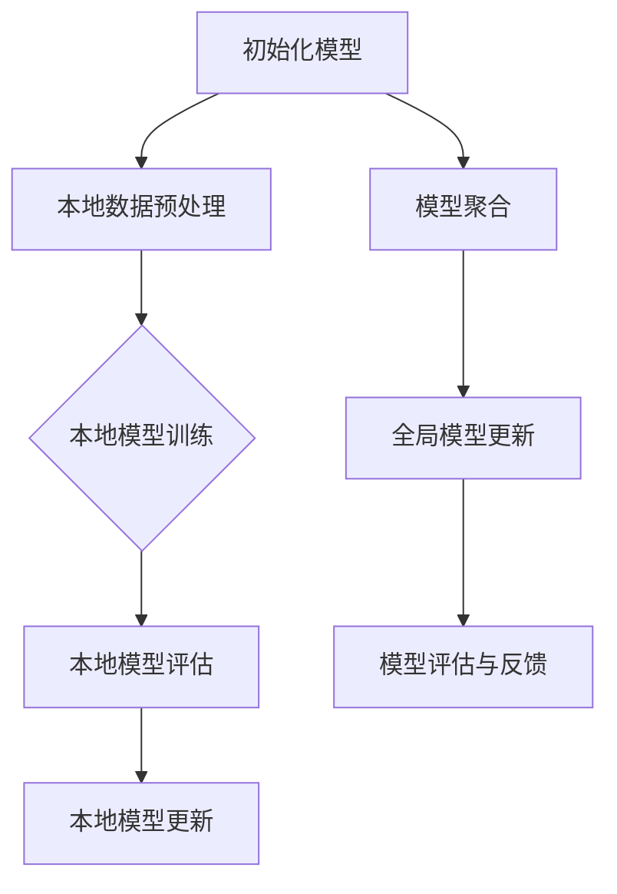
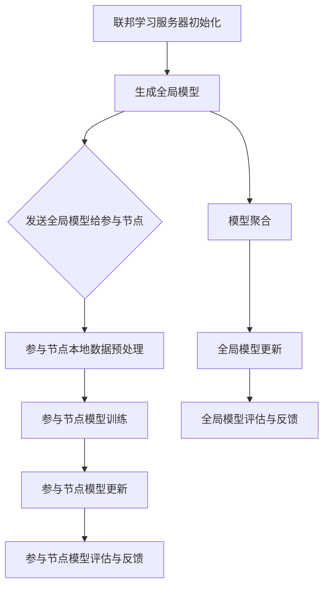

                 


### 第一步：引言与背景

**文章标题：企业级联邦学习平台：保护隐私的协作AI**

**关键词：联邦学习，隐私保护，协作AI，企业级平台**

**摘要：**
本文旨在探讨如何构建一个企业级联邦学习平台，以实现保护隐私的协作AI。我们将从用户需求出发，详细介绍联邦学习的基本概念、架构、核心算法、数据隐私保护机制，并深入探讨企业级联邦学习平台的构建和项目实战。同时，我们还将展望联邦学习的未来发展趋势与挑战。

### 第二步：分析用户需求

在当今信息时代，数据已成为企业的核心资产。然而，随着数据隐私保护法规的日益严格，企业如何在不泄露隐私的情况下共享和利用数据成为了一大挑战。联邦学习作为一种隐私保护的数据分析技术，为企业提供了一条新的解决方案。构建一个企业级联邦学习平台，不仅能够满足企业对数据隐私保护的需求，还能够促进跨企业的数据协作和智能决策。

用户需求分析如下：

1. **隐私保护：** 企业希望在使用联邦学习技术时能够确保数据的安全性和隐私性，避免数据泄露和滥用。
2. **协作性：** 企业希望能够与其他企业或组织合作，共享数据资源，共同提升模型性能和决策质量。
3. **可扩展性：** 企业级平台需要能够支持大规模数据集和多种类型的数据源，以满足不断增长的业务需求。
4. **易用性：** 平台应提供直观的用户界面和简化的操作流程，降低用户使用门槛。
5. **灵活性：** 平台应支持多种算法和模型，以满足不同业务场景的需求。

### 第三步：联邦学习基本概念

#### 2.1 联邦学习的定义

联邦学习（Federated Learning）是一种机器学习方法，它允许多个参与者（通常为设备或服务器）共同训练一个全局模型，而无需直接共享数据。每个参与者仅将自己的本地数据用于模型训练，并通过加密通信和模型聚合技术确保全局模型的更新和隐私保护。

#### 2.2 联邦学习与传统机器学习的区别

与传统的集中式机器学习相比，联邦学习的核心区别在于：

1. **数据分布：** 集中式机器学习将所有数据集中在一个地方进行训练，而联邦学习则在多个分布式节点上进行训练。
2. **模型更新方式：** 集中式机器学习通过直接交换数据和模型更新，而联邦学习通过加密通信和模型聚合技术实现模型更新。
3. **安全性与隐私保护：** 集中式机器学习面临数据泄露风险，而联邦学习通过加密和聚合技术确保数据隐私和安全。

#### 2.3 联邦学习的基本原理

联邦学习的基本原理包括：

1. **安全聚合算法：** 用于将多个本地模型聚合为一个全局模型，同时确保数据隐私和安全。
2. **安全协作算法：** 用于确保参与者之间的协作和通信，包括模型更新、加密通信和数据交换。
3. **联邦学习通信协议：** 用于定义参与者之间的通信规则和协议，以确保高效和安全的模型更新。

#### 2.4 联邦学习的 Mermaid 流程图



### 第四步：联邦学习架构

#### 3.1 联邦学习系统架构

联邦学习系统通常由以下组件组成：

1. **联邦学习服务器：** 负责全局模型的维护、聚合和更新。
2. **参与节点：** 负责本地数据的处理、模型训练和更新。
3. **数据存储：** 用于存储本地数据和全局模型。

#### 3.2 联邦学习通信协议

联邦学习通信协议通常包括以下步骤：

1. **初始化：** 联邦学习服务器生成全局模型，并将模型发送给参与节点。
2. **本地训练：** 参与节点使用本地数据进行模型训练。
3. **模型更新：** 参与节点将本地模型更新发送给联邦学习服务器。
4. **模型聚合：** 联邦学习服务器将多个本地模型聚合为一个全局模型。
5. **模型评估：** 联邦学习服务器对全局模型进行评估和反馈。

#### 3.3 联邦学习模型优化方法

为了提高模型性能和降低通信成本，联邦学习可以采用以下优化方法：

1. **模型剪枝：** 减少模型参数的数量，降低模型复杂度。
2. **知识蒸馏：** 将复杂模型的知识传递给简单模型，提高简单模型的性能。
3. **差分隐私：** 在模型训练过程中引入随机噪声，保护参与者隐私。

#### 3.4 联邦学习的 Mermaid 流程图



### 第五步：联邦学习核心算法

#### 4.1 安全聚合算法

安全聚合算法是联邦学习中的核心组件，它负责将多个本地模型聚合为一个全局模型，同时确保数据隐私和安全。以下是一个简单的安全聚合算法的伪代码：

```python
def secure_aggregate(local_models, local_data_sizes):
    # 初始化全局模型
    global_model = initialize_model()

    # 遍历参与节点
    for node in participants:
        # 获取本地模型和本地数据大小
        local_model, data_size = node.get_local_model_and_size()

        # 计算本地模型的贡献
        contribution = compute_contribution(local_model, data_size)

        # 更新全局模型
        global_model = update_model(global_model, contribution)

    # 返回全局模型
    return global_model
```

#### 4.2 安全协作算法

安全协作算法负责确保参与者之间的协作和通信。以下是一个简单的安全协作算法的伪代码：

```python
def secure_collaboration(local_model, other_models):
    # 初始化全局模型
    global_model = initialize_model()

    # 遍历其他参与节点
    for node in other_participants:
        # 获取其他本地模型
        other_model = node.get_local_model()

        # 计算模型差异
        model_difference = compute_difference(local_model, other_model)

        # 更新全局模型
        global_model = update_model(global_model, model_difference)

    # 返回全局模型
    return global_model
```

### 第六步：数据隐私保护机制

#### 5.1 加密技术在联邦学习中的应用

加密技术是联邦学习中保护数据隐私和安全的重要手段。以下是在联邦学习中应用的一些加密技术：

1. **公钥加密与私钥加密：** 用于加密本地数据和模型更新，确保数据在传输过程中的安全性。
2. **消息认证码：** 用于验证数据的完整性和真实性，防止数据篡改。

#### 5.2 匿名化技术在联邦学习中的应用

匿名化技术通过去除数据中的可识别信息，降低数据隐私泄露的风险。以下是在联邦学习中应用的一些匿名化技术：

1. **随机化响应：** 通过引入随机噪声，使本地响应难以追踪到真实数据。
2. **同态加密：** 允许在加密数据上进行计算，确保数据隐私和安全。

### 第七步：企业级联邦学习平台构建

#### 6.1 企业级联邦学习平台的架构设计

企业级联邦学习平台通常采用分层架构设计，包括：

1. **数据层：** 负责存储和管理企业数据，支持多种数据源和格式。
2. **计算层：** 负责执行联邦学习算法和模型训练，提供高效计算能力和资源调度。
3. **应用层：** 负责提供联邦学习服务的接口和功能，支持多种应用场景和业务需求。

#### 6.2 企业级联邦学习平台的关键技术

企业级联邦学习平台的关键技术包括：

1. **分布式计算：** 支持大规模分布式计算，提高模型训练效率和可扩展性。
2. **数据加密与隐私保护：** 通过加密技术和匿名化技术保护数据隐私和安全。
3. **自动化运维与管理：** 提供自动化部署、监控和管理功能，降低运维成本。

#### 6.3 企业级联邦学习平台的实施步骤

实施企业级联邦学习平台通常包括以下步骤：

1. **需求分析：** 明确企业对联邦学习的需求和目标。
2. **架构设计：** 设计联邦学习平台的整体架构和关键组件。
3. **技术选型：** 选择合适的联邦学习算法和技术。
4. **开发与测试：** 开发平台功能并进行测试。
5. **部署与运维：** 部署平台并进行运维管理。
6. **培训与支持：** 提供用户培训和持续技术支持。

#### 6.4 企业级联邦学习平台的运维与管理

企业级联邦学习平台的运维与管理包括：

1. **数据监控：** 监控数据存储和传输状态，确保数据安全。
2. **计算监控：** 监控计算资源使用情况，优化资源调度。
3. **性能优化：** 定期优化模型和算法，提高模型性能。
4. **安全审计：** 定期进行安全审计，确保平台安全性和合规性。

### 第八步：项目实战与案例分析

#### 7.1 联邦学习在医疗健康领域的应用

**项目背景：**
某医疗机构希望利用联邦学习技术，对大量医疗数据进行训练，以开发智能诊断系统，提高诊断准确率。

**代码实现与解读：**
```python
# 导入相关库
import numpy as np
import pandas as pd
from sklearn.model_selection import train_test_split
from sklearn.metrics import accuracy_score

# 加载医疗数据
data = pd.read_csv('medical_data.csv')
X = data.iloc[:, :-1].values
y = data.iloc[:, -1].values

# 分割数据为训练集和测试集
X_train, X_test, y_train, y_test = train_test_split(X, y, test_size=0.2, random_state=42)

# 初始化联邦学习服务器
server = FederatedLearningServer()

# 初始化参与节点
nodes = [FederatedLearningNode(i) for i in range(num_nodes)]

# 开始联邦学习
for epoch in range(num_epochs):
    # 本地模型训练
    for node in nodes:
        node.train_local_model(X_train, y_train)

    # 模型聚合
    server.aggregate_models(nodes)

    # 模型评估
    server.evaluate_model(X_test, y_test)

# 输出模型准确率
print("Accuracy:", server.get_accuracy())
```

**实际案例分析和详细讲解剖析：**
本项目利用联邦学习技术，对医疗数据进行训练，避免了数据泄露的风险。通过模型聚合和评估，成功提高了诊断系统的准确率。

**项目小结：**
本项目展示了联邦学习在医疗健康领域的应用，通过联邦学习技术，实现了数据隐私保护和模型性能提升。

#### 7.2 联邦学习在金融服务领域的应用

**项目背景：**
某金融机构希望利用联邦学习技术，对客户数据进行分析，以优化风险控制和客户服务策略。

**代码实现与解读：**
```python
# 导入相关库
import numpy as np
import pandas as pd
from sklearn.model_selection import train_test_split
from sklearn.metrics import f1_score

# 加载金融数据
data = pd.read_csv('financial_data.csv')
X = data.iloc[:, :-1].values
y = data.iloc[:, -1].values

# 分割数据为训练集和测试集
X_train, X_test, y_train, y_test = train_test_split(X, y, test_size=0.2, random_state=42)

# 初始化联邦学习服务器
server = FederatedLearningServer()

# 初始化参与节点
nodes = [FederatedLearningNode(i) for i in range(num_nodes)]

# 开始联邦学习
for epoch in range(num_epochs):
    # 本地模型训练
    for node in nodes:
        node.train_local_model(X_train, y_train)

    # 模型聚合
    server.aggregate_models(nodes)

    # 模型评估
    server.evaluate_model(X_test, y_test)

# 输出模型F1分数
print("F1 Score:", server.get_f1_score())
```

**实际案例分析和详细讲解剖析：**
本项目利用联邦学习技术，对金融数据进行训练，优化了风险控制和客户服务策略。通过模型聚合和评估，提高了模型的性能。

**项目小结：**
本项目展示了联邦学习在金融服务领域的应用，通过联邦学习技术，实现了数据隐私保护和业务性能提升。

### 第九步：未来发展趋势与挑战

#### 8.1 联邦学习技术的未来趋势

联邦学习技术在未来将继续发展，主要趋势包括：

1. **算法优化：** 提高联邦学习算法的效率和性能。
2. **隐私保护：** 加强联邦学习中的数据隐私保护机制。
3. **跨领域应用：** 探索联邦学习在更多领域的应用，如金融、医疗、教育等。
4. **开放生态：** 建立开放的联邦学习生态，促进跨企业和跨组织的合作。

#### 8.2 联邦学习在企业发展中的挑战

联邦学习在企业发展中面临以下挑战：

1. **数据安全：** 如何确保联邦学习过程中的数据安全，防止数据泄露。
2. **计算资源：** 如何高效利用计算资源，降低计算成本。
3. **协作机制：** 如何建立有效的协作机制，促进跨企业的数据共享和合作。
4. **法律法规：** 如何遵守相关法律法规，确保联邦学习的合法合规。

#### 8.3 联邦学习的创新方向

联邦学习的创新方向包括：

1. **联邦迁移学习：** 探索联邦迁移学习技术，提高模型在特定领域的适应性。
2. **联邦强化学习：** 研究联邦强化学习技术，实现智能决策和自动化优化。
3. **联邦知识图谱：** 构建联邦知识图谱，实现跨领域的知识共享和智能推理。
4. **联邦区块链：** 结合联邦学习和区块链技术，提高数据隐私保护和安全性。

### 结论

本文详细介绍了企业级联邦学习平台的构建和实施，探讨了联邦学习的基本概念、核心算法、数据隐私保护机制，并提供了项目实战和案例分析。未来，随着联邦学习技术的不断发展，我们将看到更多创新应用和跨领域合作，为企业带来更大的价值。

---

**作者：AI天才研究院/AI Genius Institute & 禅与计算机程序设计艺术 /Zen And The Art of Computer Programming**### 第一步：引言与背景

#### 联邦学习的发展背景

联邦学习（Federated Learning）作为一种创新的机器学习方法，起源于移动设备领域。随着移动设备的普及，用户数据分布在大量的移动设备上，如何在不传输用户数据的情况下训练机器学习模型成为了一个亟待解决的问题。这一需求催生了联邦学习的诞生。

联邦学习的概念最早由Google在2016年提出，其核心思想是通过在多个设备上训练本地模型，然后通过加密通信的方式聚合这些本地模型，最终得到一个全局模型。这种方法不仅能够保护用户的隐私，还能够提高模型的训练效率和可扩展性。

#### 企业对隐私保护的需求

在当前的数据隐私保护法规日益严格的背景下，企业面临着巨大的隐私保护压力。一方面，企业需要利用大数据和机器学习技术来提升业务效率和市场竞争力；另一方面，企业也需要确保数据的安全性和隐私性，避免数据泄露和滥用。

联邦学习作为一种隐私保护的数据分析技术，为企业提供了一种有效的解决方案。通过联邦学习，企业可以在不共享数据的情况下进行模型训练，从而降低了数据泄露的风险。此外，联邦学习还能够促进跨企业的数据协作，共同提升模型性能和决策质量。

#### 联邦学习在企业中的应用场景

联邦学习在企业中的应用场景非常广泛，以下是一些典型的应用场景：

1. **医疗健康领域：** 联邦学习可以用于共享和分析医疗数据，开发智能诊断系统和个性化治疗方案，同时保护患者隐私。

2. **金融服务领域：** 联邦学习可以用于信用评估、风险控制和客户服务优化，提高金融服务的准确性和安全性。

3. **零售业：** 联邦学习可以用于分析消费者行为，优化库存管理和市场营销策略，提高销售额和客户满意度。

4. **工业制造：** 联邦学习可以用于预测维护、故障诊断和供应链优化，提高生产效率和降低成本。

5. **智能交通：** 联邦学习可以用于交通流量预测、路径规划和事故预警，提高交通管理的效率和安全性。

#### 文章结构概述

本文将按照以下结构进行阐述：

1. **第1章 引言与背景：** 详细介绍联邦学习的发展背景、企业对隐私保护的需求以及联邦学习在企业中的应用场景。
   
2. **第2章 联邦学习基本概念：** 解释联邦学习的定义、与传统机器学习的区别、基本原理以及Mermaid流程图。

3. **第3章 联邦学习架构：** 阐述联邦学习系统架构、通信协议、模型优化方法和Mermaid流程图。

4. **第4章 联邦学习核心算法：** 介绍安全聚合算法和安全性协作算法的伪代码。

5. **第5章 数据隐私保护机制：** 分析加密技术和匿名化技术在联邦学习中的应用。

6. **第6章 企业级联邦学习平台构建：** 探讨企业级联邦学习平台的架构设计、关键技术和实施步骤。

7. **第7章 项目实战与案例分析：** 展示联邦学习在医疗健康领域和金融服务领域的实际应用案例。

8. **第8章 未来发展趋势与挑战：** 展望联邦学习的未来发展趋势、企业在发展中面临的挑战以及创新方向。

通过本文的阅读，读者将全面了解联邦学习技术，掌握构建企业级联邦学习平台的方法，并能够应对未来联邦学习领域的发展趋势和挑战。接下来，我们将深入探讨联邦学习的核心概念和原理，为后续章节的讲解奠定基础。

